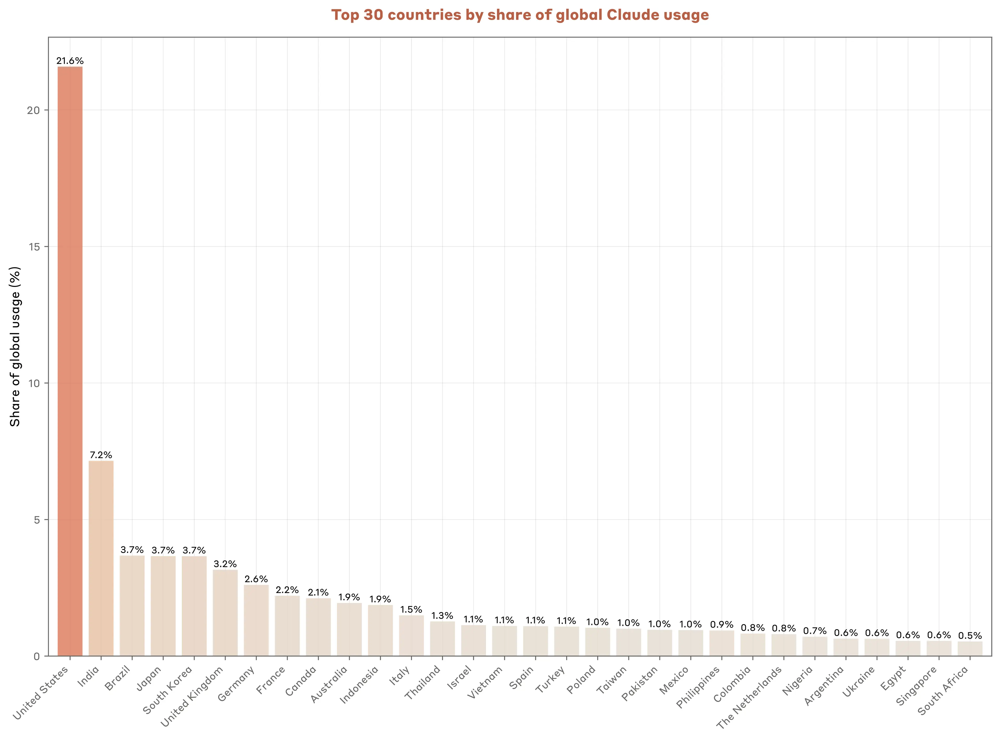
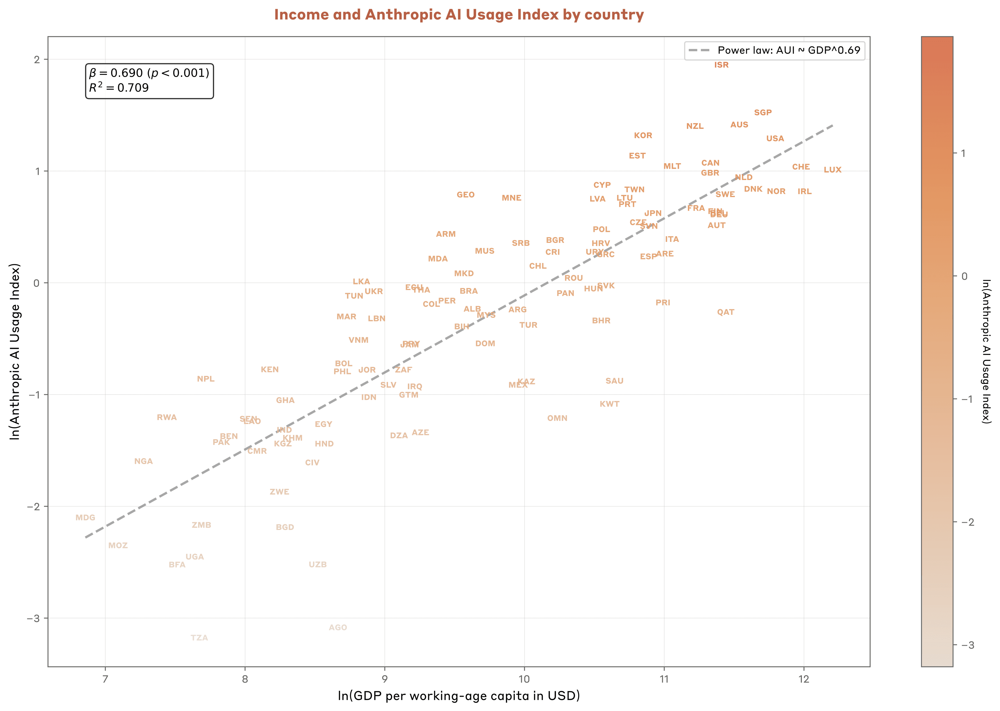
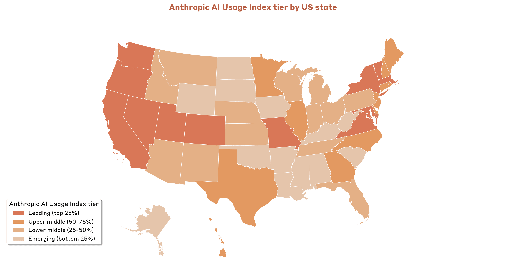
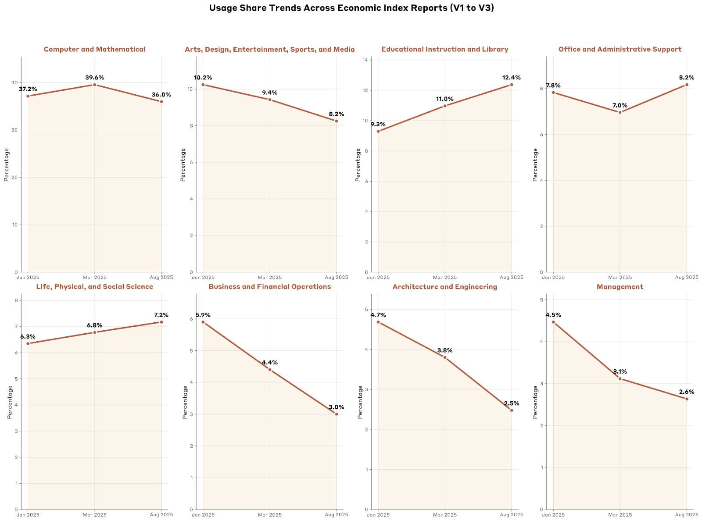
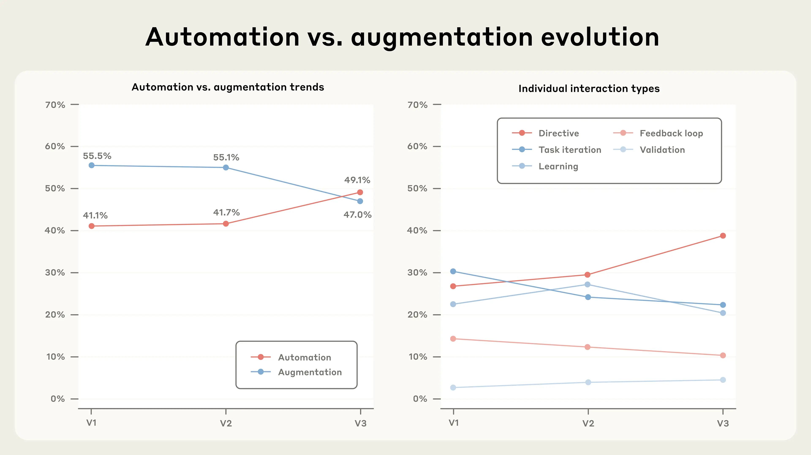
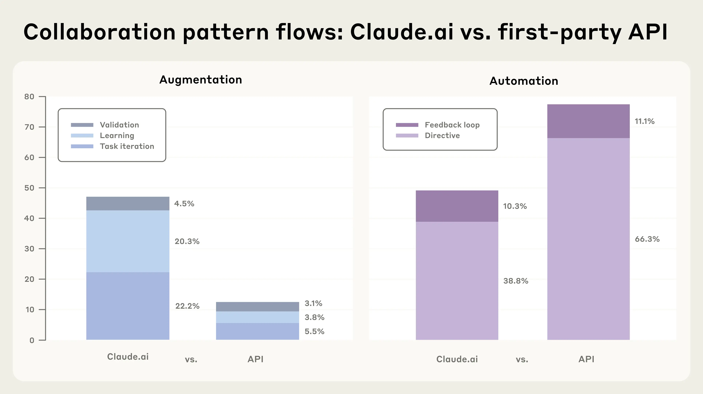
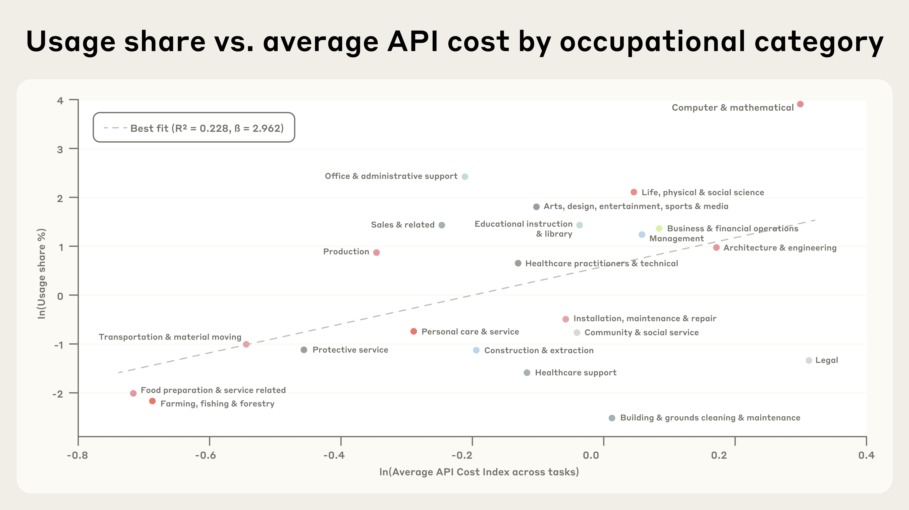

# Anthropic 经济指数：追踪 AI 在美国与全球经济中的角色（中英对照）

> 原文标题：Anthropic Economic Index: Tracking AI's role in the US and global economy
> 原文链接：https://www.anthropic.com/research/economic-index-geography
> 原文作者：Anthropic
> 发布日期：2025-09-15
> **翻译模型：** GLM-5.3-Flash
> **评分：** ★★★★☆（4/5，强推荐）—— AEI 地理维度首发：使用强度与人均收入强相关（国家 0.7/州 1.8），directive 自动化 27%→39%，API 企业使用 77% 自动化
> 排版：每段英文原文在前，中文翻译紧随其后。默认收录正文主体。

---

Travel planning in Hawaii, scientific research in Massachusetts, and building web applications in India. On the face of it, these three activities share very little in common. But it turns out that they're the particular uses of Claude that are some of the most overrepresented in each of these places.

在夏威夷规划旅行，在马萨诸塞做科学研究，在印度搭建 Web 应用。表面上看，这三件事几乎毫无共同之处。但事实是，它们恰恰是在这三个地方被「超额使用」的 Claude 特色用途。

That doesn't mean these are the most popular tasks: software engineering is still by far in the lead in almost every state and country in the world. Instead, it means that people in Massachusetts have been more likely to ask Claude for help with scientific research than people elsewhere – or, for instance, that Claude users in Brazil appear to be particularly enthusiastic about languages: they use Claude for translation and language-learning about six times more than the global average.

这并不意味着它们是最流行的任务：软件工程在几乎每个州和国家仍然遥遥领先。它的意思是：马萨诸塞的人比其他地方的人更倾向请 Claude 协助科学研究；又比如，巴西的 Claude 用户似乎对语言格外热衷——他们用 Claude 做翻译与语言学习的频次约为全球平均的六倍。

These are statistics we found in our third Anthropic Economic Index report. In this latest installment, we've expanded our efforts to document the early patterns of AI adoption that are beginning to reshape work and the economy. We measure how Claude is being used differently…

这些是我们第三份 Anthropic 经济指数报告中的统计。在本期中，我们扩展了记录「AI 采用早期模式」的工作——这些模式正开始重塑工作与经济。我们度量 Claude 的使用在不同维度上的差异……

- …within the US: we provide the first-ever detailed assessment of how AI use differs between US states. We find that the composition of states' economies informs which states use Claude the most per capita – and, surprisingly, that the very highest-use states aren't the ones where coding dominates.
- …across different countries: our new analysis finds that countries' use of Claude is strongly correlated with income, and that people in lower-use countries use Claude to automate work more frequently than those in higher-use ones.
- …over time: we compare our latest data with December 2024-January 2025 and February–March 2025. We find that the proportion of 'directively' automated tasks increased sharply from 27% to 39%, suggesting a rapid increase in AI's responsibility (and in users' trust).
- …and by business users: we now include anonymized data from Anthropic's first-party API customers (in addition to users of Claude.ai), allowing us to analyze businesses' interactions for the first time. We find that API users are significantly more likely to automate tasks with Claude than consumers are, which suggests that major labor market implications could be on the horizon.

- ……美国各州内部：我们首次给出 AI 使用在州际差异上的详细评估。我们发现各州的经济构成决定了哪些州人均使用 Claude 最多——而且令人意外的是，使用强度最高的州并非编程主导的州。
- ……不同国家之间：新分析发现，各国对 Claude 的使用与收入强相关，而且低使用强度国家的人比高使用强度国家的人更频繁地用 Claude 自动化工作。
- ……随时间推移：我们把最新数据与 2024 年 12 月–2025 年 1 月、2025 年 2–3 月两期比较，发现「指令式」（directive）自动化任务的比例从 27% 急升至 39%，提示 AI 承担的责任（以及用户的信任）在快速增加。
- ……以及企业用户：我们现在纳入了 Anthropic 一方 API 客户的匿名数据（Claude.ai 用户之外），首次得以分析企业的交互。我们发现 API 用户用 Claude 自动化任务的倾向显著高于消费者，这暗示重大劳动力市场影响可能已在酝酿。

We summarize the report below. In addition, we've designed an interactive website where you can explore our data yourself. For the first time, you can search for trends and results in Claude.ai use across every US state and all occupations we track, to see how AI is used where you live or by people in similar jobs. Finally, if you'd like to build on our analysis, we've made our dataset openly available, alongside the data from our previous Economic Index reports.

以下是报告摘要。此外，我们设计了一个交互式网站，你可以亲自探索我们的数据：首次可以检索美国每一个州、以及我们追踪的所有职业的 Claude.ai 使用趋势与结果，看看你所在的地区、与你职业相近的人如何使用 AI。最后，如果你想在我们的分析之上继续研究，我们已把数据集与既往各期经济指数报告的数据一并公开。

## 地理（Geography）

We've expanded the Anthropic Economic Index to include geographic data. Below we cover what we've learned about how Claude is used across countries and US states.

我们为 Anthropic 经济指数扩展了地理数据。下文介绍我们关于 Claude 在各国与美国各州使用情况的发现。

### 各国之间（Across countries）

The US uses Claude far more than any other nation. India is in second place, followed by Brazil, Japan, and South Korea, each with similar shares.

美国对 Claude 的使用远超其他任何国家。印度位列第二，随后是巴西、日本与韩国，份额相近。

> Top 30 countries by share of global Claude use: the US leads with 21.6%.

However, there is huge variation in population size across these countries. To account for this, we adjust each country's share of Claude.ai use by its share of the world's working population. This gives us our Anthropic AI Usage Index, or AUI. Countries with an AUI greater than 1 use Claude more often than we'd expect based on their working-age population alone, and vice-versa.

然而，这些国家的人口规模差异巨大。为修正这一点，我们用各国占全球劳动人口的比例去调整其 Claude.ai 使用份额，得到 Anthropic AI 使用指数（AUI）。AUI 大于 1 的国家，其 Claude 使用频次高于仅按劳动年龄人口预期的水平，反之亦然。

> The twenty countries that score highest on our Anthropic AI Usage Index: Israel, Singapore, Australia, New Zealand, and South Korea are the top five.

From the AUI data, we can see that some small, technologically advanced countries (like Israel and Singapore) lead in Claude adoption relative to their working-age populations. This might to a large degree be explained by income: we found a strong correlation between GDP per capita and the Anthropic AI Usage Index (a 1% higher GDP per capita was associated with a 0.7% higher AUI). This makes sense: the countries that use Claude most often generally also have robust internet connectivity, as well as economies oriented around knowledge work rather than manufacturing. But it does raise a question of economic divergence: previous general-purpose technologies, like electrification or the combustion engine, led to both vast economic growth and a great divergence in living standards around the world. If the effects of AI prove to be largest in richer countries, this general-purpose technology might have similar economic implications.

从 AUI 数据可以看到，一些科技发达的小国（如以色列与新加坡）按劳动年龄人口衡量的 Claude 采用率领先。这在很大程度上可以由收入解释：我们发现人均 GDP 与 Anthropic AI 使用指数强相关（人均 GDP 每 1% 的差距对应 AUI 0.7% 的差距）。这说得通：最常使用 Claude 的国家通常互联网基础设施扎实，经济也围绕知识工作而非制造业展开。但这引出了经济分化的问题：以往的通用技术——电气化、内燃机——既带来了巨大的经济增长，也造成了全球生活水平的巨大分化。如果 AI 的效应在富裕国家最大，这项通用技术或许会有类似的经济含义。

> Graph showing that Claude use per capita is positively correlated with income per capita across countries.

### 美国国内的模式（Patterns within the United States）

The link between per capita GDP and per capita use of Claude also holds when comparing between US states. In fact, use rises more quickly within income here than across countries: a 1% higher per capita GDP inside the US is associated with a 1.8% higher population-adjusted use of Claude. That said, income actually has less explanatory power within the US than across countries, as there's much higher variance within the overall trend. That is: other factors, beyond income, must explain more of the variation in population-adjusted use.

人均 GDP 与人均 Claude 使用的关联在美国各州之间同样成立。事实上，州际的收入弹性高于国家之间：美国国内人均 GDP 每 1% 的差距对应人口调整后使用量 1.8% 的差距。话虽如此，收入在美国国内的实际解释力低于国家之间，因为总体趋势内的方差大得多。也就是说：收入之外的其他因素必定解释了更多人囗调整后使用的变异。

What else could explain this adoption gap? Our best guess is that it's differences in the composition of states' economies. The highest AUI in the US is the District of Columbia (3.82), where the most disproportionately frequent uses of Claude are editing documents and searching for information, among other tasks associated with knowledge work in DC. Similarly, coding-related tasks are especially common in California (the state with the third-highest AUI overall), and finance-related tasks are especially common in New York (which comes in fourth).[^1] Even among states with lower population-adjusted use of Claude, like Hawaii, use is closely correlated to the structure of the economy: people in Hawaii request Claude's assistance for tourism-related tasks at twice the rate of the rest of America. Our interactive website contains plenty of other statistics like these.

还有什么能解释这种采用差距？我们最好的猜测是各州经济构成的差异。美国 AUI 最高的是华盛顿特区（3.82），那里超额使用最频繁的 Claude 用途是编辑文档与检索信息等与特区知识工作相关联的任务。类似地，编程相关任务在加州（AUI 总排名第三的州）格外常见，金融相关任务在纽约（排名第四）格外常见。[^1] 即便在人口调整后使用量较低的州（如夏威夷），使用也与经济结构紧密相关：夏威夷人请 Claude 协助旅游相关任务的比率是美国其他地区的两倍。我们的交互式网站还有许多这类统计。

> Graph showing US states' Claude adoption relative to their working age populations, with Utah and DC in the lead.

## Claude 使用的趋势（Trends in Claude use）

We've been tracking how people use Claude since December 2024. We use a privacy-preserving classification method that categorizes anonymized conversation transcripts into task groups defined by O*NET, a US government database that classifies jobs and the tasks associated with them.[^2] By doing this, we can analyze both how the tasks that people give Claude have changed since last year, and how the ways people choose to collaborate—how much oversight and input into Claude's work they choose to have—have changed too.

自 2024 年 12 月以来，我们一直在追踪人们如何使用 Claude。我们采用一种隐私保护的分类方法，把匿名对话转录归入 O*NET（美国政府的工作与任务分类数据库）定义的任务组。[^2] 由此，我们既能分析人们交给 Claude 的任务自去年以来如何变化，也能分析人们选择的协作方式——愿意对 Claude 的工作施加多少监督与输入——如何变化。

### 任务（Tasks）

Since December 2024, computer and mathematical uses of Claude have predominated among our categories, representing around 37-40% of conversations.

自 2024 年 12 月以来，「计算机与数学」类用途在我们所有类别中占据主导，约占对话量的 37–40%。

But a lot has changed. Over the past nine months, we've seen consistent growth in "knowledge-intensive" fields. For example, educational instruction tasks have risen by more than 40 percent (from 9% to 13% of all conversations), and the share of tasks associated with the physical and social sciences has increased by a third (from 6% to 8%). In the meantime, the relative frequency of traditional business tasks has declined: management-related tasks have fallen from 5% of all conversations to 3%, and the share of tasks related to business and financial operations has halved, from 6% to 3%. (In absolute terms, of course, the number of conversations in each category has still risen significantly.)

但变化很大。过去九个月里，「知识密集」领域持续增长：例如教育教学类任务上升超过 40%（占全部对话的比例从 9% 升至 13%），与自然科学与社会科学相关的任务份额增长了三分之一（从 6% 到 8%）。与此同时，传统商务类任务的相对频率在下降：管理类任务从全部对话的 5% 降至 3%，商业与金融运营相关任务的份额减半，从 6% 降到 3%。（当然，按绝对值计，每个类别的对话数都仍在显著上升。）

> Changes in Claude use over time, showing increases in use for scientific and educational tasks, and decreases for arts, business, and architecture uses.

The overall trend is noisy, but generally, as the GDP per capita of a country increases, the use of Claude shifts away from tasks in the Computer and Mathematical occupation group, and towards a diverse range of other activities, like education, art and design; office and administrative support; and the physical and social sciences. Compare the trend line in the first graph below to the remaining three:

总体趋势虽嘈杂，但大致呈现：随着一国人均 GDP 上升，Claude 的使用会从「计算机与数学」职业组的任务，转向教育、艺术与设计、办公与行政支持、自然科学与社会科学等更多样的活动。把下图中第一张的趋势线与后三张比较：

> Occupation group shares vs. the Anthropic AI usage index, for computer and mathematical, educational instruction, arts, and office and administrative tasks.

All that said, software development remains the most common use in every single country we track. The picture looks similar in the US, although our sample size limits our ability to explore in more detail how the task mix varies with adoption rates.

尽管如此，在我们追踪的每一个国家，软件开发都仍是最常见的用途。美国的情况类似，只是样本量限制了我们就「任务组合如何随采用率变化」做更细致探索的能力。

### 交互模式（Patterns of interaction）

As we've discussed previously, we generally distinguish between tasks that involve automation (in which AI directly produces work with minimal user input) and augmentation (in which the user and AI collaborate to get things done). We further break automation down into directive and feedback loop interactions, where directive conversations involve the minimum of human interaction, and in feedback loop tasks, humans relay real-world outcomes back to the model. We also break augmentation down into learning (asking for information or explanations), task iteration (working with Claude collaboratively), and validation (asking for feedback).

如我们此前讨论的，我们大体区分涉及自动化的任务（AI 以最少用户输入直接产出工作）与增强（用户与 AI 协作完成任务）。我们又把自动化细分为指令式（directive）与反馈回路（feedback loop）交互：指令式对话所需的人际交互最少，而反馈回路任务中人类会把现实世界的结果回传给模型。增强也细分为学习（请求信息或解释）、任务迭代（与 Claude 协作推进）与验证（请求反馈）。

Since December 2024, we've found that the share of directive conversations has risen sharply, from 27% to 39%. The shares of other interaction patterns (particularly learning, task iteration, and feedback loops) have fallen slightly as a result. This means that for the first time, automation (49.1%) has become more common than augmentation (47%) overall. One potential explanation for this is that AI is rapidly winning users' confidence, and becoming increasingly responsible for completing sophisticated work.

自 2024 年 12 月以来，我们发现指令式对话的份额从 27% 急升至 39%。其他交互模式（尤其是学习、任务迭代与反馈回路）的份额因此略有下降。这意味着自动化（49.1%）首次在总体上超过了增强（47%）。一个可能的解释是：AI 正迅速赢得用户的信任，并日益承担起完成复杂工作的责任。

This could be the result of improved model capabilities. (In December 2024, when we first collected data for the Economic Index, the latest version of Claude was Sonnet 3.6.) As models get better at anticipating what users want and at producing high-quality work, users are likely more willing to trust the model's outputs at the first attempt.

这可能是模型能力提升的结果。（2024 年 12 月我们首次为经济指数收集数据时，Claude 的最新版本还是 Sonnet 3.6。）随着模型更善于预判用户想要什么、产出高质量工作，用户更愿意在第一次尝试时就信任模型的输出。

> Graphs showing automation overtaking augmentation from our first to third Index reports.

Perhaps surprisingly, in countries with higher Claude use per capita, Claude's uses tend towards augmentation, whereas people in lower-use countries are much more likely to prefer automation. Controlling for the mix of tasks in question, a 1% increase in population-adjusted use of Claude is correlated with a roughly 3% reduction in automation. Similarly, increases in population-adjusted Claude use are associated with a shift away from automation (as in the chart below), not towards.

也许出人意料：人均 Claude 使用更高的国家，其用途偏向增强；而低使用国家的人更偏好自动化。在控制任务构成的条件下，人口调整后的 Claude 使用每增加 1%，自动化占比约下降 3%。类似地，人口调整后使用量的增加伴随的是（如下图所示的）远离自动化、而非趋向自动化。

> Graph showing that countries with higher Claude use per capita tend to have a lower share of automated tasks.

We're not yet sure why this is. It could be because early adopters in each country feel more comfortable allowing Claude to automate tasks, or it could be down to other cultural and economic factors.

我们尚不确定原因。可能因为各国的早期采用者更放心让 Claude 自动化任务，也可能与其他文化及经济因素有关。

## 企业（Businesses）

Using the same privacy-preserving methodology we use for conversations on Claude.ai, we have begun sampling interactions from a subset of Anthropic's first-party API customers, in a first-of-its-kind analysis.[^3] API customers, who tend to be businesses and developers, use Claude very differently to those who access it through Claude.ai: they pay per token, rather than a fixed monthly subscription, and can make requests through their own programs.

沿用与 Claude.ai 对话相同的隐私保护方法论，我们开始从 Anthropic 一方 API 客户的一个子集抽样交互，这是一项开创性的分析。[^3] API 客户多为企业与开发者，他们使用 Claude 的方式与通过 Claude.ai 访问的用户很不一样：他们按 token 付费而非固定月费，并可以通过自己的程序发起请求。

These customers' use of Claude is especially concentrated in coding and administrative tasks: 44% of the API traffic in our sample maps to computer or mathematical tasks, compared to 36% of tasks on Claude.ai. (As it happens, around 5% of all API traffic focuses specifically on developing and evaluating AI systems.) This is offset by a smaller proportion of conversations related to educational occupations (4% in the API relative to 12% on Claude.ai), and arts and entertainment (5% relative to 8%).

这些客户对 Claude 的使用尤其集中于编码与行政任务：样本中 44% 的 API 流量对应计算机或数学类任务，而 Claude.ai 上为 36%。（碰巧的是，全部 API 流量中约 5% 专门用于开发与评估 AI 系统。）与之相抵的是教育类职业对话（API 为 4%，Claude.ai 为 12%）与艺术娱乐类（5% 对 8%）占比更小。

We also find that our API customers use Claude for task automation much more often than Claude.ai users. 77% of our API conversations show automation patterns, of which the vast majority are directive, while just 12% show augmentation. On Claude.ai, the split is almost even. This could have significant economic implications: in the past, the automation of tasks has been associated with large economic transitions, as well as major productivity gains.

我们还发现，API 客户用 Claude 做任务自动化的频率远高于 Claude.ai 用户：API 对话中 77% 呈自动化模式（其中绝大多数是指令式），仅 12% 呈增强模式；而 Claude.ai 上的比例几乎对半。这可能具有重要的经济含义：过去，任务的自动化总是与大规模经济转型及重大生产率收益相伴。

> Graph showing a much higher share of augmentative uses on Claude.ai than the API, and vice-versa for automative uses.

Finally, given how API use is paid for, we can also explore whether differences in the cost of tasks (caused by differences in the number of tokens they consume) affect which tasks businesses choose to "buy". Here, we find a positive correlation between price and use: higher-cost task categories tend to see more frequent use, as in the graph below. This suggests to us that fundamental model capabilities, and the economic value generated by the models, matters more to businesses than the cost of completing the task itself.

最后，鉴于 API 使用按量计费，我们还可以探究任务成本差异（由消耗 token 数差异导致）是否会影响企业选择「购买」哪些任务。这里我们发现价格与使用正相关：成本更高的任务类别使用反而更频繁，如下图所示。这向我们提示：比起完成任务本身的成本，企业更看重模型的基础能力与模型创造的经济价值。

> Graph showing occupational categories' usage share vs. average API cost.

## 结论（Conclusion）

The Economic Index is designed to provide an early, empirical assessment of how AI is affecting people's jobs and the economy. What have we found so far?

经济指数旨在为「AI 如何影响人们的工作与经济」提供早期的实证评估。至今我们发现了什么？

Across each of the measures we cover in this report, the adoption of AI appears remarkably uneven. People in higher-income countries are more likely to use Claude, more likely to seek collaboration rather than automation, and more likely to pursue a breadth of uses beyond coding. Within the US, AI use seems to be strongly influenced by the dominant industries in local economies, from technology to tourism. And businesses are more likely to entrust Claude with agency and autonomy than consumers are.

在本报告覆盖的每一项度量上，AI 的采用都极不均衡。高收入国家的人更可能使用 Claude，更倾向寻求协作而非自动化，也更可能探索编码之外的广泛用途。在美国国内，AI 使用似乎深受地方经济主导产业的影响——从科技到旅游。而企业比消费者更愿意把能动性与自主权交给 Claude。

Beyond the fact of unevenness, it's especially notable to us that directive automation has become much more common in conversations on Claude.ai over the past nine months. The nature of people's use of Claude is evidently still being defined: we're still collectively deciding how much confidence we have in AI tools, and how much responsibility we should give them. So far, though, it looks like we're becoming increasingly comfortable with AI, and willing to let it work on our behalf. We're looking forward to revisiting this analysis over time, to see where—or, indeed, if—users' choices settle as AI models improve.

除不均衡之外，尤其值得注意的是：过去九个月，指令式自动化在 Claude.ai 对话中变得普遍得多。人们使用 Claude 的方式显然仍在定型：我们仍在共同决定对 AI 工具有多少信心、该给它们多少责任。不过就目前来看，我们正变得越来越放心把工作交给 AI 代劳。我们期待随时间回访这项分析，看看随着模型进步，用户的选择会在哪里——或者说是否——稳定下来。

If you'd like to explore our data yourself, you can do so on our dedicated Anthropic Economic Index website, which contains interactive visualizations of our country, state, and occupational data. We'll update this website with more data in future, so you can continue to track the evolution of AI's effects on jobs and the economy in the ways that interest you.

如果你想亲自探索数据，可以访问我们的 Anthropic 经济指数专门网站，其中有国家、州与职业数据的交互式可视化。未来我们会更新更多数据，你可以按自己感兴趣的方式持续追踪 AI 对工作与经济影响的演化。

Our full report is available here. We hope it helps policymakers, economists and others more effectively prepare for the economic opportunities and risks that AI provides.

完整报告见此处。我们希望它能帮助政策制定者、经济学家与其他人更有效地准备应对 AI 带来的经济机遇与风险。

## 开放数据（Open data）

As with our past reports, we're releasing a comprehensive dataset for this release, including geographic data, task-level use patterns, automation/augmentation breakdowns by task, and an overview of API use. Data are available for download at the Anthropic Economic Index website.

与既往报告一样，本期我们发布了一份综合数据集，包括地理数据、任务级使用模式、分任务的自动化/增强拆分，以及 API 使用概览。数据可在 Anthropic 经济指数网站下载。

## 与我们合作（Work with us）

If you're interested in working at Anthropic to help build the systems powering this research, we encourage you to apply for our Research Engineer role.

如果你有兴趣加入 Anthropic、参与构建支撑这项研究的系统，欢迎申请我们的研究工程师职位。

---

[^1]: As for Utah, in second: when further investigating Utah's activity, we discovered that a notable fraction of its use appeared to be associated with indicators of coordinated abuse – which is also reflected in Utah's much higher "directive" automation score than average. However, we ran robustness checks and believe that this activity is not driving the results. / 至于排名第二的犹他州：进一步调查其活动后发现，相当一部分使用似乎与协同滥用的指标相关——这也体现在犹他州「指令式」自动化得分远高于平均值上。不过我们做了稳健性检验，认为这类活动并未主导结果。
[^2]: We supplement this with a 'bottom-up' task classification in which Claude classifies conversations according to its own taxonomy, in order to address any gaps in the O*NET categories. The full details of our privacy-preserving analysis methodology are available here. / 我们辅以一种「自下而上」的任务分类——由 Claude 按其自己的分类体系对对话归类——以弥补 O*NET 类别的缺口。隐私保护分析方法论的完整细节见此处。
[^3]: Data in this section covers 1 million transcripts from August 2025, sampled randomly from a pool of 1P API customers constituting roughly half of our 1P API usage. We continue to manage data according to our privacy and retention policies, and our analysis is consistent with our terms, policies, and contractual agreements. / 本节数据涵盖 2025 年 8 月的 100 万份转录，从约占我们一方 API 用量一半的一方 API 客户池中随机抽样。我们继续依照隐私与保留政策管理数据，分析符合我们的条款、政策与合同约定。
