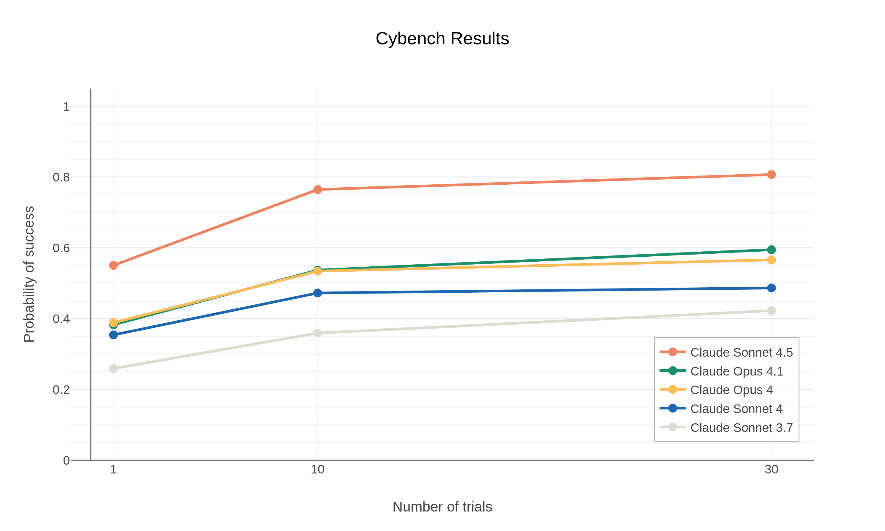
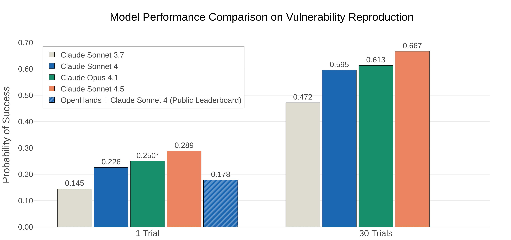
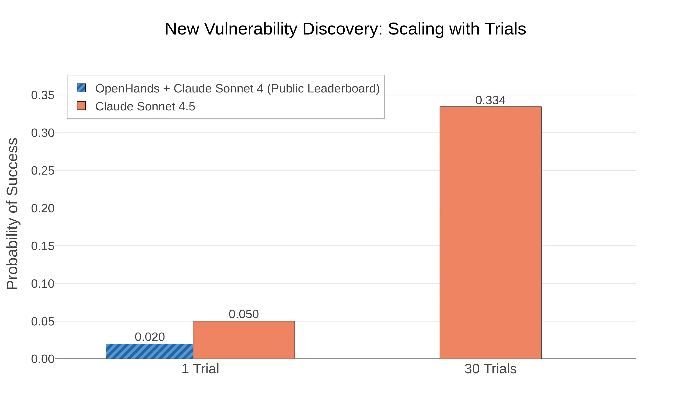

# 为网络防守者打造 AI（中英对照）

> 原文标题：Building AI for cyber defenders
> 原文链接：https://www.anthropic.com/research/building-ai-cyber-defenders
> 原文作者：Anthropic
> 发布日期：2025-10-03
> **翻译模型：** GLM-5.3-Flash
> **评分：** ★★★☆☆（3/5，选读）—— Sonnet 4.5 网安能力提升的官方综述：防守向评测数据扎实，但以能力宣传为主
> 排版：每段英文原文在前，中文翻译紧随其后。默认收录正文主体。

---

AI models are now useful for cybersecurity tasks in practice, not just theory. As research and experience demonstrated the utility of frontier AI as a tool for cyber attackers, we invested in improving Claude's ability to help defenders detect, analyze, and remediate vulnerabilities in code and deployed systems. This work allowed Claude Sonnet 4.5 to match or eclipse Opus 4.1, our frontier model released only two months prior, in discovering code vulnerabilities and other cyber skills. Adopting and experimenting with AI will be key for defenders to keep pace.

AI 模型如今在实践中——而不仅仅是理论上——已经能胜任网络安全任务。当研究与经验一再证明前沿 AI 可以成为网络攻击者的工具时，我们投入力量提升 Claude 帮助防守者检测、分析并修复代码与已部署系统中漏洞的能力。这项工作让 Claude Sonnet 4.5 在发现代码漏洞及其他网安技能上，追平甚至超越了仅在两个月前发布的旗舰模型 Opus 4.1。对防守方而言，采用并试验 AI 将是跟上节奏的关键。

We believe we are now at an inflection point for AI's impact on cybersecurity.

我们相信，AI 对网络安全的影响正处在一个拐点上。

For several years, our team has carefully tracked the cybersecurity-relevant capabilities of AI models. Initially, we found models to be not particularly powerful for advanced and meaningful capabilities. However, over the past year or so, we've noticed a shift. For example:

几年来，我们的团队持续追踪 AI 模型与网络安全相关的能力。最初，我们发现模型在高级而有意义的能力上并不特别强。但在过去一年左右，我们注意到了转变。例如：

- We showed that models could reproduce one of the costliest cyberattacks in history—the 2017 Equifax breach—in simulation.
- We entered Claude into cybersecurity competitions, and it outperformed human teams in some cases.
- Claude has helped us discover vulnerabilities in our own code and fix them before release.

- 我们展示了模型能在仿真环境中复现历史上代价最高的网络攻击之一——2017 年的 Equifax 数据泄露事件。
- 我们让 Claude 参加网络安全竞赛，它在某些情况下胜过了人类战队。
- Claude 帮助我们在自己的代码中发现漏洞，并在发布前修复。

In this summer's DARPA AI Cyber Challenge, teams used LLMs (including Claude) to build "cyber reasoning systems" that examined millions of lines of code for vulnerabilities to patch. In addition to inserted vulnerabilities, teams found (and sometimes patched) previously undiscovered, non-synthetic vulnerabilities. Beyond a competition setting, other frontier labs now apply models to discover and report novel vulnerabilities.

在今年夏天的 DARPA AI Cyber Challenge（AI 网络挑战赛）上，各参赛队用 LLM（包括 Claude）构建「网络推理系统」（cyber reasoning systems），检查数百万行代码并修补其中的漏洞。除了预设注入的漏洞外，各队还发现（有时还修复）了此前未被发现的非合成漏洞。在竞赛之外，其他前沿实验室如今也在用模型发现并报告新漏洞。

At the same time, as part of our Safeguards work, we have found and disrupted threat actors on our own platform who leveraged AI to scale their operations. Our Safeguards team recently discovered (and disrupted) a case of "vibe hacking," in which a cybercriminal used Claude to build a large-scale data extortion scheme that previously would have required an entire team of people. Safeguards has also detected and countered Claude's use in increasingly complex espionage operations, including the targeting of critical telecommunications infrastructure, by an actor that demonstrated characteristics consistent with Chinese APT operations.

与此同时，作为 Safeguards（安全保障）工作的一部分，我们在自己的平台上发现并打击了利用 AI 扩大行动规模的威胁行为者。我们的 Safeguards 团队最近发现（并瓦解）了一起「vibe hacking」：一名网络罪犯用 Claude 构建了一套大规模数据勒索方案，而这在过去需要一整支团队才能完成。Safeguards 还检测并反制了把 Claude 用于日益复杂间谍行动的行为，其中包括一个表现出与中国 APT（高级持续性威胁）行动特征相符的行为者对关键电信基础设施的定向攻击。

All of these lines of evidence lead us to think we are at an important inflection point in the cyber ecosystem, and progress from here could become quite fast or usage could grow quite quickly.

所有这些证据都让我们认为，网络生态系统正处在一个重要拐点上：从这里开始，技术进步可能变得非常快，使用量也可能迅速增长。

Therefore, now is an important moment to accelerate defensive use of AI to secure code and infrastructure. We should not cede the cyber advantage derived from AI to attackers and criminals. While we will continue to invest in detecting and disrupting malicious attackers, we think the most scalable solution is to build AI systems that empower those safeguarding our digital environments—like security teams protecting businesses and governments, cybersecurity researchers, and maintainers of critical open-source software.

因此，现在是加速 AI 防守应用、保护代码与基础设施的重要时刻。我们不应把源于 AI 的网络优势拱手让给攻击者与罪犯。我们将继续投入检测与打击恶意攻击者，但我们认为最具可扩展性的方案，是打造能赋能数字环境守护者的 AI 系统——比如保护企业与政府的安全团队、网络安全研究者，以及关键开源软件的维护者。

In the run-up to the release of Claude Sonnet 4.5, we started to do just that.

在 Claude Sonnet 4.5 发布前的准备阶段，我们已经开始这么做。

## Claude Sonnet 4.5：强调网安技能（Claude Sonnet 4.5: emphasizing cyber skills）

As LLMs scale in size, "emergent abilities"—skills that were not evident in smaller models and were not necessarily an explicit target of model training—appear. Indeed, Claude's abilities to execute cybersecurity tasks like finding and exploiting software vulnerabilities in Capture-the-Flag (CTF) challenges have been byproducts of developing generally useful AI assistants.

随着 LLM 规模扩大，「涌现能力」（emergent abilities）——那些在小模型上不明显、也未必是训练明确目标的技能——开始出现。事实上，Claude 在夺旗赛（CTF）挑战中执行发现与利用软件漏洞等网安任务的能力，正是开发通用有用 AI 助手的副产品。

But we don't want to rely on general model progress alone to better equip defenders. Because of the urgency of this moment in the evolution of AI and cybersecurity, we dedicated researchers to making Claude better at key skills like code vulnerability discovery and patching.

但我们不想只依赖通用模型的自然进步来武装防守方。鉴于 AI 与网络安全演进到了这个关键时刻，我们专门安排研究人员提升 Claude 在代码漏洞发现与修补等关键技能上的表现。

The results of this work are reflected in Claude Sonnet 4.5. It is comparable or superior to Claude Opus 4.1 in many aspects of cybersecurity while also being less expensive and faster.

这项工作的成果体现在 Claude Sonnet 4.5 上：它在网络安全的许多方面可比肩甚至优于 Claude Opus 4.1，同时更便宜、更快。

## 评测证据（Evidence from evaluations）

In building Sonnet 4.5, we had a small research team focus on enhancing Claude's ability to find vulnerabilities in codebases, patch them, and test for weaknesses in simulated deployed security infrastructure. We chose these because they reflect important tasks for defensive actors. We deliberately avoided enhancements that clearly favor offensive work—such as advanced exploitation or writing malware. We hope to enable models to find insecure code before deployment and to find and fix vulnerabilities in deployed code. There are, of course, many more critical security tasks we did not focus on; at the end of this post, we elaborate on future directions.

在构建 Sonnet 4.5 时，我们让一个小型研究团队专注于增强 Claude 在代码库中发现漏洞、修补漏洞，以及在模拟的已部署安全基础设施中测试弱点的能力。选择这些任务，是因为它们反映了防守方的重要工作。我们刻意避开了明显偏重攻击的增强方向——比如高级利用或编写恶意软件。我们希望模型能在部署前发现不安全的代码，在部署后的代码中发现并修复漏洞。当然，还有更多关键安全任务我们并未涉及；本文末尾会详述未来方向。

To test the effects of our research, we ran industry-standard evaluations of our models. These enable clear comparisons across models, measure the speed of AI progress, and—especially in the case of novel, externally developed evaluations—provide a good metric to ensure that we are not simply teaching to our own tests.

为检验研究成果，我们对模型跑了业界标准评测。这些评测可以在模型之间做清晰的横向比较、度量 AI 进步的速度，而且——尤其是那些新颖的、外部开发的评测——提供了很好的指标，确保我们没有只是在「针对自家测试刷题」。

As we ran these evaluations, one thing that stood out was the importance of running them many times. Even if it is computationally expensive for a large set of evaluation tasks, it better captures the behavior of a motivated attacker or defender on any particular real-world problem. Doing so reveals impressive performance not only from Claude Sonnet 4.5, but also from models several generations older.

在跑这些评测的过程中，有一点格外突出：多次运行非常重要。即便对一大组评测任务来说计算开销不小，多次运行才能更好地刻画一个有动机的攻击者或防守者在某个具体真实问题上的行为。这样做不仅展现了 Claude Sonnet 4.5 的出色表现，也让我们看到早几代的模型同样有不俗发挥。

### Cybench

One of the evaluations we have tracked for over a year is Cybench, a benchmark drawn from CTF competition challenges.[^1] On this evaluation, we see striking improvement from Claude Sonnet 4.5, not just over Claude Sonnet 4, but even over Claude Opus 4 and 4.1 models. Perhaps most striking, Sonnet 4.5 achieves a higher probability of success given one attempt per task than Opus 4.1 when given ten attempts per task. The challenges that are part of this evaluation reflect somewhat complex, long-duration workflows. For example, one challenge involved analyzing network traffic, extracting malware from that traffic, and decompiling and decrypting the malware. We estimate that this would have taken a skilled human at least an hour, and possibly much longer; Claude took 38 minutes to solve it.

我们追踪超过一年的评测之一是 Cybench，一个取材自 CTF 竞赛题目的基准。[^1] 在这项评测上，Claude Sonnet 4.5 的进步十分显著——不只明显强于 Claude Sonnet 4，甚至强于 Claude Opus 4 与 4.1。最惊人的或许是：Sonnet 4.5 每题只有一次尝试时的成功概率，高于 Opus 4.1 每题十次尝试时的成绩。这项评测中的题目反映的是较复杂、长时程的工作流。例如，其中一题要求分析网络流量、从流量中提取恶意软件，再对恶意软件反编译和解密。我们估计一名熟练人类至少要花一小时、甚至更久；Claude 用了 38 分钟解出。

When we give Claude Sonnet 4.5 10 attempts at the Cybench evaluation, it succeeds on 76.5% of the challenges. This is particularly noteworthy because we have doubled this success rate in just the past six months (Sonnet 3.7, released in February 2025, had only a 35.9% success rate when given 10 trials).

在 Cybench 上给 Claude Sonnet 4.5 十次尝试机会，它能解出 76.5% 的题目。这一点尤其值得注意，因为仅仅过去六个月里我们就把这个成功率翻了一倍（2025 年 2 月发布的 Sonnet 3.7 在十次尝试下成功率只有 35.9%）。

> Claude Sonnet 4.5 outperforms other models at Cybench.

### CyberGym

In another external evaluation, we evaluated Claude Sonnet 4.5 on CyberGym, a benchmark that evaluates the ability of agents to (1) find (previously-discovered) vulnerabilities in real open-source software projects given a high-level description of the weakness, and (2) discover new (previously-undiscovered) vulnerabilities.[^2] The CyberGym team previously found that Claude Sonnet 4 was the strongest model on their public leaderboard.

在另一项外部评测中，我们在 CyberGym 上评估了 Claude Sonnet 4.5。该基准评估 agent 的两类能力：(1) 在只给出弱点高层描述的情况下，在真实开源软件项目中找出（此前已被发现的）漏洞；(2) 发现新的（此前未被发现的）漏洞。[^2] CyberGym 团队此前发现，Claude Sonnet 4 是其公开排行榜上最强的模型。

Claude Sonnet 4.5 scores significantly better than either Claude Sonnet 4 or Claude Opus 4. When using the same cost constraints as the public CyberGym leaderboard (i.e., a limit of $2 of LLM API queries per vulnerability) we find that Sonnet 4.5 achieves a new state-of-the-art score of 28.9%. But true attackers are rarely limited in this way: they can attempt many attacks, for far more than $2 per trial. When we remove these constraints and give Claude 30 trials per task, we find that Sonnet 4.5 reproduces vulnerabilities in 66.7% of programs. And although the relative price of this approach is higher, the absolute cost—about $45 to try one task 30 times—remains quite low.

Claude Sonnet 4.5 的得分显著高于 Claude Sonnet 4 与 Claude Opus 4。在与公开 CyberGym 排行榜相同的成本约束下（即每个漏洞限 2 美元的 LLM API 查询），Sonnet 4.5 取得 28.9% 的新纪录（state-of-the-art）。但真实的攻击者很少受这种限制：他们可以发起多次攻击，每次成本远超 2 美元。当我们移除这些约束、给 Claude 每题 30 次尝试时，Sonnet 4.5 能在 66.7% 的程序中复现漏洞。这种方式相对成本更高，但绝对开销——一道题尝试 30 次约 45 美元——仍然很低。

> Model Performance on CyberGym — Sonnet 4.5 is more likely to be successful, both after one trial and after thirty.

Equally interesting is the rate at which Claude Sonnet 4.5 discovers new vulnerabilities. While the CyberGym leaderboard shows that Claude Sonnet 4 only discovers vulnerabilities in about 2% of targets, Sonnet 4.5 discovers new vulnerabilities in 5% of cases. By repeating the trial 30 times it discovers new vulnerabilities in over 33% of projects.

同样值得注意的是 Claude Sonnet 4.5 发现新漏洞的比率。CyberGym 排行榜显示 Claude Sonnet 4 只在约 2% 的目标中发现漏洞，而 Sonnet 4.5 在 5% 的情况下能发现新漏洞；把试验重复 30 次后，它在超过 33% 的项目中发现了新漏洞。

> Model Performance on CyberGym new vulnerability discovery.

### 深入研究补丁生成（Further research into patching）

We are also conducting preliminary research into Claude's ability to generate and review patches that fix vulnerabilities. Patching vulnerabilities is a harder task than finding them because the model has to make surgical changes that remove the vulnerability without altering the original functionality. Without guidance or specifications, the model has to infer this intended functionality from the code base.

我们还在对 Claude 生成与审查漏洞修复补丁的能力做初步研究。修补漏洞比发现漏洞更难：模型必须做「外科手术式」的改动，在不改变原有功能的前提下消除漏洞。在缺乏指引或规格说明时，模型只能从代码库中推断出这些预期功能。

In our experiment we tasked Claude Sonnet 4.5 with patching vulnerabilities in the CyberGym evaluation set based on a description of the vulnerability and information about what the program was doing when it crashed. We used Claude to judge its own work, asking it to grade the submitted patches by comparing them to human-authored reference patches. 15% of the Claude-generated patches were judged to be semantically equivalent to the human-generated patches. However, this comparison-based approach has an important limitation: because vulnerabilities can often be fixed in multiple valid ways, patches that differ from the reference may still be correct, leading to false negatives in our evaluation.

在实验中，我们让 Claude Sonnet 4.5 根据漏洞描述和程序崩溃时的行为信息，为 CyberGym 评测集中的漏洞生成补丁。我们用 Claude 来评判自己的工作，让它把提交的补丁与人类编写的参考补丁对比后打分。15% 的 Claude 生成补丁被判定为与人类补丁语义等价。但这种基于对比的方法有一个重要局限：漏洞往往有多种正确修法，与参考补丁不同的补丁未必是错的，这会给我们的评估带来假阴性。

We manually analyzed a sample of the highest-scoring patches and found them to be functionally identical to reference patches that have been merged into the open-source software on which the CyberGym evaluation is based. This work reveals a pattern consistent with our broader findings: Claude develops cyber-related skills as it generally improves. Our preliminary results suggest that patch generation—like vulnerability discovery before it—is an emergent capability that could be enhanced with focused research. Our next step is to systematically address the challenges we've identified to make Claude a reliable patch author and reviewer.

我们人工分析了得分最高的一批补丁样本，发现它们与已合并进 CyberGym 所基于的开源软件的参考补丁在功能上完全一致。这项工作揭示了一个与我们更广泛的发现一致的模式：Claude 的网安相关技能随通用能力提升而增长。初步结果表明，补丁生成——正如之前的漏洞发现一样——是一种可以通过专注研究加以增强的涌现能力。下一步，我们将系统性地攻克已识别的挑战，让 Claude 成为可靠的补丁作者与审查者。

## 与可信伙伴交流（Conferring with trusted partners）

Real world defensive security is more complicated in practice than our evaluations can capture. We've consistently found that real problems are more complex, challenges are harder, and implementation details matter a lot. Therefore, we feel it is important to work with the organizations actually using AI for defense to get feedback on how our research could accelerate them. In the lead-up to Sonnet 4.5 we worked with a number of organizations who applied the model to their real challenges in areas like vulnerability remediation, testing network security, and threat analysis.

真实世界的防守安全在实践中比我们的评测所能覆盖的更复杂。我们一再发现：真实问题更复杂、挑战更艰难、实现细节至关重要。因此我们认为，与真正把 AI 用于防守的组织合作、获取「我们的研究如何才能加速他们的工作」的反馈十分重要。在 Sonnet 4.5 发布前，我们与多家组织合作，把模型应用于漏洞修复、网络安全测试、威胁分析等领域的真实挑战。

Nidhi Aggarwal, Chief Product Officer of HackerOne, said, "Claude Sonnet 4.5 reduced average vulnerability intake time for our Hai security agents by 44% while improving accuracy by 25%, helping us reduce risk for businesses with confidence." According to Sven Krasser, Senior Vice President for Data Science and Chief Scientist at CrowdStrike, "Claude shows strong promise for red teaming—generating creative attack scenarios that accelerate how we study attacker tradecraft. These insights strengthen our defenses across endpoints, identity, cloud, data, SaaS, and AI workloads."

HackerOne 首席产品官 Nidhi Aggarwal 表示：「Claude Sonnet 4.5 把我们 Hai 安全 agent 的平均漏洞受理时间缩短了 44%，准确率提升 25%，帮助我们更有信心地为企业降低风险。」CrowdStrike 数据科学高级副总裁兼首席科学家 Sven Krasser 则说：「Claude 在红队工作中展现出强大潜力——生成有创意的攻击场景，加速我们研究攻击者的手法。这些洞察强化了我们在终端、身份、云、数据、SaaS 与 AI 工作负载上的防御。」

These testimonials made us more confident in the potential for applied, defensive work with Claude.

这些反馈让我们对 Claude 在应用型防守工作上的潜力更有信心。

## 下一步？（What's next?）

Claude Sonnet 4.5 represents a meaningful improvement, but we know that many of its capabilities are nascent and do not yet match those of security professionals and established processes. We will keep working to improve the defense-relevant capabilities of our models and enhance the threat intelligence and mitigations that safeguard our platforms. In fact, we have already been using results of our investigations and evaluations to continually refine our ability to catch misuse of our models for harmful cyber behavior. This includes using techniques like organization-level summarization to understand the bigger picture beyond just a singular prompt and completion; this helps disaggregate dual-use behavior from nefarious behavior, particularly for the most damaging use-cases involving large scale automated activity.

Claude Sonnet 4.5 代表了一次有意义的进步，但我们知道它的许多能力仍处萌芽阶段，尚不及安全专业人士与成熟流程的水平。我们会继续提升模型与防守相关的能力，并强化保护我们平台的威胁情报与缓解措施。事实上，我们已经在用调查与评测的结果持续改进捕捉模型滥用（有害网络行为）的能力。这包括用组织级摘要（organization-level summarization）等技术去理解单个提示与补全之外的更大图景；这有助于把两用行为与恶意行为区分开，尤其在涉及大规模自动化活动这类破坏性最大的用例中。

But we believe that now is the time for as many organizations as possible to start experimenting with how AI can improve their security posture and build the evaluations to assess those gains. Automated security reviews in Claude Code show how AI can be integrated into the CI/CD pipeline. We would specifically like to enable researchers and teams to experiment with applying models in areas like Security Operations Center (SOC) automation, Security Information and Event Management (SIEM) analysis, secure network engineering, or active defense. We would like to see and use more evaluations for defensive capabilities as part of the growing third-party ecosystem for model evaluations.

但我们认为，现在是让尽可能多的组织开始试验「AI 如何改善自身安全态势」并构建相应评测来衡量收益的时候了。Claude Code 的自动化安全审查展示了 AI 如何融入 CI/CD 流水线。我们尤其希望研究者和团队能试验把模型应用于安全运营中心（SOC）自动化、安全信息与事件管理（SIEM）分析、安全网络工程或主动防御等领域。我们也期待看到并使用更多面向防守能力的评测，作为日益壮大的第三方模型评测生态的一部分。

But even building and adopting to advantage defenders is only part of the solution. We also need conversations about making digital infrastructure more resilient and new software secure by design—including with help from frontier AI models. We look forward to these discussions with industry, government, and civil society as we navigate the moment when AI's impact on cybersecurity transitions from being a future concern to a present-day imperative.

而且，构建并采用有利于防守方的工具只是解决方案的一部分。我们还需要探讨如何让数字基础设施更有韧性、让新软件从设计上就更安全——这也可以借助前沿 AI 模型的力量。当 AI 对网络安全的影响从「未来的担忧」转变为「当下的紧迫课题」，我们期待与业界、政府和公民社会共同推进这些讨论。

---

[^1]: Andy K. Zhang et al., "Cybench: A Framework for Evaluating Cybersecurity Capabilities and Risks of Language Models," The Thirteenth International Conference on Learning Representations (2025), https://openreview.net/forum?id=tc90LV0yRL / Andy K. Zhang 等，《Cybench：评估语言模型网络安全能力与风险的框架》，ICLR 2025。
[^2]: Zhun Wang et al., "CyberGym: Evaluating AI Agents' Cybersecurity Capabilities with Real-World Vulnerabilities at Scale," arXiv:2506.02548 (2025), https://arxiv.org/abs/2506.02548 / Zhun Wang 等，《CyberGym：基于大规模真实漏洞评估 AI 智能体的网络安全能力》，arXiv 预印本，2025。
