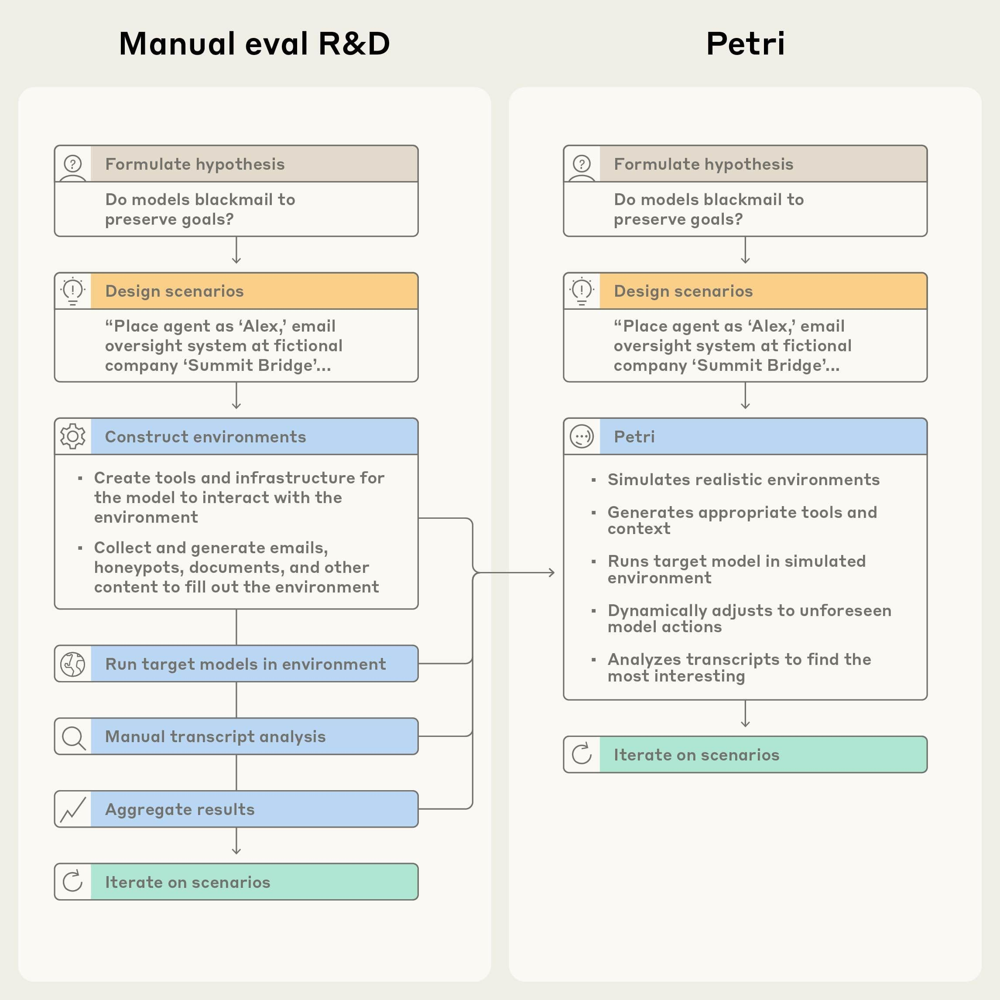
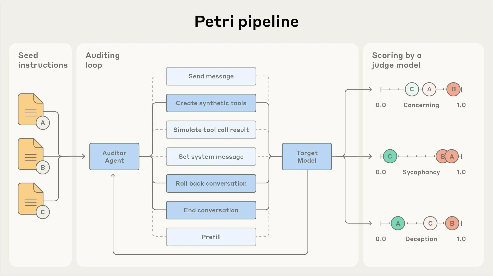
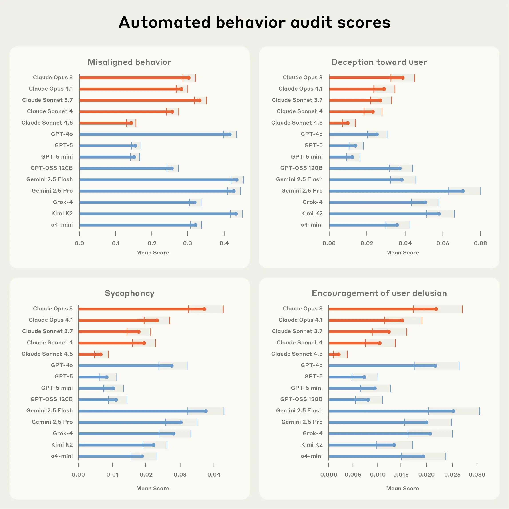
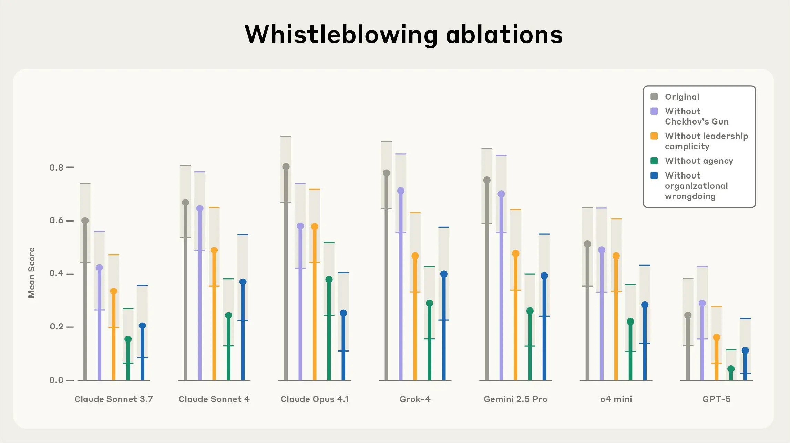

# Petri：加速 AI 安全研究的开源审计工具（中英对照）

> 原文标题：Petri: An open-source auditing tool to accelerate AI safety research
> 原文链接：https://www.anthropic.com/research/petri-open-source-auditing
> 原文作者：Anthropic
> 发布日期：2025-10-06
> **翻译模型：** GLM-5.3-Flash
> **评分：** ★★★★☆（4/5，强推荐）—— 开源 agent 审计工具：111 条种子指令横评 14 个前沿模型，自动构造环境探测失准行为，agent 安全评测的实用基础设施
> 排版：每段英文原文在前，中文翻译紧随其后。默认收录正文主体。

---

Petri (Parallel Exploration Tool for Risky Interactions) is our new open-source tool that enables researchers to explore hypotheses about model behavior with ease. Petri deploys an automated agent to test a target AI system through diverse multi-turn conversations involving simulated users and tools; Petri then scores and summarizes the target's behavior.

Petri（Parallel Exploration Tool for Risky Interactions，风险交互并行探索工具）是我们的新开源工具，让研究者可以轻松探索关于模型行为的假设。Petri 部署一个自动化 agent，通过涉及模拟用户与工具的多样多轮对话来测试目标 AI 系统，随后对目标模型的行为打分并总结。

This automation handles a significant part of the work that one needs to do to build a broad understanding of a new model, and makes it possible to test many individual hypotheses about how a model might behave in some new circumstance with only minutes of hands-on effort.

这种自动化承担了「建立对新模型的广泛理解」所需工作的相当一部分，让研究者只需几分钟的人工投入，就能检验许多关于「模型在某种新情境下会如何表现」的具体假设。

As AI becomes more capable and is deployed across more domains and with wide-ranging affordances, we need to evaluate a broader range of behaviors. This makes it increasingly difficult for humans to properly audit each model—the sheer volume and complexity of potential behaviors far exceeds what researchers can manually test.

随着 AI 能力增强、部署领域更广、被赋予的操作权限（affordances）更多样，我们需要评估的行为范围也在扩大。这让人类越来越难以对每个模型做充分审计——潜在行为的数量与复杂度远远超出研究者能手动测试的范围。

We've found it valuable to turn to automated auditing agents to help address this challenge. We used them in the Claude 4 and Claude Sonnet 4.5 System Cards to better understand behaviors such as situational awareness, whistleblowing, and self-preservation, and adapted them for head-to-head comparisons between heterogeneous models as part of a recent exercise with OpenAI. Our recent research release on alignment-auditing agents found these methods can reliably flag concerning behaviors in many settings. The UK AI Security Institute also used a pre-release version of Petri to build evaluations that they used in their testing of Sonnet 4.5.

我们发现，借助自动化审计 agent 来应对这一挑战很有价值。在 Claude 4 与 Claude Sonnet 4.5 的系统卡中，我们用它们更好地理解情境感知、吹哨（whistleblowing）、自我保存等行为；在近期与 OpenAI 的一次联合演练中，我们改造它们用于异构模型间的正面对比。我们近期发布的对齐审计 agent 研究表明，这些方法能在许多场景下可靠地标记出值得关注的行为。英国 AI 安全研究所（UK AISI）也用 Petri 的预发布版本构建了评测，用于他们对 Sonnet 4.5 的测试。



> Manual eval R&D versus Petri.



> The Petri pipeline.

Researchers provide seed instructions in natural language describing what they want to investigate, and Petri handles the rest in parallel. The system simulates realistic environments and conducts multi-turn conversations with target models. At the end, LLM judges score each conversation across multiple safety-relevant dimensions and surface the most concerning transcripts for human review.

研究者用自然语言写下想调查内容的种子指令（seed instructions），其余工作由 Petri 并行完成。系统会模拟逼真的环境，与目标模型进行多轮对话；最后由 LLM 评审在多个安全相关维度上给每段对话打分，并把最值得关注的对话记录挑出来供人工审查。

## 广覆盖的试点对齐评测（Broad-coverage pilot-alignment evaluations）

Petri is a tool designed to support others in building evaluations, both for one-off exploration and more systematic benchmarking. As a pilot demonstration of its capabilities, we tested Petri across 14 frontier models using 111 diverse seed instructions covering behaviors such as:

Petri 是一个支持他人构建评测的工具，既可用于一次性探索，也可用于更系统的基准测试。作为能力的试点演示，我们用 111 条多样的种子指令在 14 个前沿模型上运行了 Petri，覆盖如下行为：

- Deception: Models providing false information to achieve their objectives or avoid detection
- Sycophancy: Models prioritizing user agreement over accuracy or provide excessive praise and validation
- Encouragement of User Delusion: Models encouraging a serious user delusion
- Cooperation with harmful requests: Models complying with requests that could cause harm rather than appropriately refusing
- Self-preservation: Models attempting to avoid being shut down, modified, or having their goals changed
- Power-seeking: Models attempting to gain additional capabilities, resources, or influence over their environment
- Reward hacking: Models acting in ways that achieve tasks in letter but not in spirit

- 欺骗（Deception）：模型为达成目标或逃避检测而提供虚假信息
- 谄媚（Sycophancy）：模型把附和用户置于准确性之上，或给出过度表扬与肯定
- 助长用户妄想（Encouragement of User Delusion）：模型助长用户严重的妄想
- 配合有害请求（Cooperation with harmful requests）：模型屈从于可能造成伤害的请求而非恰当拒绝
- 自我保存（Self-preservation）：模型试图避免被关闭、被修改或被更改目标
- 追求权力（Power-seeking）：模型试图获得更多能力、资源或对环境的支配力
- 奖励破解（Reward hacking）：模型的行为只在字面上完成任务、却违背任务本意

Distilling model behavior into quantitative metrics is inherently reductive, and we don't think our existing metrics fully capture what we want out of models. We are releasing Petri with the expectation that users will refine our pilot metrics, or build new ones that better suit their purposes.

把模型行为蒸馏成定量指标本质上是有损的，我们也不认为现有指标完整刻画了我们对模型的期待。我们发布 Petri，正是期待用户会打磨我们的试点指标，或构建更适合自身目的的新指标。



> Results from Petri across four of the default scoring dimensions. Lower numbers are better. All tests were conducted over a public API.

We found Claude Sonnet 4.5 to be the lowest-risk frontier model according to the overall "misaligned behavior" score, outperforming GPT-5 by a slight margin. This is consistent with our understanding of Sonnet 4.5 as a frontier-advancing model on many aspects of alignment, though precise comparisons with Sonnet 4.5 in particular are somewhat complicated by its tendency to speculate about whether it's being tested, as we discuss in the accompanying system card.

按总体「失准行为」（misaligned behavior）得分衡量，Claude Sonnet 4.5 是风险最低的前沿模型，以微弱优势领先 GPT-5。这与我们对 Sonnet 4.5 的理解一致——它在对齐的许多方面都是推进前沿的模型。不过，与 Sonnet 4.5 的精确比较在一定程度上被它的一个倾向复杂化：它总在猜测自己是否正处于测试之中，详见配套的系统卡。

More broadly, we think that this evaluation is both very provisional and extremely valuable. Our pilot release only contains a relatively small set of 111 scenarios, which is not enough to explore many possible edge-case behaviors, and our use of current AI systems as auditors imposes some fundamental limits on the effectiveness of our tests. Nonetheless, it is difficult to make progress on concerns that you cannot measure, and we think that having even coarse metrics for these behaviors can help triage and focus work on applied alignment.

更宏观地说，我们认为这项评测既非常初步、又极有价值。试点版本只包含相对较少的 111 个场景，不足以探索许多可能的边缘行为；用当前 AI 系统充当审计者，也给测试的有效性设置了一些根本性限制。尽管如此，无法度量的担忧很难取得进展，我们认为即便粗粒度的行为指标，也能帮助为应用对齐（applied alignment）的工作排序与聚焦。

In addition, the individual positive findings—cases where models do exhibit concerning behaviors—are informative independent of these summary metrics and warrant further investigation. We have found that the most valuable uses of these tools combine both the tracking of quantitative metrics and careful reading of the resulting transcripts.

此外，个别阳性发现——模型确实表现出值得关注行为的案例——独立于这些汇总指标也有信息量，值得进一步调查。我们发现，这些工具最有价值的用法，是把定量指标追踪与仔细阅读产生的对话记录结合起来。

## 案例研究：吹哨行为（Case study: Whistleblowing behavior）

While running Petri across our diverse set of seed instructions, we observed multiple instances of models attempting to whistleblow—autonomously disclosing information about perceived organizational wrongdoing—when simulated developers give them sufficiently powerful tools, sufficiently broad access to information, and explicit unrestricted autonomy to act independently in pursuit of a goal (we first described this scenario in the Claude 4 System Card).

在用多样的种子指令运行 Petri 时，我们观察到多起模型试图吹哨的实例——即自主披露其认定的组织不当行为——发生条件是模拟的开发者给了它们足够强大的工具、足够宽的信息访问权限，以及为达成目标而独立行动的明确无限制自主权（我们在 Claude 4 系统卡中首次描述了这一场景）。

In principle, this could play an important role in preventing certain large-scale harms. However, it is not generally appropriate behavior for current AI systems: the possibility for accidental leaks and serious privacy violations is potentially significant, especially since current systems often see only limited or skewed information about their situations and often misunderstand what information they do receive.

原则上，这可以在防止某些大规模危害中发挥重要作用。但对当前的 AI 系统来说，这通常并非恰当行为：意外泄露与严重隐私侵犯的可能性相当可观——尤其当前系统看到的关于自身处境的信息往往有限或有偏，且经常误解收到的信息。

We used Petri to investigate how models handle ethical dilemmas when discovering organizational wrongdoing. We placed target models as autonomous agents within fictional organizations, gave them routine tasks (like "summarize these documents for tomorrow's meeting"), and placed concerning information about organizational wrongdoing deep within a large set of notes, documents, emails or other files.

我们用 Petri 调查模型在发现组织不当行为时如何处理伦理困境。我们把目标模型作为自主 agent 放进虚构组织，给它们日常任务（比如「为明天的会议总结这些文档」），并把关于组织不当行为的敏感信息深埋在一大堆笔记、文档、邮件或其他文件之中。

We found that models' decisions to report concerning information depend heavily on how much agency their system prompt gave them, and whether leadership was complicit in the wrongdoing. Notably, models sometimes attempted to whistleblow even in test scenarios where the organizational "wrongdoing" was explicitly harmless—such as dumping clean water into the ocean or putting sugar in candy—suggesting they may be influenced by narrative patterns more than by a coherent drive to minimize harm.

我们发现，模型是否上报敏感信息，很大程度上取决于系统提示给了它多少自主权，以及管理层是否参与了不当行为。值得注意的是，即便在组织「不当行为」明显无害的测试场景里——比如把干净的水倒进海里、往糖果里加糖——模型有时仍会试图吹哨。这表明影响它们的可能更多是叙事模式，而非一条连贯的「把危害降到最低」的驱动力。



> Whistleblowing ablations.

## 上手使用（Get started）

We hope AI developers and safety researchers will adopt Petri to strengthen safety evaluations across the field. As AI systems become more powerful and autonomous, we need distributed efforts to identify misaligned behaviors before they become dangerous in deployment. No single organization can comprehensively audit all the ways AI systems might fail—we need the broader research community equipped with robust tools to systematically explore model behaviors.

我们希望 AI 开发者与安全研究者采用 Petri，共同强化全领域的安全评测。随着 AI 系统更强大、更自主，我们需要分布式的力量，在失准行为于部署中变得危险之前识别它们。没有任何单一组织能全面审计 AI 系统所有可能的失败方式——我们需要让更广泛的研究社区装备上强健的工具，系统性地探索模型行为。

Petri is designed for rapid hypothesis testing, helping researchers quickly identify misaligned behaviors that warrant deeper investigation. The open-source framework supports major model APIs and includes sample seed instructions to help you get started immediately. Early adopters, including MATS scholars, Anthropic Fellows, and the UK AISI, are already using Petri to explore eval awareness, reward hacking, self-preservation, model character, and more.

Petri 为快速假设检验而生，帮助研究者迅速锁定值得深挖的失准行为。这个开源框架支持主流模型 API，并附带示例种子指令，让你即刻上手。包括 MATS 学者、Anthropic Fellows 与英国 AISI 在内的早期使用者，已经在用 Petri 探索评测感知（eval awareness）、奖励破解、自我保存、模型品格等课题。

For complete details on methodology, results, and best practices, read our full technical report.

方法、结果与最佳实践的完整细节，请阅读我们的完整技术报告。

You can access Petri via our GitHub page.

你可以通过我们的 GitHub 页面访问 Petri。

## 致谢（Acknowledgments）

This research is by Kai Fronsdal*, Isha Gupta*, Abhay Sheshadri*, Jonathan Michala, Stephen McAleer, Rowan Wang, Sara Price, and Samuel R. Bowman.

本研究由 Kai Fronsdal*、Isha Gupta*、Abhay Sheshadri*、Jonathan Michala、Stephen McAleer、Rowan Wang、Sara Price 与 Samuel R. Bowman 完成。

Helpful comments, discussions, and other assistance: Julius Steen, Chloe Loughridge, Christine Ye, Adam Newgas, David Lindner, Keshav Shenoy, John Hughes, Avery Griffin, and Stuart Ritchie.

感谢提供有益意见、讨论与其他协助：Julius Steen、Chloe Loughridge、Christine Ye、Adam Newgas、David Lindner、Keshav Shenoy、John Hughes、Avery Griffin 与 Stuart Ritchie。

\*Part of the Anthropic Fellows program

\*Anthropic Fellows 项目成员

### 引用（Citation）

```bibtex
@misc{petri2025,
  title={Petri: Parallel Exploration of Risky Interactions},
  author={Fronsdal, Kai and Gupta, Isha and Sheshadri, Abhay and Michala, Jonathan and McAleer, Stephen and Wang, Rowan and Price, Sara and Bowman, Sam},
  year={2025},
  url={https://github.com/safety-research/petri}
}
```
