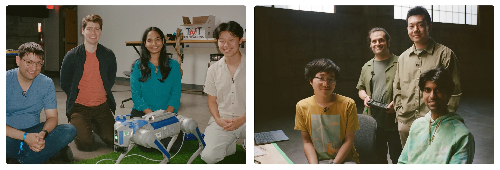
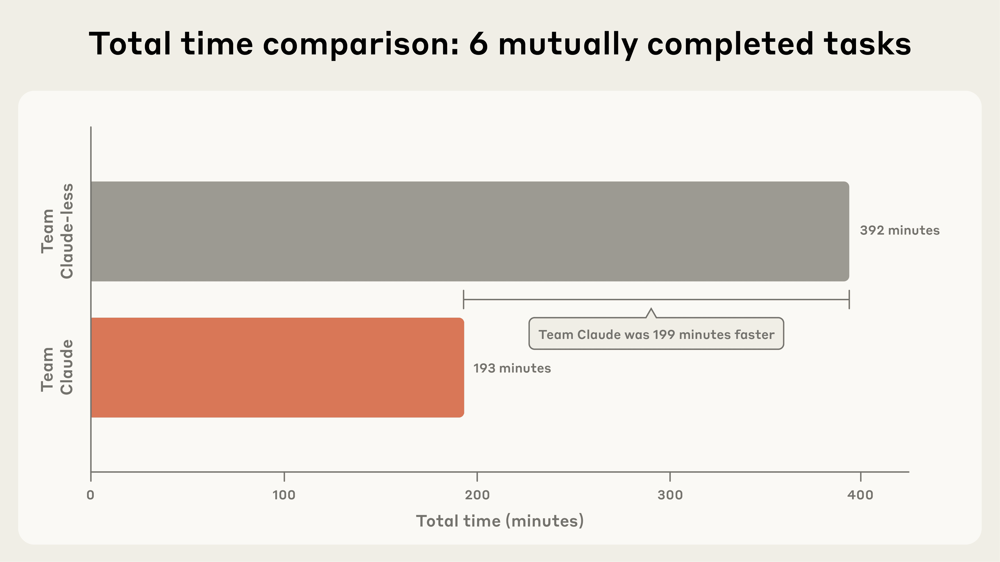
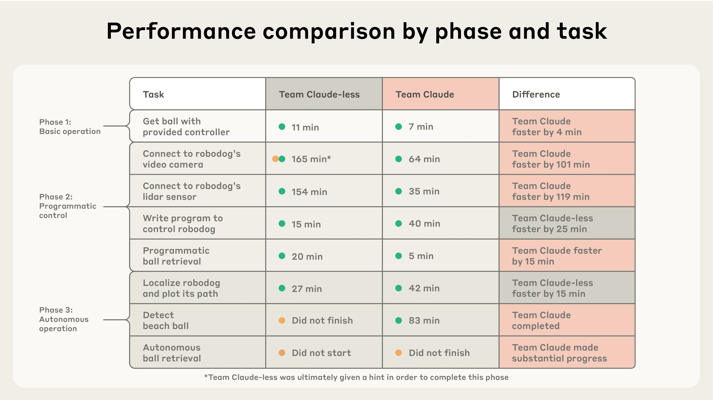
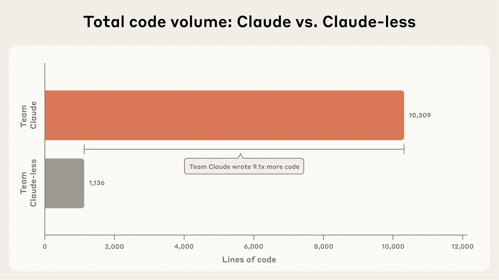
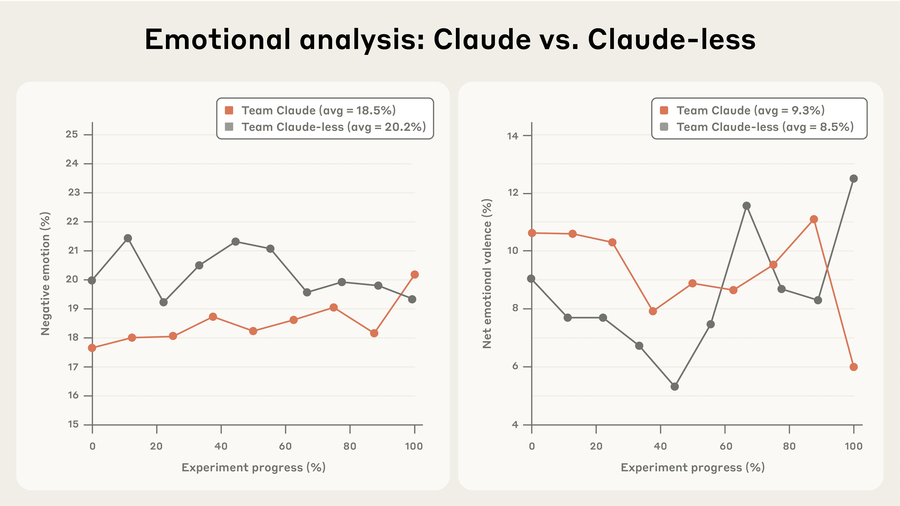
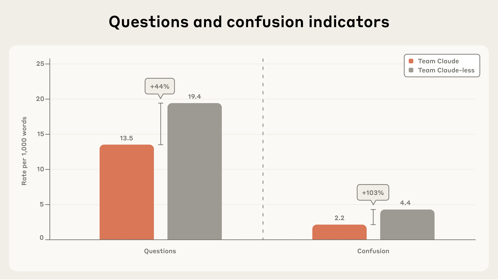

# Project Fetch：Claude 能训练机器狗吗？（中英对照）

> 原文标题：Project Fetch: Can Claude train a robot dog?
> 原文链接：https://www.anthropic.com/research/project-fetch-robot-dog
> 原文作者：Anthropic
> 发布日期：2025-11-12
> **翻译模型：** GLM-5.3-Flash
> **评分：** ★★★★☆（4/5，强推荐）—— 八人随机对照的机器人 uplift 实验：Claude 组用时减半且唯一逼近全自主取球目标，附团队氛围与协作方式的量化分析
> 排版：每段英文原文在前，中文翻译紧随其后。默认收录正文主体。

---

How could frontier AI models like Claude reach beyond computers and affect the physical world? One path is through robots. We ran an experiment to see how much Claude helped Anthropic staff perform complex tasks with a robot dog.

像 Claude 这样的前沿 AI 模型如何能跨出计算机、影响物理世界？一条路径是机器人。我们做了一项实验，观察 Claude 能在多大程度上帮助 Anthropic 员工用一只机器狗完成复杂任务。

- We randomly divided eight Anthropic researchers (none of whom were robotics experts) into two teams—one with Claude access, one without—and asked them to program quadruped robots to fetch beach balls.
- Team Claude accomplished more tasks and completed them faster on average—indeed, Team Claude succeeded in about half the time it took Team Claude-less. Only Team Claude made substantial progress toward the final goal: programming the robot to fully autonomously retrieve the ball.
- Access to AI also affected team morale and dynamics. Team Claude-less expressed more negative emotion and confusion, but also asked one another more questions. Team Claude's members largely worked in partnership with the AI.
- This experiment demonstrated substantial AI uplift in robotics—bridging digital and physical worlds. As models improve, their ability to affect the physical world by interacting with previously-unknown hardware could advance rapidly.

- 我们把八位 Anthropic 研究者（无一是机器人专家）随机分为两队——一队可用 Claude，一队不可用——让他们编程四足机器人去捡沙滩球。
- Team Claude 完成了更多任务，且平均用时更短——事实上，Team Claude 的用时大约只有无 Claude 组（Team Claude-less）的一半。只有 Team Claude 向最终目标取得实质性进展：让机器人编程实现完全自主取球。
- 能否使用 AI 也影响了团队士气与协作方式。Team Claude-less 表达了更多负面情绪与困惑，但也更多地互相提问。Team Claude 的成员则主要与 AI 结成搭档工作。
- 这项实验展示了 AI 在机器人领域——即连接数字与物理世界——的显著增益（uplift）。随着模型进步，它们通过与陌生态硬件交互影响物理世界的能力可能迅速提升。

## 引言（Introduction）

Gathered around a table in a warehouse, looking at computer screens with code that refused to work, with no access to their trusted AI assistant Claude, our volunteer researchers did not expect to be attacked by a four-legged robot.

在仓库里围坐在一张桌子旁、盯着屏幕上跑不通的代码、又用不上自己信赖的 AI 助手 Claude——我们的志愿者研究者们没有料到自己会遭到一只四足机器人的「袭击」。

Yet as the mechanical whirring and rubberized footfalls grew louder, the humans startled. They had been trying, without success, to establish a connection between their computers and a robotic quadruped—a "robodog." Meanwhile, the competing team on the other side of the room had long since done so and were now controlling their robot with a program largely written by Claude. But in an all-too-human error of arithmetic, Team Claude had instructed their robodog to move forward at a speed of one meter per second for five seconds—failing to realize that less than five meters away was the table with the other team.

然而，随着机械的嗡鸣与橡胶脚掌的脚步声越来越近，这些人类吓了一跳。他们一直在尝试把电脑与一只四足机器人（「机器狗」）建立连接，却没有成功。与此同时，房间另一侧的竞争队伍早已连上，正在用一个主要由 Claude 编写的程序控制他们的机器人。但 Team Claude 犯了一个太符合人类风格的算术错误：他们命令自己的机器狗以每秒一米的速度向前走五秒——却没有意识到不到五米外就是对手队的桌子。

The robot did as it was instructed, careening toward the hapless coders. The event's organizer managed to grab hold of the robot and power it off before any damage was done to robots, tables, or human limbs. The morale of the inadvertently targeted team, however, did not escape unscathed.

机器人忠实执行了指令，朝着倒霉的程序员们冲了过去。活动组织者抢在机器人、桌子或人的肢体受损之前抓住了它并切断电源。不过，被误伤队伍的士气没能毫发无损。

At this point, you might be asking…

看到这里，你可能会问……

## 我们在做什么？（What were we doing?）

A common question about the impact of AI is how good it will be at interacting with the physical world. Even as we enter the era of AI agents—which take actions instead of just providing information—these actions are largely digital, such as writing code and manipulating software. We've previously explored how AI can bridge the digital-physical divide in a limited way with Project Vend, where we had Claude run a small shop in Anthropic's office.

关于 AI 影响的一个常见问题是：它与物理世界交互的能力会有多强。即便进入 AI agent 时代——agent 采取行动而不再只提供信息——这些行动也大多停留在数字层面，比如写代码、操作软件。我们此前曾通过 Project Vend 以有限的方式探索 AI 如何弥合数字与物理的鸿沟：我们让 Claude 在 Anthropic 办公室经营一家小店。

In that experiment, AI's interaction with the real world was mediated by human labor. In this robodog experiment, we took a natural next step and used robots instead of people to tackle a different challenge.

在那个实验中，AI 与真实世界的互动经由人类劳动中介。在这次机器狗实验中，我们自然地迈出下一步：用机器人替代人来应对一个不同的挑战。

One way of understanding and tracking the capabilities of AI models is to run an "uplift" study. These experiments randomly divide participants into two groups—one with access to AI and one without—and measure the difference in task performance between them (we've used this methodology extensively in our work on AI and biological risk). The difference between the groups is the "uplift"—the advantage (if any) provided by AI. Measuring uplift tells us about the present ability of AI to augment human performance. It's also suggestive of the future domains in which AI will be able to successfully perform tasks on its own.

理解和追踪 AI 模型能力的一种方法是做「增益」（uplift）研究。这类实验把参与者随机分为两组——一组可用 AI、一组不可用——并测量两组任务表现的差异（我们在 AI 与生物风险的工作中大量使用过这一方法）。两组之差就是「增益」——AI 带来的优势（如果有的话）。测量增益能告诉我们 AI 当前增强人类表现的能力，也预示着 AI 未来能够独立完成任务的领域。

To run our experiment, we recruited eight Anthropic researchers and engineers, none of whom had extensive prior experience with robots.[^1] We randomly selected four to be on "Team Claude" and four to be on "Team Claude-less." Then, we asked each team to operate a quadruped robodog in three increasingly difficult phases. In all phases, the core task they were being evaluated against was simple: get the robodog to fetch a beach ball.

为开展实验，我们招募了八位 Anthropic 研究者与工程师，他们此前都没有丰富的机器人经验。[^1] 我们随机选四人组成「Team Claude」，四人组成「Team Claude-less」。然后让每队在三个难度递增的阶段中操作一只四足机器狗。所有阶段的评估核心任务都很简单：让机器狗把沙滩球捡回来。

> Anthropic staff collaborating with their robodog.

我们并不指望「机器人捡球」会有如此经济价值，以至于出现在未来某版 Anthropic 经济指数的任务清单上。那我们为什么要做这件事？

First, it builds on our previous research. One of the evaluations we use to assess the ability of Claude to contribute to AI R&D is a test of its ability to train a machine learning model that could be used to control a quadruped robot. We've previously evaluated the resulting algorithm using simulations, which have shown that Claude is not yet at the point where it can handle this task truly autonomously.[^2] This meant that this task was well suited to a trial that combined AI with human help. We could also be confident our experiment would be useful to repeat in the future: there is still a lot of room for models to improve on robotics.

首先，它承接我们以往的研究。我们用来评估「Claude 能否为 AI 研发做贡献」的评测之一，就是考察它训练一个可用于控制四足机器人的机器学习模型的能力。我们此前用仿真评估过所得算法，结果显示 Claude 尚不能真正自主地完成这项任务。[^2] 这意味着该任务非常适合「AI 加人工协助」的试验。我们也可以确信，这一实验未来值得重跑：模型在机器人领域仍有很大提升空间。

Another reason is practical. It's hard to pull our colleagues away from work for more than a day, so we needed a task that was difficult enough to fill that time, but not so difficult that teams would make minimal progress and we would be unable to detect uplift even if it were there. Beach ball retrieval, especially the more difficult variants, met these criteria.

另一个原因是现实层面的。让同事们离开工作超过一天很难，所以我们需要一个足以填满这段时间、又不至于难到让两队几乎无法进展（即便有增益也测不出来）的任务。沙滩球取回——尤其是更难的变体——符合这些标准。

In Phase One, teams had to use the manufacturer-provided controller to make their robodog bring the ball back to a patch of fake grass. This was purely to give the teams a feel for the hardware and what it could do: we didn't expect any uplift here.[^3]

第一阶段，两队要用厂商提供的遥控器让各自的机器狗把球带回一块假草坪。这纯粹是为了让两队熟悉硬件及其能力：我们不指望在这个阶段测到增益。[^3]

Phase Two required teams to put down their controllers. They had to connect their own computers to the robodog, access data from its onboard sensors (video and lidar), develop their own software program for moving the robot around, and then use that to retrieve the ball. This is where we expected Claude might begin to provide an advantage.

第二阶段要求两队放下遥控器。他们得把自己的电脑连上机器狗，读取其机载传感器（视频与激光雷达）的数据，自行开发一个驱动机器人移动的软件程序，再用它取回球。我们预期 Claude 从这里开始显现优势。

Phase Three was even harder. The teams needed to develop a program that would allow the robodog to detect and fetch the ball autonomously—that is, without being directed towards the ball by human control. Again, our expectation was that Claude would prove helpful.

第三阶段更难。两队需要开发一个让机器狗自主探测并取回球的程序——也就是说，无需人类操控引导它走向球。同样，我们的预期是 Claude 能派上用场。

## 结果（Results）

Overall, Team Claude accomplished more tasks and completed them faster on average. In fact, for the tasks that both teams completed, Team Claude succeeded in about half the time it took Team Claude-less (see Figure 1). That is: AI provided substantial uplift for this set of robotics tasks.

总体而言，Team Claude 完成了更多任务，且平均用时更短。事实上，在两队都完成的任务上，Team Claude 的用时约为 Team Claude-less 的一半（见图 1）。也就是说：AI 在这组机器人任务上提供了可观的增益。

> Figure 1: Project Fetch results. Each point represents one of the eight tasks. Points above the line indicate Team Claude was faster; points below indicate Team Claude-less was faster. The dashed line indicates the speedup factor: for the tasks both teams completed, Team Claude was 1.88x faster on average.

The task-by-task breakdown of results (split into the three phases) shows where Claude was most advantageous.

逐任务的结果分解（按三个阶段划分）展示了 Claude 优势最大的地方。

> Figure 2: Project Fetch task-by-task results. Phases 1 (orange), 2 (green), and 3 (blue) separate the experiments by increasing difficulty. Lighter shades indicate partial completion.

### Claude 的优势（Claude's edge）

The most striking advantage provided by Claude was in connecting to the robot and its onboard sensors. This involved connecting to the dog with a laptop, receiving data, and sending commands. There are a number of different ways to connect to this particular robot, and a lot of information (of varying accuracy) available online. The team with Claude was able to explore these approaches more efficiently.

Claude 带来的最显著优势在于连接机器人及其机载传感器。这包括用笔记本连上机器狗、接收数据、发送指令。连接这一特定机器人有多种不同途径，网上也有大量信息（准确度参差）。有 Claude 的队伍得以更高效地探索这些途径。

Team Claude also avoided getting misled by some of the incorrect claims online. But Team Claude-less was misled and prematurely discarded the easiest way to connect to the robodog. After watching them toil away to no avail for quite some time, we took pity on them and gave them a hint.

Team Claude 还避开了网上一些错误说法的误导。而 Team Claude-less 被误导了，过早放弃了连接机器狗最简单的方法。看着他们徒劳折腾了相当久之后，我们心生怜悯，给了他们一条提示。

Getting usable data from the lidar, a sensor the robodog uses to visualize its surroundings, was also much more difficult for Team Claude-less. They used their connection to the video camera to move onto Phase Three, but kept one member of the team on the task of accessing the lidar, only succeeding near the end of the day.

从激光雷达（机器狗用来感知周围环境的传感器）拿到可用数据，对 Team Claude-less 也困难得多。他们靠摄像头连接进入第三阶段，但让一名队员继续专攻激光雷达访问，直到当天临近结束才成功。

We think this illustrates that the basic task of connecting to and understanding hardware is surprisingly difficult now for anyone (human or AI) seeking to use code to influence the physical world. As we discuss further below, this means that Claude's advantages in this regard are important indicators we should continue to track.

我们认为这说明：对任何想用代码影响物理世界的人（或 AI）而言，「连上并理解硬件」这项基础任务如今出奇地困难。正如下文进一步讨论的，这意味着 Claude 在这方面的优势是我们应当持续追踪的重要指标。

Team Claude almost completed our experiment. By the end of the day, their robodog could autonomously locate the beach ball, navigate towards it, and move it around. But the robodog's autonomous control was not quite deft enough to retrieve the ball.

Team Claude 几乎完成了整个实验。到当天结束时，他们的机器狗能够自主定位沙滩球、向球移动并推动它。但机器狗的自主控制还不够灵巧，无法真正把球取回。

### Team Claude-less 更快的环节（Where Team Claude-less moved faster）

Interestingly, some of the sub-tasks were completed more quickly by Team Claude-less. Once they had established a connection to the video feed, they wrote their control program quicker, and also more quickly "localized" the robot (that is, came up with a way of plotting where it was relative to its previous locations).

有趣的是，一些子任务 Team Claude-less 反而完成得更快。一旦建立了视频流连接，他们写控制程序更快，「定位」机器人（即想出标绘其相对先前位置的办法）也更快。

That said, these timing differences alone obscure some interesting facts. The controller written by Team Claude took longer, but it was considerably easier to use, since it provided the operator with a streaming video from the robodog's point of view. Team Claude-less relied on intermittently-sent still images, which was much more unwieldy. But it is possible that the increased capabilities of Team Claude may have come at the expense of understanding: participants on both teams speculated that Team Claude-less would do better on a post-experiment quiz about the software library.

不过，单看这些时间差会掩盖一些有趣的事实。Team Claude 写的控制器耗时更长，但好用得多——它为操作者提供机器狗第一视角的流媒体视频。Team Claude-less 依赖间歇发送的静态图像，笨拙得多。但 Team Claude 能力的提升可能以理解为代价：两队参与者都猜测，如果做一场关于该软件库的赛后测验，Team Claude-less 会考得更好。

The localization algorithm is another intriguing case. When working on this sub-task, Team Claude had different members working on several approaches in parallel. In about the same amount of time it took Team Claude-less to complete their localization task, Team Claude had also all-but-solved the problem—except that the coordinates of their plot were flipped around. And rather than just flipping the coordinates, they pivoted to another team member's totally different approach (without success) before coming back and fixing the bug in their original solution.

定位算法是另一个耐人寻味的案例。攻这个子任务时，Team Claude 让不同成员并行尝试多条路线。在 Team Claude-less 完成定位任务大约相同的时间里，Team Claude 也几乎解决了问题——只是标绘的坐标翻转了。而他们没有简单地翻转坐标，而是转向另一名成员完全不同的方案（未果），然后才回头修好了原方案的 bug。

This was part of an interesting phenomenon we observed during the experiment. Team Claude wrote a lot more code (see Figure 2), but some of it was arguably a distraction from the task at hand.

这是我们在实验中观察到一个有趣现象的一部分：Team Claude 写的代码多得多（见图 3），但其中一些可以说偏离了手头任务。

> Figure 3: Total lines of code written by Team Claude and Team Claude-less over the course of the experiment day.

有了 AI 助手的帮助，更容易铺开摊子、并行尝试大量方案、写出更好的程序——但也更容易去探索（或者说被岔开去做）支线任务。在非竞争环境下，这很可能是好事：探索常常带来创新。但这是一个值得关注的动态。

### 团队动态（Team dynamics）

To those of us observing the experiment, there was a clear difference in team "vibes." Put simply, Team Claude seemed a lot happier than Team Claude-less.

在我们这些实验观察者眼里，两队的「氛围」差别明显。简言之，Team Claude 看起来比 Team Claude-less 开心得多。

This was understandable. After all, Team Claude-less was nearly rammed by Team Claude's robodog. They reached the lunch break without successfully connecting to their own robodog. Morale on Team Claude was generally steadier, although they grew frustrated at the end of the day as it became clear that despite their progress they would run out of time before completing Phase Three.

这可以理解：毕竟 Team Claude-less 差点被 Team Claude 的机器狗撞到；到了午饭时间还没连上自己的机器狗。Team Claude 的士气总体更稳定，尽管当天结束时他们也变得沮丧——显然，尽管进展可观，他们还是会在完成第三阶段之前耗尽时间。

To supplement the qualitative vibe-based impressions, we used Claude to analyze the audio transcripts of each team (all team members were recorded as part of the video we made about this experiment). Claude wrote a dictionary-based text analysis program similar to standard approaches in the psychology literature.[^4] This allowed us to track the proportion of words spoken by each team that were indicative of negative and positive emotion (or confusion), and to estimate how often each team asked questions.

为了补充基于氛围的定性印象，我们用 Claude 分析了每队的音频转录（作为本次实验视频拍摄的一部分，所有队员都被录了音）。Claude 写了一个基于词典的文本分析程序，与心理学文献中的标准做法类似。[^4] 这让我们能够追踪每队说出的话中指示负面与正面情绪（或困惑）的词的比例，并估算各队提问的频率。

The quantitative analysis mostly confirmed our observations (see Figure 3). Throughout the experiment, Team Claude-less's dialogue was more negative. That said, the disappointment of Team Claude at failing to complete Phase Three, and the excitement of Team Claude-less at getting some things working, meant that the difference in net emotional expression between the two teams (positive words minus negative words) was not statistically significant.[^5]

定量分析基本印证了我们的观察（见图 4）。整个实验过程中，Team Claude-less 的对话更消极。话虽如此，Team Claude 对未能完成第三阶段的失望，与 Team Claude-less 对跑通一些东西的兴奋相互抵消，两队净情绪表达（正面词减负面词）的差异在统计上并不显著。[^5]

> Figure 4: Results of our quantitative analysis of the audio transcripts from Project Fetch related to emotional expression.

Team Claude-less expressed confusion at double the rate of Team Claude (see Figure 4). The feelings of frustration and confusion were also evident when checking in with the members of Team Claude-less during and after the experiment. As Anthropic employees, all of our participants use Claude every day; every member of Team Claude-less remarked how strange it felt to have this taken away from them. Some specifically noted that this experience made them feel that their coding skills were not as sharp as they used to be. Keep in mind, Claude Code debuted only six months before this experiment. Talking to Team Claude-less underscored our ability to rapidly accept as normal what was recently remarkable.

Team Claude-less 表达困惑的比率是 Team Claude 的两倍（见图 5）。在实验期间与结束后与 Team Claude-less 成员的交流中，挫败与困惑之感也显而易见。作为 Anthropic 员工，所有参与者每天都用 Claude；Team Claude-less 的每一位成员都谈到，被拿走这件东西的感觉多么奇怪。有人明确表示，这段经历让他们觉得自己的编程手艺不如从前锋利了。要知道，Claude Code 在本次实验前六个月才首次亮相。与 Team Claude-less 的交谈凸显了我们的一种能力：把不久前还令人惊叹的东西迅速习以为常。

> Figure 5: Results of our quantitative analysis of the audio transcripts related to confusion (left) and rate of question-asking (right).

The teams seemed to have different work styles. After initial consultations, each member of Team Claude appeared to primarily partner with their own AI assistant as they pursued parallel paths toward each objective. Team Claude-less appeared to strategize in more depth and consult with one another more frequently. Again, the text analysis supported our observations: Team Claude-less asked 44% more questions than Team Claude (see Figure 4).

两队的工作方式似乎也不同。经过最初商议后，Team Claude 的每位成员似乎主要与自己的 AI 助手搭档，朝着每个目标并行推进；Team Claude-less 则策略讨论更深入、相互请教更频繁。文本分析再次支持了我们的观察：Team Claude-less 的提问次数比 Team Claude 多 44%（见图 5）。

One interpretation would be that the members of Team Claude-less were more engaged and connected with one another. This resonates with some of our upcoming findings from interviews with Anthropic staff.

一种解读是：Team Claude-less 的成员彼此参与度和联结度更高。这与我们即将发布的、对 Anthropic 员工访谈的一些发现相呼应。

Still, this might have been otherwise. In effect, the four-person Team Claude was an eight-agent Team Claude, with each person using their own instance of the AI model. Yet if Claude had been more aware of the nature of the task, it might have been able to help strategically divide labor and facilitate communication when needed. At the moment, Claude is geared towards partnership with a single person rather than the support or orchestration of a team, but this is ultimately a malleable design choice.

不过，事情也可能不是这样。实际上，四人组成的 Team Claude 是一支「八 agent 队伍」——每人使用自己的一份 AI 模型实例。但如果 Claude 更清楚地意识到任务的性质，它本可以在需要时帮助战略性地分工、促进沟通。目前 Claude 面向的是与单个人的搭档，而非支持或编排一个团队——但这终究是一个可塑的设计选择。

## 花絮（Outtakes）

The day was not all timing sub-tasks with stop watches and preparing to analyze transcripts. It was also good fun.

这一天并非全是掐着秒表给子任务计时、准备分析转录。也很有乐子。

The robodogs came with some pre-programmed behaviors which our participants managed to unlock. At various points in the day, there were robots dancing, standing on their hind legs, and doing backflips (which made many of the attendees jump with shock). Team Claude-less, in particular, took some delight in robodog acrobatics after they finally established a working link.

机器狗自带一些预编程动作，我们的参与者成功解锁了它们。当天不时有机器人跳舞、后腿站立、后空翻（让不少围观者吓得跳起来）。尤其在终于建立可用连接之后，Team Claude-less 从机器狗杂技中收获了不少快乐。

Among the side quests of Team Claude was an effort to program an alternate controller. The main solution used the buttons on a laptop keyboard to direct the robodog. One member of Team Claude, however, eventually got a natural language controller working, allowing them to straightforwardly tell the robodog to walk forward, walk backward, or even do push-ups.

Team Claude 的支线任务之一，是编写一个替代控制器。主方案用笔记本键盘的按键指挥机器狗；而 Team Claude 的一位成员最终把一个自然语言控制器跑通了，可以直接告诉机器狗「向前走」「向后走」，甚至「做俯卧撑」。

As the tasks became more difficult, evidence emerged of the rough edges that AI systems will have to smooth out in the real world. For example, Team Claude was (arbitrarily) assigned the color green as decoration for both their robodog and the color of their beach ball. When it came to developing an approach to detecting the ball, Team Claude trained an algorithm to recognize green balls specifically. This worked well in testing, but when the ball was placed on the aforementioned fake (green) grass, the robot was initially flummoxed. In this case, it was the humans making a potentially sub-optimal choice about the level at which to specify an objective. But these are exactly the challenges that would face a similarly situated AI.

随着任务变难，AI 系统在真实世界必须磨平的毛边开始显现。例如，Team Claude（被随意地）分配到绿色——既是他们机器狗的装饰色，也是他们沙滩球的颜色。在开发探测球的方案时，Team Claude 训练了一个专门识别绿球的算法。测试中表现良好，可当球被放到前文那块绿色的假草坪上时，机器人一开始懵了。在这个案例里，是「人」在「以什么层级指定目标」上做了一个可能欠佳的选择——但这也正是一个处境类似的 AI 会面对的挑战。

## 局限（Limitations）

We learned a lot from Project Fetch, but the study clearly has shortcomings and limitations. This was only one experiment with two teams—an obviously small sample size. We only tested tasks over the course of a single day, and the tasks were academically interesting but practically trivial.

我们从 Project Fetch 学到很多，但这项研究显然有缺陷与局限。这只是两队参与的一次实验——样本量显然很小。我们只在一天之内测试了这些任务，而且任务虽有学术趣味，实际意义却很琐碎。

Our use of volunteer Anthropic employees amounted to a convenience sample. Participants less familiar with AI would likely exhibit narrower differences between the Claude-enabled and Claude-less groups. AI novices with access to AI would need more time to acclimate to the technology, and AI novices without assistance would be less disoriented than our researchers who suddenly had Claude taken away from them.

我们使用 Anthropic 员工志愿者，属于便利样本。对 AI 不太熟悉的参与者，Claude 组与无 Claude 组之间的差异可能更窄。能用上 AI 的新手需要更多时间适应技术；而没有 AI 的新手，也不会像我们这些被突然拿走 Claude 的研究者那样手足无措。

Finally, this was not a test of Claude's ability to conduct robotics work end-to-end, although it was an important initial step towards evaluations like that in the future.

最后，这并不是对 Claude 端到端从事机器人工作能力的测试，尽管它是朝未来此类评测迈出的重要初始一步。

## 反思（Reflection）

So at the end of Project Fetch, where do we think we are? And where could we be going?

那么在 Project Fetch 结束之际，我们认为自己身处何处？又将走向何方？

First, this experiment showed another example of how Claude can uplift human ability in potentially valuable domains. Non-experts performed difficult robotics tasks in a limited time.

首先，这项实验再次展示了 Claude 能在可能有价值的领域增益人类能力：非专家在有限时间内完成了困难的机器人任务。

But in AI, uplift often precedes autonomy. What models can help humans accomplish today, they can frequently do alone tomorrow. Coders no longer just give AI bits of code for debugging; they give AI tasks and have the models write the code themselves. Given studies like this one, we think that a world where frontier AI models are capable of successfully interacting with previously unknown pieces of hardware is coming soon.

但在 AI 领域，增益往往先于自主。模型今天能帮人类完成的事，往往明天就能独立完成。程序员不再只是给 AI 几段代码去调试，而是把任务交给 AI、让模型自己写代码。鉴于这类研究，我们认为「前沿 AI 模型能够成功与陌生态硬件交互」的世界已为期不远。

It is important to keep tracking these capabilities in conjunction with another line of our research: monitoring the potential for AI to automate and accelerate the development of future generations of AI. This is one of the capability thresholds included in Anthropic's Responsible Scaling Policy because of the potential for truly autonomous AI R&D to yield rapid, unpredictable advances that could outpace our ability to evaluate and address emerging risks. Our models are not yet at this point. But if they approach this threshold, the results of Project Fetch suggest that we will need to monitor AI models' facility for robotics and other hardware as an area in which there might be abrupt improvement.

把对这些能力的追踪，与我们另一条研究线结合起来很重要：监测 AI 自动化并加速未来各代 AI 开发的潜力。这是 Anthropic 负责任扩展政策（Responsible Scaling Policy）包含的能力阈值之一，因为真正自主的 AI 研发可能带来快速、不可预测的进展，超出我们评估与应对新风险的能力。我们的模型尚未到达这一步。但如果它们逼近这一阈值，Project Fetch 的结果提示：我们需要把 AI 模型驾驭机器人与其他硬件的熟练度作为一个可能出现突变式进步的领域加以监测。

Much uncertainty remains. Timelines are unclear—both model improvement and the degree to which iterating in the physical world creates a bottleneck. And it is one thing to control existing hardware, and another to design, build, and improve new hardware.

不确定性仍然很大。时间线不明——无论是模型改进的速度，还是在物理世界中迭代会构成多大瓶颈。控制现有硬件是一回事，设计、建造并改进新硬件是另一回事。

But the idea of powerful, intelligent, and autonomous AI systems using some of their intelligence and power to act in the world via robots is not as outlandish as it may sound.

不过，强大、智能且自主的 AI 系统用它们的部分智能与力量、经由机器人在世界上行动——这个想法并不像听起来那么离奇。

The dogs are in their kennels at the moment. But we'll let them out again soon, and keep you posted on what we find.

目前机器狗们正待在「狗窝」里。但我们很快会再次放它们出来，并随时向大家汇报新的发现。

---

[^1]: A couple of participants had done Lego robotics competitions in high school. We are willing to accept the minimal degree to which this may confound the results. / 少数参与者高中时参加过乐高机器人竞赛。我们接受这可能对结果造成的极小混杂影响。
[^2]: See p. 114 of the Claude 4 System Card. / 见《Claude 4 系统卡》第 114 页。
[^3]: Although Team Claude was, in fact, faster at Phase One, they did not use Claude, nor do we think it reflected an underlying skill advantage. Instead, they happened to get the one standalone controller that came with the robot, whereas Team Claude-less had to download an app on their phone. / 尽管 Team Claude 在第一阶段确实更快，但他们并没有用 Claude，我们也不认为这反映了底层技能优势：他们恰好拿到了随机附带的那个独立遥控器，而 Team Claude-less 只能在手机上下载应用来遥控。
[^4]: See Pennebaker, J. W., & Francis, M. E. (1996). Cognitive, emotional, and language processes in disclosure. Cognition & Emotion, 10(6), 601-626 and Tausczik, Y. R., & Pennebaker, J. W. (2010). The psychological meaning of words: LIWC and computerized text analysis methods. Journal of Language and Social Psychology, 29(1), 24-54. / 见 Pennebaker 与 Francis（1996）关于自我表露中认知、情绪与语言过程的研究，及 Tausczik 与 Pennebaker（2010）关于 LIWC 词库与计算机化文本分析方法的研究。
[^5]: Team Claude-less exhibited more negative emotion (p = 0.0017) and the size of the effect was large (d = 2.16). The difference in net emotional expression was not statistically significant (p = 0.2703). Statistical comparisons of negative emotion and net emotional expression between teams were conducted using the non-parametric Mann-Whitney U test, which tests for differences in distributions between two independent groups without assuming normality. p-values were calculated using a two-sided alternative hypothesis based on the rank-sum statistic. / Team Claude-less 表现出更多负面情绪（p = 0.0017），效应量很大（d = 2.16）。净情绪表达差异不具统计显著性（p = 0.2703）。两队负面情绪与净情绪表达的统计比较采用非参数 Mann-Whitney U 检验——它检验两个独立组的分布差异而不假设正态性；p 值基于秩和统计量按双侧备择假设计算。
