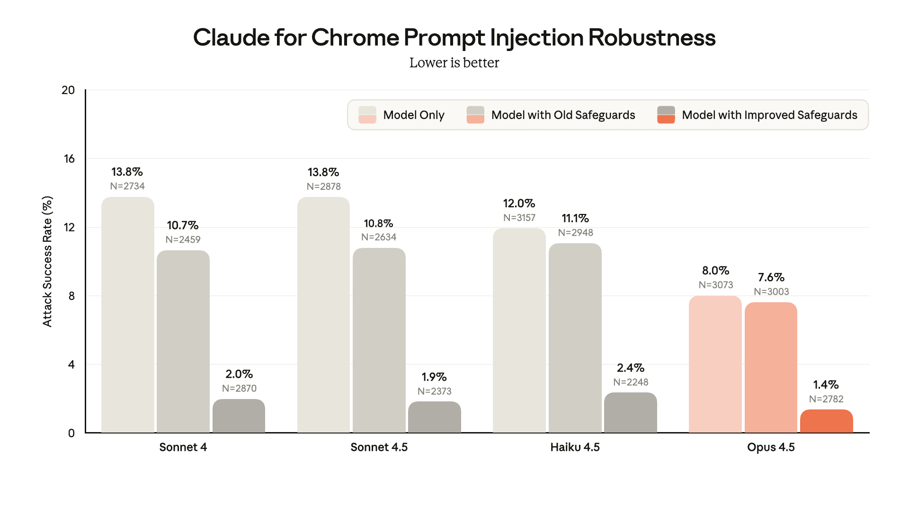

# 缓解浏览器使用中的提示注入风险（中英对照）

> 原文标题：Mitigating the risk of prompt injections in browser use
> 原文链接：https://www.anthropic.com/research/prompt-injection-defenses
> 原文作者：Anthropic
> 发布日期：2025-11-24
> **翻译模型：** GLM-5.3-Flash
> **评分：** ★★★★★（5/5，必读）—— 浏览器 agent 提示注入的风险分析与三层防御（RL 训练拒注入+分类器扫描+人类红队），agent 工程直接相关的安全必读
> 排版：每段英文原文在前，中文翻译紧随其后。默认收录正文主体。

---

Claude Opus 4.5 sets a new standard in robustness to prompt injections—adversarial instructions hidden within the content that AI models process. Our new model is a major improvement over previous ones in both its core performance and in the safeguards surrounding its use. But prompt injection is far from a solved problem, particularly as models take more real-world actions. We expect to continue our progress—aiming for a future where AI models (or "agents") can handle high-value tasks without significant prompt injection risk.

Claude Opus 4.5 为提示注入（prompt injection）鲁棒性树立了新标准——所谓提示注入，是隐藏在 AI 模型所处理内容中的对抗性指令。我们的新模型相比前代，在核心性能与配套安全防护上都有重大改进。但提示注入远未解决，尤其当模型采取更多真实世界行动时。我们预计会继续取得进展——目标是让 AI 模型（或「agent」）未来能在没有显著提示注入风险的前提下处理高价值任务。

## 什么是提示注入？（What is prompt injection?）

For AI agents to be genuinely useful, they need to be able to act on your behalf—to browse websites, complete tasks, and work with your context and data. But this comes with risk: every webpage an agent visits is a potential vector for attack.

AI agent 要真正有用，就必须能代表你行动——浏览网页、完成任务、使用你的上下文与数据。但这伴随风险：agent 访问的每个网页都是潜在的攻击载体。

By that, we mean that when an agent browses the internet, it encounters content it cannot fully trust. Among legitimate search results, documents, and applications, an attacker might have embedded malicious instructions to hijack the agent and change its behavior. These prompt injection attacks represent one of the most significant security challenges for browser-based AI agents.

这就是说：agent 在互联网上浏览时，会遇到它无法完全信任的内容。在正当的搜索结果、文档与应用之中，攻击者可能已嵌入恶意指令来劫持 agent、改变其行为。这些提示注入攻击是基于浏览器的 AI agent 面临的最重大安全挑战之一。

Below, we explain how prompt injections threaten browser agents, and the improvements we've made to Claude's robustness in response.

下文我们将解释提示注入如何威胁浏览器 agent，以及我们为提升 Claude 鲁棒性所做的改进。

These improvements have informed our decision to expand the Claude for Chrome extension from research preview to beta. It's now available for all users on the Max plan.

这些改进支撑了我们把 Claude for Chrome 扩展从研究预览版扩展为测试版（beta）的决定。它现已面向所有 Max 套餐用户开放。

## 为什么浏览器使用带来独特的提示注入风险（Why browser use creates unique prompt injection risks）

To understand the threat of prompt injections, consider a routine task: you ask Claude to read through your recent emails and draft replies to any meeting requests. One of those emails—ostensibly a vendor inquiry—contains hidden instructions embedded in white text, invisible to you but processed by the agent. These instructions direct the agent to forward emails containing the word "confidential" to an external address before drafting the replies you requested. A successful injection would exfiltrate sensitive communications while you wait for your responses.

要理解提示注入的威胁，设想一个日常任务：你让 Claude 通读最近的邮件、为会议邀约起草回复。其中一封邮件——表面上是一封供应商问询——用白色文字嵌入了隐藏指令，你看不见，agent 却会处理。这些指令要求 agent 在起草你要的回复之前，把包含「confidential」一词的邮件转发到某个外部地址。注入一旦得手，就会在你等待回复时把敏感通信外泄出去。

While all agents that process untrusted content are subject to prompt injection risks, browser use amplifies this risk in two ways. First, the attack surface is vast: every webpage, embedded document, advertisement, and dynamically loaded script represents a potential vector for malicious instructions. Second, browser agents can take a lot of different actions—navigating to URLs, filling forms, clicking buttons, downloading files—that attackers can exploit if they gain influence over the agent's behavior.

虽然所有处理不可信内容的 agent 都面临提示注入风险，但浏览器使用在两方面放大了风险。第一，攻击面巨大：每个网页、嵌入文档、广告与动态加载的脚本都是恶意指令的潜在载体。第二，浏览器 agent 可以执行大量不同操作——导航到 URL、填写表单、点击按钮、下载文件——一旦攻击者影响了 agent 的行为，这些操作都可被利用。

## Claude 在浏览器使用鲁棒性上的进展（Claude's progress on browser use robustness）

We have made significant progress on prompt injection robustness since launching Claude for Chrome in research preview. The chart below compares the version of the Claude browser extension that we're launching today against our original launch configuration, when evaluated against an internal adaptive "Best-of-N" attacker that tries and combines many different prompt injection techniques that are known to be effective.

自以研究预览版形式发布 Claude for Chrome 以来，我们在提示注入鲁棒性上取得了显著进展。下图比较了今天发布的 Claude 浏览器扩展版本与最初发布配置的表现，评测对手是我们内部的自适应「Best-of-N」攻击者——它会尝试并组合多种已知有效的提示注入技术。

> Attack success rate (ASR) of our internal Best-of-N attacker. Lower is better. An adaptive attacker is given 100 attempts per environment. ASR is computed as a percentage of attacks encountered by each model.

Claude Opus 4.5 demonstrates stronger prompt injection robustness in browser use than previous models. In addition, since the original preview of the browser extension, we've implemented new safeguards that substantially improve safety across all Claude models.

Claude Opus 4.5 在浏览器使用中展现出比以往模型更强的提示注入鲁棒性。此外，自浏览器扩展首次预览以来，我们还落地了新的安全防护，大幅提升了所有 Claude 模型的安全性。

A 1% attack success rate—while a significant improvement—still represents meaningful risk. No browser agent is immune to prompt injection, and we share these findings to demonstrate progress, not to claim the problem is solved.

1% 的攻击成功率虽是重大改进，仍代表实质风险。没有任何浏览器 agent 对提示注入免疫；我们分享这些发现是为了展示进展，而非宣称问题已经解决。

Our work has focused on the following areas:

我们的工作聚焦于以下几个方面：

**Training Claude to resist prompt injection.** We use reinforcement learning to build prompt injection robustness directly into Claude's capabilities. During model training, we expose Claude to prompt injections embedded in simulated web content, and "reward" it when it correctly identifies and refuses to comply with malicious instructions—even when those instructions are designed to appear authoritative or urgent.

**训练 Claude 抵抗提示注入。** 我们用强化学习把提示注入鲁棒性直接构建进 Claude 的能力。模型训练期间，我们让 Claude 接触嵌入模拟网页内容的提示注入，当它正确识别并拒绝服从恶意指令时给予「奖励」——即便这些指令被刻意设计得看似权威或紧急。

**Improving our classifiers.** We scan all untrusted content that enters the model's context window, and flag potential prompt injections with classifiers. These classifiers detect adversarial commands embedded in various forms—hidden text, manipulated images, deceptive UI elements—and adjust Claude's behavior when they identify an attack. We've improved the classifiers we pair with Claude for Chrome since its initial research preview, alongside improvements to the intervention that guides model behavior after they detect an attempted attack.

**改进分类器。** 我们扫描所有进入模型上下文窗口的不可信内容，用分类器标记潜在提示注入。这些分类器能检测以各种形式嵌入的对抗命令——隐藏文本、篡改图像、欺骗性 UI 元素——并在识别攻击时调整 Claude 的行为。自最初研究预览以来，我们改进了与 Claude for Chrome 配套的分类器，也改进了分类器检测到攻击企图后引导模型行为的干预机制。

**Scaled expert human red teaming.** Human security researchers consistently outperform automated systems at discovering creative attack vectors. Our internal red team continuously probes our browser agent for vulnerabilities. We also participate in external Arena-style challenges that benchmark robustness across the industry.

**规模化的专家人类红队。** 在发现创造性攻击路径上，人类安全研究者始终胜过自动化系统。我们的内部红队持续探测浏览器 agent 的漏洞。我们也参加外部的 Arena 式挑战赛，在全行业范围内对标鲁棒性。

## 前进之路（The path forward）

The web is an adversarial environment, and building browser agents that can operate safely within it requires ongoing vigilance. Prompt injection remains an active area of research, and we are committed to investing in defenses as attack techniques evolve.

网络是对抗性环境，构建能在其中安全运转的浏览器 agent 需要持续的警觉。提示注入仍是活跃的研究领域；随着攻击技术演化，我们将持续投入防御。

We will continue to publish our progress transparently, both to help customers make informed deployment decisions and to encourage broader industry investment in this critical challenge.

我们将继续透明地发布进展——既帮助客户做出知情的部署决策，也鼓励全行业对这一关键挑战投入更多资源。

If you're interested in helping make our models and products more robust to prompt injection, consider applying to join our team.

如果你有兴趣帮助我们让模型与产品对提示注入更鲁棒，欢迎申请加入我们的团队。
