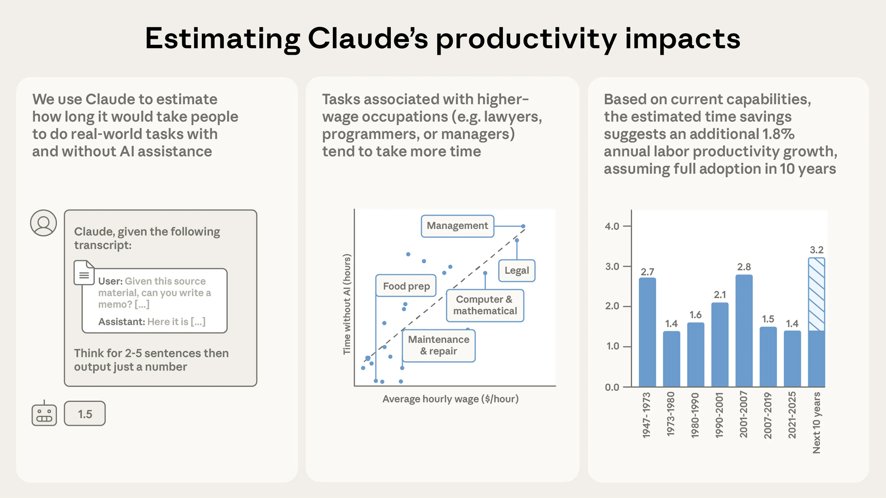
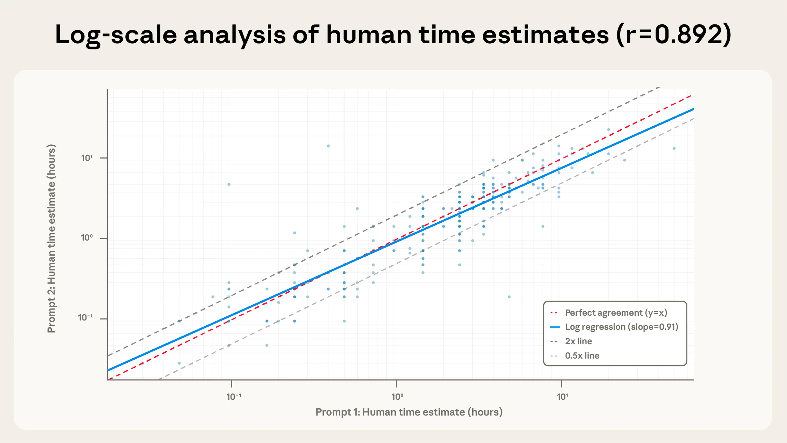
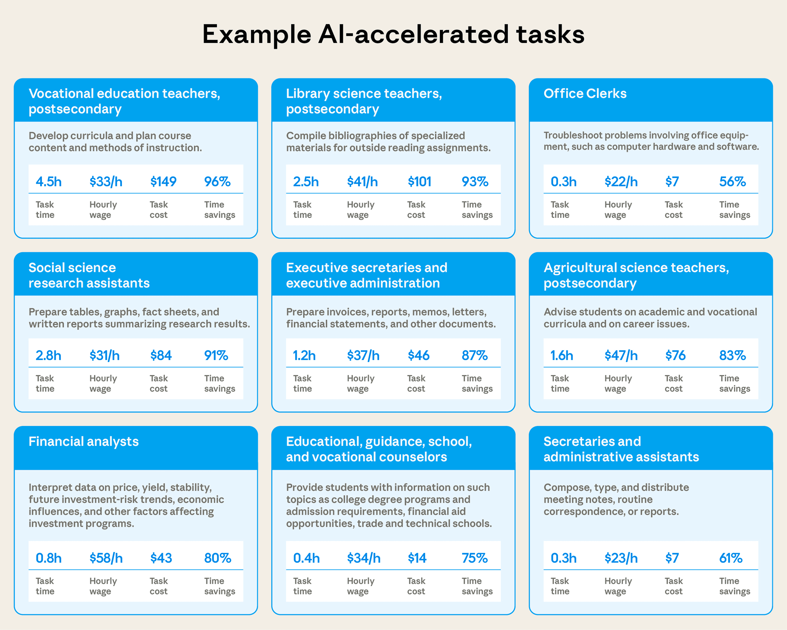
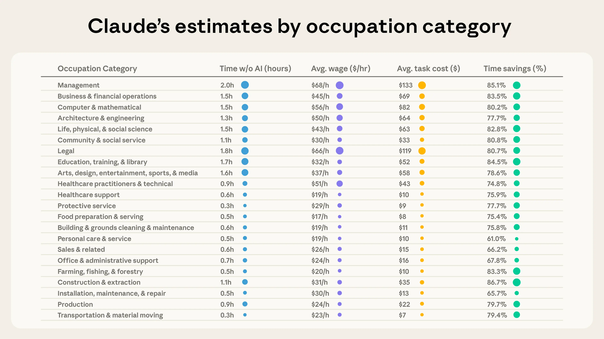
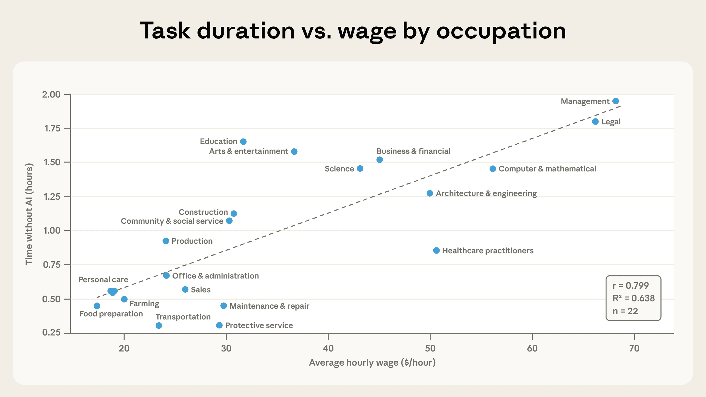
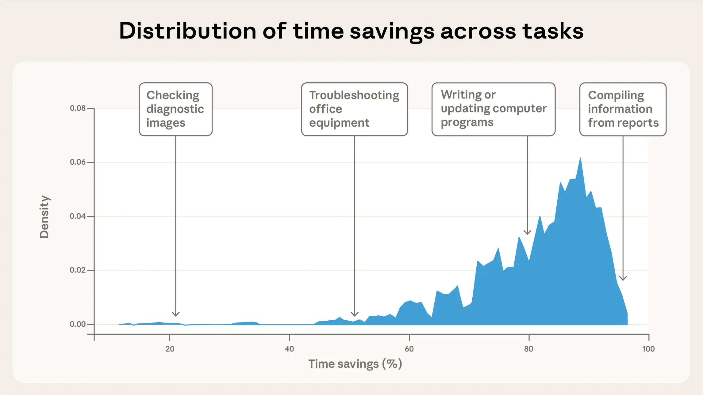
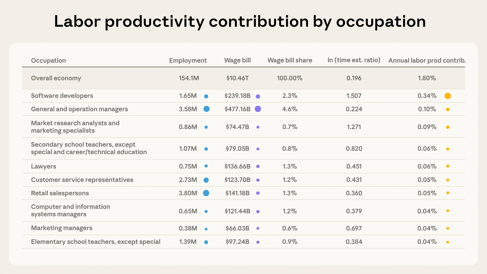
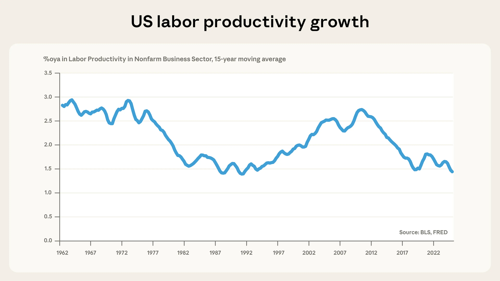
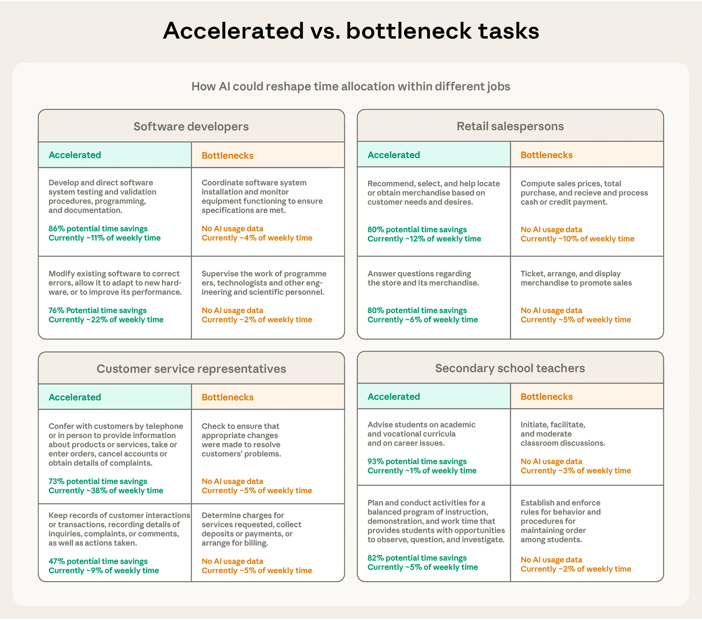

# 从 Claude 对话估算 AI 生产率收益（中英对照）

> 原文标题：Estimating AI productivity gains
> 原文链接：https://www.anthropic.com/research/estimating-productivity-gains
> 原文作者：Alex Tamkin, Peter McCrory（Anthropic）
> 发布日期：2025-11-25
> **翻译模型：** GLM-5.3-Flash
> **评分：** ★★★★☆（4/5，强推荐）—— 10 万真实对话测算：任务平均缩短 80% 用时、隐含美国劳动生产率年增 1.8%，含验证与局限的坦诚讨论
> 排版：每段英文原文在前，中文翻译紧随其后。默认收录正文主体；文末附录（Claude 估计与其他估计的对比、时间估计所用提示词）未收录，如需可补充。

---

## 概述（Overview）

What do real conversations with Claude tell us about the effects of AI on labor productivity? Using our privacy-preserving analysis method, we sample one hundred thousand real conversations from Claude.ai, estimate how long the tasks in these conversations would take with and without AI assistance, and study the productivity implications across the broader economy. Based on Claude's estimates, these tasks would take on average about 90 minutes to complete without AI assistance, and Claude speeds up individual tasks by about 80%.

与 Claude 的真实对话能告诉我们 AI 对劳动生产率的影响吗？借助我们的隐私保护分析方法，我们从 Claude.ai 抽样了十万段真实对话，估计其中任务在有无 AI 协助两种情况下各需多长时间，并研究其对整体经济的生产率含义。根据 Claude 的估计，这些任务在没有 AI 协助时平均需要约 90 分钟完成，而 Claude 把单个任务提速约 80%。

Extrapolating these estimates out suggests current-generation AI models could increase US labor productivity growth by 1.8% annually over the next decade—roughly twice the run rate in recent years. But this isn't a prediction of the future, since we don't take into account the rate of adoption or the larger productivity effects that would come from much more capable AI systems.

把这些估计外推，意味着当前一代 AI 模型可能在未来十年把美国劳动生产率增速每年提高 1.8%——约为近年运行水平的两倍。但这并非对未来的预测，因为我们没有考虑采用率，也没有考虑能力强大得多的 AI 系统会带来的更大生产率效应。

Our analysis has limits. Most notably, we can't account for additional time humans spend on tasks outside of their conversations with Claude, including validating the quality or accuracy of Claude's work. But as AI models get better at time estimation, we think our methods in this research note could become increasingly useful for understanding how AI is shaping real work.

我们的分析有局限。最明显的是，我们无法计入人类在与 Claude 对话之外为任务花费的额外时间，包括校验 Claude 产出的质量或准确性。但随着 AI 模型的时间估计能力提升，我们认为本研究所用的方法会越来越有助于理解 AI 如何塑造真实工作。

Here's a more detailed summary of our results:

以下是更详细的结果摘要：

- Across one hundred thousand real world conversations, Claude estimates that AI reduces task completion time by 80%. We use Claude to evaluate anonymized Claude.ai transcripts to estimate the productivity impact of AI. According to Claude's estimates, people typically use AI for complex tasks that would, on average, take people 1.4 hours to complete. By matching tasks to O*NET occupations and BLS wage data, we estimate these tasks would otherwise cost $55 in human labor.
- The estimated scope, cost, and time savings of tasks varies widely by occupation. Based on Claude's estimates, people use Claude for legal and management tasks that would have taken nearly two hours, but for food preparation tasks that would have taken only 30 minutes. And we find that healthcare assistance tasks can be completed 90% more quickly, whereas hardware issues see time savings of 56%. This doesn't account for the time that humans might spend on these tasks beyond their conversation on Claude.ai, however, so we think these estimates might overstate current productivity effects to at least some degree.
- Extrapolating these results to the economy, current generation AI models could increase annual US labor productivity growth by 1.8% over the next decade. This would double the annual growth the US has seen since 2019, and places our estimate towards the upper end of recent estimates. Taking as given Claude's estimates of task-level efficiency gains, we use standard methods to calculate a 1.8% implied annual increase in US labor productivity over the next ten years. However, this estimate does not account for future improvements in AI models (or more sophisticated uses of current technology), which could significantly magnify AI's economic impact.
- As AI accelerates some tasks, others may become bottlenecks: We see large speedups for some tasks and much smaller ones in others, even within the same occupational groups. Where AI makes less of a difference, these tasks might become bottlenecks, potentially acting as a constraint on growth.

- 在十万段真实对话中，Claude 估计 AI 把任务完成时间缩短了 80%。我们用 Claude 评估匿名的 Claude.ai 对话转录来估计 AI 的生产率影响。按 Claude 的估计，人们通常把 AI 用于复杂任务——这些任务平均要花 1.4 小时才能完成。把任务匹配到 O*NET 职业与美国劳工统计局（BLS）工资数据后，我们估计这些任务若由人力完成需花费 55 美元劳动成本。
- 任务的规模、成本与时间节约随职业差异巨大。按 Claude 的估计，人们用 Claude 处理本需近两小时的法律与管理任务，也用它处理本只需 30 分钟的备餐任务。我们还发现，医疗辅助类任务能快 90% 完成，而硬件问题的处理只节约 56% 时间。不过，这没有计入人们在 Claude.ai 对话之外为这些任务花费的时间，所以我们认为这些估计至少在一定程度上高估了当前的生产率效应。
- 把这些结果外推到经济整体，当前一代 AI 模型可能在未来十年把美国劳动生产率年增速提高 1.8%。这将是美国 2019 年以来年增速的两倍，也使我们的估计位于近期各类估计的偏上端。在把 Claude 的任务级效率增益估计作为给定值的前提下，我们用标准方法算出未来十年美国劳动生产率隐含的年增 1.8%。但这一估计没有计入 AI 模型未来的进步（或对现有技术更复杂的使用），而这些可能显著放大 AI 的经济影响。
- 当 AI 加速一些任务时，另一些任务可能成为瓶颈：即使在同一职业组内部，我们也看到一些任务提速巨大、另一些提速甚微。AI 作用不大的任务可能变成瓶颈，成为增长的制约。

This gives us a new lens for understanding how AI's economic impacts over time, which we will track going forward as part of our Economic Index: Computing these estimates based on real-world Claude conversations gives us a new lens to understand AI productivity. This complements other approaches, like lab studies in narrow domains, or government statistics which provide more coarse-grained insights. We will track how these estimates change over time to get an evolving picture of these issues as capabilities and adoption continue to progress.

这为我们理解 AI 随时间推移的经济影响提供了一个新视角，我们将把它作为经济指数（Economic Index）的一部分持续追踪：基于真实 Claude 对话计算这些估计，给了我们理解 AI 生产率的新透镜。它与其他方法互补——比如狭窄领域的实验室研究，或提供更粗粒度洞见的政府统计。随着能力与采用的推进，我们将追踪这些估计如何随时间变化，以获得这些问题的动态图景。



> An overview of our method and some of our main results. See below for how we validate Claude's estimates, the assumptions we make, and limitations of our analysis.

## 引言（Introduction）

As part of the Anthropic Economic Index, we have documented how people use Claude across different tasks, industries, and places. We've captured the breadth of uses—how people use Claude for legal, scientific, and programming tasks—but not their depth. How substantial are the tasks for which people use Claude, and how much time does Claude save them?

作为 Anthropic 经济指数的一部分，我们记录了人们在不同任务、行业与地区如何使用 Claude。我们捕捉到了使用的广度——人们如何把 Claude 用于法律、科学与编程任务——却没有捕捉深度。人们用 Claude 处理的任务有多大的分量？Claude 为他们节省了多少时间？

The current version of the Economic Index can't capture this within-task heterogeneity—for instance, it can't distinguish report-writing tasks that take five minutes from those that take five days, or financial modeling tasks that take an afternoon from those that take a few weeks. This makes it difficult to assess AI's economic effects: a software developer might use Claude to write ten pull requests in a day, but if nine are minor documentation updates and one is a critical infrastructure change, simply counting the number of these tasks performed with Claude misses the point.

现行版本的经济指数无法捕捉这种任务内异质性——例如，它分不清一份要写五分钟的报告和一份要写五天的报告，也分不清一个下午能完成的金融建模和要几周的那种。这让评估 AI 的经济效应变得困难：一位软件开发者可能一天用 Claude 写了十个 pull request，但如果其中九个是次要的文档更新、一个是关键的基础设施变更，只统计「用 Claude 完成的任务数」就抓错了重点。

Not only that, but as model capabilities improve, we want to understand whether they do higher-value work. To understand how AI is reshaping work and productivity, we need to know not just which tasks Claude handles, but how substantial those tasks and time savings are.

不仅如此，随着模型能力提升，我们还想了解它们是否在做更高价值的工作。要理解 AI 如何重塑工作与生产率，我们不仅要知道 Claude 在处理哪些任务，还要知道这些任务与时间节约的分量有多大。

Several groups have begun conducting randomized controlled trials to measure productivity gains in narrow domains, including software engineering tasks, writing, and customer service. METR's work on measuring AI's ability to complete long tasks has demonstrated that AI systems can independently tackle extended, multi-step challenges. But these evaluations consider a narrow set of problems, rather than broad real-world use. To assess AI's overall impact on the economy, we need a way to analyze hundreds or thousands of real-world AI applications.

一些机构已开始用随机对照试验测量狭窄领域的生产率收益，涵盖软件工程任务、写作与客服等。METR 关于测量 AI 完成长任务能力的工作表明，AI 系统能独立应对长程多步挑战。但这些评测只覆盖一小部分问题，而非宽口径的真实使用。要评估 AI 对经济的总体影响，我们需要一种能分析成百上千种真实 AI 应用的方法。

This report takes a first step toward that goal. It uses Claude to estimate how much time it would take a human to complete the tasks that Claude handles, compares that to how long Claude and the human took together, and thereby calculates how much time the AI has saved. While AI models lack context about users' expertise, workflows, and constraints, we find that model-estimated times show promising accuracy for a dataset of software engineering tasks, relative to both human-estimated completion times and time-tracked outcomes.

本报告朝这一目标迈出第一步。它用 Claude 估计「人类完成 Claude 所处理任务需要多久」，再与 Claude 和人一起实际花费的时间比较，从而算出 AI 节省了多少时间。虽然 AI 模型缺乏关于用户专业水平、工作流程与约束的上下文，但我们发现：在一个软件工程任务数据集上，模型估计的时间相对人类估计的完成时间与实际计时结果都表现出可观的准确性。

In what follows, we present our methodology for estimating task-level time savings, validate our approach against ground-truth data, and then use these estimates to assess which tasks and occupations show the largest productivity gains from AI. We then explore what our task-level estimates imply about aggregate productivity as AI begins to be adopted throughout the economy.

下文我们将介绍估计任务级时间节约的方法，用真值数据验证这一方法，然后用这些估计评估哪些任务与职业从 AI 获得的生产率收益最大。最后我们探讨，随着 AI 开始被整个经济体系采用，我们的任务级估计对总体生产率意味着什么。

## 估计任务时长与时间节约（Estimating task length and time savings）

Using our privacy-preserving analysis system, we analyzed 100,000 conversation transcripts from Claude.ai (Free, Pro, and Max tiers) to measure the length and time savings of tasks Claude handles. We generated two core estimates for each task:

利用我们的隐私保护分析系统，我们分析了来自 Claude.ai（Free、Pro 与 Max 档）的 100,000 段对话转录，以测量 Claude 所处理任务的时长与时间节约。我们为每个任务生成两个核心估计：

- Time estimate without AI: The hours a human professional would need to complete the task without AI assistance
- Time estimate with AI: The amount of time it took to complete the task with AI assistance

- 无 AI 时间估计：人类专业人士在没有 AI 协助时完成该任务所需的小时数
- 有 AI 时间估计：在 AI 协助下完成任务所花的时间

We used Claude to generate these estimates for each conversation. Following our Economic Index methodology, we then aggregated these individual chat conversations to tasks in the O*NET taxonomy by taking the median of time estimates for each task. This allowed us to explore how such time estimates vary across tasks and occupations within the economy. Classification prompts are in the Appendix.

我们用 Claude 为每段对话生成这些估计。随后按照经济指数的方法论，取每个任务时间估计的中位数，把这些单段对话聚合到 O*NET 分类体系中的任务上。这让我们能够探索此类时间估计在经济中的不同任务与职业间如何变化。分类提示词见附录。

Analyzing real-world transcripts enables us to account for intra-task variation. For instance, even if the overall share of designing manufacturing equipment tasks stays fixed, transcript-level information lets us see whether people tackle more complex, longer-timescale projects (or attain greater time savings) with AI over time. Our Economic Index will track how these estimates evolve over time, and share aggregate datasets that researchers can use to make their own forecasts and conclusions.

分析真实世界的转录让我们能够刻画任务内部的变异。例如，即便「设计制造设备」类任务的总体占比保持不变，转录层面的信息也能让我们看到：随时间推移，人们是否在用 AI 处理更复杂、更长周期的项目（或获得更大的时间节约）。我们的经济指数将追踪这些估计随时间的演化，并发布聚合数据集供研究者做出自己的预测与结论。

### 验证（Validation）

Estimating task duration is notoriously difficult for humans. AI models have an even more difficult job, since they lack crucial context about the broader context of tasks (though we expect this context to increase over time as features like memory and external integrations become more comprehensive). To assess whether Claude's estimates are informative, we conducted two validation analyses.

估计任务时长对人类来说也是出了名的难。AI 模型的任务更难，因为它们缺乏关于任务大背景的关键上下文（不过我们预计，随着记忆与外部集成等功能变得更完善，这种上下文会逐渐增加）。为检验 Claude 的估计是否有信息量，我们做了两项验证分析。

**Self-consistency testing:** First, we assess whether Claude produces stable estimates of task lengths across different conversation samples, or across variations in our prompts.

**自一致性测试：** 首先，我们检验 Claude 在不同对话样本、不同提示词变体下给出的任务时长估计是否稳定。

We create multiple prompt variations—for example, asking about an "employee with appropriate skills" versus a "skilled professional"—to assess how sensitive estimates are to the way the prompt is phrased. We analyze 1,800 conversations with each variant, where users consented to share these conversations with us, and computed correlations across prompt variants. The results showed strong self-agreement, with log-scale correlations of r=0.89–0.93 across variants.

我们构造了多个提示词变体——例如询问「具备相应技能的员工」还是「熟练专业人员」——来评估估计对提示措辞的敏感度。我们对每个变体分析 1,800 段用户同意与我们分享的对话，并计算提示变体之间的相关性。结果显示很强的自一致性：各变体之间的对数尺度相关系数 r=0.89–0.93。



> Claude's estimated human completion times show high correlation across prompt variations. Prompt 1 asks Claude to estimate the time it would take an "employee with appropriate skills" to complete and Prompt 2 asks about a "human worker" who is "competent in the relevant field." The two prompts show a log-scale correlation of 0.89, indicating high agreement. Analysis performed on Claude.ai transcripts where users have consented to share them with us for research purposes.

**External benchmarking:** Self-agreement doesn't matter much if a model's predictions don't correspond well to reality. To check this, we tested Claude's time estimation capabilities against a dataset of thousands of real-world software development tasks gathered from JIRA tickets for open-source repositories, with both developer estimates and actual tracked completion times.

**外部基准测试：** 如果模型的预测与现实对应不佳，自一致性就没多大意义。为验证这一点，我们用数千个真实软件开发任务的数据集检验 Claude 的时间估计能力——任务取自开源仓库的 JIRA 工单，既有开发者自己的估计，也有实际计时的完成时间。

This is a very challenging task for Claude, given that Claude receives only the title and description of the JIRA tickets, while the human developers have full context on the codebase and the ticket, and have seen how long similar tasks take to complete. On a subset of 1000 tasks from this benchmark:

对 Claude 来说这是非常有挑战性的任务：Claude 只看到 JIRA 工单的标题与描述，而人类开发者掌握代码库与工单的完整上下文，也见过类似任务通常要花多久。在这个基准的 1000 个任务子集上：

- Human developers themselves achieved ρ=0.50 Spearman correlation with actual times, and a Pearson correlation of r_log=0.67 on the log values, indicating a moderate-strength correlation (higher is better for both values).
- Claude Sonnet 4.5 achieved ρ=0.44 and r_log=0.46
- Claude Sonnet 4.5 with ten examples of tasks and their ground-truth time lengths showed a worse ρ=0.39, but improved r_log=0.48

- 人类开发者自身与实际时间达到 ρ=0.50 的 Spearman 相关，对数值上的 Pearson 相关为 r_log=0.67，属中等强度相关（两项都是越高越好）。
- Claude Sonnet 4.5 达到 ρ=0.44 与 r_log=0.46。
- Claude Sonnet 4.5 在提示中给出十个任务及其真实时长的示例后，ρ=0.39 略差，但 r_log=0.48 有所提升。

This analysis suggests that Claude's estimates provide directional information that is only slightly worse than software developers' own estimates. However, we observe that Claude's estimates are much more compressed than humans—predicting comparatively long times for shorter tasks, and vice versa—and are overall more prone to overestimates. This suggests that the actual differences in task lengths across tasks may be larger than we report, and that actual task lengths may be slightly shorter. Overall, these findings demonstrate that model predictions have meaningful correlation with real-world outcomes, at least in this domain, making them useful for comparing one task to another or tracking changes over time. We also observe higher correlation from Claude Sonnet 4.5 compared to Claude Sonnet 4, suggesting that these estimates may continue to improve with model capabilities.

这一分析表明，Claude 的估计提供了方向性信息，只比软件开发者自己的估计略差一点。不过我们观察到，Claude 的估计比人类的「压缩」得多——对短任务预测得偏长，对长任务预测得偏短——且总体更容易高估。这提示任务之间实际的时长差异可能比我们报告的更大，实际任务时长可能略短。总体而言，这些发现表明模型预测与真实世界结果有有意义的相关性（至少在本领域如此），使其可用于任务间比较或追踪随时间的变化。我们还观察到 Claude Sonnet 4.5 的相关性高于 Claude Sonnet 4，提示这些估计可能随模型能力继续改善。


> Correlation of actual time spent on software engineering tasks with developer and Claude estimates. Left: correlation with developers' initial time estimates with the final time-tracked outcomes. Developers are familiar with the full codebase and understand the full context behind the request and how long similar tasks have taken. Middle: correlation with Claude Sonnet 4.5's estimates, given just the task title and description of the JIRA ticket. Right: Correlation with Claude Sonnet 4.5's estimates, given 10 examples in the prompt to calibrate on. Overall, Claude's estimates have similar directional correlation to developers: Spearman's ρ=0.44, compared to ρ=0.50 for developers, though Claude significantly overestimates short tasks and underestimates long ones. Axes are log (base 10) scaled. Error bars are 95% CIs per bin.

## 结果（Results）

We first use the methods above to estimate task-level savings, then aggregate these into estimates of economy-wide effects.

我们先以上述方法估计任务级节约，再把它们聚合为经济整体效应的估计。

### 任务级节约（Task-level savings）



> Claude's estimated task time, average hourly wage of the occupation, implied task cost, and time savings for nine different tasks. Task time is estimated by having Claude predict how long a professional would take to perform the task without AI assistance. Hourly wage is derived from the Occupational Employment and Wage Statistics (OEWS) May 2024 data. Task cost is computed by multiplying the task time by the hourly wage. Time savings is computed by estimating the time the human took to complete the task and computing 1 - time_with_ai / time_without_ai.

#### 示例任务展示了时间节约的跨度（Example tasks demonstrate a range of time savings）

Looking at individual tasks within occupations provides concrete examples of where and how AI might be delivering time savings. At the most extreme end, we see users complete curriculum development tasks that Claude thinks would take 4.5 hours in just 11 minutes. Such tasks have an implied labor cost of $115 based on the average hourly wage of teachers.

观察职业内部的具体任务，能得到「AI 在哪里、如何带来时间节约」的具体例子。在最极端的一端，我们看到用户仅用 11 分钟就完成了 Claude 认为需要 4.5 小时的课程开发任务。按教师的平均时薪计算，这类任务的隐含劳动成本为 115 美元。

People also use AI to save 87% of the time it would take to write invoices, memos, and other documents (at least for the type of documents Claude is asked to handle). Finally, AI saves 80% of time on financial analyst tasks like interpreting financial data for tasks that would ordinarily cost $31 in wages.

人们还用 AI 节省撰写发票、备忘录及其他文档所需时间的 87%（至少对交由 Claude 处理的那类文档而言）。最后，在解释财务数据等金融分析师任务上，AI 节约 80% 的时间——这类任务通常需要 31 美元的工资成本。

#### 任务时长在不同职业间差异巨大（Task length varies dramatically across occupations）

Human time estimates show that Claude handles tasks of very different lengths depending on the occupation. In the below plots, we show averages for each occupation category among the subset of tasks that Claude is used for.[^1] The average management task where Claude is used (e.g. selecting investments) is estimated to take humans 2.0 hours to complete, followed by legal (1.8 hours), education (1.7), and arts/media tasks (1.6). At the other end of the spectrum, food preparation tasks (e.g. planning or pricing menu items), installation/maintenance, and transportation tasks all take 0.3-0.5hrs on average, suggesting more circumscribed tasks, or tasks with less waiting time. Given that Claude's time estimates tend to underestimate long tasks and overestimate short tasks, it is possible that these differences might be even greater in practice.

人类时间估计显示，Claude 处理的任务时长因职业而大不相同。在下图中，我们展示的是 Claude 被使用的那些任务子集内各职业类别的平均值。[^1] 使用 Claude 的管理类任务（如选择投资）估计需人类 2.0 小时完成，其后是法律（1.8 小时）、教育（1.7 小时）与艺术/媒体任务（1.6 小时）。另一端，备餐任务（如规划菜单或定价）、安装/维护与运输任务平均只需 0.3–0.5 小时，说明这些任务更受局限、或等待时间更少。鉴于 Claude 的时间估计倾向于低估长任务、高估短任务，实际差异可能比这更大。



> Various figures derived from Claude's time estimates for SOC major groups. Human time estimates vary substantially across occupations — People use Claude for management and legal tasks estimated to take humans around 2h unassisted, while healthcare support and food prep tasks average around a half-hour. Average hourly wage for the occupational category is retrieved from OEWS 2024 data. Average task cost is computed by multiplying each occupation's hourly wage by its median task time and computing an average weighted by each task's prevalence in our sample. Time savings are computed via 1 - time_with_ai / time_without_ai.

Cost estimates amplify this variation in the impact of AI: the tasks with the longest time estimates also tend to be the tasks with the highest labor costs. We compute these cost estimates by multiplying the median time for each task by the associated occupation's average wage in the OEWS May 2024 data. The average management task would cost $133 for a professional compared to $119 for legal tasks and $8 for tasks relating to food preparation and serving. Business and financial tasks average $69 while computer and mathematical tasks average $82.

成本估计放大了 AI 影响的这种差异：时间估计最长的任务，往往也是劳动成本最高的任务。我们的成本估计方法是把每个任务的中位时长乘以 OEWS 2024 年 5 月数据中相应职业的平均工资。平均而言，一项管理任务请专业人士完成要花 133 美元，法律任务为 119 美元，而备餐与餐饮服务相关任务只要 8 美元。商业与金融任务平均 69 美元，计算机与数学任务平均 82 美元。

Across all tasks we observe, we estimate Claude handles work that would cost a median of $54 in professional labor to hire an expert to perform the work in each conversation. Of course, the actual performance of current models will likely be worse than a human expert for many tasks, though recent research suggests the gap is closing across a wide range of different applications.

在我们观察到的全部任务中，我们估计 Claude 在每段对话里处理的工作，若请一位专家来做，劳动成本中位数为 54 美元。当然，当前模型在许多任务上的实际表现可能逊于人类专家，不过最近的研究表明，这一差距正在众多不同应用中收窄。

Across major occupational groups, we observe a positive correlation between average hourly wage among tasks/occupations in our sample and the human-time-equivalent duration of the tasks Claude is asked to handle. For example, the Management and Legal occupational categories rank at the top of the classification in terms of average hourly wage—aligning with Claude's strengths in complex knowledge work.

在主要职业组之间，我们观察到：样本中任务/职业的平均时薪，与 Claude 被委托任务的人类等价时长呈正相关。例如，「管理」与「法律」职业类别在平均时薪上位居分类体系顶端——这与 Claude 在复杂知识工作上的强项相符。



> Correlation between average hourly wage of an occupation category and the average Claude-estimated task duration in our sample. Higher-wage occupations categories (e.g. Management and Legal) have tasks with more complex usage in our sample (r=0.8).

#### 时间节约在职业间高度不均（Time savings are highly uneven across occupations）

Our human time and cost estimates capture the magnitude of tasks people tackle with AI. But the time savings—Claude's estimate for how much faster work gets done with AI—reflects the productivity gains that might come from using AI for those tasks.

我们的人类时间与成本估计刻画了人们用 AI 处理的任务的分量。而时间节约——Claude 对「有 AI 时工作能快多少」的估计——反映的是把这些任务交给 AI 可能带来的生产率收益。

The median conversation experienced an estimated 84% time savings, though we see considerable variation across tasks and categories. For example, the task of checking diagnostic images only shows 20% time savings, likely because this is already a task that can be done quickly by experts without AI assistance. By contrast, the task of compiling information from reports sees approximately 95% time savings, likely because AI systems can read, extract, and cite information much more quickly than people. Overall, the distribution of time saved by task is concentrated within the 50-95% range, peaking between 80-90%.

对话的时间节约估计中位数为 84%，但不同任务与类别之间差异可观。例如，「查看诊断影像」只显示 20% 的时间节约——可能因为这本来就是专家无需 AI 也能快速完成的任务。相比之下，「从报告中汇编信息」约有 95% 的时间节约——可能因为 AI 系统阅读、提取并引用信息的速度远快于人。总体上，各任务的时间节约分布集中在 50–95% 区间，峰值在 80–90% 之间。

These large time savings align with Claude's abilities to read and write far faster than people can. However, our approach doesn't take into account the additional work people need to do to refine Claude's outputs to a finished state, or whether they continue iterating on the work product across multiple sessions—both of which would result in smaller time savings. Past randomized controlled trials have typically found smaller time savings, including 56%, 40%, 26%, 14% and even negative time savings across different applications—perhaps due to these effects or because these studies examined earlier generations of models.

如此大的时间节约与 Claude 远快于人类的读写能力一致。但我们的方法没有计入人们把 Claude 的产出打磨到成品所需的额外工作，也没有计入他们是否跨多个会话持续迭代工作成果——两者都会让实际时间缩水。以往的随机对照试验通常发现更小的时间节约：不同应用中分别为 56%、40%、26%、14%，甚至出现负节约——原因可能是这些效应，也可能因为这些研究考察的是更早一代的模型。



> Density plot of time savings across O*NET tasks in our sample. We see that Claude's estimated time savings are uneven across tasks in our sample, with most falling between 50 and 95%. The overall median savings is 81%. Time savings are computed by 1 - time_with_ai / time_without_ai. Our estimates do not take into account the time spent refining Claude's output outside of the chat window.

### 从任务级效率增益到经济整体的生产率效应（From task-level efficiency gains to economy-wide productivity effects）

The above estimates capture AI-driven productivity gains at the task level. To understand macro-level impacts, this section models how these gains could aggregate across the entire economy, assuming they play out according to Claude's estimates.

上述估计刻画的是任务级的 AI 生产率增益。为理解宏观影响，本节建模讨论：假设这些增益按 Claude 的估计兑现，它们将如何在整个经济中聚合。

#### 方法（Methodology）

To estimate economy-wide productivity effects, we use Hulten's theorem, a standard method that allows us to aggregate efficiency gains at the task-level to the broader US economy.[^2] As in Acemoglu (2024)'s "baseline" approach, we model the implied increase in labor productivity as a weighted average over task-level productivity gains—a modeling choice that implicitly assumes that capital investment will increase as a result of an increase in total factor productivity (TFP) associated with AI adoption. In this framework, the implied increase TFP is the gain in labor productivity multiplied by the labor share of income.[^3]

为估计经济整体的生产率效应，我们使用 Hulten 定理——一种能把任务级效率增益聚合到美国整体经济的标准方法。[^2] 与 Acemoglu（2024）的「基线」方法一致，我们把劳动生产率的隐含提升建模为任务级生产率增益的加权平均——这一建模选择隐含假设：随着 AI 采用带动的全要素生产率（TFP）提升，资本投资也会随之增加。在这一框架下，隐含的 TFP 提升等于劳动生产率增益乘以劳动收入份额。[^3]

**Task composition:** For each occupation, we obtain a list of work tasks from O*NET. We then use Claude to estimate what fraction of workers' time is spent on each of those tasks. For example, Claude estimates that programmers spend 23% of their time writing and maintaining code, 15% analyzing and rewriting programs, and smaller fractions on testing, documentation, and meetings.

**任务构成：** 对每个职业，我们从 O*NET 获取工作任务清单，再用 Claude 估计劳动者在每个任务上花费的时间比例。例如，Claude 估计程序员把 23% 的时间用于编写与维护代码，15% 用于分析与重写程序，更小的比例用于测试、文档与会议。

**Task-level productivity improvements:** In the previous section, we provided estimates we can use to compute how much more quickly each task is completed with AI assistance. We take the log difference between time without AI and the time with AI to generate a productivity improvement value, and conservatively assign tasks not observed in our sample a null improvement.

**任务级生产率改进：** 上一节给出的估计可用于计算每个任务在 AI 协助下能快多少。我们取「无 AI 时间」与「有 AI 时间」的对数差作为生产率改进值，并保守地把样本中未观察到的任务的改进值记为零。

**Economy-wide estimate:** We weight each task's implied productivity gains by its economic importance using two factors: (i) the fraction of time that Claude estimates the occupation spends on that task (as above), and (ii) the occupation's share of the total US wage bill (the number of people employed in that occupational category multiplied by the average wage, then divided by total wage bill across all occupations). For the total wage bill, we use May 2024 OEWS data. This approach implicitly assumes the time estimates that Claude produces represent reliable averages across all instances of each task, and that Claude or similar AI systems will be adopted across the entire US economy.

**经济整体估计：** 我们用两个因子按经济重要性给每个任务的隐含生产率增益加权：(i) Claude 估计的该职业花费在此任务上的时间比例（如上）；(ii) 该职业占美国工资总额的份额（该职业类别就业人数乘以平均工资，再除以所有职业的工资总额）。工资总额使用 2024 年 5 月 OEWS 数据。这一方法隐含假设：Claude 产生的时间估计对每个任务的全部实例而言是可靠的平均值，且 Claude 或类似 AI 系统将被整个美国经济采用。



> US economy-wide labor productivity impact: top ten occupations. Overall, Claude's estimates imply a 1.8% annualized increase (dotted line) in US labor productivity assuming current AI systems were adopted universally for all tasks we observe, driven by software, management, marketing, and customer service tasks. This corresponds to an implied 1.08% annualized increase in TFP. The average ln(time estimate ratio) represents the time-weighted productivity gain across all tasks in each occupation, where time estimate ratio = time with AI / time without AI. Labor statistics derived from OEWS 2024 data.

#### 发现（Findings）

Assuming 10 years for AI to reach universal adoption across the US economy—and using current models—we calculate that Claude's estimates imply an annual increase in US labor productivity of 1.8%. This would nearly double the current long-term growth rate, which has averaged 2.1% per year since 1947 and 1.8% since 2019. Assuming that labor's share of total factor productivity is 0.6,[^4] this implies an overall total factor productivity increase of 1.1% per year. Given that TFP growth has tended to be less than 1% since the early 2000s, these estimates suggest that, even broad deployment of current AI systems could cause growth to double: achieving the rates of the late 1990s, and of the 1960s and 1970s.[^5]

假设 AI 用 10 年时间在美国经济中达到普遍采用——并使用当前模型——我们计算得到：Claude 的估计隐含美国劳动生产率每年提升 1.8%。这几乎翻倍于当前长期增速——1947 年以来平均每年 2.1%，2019 年以来平均 1.8%。假设劳动在全要素生产率中的份额为 0.6，[^4] 这意味着全要素生产率每年整体提升 1.1%。鉴于 21 世纪初以来 TFP 增速往往低于 1%，这些估计表明：即便只是广泛部署当前 AI 系统，也可能让增速翻倍——达到 1990 年代末以及 1960、70 年代的水平。[^5]

This estimated increase in aggregate labor productivity implied by task-level efficiency gains is within the range of recent estimates of AI's potential impact on productivity, though it lies towards the upper end (Filippucci, Gal, and Schief, 2024).

由任务级效率增益隐含的总体劳动生产率提升，处于近期关于 AI 潜在生产率影响估计的区间之内，但偏上端（Filippucci、Gal 与 Schief，2024）。

Importantly, this exercise assumes that AI capabilities (and humans' effectiveness in using AI) remain the same over the next 10 years as when we took our sample. This, though, seems unlikely to hold: we think that AI will continue to improve rapidly over the coming years.

重要的是，这一练习假设 AI 能力（以及人类使用 AI 的有效程度）在未来 10 年保持在与我们取样时相同的水平。但这似乎不太可能成立：我们认为 AI 在未来几年会继续快速进步。

Therefore, this estimate should be taken as an exercise exploring what might happen based on current usage patterns, not a prediction of the impact on productivity that is actually most likely to happen. As we have written about in other work, we remain extremely alert to the possibility that AI causes significant labor market disruptions, which would likely be associated with larger increases in productivity due to AI. As models progress, this could represent an approximate lower bound on the productivity effects of AI, although our estimate does not account for unevenness in adoption, which might reduce real-world productivity gains in the short term.

因此，这一估计应被视为一个基于当前使用模式、探索「可能发生什么」的练习，而非对最可能发生的生产率影响的预测。正如我们在其他工作中写到的，我们对 AI 造成显著劳动力市场扰动的可能性保持高度警觉——那种情形下 AI 带来的生产率提升可能更大。随着模型进步，这一数字可能近似构成 AI 生产率效应的下界，尽管我们的估计没有计入采用的不均衡性——后者可能在短期内降低现实中的生产率收益。



> Labor productivity growth in the nonfarm business sector. The chart shows five year moving averages of the year-over-year percent change in labor productivity. We see a general decline from almost 3% in the 1960s to around 1.5% the last few years.

Reflecting the fact that some tasks and occupations appear much more frequently in our data than others, we observe similar phenomena in occupations' contributions to labor productivity as well. Software developers contribute most (19%) to the total labor productivity gain attributable to AI. General and Operations Managers (about 6%), Market Research Analysts and Marketing Specialists (5%), Customer Service Representatives (4%) and Secondary School Teachers (3%) round out the top five.

我们的数据中有些任务与职业的出现频率远高于其他，职业对劳动生产率的贡献也呈现类似现象。在可归于 AI 的劳动生产率总增益中，软件开发者贡献最大（19%）。前五位还包括一般及运营经理（约 6%）、市场研究分析师与营销专员（5%）、客服代表（4%）与中学教师（3%）。

In contrast, restaurants, healthcare delivery, construction, and retail contribute much less to the overall productivity effect. This is mostly because few of their tasks appear in our data—largely because these occupations have few associated tasks in our sample.

相比之下，餐饮、医疗、建筑与零售对总体生产率效应的贡献小得多。这主要是因为它们的任务很少出现在我们的数据中——很大程度上因为这些职业在我们的样本里关联任务稀少。

#### AI 可能如何改变工人的时间分配？（How might AI change how workers spend their time?）

If workers are able to accelerate a subset of their occupational tasks with AI, the tasks where AI provides less speedup may come to represent a larger and thus more important share of those occupations' work. For example, AI might help a home inspector prepare reports, but if the inspector still has to spend the same amount of time physically traveling to the property to perform the inspection in person, this could make inspections a greater fraction of the job overall.

如果劳动者能用 AI 加速其职业任务的一个子集，那么 AI 提速较少的任务就可能占据该职业工作中更大、也因此更重要的份额。例如，AI 或许能帮房屋验收员准备报告，但验收员仍需花同样多的时间亲自赶赴房产现场做检查——这可能让「现场查验」在整体工作中的占比更大。

The figure below illustrates this for a few occupations. For software developers, AI speeds up the process of software development, testing, documentation, and manipulating data. But we do not currently see meaningful AI use for coordinating system installation or supervising the work of other technologists or engineers. For teachers, we see that AI assists with lesson and activity planning, but not with sponsoring extracurricular clubs or enforcing rules in the classroom.

下图以几个职业为例说明这一点。对软件开发者，AI 加速软件开发、测试、文档与数据处理；但目前我们没有看到 AI 在协调系统安装或监督其他技术员/工程师工作上的有意义使用。对教师，我们看到 AI 协助课程与活动规划，但不协助指导课外社团或维持课堂纪律。



> Four different occupations along with "accelerated" tasks that show large potential time savings, and potential "bottleneck" tasks that do not appear in our sample. For example, software engineers see large estimated time savings in developing and debugging software, but not in supervising programmers. Weekly time fractions are estimated by Claude (see previous section).

From a growth perspective, these observations align well with a recent observation from Aghion, Jones, and Jones: "growth may be constrained not by what we are good at but rather by what is essential and yet hard to improve."

从增长的角度看，这些观察与 Aghion、Jones 与 Jones 最近的论断高度契合：「增长可能不是被我们擅长什么所限制，而是被那些至关重要却难以改进的东西所限制。」

## 局限（Limitations）

Our approach has several limitations that we think warrant further research on this topic:

我们的方法有若干局限，我们认为这些局限值得对本主题做进一步研究：

- **Claude's predictions are imperfect and we lack real-world validation of Claude's time estimates:** AI systems are imperfect predictors, and can't see activity that happens after the user finishes their interaction with the model. While we expect these estimates will improve with models capabilities, using model estimates introduces a significant source of noise. While our estimates show that models are approaching human performance at estimating task times, and humans are far from perfect themselves, we lack real-world data to validate the estimates that Claude provides.
- **Task taxonomy limitations:** Real jobs are more complex than an O*NET task list, and the time allocations we estimate for each task are only approximate. Many important aspects of work—tacit knowledge, relationships, judgment under uncertainty—don't appear in these formal task descriptions, and the connections between tasks may matter just as much or more to productivity as the time savings for those tasks in isolation. While we show large predicted time savings for individual tasks, a recent randomized controlled trial studying end-to-end software features did not see time savings due to AI.
- **Structural assumptions:** In our calculations above, we compare the time it would take a professional to complete a given task without AI to the time it took with AI. But this could either understate the productivity gains – since it takes additional resources we're not accounting for to hire an employee and communicate context, and possibly overstate it, if the quality of the AI's work is worse than a human's.
- **Restructuring of organizations:** Historically, the largest productivity gains for individual firms have followed from restructuring business operations to adopt new technologies. Our model can help predict the effects of such a restructuring, but it cannot predict how companies might decide to restructure, or how quickly this process might happen.
- **The role of innovation:** Technological innovation is the engine of economic growth. Our model does not capture how AI systems could accelerate or even automate the scientific process, nor the effects that would have on productivity, growth, and the structure of work.
- **Limited data:** Our dataset is derived from Claude.ai conversations only. This sample is not representative of the full spectrum of AI uses, and there's likely some selection effect where the instances of tasks people use Claude for are the ones they think Claude will be most useful. Additionally, due to our finite sample size, we likely miss some less common AI tasks.

- **Claude 的预测不完美，且我们缺乏对 Claude 时间估计的真实世界验证：** AI 系统是不完美的预测器，看不到用户结束与模型交互之后发生的活动。虽然我们预计这些估计会随模型能力提升，但使用模型估计引入了一个显著的噪声源。尽管我们的估计显示模型在任务耗时估计上正在逼近人类水平（而人类自己也远非完美），我们仍缺乏真实世界数据来验证 Claude 给出的估计。
- **任务分类体系的局限：** 真实工作比 O*NET 任务清单更复杂，我们为每个任务估计的时间分配只是近似值。工作中的许多重要方面——隐性知识、人际关系、不确定性下的判断——并不出现在这些正式任务描述中；任务之间的关联对生产率的重要性，可能不亚于甚至超过单个任务孤立的时间节约。虽然我们展示了单个任务的巨大预测时间节约，但最近一项研究端到端软件功能的随机对照试验并未发现 AI 带来的时间节约。
- **结构性假设：** 在上述计算中，我们把「专业人士无 AI 完成某任务所需时间」与「有 AI 实际花费时间」作比较。但这既可能低估生产率增益——因为雇人并传达上下文需要我们未计入的额外资源——也可能高估它，如果 AI 的工作质量不如人类。
- **组织重构：** 历史上，单个企业最大的生产率收益来自为采用新技术而重构业务运营。我们的模型有助于预测这类重构的效应，但无法预测企业会决定如何重构、或这一过程会有多快。
- **创新的角色：** 技术创新是经济增长的引擎。我们的模型没有刻画 AI 系统加速乃至自动化科学过程的可能，也没有刻画那将对生产率、增长与工作结构带来的影响。
- **数据有限：** 我们的数据集只来自 Claude.ai 对话。这一样本不能代表 AI 使用的全部光谱，而且很可能存在选择效应——人们交给 Claude 的任务，正是他们认为 Claude 最有用的那些。此外，受限于样本规模，我们可能遗漏一些较少见的 AI 任务。

The measurement infrastructure we develop here enables continuous tracking of the effect of AI on time savings at large scale. As models improve and better methods address these limitations, we can re-estimate these time savings and identify how these capability improvements translate into broader economic impacts. We expect to track these changes in the months and years ahead.

我们在这里构建的测量基础设施，使大规模持续追踪 AI 对时间节约的影响成为可能。随着模型改进、更好的方法解决这些局限，我们可以重新估计这些时间节约，并识别这些能力提升如何转化为更广泛的经济影响。我们预计在未来数月乃至数年持续追踪这些变化。

## 结论（Conclusion）

Claude handles tasks of widely varying complexity—from simple food preparation questions that would take a few minutes to complete, to complex legal and management tasks that would take multiple hours. But what is the aggregate effect of this work?

Claude 处理的任务复杂度跨度极大——从几分钟能答完的简单备餐问题，到要花数小时的复杂法律与管理任务。那么这些工作的总体效应是什么？

Based on Claude's time estimates per task (and assuming universal adoption over the next 10 years), we find that use of current models implies a potential increase in US labor productivity of 1.8% per year—a doubling of the recent rate of labor productivity growth. Based on current AI use, these gains would be concentrated in technology, education, and professional services, while retail, restaurants, and transportation sectors would see minimal impact. We'll be tracking these changes over time as part of our Economic Index as model capabilities, products, and adoption continue to progress.

基于 Claude 对每个任务的时间估计（并假设未来 10 年普遍采用），我们发现使用当前模型隐含美国劳动生产率每年 1.8% 的潜在提升——是近期劳动生产率增速的两倍。按当前 AI 使用情况，这些收益将集中于技术、教育与专业服务，而零售、餐饮与运输行业受到的影响微乎其微。随着模型能力、产品与采用的推进，我们将把追踪这些变化作为经济指数的一部分。

These productivity gains come from making existing tasks faster to complete. Historically, though, transformative productivity improvements—from electrification, computing, or the internet—came not from speeding up old tasks, but from fundamentally reorganizing production. In futures like these, AI not only makes implementing features faster, but companies restructure meetings and code review to validate and ship those features faster, whether using AI or through other means.

这些生产率收益来自把既有任务完成得更快。但历史上，变革性的生产率跃升——电气化、计算机或互联网带来的——并非源于把旧任务加速，而是源于对生产的根本性重组。在这样的未来里，AI 不仅让功能实现更快，企业还会重构会议与代码评审，以便更快地验证和发布这些功能——无论是否借助 AI。

Our framework could be used to help estimate the effects of such restructuring, but it cannot predict which changes will occur, or how quickly. An important direction for future work is understanding this question—to get a better understanding of when and how firms are reorganizing themselves around emerging AI capabilities. The answer will determine when AI makes the jump from providing significant but bounded productivity boosts, to representing the kind of structural transformation that has historically defined technological revolutions.

我们的框架可用于帮助估计这类重构的效应，但无法预测哪些变化会发生、多快发生。未来工作的一个重要方向就是理解这个问题——更好地理解企业将于何时、以何种方式围绕新兴 AI 能力重组自身。答案将决定：AI 何时从「提供可观但有界的生产率提升」跃迁为「构成历史上定义技术革命的那种结构性转型」。

#### 引用（Bibtex）

If you'd like to cite this post, you can use the following Bibtex key:

如需引用本文，可使用以下 Bibtex 条目：

```bibtex
@online{tamkinmccrory2025productivity,
author = {Alex Tamkin and Peter McCrory},
title = {Estimating AI productivity gains from Claude conversations},
date = {2025-11-05},
year = {2025},
url = {https://www.anthropic.com/research/estimating-productivity-gains},
}
```

---

*注：原文附录（Claude 估计与其他估计的对比图、时间估计所用四组提示词）未收录，如需可补充。*

[^1]: Claude is prone to produce outlier estimates of both time horizon and cost; for example, it classifies some programming tasks as taking humans years to complete or being valued at millions of dollars. While this is possible, to produce more conservative estimates we take an average of the median value for each task, weighted by the number of conversations in each task. / Claude 在时间跨度与成本上都容易给出离群估计；例如它会把某些编程任务归类为「人类需数年完成」或「价值数百万美元」。虽然这并非不可能，但为了得到更保守的估计，我们取每个任务估计中位数按对话数加权后的平均值。
[^2]: Hulten's theorem states that in a competitive equilibrium without distortions, the contribution to total factor productivity of micro-level productivity gains are proportional to that production factor's Domar weight to a first order approximation. A factor's Domar weight is the ratio of its value of gross output to GDP. In the task-based model presented by Acemoglu (2024) a task's Domar weight for labor-intensive tasks is equal to that task's share of the wage bill multiplied by the labor share of income. See Baqaee and Farhi (2019) for a recent treatment and extension of Hulten's Theorem. Formulaically, Hulten's Theorem states the log change in TFP is equal to the Domar-weighted sum over the log change in micro-productivities. In our case, the log change is taken as ln(Completion time without AI) minus ln(Completion time with AI). / Hulten 定理指出：在无扭曲的竞争均衡中，微观层面生产率增益对全要素生产率的贡献，在一阶近似下与该生产要素的 Domar 权重成正比。要素的 Domar 权重是其总产出价值与 GDP 之比。在 Acemoglu（2024）提出的基于任务的模型中，劳动密集型任务的 Domar 权重等于该任务占工资总额的份额乘以劳动收入份额。Hulten 定理的近期处理与扩展见 Baqaee 与 Farhi（2019）。公式上，Hulten 定理表述为：TFP 的对数变化等于各微观生产率对数变化的 Domar 加权和。在我们的情形中，对数变化取 ln(无AI完成时间) − ln(有AI完成时间)。
[^3]: The increase in TFP is more primitive than the increase in labor productivity. Labor productivity is the ratio of output per worker and can increase due to an increase in other factors of production aside from labor even when TFP is unchanged. / TFP 的提升比劳动生产率的提升更为底层。劳动生产率是人均产出之比，即便 TFP 不变，它也可能因劳动之外其他生产要素的增加而上升。
[^4]: Acemoglu 2024 calculates the labor share in AI-exposed industries as 0.57; we use the economy-wide share of 0.6 for simplicity given how close it is. / Acemoglu（2024）算得 AI 暴露行业的劳动份额为 0.57；鉴于两者非常接近，我们为简化起见采用全经济范围的 0.6。
[^5]: For historical data on total factor productivity see estimates from the Federal Reserve Bank of San Francisco: https://www.frbsf.org/research-and-insights/data-and-indicators/total-factor-productivity-tfp/. The average growth in TFP from 2015 to 2024 was 0.7%. Twenty years earlier, the average growth rate in TFP from 1995 to 2004 was 1.6%. / 全要素生产率的历史数据见旧金山联邦储备银行的估计：https://www.frbsf.org/research-and-insights/data-and-indicators/total-factor-productivity-tfp/。2015 至 2024 年 TFP 平均增速为 0.7%；二十年前的 1995 至 2004 年为 1.6%。
