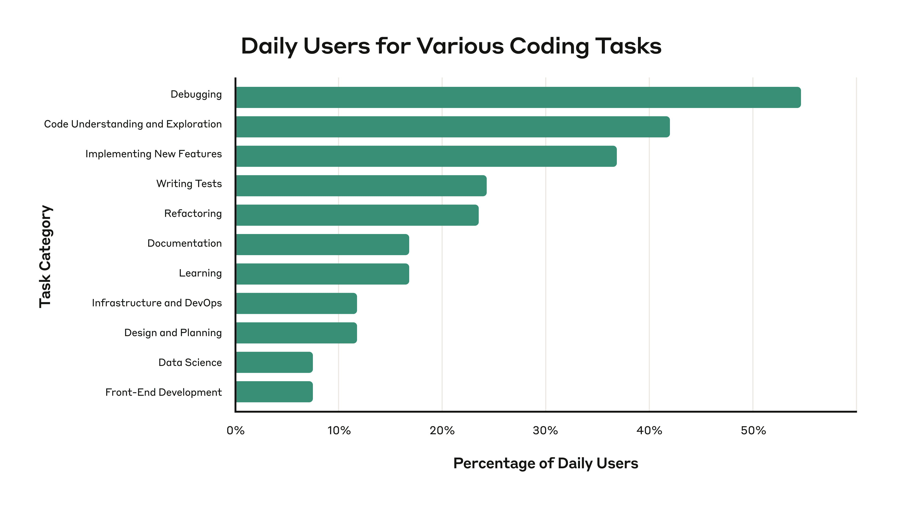
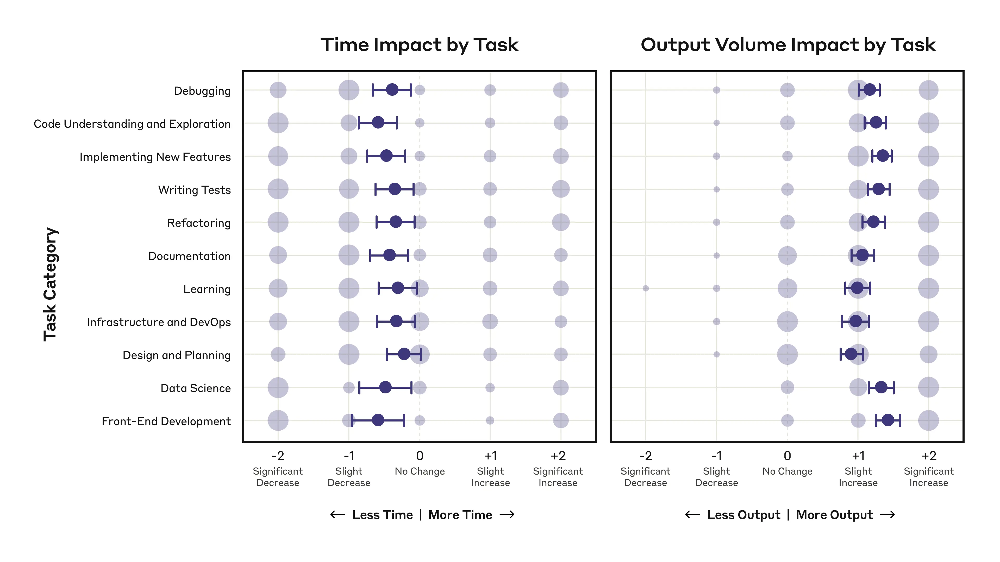
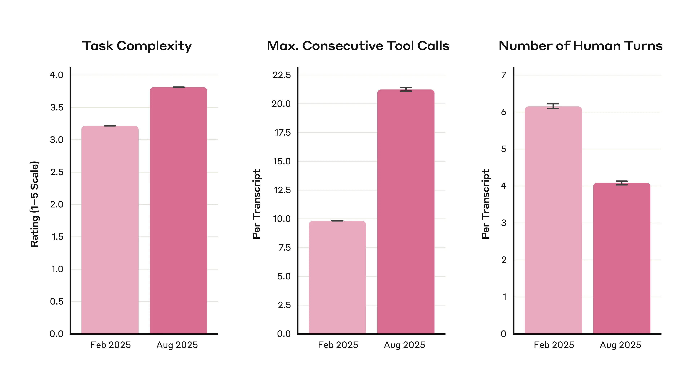
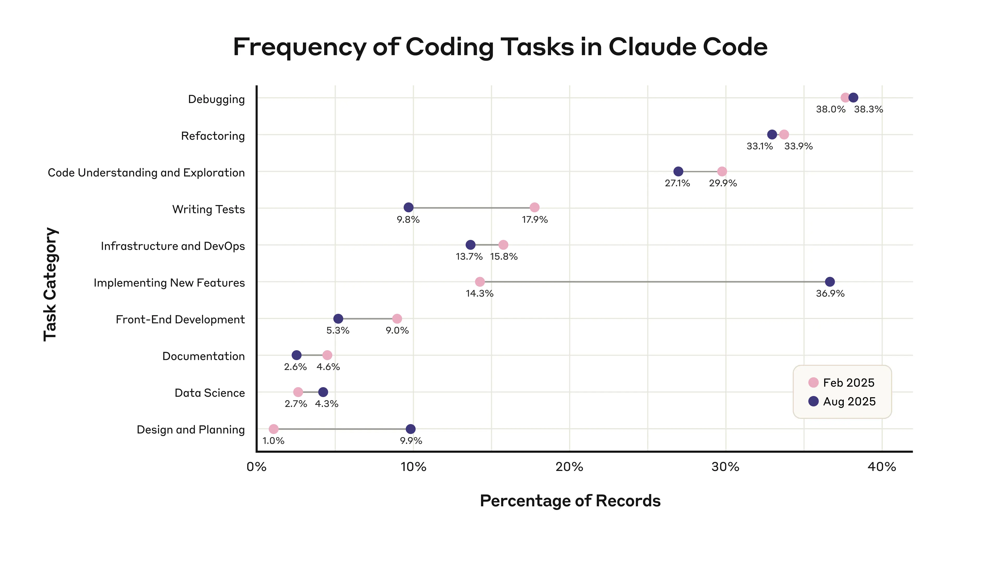
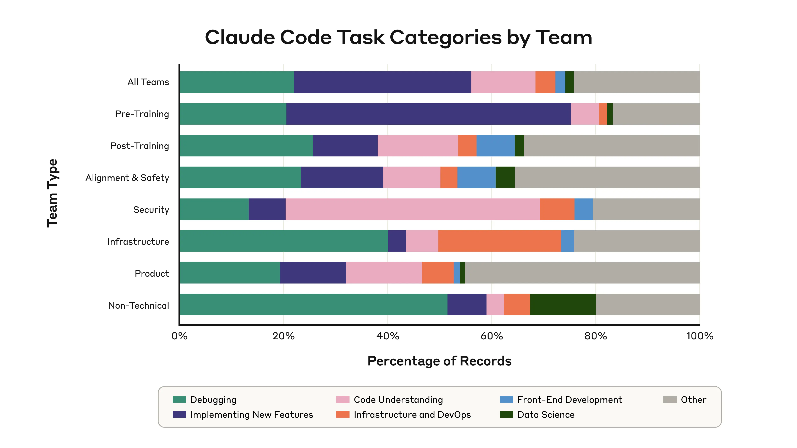

# AI 如何改变 Anthropic 的工作方式（中英对照）

> 原文标题：How AI Is Transforming Work at Anthropic
> 原文链接：https://www.anthropic.com/research/how-ai-is-transforming-work-at-anthropic
> 原文作者：Saffron Huang, Bryan Seethor, Esin Durmus, Kunal Handa, Miles McCain, Michael Stern, Deep Ganguli（Anthropic）
> 发布日期：2025-12-02
> **翻译模型：** GLM-5.3-Flash
> **评分：** ★★★★★（5/5，必读）—— 自家工程师/研究者的 132 份调查+53 次访谈+20 万份 Claude Code 转录：自主工具连链 9.8→21.2、27% 工作本不会发生、监督悖论与技能萎缩之辩
> 排版：每段英文原文在前，中文翻译紧随其后。默认收录正文主体；文末附录（方法论局限）未收录，如需可补充。

---

How is AI changing the way we work? Our previous research on AI's economic impacts looked at the labor market as a whole, covering a variety of different jobs. But what if we studied some of the earliest adopters of AI technology in more detail—namely, us?

AI 正如何改变我们的工作方式？我们此前关于 AI 经济影响的研究把劳动力市场当作整体来考察，覆盖各种不同的职业。但如果我们更细致地研究一些最早的 AI 技术采用者——也就是我们自己——会怎样？

Turning the lens inward, in August 2025 we surveyed 132 Anthropic engineers and researchers, conducted 53 in-depth qualitative interviews, and studied internal Claude Code usage data to find out how AI use is changing things at Anthropic. We find that AI use is radically changing the nature of work for software developers, generating both hope and concern.

我们把镜头转向内部：2025 年 8 月，我们调查了 132 位 Anthropic 工程师与研究者，做了 53 次深度定性访谈，并研究了内部 Claude Code 使用数据，以弄清 AI 的使用正在如何改变 Anthropic。我们发现，AI 的使用正在根本性地改变软件开发者的工作性质，同时带来希望与忧虑。

Our research reveals a workplace facing significant transformations: Engineers are getting a lot more done, becoming more "full-stack" (able to succeed at tasks beyond their normal expertise), accelerating their learning and iteration speed, and tackling previously-neglected tasks. This expansion in breadth also has people wondering about the trade-offs—some worry that this could mean losing deeper technical competence, or becoming less able to effectively supervise Claude's outputs, while others embrace the opportunity to think more expansively and at a higher level. Some found that more AI collaboration meant they collaborated less with colleagues; some wondered if they might eventually automate themselves out of a job.

我们的研究揭示了一个正经历重大转型的工作场所：工程师完成了多得多的工作，变得更「全栈」（能在自己惯常专长之外的任务上取得成功），学习与迭代速度加快，并开始处理以前被忽视的任务。这种广度扩张也让人们思考其代价——有人担心这可能意味着失去更精深的技术能力，或逐渐无力有效监督 Claude 的产出；另一些人则拥抱这一机会，得以更开阔、更高层次地思考。有人发现与 AI 协作增多意味着与同事协作减少；也有人怀疑自己最终会不会用 AI 把自己的工作自动化掉。

We recognize that studying AI's impact at a company building AI means representing a privileged position—our engineers have early access to cutting-edge tools, work in a relatively stable field, and are themselves contributing to the AI transformation affecting other industries. Despite this, we felt it was on balance useful to research and publish these findings, because what's happening inside Anthropic for engineers may still be an instructive harbinger of broader societal transformation. Our findings imply some challenges and considerations that may warrant early attention across sectors (though see the Limitations section in the Appendix for caveats). At the time this data was collected, Claude Sonnet 4 and Claude Opus 4 were the most capable models available, and capabilities have continued to advance.

我们意识到，在一家建造 AI 的公司里研究 AI 的影响，意味着呈现的是一个特权位置——我们的工程师能尽早使用最前沿的工具，身处一个相对稳定的行业，而且他们本身也在推动这场波及其他行业的 AI 转型。尽管如此，我们仍认为研究与发表这些发现总体上是有益的：Anthropic 内部工程师身上正在发生的事，或许仍是更大范围社会转型的有益前兆。我们的发现隐含一些可能值得各行业尽早关注的挑战与考量（注意事项见附录的「局限」一节）。在数据收集时，Claude Sonnet 4 与 Claude Opus 4 是可用的最强模型，此后能力仍在持续进步。

More capable AI brings productivity benefits, but it also raises questions about maintaining technical expertise, preserving meaningful collaboration, and preparing for an uncertain future that may require new approaches to learning, mentorship, and career development in an AI-augmented workplace. We discuss some initial steps we're taking to explore these questions internally in the Looking Forward section below. We also explored potential policy responses in our recent blog post on ideas for AI-related economic policy.

更强的 AI 带来生产率收益，但也提出了问题：如何保持技术专长、保留有意义的协作，以及如何为一个不确定的未来做准备——在 AI 增强的工作场所，学习、导师制与职业发展可能都需要新方法。在下文「展望未来」一节中，我们讨论了为在内部探索这些问题而迈出的初步步伐。我们还在近期关于 AI 相关经济政策构想的博客文章中探讨了潜在的政策应对。

## 主要发现（Key findings）

In this section, we briefly summarize the findings from our survey, interviews, and Claude Code data. We provide detailed findings, methods, and caveats in the subsequent sections below.

本节简要总结调查、访谈与 Claude Code 数据的发现。详细结果、方法与注意事项见后续各节。

**Survey data**

**调查数据**

- Anthropic engineers and researchers use Claude most often for fixing code errors and learning about the codebase. Debugging and code understanding are the most common uses (Figure 1).
- People report increasing Claude usage and productivity gains. Employees self-report using Claude in 60% of their work and achieving a 50% productivity boost, a 2-3x increase from this time last year. This productivity looks like slightly less time per task category, but considerably more output volume (Figure 2).
- 27% of Claude-assisted work consists of tasks that wouldn't have been done otherwise, such as scaling projects, making nice-to-have tools (e.g. interactive data dashboards), and exploratory work that wouldn't be cost-effective if done manually.
- Most employees use Claude frequently while reporting they can "fully delegate" 0-20% of their work to it. Claude is a constant collaborator but using it generally involves active supervision and validation, especially in high-stakes work—versus handing off tasks requiring no verification at all.

- Anthropic 的工程师与研究者最常把 Claude 用于修复代码错误与了解代码库。调试（debugging）与代码理解是最常见的用途（图 1）。
- 员工报告 Claude 使用量与生产率收益都在上升。员工自报在 60% 的工作中使用 Claude，并获得 50% 的生产率提升，是一年前同期的 2–3 倍。这种生产率表现为：每个任务类别花费的时间略少，但产出量大幅增加（图 2）。
- 27% 的 Claude 辅助工作属于「没有 Claude 就不会做」的任务，例如项目规模化、制作锦上添花的工具（如交互式数据看板）、以及手动做不划算的探索性工作。
- 大多数员工高频使用 Claude，但报告自己只能把 0–20% 的工作「完全委托」给它。Claude 是一个常驻协作者，但使用它通常需要主动监督与验证——在高风险工作中尤其如此——而不是交出完全无需核验的任务。

**Qualitative interviews**

**定性访谈**

- Employees are developing intuitions for AI delegation. Engineers tend to delegate tasks that are easily verifiable, where they "can relatively easily sniff-check on correctness", low-stakes (e.g. "throwaway debug or research code"), or boring ("The more excited I am to do the task, the more likely I am to not use Claude"). Many describe a trust progression, starting with simple tasks and gradually delegating more complex work—and while they're currently keeping most design or "taste" tasks, this boundary is being renegotiated as models improve.
- Skillsets are broadening into more areas, but some are getting less practice. Claude enables people to broaden their skills into more areas of software engineering ("I can very capably work on front-end, or transactional databases... where previously I would've been scared to touch stuff"), but some employees are also concerned, paradoxically, about the atrophy of deeper skillsets required for both writing and critiquing code—"When producing output is so easy and fast, it gets harder and harder to actually take the time to learn something."
- Changing relationship to coding craft. Some engineers embrace AI assistance and focus on outcomes ("I thought that I really enjoyed writing code, and I think instead I actually just enjoy what I get out of writing code"); others say that "there are certainly some parts of [writing code] that I miss."
- Workplace social dynamics may be changing. Claude is now the first stop for questions that used to go to colleagues—some report fewer mentorship and collaboration opportunities as a result. ("I like working with people and it's sad that I 'need' them less now… More junior people don't come to me with questions as often.")
- Career evolution and uncertainty. Engineers report shifting toward higher-level work managing AI systems and report significant productivity gains. However, these changes also raise questions about the long-term trajectory of software engineering as a profession. Some express conflicting feelings about the future: "I feel optimistic in the short term but in the long term I think AI will end up doing everything and make me and many others irrelevant." Others emphasize genuine uncertainty, saying only that it was "hard to say" what their roles might look like in a few years' time.

- 员工正在形成对「AI 委托」的直觉。工程师倾向于委托容易验证的任务——他们「能相对轻松地嗅查出正确性」——低风险的任务（如「用完即弃的调试或研究代码」），或无聊的任务（「我对一个任务越兴奋，就越可能不用 Claude」）。许多人描述了一种信任进阶：从简单任务开始，逐渐委托更复杂的工作——虽然他们目前仍把大多数设计或「品味」任务留给自己，但随着模型进步，这条边界正被重新协商。
- 技能面在向更多领域扩展，但有些技能练习变少了。Claude 让人们把技能拓展到软件工程的更多领域（「我现在可以很有把握地做前端，或事务型数据库……而以前我会不敢碰这些不擅长的东西」），但一些员工也矛盾地担心：写作与批判代码所需的更深技能会萎缩——「当产出变得如此容易快捷，真正花时间去学点东西反而越来越难。」
- 与编程手艺的关系在变化。一些工程师拥抱 AI 协助、聚焦结果（「我以为我真的很享受写代码，后来发现我享受的其实是写代码带给我的东西」）；另一些人则说「写代码这件事里，确实有一些部分是我想念的」。
- 职场社交动态可能在改变。Claude 成了那些曾经会去问同事的问题的第一站——一些人因此报告导师制与协作机会变少。（「我喜欢和人共事，现在我对他们的『需要』变少了，这让人难过……资历更浅的同事不再像以前那样常来问我问题。」）
- 职业演进与不确定。工程师报告自己的工作转向管理 AI 系统的高层工作，并报告了显著的生产率收益。但这些变化也引发对软件工程作为一个职业的长期走向的疑问。一些人对未来表达了矛盾的情绪：「短期我感到乐观，但长期看，我认为 AI 最终会做完所有事，让我和其他很多人变得无关紧要。」另一些人则强调真正的不确定，只说几年后自己的角色会是什么样「很难讲」。

**Claude Code usage trends**

**Claude Code 使用趋势**

- Claude is handling increasingly complex tasks more autonomously. Six months ago, Claude Code would complete about 10 actions on its own before needing human input. Now, it generally handles around 20, needing less frequent human steering to complete more complex workflows (Figure 3). Engineers increasingly use Claude for complex tasks like code design/planning (1% to 10% of usage) and implementing new features (14% to 37%) (Figure 4).
- Claude fixes a lot of "papercuts". 8.6% of Claude Code tasks involve fixing minor issues that improve quality of life, like refactoring code for maintainability (that is, "fixing papercuts") that people say would typically be deprioritized. These small fixes could add up to larger productivity and efficiency gains.
- Everyone is becoming more "full-stack". Different teams use Claude in different ways, often to augment their core expertise—Security uses it to analyze unfamiliar code, Alignment & Safety use it to build front-end visualizations of their data, and so on (Figure 5).

- Claude 正更自主地处理越来越复杂的任务。六个月前，Claude Code 在需要人类输入之前大约能自主完成 10 个动作；现在通常能处理约 20 个，完成更复杂的工作流所需的「人类掌舵」更少（图 3）。工程师越来越多地把 Claude 用于复杂任务，如代码设计/规划（占用量从 1% 升至 10%）与实现新功能（从 14% 升至 37%）（图 4）。
- Claude 修复了大量「纸割伤」（papercuts）。8.6% 的 Claude Code 任务是修复那些改善生活质量的小问题，比如为可维护性重构代码（即「修纸割伤」）——人们说这类事通常会被降级排后。这些小修小补可能累积成更大的生产率与效率收益。
- 人人都在变得更「全栈」。不同团队以不同方式使用 Claude，常常是用来增强自己的核心专长——安全团队用它分析陌生代码，对齐与安全团队用它给数据做前端可视化，等等（图 5）。

## 调查数据（Survey data）

We surveyed 132 Anthropic engineers and researchers from across the organization about their Claude use, to better understand how exactly they were using it day-to-day. We distributed our survey through internal communication channels and direct outreach to employees across diverse teams representing both research and product functions. We have included a Limitations section in the Appendix with more methodological details, and we are sharing our survey questions so others can evaluate our approach and adapt it for their own research.

我们调查了全组织 132 位 Anthropic 工程师与研究者关于 Claude 的使用，以更好地理解他们日常究竟如何使用它。调查通过内部沟通渠道分发，并直接触达了代表研究与产品职能的多个多元团队的员工。我们在附录中加入了「局限」一节以说明更多方法学细节，并公开我们的调查问题，供他人评估我们的方法或改编用于自己的研究。

### 人们在用 Claude 做哪些编程任务？（What coding tasks are people using Claude for?）

We asked the surveyed engineers and researchers to rate how often they used Claude for various types of coding tasks, such as "debugging" (using Claude to help fix errors in code), "code understanding" (having Claude explain existing code to help the human user understand the codebase), "refactoring" (using Claude to help restructure existing code), and "data science" (e.g. having Claude analyze datasets and make bar charts).

我们请受访的工程师与研究者评定他们把 Claude 用于各类编程任务的频率，例如「调试」（用 Claude 帮忙修代码错误）、「代码理解」（让 Claude 解释现有代码以帮助使用者理解代码库）、「重构」（用 Claude 协助重构既有代码）与「数据科学」（例如让 Claude 分析数据集并画柱状图）。

Below are the most common daily tasks. Most employees (55%) used Claude for debugging on a daily basis. 42% used Claude everyday for code understanding, and 37% used Claude everyday for implementing new features. The less-frequent tasks were high level design/planning (likely because these are tasks people tend to keep in human hands), as well as data science and front-end development (likely because they are overall less common tasks). This roughly aligns with the Claude Code usage data distribution reported in the "Claude Code usage trends" section.

以下是最常见的日常任务。大多数员工（55%）每天用 Claude 做调试。42% 每天用 Claude 做代码理解，37% 每天用 Claude 实现新功能。频率较低的任务是高阶设计/规划（可能因为人们倾向于把这类任务留在人的手里），以及数据科学与前端开发（可能因为它们整体上较少见）。这与「Claude Code 使用趋势」一节报告的 Claude Code 使用数据分布大致一致。



> Figure 1: Proportion of daily users (x-axis) for various coding tasks (y-axis).

### 使用与生产率（Usage and productivity）

Employees self-reported that 12 months ago, they used Claude in 28% of their daily work and got a +20% productivity boost from it, whereas now, they use Claude in 59% of their work and achieve +50% productivity gains from it on average. (This roughly corroborates the 67% increase in merged pull requests—i.e. successfully incorporated changes to code—per engineer per day we saw when we adopted Claude Code across our Engineering org.) The year-on-year comparison is quite dramatic—this suggests a more than 2x increase in both metrics in one year. Usage and productivity are also strongly correlated, and at the extreme end of the distribution, 14% of respondents are increasing their productivity by more than 100% by using Claude—these are our internal "power users."

员工自报：12 个月前，他们在 28% 的日常工作中使用 Claude，并从中获得 +20% 的生产率提升；而现在，他们在 59% 的工作中使用 Claude，平均获得 +50% 的生产率收益。（这与我们在整个工程组织采用 Claude Code 后观察到的「每位工程师每天合并的 pull request——即成功并入代码的变更——增加 67%」大致相互印证。）这一同比变化相当惊人——意味着两项指标一年内都增长了一倍以上。使用量与生产率也强相关；在分布的极端处，14% 的受访者借助 Claude 把自己的生产率提高了一倍以上——他们是我们内部的「高用量用户」。

To caveat this finding (and other self-reported productivity findings below), productivity is difficult to precisely measure (see Appendix for more limitations). There is recent work from METR, an AI research nonprofit, showing that experienced developers working with AI on highly familiar codebases overestimated their productivity boost from AI. That being said, the factors that METR identified as contributing to lower productivity than expected (e.g. AI performing worse in large, complex environments, or where there's a lot of tacit knowledge/context necessary) closely correspond to the types of tasks our employees said they don't delegate to Claude (see AI delegation approaches, below). Our productivity gains, self-reported across tasks, might reflect employees developing strategic AI delegation skills—something not accounted for in the METR study.

需要为这一发现（以及下文其他自报生产率发现）加个限定：生产率难以精确测量（更多局限见附录）。AI 研究非营利组织 METR 最近的工作表明，经验丰富的开发者在高度熟悉的代码库上与 AI 协作时，会高估 AI 带来的生产率提升。话虽如此，METR 认定导致生产率低于预期的那些因素（例如 AI 在大型复杂环境中、或在需要大量隐性知识/语境的场景下表现较差），与我们员工说自己不会委托给 Claude 的任务类型高度对应（见下文「AI 委托策略」）。我们按任务自报的生产率收益，可能反映了员工正在发展策略性的 AI 委托技能——这是 METR 研究没有计入的。

An interesting productivity pattern emerges when asking employees, for task categories where they currently use Claude, how it affects their overall time spent and work output volume in that task category. Across almost all task categories, we see a net decrease in time spent, and a larger net increase in output volume:

让员工回答「在你当前使用 Claude 的任务类别上，它如何影响你在该类别的总耗时与产出量」时，浮现出一个有趣的生产率模式：几乎所有任务类别上，我们都看到耗时净减少，而产出量净增加的幅度更大：



> Figure 2: Impact on time spent (left panel) and output volume (right panel) by task (y-axis). The x-axis on each plot corresponds to either a self-reported decrease (negative values), increase (positive values) or no change (vertical dashed line) in time spent or output volume for categories of Claude-assisted tasks, compared to not using Claude. Error bars show 95% confidence intervals. Circle area is proportional to the number of responses at each rating point. Only respondents who reported using Claude for each task category are included.

However, when we dig deeper into the raw data, we see that the time saving responses cluster at opposite ends—some people spend significantly more time on tasks that are Claude-assisted.

然而，深挖原始数据后我们看到，时间节约的回答聚在两端——一些人在 Claude 辅助的任务上花费的时间显著更多。

Why is that? People generally explained that they had to do more debugging and cleanup of Claude's code (e.g. "when I vibe code myself into a corner"), and shoulder more cognitive overhead for understanding Claude's code since they didn't write it themselves. Some mentioned spending more time on tasks in an enabling sense—one said that using Claude helps them "persist on tasks that I previously would've given up on immediately"; another said it helps them do more thorough testing and also more learning and exploration in new codebases. It seems that generally, engineers experiencing time savings may be those who are scoping quickly-verifiable tasks for Claude, while those spending more time might be debugging AI-generated code or working in domains where Claude needs more guidance.

为什么会这样？人们普遍解释说，他们要为 Claude 的代码做更多调试与清理（例如「当我 vibe coding 把自己逼进死胡同」），而且因为代码不是自己写的，理解 Claude 的代码要背负更多认知负担。也有人提到从「赋能」意义上花更多时间：一位说使用 Claude 帮他们「坚持完成以前会立刻放弃的任务」；另一位说它帮他们做更彻底的测试，也促成了在新代码库中更多的学习与探索。总的来看，体验到时间节约的工程师，可能是那些为 Claude 圈定「可快速验证」任务的人；而花费更多时间的人，可能在调试 AI 生成的代码，或在 Claude 需要更多指导的领域工作。

It is also not clear from our data where reported time savings are being reinvested—whether into additional engineering tasks, non-engineering tasks, interacting with Claude or reviewing its output, or activities outside of work. Our task categorization framework does not capture all the ways engineers might allocate their time. Additionally, the time savings may reflect perception biases in self-reporting. Further research is needed to disentangle these effects.

我们的数据也不清楚报告的时间节约被再投资到了哪里——是更多工程任务、非工程任务、与 Claude 交互或审查其产出，还是工作之外的活动。我们的任务分类框架没有覆盖工程师分配时间的所有方式。此外，时间节约可能反映自报中的感知偏差。要厘清这些效应还需要进一步研究。

Output volume increases are more straightforward and substantial; there is a larger net increase across all task categories. This pattern makes sense when we consider that people are reporting on task categories (like "debugging" overall) rather than individual tasks—i.e. people can spend slightly less time on debugging as a category while producing much more debugging output overall. Productivity is very hard to measure directly, but this self-reported data suggests that AI enables increased productivity at Anthropic primarily through greater output volume.

产出量的增加则更直接、更可观：所有任务类别都有较大的净增长。考虑到人们报告的是任务类别（比如「调试」整体）而非单个任务，这一模式是合理的——也就是说，人们可以在「调试」这一类别上花费略少的时间，同时产出多得多的调试成果。生产率极难直接测量，但这些自报数据提示：AI 在 Anthropic 带来的生产率提升，主要是通过更大的产出量实现的。

### Claude 催生的新工作（Claude enabling new work）

One thing we were curious about: Is Claude enabling qualitatively new kinds of work, or would Claude-assisted work have been done by employees eventually (albeit potentially at a slower rate)?

我们好奇的一件事是：Claude 是否催生了质上全新的工作？还是说这些 Claude 辅助的工作员工最终也会做（只是可能更慢）？

Employees estimated that 27% of their Claude-assisted work wouldn't have been done without it. Engineers cited using AI for scaling projects, nice-to-haves (e.g. interactive data dashboards), useful but tedious work like documentation and testing, and exploratory work that wouldn't be cost-effective manually. As one person explained, they can now fix more "papercuts" that previously damaged quality of life, such as refactoring badly-structured code, or building "small tools that help accomplish another task faster." We looked for this in our usage data analysis as well, and found that 8.6% of Claude Code tasks involve 'papercut fixes.'

员工估计，他们 27% 的 Claude 辅助工作没有 Claude 就不会发生。工程师列举了用 AI 扩大规模的项目、锦上添花之物（如交互式数据看板）、有用但繁琐的文档与测试工作，以及手动做不划算的探索性工作。正如一位员工解释的，他们现在能修复更多以前损害生活质量的「纸割伤」，比如重构结构糟糕的代码，或制作「能帮另一件事更快完成的小工具」。我们在使用数据分析中也专门找了这一点：8.6% 的 Claude Code 任务属于「纸割伤修复」。

Another researcher explained that they ran many versions of Claude simultaneously, all exploring different approaches to a problem:

另一位研究者解释说，他们会同时运行多个 Claude 实例，分别探索同一问题的不同路径：

> People tend to think about super capable models as a single instance, like getting a faster car. But having a million horses… allows you to test a bunch of different ideas… It's exciting and more creative when you have that extra breadth to explore.

> 人们往往把超强力模型想成单个实例，好比换一辆更快的车。但拥有一百万匹马……让你能同时试一大堆不同的想法……当你有这份额外的探索广度时，一切都更激动人心、更有创造性。

As we'll see in the following sections, this new work often involves engineers tackling tasks outside their core expertise.

正如后文各节将展示的，这些新工作往往意味着工程师在自己核心专长之外作战。

### 多少工作可以完全委托给 Claude？（How much work can be fully delegated to Claude?）

Although engineers use Claude frequently, more than half said they can "fully delegate" only between 0-20% of their work to Claude. (It's worth noting that there is variation in how respondents might interpret "fully delegate"—from tasks needing no verification at all to those that are reliable enough to require only light oversight.) When explaining why, engineers described working actively and iteratively with Claude, and validating its outputs—particularly for complex tasks or high-stakes areas where code quality standards are critical. This suggests that engineers tend to collaborate closely with Claude and check its work rather than handing off tasks without verification, and that they set a high bar for what counts as "fully delegated."

虽然工程师频繁使用 Claude，但超过半数人说自己只能把 0–20% 的工作「完全委托」给 Claude。（值得注意的是，受访者对「完全委托」的理解存在差异——从完全无需验证的任务，到可靠到只需轻量监督的任务。）在解释原因时，工程师描述了自己与 Claude 的主动、迭代式协作，以及对其产出的验证——在复杂任务或代码质量标准攸关的高风险领域尤其如此。这表明工程师倾向于与 Claude 紧密协作并检查其工作，而不是不加验证地甩手交付；他们对什么才算「完全委托」设置了很高的门槛。

## 定性访谈（Qualitative interviews）

While these survey findings reveal significant productivity gains and changing work patterns, they raise questions about how engineers are actually experiencing these changes day-to-day. To understand the human dimension behind these metrics, we conducted in-depth interviews with 53 of the Anthropic engineers and researchers who responded to the survey, to get more insight into how they're thinking and feeling about these changes in the workplace.

虽然这些调查发现揭示了显著的生产率收益与变化的工作模式，但也引出问题：工程师在日常中究竟如何体验这些变化？为了理解这些指标背后「人」的维度，我们对 53 位回答了调查的 Anthropic 工程师与研究者做了深度访谈，以进一步了解他们对职场中这些变化的想法与感受。

### AI 委托策略（AI delegation approaches）

Engineers and researchers are developing a variety of strategies for productively leveraging Claude in their workflow. People generally delegate tasks that are:

工程师与研究者正在发展各种策略，以便在工作流中高效地利用 Claude。人们一般会委托这样的任务：

- **Outside the user's context and low complexity**: "I use Claude for things where I have low context, but think that the overall complexity is also low." "The majority of the infra[structure] problems I have are not difficult and can be handled by Claude… I don't know Git or Linux very well… Claude does a good job covering for my lack of experience in these areas."
- **Easily verifiable**: "It's absolutely amazing for everything where validation effort isn't large in comparison to creation effort."
- **Well-defined or self-contained**: "If a subcomponent of the project is sufficiently decoupled from the rest, I'll get Claude to take a stab."
- **Code quality isn't critical**: "If it's throwaway debug[ging] or research code, it goes straight to Claude. If it's conceptually difficult or needs some very specific type of debug injection, or a design problem, I do it myself."
- **Repetitive or boring**: "The more excited I am to do the task, the more likely I am to not use Claude. Whereas if I'm feeling a lot of resistance… I often find it easier to start a conversation with Claude about the task." In our survey, on average people said that 44% of Claude-assisted work consisted of tasks they wouldn't have enjoyed doing themselves.
- **Faster to prompt than execute**: "[For] a task that I anticipate will take me less than 10 minutes... I'm probably not going to bother using Claude." "The cold start problem is probably the biggest blocker right now. And by cold start, I mean there is a lot of intrinsic information that I just have about how my team's code base works that Claude will not have by default… I could spend time trying to iterate on the perfect prompt [but] I'm just going to go and do it myself."

- **超出使用者语境且复杂度低**：「我用 Claude 处理我语境不足、但整体复杂度也低的事。」「我的基础设施问题大多不难，Claude 都能搞定……我不太懂 Git 或 Linux……Claude 很好地弥补了我在这些领域经验的不足。」
- **容易验证**：「只要验证成本相对创建成本不大，Claude 就绝对好使。」
- **定义良好或自成一体**：「如果项目的某个子组件与其余部分解耦得足够好，我会让 Claude 试一试。」
- **代码质量不关键**：「如果是一次性的调试或研究代码，直接丢给 Claude。如果是概念上困难的、需要某种非常特定的调试注入的、或设计问题，我自己来。」
- **重复或无聊**：「我对一个任务越兴奋，就越可能不用 Claude。而如果我内心很抗拒……我发现跟 Claude 聊聊这个任务反而更容易上手。」在我们的调查中，人们平均说 44% 的 Claude 辅助工作是自己本来不会乐意做的任务。
- **写提示比动手快**：「[对于] 我预计花不了 10 分钟的任务……我大概懒得用 Claude。」「冷启动问题可能是现在最大的障碍。所谓冷启动，是指我脑中有大量关于我们团队代码库如何运转的内在信息，Claude 默认不会有……与其花时间迭代完美的提示词，我还不如自己动手。」

These factors mentioned by our employees in their decisions about delegation were similar to those found to explain AI-related productivity slowdowns (such as high developer familiarity with codebase, large and complex repositories) in an external study from METR. The convergence on these delegation criteria across our interviews suggests that appropriate task choice is an important factor in AI productivity gains (which should be carefully controlled for in future productivity studies).

我们的员工在委托决策中提到的这些因素，与 METR 外部研究中解释「AI 相关生产率放缓」的因素（如开发者对代码库高度熟悉、仓库庞大复杂）颇为相似。访谈中这些委托标准的高度一致提示：恰当的任务选择是 AI 生产率收益的重要因素（未来的生产率研究应仔细控制这一变量）。

#### 信任但要验证（Trust but verify）

Many users described a progression in their Claude usage that involved delegating increasingly complex tasks over time: "At first I used AI tools with basic questions about Rust programming language... Lately, I've been using Claude Code for all my coding."

许多用户描述了使用 Claude 的进阶过程：随时间推移委托越来越复杂的任务。「起初我只用 AI 工具问 Rust 编程语言的基础问题……最近，我所有编码都交给 Claude Code。」

One engineer likened the trust progression to adopting other technologies, like Google Maps:

一位工程师把这种信任进阶类比为接受其他技术，比如谷歌地图：

> In the beginning I would use [Google Maps] only for routes I didn't know... This is like me using Claude to write SQL that I didn't know, but not asking it to write Python that I did. Then I started using Google Maps on routes that I mostly knew, but maybe I didn't know the last mile... Today I use Google Maps all the time, even for my daily commute. If it says to take a different way I do, and just trust that it considered all options... I use Claude Code in a similar way today.

> 一开始我只在不认识路的时候用[谷歌地图]……这就像我用 Claude 写我不会的 SQL，但不让它写我会的 Python。后来我开始在基本认识、但「最后一公里」不熟的路线上用它……今天我随时都在用谷歌地图，连日常通勤也一样。如果它说该换条路，我就照做，相信它权衡过所有选项……我现在用 Claude Code 也是类似的方式。

Engineers are split on whether to use Claude within or outside their expertise. Some use it for "peripheral" domains to save implementation time; others prefer familiar territory where they can verify outputs ("I use Claude in such a way where I still have full understanding of what it's doing"). A security engineer highlighted the importance of experience when Claude proposed a solution that was "really smart in the dangerous way, the kind of thing a very talented junior engineer might propose". That is, it was something that could only be recognised as problematic by users with judgment and experience.

在「在专长之内还是之外用 Claude」上，工程师意见分歧。一些人在「外围」领域用它以节省实现时间；另一些人偏好熟悉领域，以便验证产出（「我用 Claude 的方式，是让自己始终完全理解它在做什么」）。一位安全工程师强调了经验的重要性：Claude 曾提出一个「危险意义上的聪明方案，属于非常有才华的初级工程师可能提的那种点子」。也就是说，只有具备判断力与经验的使用者才能识别出它有问题。

Other engineers use Claude for both types of tasks, either in an experimental way ("I basically always use Claude to take a first crack at any coding problem"), or by adapting their approach depending on their level of expertise in the task:

另一些工程师两类任务都用 Claude：或者以实验方式（「基本上任何编码问题我都先让 Claude 打头阵」），或者根据自己在该任务上的专长水平调整用法：

> I use the tools for both things that are core to my expertise (as an accelerant, where I know what to expect and can guide the agent effectively), and for things that are slightly outside my area of expertise, where I know roughly what to expect but that Claude is able to fill in the gaps in my memory or familiarity with specific definitions.

> 我把工具既用在专长核心之事上（当加速器用，我知道该期待什么、能有效引导 agent），也用在略微超出我专长的事上——大致知道该期待什么，而 Claude 能补上我记忆里或对特定定义的熟悉度上的缺口。

> If it's something that I am particularly versed about, I will be more assertive and tell Claude what it needs to track down. If it's something I'm not sure about I often ask it to be the expert and give me options and insights on things I should consider and research.

> 如果是我特别精通的东西，我会更强硬，直接告诉 Claude 它需要追查什么。如果是我没把握的东西，我常让它当专家，给我选项与洞见，告诉我该考虑、该研究什么。

#### 人们把什么任务留给自己？（What tasks do people keep for themselves?）

People consistently said they didn't use Claude for tasks involving high-level or strategic thinking, or for design decisions that require organizational context or "taste." One engineer explained: "I usually keep the high-level thinking and design. I delegate anything I can from new feature development to debugging." This is reflected in our survey data, which showed the least productivity gains for design and planning tasks (Figure 2). Many people described delegation boundaries as a "moving target," though, regularly renegotiated as models improve (below, the Claude Code usage data shows relatively more coding design/planning usage now than six months ago).

人们一致表示，涉及高层或战略思考的任务不用 Claude，需要组织语境或「品味」的设计决策也不用。一位工程师解释：「我通常把高层思考与设计留在手里。从新功能开发到调试，能委托的都委托。」这一点在调查数据中也有反映：设计与规划任务的生产率收益最低（图 2）。不过许多人把委托边界描述为「移动靶」——随着模型进步不断重新协商（下文的 Claude Code 使用数据显示，与六个月前相比，现在编码设计/规划的使用占比相对更高）。

### 技能转变（Skill transformations）

#### 新能力……（New capabilities…）

The survey finding that 27% of Claude-assisted work wouldn't have been done otherwise reflects a broader pattern: engineers using AI to work outside their core expertise. Many employees report completing work previously outside their expertise—backend engineers building UIs; researchers creating visualizations. One backend engineer described building a complex UI by iterating with Claude: "It did a way better job than I ever would've. I would not have been able to do it, definitely not on time... [The designers] were like 'wait, you did this?' I said 'No, Claude did this - I just prompted it.'"

调查中「27% 的 Claude 辅助工作本不会发生」这一发现，反映了一个更广的模式：工程师用 AI 在核心专长之外工作。许多员工报告完成了以前不属于自己专长的工作——后端工程师做 UI；研究者做可视化。一位后端工程师描述了通过与 Claude 迭代构建复杂 UI 的经历：「它做得比我能做到的好得多。我自己肯定做不出来，更不可能按时……[设计师们]愣住了：『等等，这是你做的？』我说『不，是 Claude 做的——我只是给了提示。』」

Engineers report "becoming more full-stack… I can very capably work on front-end, or transactional databases, or API code, where previously I would've been scared to touch stuff I'm less of an expert on." This capability expansion enables tighter feedback loops and faster learning—one engineer said that a "couple week process" of building, scheduling meetings, and iterating could become "a couple hour working session" with colleagues present for live feedback.

工程师们报告自己「正变得更全栈……我现在可以很有把握地做前端、事务型数据库或 API 代码，而以前我会不敢碰这些自己不那么擅长领域的东西」。这种能力扩张带来更紧的反馈回路与更快的学习——一位工程师说，以前「耗时几周」的构建、约会议、迭代流程，如今可以变成「几个小时的共同工作时段」，同事在场即时反馈。

In general, people were enthused by their new ability to prototype quickly, parallelize work, reduce toil, and generally raise their level of ambition. One senior engineer told us, "The tools are definitely making junior engineers more productive and more bold with the types of projects they will take on." Some also said that the reduced "activation energy" of using Claude enabled them to defeat procrastination more easily, "dramatically decreas[ing] the energy required for me to want to start tackling a problem and therefore I'm willing to tackle so many additional things."

总体而言，人们为快速原型、并行工作、减少苦役、普遍抬高自己的野心水平而兴奋。一位资深工程师告诉我们：「这些工具确实让初级工程师更有生产力，也更敢于承接各类项目。」还有人表示，使用 Claude 降低了「激活能」，让他们更容易战胜拖延——「大幅降低了我着手处理一个问题所需的心理能量，因此我愿意去搞定多得多的额外事项。」

#### ……以及动手练习的减少（…and less hands-on practice）

At the same time, some were worried about "skills atrophying as [they] delegate more", and losing the incidental (or "collateral") learning that happens during manual problem-solving:

与此同时，一些人也担心「委托越多、技能越萎缩」，以及失去手动解决问题过程中发生的附带（「伴随性」）学习：

> If you were to go out and debug a hard issue yourself, you're going to spend time reading docs and code that isn't directly useful for solving your problem—but this entire time you're building a model of how the system works. There's a lot less of that going on because Claude can just get you to the problem right away.

> 如果你自己去调试一个难题，你会花时间读那些对解决问题并非直接有用的文档与代码——但这整个过程里，你在构建「系统如何运转」的心智模型。现在这种事少多了，因为 Claude 能直接把你带到问题跟前。

> I used to explore every config to understand what the tool can do but now I rely on AI to tell me how to use new tools and so I lack the expertise. In conversations with other teammates I can instantly recall things vs now I have to ask AI.

> 以前我会翻遍每个配置来搞懂工具能做什么，现在依赖 AI 告诉我怎么用新工具，于是缺少了那份专长。以前和队友讨论时我能立刻想起各种细节，现在得去问 AI。

> Using Claude has the potential to skip the part where I learn how to perform a task by solving an easy instance, and then struggle to solve a more complicated instance later.

> 用 Claude 有可能跳过这个环节：先通过解决简单实例学会做某件事，之后再攻坚更复杂的实例。

One senior engineer said they'd be more worried about their skills if they were more junior:

一位资深工程师说，如果自己更资浅，会更担心技能问题：

> I'm primarily using AI in cases where I know what the answer should be or should look like. I developed that ability by doing SWE 'the hard way'... But if I were [earlier in my career], I would think it would take a lot of deliberate effort to continue growing my own abilities rather than blindly accepting the model output.

> 我主要在我知道答案应该是什么样的时候用 AI。那种判断力是当年「用笨办法」做软件工程练出来的……但如果我处在职业早期，我会认为需要付出大量刻意的努力去继续成长自己的能力，而不是盲收模型输出。

One reason that the atrophy of coding skills is concerning is the "paradox of supervision"—as mentioned above, effectively using Claude requires supervision, and supervising Claude requires the very coding skills that may atrophy from AI overuse. One person said:

编程技能萎缩之所以令人担忧，一个原因是「监督悖论」——如上所述，有效使用 Claude 需要监督，而监督 Claude 恰恰需要那些可能因过度使用 AI 而萎缩的编程技能。一位员工说：

> Honestly, I worry much more about the oversight and supervision problem than I do about my skill set specifically… having my skills atrophy or fail to develop is primarily gonna be problematic with respect to my ability to safely use AI for the tasks that I care about versus my ability to independently do those tasks.

> 说实话，与技能本身相比，我更担心监督问题……我的技能萎缩或得不到发展，主要的问题不在于我还能不能独立做那些任务，而在于我还能不能安全地用 AI 做我关心的那些任务。

To combat this, some engineers deliberately practice without AI: "Every once in a while, even if I know that Claude can nail a problem, I will not ask it to. It helps me keep myself sharp."

为了对抗这一点，一些工程师刻意进行无 AI 练习：「隔一段时间，即使我知道 Claude 能漂亮地解决某个问题，我也不让它做。这帮我保持锋利。」

#### 我们还需要那些动手编程技能吗？（Will we still need those hands-on coding skills?）

Perhaps software engineering is moving to higher levels of abstraction, which it has done in the past. Early programmers worked much closer to the machine—manually managing memory, writing in assembly language, or even toggling physical switches to input instructions. Over time, higher-level, more human-readable languages emerged that automatically handled complex, low-level operations. Perhaps, in particular with the rise of "vibe coding", we're now moving to English as a programming language. One of our staff suggested that aspiring engineers "get good at having AIs [write code], and focus on learning higher level concepts and patterns."

也许软件工程正在向更高的抽象层级迁移——正如它过去所做的那样。早期程序员离机器近得多：手动管理内存、写汇编语言，甚至扳动物理开关来输入指令。随着时间推移，出现了更高级、更接近人类可读的语言，自动处理复杂的底层操作。也许，尤其在「vibe coding」兴起的当下，我们正在把英语变成编程语言。我们的一位员工建议有志工程师「练好『让 AI 写代码』的本领，专注于学习更高层的概念与模式」。

A few employees said they felt that this shift empowers them to think at a higher level—"about the end product and the end user" rather than just the code. One person described the current shift by comparing it to previously having to learn linked-lists in computer science—fundamental structures that higher-level programming languages now handle automatically. "I'm very glad I knew how to do that... [but] doing those low level operations isn't particularly important emotionally. I would rather care about what the code allows me to do." Another engineer made a similar comparison, but noted that abstraction comes at a cost—with the move to higher-level languages, most engineers lost a deep understanding of memory handling.

一些员工说，这种转变让他们的思考上升到更高层次——关注「最终产品与最终用户」而不只是代码。一位员工把当前的转变类比为当年计算机科学系学生必须学链表——如今高级编程语言已自动处理的基础结构。「我很庆幸自己会那些……但[说真的]做那些底层操作在情感上并不特别重要。我更在乎代码能让我做什么。」另一位工程师做了类似类比，但指出抽象有代价——随着语言走向高层，大多数工程师失去了对内存管理的深刻理解。

Continuing to develop skills in an area can lead to better supervision of Claude and more efficient work ("I notice that when it's something I'm familiar with, it's often faster for me to do it"). But engineers are divided on whether this matters. Some remain sanguine:

在一个领域持续精进技能，可以带来对 Claude 更好的监督与更高效的工作（「我发现如果是我熟悉的东西，往往我自己做反而更快」）。但工程师对这是否重要看法不一。一些人保持乐观：

> I don't worry too much about skill erosion. The AI still makes me think through problems carefully and helps me learn new approaches. If anything, being able to explore and test ideas more quickly has accelerated my learning in some areas.

> 我不太担心技能流失。AI 仍促使我仔细思考问题，帮我学到新方法。如果说有什么变化，那就是能更快地探索和检验想法，反而加速了我在某些领域的学习。

Another was more pragmatic: "I am for sure atrophying in my skills as a software engineer... But those skills could come back if they ever needed to, and I just don't need them anymore!" One noted they only lost less-important skills like making charts, and "the kind of code that's critical I can still write very well."

另一位更务实：「作为软件工程师，我的技能肯定在萎缩……但需要的时候那些技能能捡回来，而我现在就是不需要它们了！」还有一位说自己只失去了画图表这类不重要的技能，「关键的那种代码我还是写得很好」。

Perhaps most interestingly, one engineer challenged the premise: "The 'getting rusty' framing relies on an assumption that coding will someday go back to the way it was pre-Claude 3.5. And I don't think it will."

也许最有意思的是，一位工程师直接挑战了这个前提本身：「『手生』的说法建立在这样一个假设上：编程有一天会回到 Claude 3.5 之前的样子。我认为不会。」

### 软件工程的手艺与意义（The craft and meaning of software engineering）

Engineers diverge sharply on whether they miss hands-on coding. Some feel genuine loss—"It's the end of an era for me - I've been programming for 25 years, and feeling competent in that skill set is a core part of my professional satisfaction." Others worry about not enjoying the new nature of the work: "Spending your day prompting Claude is not very fun or fulfilling. It's much more fun and fulfilling to put on some music and get in the zone and implement something yourself."

对于是否想念动手编码，工程师们的分歧非常鲜明。一些人感到真实的失落——「对我来说，这是一个时代的终结——我编了 25 年的程，对那套技能的胜任感是我职业满足感的内核。」另一些人担心无法享受新的工作性质：「整天给 Claude 写提示词并不怎么有趣或有成就感。放点音乐、进入心流、亲手实现点什么，才有意思得多。」

Some directly addressed the trade-off and accepted it: "There are certainly some parts of [writing code] that I miss - getting into a zen flow state when refactoring code, but overall I'm so much more productive now that I'll gladly give that up."

一些人直面这种取舍并接受它：「写代码这件事里确实有我想念的部分——重构代码时进入禅意心流——但现在我的生产力高这么多，我乐意放弃那个。」

One person said that iterating with Claude has been more fun, because they can be more picky with their feedback than with humans. Others are more interested in outcomes. One engineer said:

有人说与 Claude 迭代反而更有趣，因为相比对人类，他们可以对反馈更挑剔。另一些人更在乎结果。一位工程师说：

> I expected that by this point I would feel scared or bored… however I don't really feel either of those things. Instead I feel quite excited that I can do significantly more. I thought that I really enjoyed writing code, and instead I actually just enjoy what I get out of writing code.

> 我原以为到这个时候我会害怕或厌倦……但其实两种感觉都没有。相反，我能做成的事多了这么多，我感到相当兴奋。我以为自己真的很享受写代码——其实我享受的只是写代码带给我的东西。

Whether people embrace AI assistance or mourn the loss of hands-on coding seems to depend on what aspects of software engineering they find most meaningful.

人们是拥抱 AI 协助还是哀悼动手编码的逝去，似乎取决于他们认为软件工程的哪些方面最有意义。

### 职场社交动态的变化（Changing social dynamics in the workplace）

One of the more prominent themes was that Claude has become the first stop for questions that once went to colleagues. "I ask way more questions [now] in general, but like 80-90% of them go to Claude," one employee noted. This creates a filtering mechanism where Claude handles routine inquiries, leaving colleagues to address more complex, strategic, or context-heavy issues that exceed AI capabilities ("It has reduced my dependence on [my team] by 80%, [but] the last 20% is crucial and I go and talk to them"). People also "bounce ideas off" Claude, similar to interactions with human collaborators.

一个较突出的主题是：Claude 成了那些曾经会去问同事的问题的第一站。「总的来说我现在提问多得多，其中大约八九成流向了 Claude，」一位员工说。这形成一种过滤机制：Claude 处理例行询问，留给同事的是超出 AI 能力的更复杂、更战略、或更依赖语境的问题（「它把我对[团队]的依赖减少了 80%，但最后那 20% 至关重要，我会去找他们谈」）。人们也会「跟 Claude 碰撞想法」，类似与人类合作者的互动。

About half reported unchanged team collaboration patterns. One engineer said that he was still meeting with people, sharing context, and choosing directions, and that he thought that in the near future there'd still be a lot of collaboration, but "instead of doing your standard focus work, you'll be talking to a lot of Claudes."

约一半人报告团队协作模式未变。一位工程师说，他仍在与人会面、共享语境、选定方向，并认为近期仍会有大量协作，只是「代替你做标准专注工作的，将是与许多个 Claude 对话」。

However, others described experiencing less interaction with colleagues ("I work way more with Claude than with any of my colleagues.") Some appreciate the reduced social friction ("I don't feel bad about taking my colleague's time"). Others resist the change ("I actually don't love that the common response is 'have you asked Claude?' I really enjoy working with people in person and highly value that") or miss the older way of working: "I like working with people and it is sad that I 'need' them less now." Several pointed out the impact on traditional mentorship dynamics, because "Claude can provide a lot of coaching to junior staff" instead of senior engineers. One senior engineer said:

然而，另一些人描述了与同事互动减少的体验（「我与 Claude 的协作远多于任何一位同事」）。一些人欣赏社交摩擦的减少（「占用同事时间时我不再有负罪感」）。另一些人抵制这种变化（「我其实不喜欢大家的口头禅变成『你问过 Claude 吗？』我非常享受与真人面对面共事，也高度重视这一点」），或怀念过去的工作方式：「我喜欢和人共事，现在我对他们的『需要』变少了，这让人难过。」有几位指出这对传统导师制动态的冲击，因为「Claude 可以给初级员工提供大量辅导」，取代了资深工程师。一位资深工程师说：

> It's been sad that more junior people don't come to me with questions as often, though they definitely get their questions answered more effectively and learn faster.

> 初级同事不像以前那样常来问我问题了，这挺让人失落的——尽管他们的确更高效地得到了答案，学得也更快。

### 职业不确定与适应（Career uncertainty and adaptation）

Many engineers describe their role shifting from writing code to managing AIs. Engineers increasingly see themselves as "manager[s] of AI agents"—some already "constantly have at least a few [Claude] instances running." One person estimated their work has shifted "70%+ to being a code reviewer/reviser rather than a net-new code writer" and another saw "taking accountability for the work of 1, 5, or 100 Claudes" as part of their future role.

许多工程师描述自己的角色正从写代码转向管理 AI。工程师越来越把自己看作「AI agent 的管理者」——有些人已经「随时保持至少几个 Claude 实例在跑」。一位员工估计自己的工作「70% 以上变成了代码审查者/修订者，而非净新代码的作者」；另一位则把「为 1 个、5 个或 100 个 Claude 的工作负责」视为自己未来角色的一部分。

In the longer term, career uncertainty is widespread. Engineers saw these changes as harbingers of broader industry transformation, and many said that it was "hard to say" what their careers might look like a few years down the line. Some expressed a conflict between short-term optimism and long-term uncertainty. "I feel optimistic in the short term but in the long term I think AI will end up doing everything and make me and many others irrelevant," one stated. Others put a finer point on it: "It kind of feels like I'm coming to work every day to put myself out of a job."

放长看，职业不确定感普遍存在。工程师们把这些变化视为更广泛的行业转型的前兆，许多人说几年后自己的职业会是什么样「很难讲」。一些人表达了短期乐观与长期不确定之间的冲突。「短期我感到乐观，但长期看，我认为 AI 最终会做完所有事，让我和其他很多人变得无关紧要，」一位受访者说。另一位说得更直白：「感觉有点像我每天来上班，就是为了让自己失业。」

Some engineers were more optimistic. One said, "I fear for the junior devs, but I also appreciate that junior devs are maybe the thirstiest for new technology. I feel generally very optimistic about the trajectory of the profession." They argued that, while there's a potential risk of inexperienced engineers shipping problematic code, the combination of better AI guardrails, more built-in educational resources, and natural learning from mistakes will help the field adapt over time.

一些工程师更为乐观。一位说：「我为初级开发者担心，但我也欣赏到初级开发者也许是对新技术最饥渴的一群人。总体上我对这个职业的轨迹非常乐观。」他们认为，虽然缺乏经验的工程师有可能交付有问题的代码，但更好的 AI 防护栏、更多内建的教育资源，加上从错误中自然学习，将帮助这个领域随时间完成调适。

We asked how people envision their future roles and whether they have any adaptation strategies. Some mentioned plans to specialize further ("developing the skill to meaningfully review AI's work will take longer and require more specialization"), some anticipated focusing on more interpersonal and strategic work in the future ("we will spend more time finding consensus and let the AIs spend more time on the implementation"). One said they use Claude specifically for career development, getting feedback from it on work and leadership skills ("The rate at which I can learn things or even just be effective without fully learning things just completely changed. I almost feel like the ceiling just shattered for me").

我们询问人们如何设想自己未来的角色、有没有适应策略。一些人计划进一步专精（「培养出能有意义地审查 AI 工作的技能需要更长时间，也需要更强的专业化」）；一些人预计未来会把重心放在更多人际与战略工作上（「我们会花更多时间寻找共识，让 AI 花更多时间做实现」）。一位说他们专门用 Claude 做职业发展，从它那里获得工作与领导技能的反馈（「我学习东西的速度——甚至不彻底学会也能有效干活的速度——完全变了。我几乎觉得头顶的天花板被击碎了」）。

Overall, many acknowledge deep uncertainty: "I have very low confidence in what specific skills I think will be useful in the future." A team lead said: "Nobody knows what's going to happen… the important thing is to just be really adaptable."

总体上，许多人承认深刻的不确定：「对于未来哪些具体技能会有用，我的信心非常低。」一位团队负责人说：「没人知道会发生什么……重要的是保持极强的适应力。」

## Claude Code 使用趋势（Claude Code usage trends）

The survey and interview data show that increased Claude usage is helping people work faster and take on new types of work, though this comes with tensions around AI delegation and skill development. Still, self-reported data only tells part of the story. To complement this, we also analyzed actual Claude usage data across Anthropic teams. Because survey respondents reported Claude Code as the majority of their usage, we used our privacy-preserving analysis tool to analyze 200,000 internal transcripts from Claude Code from February and August 2025.

调查与访谈数据显示，Claude 使用量的增加帮助人们更快地工作、承接新型工作，尽管这在 AI 委托与技能发展上伴随张力。不过，自报数据只讲了故事的一半。作为补充，我们还分析了 Anthropic 各团队实际的 Claude 使用数据。由于调查受访者报告 Claude Code 占其使用的大头，我们用隐私保护分析工具分析了 2025 年 2 月与 8 月的 20 万份内部 Claude Code 转录。

### 用更少的监督攻克更难的问题（Tackling harder problems with less oversight）

Claude Code usage has shifted toward more difficult and autonomous coding tasks over the last six months: (Figure 3):

过去六个月，Claude Code 的使用转向更困难、更自主的编码任务（图 3）：

- Employees are tackling increasingly complex tasks with Claude Code. We estimated task complexity of each transcript on a 1-5 scale where 1 corresponds to "basic edits" and 5 is "expert-level tasks requiring weeks/months of human expert work". Task complexity increased from 3.2 to 3.8 on average. To illustrate the difference between the scores: tasks averaging 3.2 included "Troubleshoot Python module import errors" while tasks averaging 3.8 included "Implement and optimize caching systems."
- The maximum number of consecutive tool calls Claude Code makes per transcript increased by 116%. Tool calls correspond to actions Claude takes using external tools like making edits to files or running commands. Claude now chains together 21.2 independent tool calls without need for human intervention versus 9.8 tool calls from six months ago.
- The number of human turns decreased by 33%. The average number of human turns decreased from 6.2 to 4.1 per transcript, suggesting that less human input is necessary to accomplish a given task now compared to six months ago.

- 员工正用 Claude Code 攻克越来越复杂的任务。我们按 1–5 分为每份转录估计任务复杂度：1 分对应「基础编辑」，5 分对应「需要人类专家工作数周/数月的专家级任务」。任务复杂度平均从 3.2 升至 3.8。举例说明分差：平均 3.2 分的任务如「排查 Python 模块导入错误」，平均 3.8 分的任务如「实现并优化缓存系统」。
- Claude Code 每份转录的最大连续工具调用次数增长了 116%。工具调用对应 Claude 使用外部工具采取的动作，如编辑文件或运行命令。Claude 如今能串联 21.2 次独立工具调用而无需人类干预，而六个月前是 9.8 次。
- 人类轮次减少了 33%。每份转录的人类轮次均值从 6.2 降至 4.1，说明与六个月前相比，完成给定任务所需的人类输入更少。



> Figure 3. Changes in Claude Code usage between August 2025 and February 2025 (x-axes). Average task complexity increased over time (left panel), average maximum consecutive tool calls per transcript increased over time (middle panel), and number of human turns decreased over time (right panel). Error bars show 95% confidence intervals. The data suggest people are increasingly delegating more autonomy to Claude over time.

These usage data corroborate the survey data: engineers delegate increasingly complex work to Claude and Claude requires less oversight. It seems plausible that this is driving the observed productivity gains.

这些使用数据与调查数据相互印证：工程师把越来越复杂的工作委托给 Claude，而 Claude 需要的监督更少。观察到的生产率收益很可能由此驱动。

### 任务分布（Distribution of tasks）

We classified Claude Code transcripts into one or more types of coding tasks, studying how the uses for different tasks have evolved over the last six months:

我们把 Claude Code 转录归入一种或多种编码任务类型，研究过去六个月不同任务用途的演化：



> Figure 4. Distribution of various coding tasks (y-axis) as a percentage of the overall number of records (x-axis). We compare the distribution 6 months ago (pink) to present day (purple). The y-axis is ordered by frequency in Feb 2025.

The overall task frequency distribution estimated from usage data roughly aligns with the self-reported task frequency distribution. The most striking change between February and August 2025 is that there now are proportionately many more transcripts using Claude to implement new features (14.3% → 36.9%) and do code design or planning (1.0% → 9.9%). This shift in the relative distribution of Claude Code tasks may suggest that Claude has become better at these more complex tasks, though it could also reflect changes in how teams adopt Claude Code for different workflows rather than increases in absolute work volume (see Appendix for more limitations).

从使用数据估计的总体任务频率分布与自报的分布大致一致。2025 年 2 月至 8 月间最显著的变化是：用 Claude 实现新功能（14.3% → 36.9%）与做代码设计/规划（1.0% → 9.9%）的转录占比大幅上升。Claude Code 任务相对分布的这一变化，可能提示 Claude 在这些更复杂的任务上变得更强，但也可能只是团队把 Claude Code 用于不同工作流的方式发生了变化，而非绝对工作量的增加（更多局限见附录）。

#### 修复「纸割伤」（Fixing papercuts）

We found from the survey that engineers now spend more time making small quality-of-life improvements; in line with this, 8.6% of current Claude Code tasks are classified as "papercut fixes". These include larger tasks such as creating performance visualization tools and refactoring code for maintainability, as well as smaller tasks like creating terminal shortcuts. This may contribute to engineers' reported productivity gains (addressing previously neglected quality-of-life improvements may lead to more efficiency over time) and potentially reducing friction and frustration in daily work.

我们从调查中发现，工程师如今花更多时间做小的「生活质量」改进；与此一致，当前 8.6% 的 Claude Code 任务被归类为「纸割伤修复」。这既包括较大的任务，如创建性能可视化工具、为可维护性重构代码，也包括较小的任务，如创建终端快捷方式。这可能促成了工程师报告的生产率收益（处理以前被忽视的生活质量改进，会随时间带来更高效率），并可能减少日常工作中的摩擦与挫败感。

#### 各团队任务差异（Task variation across teams）

To study how tasks currently vary across teams, we refined our classification approach to assign each August transcript to a single primary coding task, and split the data by internal teams (y-axis). The stacked bar chart shows the breakdown of coding tasks for each team:

为了研究任务目前在团队间如何分布，我们细化了分类方法，把每份 8 月转录归入单一主编码任务，并按内部团队（y 轴）拆分数据。下面的堆叠条形图展示每个团队编码任务的构成：



> Figure 5. Each horizontal bar represents a team (y-axis) with segments showing the proportion of that team's Claude Code usage for different coding tasks (x-axis), color-coded by coding task (legend). Top bar ("All Teams") represents the overall distribution.

The "All Teams" bar shows the overall distribution, with the most common tasks being building new features, debugging, and code understanding. This provides a baseline for team-specific comparisons.

「All Teams」一栏展示整体分布，最常见的任务是构建新功能、调试与代码理解。这为团队间的具体比较提供了基线。

Notable team-specific patterns:

值得注意的团队模式：

- The Pre-training team (who help to train Claude) often uses Claude Code for building new features (54.6%), much of which is running extra experiments.
- The Alignment & Safety and Post-training teams do the most front-end development (7.5% and 7.4%) with Claude Code, often for creating data visualizations.
- The Security team often uses Claude Code for code understanding (48.9%), specifically analyzing and understanding the security implications of different parts of the codebase.
- Non-technical employees often use Claude Code for debugging (51.5%), such as troubleshooting network issues or Git operations, as well as for data science (12.7%); Claude appears to be valuable for bridging gaps in technical knowledge.

- 预训练团队（负责训练 Claude）常把 Claude Code 用于构建新功能（54.6%），其中很多是跑额外实验。
- 对齐与安全团队、后训练团队的前端开发占比最高（7.5% 与 7.4%），常用于创建数据可视化。
- 安全团队常把 Claude Code 用于代码理解（48.9%），特别是分析并理解代码库不同部分的安全含义。
- 非技术员工常把 Claude Code 用于调试（51.5%），如排查网络问题或 Git 操作，也用于数据科学（12.7%）；Claude 似乎在弥合技术知识缺口上很有价值。

Many of these team-specific patterns demonstrate the same capability expansion we observed in our survey and interviews: enabling new kinds of work that those on the team either wouldn't have the time or the skillset to do otherwise. For example, the pretraining team ran lots of additional experiments and non-technical employees were able to fix errors in code. And whereas the data suggests that teams do use Claude for their core tasks (for instance, the Infrastructure team most commonly uses Claude Code for infrastructure and DevOps work), Claude often also augments their core tasks (for instance, researchers use Claude for front-end development to better visualize their data). This suggests that Claude is enabling everyone to become more full-stack in their work.

这些团队模式中有许多印证了我们在调查与访谈中观察到的同一种能力扩张：催生团队成员原本没时间、或没技能去做的新型工作。例如，预训练团队跑了大量额外实验，非技术员工也能修代码错误。而且，虽然数据显示各团队确实把 Claude 用于核心任务（例如基础设施团队最常用 Claude Code 做基础设施与 DevOps 工作），Claude 也常常增强其核心任务（例如研究者用 Claude 做前端开发，以便更好地可视化他们的数据）。这提示：Claude 正让每个人在自己的工作中变得更全栈。

## 展望未来（Looking forward）

Anthropic employees have greatly increased their use of Claude over the past year, using it to not only accelerate existing work but to learn new codebases, reduce toil, expand into new domains, and tackle previously neglected improvements. As Claude becomes more autonomous and capable, engineers are discovering new ways to use AI delegation while also figuring out what skills they'll need in the future. These shifts bring clear productivity and learning benefits alongside genuine uncertainty about the longer-term trajectory of software engineering work. Will AI resemble past software engineering transitions—from lower- to higher-level programming languages, or from individual contributor to manager, as several engineers suggested? Or will it go further?

过去一年，Anthropic 员工大幅增加了对 Claude 的使用：不仅用它加速既有工作，还用它学习新代码库、减少苦役、拓展新领域、处理以前被忽视的改进。随着 Claude 变得更自主、更能干，工程师们一方面在探索使用 AI 委托的新方式，一方面也在琢磨自己未来需要什么技能。这些变化带来明确的生产率与学习收益，也伴随着对软件工程工作长期走向的真切不确定。AI 会像过去的软件工程转型一样——从低级语言到高级语言、从个人贡献者到管理者，正如几位工程师所类比的？还是会走得更远？

It's still early days—Anthropic has many early adopters internally, the landscape is rapidly changing, and our findings likely don't generalize to other organizations or contexts right now (see Appendix for more limitations). This research reflects that uncertainty: the findings are nuanced, with no single consensus or clear directives emerging. But it does raise questions about how we can thoughtfully and effectively navigate these changes.

现在仍处早期——Anthropic 内部有许多早期采用者，格局瞬息万变，我们的发现目前可能无法推广到其他组织或情境（更多局限见附录）。这项研究正反映了这种不确定：发现是细致入微的，没有形成单一共识或明确指令。但它确实提出了一个问题：我们如何深思熟虑且有效地驾驭这些变化。

To follow up on this initial work, we're taking several steps. We're talking to Anthropic engineers, researchers, and leadership to address the opportunities and challenges raised. This includes examining how we bring teams together and collaborate with each other, how we support professional development, and/or how we establish best practices for AI-augmented work (e.g. guided by our AI fluency framework). We're also expanding this research beyond engineers to understand how AI transformation affects roles across the organization and supporting external organizations such as CodePath as they adapt computer science curricula for an AI-assisted future. Looking ahead, we're also considering structural approaches that may become increasingly relevant as AI capabilities advance, like new pathways for role evolution or reskilling within the organization.

作为这项初步工作的后续，我们正在采取几项步骤。我们正在与 Anthropic 的工程师、研究者与管理层对话，以应对其中浮现的机会与挑战。这包括检视我们如何把团队聚到一起相互协作、如何支持职业发展，以及/或者如何为 AI 增强的工作建立最佳实践（例如以我们的 AI 素养框架为指导）。我们还在把这项研究扩展到工程师之外，以理解 AI 转型如何影响组织内的各种角色；并支持 CodePath 等外部组织调整计算机科学课程以迎接 AI 辅助的未来。展望未来，我们也在考虑随着 AI 能力进步可能愈发相关的结构性方法，比如组织内角色演进或再培训的新通道。

We expect to share more concrete plans in 2026 as our thinking matures. Anthropic is a laboratory for responsible workplace transition; we want to not just study how AI transforms work, but also experiment with how to navigate that transformation thoughtfully, starting with ourselves first.

随着思考成熟，我们预计在 2026 年分享更具体的计划。Anthropic 是一个负责任职场转型的实验室；我们不仅要研究 AI 如何改变工作，也要试验如何深思熟虑地驾驭这场转型——从我们自己开始。

#### 引用（Bibtex）

If you'd like to cite this post you can use the following Bibtex key:

如需引用本文，可使用以下 Bibtex 条目：

```bibtex
@online{huang2025aiwork,
author = {Saffron Huang and Bryan Seethor and Esin Durmus and Kunal Handa and Miles McCain and Michael Stern and Deep Ganguli},
title = {How AI Is Transforming Work at Anthropic},
date = {2025-12-02},
year = {2025},
url = {https://anthropic.com/research/how-ai-is-transforming-work-at-anthropic/},
}
```

## 致谢（Acknowledgments）

Saffron Huang led the project, designed and executed the surveys, interviews, and data analysis, plotted figures and wrote the blog post. Bryan Seethor co-designed the surveys and interviews, co-led survey and interview data collection, analyzed interview themes, contributed to writing, and managed the project timeline. Esin Durmus contributed to experiment design and provided detailed direction and feedback throughout. Kunal Handa contributed infrastructure for the interviewing process. Deep Ganguli provided critical guidance and organizational support. All authors provided detailed guidance and feedback throughout.

Saffron Huang 领导该项目，设计并执行了调查、访谈与数据分析，绘制图表并撰写博文。Bryan Seethor 共同设计调查与访谈，共同领导数据收集，分析访谈主题，参与写作并管理项目时间线。Esin Durmus 参与实验设计，并在全程提供细致的方向指引与反馈。Kunal Handa 为访谈流程贡献了基础设施。Deep Ganguli 提供了关键指引与组织支持。所有作者全程提供了细致的指引与反馈。

Additionally, we thank Ruth Appel, Sally Aldous, Avital Balwit, Drew Bent, Zoe Blumenfeld, Miriam Chaum, Jack Clark, Jake Eaton, Sarah Heck, Kamya Jagadish, Jen Martinez, Peter McCrory, Jared Mueller, Christopher Nulty, Sasha de Marigny, Sarah Pollack, Hannah Pritchett, Stuart Ritchie, David Saunders, Alex Tamkin, Janel Thamkul, Sar Warner, and Heather Whitney for their helpful ideas, discussion, feedback and support. Thank you to Casey Yamaguma for illustrating the figures. We also appreciate the productive comments and discussion from Anton Korinek, Ioana Marinescu, Silvana Tenreyro, and Neil Thompson.

此外，感谢 Ruth Appel、Sally Aldous、Avital Balwit、Drew Bent、Zoe Blumenfeld、Miriam Chaum、Jack Clark、Jake Eaton、Sarah Heck、Kamya Jagadish、Jen Martinez、Peter McCrory、Jared Mueller、Christopher Nulty、Sasha de Marigny、Sarah Pollack、Hannah Pritchett、Stuart Ritchie、David Saunders、Alex Tamkin、Janel Thamkul、Sar Warner 与 Heather Whitney 的有益想法、讨论、反馈与支持。感谢 Casey Yamaguma 为图表绘制插图。也感谢 Anton Korinek、Ioana Marinescu、Silvana Tenreyro 与 Neil Thompson 富有成效的评论与讨论。

---

*注：原文附录（方法论局限：抽样方式、社会期许偏差、比例抽样的含义与模型时效性）未收录，如需可补充。*
