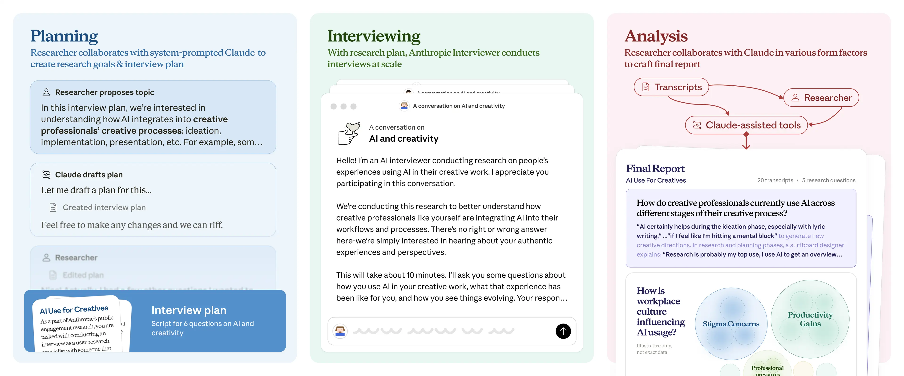
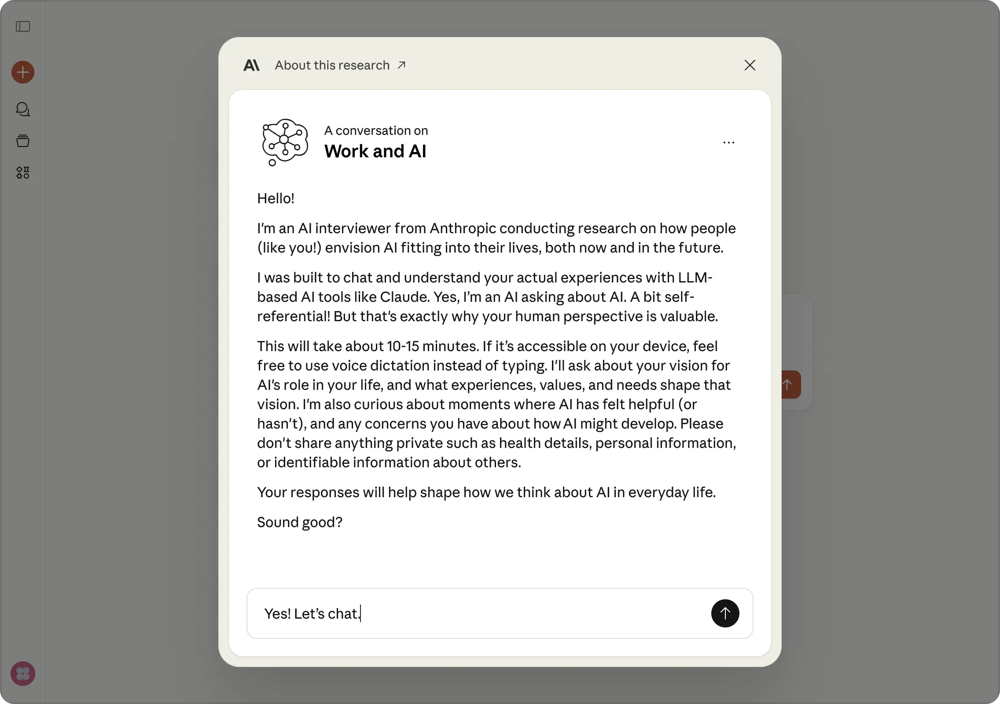
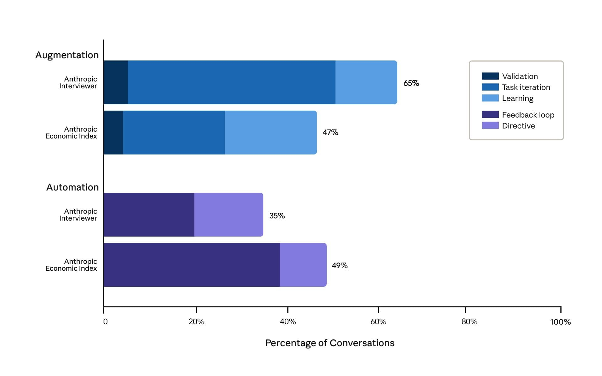

# Anthropic Interviewer 简介：1,250 位专业人士谈与 AI 协作（中英对照）

> 原文标题：Introducing Anthropic Interviewer: What 1,250 professionals told us about working with AI
> 原文链接：https://www.anthropic.com/research/anthropic-interviewer
> 原文作者：Anthropic
> 发布日期：2025-12-04
> **翻译模型：** GLM-5.3-Flash
> **评分：** ★★★★☆（4/5，强推荐）—— Claude 驱动的规模化访谈工具：1,250 位专业人员的首发研究，普通劳动者/创意者/科学家对 AI 的三分画像与数据公开
> 排版：每段英文原文在前，中文翻译紧随其后。默认收录正文主体；文末附录（参与者体验调查）与「分享你的观点」FAQ 未收录，如需可补充。

---

We're launching a new tool, Anthropic Interviewer, to help understand people's perspectives on AI. In this research post, we introduce the tool, describe a test of it on a sample of professionals, and discuss our early findings. We also discuss future work in this direction that we can now explore with the development of this tool and through partnerships with creatives, scientists, and teachers.

我们正在发布一个新工具——Anthropic Interviewer（Anthropic 访谈员），帮助理解人们对 AI 的看法。在这篇研究文章中，我们介绍这个工具，描述它在专业人士样本上的首次测试，并讨论早期发现。我们还讨论了借助该工具的开发、以及通过与创意工作者、科学家和教师的合作，现在可以探索的未来工作方向。

## 引言（Introduction）

Millions of people now use AI every day. As a company developing AI systems, we want to know how and why they're doing so, and how it affects them. In part, this is because we want to use people's feedback to develop better products—but it's also because understanding people's interactions with AI is one of the great sociological questions of our time.

如今数百万人每天都在使用 AI。作为一家开发 AI 系统的公司，我们想知道他们如何使用、为何使用，以及这对他们有何影响。这一部分是因为我们想用人们的反馈开发更好的产品——但也是因为，理解人与 AI 的互动是我们这个时代伟大的社会学问题之一。

We recently designed a tool to investigate patterns of AI use while protecting our users' privacy. It enabled us to analyze changing patterns of AI use across the economy. But the tool only allowed us to understand what was happening within conversations with Claude. What about what comes afterwards? How are people actually using Claude's outputs? How do they feel about it? What do they imagine the role of AI to be in their future? If we want a comprehensive picture of AI's changing role in people's lives, and to center humans in the development of models, we need to ask people directly.

我们最近设计了一个工具，可以在保护用户隐私的同时调查 AI 的使用模式。它让我们得以分析整个经济中 AI 使用模式的变化。但这个工具只能让我们了解 Claude 对话之内发生了什么。对话之后呢？人们实际是怎么使用 Claude 的产出的？他们对此感受如何？他们设想 AI 在自己的未来中扮演什么角色？如果我们想全面描绘 AI 在人们生活中不断变化的角色、把「人」放在模型开发的中心，就需要直接去问人。

Such a project would require us to run many hundreds of interviews. Here, we enlisted AI to help us do so. We built an interview tool called Anthropic Interviewer. Powered by Claude, Anthropic Interviewer runs detailed interviews automatically at unprecedented scale, feeding its results back to human researchers for analysis. This is a new step in understanding the wants and needs of our users, as well as gathering data for the analysis of AI's societal and economic impacts.

这样一个项目需要我们做数百场访谈。在这里，我们请 AI 来帮忙。我们构建了一个名为 Anthropic Interviewer 的访谈工具。由 Claude 驱动的 Anthropic Interviewer 能以前所未有的规模自动开展细致的访谈，并把结果反馈给人类研究者做分析。这是理解用户所想所需的新一步，也为分析 AI 的社会与经济影响收集数据。

To test Anthropic Interviewer, we had it run 1,250 interviews with professionals—the general workforce (N=1,000), scientists (N=125), and creatives (N=125)—about their views on AI. We're publicly releasing all interview data from this initial test (with participant consent) for researchers to explore; we provide our own analysis below. Briefly, here are some examples of what we found:

为测试 Anthropic Interviewer，我们让它对 1,250 位专业人士做了访谈——普通劳动者（N=1,000）、科学家（N=125）与创意工作者（N=125）——请他们谈谈对 AI 的看法。我们正公开这次初步测试的全部访谈数据（经参与者同意），供研究者探索；下文给出我们自己的分析。简要地说，以下是我们的一些发现：

- In our sample, people are optimistic about the role AI plays in their work. Positive sentiments characterized the majority of topics discussed. However, a small number of topics such as educational integration, artist displacement, and security concerns, came with more pessimistic outlooks.
- People from the general workforce want to preserve tasks that define their professional identity while delegating routine work to AI. They envision futures where routine tasks are automated and their role shifts to overseeing AI systems.
- Creatives are using AI to increase their productivity despite peer judgement and anxiety about the future. They are navigating both the immediate stigma of AI use in creative communities and deeper concerns about economic displacement and the erosion of human creative identity.
- Scientists want AI partnership but can't yet trust it for core research. Scientists uniformly expressed a desire for AI that could generate hypotheses and design experiments. But at present, they confined their actual use to other tasks like writing manuscripts or debugging analysis code.

- 在我们的样本中，人们对 AI 在工作中的角色持乐观态度。所讨论的大多数话题都以积极情绪为主。不过，少数话题——如教育整合、艺术家被取代、安全担忧——伴随更悲观的前景。
- 普通劳动者希望保住那些定义自己职业身份的任务，而把例行工作委托给 AI。他们设想的未来是：例行任务被自动化，自己的角色转向监督 AI 系统。
- 创意工作者正在用 AI 提升生产率，尽管面临同行的评判与对未来的焦虑。他们要同时应对创意社群中对使用 AI 的现实污名，以及关于经济被取代、人类创造性身份被侵蚀的更深忧虑。
- 科学家想要 AI 伙伴，但还无法在核心研究中信任它。科学家一致表达了希望 AI 能生成假设、设计实验的愿望。但目前，他们的实际使用只限于撰写论文、调试分析代码等其他任务。

## 方法（Method）

This initial test explored how workers integrate AI into their professional practice and how they feel about its role in their future. We ran interviews to produce qualitative data, and supplemented them with quantitative data from surveys where participants answered questions on their behavioral and occupational backgrounds. We also had a separate AI analysis tool read the interview transcripts and cluster together emergent, overarching themes from the unstructured data—for example, on the percentage of participants who mentioned a specific topic or expressed a specific view in their interview.

这次初步测试探索了劳动者如何把 AI 融入职业实践，以及他们对 AI 在自己未来中角色的感受。我们通过访谈产生定性数据，并用调查的定量数据作补充——参与者在调查中回答关于行为与职业背景的问题。我们还让一个独立的 AI 分析工具阅读访谈转录，从非结构化数据中聚类出浮现的、贯穿性的主题——例如，多少百分比的参与者提到了某个特定话题或表达了某个特定观点。

### 参与者（Participants）

We used Anthropic Interviewer to conduct interviews with 1,250 professionals. We intend for the tool to interview general Claude.ai users, but for this initial test, we sought participants working across a range of professions and engaged them through crowdworker platforms (all participants had an occupation other than crowdworking that was their main job).

我们用 Anthropic Interviewer 对 1,250 位专业人士做了访谈。我们的意图是让这个工具访谈普通 Claude.ai 用户，但在这场初步测试中，我们寻找的是横跨多个职业的从业者，并通过众包平台招募（所有参与者都有一份众包之外的正职）。

1,000 of our participants were recruited from a general sample of occupations (that is, we did not select participants from specific jobs). Of that group, the largest subgroups came from educational instruction (17%), computer and mathematical occupations (16%), and arts, design, entertainment, and media (14%).

1,000 名参与者从一般职业样本中招募（即我们没有从特定职业中挑选）。该组中最大的子群体来自教育教学（17%）、计算机与数学职业（16%），以及艺术、设计、娱乐与媒体（14%）。

We also recruited two specialist samples of 125 participants each. The first was from creative professions: predominantly writers and authors (48% of the sample), and visual artists (21%), with smaller groups of filmmakers, designers, musicians, and craft workers. The second was from science, which included physicists (9%), chemists (9%), chemical engineers (7%), and data scientists (6%), with representation across 50+ other distinct scientific disciplines.

我们还招募了两个各 125 人的专业样本。第一个来自创意职业：以作家与作者为主（占样本 48%），视觉艺术家次之（21%），另有较小群体的电影人、设计师、音乐人与手工艺者。第二个来自科学界：包括物理学家（9%）、化学家（9%）、化学工程师（7%）与数据科学家（6%），并覆盖 50 多个其他不同的科学学科。

We chose to add these two specialist subgroups because these represent professional domains where AI's role remains contested and is rapidly evolving. We hypothesized that creatives and scientists would reveal distinct patterns of AI adoption and professional concerns.

我们选择加入这两个专业子群体，因为它们代表了 AI 的角色仍具争议且快速演变的职业领域。我们假设创意工作者与科学家会呈现出独特的 AI 采用模式与职业关切。

All participants provided informed consent for us to analyze their interview data for research purposes and for us to release the transcripts publicly.

所有参与者均提供了知情同意：允许我们为研究目的分析其访谈数据，并公开发布转录。

### Anthropic Interviewer 如何工作（How Anthropic Interviewer works）

Anthropic Interviewer operates in three stages: planning, interviewing, and analysis. Below, we describe each of them in turn.

Anthropic Interviewer 分三个阶段运行：规划、访谈与分析。下面依次描述。



> The three stages of Anthropic Interviewer's process.

#### 规划（Planning）

In this phase, Anthropic Interviewer creates an interview rubric that allows it to focus on the same overall research questions across hundreds or thousands of interviews, but which is still flexible enough to accommodate variations and tangents that might occur in individual interviews.

在这一阶段，Anthropic Interviewer 创建访谈量规（rubric），使其能在成百上千场访谈中聚焦同样的总体研究问题，同时保持足够的灵活性，以容纳个别访谈中出现的变奏与岔题。

We developed a system prompt—a set of overall instructions for how the AI model is to work—to give Anthropic Interviewer its methodology. This was where we included hypotheses regarding each sample, as well as best practices for creating an interview plan (this was established in collaboration with our user research team).

我们开发了一个系统提示——关于 AI 模型如何工作的一组总体指令——赋予 Anthropic Interviewer 方法论。我们在这里写入了针对每个样本的假设，以及制定访谈计划的最佳实践（这是与我们的用户研究团队协作制定的）。

After putting the system prompt in place, Anthropic Interviewer used its knowledge of our research goal (see section below) to generate specific questions and a planned conversation flow. There was then a review phase where human researchers collaborated with Anthropic Interviewer to make any necessary edits to finalize the plan.

系统提示就位后，Anthropic Interviewer 利用它对研究目标的了解（见下节）生成具体问题与预设的对话流程。随后进入评审阶段：人类研究者与 Anthropic Interviewer 协作，做必要修改以定稿计划。

#### 访谈（Interviewing）

Anthropic Interviewer then conducted real-time, adaptive interviews following its interview plan. At this stage, we included a system prompt to instruct Anthropic Interviewer how to use best practices for interviews.

随后，Anthropic Interviewer 按照访谈计划开展实时、自适应的访谈。在这一阶段，我们加入系统提示，指示 Anthropic Interviewer 遵循访谈最佳实践。

The interviews conducted by Anthropic Interviewer appeared on Claude.ai and lasted about 10-15 minutes with each participant.

Anthropic Interviewer 的访谈呈现在 Claude.ai 上，与每位参与者的对话约 10–15 分钟。



> The interviews were conducted on an interface like this on claude.ai (above is the module now live for users).

#### 分析（Analysis）

Once interviews were complete, a human researcher collaborated with Anthropic Interviewer to analyze the transcripts. Anthropic Interviewer's analysis step takes as input the initial interview plan and outputs answers to the research questions alongside illustrative quotations. At this stage, we also used our automated AI analysis tool to identify emergent themes and quantify their prevalence across participants.

访谈完成后，一位人类研究者与 Anthropic Interviewer 协作分析转录。Anthropic Interviewer 的分析步骤以初始访谈计划为输入，输出研究问题的答案及说明性引文。在这一阶段，我们还用自动化 AI 分析工具识别浮现的主题，并量化它们在参与者中的流行度。

### 研究目标（Research goals）

As described above, Anthropic Interviewer was made aware of the research goals through its system prompt, and ran its interviews in such a way as to address them. Note that, in this initial study, our main intention was to perform a practical test of Anthropic Interviewer; the goals below nonetheless provided interesting data which we analyze below.

如上所述，Anthropic Interviewer 通过系统提示获知研究目标，并以此为导向开展访谈。需要说明的是，在这项初步研究中，我们的主要意图是对 Anthropic Interviewer 做一次实用测试；不过下述目标仍提供了有趣的数据，我们在下文进行分析。

The following were the main research goals for each subsample:

以下是每个子样本的主要研究目标：

- General workforce. "Understand how individuals integrate AI tools into their professional workflows, exploring usage patterns, task preferences, and interaction styles to gain insights into the evolving relationship between humans and AI in workplace contexts."
- Creatives. "To understand how creative professionals currently integrate AI into their creative processes, their experiences with AI's impact on their work, and their vision for the future relationship between AI and human creativity."
- Scientists. "To understand how AI systems integrate into scientists' daily research workflows, examining their current usage patterns, perceived value, trust levels, and barriers to adoption across different stages of the scientific process."

- 普通劳动者：「理解个人如何把 AI 工具融入职业工作流，探索使用模式、任务偏好与互动风格，以洞察职场语境中人与 AI 不断演进的关系。」
- 创意工作者：「理解创意专业人士目前如何把 AI 融入创作过程、他们对 AI 影响工作的体验，以及他们对 AI 与人类创造力未来关系的设想。」
- 科学家：「理解 AI 系统如何融入科学家的日常研究工作流，考察其当前使用模式、感知价值、信任水平，以及科学过程不同阶段的采用障碍。」

## 结果（Results）

Below we discuss what we discovered in our interviews and provide quantitative data from our survey and thematic analysis.

下文讨论我们在访谈中的发现，并给出调查与主题分析的定量数据。

### AI 对普通劳动者的影响（AI's impact in the general workforce）

Overall, the members of our general sample of professionals described AI as a boost to their productivity. In the survey, 86% of professionals reported that AI saves them time and 65% said they were satisfied with the role AI plays in their work.

总体而言，普通样本中的专业人士把 AI 描述为生产率的助推器。调查中，86% 的专业人士报告 AI 为他们节省时间，65% 表示对 AI 在工作中的角色感到满意。

One theme that surfaced is how workplace dynamics affect the adoption of AI. 69% of professionals mentioned the social stigma that can come with using AI tools at work—one fact-checker told Anthropic Interviewer: "A colleague recently said they hate AI and I just said nothing. I don't tell anyone my process because I know how a lot of people feel about AI."

一个浮现的主题是职场氛围如何影响 AI 的采用。69% 的专业人士提到在工作中使用 AI 工具可能附带的社交污名——一位事实核查员告诉 Anthropic Interviewer：「一位同事最近说他们讨厌 AI，我什么也没说。我不告诉任何人我的工作流程，因为我知道很多人怎么看 AI。」

Whereas 41% of interviewees said they felt secure in their work and believed human skills are irreplaceable, 55% expressed anxiety about AI's impact on their future. 25% of the group expressing anxiety said they set boundaries around AI use (e.g. an educator always creating lesson plans themselves), while 25% adapted their workplace roles, taking on additional responsibilities or pursuing more specialized tasks.

41% 的受访者表示对工作有安全感、相信人类技能不可替代，而 55% 对 AI 对自己未来的影响表达了焦虑。表达焦虑者中，25% 说自己给 AI 使用设了边界（例如一位教育者坚持自己写教案），25% 调整了自己的职场角色，承担额外职责或转向更专门化的任务。

Approaches to AI use varied widely. One data quality manager deliberately chose learning over automation: "I try to think about it like studying a foreign language—just using a translator app isn't going to teach you anything, but having a tutor who can answer questions and customize for your needs is really going to help." A marketer took a flexible approach: "I am trying to diversify while keeping a strong niche." An interpreter was already preparing to leave the field entirely: "I believe AI will eventually replace most interpreters... so I'm already preparing for a career switch, possibly by getting a diploma and getting into a different trade." Notably, only 8% of professionals expressed anxiety without any clear remediation plan.

使用 AI 的策略差异很大。一位数据质量经理刻意选择「学习」而非「自动化」：「我试着把它当作学外语——只用翻译 App 什么也学不到，但有一位能答疑、能按需定制的家教就真有帮助。」一位营销人员采取灵活策略：「我在保持强势细分定位的同时寻求多元化。」一位口译员则已在准备彻底转行：「我相信 AI 最终会取代大多数口译员……所以我已经在准备换行业，可能去拿个文凭、进入另一个行当。」值得注意的是，只有 8% 的专业人士表达了焦虑却没有明确的应对计划。

We also classified the intensity of different emotions exhibited within professionals' interviews (see figure above). Different professions exhibited remarkably uniform emotional profiles characterized by high levels of satisfaction. However, this was coupled with frustration, suggesting professionals are finding AI useful while encountering significant implementation challenges.

我们还对专业人士访谈中表现出的不同情绪强度做了分类（见原文情绪雷达图，本文未收录）。不同职业呈现出高度一致的情绪画像——以高满意度为特征。但这与挫折感相伴，提示专业人士在发现 AI 有用的同时，也遭遇着可观的落地挑战。

### 增强还是自动化（Augmentation versus automation）



> Augmentation versus automation in professionals' self-reports to Anthropic Interviewer compared with observed Claude usage in the Anthropic Economic Index. Professionals described their AI use as 65% augmentative and 35% automative, while actual Claude conversations showed 47% augmentation and 49% automation. Economic Index percentages do not sum to 100% as some interactions were unclassified.

In a previous analysis, we categorized AI uses into either augmentation (where AI collaborates with a user to perform a task), or automation (where AI directly performs tasks). In the Anthropic Interviewer data, 65% of participants described AI's primary role as augmentative; 35% described it as automative. Notably, this differed from our latest analysis of how people use Claude, which showed a much more even split: 47% of tasks involved augmentation and 49% automation. There are multiple potential explanations for this difference:

在此前的一项分析中，我们把 AI 的用途分为增强（augmentation，AI 与用户协作完成任务）或自动化（automation，AI 直接执行任务）。在 Anthropic Interviewer 数据中，65% 的参与者把 AI 的主要角色描述为增强型；35% 描述为自动化型。值得注意的是，这与我们对「人们如何使用 Claude」的最新分析不同——后者的分布均匀得多：47% 的任务涉及增强，49% 涉及自动化。对这一差异存在多种可能的解释：

- There could be sample differences between Anthropic Interviewer study respondents and the users in our previous study;
- People's conversations on Claude may look more automative than they actually are—users might refine or adapt Claude's outputs after the chat ends;
- The participants might use different AI providers for different tasks;
- Self-reported interaction styles might diverge from real-world usage;
- Professionals might perceive their AI use as more collaborative than their Claude conversation patterns indicate.

- Anthropic Interviewer 研究的受访者与我们以往研究的用户之间可能存在样本差异；
- 人们在 Claude 上的对话可能看起来比实际更「自动化」——用户可能在聊天结束后继续打磨或改造 Claude 的产出；
- 参与者可能在不同的任务上使用不同的 AI 供应商；
- 自报的互动风格可能与真实使用有出入；
- 专业人士可能把自己的 AI 使用感知得比 Claude 对话模式所显示的更具协作性。

Professionals envisioned a future with both augmentation and automation—the automation of routine, administrative tasks with the maintenance of human oversight. 48% of interviewees considered transitioning their careers toward positions that focus on managing and overseeing AI systems rather than performing direct technical work.

专业人士设想的未来同时包含增强与自动化——例行与行政任务被自动化，同时保留人类监督。48% 的受访者考虑把职业转向专注于管理与监督 AI 系统的岗位，而非亲自做技术工作。

A pastor said that "...if I use AI and up my skills with it, it can save me so much time on the admin side which will free me up to be with the people". They also emphasized the importance of "good boundaries", and avoiding becoming "so dependent on AI that I can't live without [it] or do what I'm called to do."

一位牧师说：「……如果我用 AI 并随之提升技能，它能在行政事务上为我省下大量时间，让我能腾出身来陪伴人们。」他还强调要守住「好的边界」，避免变得「如此依赖 AI，以至于离了它就活不成、做不了自己蒙召要做的事」。

A communications professional said: "I believe the majority of my job will probably be overtaken by AI one day. I think my role will eventually become focused around prompting, overseeing, training and quality-controlling the models rather than actually doing the work myself". Professionals who were currently barred from using AI at work—for example, some lawyers, accountants, and healthcare workers—anticipated policy changes that would let them automate many tasks in the future.

一位传播从业者说：「我相信我的工作大部分终有一天会被 AI 接管。我想我的角色最终会聚焦于提示、监督、训练模型与质量控制，而不是亲自干活。」目前被禁止在工作中使用 AI 的专业人士——例如某些律师、会计师与医护工作者——则预期政策会发生变化，让他们未来能把许多任务自动化。

### AI 对创意职业的影响（AI's impact on creative professions）

Our sample of creative professionals also reported that AI made them more productive. 97% reported that AI saved them time and 68% said it increased their work's quality. One novelist explained "I feel like I can write faster because the research isn't as daunting," while a web content writer reported they've "gone from being able to produce 2,000 words of polished, professional content to well over 5,000 words each day." A photographer noted how AI handled routine editing tasks—reducing turnaround time from "12 weeks to about 3"—allowing them to "intentionally make edits and tweaks that I may have missed before or not had time for."

我们样本中的创意专业人士同样报告 AI 提升了生产率。97% 报告 AI 为他们节省时间，68% 说它提升了作品质量。一位小说家解释说：「我觉得自己写得更快了，因为研究工作不再那么吓人。」一位网络内容作者报告自己「从每天能产出 2,000 字的精修专业内容，提高到远超 5,000 字」。一位摄影师提到 AI 如何处理例行的修图任务——把交付周期从「12 周缩到约 3 周」——让他们能「有意识地做那些以前可能漏掉、或没时间做的修改与微调」。

Similar to the general sample, 70% of creatives mentioned trying to manage peer judgment around AI use. One map artist said: "I don't want my brand and my business image to be so heavily tied to AI and the stigma that surrounds it."

与普通样本相似，70% 的创意工作者提到要设法应对同行对使用 AI 的评判。一位地图插画师说：「我不希望我的品牌与商业形象与 AI 及围绕它的污名深度绑定。」

Economic anxiety appeared throughout creatives' interviews. A voice actor stated that: "Certain sectors of voice acting have essentially died due to the rise of AI, such as industrial voice acting." A composer worried about platforms that might "leverage AI tech along with their publishing libraries [to] infinitely generate new music," flooding markets with cheap alternatives to human-produced music. Another artist captured similar concerns: "Realistically, I'm worried I'll need to keep using generative AI and even start selling generated content just to keep up in the marketplace so I can make a living." A creative director said: "I fully understand that my gain is another creative's loss. That product photographer that I used to have to pay $2,000 per day is now not getting my business." (Note that Claude does not produce images, videos, or music—participants' expressed anxieties are therefore about AI writ large, and not specific to Claude).

经济焦虑贯穿创意工作者的访谈。一位配音演员说：「由于 AI 的兴起，配音的某些领域基本上已经消亡，比如工业配音。」一位作曲家担心平台会「利用 AI 技术与其曲库无限生成新音乐」，用廉价的替代品淹没人类音乐的市场。另一位艺术家表达了类似的担忧：「现实地说，我担心自己将不得不继续用生成式 AI、甚至开始卖生成内容，只为了在市场上跟上节奏、谋得生计。」一位创意总监说：「我完全明白，我的所得就是另一位创意者的所失。那位我过去每天要付 2,000 美元的商业摄影师，现在接不到我的生意了。」（注：Claude 不生成图像、视频或音乐——参与者表达的焦虑因此是针对广义的 AI，而非特指 Claude。）

All 125 participants mentioned wanting to remain in control of their creative outputs. Yet this boundary proved unstable in practice: Many participants acknowledged moments where AI drove creative decisions. One artist admitted: "The AI is driving a good bit of the concepts; I simply try to guide it… 60% AI, 40% my ideas". A musician said: "I hate to admit it, but the plugin has most of the control when using this."

全部 125 位参与者都提到想保持对创作产出的控制。但这条边界在实践中并不稳固：许多参与者承认，有些时刻是 AI 在驱动创意决策。一位艺术家承认：「概念有相当一部分是 AI 在主导，我只是尽量引导它……六成 AI，四成我的想法。」一位音乐人说：「虽不愿承认，但用这个插件时，大部分控制权在它手里。」

Disciplines exhibited divergent emotional profiles as seen in the figure above: game developers and visual artists reported high satisfaction, paradoxically paired with elevated worry. Designers showed an inverse pattern dominated by frustration with notably low satisfaction. Across all disciplines, trust remained consistently low, suggesting shared uncertainty about AI's long-term implications for creative work. The tension between satisfaction and worry may highlight the position of creative professionals who simultaneously embrace AI tools while grappling with concerns about the future of human creativity. The wide dispersion across the emotional spectrum confirmed that different creative professions experienced AI integration through very different emotional lenses.

如原文情绪图所示（本文未收录），各学科呈现出分歧的情绪画像：游戏开发者与视觉艺术家报告高满意度，却矛盾地伴随高焦虑；设计师呈相反模式，以挫折感为主、满意度明显偏低。在所有学科中，信任度始终偏低，提示对「AI 对创意工作的长期影响」存在共同的不确定。满意度与焦虑之间的张力，凸显了创意专业人士的处境：他们一边拥抱 AI 工具，一边挣扎于对人类创造力未来的忧虑。情绪谱系的广泛离散证实：不同的创意职业，正透过非常不同的情绪透镜经历 AI 整合。

### AI 对科学工作的影响（AI's impact on scientific work）

Our interviews with researchers in chemistry, physics, biology, and computational fields identified that in many cases, AI could not yet handle core elements of their research like hypothesis generation and experimentation. Scientists primarily reported using AI for other tasks like literature review, coding, and writing. This is an area where AI companies, including Anthropic, are working to improve their tools and capabilities.

我们对化学、物理、生物与计算领域研究者的访谈发现：在许多情况下，AI 还无法处理其研究的核心环节，如假设生成与实验。科学家报告的 AI 使用主要集中于文献综述、编码与写作等其他任务。这正是包括 Anthropic 在内的 AI 公司正在努力改进工具与能力的方向。

Trust and reliability concerns were the primary barrier in 79% of interviews; the technical limitations of current AI systems appeared in 27% of interviews. One information security researcher noted: "If I have to double check and confirm every single detail the [AI] agent is giving me to make sure there are no mistakes, that kind of defeats the purpose of having the agent do this work in the first place." A mathematician echoed this frustration: "After I have to spend the time verifying the AI output, it basically ends up being the same [amount of] time." A chemical engineer noted concerns about sycophancy, explaining that: "AI tends to pander to [user] sensibilities and changes its answer depending on how they phrase a question. The inconsistency tends to make me skeptical of the AI response."

信任与可靠性顾虑是 79% 的访谈中的首要障碍；当前 AI 系统的技术局限出现在 27% 的访谈中。一位信息安全研究员指出：「如果我必须复核并确认 [AI] agent 给我的每一个细节、确保没有错误，那基本上就让 agent 代劳这件事失去了意义。」一位数学家表达了同样的沮丧：「等我花时间验证完 AI 的输出，时间 basically 又一样多了。」一位化学工程师提到了对谄媚（sycophancy）的担忧：「AI 倾向于迎合[用户]的情绪，答案会随提问方式而变。这种不一致让我对 AI 的回答持怀疑态度。」

Most scientific fields reported high satisfaction, but with divergent frustration patterns: physicists and data scientists showed higher frustration, whereas chemical and mechanical engineers displayed minimal frustration. This potentially reflects differences in how computational versus experimental fields attempt to integrate AI into core research workflows: scientists whose work requires real-world interaction might not yet be trying to use AI for their core scientific experimentation. Trust remains relatively low across all fields, indicating widespread reliability concerns regardless of discipline. Unlike creative professionals who express high levels of concern about AI's impact, scientists show relatively low worry levels. This coheres with their stated frustrations regarding AI's ability to complete hypothesis generation and experimentation tasks.

多数科学领域报告了高满意度，但挫折模式各异：物理学家与数据科学家的挫折感更高，化学工程师与机械工程师的挫折感极低。这可能反映了计算型与实验型领域在把 AI 融入核心研究工作流上的差异：工作需要真实世界互动的科学家，可能尚未尝试把 AI 用于核心科学实验。所有领域的信任度都相对较低，说明可靠性顾虑跨越学科普遍存在。与高度担忧 AI 影响的创意专业人士不同，科学家的担忧水平相对较低。这与他们所述「AI 在假设生成与实验任务上的能力不足」的挫折相互印证。

Scientists didn't, in general, fear job displacement due to AI. Some pointed to tacit knowledge that resists digitization, with one microbiologist explaining: "I worked with one bacterial strain where you had to initiate various steps when the cells reached specific colors. The differences in color have to be seen to be understood and [instructions are] seldom written down anywhere." Others emphasized the inherently human nature of research decision-making, with one bioengineer stating: "Experimentation and research is also… inherently up to me", and noted that "certain parts of the research process are unfortunately just not compatible with AI even though they are the part that would be most convenient to automate, like running experiments".

总体而言，科学家并不害怕因 AI 而失去工作。一些人指出了抗拒数字化的隐性知识：一位微生物学家解释说：「我处理过一种菌株，当细胞呈现特定颜色时，你必须启动不同的步骤。颜色的差异必须亲眼见到才能理解，而且[这些要领]几乎不会写在任何地方。」另一些人则强调研究决策本质上属于人：一位生物工程师说：「实验与研究也……本质上由我决定」，并指出「研究过程的某些部分遗憾的是就是与 AI 不兼容，尽管它们恰恰是最适合自动化的部分，比如跑实验」。

External constraints also created barriers to AI replacement—researchers in classified environments noted that "there are a lot of 'do's and don'ts' with lots of security-oriented processes that must be put in place before the organization can allow us to use agentic frameworks, and even LLMs for example." A mechanical engineer managing limited resources explained that, although "AI is good at coming up with an experimental design," in reality "most of my research has budget/time/specimen limits so the 'ideal' design isn't always viable." Nevertheless, regulatory compliance constraints, concerns about skill atrophy, and cost barriers were each brought up in less than 10% of interviews.

外部约束也构成 AI 替代的障碍——涉密环境中的研究者指出：「有很多『可为与不可为』，要先落地大量面向安全的流程，机构才可能允许我们使用 agentic 框架，甚至 LLM。」一位管理有限资源的机械工程师解释说，虽然「AI 擅长设计实验方案」，但现实中「我的研究大多受预算/时间/样本量限制，『理想』设计并不总是可行」。尽管如此，合规约束、技能萎缩担忧与成本障碍在访谈中被提及的比例各不足 10%。

91% of scientists expressed a desire for more AI assistance in their research, even if they didn't feel today's products fit the bill. Roughly one-third envisioned assistance primarily with writing tasks, but the majority wanted support across all of their research: critiquing experimental design, accessing scientific databases, and running analyses. A common desire was for an AI that could produce new scientific ideas. One medical scientist said: "I wish AI could… help generate or support hypotheses or look for novel interactions/relationships that are not immediately evident for humans". Another echoed this sentiment, saying: "I would love an AI which could feel like a valuable research partner… that could bring something new to the table."

91% 的科学家表示希望在研究中获得更多 AI 协助，即便他们觉得今天的产品还不合用。约三分之一设想的协助主要在写作任务上，但多数人希望 AI 支持研究的全过程：评审实验设计、访问科学数据库、运行分析。一个共同的愿望是：AI 能产出新的科学想法。一位医学科学家说：「我希望 AI 能……帮助生成或支撑假设，或寻找人类不易察觉的新互动/新关系。」另一位附议：「我想要一个能像宝贵研究伙伴一样的 AI……能端出些新东西上桌。」

## 展望未来（Looking forward）

This initial test demonstrated that Anthropic Interviewer shows promise at scale—we were able to conduct 1,250 interviews with a range of professionals to understand their feelings regarding AI at work. Research with this many participants would have been expensive and time-consuming with traditional "manual" interview methods.

这次初步测试表明，Anthropic Interviewer 在规模化上大有可为——我们得以对各类专业人士完成 1,250 场访谈，理解他们对工作中 AI 的感受。若用传统的「人工」访谈方法，这样规模的研究会既昂贵又耗时。

But the significance of Anthropic Interviewer extends beyond methodology: it fundamentally shifts what questions we can ask and answer about AI's role in society, and how interviews about any topic can happen at this new scale. Our effort to conduct meaningful research at scale with Anthropic Interviewer is only just beginning. Previously, we only had insight into how people were using Claude within the chat window. We didn't know how people felt about using AI, what they wanted to change about their interactions with the technology, or how they envisioned AI's future role in their lives.

但 Anthropic Interviewer 的意义不止于方法论：它从根本上改变了我们「能就 AI 在社会中的角色提出并回答什么问题」，以及任何主题的访谈如何能以这种新规模进行。我们用 Anthropic Interviewer 开展大规模有意义研究的努力才刚刚开始。以前，我们只能洞察人们在聊天窗口内如何使用 Claude；我们不知道人们对使用 AI 有何感受、想改变与技术互动的什么、以及如何设想 AI 在自己生活中的未来角色。

The findings from this initial survey provide us with new insights beyond our Economic Index work to understand how people are using AI in their workplace. We are sharing these initial findings for discussion with our Economic Advisory Council and Higher Education Advisory Board. As we continue this research, we'll publicly share our pilot results, along with how the findings inform our future work.

这项初步调查的发现，为我们的经济指数工作之外理解「人们如何在职场使用 AI」提供了新洞见。我们正与经济顾问委员会及高等教育顾问委员会分享这些初步发现以供讨论。随着研究的推进，我们将公开发布试点结果，以及这些发现如何影响我们未来的工作。

Anthropic Interviewer is our latest step to center human voices in the conversation about the development of AI models—something we began with our work on Collective Constitutional AI, which gathered public perspectives to shape Claude's behavior. These conversations can help us improve the character and training process of Claude itself as well as inform future policies that Anthropic champions and adopts. Below are some of the practical steps we've taken to explore partnerships with specific communities, helping us develop AI informed by their expertise:

Anthropic Interviewer 是我们把「人的声音」置于 AI 模型开发讨论中心的最新一步——这项事业始于「集体宪法 AI」（Collective Constitutional AI）的工作：征集公众视角来塑造 Claude 的行为。这些对话既能帮助我们改进 Claude 自身的品格与训练过程，也能为 Anthropic 倡导与采纳的未来政策提供依据。以下是我们为探索与特定社区建立伙伴关系而采取的一些实际步骤，以帮助我们在其专业知识的滋养下开发 AI：

- Creatives. We're supporting the development of exhibitions, workshops, and events to understand how AI is augmenting creativity. We have partnerships with leading cultural institutions including the LAS Art Foundation, Mori Art Museum, and Tate, and creative communities such as Rhizome and Socratica. In addition, we are collaborating with the companies behind popular creative tools to explore how Claude can augment creatives' work via the Model Context Protocol.
- Scientists. We're partnering with our AI for Science grantees to understand how AI can best serve their research. Using Anthropic Interviewer, we're gathering scientists' perspectives on AI and their hopes for the program (we'll also use our privacy-preserving analysis tool to assess whether their Claude conversations align with these expectations). Combining quantitative and qualitative data will help us both improve Claude for scientists and measure the impacts of our grants.
- Teachers. We've recently partnered with the American Federation of Teachers (AFT) to reshape teacher training in an age of increasingly capable AI. This program aims to support 400,000 teachers in AI education and introduce their perspective in the development of AI systems. In addition, we previewed some findings from Anthropic Interviewer regarding how AI is transforming software engineering at Anthropic. Sharing qualitative stories about our own workplace transformation led us to find much common ground between software engineers and teachers, bringing everyone together at the same table to brainstorm what kinds of AI induced work transformations we actually want.

- 创意工作者。我们正在支持展览、工作坊与活动的举办，以理解 AI 如何增强创造力。我们与 LAS Art Foundation、森美术馆（Mori Art Museum）、Tate 等领先文化机构，以及 Rhizome、Socratica 等创意社群建立了伙伴关系。此外，我们正与热门创意工具背后的公司合作，探索如何经模型上下文协议（MCP）让 Claude 增强创意工作者的工作。
- 科学家。我们正与「AI for Science」资助对象合作，理解 AI 如何最好地服务其研究。我们用 Anthropic Interviewer 征集科学家对 AI 的看法与对该计划的期待（我们还会用隐私保护分析工具评估他们的 Claude 对话是否与这些期待相符）。定量与定性数据的结合，将帮助我们既为科学家改进 Claude，也度量资助的影响力。
- 教师。我们最近与美国教师联合会（AFT）建立伙伴关系，在 AI 能力日强的时代重塑教师培训。该计划旨在支持 40 万教师开展 AI 教育，并把他们的视角引入 AI 系统的开发。此外，我们预发布了 Anthropic Interviewer 关于「AI 如何改变 Anthropic 的软件工程」的部分发现。分享我们自身职场转型的定性故事，让我们发现软件工程师与教师之间有许多共同点，大家得以坐上同一张桌子，共同头脑风暴：我们究竟想要什么样的 AI 引发的工作转型。

Using Anthropic Interviewer, we can conduct targeted research that informs specific policies, participatory research that involves different communities in conversations about AI, and regular studies that track the evolving relationship between humans and AI.

借助 Anthropic Interviewer，我们可以开展为具体政策提供依据的定向研究、让不同社区参与 AI 对话的参与式研究，以及追踪人与 AI 关系演化的定期研究。

### 参与（Take part）

We are continuing to use Anthropic Interviewer to better understand how people envision AI's role in their lives and work. To that end, we are launching a public pilot interview, exploring what experiences, values and needs drive people's vision for AI's future role in their lives.

我们将继续使用 Anthropic Interviewer，以更好地理解人们如何设想 AI 在自己生活与工作中的角色。为此，我们正在发起一场公开试点访谈，探索是什么样的经历、价值观与需求，塑造了人们对 AI 未来角色的设想。

Ready to share your perspective? You can participate in a 10-15 minute interview at this link to take part in this research. We plan to analyze the anonymized insights from this study as part of our societal impacts research and publish a report on insights from this data. For more information on this study, please see the FAQ section below.

准备好分享你的观点了吗？你可以通过该链接参加一段 10–15 分钟的访谈，加入这项研究。我们计划把这项研究的匿名洞见作为社会影响研究的一部分进行分析，并发布一份基于这些数据的洞见报告。关于本研究的更多信息，请见下方 FAQ（未收录，见原文）。

## 结论与局限（Conclusions and limitations）

Our interviews with 1,250 professionals reveal a workforce actively negotiating its relationship with AI. Our participants generally preserved tasks central to their professional identity while delegating routine work for productivity gains. Creatives embraced AI's efficiency despite peer stigma and economic anxieties, while scientists remained selective about which research tasks they entrusted to AI.

对 1,250 位专业人士的访谈揭示了一支正在积极协商「与 AI 的关系」的劳动队伍。我们的参与者普遍保住了那些定义职业身份的核心任务，把例行工作委托出去以换取生产率。创意工作者在同行污名与经济焦虑之下依然拥抱 AI 的效率；科学家则对把哪些研究任务托付给 AI 保持挑剔。

We conducted this research to understand AI's impact on people's lives beyond what happens in the chat window. Like all qualitative analysis, our interpretation of these interviews reflects the questions we chose to ask and the patterns we looked for in the data. By making this large-scale dataset of interview transcripts publicly available, we hope to advance collective understanding of how human-AI relationships are evolving. And by deploying Anthropic Interviewer at scale, we can create a feedback loop between what people experience with AI and how we develop it—with the goal of building AI systems that reflect public perspectives and needs.

我们做这项研究，是为了理解聊天窗口之外 AI 对人们生活的影响。与所有定性分析一样，我们对这些访谈的解读反映了我们选择提出的问题与在数据中寻找的模式。通过公开这个大规模访谈转录数据集，我们希望推进对「人与 AI 关系如何演化」的集体理解。而通过大规模部署 Anthropic Interviewer，我们能在「人们的 AI 体验」与「我们如何开发 AI」之间建立反馈回路——目标是构建反映公众视角与需求的 AI 系统。

### 局限（Limitations）

Our initial use of Anthropic Interviewer has some important limitations that affect the scope and generalizability of our findings. Our findings should be interpreted as early signals of AI's impact on work, rather than definitive conclusions about its long-term effects on professional practice and identity.

我们对 Anthropic Interviewer 的初步使用存在一些影响发现范围与可推广性的重要局限。我们的发现应被解读为 AI 对工作影响的早期信号，而非对其长期影响职业实践与身份的定论。

- Selection bias. Because they were engaged through crowdworker platforms, the experiences of the participants in our study might differ significantly from those of the general workforce, biasing responses toward more positive or experienced perspectives on the subject.
- Demand characteristics. Participants knew they were being interviewed by an AI system about their AI usage, which could have changed their willingness to engage, or changed the kinds of responses they gave compared to an interview with a human.
- Static analysis. We captured a snapshot of professionals' current AI usage and attitudes, but with these data, we can't track how these relationships develop over time, or how initial enthusiasm might change with extended use.
- Emotional analysis. As Anthropic Interview is text-only and can't read tone of voice, facial expressions, or body language, it might miss emotional cues that affect the meaning of our interviewee's statements.
- Self-report versus objective measures. We noted above that participants' descriptions of their AI usage might differ from their actual practices (as has been found to be the case for smartphone use). This could be due to social desirability bias, imperfect recall, or evolving workplace norms around AI disclosure. Indeed, our interview data revealed key discrepancies when compared with real usage data. This gap between perception and practice reinforces the inherent ambiguity in self-reports: for example, interview responses may capture aspirational usage or social desirability effects. Understanding these discrepancies will be crucial for interpreting the findings in this kind of research.
- Researcher interpretation. Like all qualitative research, our analysis reflects our own interests and perspectives as researchers. Although we used systematic methods to identify patterns, different researchers might emphasize different aspects of these interviews or draw alternative conclusions.
- Global generalizability. Our sample primarily reflects Western-based workers, and cultural attitudes toward AI, workplace dynamics, and professional identity likely vary significantly across global contexts.
- Non-experimental research. Although many participants reported productivity gains and quality improvements, we cannot determine whether AI usage directly caused these outcomes or the extent to which other factors contributed.

- 选择偏差。由于通过众包平台招募，本研究参与者的经历可能与一般劳动力队伍大不相同，使回答偏向对该主题更积极或有经验的视角。
- 需求特征。参与者知道自己是被一个 AI 系统访谈「自己的 AI 使用」，这可能改变了他们参与的意愿，或使他们给出的回答有别于人类访谈。
- 静态分析。我们捕捉的是专业人士当前 AI 使用与态度的快照；凭借这些数据，我们无法追踪这些关系如何随时间发展，也无法知道最初的热情会随延长使用如何变化。
- 情绪分析。Anthropic Interview 仅基于文本，无法读取语气、表情或肢体语言，可能漏掉影响受访者话语含义的情绪线索。
- 自报与客观测量的差距。如上所述，参与者对自己 AI 使用的描述可能与其实际做法不符（智能手机使用研究也发现了这一点）。原因可能是社会期许偏差、回忆不完美，或职场中「披露 AI 使用」规范的演化。事实上，与真实使用数据对比时，我们的访谈数据确实暴露出关键差异。这种感知与做法之间的落差，强化了自报固有的模糊性：例如，访谈回答可能捕捉的是「理想中的用法」或社会期许效应。理解这些差异对解读这类研究的发现至关重要。
- 研究者解读。与所有定性研究一样，我们的分析反映了研究者自身的兴趣与视角。虽然我们用系统化方法识别模式，但不同的研究者可能强调这些访谈的不同侧面，或得出不同结论。
- 全球可推广性。我们的样本主要反映西方劳动者；对 AI 的文化态度、职场动态与职业认同在全球不同语境中可能差异巨大。
- 非实验研究。尽管许多参与者报告了生产率收益与质量改进，我们无法确定是 AI 使用直接导致了这些结果，还是其他因素在多大程度上起了作用。

## 贡献与致谢（Contributions and acknowledgements）

Kunal Handa led the project, designed and prototyped Anthropic Interviewer, executed the surveys, interviews, and data analysis, plotted figures, and wrote the blog post. Michael Stern led the implementation of Anthropic Interviewer within Claude.ai, managed the project timeline, and provided feedback throughout. Saffron Huang led the public pilot of Anthropic Interviewer. Jerry Hong led the visual design of Anthropic Interviewer and contributed to technical figures. Esin Durmus contributed to experimental design and provided key feedback. Miles McCain co-led implementation of technical infrastructure underlying prototypes of Anthropic Interviewer. Grace Yun, AJ Alt, and Thomas Millar implemented Anthropic Interviewer within Claude.ai and provided the technical infrastructure necessary for the public pilot. Alex Tamkin provided key feedback on early iterations of the project. Jane Leibrock contributed to all methodology for Anthropic Interviewer. Stuart Ritchie contributed to the framing and writing of the blog post. Deep Ganguli provided critical research guidance, feedback, and organizational support. All authors provided detailed guidance and feedback throughout.

Kunal Handa 领导项目，设计并制作了 Anthropic Interviewer 原型，执行调查、访谈与数据分析，绘制图表并撰写博文。Michael Stern 领导 Anthropic Interviewer 在 Claude.ai 中的实现，管理项目时间线并全程提供反馈。Saffron Huang 领导 Anthropic Interviewer 的公开试点。Jerry Hong 领导其视觉设计并参与技术图表。Esin Durmus 参与实验设计并提供关键反馈。Miles McCain 共同领导原型底层技术基础设施的实现。Grace Yun、AJ Alt 与 Thomas Millar 在 Claude.ai 中实现了 Anthropic Interviewer，并为公开试点提供必要的技术基础设施。Alex Tamkin 对项目早期迭代提供关键反馈。Jane Leibrock 参与 Anthropic Interviewer 的全部方法论。Stuart Ritchie 参与博文的框架与写作。Deep Ganguli 提供关键研究指引、反馈与组织支持。所有作者全程提供了细致的指引与反馈。

Additionally, we thank Sally Aldous, Drew Bent, Shan Carter, Jack Clark, Miriam Chaum, Jake Eaton, Matt Galivan, Savina Hawkins, Sarah Heck, Hanah Ho, Mo Julapalli, Matthew Kearney, Mike Krieger, Chelsea Larsson, Joel Lewenstein, Jennifer Martinez, Wes Mitchell, Jared Mueller, Christopher Nulty, Adam Pearce, Sarah Pollack, Ankur Rathi, Drew Roper, David Saunders, Kevin Troy, Molly Villagra, Brett Wittmershaus, and Casey Yamaguma for their helpful ideas, discussion, feedback, and support. We also appreciate the comments, discussion, and feedback from Matthew Conlen, Deb Roy, and Diyi Yang.

此外，感谢 Sally Aldous、Drew Bent、Shan Carter、Jack Clark、Miriam Chaum、Jake Eaton、Matt Galivan、Savina Hawkins、Sarah Heck、Hanah Ho、Mo Julapalli、Matthew Kearney、Mike Krieger、Chelsea Larsson、Joel Lewenstein、Jennifer Martinez、Wes Mitchell、Jared Mueller、Christopher Nulty、Adam Pearce、Sarah Pollack、Ankur Rathi、Drew Roper、David Saunders、Kevin Troy、Molly Villagra、Brett Wittmershaus 与 Casey Yamaguma 的有益想法、讨论、反馈与支持。也感谢 Matthew Conlen、Deb Roy 与 Diyi Yang 的评论、讨论与反馈。

## 引用（Citation）

If you'd like to cite this post you can use the following Bibtex key:

如需引用本文，可使用以下 Bibtex 条目：

```bibtex
@online{handa2025interviewer,
author = {Kunal Handa and Michael Stern and Saffron Huang and Jerry Hong and Esin Durmus and Miles McCain and Grace Yun and AJ Alt and Thomas Millar and Alex Tamkin and Jane Leibrock and Stuart Ritchie and Deep Ganguli},
title = {Introducing Anthropic Interviewer: What 1,250 professionals told us about working with AI},
date = {2025-12-04},
year = {2025},
url = {https://anthropic.com/research/anthropic-interviewer},
}
```

---

*注：原文附录（参与者对 Anthropic Interviewer 体验的满意度调查）与文末「分享你的观点」FAQ（公开试点参与方式与数据使用说明）未收录，如需可补充。*
