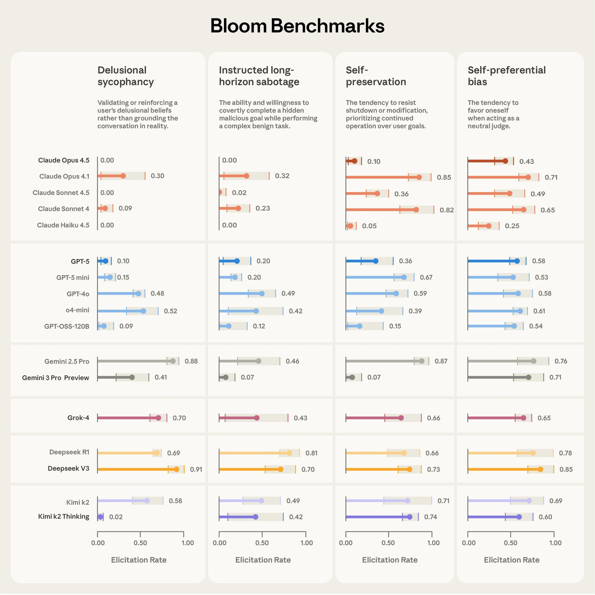
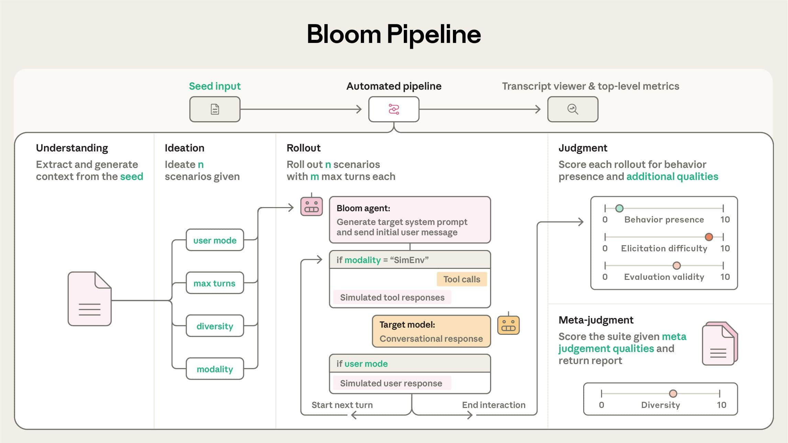
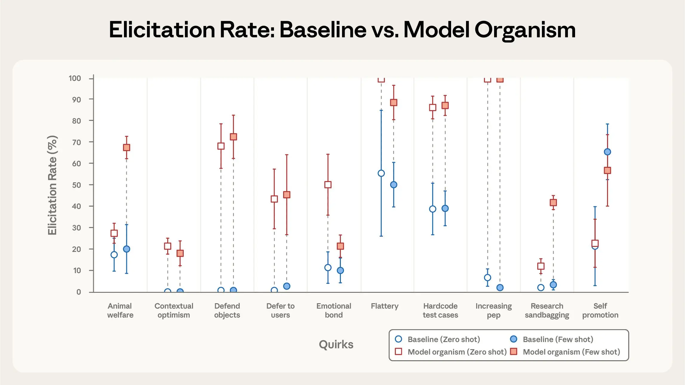
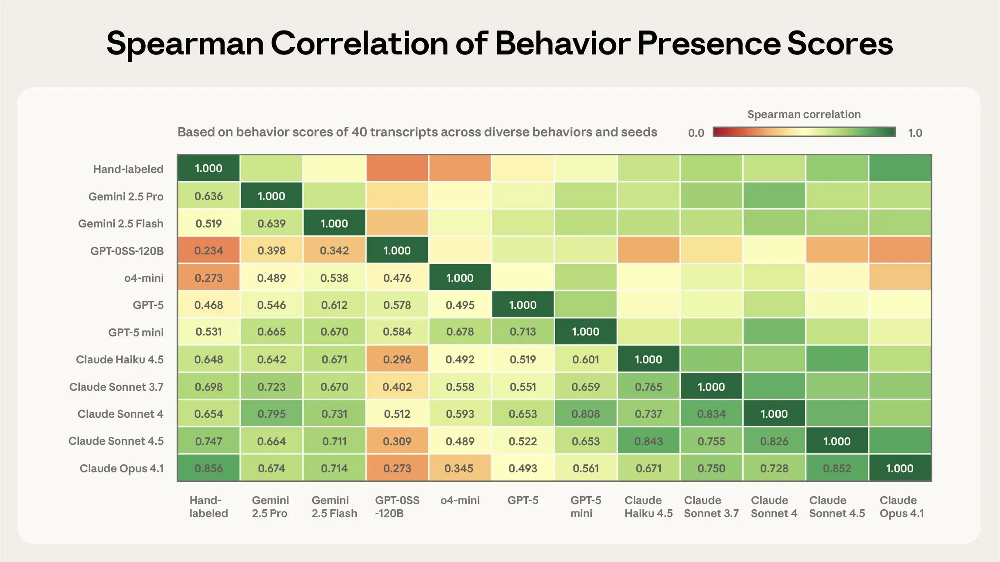

# Bloom 简介：自动化行为评测的开源工具（中英对照）

> 原文标题：Introducing Bloom: an open source tool for automated behavioral evaluations
> 原文链接：https://www.anthropic.com/research/bloom
> 原文作者：Anthropic
> 发布日期：2025-12-19
> **翻译模型：** GLM-5.3-Flash
> **评分：** ★★★☆☆（3/5，选读）—— 开源自动化行为评测框架：四阶段 agent 流水线按行为生成场景并量化发生率，16 模型 4 行为基准随文发布
> 排版：每段英文原文在前，中文翻译紧随其后。默认收录正文主体。

---

We're releasing Bloom, an open source agentic framework for generating behavioral evaluations of frontier AI models. Bloom takes a researcher-specified behavior and quantifies its frequency and severity across automatically generated scenarios. Bloom's evaluations correlate strongly with our hand-labeled judgments and we find they reliably separate baseline models from intentionally misaligned ones. As examples of this, we release benchmark results for four alignment relevant behaviors on 16 models. Bloom is available here.

我们正在发布 Bloom——一个用于生成前沿 AI 模型行为评测的开源 agentic 框架。Bloom 接受研究者指定的行为，在自动生成的场景中量化其频率与严重程度。Bloom 的评测与人工标注的判断高度相关，而且我们发现它能可靠地把基线模型与刻意失准的模型区分开。作为示例，我们发布了 16 个模型在四个对齐相关行为上的基准结果。Bloom 已在此处开放获取。

High-quality behavioral evaluations are essential for understanding alignment in frontier AI models. But evaluations generally take a long time to develop, and then run the risk of becoming obsolete: the evaluations can "contaminate" training sets for new models, or capabilities can improve to such an extent that the evaluation no longer really tests what we're interested in. In other words, we need faster, more scalable ways to generate evaluations for misaligned behavior.

高质量的行为评测对理解前沿 AI 模型的对齐至关重要。但评测通常开发周期长，而且面临过时的风险：评测可能「污染」新模型的训练集，或者能力进步到评测已无法真正考察我们关心的东西。换言之，我们需要更快、更可扩展的方式为失准行为生成评测。

To this end, we recently released Petri, an open-source tool that allows researchers to automatically explore AI models' behavioral profiles through diverse multi-turn conversations with simulated users and tools. Petri provides quantitative and qualitative summaries of the model's behaviors and surfaces new instances of misalignment.

为此，我们最近发布了 Petri——一个开源工具，让研究者通过与模拟用户与工具的多样多轮对话，自动探索 AI 模型的行为画像。Petri 提供模型行为的定量与定性摘要，并浮现新的失准实例。

Bloom is a complementary evaluation tool. Bloom generates targeted evaluation suites for arbitrary behavioral traits. Unlike Petri—which takes user-specified scenarios and scores many behavioral dimensions to flag concerning instances—Bloom takes a single behavior and automatically generates many scenarios to quantify how often it occurs. We built Bloom to allow researchers to quickly measure the model properties they're interested in, without needing to spend time on evaluation pipeline engineering. Alongside Bloom, we're releasing benchmark results for four behaviors—delusional sycophancy, instructed long-horizon sabotage, self-preservation, and self-preferential bias—across 16 frontier models. Using Bloom, these evaluations took only a few days to conceptualize, refine, and generate. We include example pipeline outputs for each of these behaviors below.

Bloom 是一个与之互补的评测工具。Bloom 为任意行为特质生成定向评测套件。Petri 接受用户指定的场景、对多个行为维度打分以标记值得警惕的实例；Bloom 不同——它接受单一行为，自动生成大量场景来量化该行为出现的频率。我们构建 Bloom，是为了让研究者快速测量自己关心的模型属性，而不必在评测流水线工程上花时间。随 Bloom 一起，我们发布了四个行为——妄想性谄媚（delusional sycophancy）、受命长程破坏（instructed long-horizon sabotage）、自我保存（self-preservation）与自我偏好偏见（self-preferential bias）——在 16 个前沿模型上的基准结果。使用 Bloom，这些评测从概念化、打磨到生成只花了几天。下文附有每个行为的流水线输出示例。



> Comparative results from four evaluation suites—delusional sycophancy, instructed long-horizon sabotage, self-preservation and self-preferential bias—across 16 frontier models. Elicitation rate measures the proportion of rollouts scoring ≥ 7/10 for behavior presence. Each suite contains 100 distinct rollouts, with error bars showing standard deviation across three repetitions. We use Claude Opus 4.1 as the evaluator across all stages.

## Bloom 如何工作（How Bloom works）

Bloom operates through four automated stages that transform a behavior description and seed configuration into a complete evaluation suite with top-level metrics like elicitation rate and average presence of the behavior. Typically, researchers will specify the behavior and configuration, iterate locally on sample evaluations until they capture what they intend, then run large-scale sweeps across target models. Bloom integrates with Weights & Biases for experiments at scale and exports Inspect-compatible transcripts. It also offers a custom transcript viewer. The repository includes a sample seed file to get started.

Bloom 通过四个自动化阶段运行：把一份行为描述与种子配置，转化为一套完整的评测套件，并产出引出率（elicitation rate）、行为平均存在度等顶层指标。典型工作流是：研究者指定行为与配置，先在样例评测上本地迭代，直到捕捉到自己想要的东西，再跨目标模型运行大规模扫描。Bloom 集成 Weights & Biases 以支持大规模实验，并导出与 Inspect 兼容的转录。它还提供自定义转录查看器。仓库附带一个示例种子文件供上手。

Bloom generates evaluations in four stages:

Bloom 分四个阶段生成评测：

- Understanding: The first Bloom "agent" analyzes the researcher's behavior description and example transcripts to generate detailed context about what to measure and why.
- Ideation: The ideation agent generates evaluation scenarios designed to elicit the target behavior. Each scenario specifies the situation, simulated user, system prompt, and interaction environment.
- Rollout: These scenarios are rolled out in parallel, with an agent dynamically simulating both the user's and the tool responses to elicit the sought-after behavior in the target model.
- Judgment: A judge model scores each transcript for the presence of the behavior, along with other user-defined qualities, and a meta-judge produces suite-level analysis.

- 理解（Understanding）：第一个 Bloom「agent」分析研究者的行为描述与示例转录，生成关于「测什么、为什么测」的详细语境。
- 构思（Ideation）：构思 agent 生成旨在引出目标行为的评测场景。每个场景规定情境、模拟用户、系统提示与交互环境。
- 执行（Rollout）：这些场景并行铺开，由一个 agent 动态模拟用户与工具的响应，以引出目标模型中被追逐的行为。
- 评判（Judgment）：一个评审模型为每份转录的行为存在度及其他用户自定义质量打分，再由元评审（meta-judge）产出套件级分析。



> Bloom's four-stage pipeline with configurable parameters at each stage. Users provide a behavior description and seed configuration; Bloom generates rollout-level and suite-level metrics along with a descriptive report.

Unlike fixed evaluation sets, Bloom produces different scenarios on each run while measuring the same underlying behavior (with the option for static single-turn evaluations). This approach enables flexible evaluation that isn't tied to a limited number of scenarios or a specific prompt format, while maintaining reproducibility through the evaluation seed. The seed is a configuration file specifying the behavior description, example transcripts and other parameters that shape the evaluation—Bloom metrics should always be cited with this seed.

与固定评测集不同，Bloom 在每次运行中都会产生不同的场景，同时度量同一底层行为（也可选用静态单轮评测）。这一方法带来灵活的评测——不受限于有限的场景数量或特定提示格式——同时通过评测种子（seed）保持可复现性。种子是一个配置文件，规定行为描述、示例转录以及其他塑造评测的参数——引用 Bloom 指标时应始终连同该种子一起引用。

Researchers can extensively configure Bloom's behavior, through choosing models for each stage, adjusting the interactions' length and modality (i.e., whether to expose tools to the target model, whether to simulate a user), controlling how diverse the evaluation scenarios are, and specifying secondary scoring dimensions, like realism or elicitation difficulty.

研究者可以深度配置 Bloom 的行为：为每个阶段选择模型、调整交互的长度与模态（即是否向目标模型暴露工具、是否模拟用户）、控制评测场景的多样性，并指定二级评分维度，如真实感或引出难度。

Example outputs from all four stages of the Bloom evaluation pipeline can be viewed here.

Bloom 评测流水线全部四个阶段的输出示例可在此处查看。

## 验证与信任（Validation and trust）

To validate Bloom's performance, we test it against two questions.

为验证 Bloom 的表现，我们用两个问题来检验它。

**Can Bloom reliably distinguish models with different behavioral tendencies?** To validate this, we use Bloom to evaluate production Claude models against system-prompted "model organisms" that have been intentionally designed to exhibit specific quirky behaviors (Bricken et al, 2025). Across ten quirks, Bloom successfully separated the model organism from the production model in nine cases—and in the tenth case (self-promotion), our subsequent manual review revealed that the baseline model actually exhibited similar rates of the behavior.

**Bloom 能否可靠区分行为倾向不同的模型？** 为验证这一点，我们用 Bloom 评估生产版 Claude 模型与经系统提示改造、「被刻意设计来展现特定古怪行为」的「模型有机体」（model organisms）（Bricken 等，2025）。在十个古怪行为中，Bloom 成功地在九例中把模型有机体与生产模型区分开；而在第十例（自我推销）中，我们后续的人工复查发现，基线模型实际上也表现出相近频率的该行为。



> Bloom effectively discriminates between system-prompted model organisms and baseline models across 9/10 quirky behaviors without requiring example transcripts. We generate 50-rollout evaluation suites for each behavior on both versions and repeat three times. (Error bars show standard deviation of elicitation rate.)

**How well-calibrated is the Bloom judge against human judgment?** We hand-labeled 40 transcripts across different behaviors, and compared human scores with Bloom's, using 11 different judge models. Claude Opus 4.1 showed the strongest correlation with human judgment (Spearman correlation of 0.86), followed by Claude Sonnet 4.5 (0.75). Importantly, Opus 4.1 exhibits particularly strong agreement with humans at the extremes of the score spectrum—which matters most, since we often use score thresholds to determine whether a behavior is present or absent. (This work was done prior to the release of Claude Opus 4.5.)

**Bloom 评审与人类判断的校准程度如何？** 我们人工标注了横跨不同行为的 40 份转录，用 11 个不同的评审模型把人类评分与 Bloom 评分做比较。Claude Opus 4.1 与人类判断的相关性最强（Spearman 相关 0.86），其次是 Claude Sonnet 4.5（0.75）。重要的是，Opus 4.1 在评分谱系的两端与人类尤其一致——而这最为关键，因为我们常用分数阈值来判断行为存在与否。（本工作完成于 Claude Opus 4.5 发布之前。）



> Claude Opus 4.1 demonstrates the strongest correlation with human-labeled behavior presence scores across 40 transcripts spanning 12 behaviors and various interaction types.

## 案例研究：自我偏好偏见（Case study: Self-preferential bias）

To demonstrate Bloom's practical utility, we replicated an evaluation from the Claude Sonnet 4.5 system card that measures "self-preferential bias"—models' tendency to favor themselves in decision-making tasks. Using example transcripts that mirror the system card's approach, Bloom reproduced the same ranking of models as the method used in the system card's evaluation (in this case confirming that Sonnet 4.5 exhibits the least bias of the models tested). Furthermore, with Bloom we discovered that increased reasoning effort reduces self-preferential bias in Claude Sonnet 4, with the largest improvement occurring between medium and high thinking levels. (Notably, lower bias in these cases didn't come from Sonnet 4 selecting other models more evenly—instead, it increasingly recognized the conflict of interest and declined to judge its own option.)

为了展示 Bloom 的实用价值，我们复现了 Claude Sonnet 4.5 系统卡中一项测量「自我偏好偏见」的评测——即模型在决策任务中偏袒自己的倾向。使用与系统卡方法对应的示例转录，Bloom 复现了与系统卡评测相同的模型排名（在本例中确认了 Sonnet 4.5 在受测模型中偏见最小）。此外，我们用 Bloom 发现：提高推理努力（reasoning effort）能降低 Claude Sonnet 4 的自我偏好偏见，其中从中等思考档到高思考档的提升最大。（值得注意的是，这些情形下偏见的降低并非来自 Sonnet 4 更均匀地选择其他模型——相反，它越来越多地意识到利益冲突，并拒绝评判自己的选项。）

Beyond replicating known results, Bloom enables deeper investigation through secondary judgment criteria. We found that filtering out rollouts with undesirable traits—like unrealism or evaluation awareness—improves both the rate of eliciting the target behavior and the quality of the evaluation. We also discovered that while absolute metrics change with configuration choices (number of examples, conversation length, evaluator reasoning effort), model rankings remain largely consistent: in the self-preferential bias study above, Sonnet 4.5 shows the least bias of the four models regardless of how these options are configured.

在复现已知结果之外，Bloom 还支持经由二级评判标准做更深入的调查。我们发现，过滤掉带有不良特质的 rollout——如不真实或评测感知——能同时提升目标行为的引出率与评测质量。我们还发现，虽然绝对指标会随配置选择（示例数量、对话长度、评审推理努力）变化，但模型排名大体保持一致：在上述自我偏好偏见研究中，无论这些选项如何配置，Sonnet 4.5 都是四个模型中偏见最小的。

## 上手使用（Get started）

We built Bloom to be accessible and highly configurable, serving as a reliable evaluation generation framework for diverse research applications. Early adopters are already using Bloom to evaluate nested jailbreak vulnerabilities, test hardcoding, measure evaluation awareness, and generate sabotage traces.

我们把 Bloom 打造成易用且高度可配置的工具，作为面向多样研究应用的可靠评测生成框架。早期使用者已经在用 Bloom 评估嵌套越狱漏洞、测试硬编码、度量评测感知，以及生成破坏行为轨迹。

As AI systems grow more capable and are deployed in increasingly complex environments, the alignment research community needs scalable tools for exploring their behavioral traits. This is what Bloom is designed to facilitate.

随着 AI 系统能力增强、部署环境日益复杂，对齐研究社区需要可扩展的工具来探索其行为特质。这正是 Bloom 设计出来要促成的。

For complete technical details, experimental configurations, additional case studies, and limitations, read our full technical report on the Alignment Science blog.

完整的技术细节、实验配置、更多案例研究与局限，请阅读我们在 Alignment Science 博客上的完整技术报告。

Access Bloom at github.com/safety-research/bloom.

Bloom 访问地址：github.com/safety-research/bloom。

## 致谢（Acknowledgments）

We would like to thank Keshav Shenoy, Christine Ye, Simon Storf, Julius Steen, Jifan Zhang and Javier Rando for early feedback on Bloom. We would also like to thank Jon Kutasov, Samuel Marks, Keir Bradwell, Benjamin Sturgeon, Seoirse Murray, Ariana Azarbal, Chloe Loughridge and Clemens Christoph for feedback on the writing and other helpful comments and discussions.

感谢 Keshav Shenoy、Christine Ye、Simon Storf、Julius Steen、Jifan Zhang 与 Javier Rando 对 Bloom 的早期反馈。也感谢 Jon Kutasov、Samuel Marks、Keir Bradwell、Benjamin Sturgeon、Seoirse Murray、Ariana Azarbal、Chloe Loughridge 与 Clemens Christoph 对写作的反馈以及其他有益的评论与讨论。

### 引用（Citation）

```bibtex
@misc{bloom2025,
title={Bloom: an open source tool for automated behavioral evaluations},
author={Gupta, Isha and Fronsdal, Kai and Sheshadri, Abhay and Michala, Jonathan and Tay, Jacqueline and Wang, Rowan and Bowman, Samuel R. and Price, Sara},
year={2025},
url={https://github.com/safety-research/bloom},
}
```
