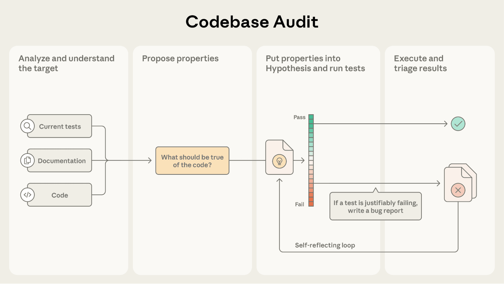

# 用 Claude 与基于属性的测试找出 bug（中英对照）

> 原文标题：Finding bugs with Claude and property-based testing
> 原文链接：https://www.anthropic.com/research/property-based-testing
> 原文作者：Muhammad Maaz（MATS/Anthropic）、Liam DeVoe（Northeastern University）、Zac Hatfield-Dodds、Nicholas Carlini（Anthropic）
> 发布日期：2026-01-14
> **翻译模型：** GLM-5.3-Flash
> **评分：** ★★★★☆（4/5，强推荐）—— Claude Code 命令形态的 PBT agent 在 NumPy/SciPy/Pandas 等真实包里批量找 bug，高分报告 86% 有效、多个补丁已被合并，测试工程 × agent 的范本
> 排版：每段英文原文在前，中文翻译紧随其后。默认收录正文主体。

---

Muhammad Maaz (MATS, Anthropic), Liam DeVoe (Northeastern University), Zac Hatfield-Dodds (Anthropic), Nicholas Carlini (Anthropic)

Muhammad Maaz（MATS、Anthropic）、Liam DeVoe（东北大学）、Zac Hatfield-Dodds（Anthropic）、Nicholas Carlini（Anthropic）

We developed an agent that can efficiently identify bugs in large software projects. To do this, our agent infers general properties of code that should be true, and then by applying property-based testing—a technique similar to fuzz testing—we are able to discover bugs in top Python packages like NumPy, SciPy, and Pandas. After extensive manual validation, we are in the process of reporting these bugs to the developers, several of which have already been patched.

我们开发了一个能在大型软件项目中高效识别 bug 的 agent。它先推断代码应普遍成立的性质（property），再应用基于属性的测试（property-based testing，一种类似模糊测试的技术），在 NumPy、SciPy、Pandas 等顶级 Python 包中发现了 bug。经过大量人工验证，我们正在把这些 bug 报告给开发者，其中几个已被修复。

For more information, read the full paper, take a look at the GitHub repository, or browse the bugs we found at our site.

更多信息请阅读完整论文、查看 GitHub 仓库，或浏览我们发现的 bug（链接见原文）。

## 引言（Introduction）

Ensuring that programs are bug-free is one of the most challenging aspects of software engineering. Bugs frequently continue to lurk despite the developer's best effort. The most common approach to testing code is with example-based tests: the developer writes out a specific example use-case, and then verifies that the actual output matches the expected output. For example, a developer might verify that a sort function called on the list [2, 10, 5, 4] would return the output [2, 4, 5, 10]. However, exhaustively covering a program with tests like this is challenging: bugs frequently remain in an edge case the developer did not test. After all, if a developer does not think to test an edge case, it is also likely the developer did not consider that case in the implementation!

确保程序没有 bug 是软件工程中最具挑战性的方面之一。无论开发者如何尽力，bug 总是继续潜伏。最常见的测试方法是基于示例的测试（example-based tests）：开发者写出一个具体示例用例，然后验证实际输出与预期输出一致。例如，开发者可能验证对列表 [2, 10, 5, 4] 调用排序函数会返回 [2, 4, 5, 10]。然而，用这类测试穷尽覆盖一个程序很困难：bug 常常藏在开发者没有测到的边缘情况里。毕竟，如果开发者没想到要测某个边缘情况，实现时多半也没考虑到它！

In contrast, property-based testing is a software testing paradigm that aims to test whether a general property of the code holds for all (or most) inputs. A developer specifies a property or invariant about the program—for example, that JSON deserialization is the inverse of serialization—as well as a description of the kinds of inputs the property accepts (e.g., any JSON serializable objects). The property-based testing framework then automatically searches for a counterexample of this property by generating valid inputs as test cases using techniques similar to fuzzing. Since the developer specifies the general input domain, and not individual test cases, property-based testing frees developers from thinking of every edge case and allows them to operate at a higher level of abstraction.

相比之下，基于属性的测试（property-based testing）是一种检验"代码的一般性质是否对所有（或大多数）输入成立"的软件测试范式。开发者只需指定程序的一条性质或不变量——例如"JSON 反序列化是序列化的逆操作"——以及该性质接受的输入类型描述（如：任何可 JSON 序列化的对象）。基于属性的测试框架随后用类似模糊测试（fuzzing）的技术自动生成有效输入作为测试用例，搜索该性质的反例。由于开发者指定的是一般性的输入域而非一条条测试用例，基于属性的测试把开发者从"想遍每个边缘情况"中解放出来，让他们在更高的抽象层次上工作。

In our paper that we presented at the 2025 NeurIPS Deep Learning for Code Workshop that was the result of a MATS project, we developed an AI agent that autonomously writes property-based tests for existing code. We directed the agent to discover properties by reading type annotations, docstrings, function names, and comments. The agent then wrote corresponding property-based tests using Hypothesis.

在我们发表于 2025 年 NeurIPS Deep Learning for Code Workshop 的论文（MATS 项目成果）中，我们开发了一个为现有代码自主编写基于属性的测试的 AI agent。我们让它通过阅读类型标注、docstring、函数名与注释来发现性质，随后用 Hypothesis 编写相应的基于属性的测试。

For this work, we focused on the problem of identifying bugs in general, and not just security vulnerabilities. Many classes of logic bugs that cause security vulnerabilities are amenable to property-based testing. For example, in a recent blog post we focused on identifying bugs in smart contracts; almost all of those vulnerabilities are the result of logic bugs. In the future we imagine that it may be possible to apply techniques such as the one we describe here to proactively identify bugs before deployment.

在这项工作中，我们关注的是一般性地识别 bug，而不只是安全漏洞。许多引发安全漏洞的逻辑 bug 都适合用基于属性的测试来抓。例如，在近期的一篇博文中我们聚焦识别智能合约中的 bug——其中几乎所有漏洞都是逻辑 bug 的产物。展望未来，我们认为可以把本文描述的这类技术用于部署前主动发现 bug。

We used our agent and discovered hundreds of potential bugs in popular open-source Python repositories like NumPy, SciPy, and Pandas. In order to responsibly disclose these bugs and to ensure we don't unnecessarily burden maintainers, we carefully reviewed each bug.

我们用这个 agent 在 NumPy、SciPy、Pandas 等流行的开源 Python 仓库中发现了数百个潜在 bug。为了负责任地披露、且不给维护者造成不必要的负担，我们逐个仔细审查了这些 bug。

The review process we used is more laborious than we would otherwise implement for our own code reviews, but we strongly preferred to reduce the number of false positives. Our process was as follows: first, we only selected the highest priority bugs for review. We sent these potential bugs to be reviewed by three expert humans (for an average of one hour of review per bug). We then discarded any bug where any of the three manual reviewers were uncertain of its validity. Finally, we (the authors of this blog) manually reviewed each of the candidate bugs. Only if we were also confident in its correctness did we then manually file an issue with the maintainer of the repository. We have already filed several of these bug reports, and are in the process of filing many more.

我们的审查流程比我们自己代码审查常用的更费力，但我们强烈倾向于压低假阳性数量。流程如下：首先只选取最高优先级的 bug 进入审查；把这些潜在 bug 交给三位人类专家审查（平均每个 bug 一小时）；任何一位审查者对其有效性不确定的 bug 即被丢弃；最后由我们（本文作者）人工复核每个候选 bug，只有我们也有把握时，才人工向仓库维护者提交 issue。我们已经提交了其中几份报告，还有更多在提交中。

We've made available all of our data, including bugs that have not yet been validated, and, for completeness, even bugs that we determined to be invalid, so that maintainers can look at them at this site. Over the coming weeks we intend to file many of these remaining bugs (after additional validation), as well as expand our project to additional PyPI projects.

我们公开了全部数据——包括尚未验证的 bug，以及出于完整性考虑连我们判定无效的 bug——维护者可在该网站查阅。未来几周，我们打算（在补充验证后）继续提交其余的 bug，并把项目扩展到更多 PyPI 包。

```
# example-based test
def test_sort():
    assert my_sort([1,3,2]) == [1,2,3]
    assert my_sort([1,0,-5]) == [-5,0,1]

# property-based test in Hypothesis
from hypothesis import given, strategies as st

@given(st.lists(st.integers()))
def test_sort(lst):
    result = my_sort(lst)
    for i in range(len(result)-1):
        assert result[i] <= result[i+1]
```

**图 1：** 测试代码的两种方式。基于示例的单元测试验证手工指定的具体输入；基于属性的测试则指定一条一般性质（如"有序列表的定义"），由框架自动构造可能违反该性质的输入。
**Figure 1.** Two ways of testing code. An example-based unit test verifies specific manually-specified inputs. A property-based test, in contrast, specifies a general property (e.g., the definition of a sorted list) and relies on the framework to automatically construct inputs that might fail this property.

## 我们的基于属性的测试 agent（Our Property-Based Testing Agent）

Our property-based testing agent is built as a custom Claude Code command. The agent takes a single argument, pointing it towards a particular target, either a single Python file (e.g., normalizers.py), a module (e.g., numpy, scipy.signal), or a function (e.g., requests.get, json.loads). The agent then follows this process to identify potential bugs:

我们的 PBT agent 做成一个自定义 Claude Code 命令。它接受单个参数，指向一个具体目标：单个 Python 文件（如 normalizers.py）、一个模块（如 numpy、scipy.signal）或一个函数（如 requests.get、json.loads）。随后 agent 按以下流程识别潜在 bug：

- Read and understand the target, by reading code, pulling relevant documentation, and exploring how it relates to the rest of the codebase.
- 阅读并理解目标：读代码、拉取相关文档、考察它与代码库其他部分的关系。

- Propose properties grounded in these findings.
- 依据这些发现提出（有根据的）性质。

- Write corresponding property-based tests in Hypothesis.
- 用 Hypothesis 编写相应的基于属性的测试。

- Run the tests and reflect: if it failed, has the test truly discovered a bug, or does the test need to be adjusted? If it succeeded, is the test testing anything worthwhile, or is it simply trivial?
- 运行测试并反思：若测试失败，是测试真的发现了 bug，还是测试本身需要调整？若测试通过，它测的是不是有价值的东西，还是只是平凡性质？

- If the agent is confident it has found a real bug, it writes out a formatted bug report.
- 若 agent 确信找到了真 bug，就输出一份格式化的 bug 报告。



> An illustration of the agent workflow.

To help the agent perform long-range multi-step reasoning, we direct it to use a to-do list to track its progress.

为了帮助 agent 进行长程多步推理，我们让它使用待办清单（to-do list）跟踪进度。

A priority in designing the agent was reducing the number of false alarms—from our personal experience, useful developer tooling minimizes the amount of incorrect reports presented to the developer. The self-reflection loop helps reduce the number of false alarms, as does grounding any properties in explicit usage and documentation of the target. For example, in one of the agent runs, the agent wrote a property that first passed. However, after self-reflection, the agent realized that it had wrapped the whole test in a try-catch block. After removing that, the test failed, and the agent found a bug. We also observed a notable improvement in self-reflection with Opus 4.1 and Sonnet 4.5, compared to Sonnet 4.

设计该 agent 的一个优先事项是减少误报——凭我们的亲身经验，好用的开发者工具会尽量少给开发者报错误信息。自我反思回路有助于减少误报，把性质锚定在目标的显式用法与文档上也有同样效果。例如在一次运行中，agent 写出的性质先是通过了；但经过自我反思，它意识到自己把整个测试包在 try-catch 块里。去掉之后测试失败，agent 找到了一个 bug。我们还观察到，与 Sonnet 4 相比，Opus 4.1 与 Sonnet 4.5 的自我反思能力有显著提升。

### 运行示例（Example run）

To demonstrate how the agent works through testing a target, we show a paraphrased transcript where Claude identifies a bug in the implementation of numpy.random.wald. The agent begins with investigating the function, its signature, its docstring, and even existing tests:

为了展示 agent 如何测试一个目标，我们给出一段改写过的对话记录：Claude 在 numpy.random.wald 的实现中发现了一个 bug。agent 从考察该函数、其签名、docstring 乃至现有测试入手：

Note that the fix is not correct; when we fixed this bug, we traced the source of the error to a numerically unstable calculation; see our merged fix here.

（视频中）该修复并不正确；我们修复这个 bug 时，把错误根源追到了一个数值不稳定的计算上，见我们已合并的修复（链接见原文）。

## 在真实 PyPI 包中搜索 bug（Searching for bugs in real PyPI packages）

In order to test our agent's abilities in the real world, we curated a diverse set of over 100 popular Python packages. These libraries span a variety of domains, from numerical computing to parsing to databases. We called our agent on each of these packages, and collected all generated bug reports.

为了在真实世界检验 agent 的能力，我们精选了 100 多个流行的 Python 包，涵盖数值计算、解析、数据库等多个领域。我们对每个包运行 agent，收集所有生成的 bug 报告。

### 评估 agent（Evaluating the agent）

For the first phase of our evaluation, which is covered in our paper, we ran the agent with Claude Opus 4.1 on each package and collected all generated bug reports. To evaluate these bug reports, we settled on two criteria: first, "is this a valid bug?", and second, "is this both a valid bug, and something we would reasonably report to the library maintainers?" The second criteria is stricter than the first, as, e.g., a bug might be valid, but too minor to file a report for.

评估的第一阶段（论文已覆盖）用 Claude Opus 4.1 在每个包上运行 agent 并收集全部 bug 报告。评估报告时我们定了两条标准：第一，"这是有效 bug 吗？"；第二，"它既是有效 bug，又值得我们合理地向库维护者报告吗？"第二条比第一条严格——bug 可能有效，但太小不值得报。

Of the 984 bug reports, we manually selected 50 to review. We found that 56% of those reports were valid bugs, and 32% were valid bugs that we would also report.

在 984 份 bug 报告中，我们人工抽取 50 份审查：56% 是有效 bug，32% 是既有效、我们也会报告的 bug。

Based on this manual review, we developed a rubric that ranks bugs out of 15, with the intent of surfacing bugs that are most likely to be valid and worth fixing to the developer. We used Opus 4.1 to score all bug reports according to this rubric. We found that this ranking step was considerably effective: of the top-scoring bug reports, 86% were valid, and 81% were both valid and reportable.

基于这次人工审查，我们制定了一份满分 15 分的 bug 评分细则，用于把最可能有效、最值得开发者修复的 bug 挑出来。我们用 Opus 4.1 按该细则给全部 bug 报告打分，发现这一排名步骤相当有效：得分最高的报告中，86% 有效，81% 既有效又可报告。

In the second phase of our evaluation, we ran the agent with Sonnet 4.5 on a subset of 10 important packages, running it on each package multiple times. We also developed an evaluation agent that used Sonnet 4.5 to read the code and the bug report to check the correctness and severity of the bug, which was more sophisticated than the rubric from the first phase. Lastly, we paid 3 expert human reviewers to evaluate high-severity bugs for correctness.

评估第二阶段用 Sonnet 4.5 在 10 个重要包的子集上运行 agent，每个包跑多次。我们还开发了一个评估 agent，用 Sonnet 4.5 读代码与 bug 报告来核查 bug 的正确性与严重度——比第一阶段的细则更精细。最后，我们付费请 3 位人类专家审查者评估高严重度 bug 的正确性。

To read all the bug reports our agent found, see https://mmaaz-git.github.io/agentic-pbt-site/.

要阅读 agent 找到的全部 bug 报告，见 https://mmaaz-git.github.io/agentic-pbt-site/ 。

### 维护者验证（Maintainer validation）

Evaluating the effectiveness of any tool which discovers bugs in code is difficult. While we try our best to validate the correctness of bug reports, the package maintainers serve as the ultimate arbiter of truth. To validate that our agent finds bugs that maintainers consider valid and worth fixing, we selected five particularly interesting bugs and manually reported these to their respective GitHubs, along with a proposed patch. Over the coming weeks, we intend to continue reporting additional bugs as we verify.

评估任何"在代码中发现 bug"的工具有效性都很难。我们尽力验证 bug 报告的正确性，但包维护者才是真相的最终仲裁者。为了验证 agent 找到的 bug 是维护者眼中有效且值得修的，我们挑选了五个特别有趣的 bug，连同建议补丁一并人工报告到各自的 GitHub。未来几周，我们会随着验证继续报告更多 bug。

#### numpy

numpy.random.wald sometimes returns negative numbers, which is a bug because samples from the Wald distribution should only return positive numbers. This is the bug demonstrated in our example run above. Claude knew this as a property of the Wald distribution and wrote a straightforward PBT to see if all samples generated are positive. We traced the error to a catastrophic cancellation occurring in the code, and developed a more numerically stable formulation when we submitted the pull request. As shown by the NumPy maintainers in the pull request, our reformulation has nearly ten orders of magnitude lower relative error than the previous algorithm.

numpy.random.wald 有时返回负数——这是一个 bug，因为 Wald 分布的样本只应为正。这就是上文运行示例中演示的那个 bug。Claude 把"Wald 分布样本恒为正"当作性质，写了一个直白的 PBT 检查所有生成的样本是否为正。我们把错误追到了代码中的灾难性抵消（catastrophic cancellation），并在提交 pull request 时给出了数值上更稳定的表述。如 NumPy 维护者在 PR 中所示，我们的重写相对误差比原算法低了近十个数量级。

Patch merged: https://github.com/numpy/numpy/pull/29609

补丁已合并：https://github.com/numpy/numpy/pull/29609

#### aws-lambda-powertools

slice_dictionary() returns the first chunk repeatedly, due to not incrementing the iterator. This was caught by our agent by identifying that slicing and then reconstructing the dictionary should return the original dictionary.

aws-lambda-powertools 的 slice_dictionary() 因未递增迭代器而反复返回第一块。agent 抓到它的方式是认定"切片再重建字典应还原出原字典"这一性质。

Patch merged: https://github.com/aws-powertools/powertools-lambda-python/pull/7246

补丁已合并：https://github.com/aws-powertools/powertools-lambda-python/pull/7246

#### cloudformation-cli-java-plugin

item_hash() produces the same value of hash(None) for all lists, due to use of the in-place .sort() method, which returns None. The agent caught this by testing that hashes of different inputs should be different.

cloudformation-cli-java-plugin 的 item_hash() 对所有列表都产出与 hash(None) 相同的值——因为它用了原地 .sort() 方法，而该方法返回 None。agent 通过"不同输入的哈希应不同"这一性质抓到了它。

Patch submitted: https://github.com/aws-cloudformation/cloudformation-cli/pull/1106

补丁已提交：https://github.com/aws-cloudformation/cloudformation-cli/pull/1106

#### tokenizers

EncodingVisualizer.calculate_label_colors() is missing a closing parenthesis, returning invalid HSL CSS. Our agent identified this by testing that the output should match the regex for a HSL color code.

tokenizers 的 EncodingVisualizer.calculate_label_colors() 少了一个右括号，产出非法的 HSL CSS。agent 通过"输出应匹配 HSL 颜色码正则"的性质发现了它。

Patch merged: https://github.com/huggingface/tokenizers/pull/1853

补丁已合并：https://github.com/huggingface/tokenizers/pull/1853

#### python-dateutil

easter() returns a non-Sunday date for some years when using the Julian calendar. Maintainers identified the behavior as intended due to differing calendar systems, and acknowledged the semantics as subtle.

python-dateutil 的 easter() 在某些年份使用儒略历时返回的不是星期日。维护者认定这是不同历法体系下的预期行为，并承认其语义微妙。

Issue invalid: https://github.com/dateutil/dateutil/issues/1437

issue 被判无效：https://github.com/dateutil/dateutil/issues/1437

The report to python-dateutil shows an important limitation of the agent: deriving properties from code with subtle or complex semantics remains difficult. If the code makes an implicit assumption, only the library maintainers can decide what the correct property to test is.

python-dateutil 这份报告暴露了 agent 的一个重要局限：从语义微妙或复杂的代码中推导性质仍然困难。如果代码隐含了某种假设，只有库维护者能判定"正确的测试性质"是什么。

## 结论（Conclusion）

As language models continue to improve, we think agentic property-based testing could become an increasingly valuable complement to human-written testing. The high-level semantic guarantees of property-based testing makes them a natural fit to pair with during development. We find that LLMs are particularly good at identifying properties that should be true about a given block of code from context (the name of the function, the docstring, how it is called by other functions, etc). This allows LLMs to write high quality property-based tests effectively.

随着语言模型持续进步，我们认为智能体化的基于属性的测试（agentic PBT）可能成为人类编写测试的日益宝贵的补充。PBT 的高层语义保证使它天然适合在开发过程中搭配使用。我们发现，LLM 特别善于从上下文（函数名、docstring、被其他函数调用的方式等）中识别"给定代码块应当成立"的性质——这使 LLM 能够有效地写出高质量的基于属性的测试。

Going forward, we believe that applying LLM to testing and bugfinding is an important research direction. Especially as LLMs improve at the process of exploiting vulnerabilities, it is necessary to stay ahead of attackers using LLMs for exploitation.

展望未来，我们相信把 LLM 应用于测试与找 bug 是重要的研究方向。尤其当 LLM 利用漏洞的能力不断增强时，我们必须跑在"用 LLM 做攻击"的攻击者前面。

While we do not focus on the automatic generation of patches in this work, this is a clear direction for future work. If it is possible to (nearly) completely specify the correctness properties of a block of code, then correcting the bug becomes significantly easier, and we believe that in the near future LLMs will be able to effectively propose high-quality patches that are worth the consideration of maintainers.

虽然本文没有聚焦自动生成补丁，但这是清晰的未来方向。如果能够（近乎）完整地规定一段代码的正确性性质，修 bug 就会容易得多。我们相信，在不远的将来，LLM 将能有效地提出值得维护者考虑的高质量补丁。
