# Anthropic 经济指数报告：经济基元（中英对照）

> 原文标题：Anthropic Economic Index report: Economic primitives
> 原文链接：https://www.anthropic.com/research/anthropic-economic-index-january-2026-report
> 原文作者：Ruth Appel、Maxim Massenkoff、Peter McCrory（第一作者）等（Anthropic 经济研究团队）
> 发布日期：2026-01-15
> **翻译模型：** GLM-5.3-Flash
> **评分：** ★★★★★（5/5，里程碑/必读）—— AEI 第四期提出「经济基元」度量框架（技能/复杂度/自主性/成功率/用途五维），首次给出 AI 任务视界与生产率效应的可靠性修正，数据全量公开
> 排版：每段英文原文在前，中文翻译紧随其后。默认收录正文主体；原文各章脚注合并为全文连续编号（[^1]–[^25]）置于文末。

---

## 引言（Introduction）

### AI 正在如何重塑经济？（How is AI reshaping the economy?）

This report introduces new metrics of AI usage to provide a rich portrait of interactions with Claude in November 2025, just prior to the release of Opus 4.5. These "primitives"—simple, foundational measures of how Claude is used, which we generate by asking Claude specific questions about anonymized Claude.ai and first-party (1P) API transcripts—cover five dimensions relevant to AI's economic impact: user and AI skills, how complex tasks are, the degree of autonomy afforded to Claude, how successful Claude is, and whether Claude is used for personal, educational, or work purposes.

本报告引入新的 AI 使用度量，描绘 2025 年 11 月（Opus 4.5 发布前夕）与 Claude 交互的丰富画像。这些"基元"（primitives）——关于 Claude 如何被使用的简单、基础的度量，由我们就匿名化的 Claude.ai 与第一方（1P）API 对话记录向 Claude 提出具体问题而生成——覆盖与 AI 经济影响相关的五个维度：用户与 AI 的技能、任务复杂程度、赋予 Claude 的自主程度、Claude 的成功程度，以及 Claude 被用于个人、教育还是工作目的。

The results reveal striking geographic variation, real-world estimates of AI task horizons, and a basis for revised assessments of Claude's macroeconomic impact.

结果揭示了显著的地理差异、AI 任务视界（task horizon）的真实世界估计，以及修正 Claude 宏观经济影响评估的依据。

The data we release alongside this report are the most comprehensive to date, covering five new dimensions of AI use, consumer and firm use, and country and region breakdowns for Claude.ai.

与本报告一同发布的数据是迄今最全面的，覆盖 AI 使用的五个新维度、消费者与企业用途，以及 Claude.ai 的国别与地区分解。

### 与上一份报告相比有何变化？（What has changed since our last report?）

In the first chapter, we revisit findings from our previous Economic Index report published in September 2025. We find:

在第一章中，我们回顾 2025 年 9 月发布的上一份经济指数报告的发现。我们发现：

- Claude usage remains concentrated among certain tasks, most of them related to coding While we see over 3,000 unique work tasks in Claude.ai, the top 10 most common tasks account for 24% of our sampled conversations, a slight increase since our last report. Augmentation patterns (conversations where the user learns, iterates on a task, or gets feedback from Claude) edged to just over half of conversations on Claude.ai. In contrast, automated use remains dominant in 1P API traffic, reflecting its programmatic nature.
- Claude 的使用仍集中于某些任务，多数与编程相关。尽管 Claude.ai 上出现了 3000 多种不同的工作任务，最常见的 10 项任务占我们抽样对话的 24%，较上份报告略有上升。增强（augmentation）模式（用户学习、迭代任务或从 Claude 获得反馈的对话）略升至 Claude.ai 对话的一半以上。相比之下，自动化使用在 1P API 流量中仍占主导，反映出其程序化性质。

- Global usage remains persistently uneven while US states converge The US, India, Japan, the UK, and South Korea lead in overall Claude.ai use. Worldwide, uneven adoption remains well-explained by GDP per capita. Within the US, workforce composition plays a key role in shaping uneven adoption as states with more computer and mathematical professionals show systematically more Claude usage.
- 全球使用持续不均，而美国各州正在趋同。美国、印度、日本、英国与韩国领跑 Claude.ai 总体使用。在世界范围内，采用不均仍可由人均 GDP 很好地解释。在美国国内，劳动力构成是塑造不均采用的关键：拥有更多计算机与数学专业人员的州系统性地表现出更多 Claude 使用。

While substantial concentration remains, since our last report Claude usage has become noticeably more evenly distributed across US states. If sustained, usage per capita would be equalized across the country in 2-5 years.

尽管集中度仍然很高，但自上份报告以来，Claude 使用在美国各州之间的分布已明显更趋均匀。若此趋势持续，全国人均使用将在 2–5 年内拉平。

### 引入并分析新的经济基元（Introducing and analyzing our new economic primitives）

In the second chapter we discuss the motivation for and introduce our new economic primitives, including how they were selected and operationalized, and their limitations. We additionally present evidence that our primitives capture directionally accurate aspects of underlying usage patterns as compared to external benchmarks. In chapters three and four we use these primitives to further investigate implications for adoption and productivity. We find:

第二章讨论新经济基元的动机并加以引入，包括它们如何被选择与操作化、以及其局限。我们还给出证据，表明与外部基准相比，我们的基元对底层使用模式的捕捉在方向上是准确的。第三、四章用这些基元进一步考察对采用与生产率的含义。我们发现：

- Claude use diversifies with higher adoption and income While the most common use of Claude is for work, coursework use is highest in countries with the lowest GDP per capita, while rich countries show the highest rates of personal use. This aligns with a simple adoption curve story: early adopters in less developed countries tend to be technical users with specific, high-value applications or use Claude for education, whereas mature markets see usage diversify toward casual and personal purposes.
- 采用与收入越高，Claude 用途越多样。虽然 Claude 最常见的用途是工作，但课业用途在人均 GDP 最低的国家最高，而富裕国家的个人用途比例最高。这与简单的采用曲线叙事一致：欠发达国家的早期采用者往往是拥有特定高价值应用的技术用户，或把 Claude 用于教育；成熟市场则看到用途向休闲与个人目的多样化。

- Claude succeeds on most tasks, but less so on the most complex ones We find that Claude generally succeeds at the tasks it is given, and that the education level of its responses tends to match the user's input. Claude struggles on more complex tasks: As the time it would take a human to do the task increases, Claude's success rate falls, much like prominent evals measuring the longest tasks that AIs can reliably perform.
- Claude 能完成大多数任务，但在最复杂的任务上不然。我们发现 Claude 通常能完成交给它的任务，且其回应的教育水平往往与用户输入匹配。Claude 在更复杂的任务上吃力：随着人类完成该任务所需时间的增加，Claude 的成功率下降——这与那些度量"AI 能可靠完成的最长任务"的知名评估一致。

- Job exposure to AI looks different when success rates are factored in We also use the success rate primitive to better understand job exposure to AI, calculating the share of each occupation that Claude can perform by weighting task coverage by both success rates and the importance of each task within the job. For some occupations, like data entry keyers and database architects, Claude shows proficiency in large swaths of the job.
- 把成功率纳入考量后，职业的 AI 暴露度呈现出不同面貌。我们还用成功率基元更好地理解职业的 AI 暴露度：以成功率与每项任务在职业中的重要性为权重，计算 Claude 能完成的职业任务占比。对某些职业（如数据录入员与数据库架构师），Claude 在其工作的大片领域显出胜任力。

- Claude is used for higher-skill tasks than those in the broader economy The tasks we observe in Claude usage tend to require more education than those in the broader economy. If we assume that AI-assisted tasks diminish as a share of worker responsibilities, removing them would leave behind less-skilled work. But this simple task displacement would not affect white-collar workers uniformly—for some occupations it removes the most skill-intensive tasks, for others the least. Without the tasks that we observe Claude performing, travel agents would experience deskilling as complex planning work gives way to routine ticket purchasing and payment collection. Property managers, by contrast, would experience upskilling as bookkeeping tasks give way to contract negotiations and stakeholder management.
- Claude 被用于比整体经济中更高技能的任务。我们在 Claude 使用中观察到的任务，往往比整体经济中的任务需要更多教育。如果假设 AI 辅助任务在工人职责中的占比下降，移除它们会留下技能较低的工作。但这种简单的任务置换对白领工人的影响并不一致：对某些职业，它移除的是技能最密集的任务；对另一些则是最不密集的。没有我们观察到 Claude 执行的那些任务，旅行社代理人将经历去技能化（deskilling）——复杂规划工作让位于常规购票与收款。相反，物业管理人将经历技能升级（upskilling）——记账任务让位于合同谈判与利益相关者管理。

### 理解 AI 经济影响的新窗口（A new window for understanding AI's impact on the economy）

These results provide a new window into how AI is currently impacting the economy. Knowing the success rate of tasks gives a more accurate picture of which tasks might be automated, how impacted certain jobs might be, and how labor productivity will change. Measuring differential performance by user education sheds light on inequality effects.

这些结果为观察 AI 当下如何影响经济提供了新窗口。知道任务成功率，能更准确地描绘哪些任务可能被自动化、某些工作会受到多大影响、劳动生产率将如何变化。按用户教育度量差异化表现，则揭示不平等效应。

Indeed, the close relationship between education levels in inputs and outputs signals that countries with higher educational attainment may be better positioned to benefit from AI, independent of adoption rates alone.

事实上，输入与输出教育水平的紧密关联表明：教育程度更高的国家可能更有条件从 AI 中获益——而不只取决于采用率本身。

This data release aims to enable researchers and the public to better understand the economic implications of AI and investigate the ways in which this transformative technology is already having an effect.

本次数据发布旨在帮助研究者与公众更好地理解 AI 的经济含义，并研究这项变革性技术已经在产生影响的种种方式。

## 第一章：与上一份报告相比的变化（Chapter 1: What has changed since our last report）

### 概览（Overview）

Because frontier AI model capabilities are improving rapidly and adoption has been swift, it is important to regularly take stock of changes in how people and businesses are using such systems—and what this usage implies for the broader economy.[^1]

由于前沿 AI 模型能力快速提升、采用十分迅速，定期盘点人与企业使用此类系统的变化——以及这种使用对整体经济的含义——十分重要。[^1]

In this chapter we analyze how Claude usage and diffusion patterns changed from August 2025 to November 2025 just prior to the release of Opus 4.5. We make four observations:

本章分析 2025 年 8 月至 11 月（Opus 4.5 发布前夕）Claude 使用与扩散模式的变化。我们有四点观察：

- Usage remains highly concentrated across tasks: The ten most common tasks represent 24% of observed usage on Claude.ai, up from 23% in our last report. For first-party (1P) API enterprise customers, concentration among tasks increased more notably: the top ten tasks now represent 32% of traffic, up from 28% in the last report.
- 使用在任务间仍高度集中：最常见的十项任务占 Claude.ai 观测使用量的 24%，高于上份报告的 23%。对第一方（1P）API 企业客户而言，任务集中度上升更明显：前十项任务占流量的 32%，高于上份报告的 28%。

- Augmentation is once again more common than automation on Claude.ai: In our previous report we noted that automated use had risen to exceed augmented use on Claude.ai, perhaps capturing both improving capabilities and greater familiarity among users with LLMs. Data from November 2025 points to a broad-based shift back toward augmented use on Claude.ai: The share of conversations classified as augmented jumped 5pp to 52% and the share deemed automated fell 4pp to 45%.[^2] Product changes during this period—including file creation capabilities, persistent memory, and Skills for workflow customization—may have shifted usage patterns toward more collaborative, human-in-the-loop interactions.
- 在 Claude.ai 上，增强再次多于自动化：上份报告我们注意到自动化使用已升至超过增强使用，或许同时反映了能力提升与用户对 LLM 更熟悉。2025 年 11 月的数据显示，Claude.ai 出现了向增强使用的普遍回摆：被归为增强的对话占比跳升 5 个百分点至 52%，被归为自动化的下降 4 个百分点至 45%。[^2]这一时期的产品变化——包括文件创建能力、持久记忆、以及用于工作流定制的 Skills——可能把使用模式推向了更多协作、人在回路中的交互。

- Within the US, lower usage states have relatively faster gains in adoption Within the US, usage per capita remains largely shaped by how well-matched the workforce is to broader Claude usage: For example, states with a larger share of workers in computer and mathematical occupations tend to have higher usage. Indeed, the top five US states account for nearly half (50%) of all usage despite representing only 38% of the working-age population. Nevertheless, there are early signs of rapid regional convergence in adoption: usage has increased relatively faster for states that had lower usage in our last report. If sustained, usage per capita would be equalized across the country in 2-5 years, a pace of diffusion roughly 10x faster than the spread of previous economically consequential technologies in the 20th century.[^3] While this is consistent with rapid AI adoption and diffusion, this estimate comes with uncertainty given that it is based on a change observed over a three month period. Diffusion may ultimately proceed more slowly in the months and years to come.
- 在美国，使用量较低的州采用增长相对更快。美国国内，人均使用量很大程度上取决于劳动力与更广泛 Claude 使用的匹配程度：例如，计算机与数学职业从业者占比更大的州往往使用量更高。事实上，使用量最高的五个州占全部使用的近半（50%），而其工作年龄人口仅占 38%。尽管如此，已有区域快速趋同的早期迹象：上份报告中使用量较低的州，使用量增长相对更快。若持续，全国人均使用将在 2–5 年内拉平——这一扩散速度约为 20 世纪那些具有经济影响力的技术传播速度的 10 倍。[^3]虽然这与 AI 的快速采用与扩散相一致，但该估计基于仅三个月的变化观察，存在不确定性；未来数月数年，扩散可能放缓。

- Global usage shows little sign of increasing or decreasing regional convergence Globally, Claude usage per capita—as captured by the Anthropic AI Usage Index (AUI)—remains highly uneven and strongly correlated with GDP. These gaps are stable: we see no evidence that low-use countries are catching up or that high-use countries are pulling away.
- 全球使用几乎看不到区域趋同增强或减弱的迹象。全球范围内，Claude 人均使用（以 Anthropic AI 使用指数 AUI 度量）仍极不均衡、与 GDP 强相关。这些差距是稳定的：没有证据表明低使用国家正在追赶，或高使用国家正在拉开差距。

### 任务与相关职业使用模式的转变（Shifting patterns of usage across tasks and associated occupations）

Even though frontier LLMs have an impressive range of capabilities relevant to every facet of the modern economy, Claude usage remains very concentrated among a small number of tasks. As compared to nearly one year ago, consumer usage on Claude.ai is modestly more concentrated: The share of conversations assigned to the ten most prevalent O*NET tasks was 24% in November 2025, 1pp higher than in August and up from 21% in January 2025. The most prevalent task in November 2025—modifying software to correct errors—alone represented 6% of usage.

尽管前沿 LLM 具备与现代经济方方面面相关的能力，Claude 的使用仍高度集中于少数任务。与近一年前相比，Claude.ai 上的消费者使用略微更集中了：2025 年 11 月，被归入最普遍十项 O*NET 任务的对话占 24%，比 8 月高 1 个百分点，高于 2025 年 1 月的 21%。2025 年 11 月最普遍的任务——修改软件以纠正错误——单独占使用量的 6%。

In our last Anthropic Economic Index Report we began tracking business adoption patterns by studying Claude usage among 1P API customers. The ten most common tasks grew from 28% of API records in August to 32% in November. Rising concentration among a small set of tasks suggests the highest-value applications continue to generate outsized economic value even as models have become more capable at a wider range of tasks. As with Claude.ai the most common task among API customers was modifying software to correct errors, which accounted for one in ten records.

在上一份 Anthropic 经济指数报告中，我们开始通过研究 1P API 客户的 Claude 使用来追踪企业采用模式。最常见十项任务从 8 月占 API 记录的 28% 增至 11 月的 32%。任务集中度上升表明：即便模型在更广泛任务上变得更能干，最高价值的应用仍在产生超额经济价值。与 Claude.ai 一样，API 客户中最常见的任务也是修改软件以纠正错误，占十分之一的记录。

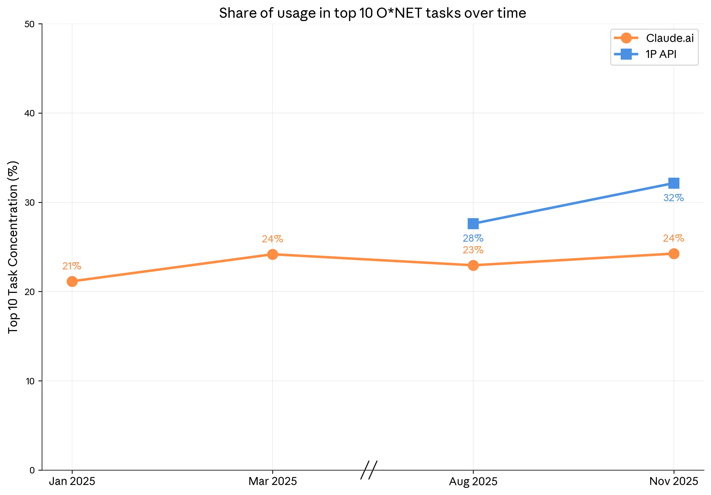

> Figure 1.1: Usage shares among top 10 tasks over time by platform, Claude.ai and 1P API.

事实上，计算机与数学类任务（如修改软件以纠正错误）继续主导 Claude 的总体使用：占 Claude.ai 对话的三分之一、接近 1P API 流量的一半。这种主导地位在 Claude.ai 上有所回落：被归入此类（多数与编程相关）任务的对话份额，从 2025 年 3 月 40% 的峰值降至 11 月的 34%。与此同时，1P API 流量中计算机与数学任务的份额从 8 月的 44% 微升至 2025 年 11 月的 46%（图 1.2）。

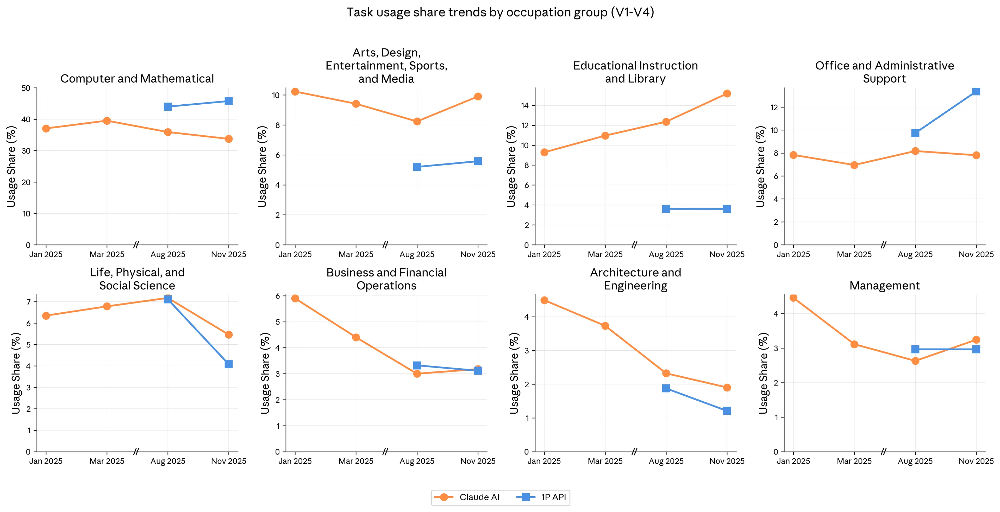

> Figure 1.2: Claude.ai and API usage over time.

2025 年 11 月 Claude.ai 使用占比第二的是"教育指导与图书馆"类。这主要对应课程作业与复习辅导、以及教学材料的开发。自首份报告以来，此类使用稳步上升：从 2025 年 1 月 Claude.ai 对话的 9% 升至 11 月的 15%。

8 月至 11 月间，Claude.ai 上"艺术、设计、娱乐、体育与媒体"任务的使用份额有所上升，因为越来越多对话用 Claude 进行写作任务，主要是文案编辑与虚构作品的写作与打磨。设计与写作类任务流行度的跳升，逆转了此前各报告中的持续下滑。对 Claude.ai 与 API 客户而言，用于"生命、物理与社会科学"任务的对话/记录份额均出现下降。

对 API 客户而言，最值得注意的变化也许是"办公与行政支持"类任务关联记录份额的上升：从 8 月上升 3 个百分点、至 2025 年 11 月达 13%。由于 API 使用以自动化为主，这表明企业正日益用 Claude 自动化后台例行工作流，如邮件管理、文档处理、客户关系管理与日程安排。[^4]

### 增强再次主导 Claude.ai（Augmentation is again dominant on Claude.ai）

AI 将如何影响经济，不仅取决于 Claude 被用于哪些任务，也取决于用户以何种方式接入并调用底层模型能力。自首份报告以来，我们把对话分为五种交互类型，再归入两大类：自动化（automation）与增强（augmentation）。[^5]

图 1.3 描绘了自一年前开始收集该数据以来，自动化与增强使用的演变。2025 年 1 月，Claude 的增强使用占主导：56% 的对话被归为增强，41% 为自动化。[^6]到 2025 年 8 月，被归为自动化的对话超过了增强。

这是一个值得注意的发展，它表明模型能力与平台功能的快速改进，伴随着用户日益把任务完全委托给 Claude。这在"指令式"（directive）协作模式中显而易见——该模式被进一步归入自动化。指令式对话指用户给 Claude 一个任务、它以最少来回完成。从 2025 年 1 月到 8 月，此类对话的份额从 27% 升至 39%。[^7]

三个月后，2025 年 11 月，指令式对话份额下降 7 个百分点至 32%，增强在 Claude.ai 上再次比自动化更普遍。不过，自动化份额仍高于近一年前我们开始追踪该指标时的水平，表明底层趋势仍朝更大自动化发展——即便 8 月的尖峰夸大了它到来的速度。

虽然我们看到一些证据表明 Claude.ai 上软技能用途在增加（设计、管理、教育类占比上升），但 11 月向增强使用的回摆是普遍性的（图 1.4）。增强使用的回升主要由"用户与 Claude 迭代完成任务"（任务迭代，task iteration）驱动，而非"让 Claude 解释概念"（学习，learning）。图 1.5 展示了各 O*NET 任务最常见的三种交互模式的相关词汇，以及对 Claude 请求的自下而上描述。

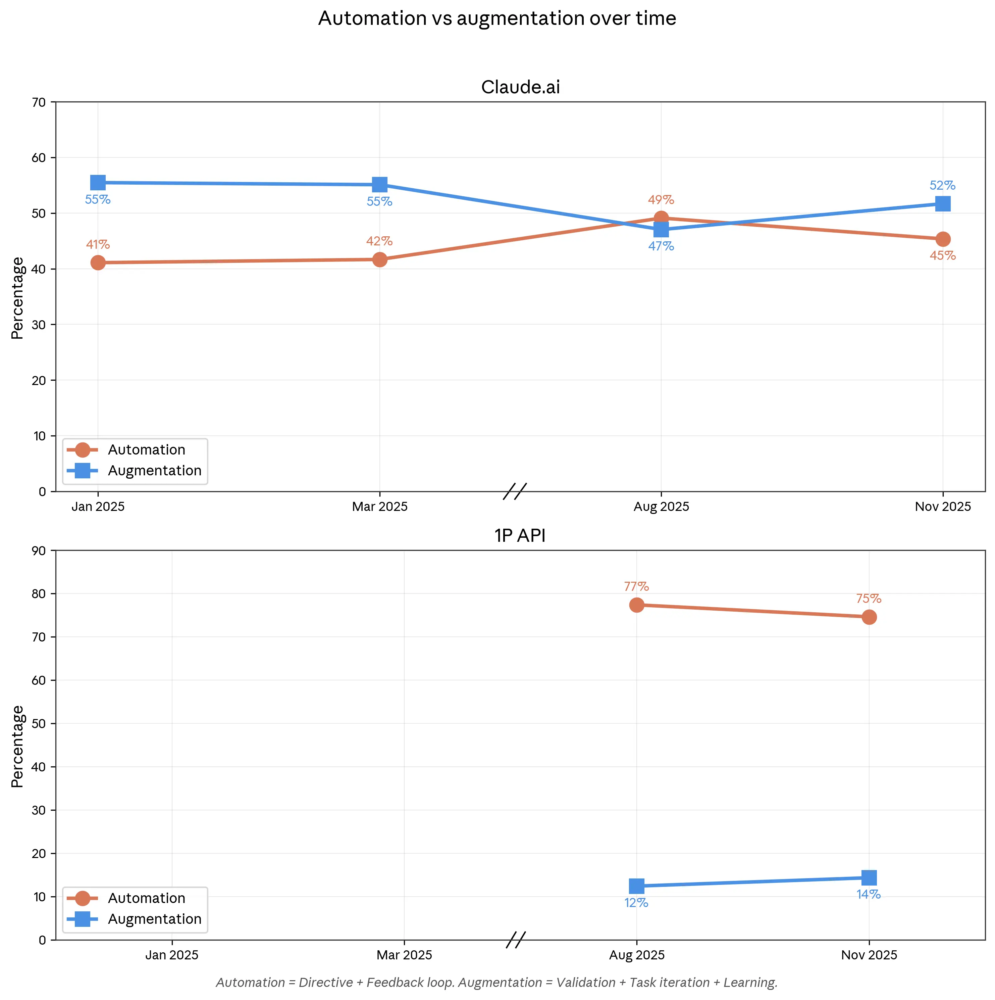

> Figure 1.3: Collaboration mode share over time by platform, Claude.ai and 1P API.

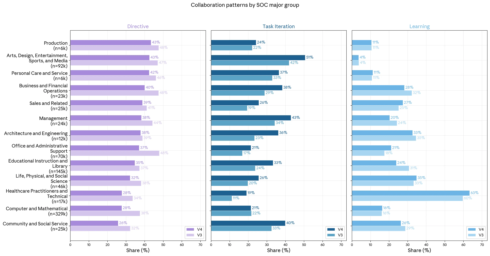

> Figure 1.4: Directive, Task Iteration, and Learning collaboration shares by Standard Occupation Classification (SOC) major group.

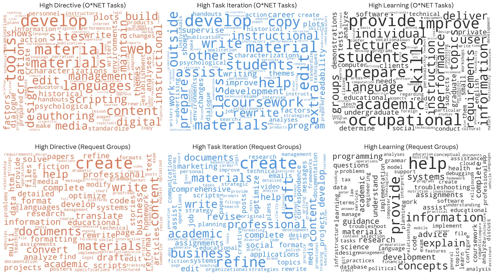

> Figure 1.5: Prominent words from among O*NET task titles and bottom-up request groupings by key collaboration type.

### 持续的区域集中（Persistent regional concentration）

在上一份报告中，我们引入了 Anthropic AI 使用指数（AUI），衡量 Claude 在某一地理区域内相对其工作年龄人口规模是被高估还是低估了。AUI 定义为：

AUI 高于 1 表示该国使用 Claude 的强度高于仅看人口所预测的水平；低于 1 则表示使用低于预期。例如，丹麦的 AUI 为 2.1，意味着其居民使用 Claude 的比率约为其全球工作年龄人口份额所暗示水平的两倍。

Claude 全球使用的一个关键事实是地理集中：少数国家构成过大的使用份额。从全球视角看，2025 年 8 月至 11 月这方面几乎没有变化。事实上，图 1.6 左图显示，各国 AUI 的集中度在上份报告与本报告之间基本未变。

相比之下，2025 年 8 月至 11 月，使用在美国各州间的分布更加均匀：基尼系数（衡量平等的标准指标）从 0.37 降至 0.32。解读短期变化需谨慎，但这是朝完全平等（即所有州 AUI 均为 1、基尼系数为 0）迈出的相对较大一步。如果美国基尼系数每三个月再降 0.05，约两年内即可达到使用平等。

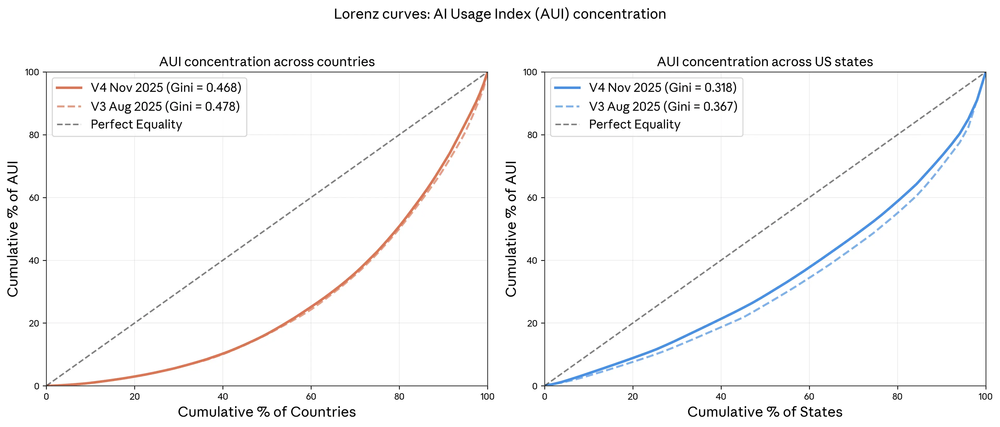

> Figure 1.6: AUI concentration around the world and within the US in this and the prior report.

是什么塑造了美国国内与全球的使用模式？在上份报告中，我们强调了收入差异在全球的关键作用：各国 Claude 使用量的差异，很大程度上可由人均 GDP 差异解释。第三章将重新审视收入不仅影响使用强度、也影响世界各地使用模式的重要性。

在美国国内，收入对使用的预测力不那么清晰。最重要的是各州劳动力的构成、以及劳动力与 Claude 能力（反映在任务级使用上）的匹配程度。计算机与数学职业从业者份额更高的州——如华盛顿特区、弗吉尼亚州与华盛顿州——往往人均使用量更高。定量而言，一个州的这类技术工人份额每增加 1%，人均使用量增加 0.36%（图 1.7）。仅此一项就解释了近三分之二的跨州 AUI 差异。

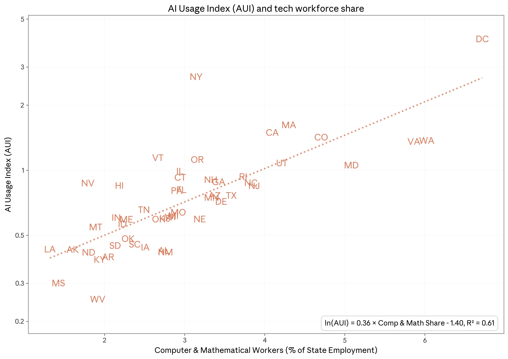

> Figure 1.7: AUI and share of workers in Computer & Mathematical occupations in each US State.

虽然我们直觉上预期技术工人更多的州 Claude 使用更高，但这一模式更具一般性：在"Claude 使用被过度代表"的职业（如艺术、设计、娱乐、体育与媒体）从业者更多的州，人均使用量更高；在"Claude 使用偏低"的职业（如运输与物料搬运）从业者相对较少的州，人均使用量也更高。这可以通过计算各州劳动力构成与 Claude 使用全局构成之间的 KL 散度（Kullback–Leibler divergence）看出：KL 散度更低的州——劳动力构成与 Claude 使用模式更相似——人均使用量往往更高。

### 低使用州出现更快扩散迹象（Signs of faster Claude diffusion in the US among low usage states）

虽然劳动力构成的差异似乎在美国国内区域采用中扮演了角色，但早期证据表明，Claude 的扩散速度远快于历史先例。具有经济影响力的技术历史上约需半个世纪才能在美国实现完全扩散（Kalanyi et al., 2025）。相比之下，把 2025 年 11 月的 Claude 采用率与三个月前比较，我们估计——以 AUI 度量——美国各州人均采用的平等可在 2–5 年内达成。该估计不确定性很高：估计精度无法排除慢得多的扩散速度。

我们通过一个简单的扩散模型生成这一估计，此处简述。我们把扩散建模为向"人均使用量相等的共同稳态"的比例收敛，其中每个州 s 的 AUI 等于 1：

在该模型下，AUI 相对稳态（AUI = 1）的对数偏离每三个月缩小 β 倍，意味着半衰期为 ln(.5)/ln(β) 个季度。例如，按季度数据，β = 0.99 意味着约 17 年的半衰期。举例来说，从初始 AUI 为 2 出发，这意味着 17 年后 AUI 降到约 1.4，50 年后约 1.1。我们取 β = 0.99 作为合理基准，因为它暗示的扩散速度与 20 世纪具有经济影响力的技术相当。

这一收敛模型引出如下回归设定[^8]：

用普通最小二乘（OLS）直接估计该方程，得到 β̂ ≈ 0.77；以各州劳动力加权的加权最小二乘（WLS）得到 β̂ ≈ 0.76（图 1.8）。两者在常规水平上均统计显著异于 1。照字面理解，这些估计意味着各州 AUI 只需两年多一点就能弥合其与 1 之间的大部分差距。

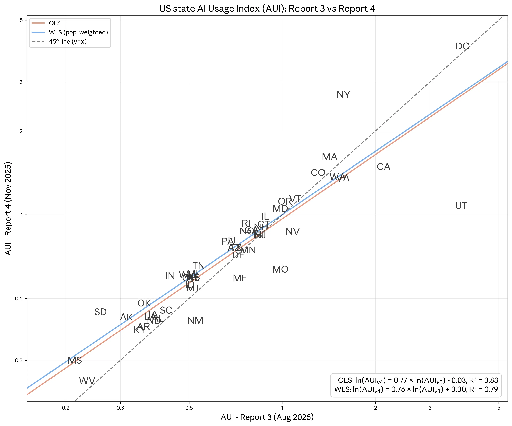

> Figure 1.8: Anthropic AI Usage Index (AUI) across the US, August 2025 (V3) and November 2025 (V4).

这样估计收敛的一个顾虑是：我们的 AUI 估计受抽样噪声及与扩散无关的其他变动的干扰。这会产生经典的衰减偏误（attenuation bias）：即便 AUI 实际没有变化，β 的估计也可能明显低于 1。

为此，我们用两阶段最小二乘（2SLS）估计该模型：以各州劳动力构成（以其与 Claude 使用总体模式的接近度度量）作为 2025 年 8 月 AUI 对数值的工具变量。工具的逻辑是：劳动力构成是 Claude 使用的强预测因子（相关性），但作为独立测量的量，预期与 AUI 估计中的抽样噪声无关（有效性）。如前所述，高 Claude 使用职业从业者更多的州，人均使用量确实系统性地更高。

2SLS 估计隐含略慢的收敛：未加权 β̂ ≈ 0.89，按各州工作年龄人口加权 β̂ ≈ 0.86。但这些估计精度较低，只有前者在 10% 水平上统计显著异于 1。尽管隐含比 OLS 更慢的收敛，2SLS 估计仍意味着快速扩散：各州 AUI 的对数偏离缩小 90% 只需四到五年。

话虽如此，我们的估计仅基于三个月的数据。虽然 2SLS 设定可能有助于处理抽样噪声，不确定性仍然很大。我们将在未来的报告中重新审视扩散速度问题。

[^1]: As with previous reports, all our analysis is based on privacy-preserving analysis. Throughout the report we analyze a random sample of 1M conversations from Claude.ai Free, Pro and Max conversations (we also refer to this as "consumer data" since it mostly represents consumer use) and 1M transcripts from our first-party (1P) API traffic (we also refer to this as "enterprise data" since it mostly represents enterprise use). Both samples come from November 13, 2025 to November 20, 2025. We continue to manage data according to our privacy and retention policies, and our analysis is consistent with our terms, policies, and contractual agreements. For 1P API data, each record is a prompt-response pair from our sample period which in some instances is mid-session for multi-turn interactions. / 与以往报告一样，我们的全部分析基于隐私保护分析。整份报告中，我们分析来自 Claude.ai Free/Pro/Max 的 100 万条对话随机样本（也称"消费者数据"，因其主要代表消费者使用），以及来自第一方（1P）API 流量的 100 万条对话记录（也称"企业数据"，因其主要代表企业使用）。两个样本均取自 2025 年 11 月 13 日至 20 日。我们继续按隐私与保留政策管理数据，分析符合我们的条款、政策与合同约定。对 1P API 数据，每条记录是采样期内的一对提示-响应，在多轮交互中有时处于会话中段。
[^2]: The share of conversations on Claude.ai that were classified into neither automation nor augmentation categories fell from 3.9% to 3.0%. / Claude.ai 上未被归入自动化或增强两类别的对话份额从 3.9% 降至 3.0%。
[^3]: See, for example, Kalanyi et al (2025): "Second, as the technologies mature and the number of related jobs grows, hiring spreads geographically. This process is very slow, taking around 50 years to disperse fully." / 例如参见 Kalanyi et al (2025)："其次，随着技术成熟与相关岗位增加，招聘在地理上扩散。这一过程非常缓慢，完全分散约需 50 年。"
[^4]: With our bottom-up analysis of 1P API traffic we see Claude used to "Generate personalized B2B cold sales emails" (0.47%), "Analyze emails and draft replies for business correspondence" (0.28%), "Build and maintain invoice processing systems" (0.24%), "Classify and categorize emails into predefined labels" (0.23%), and "Manage calendar scheduling, meeting coordination, and appointment booking" (0.16%). / 通过对 1P API 流量的自下而上分析，我们看到 Claude 被用于"生成个性化 B2B 冷销售邮件"（0.47%）、"分析邮件并为商务往来起草回复"（0.28%）、"构建并维护发票处理系统"（0.24%）、"把邮件分类到预定义标签"（0.23%）、"管理日程安排、会议协调与预约"（0.16%）。
[^5]: At a high level, we distinguish between automation and augmentation modes of using Claude. Automation encompasses interaction patterns focused on task completion: Directive: Users give Claude a task and it completes it with minimal back-and-forth; Feedback Loops: Users automate tasks and provide feedback to Claude as needed; Augmentation focuses on collaborative interaction patterns: Learning: Users ask Claude for information or explanations about various topics; Task Iteration: Users iterate on tasks collaboratively with Claude; Validation: Users ask Claude for feedback on their work. / 高层次上，我们区分使用 Claude 的自动化与增强两种模式。自动化涵盖以任务完成为核心的交互模式：指令式——用户给 Claude 任务、它以最少来回完成；反馈回路——用户自动化任务并按需向 Claude 提供反馈。增强聚焦协作式交互模式：学习——用户就各类话题向 Claude 索取信息或解释；任务迭代——用户与 Claude 协作迭代任务；验证——用户就自己的工作向 Claude 征求反馈。
[^6]: These interaction modes are not mutually exhaustive. In some instances, Claude determines that a sampled conversation does not match any of the five interaction modes. / 这些交互模式并非穷尽。有时 Claude 判定抽样对话与五种交互模式皆不符。
[^7]: In this report we use Sonnet 4.5 for classification whereas in our previous Economic Index report we used Sonnet 4. We previously found that different models can generate different classification outcomes, though these effects tend to be modest. / 本报告用 Sonnet 4.5 做分类，而上份经济指数报告用的是 Sonnet 4。我们此前发现不同模型可能产生不同的分类结果，但影响通常不大。
[^8]: We include a constant term in the regression since it should be equal to zero under the null hypothesis. Across all our specifications, the constant term is estimated to be close to and statistically indistinguishable from zero. / 回归中包含常数项，因为在原假设下它应等于零。在所有设定中，常数项的估计都接近零且统计上无法与零区分。

## 第二章：引入经济基元（Chapter 2: Introducing economic primitives）

The strength of the Anthropic Economic Index lies in showing not only how much AI is used, but how it is used. In prior reports, we showed which tasks Claude is used for, and how people collaborate with Claude. These data have enabled external researchers to analyze labor market shifts (e.g., Brynjolfsson, Chandar & Chen, 2025).

Anthropic 经济指数的强项在于不仅展示 AI 被用了多少，还展示它是如何被用的。在以往报告中，我们展示了 Claude 被用于哪些任务、人们如何与 Claude 协作。这些数据已使外部研究者得以分析劳动力市场变化（如 Brynjolfsson, Chandar & Chen, 2025）。

In this edition of the Anthropic Economic Index, we expand the breadth of data available to external researchers by providing insights on five economic "primitives", by which we mean simple, foundational measures of the ways that Claude is used, which we generate by asking Claude to answer specific questions about the anonymized transcripts in our sample. Some of our primitives encompass several such questions, and others use a single indicator.

在本期 Anthropic 经济指数中，我们通过提供五个经济"基元"的洞察，扩展了可供外部研究者使用的数据广度。所谓基元，指关于 Claude 使用方式的简单、基础的度量，由我们让 Claude 回答关于样本中匿名化记录的具体问题而生成。有些基元包含数个此类问题，另一些则使用单一指标。

Because AI capabilities are advancing so rapidly and the economic effects will be unevenly experienced, we need a breadth of signals to uncover not just how Claude is used but also to inform what impact this technology will have.

由于 AI 能力进步极快、经济效应的体验将不均匀，我们需要广泛的信号——不仅要揭示 Claude 如何被使用，还要为"这项技术将产生什么影响"提供依据。

### 对经济影响重要的 AI 使用维度（Dimensions of AI use that matter for economic impacts）

This report introduces five new economic primitives beyond the one we already measure, collaboration patterns (whether users automate or augment their tasks with Claude). These primitives capture five dimensions of a human-AI conversation: 1) task complexity, 2) human and AI skills, 3) work, coursework or personal use case, 4) the AI's level of autonomy, and 5) task success (see Table 2.1). AI autonomy captures something different from our existing automation/augmentation distinction. For example, "Translate this paragraph into French" is high automation (directive, minimal back-and-forth) but low AI autonomy (the task requires little decision-making from Claude).

本报告在已度量的协作模式（用户用 Claude 自动化还是增强其任务）之外，引入五个新的经济基元。它们捕捉人机对话的五个维度：1）任务复杂度，2）人类与 AI 技能，3）工作、课业或个人用例，4）AI 的自主水平，5）任务成功（见表 2.1）。AI 自主性捕捉的东西不同于我们既有的自动化/增强区分。例如"把这段话翻译成法语"是高度自动化的（指令式、几乎没有来回），但 AI 自主性很低（该任务几乎不需要 Claude 做决策）。

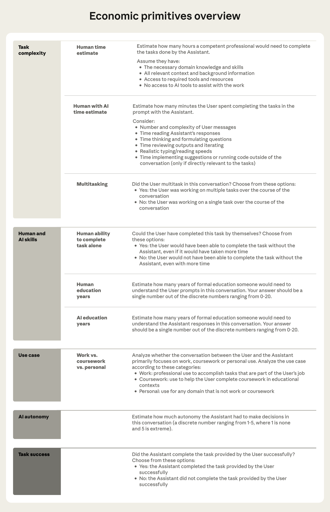

> Table 2.1: Economic primitives added in this report.

Task complexity captures that tasks can vary in their complexity, including how long they take to complete and how difficult they are. A "debugging" task in O*NET could refer to Claude fixing a small error in a function or comprehensively refactoring a codebase—with very different implications for labor demand. We measure complexity through estimated human time to complete tasks without AI, time spent completing tasks with AI, and whether users handle multiple tasks within a single conversation.

任务复杂度捕捉任务的复杂性差异，包括完成耗时与难度。O*NET 中的"调试"任务，可能指 Claude 修复函数中的小错误，也可能指全面重构代码库——对劳动需求的含义截然不同。我们用"无 AI 时人类完成任务所需时间的估计、用 AI 完成任务所花的时间、用户是否在单次对话中处理多个任务"来度量复杂度。

Human and AI skills address how automation interacts with skill levels. If AI disproportionately substitutes for tasks requiring less expertise while complementing higher-skilled work, it could be another form of skill-biased technical change—increasing demand for highly skilled workers while displacing lower skilled workers. We measure whether users could have completed tasks without Claude, and the years of education needed to understand both user prompts and Claude's responses.

人类与 AI 技能处理自动化与技能水平如何互动。如果 AI 不成比例地替代需要较少专业知识的任务、同时互补高技能工作，它可能是技能偏向型技术变革的另一种形式——增加对高技能工人的需求、同时替代低技能工人。我们度量"用户没有 Claude 是否能完成任务"，以及理解用户提示与 Claude 回应所需的受教育年数。

Use case distinguishes professional, educational, and personal use. Labor market effects most directly follow from workplace use, while educational use may signal where the future workforce is building AI-complementary skills.

用例区分职业、教育与个人使用。劳动力市场效应最直接地来自职场使用，而教育用途可能预示未来劳动力在哪里积累与 AI 互补的技能。

AI autonomy measures the degree to which users delegate decision-making to Claude. Our latest report documented rising "directive" use where users delegate tasks entirely. Tracking autonomy levels—from active collaboration to full delegation—helps forecast the pace of automation.

AI 自主性度量用户把决策委托给 Claude 的程度。我们的最新报告记录了用户完全委托任务的"指令式"使用上升。追踪自主水平——从主动协作到完全委托——有助于预测自动化步伐。

Task success measures Claude's assessment of whether Claude completes tasks successfully. Task success helps assess whether tasks can be automated effectively (can a task be automated at all?) and efficiently (how many attempts would it take to automate a task?). That is, task success matters for both the feasibility and the cost of automation labor tasks.

任务成功度量 Claude 对"任务是否被成功完成"的评估。任务成功有助于评估任务能否被有效自动化（任务究竟能否自动化？）与高效自动化（自动化一个任务需要尝试多少次？）。也就是说，任务成功同时关系到自动化劳动任务的可行性与成本。

### 新度量的选择与验证（Selecting and validating the new measures）

The new dimensions of AI use captured in our data were informed by our recent work on the productivity effects of Claude, feedback we received from external researchers, recent literature on AI's economic impact through the lens of human capital and expertise (Vendraminell et al., 2025), and deliberation within our economic research team. Our main selection criteria were expected economic relevance, complementarity of dimensions, and whether Claude could classify conversations along that dimension with directional accuracy.

数据中捕捉的这些 AI 使用新维度，参考了我们近期关于 Claude 生产率效应的工作、外部研究者的反馈、从人力资本与专长视角考察 AI 经济影响的近期文献（Vendraminell et al., 2025），以及经济研究团队内部的反复讨论。主要选择标准是：预期经济相关性、维度互补性，以及 Claude 能否沿该维度以方向准确性对对话分类。

We propose that multiple simple primitives, even if somewhat noisy and not perfectly accurate by themselves, can together provide important signals on how AI is being used. We therefore mainly tested for directional accuracy.

我们主张：多个简单基元即便各自有些噪声、并不完全准确，合在一起也能就 AI 的使用方式提供重要信号。因此我们主要检验方向准确性。

For classifying task duration with and without AI, we used minimally modified versions of our prior productivity work. For net new classifiers[^9], implemented via our privacy-preserving tooling, our validation process was as follows. We designed multiple potential measures to capture concepts such as task complexity. For Claude.ai, we evaluated the classifier performance compared to a human researcher on a small set of transcripts in which users gave feedback to Claude.ai and for which we thus have permission to look at underlying transcripts. For first-party API (1P API) data, we validate the classifiers using a mix of internal and synthetic data. Neither data sources are fully representative of Claude.ai or 1P API traffic, but they allow us to check that the classifiers are working on data that resembles real usage data, while ensuring privacy.

对"有无 AI 情况下的任务时长"分类，我们使用了此前生产率工作经过最小修改的版本。对全新分类器[^9]——通过我们的隐私保护工具实现——验证流程如下：为捕捉任务复杂度等概念，我们设计了多个候选度量。对 Claude.ai，我们在一小部分"用户向 Claude.ai 提供过反馈、因而我们有权查看底层记录"的记录上，把分类器表现与人类研究者对比。对第一方 API（1P API）数据，我们用内部与合成数据的混合来验证分类器。两类数据源都不能完全代表 Claude.ai 或 1P API 流量，但它们让我们得以在确保隐私的同时，检验分类器在接近真实使用数据上的工作情况。

Based on initial performance, we revised the classifiers that needed tweaking or discarded classifiers that did not perform well. Interestingly, we find that in some instances (e.g., to measure task success), a simple classifier performed better than a nuanced, complex classifier when compared to human ratings. We then compared performance of classifier versions with vs. without chain of thought prompting, and decided to keep chain of thought prompting only for three facets (human time estimate, human with AI time estimate, and AI autonomy) where we found that it substantially improved performance. We selected a final set of nine new classifiers for the five primitives, all of which are directionally accurate even if they may deviate somewhat from human ratings.

基于初步表现，我们修订了需要微调的分类器、丢弃了表现不佳者。有趣的是，我们发现在某些情形（如度量任务成功）下，简单分类器与人类评分对比时反而优于精细复杂的分类器。随后我们比较了带与不带思维链提示的分类器版本，决定只为三个方面保留思维链提示（人类耗时估计、人机协作耗时估计、AI 自主性）——在这三处它显著提升了表现。最终我们为五个基元选定了九个新分类器：即便与人类评分略有偏离，它们全部在方向上准确。

### 基元的价值在于它们能预测什么（The primitives' value is in what they can predict）

Our goal was to create classifiers that are straightforward to implement and in combination provide potentially important economic signals. While we are very confident in the directional accuracy of the new measures (e.g., tasks with higher average years of education needed to understand the human prompt are likely more complex), none of the measures should be taken as exact or definitive (e.g., Claude.ai may somewhat underestimate the human education years needed for many tasks).

我们的目标是创建易于实现、组合起来能提供潜在重要经济信号的分类器。虽然我们对新度量的方向准确性很有信心（例如，理解人类提示所需平均受教育年数更高的任务可能更复杂），但任何度量都不应被当作精确或决定性的（例如，Claude.ai 可能略微低估许多任务所需的人类教育年数）。

Even so, the primitives enrich our understanding of how people use AI. Systematic relationships emerge across primitives, regions, and tasks—patterns we explore in depth in Chapters 3 and 4. That these relationships are intuitive and consistent suggests the primitives capture relevant aspects of how people and businesses use Claude.

即便如此，基元丰富了我们对"人们如何使用 AI"的理解。跨基元、跨区域、跨任务浮现出系统性关系——我们将在第三、四章深入探究这些模式。这些关系直观而一致，说明基元捕捉到了人与企业使用 Claude 的相关侧面。

External benchmarks reinforce this. In our productivity work, Claude's time estimates correlate with actual time spent on software engineering tasks. Figure 2.1 shows that our human education measure correlates with actual worker education levels across occupations. These validations suggest individual primitives are directionally correct—and combining them may provide additional analytical value, such as enriching productivity estimates with task success rates or constructing new measures of occupational exposure.[^10]

外部基准强化了这一点。在我们的生产率工作中，Claude 的耗时估计与软件工程任务的实际耗时相关。图 2.1 显示，我们的人类教育度量与各职业的实际工人教育水平相关。这些验证表明单个基元方向正确——而组合它们可能提供额外分析价值，如用任务成功率充实生产率估计、或构建职业暴露度的新度量。[^10]

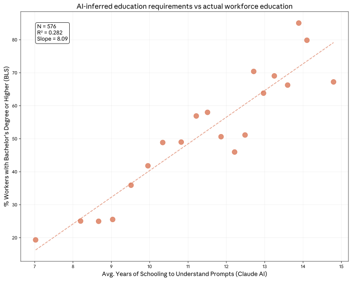

> Figure 2.1: Education years needed to understand the human prompt and share of workers with at least a Bachelor's Degree.

Ultimately, the strongest validation will come from the primitives' ability to capture meaningful variation in labor market outcomes. The data we release enable external researchers to analyze economic shifts in new ways. Early work has been encouraging—the automation/augmentation distinction from prior reports has already been used by external researchers to analyze labor market shifts (Brynjolfsson, Chandar & Chen, 2025).

归根结底，最强的验证将来自基元捕捉劳动力市场结果中有意义变异的能力。我们发布的数据使外部研究者能以新方式分析经济变化。早期工作是令人鼓舞的——以往报告中的自动化/增强区分，已被外部研究者用于分析劳动力市场变化（Brynjolfsson, Chandar & Chen, 2025）。

### 基元凸显用例差异（Primitives highlight how use cases differ）

To illustrate how the primitives distinguish between different types of AI use, we examine two contrasting request clusters: software development ("Help debug, develop, and optimize software across multiple programming domains") and personal life management ("Assist with personal life management and everyday tasks"). Figure 2.2 shows the primitive profile for each cluster alongside global averages.

为说明基元如何区分不同类型的 AI 使用，我们考察两个反差鲜明的请求簇：软件开发（"帮助跨多个编程领域调试、开发与优化软件"）与个人生活管理（"协助个人生活管理与日常事务"）。图 2.2 展示每个簇的基元画像及全球平均。

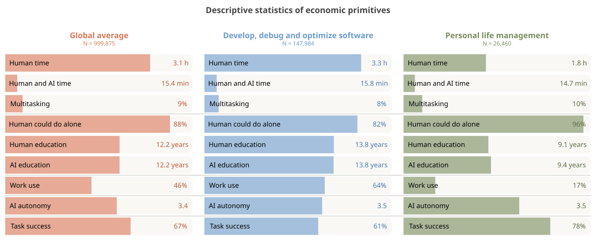

> Figure 2.2: Descriptive statistics of economic primitives overall and for two example request clusters.

Task complexity. Claude estimates that software development requests would take a competent professional approximately 3.3 hours to complete without AI—close to the global average of 3.1 hours. Personal life management tasks are estimated to be simpler, averaging 1.8 hours. Estimated human-AI collaboration time is similar across both (~15 minutes), showing this primitive varies less than other primitives for these two tasks.

任务复杂度。Claude 估计，若无 AI，一名胜任的专业人士完成软件开发请求约需 3.3 小时——接近 3.1 小时的全球平均。个人生活管理任务估计更简单，平均 1.8 小时。估计的人机协作时间两者相近（约 15 分钟），说明该基元在这两类任务间的变化小于其他基元。

Human and AI skills. Software development requests draw on more specialized knowledge: both human prompts and AI responses are estimated to require approximately 13.8 years of education to understand, compared to 9.1–9.4 years for personal life management requests. Claude estimates that users would be able to complete personal life management requests by themselves 96% of the time, versus 82% for software development requests—indicating that Claude provides more essential support for technical work.

人类与 AI 技能。软件开发请求调用更专门化的知识：人类提示与 AI 回应估计都需要约 13.8 年教育才能理解，而个人生活管理请求为 9.1–9.4 年。Claude 估计，用户有 96% 的情况能独立完成个人生活管理请求，而软件开发请求为 82%——表明 Claude 为技术工作提供了更不可或缺的支持。

Use case. Claude classifies 64% of software development requests as work-related, compared to just 17% for personal life management. This illustrates that Claude can be used for very different purposes. Overall, Claude.ai use is 46% work, 19% coursework, and 35% personal.

用例。Claude 把 64% 的软件开发请求归为与工作相关，而个人生活管理仅 17%。这说明 Claude 可用于迥异的目的。总体上，Claude.ai 的使用 46% 为工作、19% 为课业、35% 为个人。

AI autonomy. Both clusters show similar estimated autonomy levels (~3.5 on a 1 to 5 scale), near the global average. This means that both software development and personal life management tasks, on average, afford Claude a similar autonomy to make decisions on how to complete the task.

AI 自主性。两个簇的估计自主水平相近（1–5 分制下约 3.5），接近全球平均。这意味着软件开发与个人生活管理任务平均都给了 Claude 差不多的自主权，让它决定如何完成任务。

Task success. Claude assesses personal tasks as successfully completed 78% of the time, versus 61% for software development. Harder tasks—those requiring more specialized knowledge and where users could not easily complete them alone—show lower estimated success rates.

任务成功。Claude 评估个人任务 78% 的情况被成功完成，软件开发为 61%。更难的任务——需要更专门知识、用户难以独立完成者——估计成功率更低。

### Claude.ai 与 API 用户在任务与基元上的差异（Tasks and primitives differ between Claude.ai and API users）

As in our previous report, we find major differences in the tasks and primitives in Claude.ai conversations compared to the 1P API data. Part of this reflects the nature of the interaction: Claude.ai transcripts can include multi-turn conversations, while the API data we analyze is limited to single input-output pairs. This is because API requests arrive independently, with no metadata linking them to prior exchanges. This means we can only analyze them as isolated user-assistant pairs rather than full conversation trajectories.

与上份报告一样，我们发现 Claude.ai 对话与 1P API 数据在任务与基元上差异巨大。部分原因在于交互性质：Claude.ai 记录可以包含多轮对话，而我们分析的 API 数据仅限于单次输入-输出对——API 请求独立到达，没有把它们与先前交换关联起来的元数据。这意味着我们只能把它们当作孤立的用户-助手对分析，而非完整对话轨迹。

Overall, API usage is overwhelmingly work-related (74% vs. 46%) and directive (64% vs. 32%), with three-quarters of interactions classified as automation compared to less than half on Claude.ai (see Figure 1.3).

总体上，API 使用压倒性地与工作相关（74% 对 46%）、且以指令式为主（64% 对 32%），四分之三的交互被归为自动化，而 Claude.ai 上不足一半（见图 1.3）。

Claude.ai users, by contrast, engage in more back-and-forth: task iteration and learning modes are far more common, and tasks tend to be more lengthy—both in terms of human time with AI (15 minutes vs. 5 minutes) and the estimated time a human would need to complete the task alone (3.1 hours vs. 1.7 hours). Claude.ai also shows higher task success rates (67% vs. 49%), which may reflect the benefits of multi-turn conversation, where users can clarify, correct course, and iterate toward a solution. Claude.ai users also give the AI more autonomy on average, and are more likely to bring tasks they couldn't complete alone.

相比之下，Claude.ai 用户有更多来回：任务迭代与学习模式常见得多，任务也更耗时——无论人机协作时间（15 分钟对 5 分钟）还是估计人类独立完成所需时间（3.1 小时对 1.7 小时）。Claude.ai 的任务成功率也更高（67% 对 49%），这可能反映了多轮对话的好处：用户可以澄清、纠偏、迭代着逼近解。Claude.ai 用户平均也给 AI 更多自主权，更可能带来自己无法独立完成的任务。

These differences are also reflected in the occupational distribution of tasks. API usage is heavily concentrated in Computer & Mathematical tasks (52% vs. 36%), consistent with its use for programmatic, automation-friendly workflows like code generation and data processing. Office & Administrative tasks are also more prevalent in the API (15% vs. 8%), reflecting routine business operations suited to delegation. Claude.ai, by contrast, sees substantially more Educational Instruction tasks (16% vs. 4%)—coursework help, tutoring, and instructional material development—as well as more Arts, Design, and Entertainment tasks (11% vs. 6%). Claude.ai also has a longer tail of human-facing categories like Community & Social Service and Healthcare Practitioners, where users seek advice, counseling, or information on personal matters.

这些差异也体现在任务的职业分布上。API 使用高度集中于计算机与数学任务（52% 对 36%），与其用于程序化、适合自动化的工作流（代码生成、数据处理）一致。办公与行政任务在 API 中也更普遍（15% 对 8%），反映出适合委托的例行业务运营。相比之下，Claude.ai 上教育指导任务多得多（16% 对 4%）——课业辅导、家教、教学材料开发；艺术、设计与娱乐任务也更多（11% 对 6%）。Claude.ai 在面向人的类别上也有更长的尾部，如社区与社会服务、医疗从业者——用户在其中寻求建议、咨询或个人事务的信息。

These patterns suggest that 1P API deployments concentrate on tasks amenable to systematic automation, while Claude.ai serves a broader range of use cases including learning, creative work, and personal assistance.

这些模式表明：1P API 部署集中于适合系统化自动化的任务，而 Claude.ai 服务于更广泛的用例——学习、创意工作与个人助理。

Chapter 4 explores task-level variation in greater depth.

第四章将更深入地探讨任务层面的差异。

[^9]: A classifier is a model that assigns a given input (e.g. a user conversation) a specific output (e.g. the use case "work"). In this report, we use Claude as a classifier, meaning that we prompt Claude to select a specific output and then use Claude's response as the output (see Table 2.1 for the prompts). / 分类器是把给定输入（如一段用户对话）赋予特定输出（如用例"工作"）的模型。本报告中我们把 Claude 用作分类器：提示 Claude 选择特定输出，并把它的回答作为输出（提示词见表 2.1）。
[^10]: Throughout this report, we use binned scatterplots to show bivariate relationships. We divide observations into 20 equally-sized bins based on the x variable, then plot the average x and y values for each bin. The leftmost dot, for example, represents the averages for observations in the lowest 5% of the x distribution. / 整份报告中，我们用分箱散点图展示双变量关系：按 x 变量把观测分成 20 个等大分箱，再绘制每个分箱的平均 x 与 y 值。例如最左边的点代表 x 分布最低 5% 观测的均值。

## 第三章：Claude 的使用如何随地理而变（Chapter 3: How Claude is used varies by geography）

### 概览（Overview）

In this chapter, we analyze geographic variation in Claude usage patterns using a privacy-preserving[^11] analysis of 1 million Claude.ai conversations.[^12] We make five observations:

本章通过对 100 万条 Claude.ai 对话的隐私保护分析[^11]，考察 Claude 使用模式的地理差异。[^12]我们有五点观察：

- Claude is mostly used for work, but use cases diversify with adoption: Work and personal use cases are more common in higher-income countries, while coursework use cases are more common in lower-income countries. This echoes findings from our prior report and aligns with recent work by Microsoft.
- Claude 主要用于工作，但用途随采用而多样化：工作与个人用例在高收入国家更常见，课业用例在低收入国家更常见。这与我们此前报告的发现呼应，也与微软的近期工作一致。

- GDP and human education predict adoption globally and within the US: A 1% increase in GDP per capita is associated with a 0.7% increase in Claude usage per capita at the country level. Human education—Claude's estimate of years of formal education needed to understand the human prompt—correlates positively with the Anthropic AI Usage Index at both levels.
- GDP 与人类教育在国家与美国州两个层面都预测采用：国家层面，人均 GDP 每增 1%，Claude 人均使用增加 0.7%。人类教育——Claude 对理解人类提示所需正规教育年数的估计——在两个层面都与 Anthropic AI 使用指数正相关。

- Other primitives predict adoption differently at global vs. US levels: At the country level, higher usage correlates with shorter tasks and less AI autonomy. At the US state level, these relationships are not statistically significant, though work use correlates positively with adoption.
- 其他基元在全球与美国州层面对采用的预测方向不同：国家层面，更高使用与更短任务、更少 AI 自主性相关。在美国州层面，这些关系不具统计显著性，不过工作用途与采用正相关。

- Relationships between primitives depend on context: Task success is negatively associated with human education across countries, but positively within US states. However, when controlling for other primitives, the US relationship becomes insignificant.
- 基元之间的关系取决于情境：跨国比较中，任务成功与人类教育负相关；美国州内则正相关。但控制其他基元后，州层面的关系变得不显著。

- How humans prompt is how Claude responds: The education levels of human prompts and AI responses are nearly perfectly correlated (r > 0.92 at both levels). Higher per capita usage countries also show more augmentation—using Claude as a collaborator rather than delegating decisions entirely.
- 人如何提示，AI 便如何回应：人类提示与 AI 回应的教育水平近乎完全相关（两个层面均 r > 0.92）。人均使用更高的国家也表现出更多增强——把 Claude 当协作者，而不是把决策全部委托出去。

### Claude 主要用于工作，但用途随采用而多样化（Claude is mostly used for work, but use cases diversify with adoption）

Our data, relying on a privacy-preserving analysis of 1 million Claude.ai conversations, reveals striking geographic differences in how Claude is adopted. Claude is predominantly used for work, across the globe and across the United States. However, there is geographic variation in use cases. At the global level, the Balkans and Brazil have the highest relative share of work use (see Figure 3.1), and Indonesia stands out with the highest share of coursework. At the US state level, New York stands out as the state using Claude relatively the most for work.

我们的数据（基于对 100 万条 Claude.ai 对话的隐私保护分析）揭示了 Claude 采用方式上惊人的地理差异。无论在全球还是全美，Claude 都主要被用于工作。但用例存在地理差异：全球层面，巴尔干地区与巴西的工作使用相对份额最高（见图 3.1[^13]），印尼则以最高的课业份额突出。在美国州层面，纽约州是相对最多把 Claude 用于工作的州。

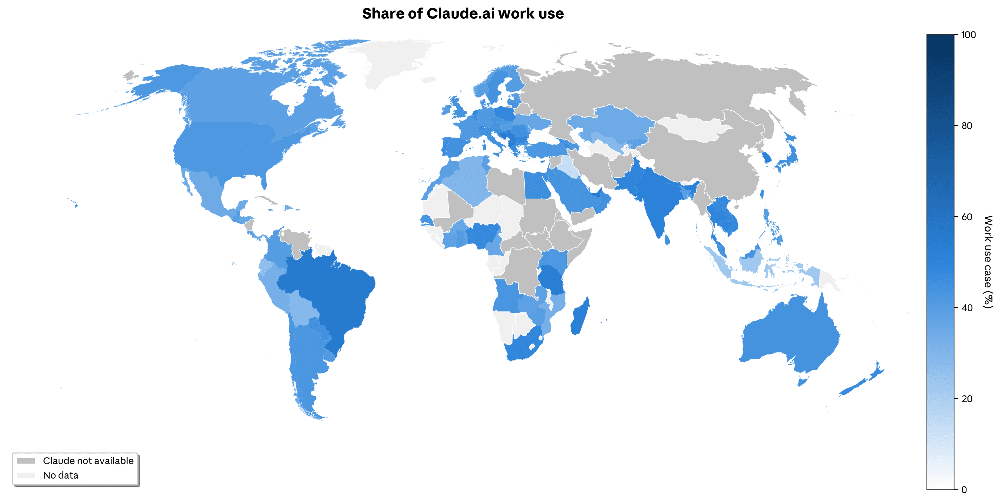

> Figure 3.1: Share of work use of Claude.ai globally.

用例差异与一国人均收入相关，而后者又与人均 AI 采用相关。我们观察到，Claude 的工作与个人用例在高收入国家更常见，而课业用例在低收入国家更常见（见图 3.2[^14]）。有趣的是，这些发现与微软的近期工作趋同：AI 用于学业与较低人均收入相关，AI 用于休闲与较高人均收入相关。

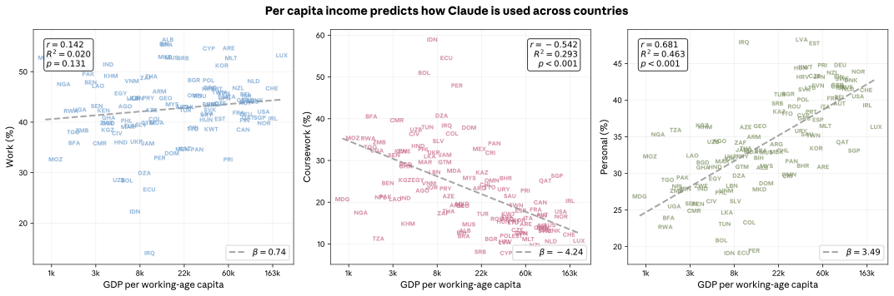

> Figure 3.2: Per capita income predicts how Claude is used across countries.

Multiple factors could contribute to these patterns:

多种因素可能促成这些模式：

- Personal use cases may be more common as AI adoption increases and more diverse users use AI, or existing users explore wider applications of AI. In contrast, countries with lower per capita adoption (which is correlated with lower per capita income) may be focused on specific use cases such as coding or as coursework.
- 随着 AI 采用增加、更多元的用户使用 AI，或既有用户探索 AI 的更广泛应用，个人用例可能更常见。相反，人均采用较低的国家（与较低人均收入相关）可能聚焦于编程或课业等特定用例。

- Countries differ in their ability to pay for Claude, and coursework use cases may be better suited to free Claude usage than complex use cases in work areas such as software engineering.
- 各国支付 Claude 费用的能力不同；与软件工程等复杂工作用例相比，课业用例可能更适合免费 Claude 额度。

- Users in higher-income countries may have other resources, such as free time and continuous Internet access, that enable non-essential personal use cases.
- 高收入国家的用户可能拥有其他资源——如闲暇与不间断的互联网接入——使非必要的个人用例成为可能。

### 国际与美国州层面在 economic primitives 上的采用差异（International and US adoption differ across economic primitives）

The economic primitives introduced in this report allow us to analyze some of the factors that may drive differential adoption. When analyzing the relationship between the Anthropic AI Usage Index (AUI) and core economic primitives as well as GDP, we observe that certain patterns hold for both countries and US states. For example, we replicate the finding from our prior report that GDP is strongly correlated with the AUI (see Figures 3.3 and 3.4). At the country level, a 1% increase in GDP per capita is associated with a 0.7% increase in Claude usage per capita. Human education (how many years of education it takes to understand the human written prompts in a conversation) correlates positively and significantly with the Anthropic AI Usage Index both at the country and at the US state level.

本报告引入的经济基元使我们得以分析可能驱动差异化采用的一些因素。在分析 AUI 与核心经济基元及 GDP 的关系时，我们观察到某些模式在国家与美国州两个层面都成立。例如，我们复现了上份报告"GDP 与 AUI 强相关"的发现（见图 3.3[^15] 与 3.4[^16]）。国家层面，人均 GDP 每增 1%，Claude 人均使用增加 0.7%。人类教育（理解对话中人类书面提示所需的教育年数）在国家与美国州层面都与 AUI 显著正相关。

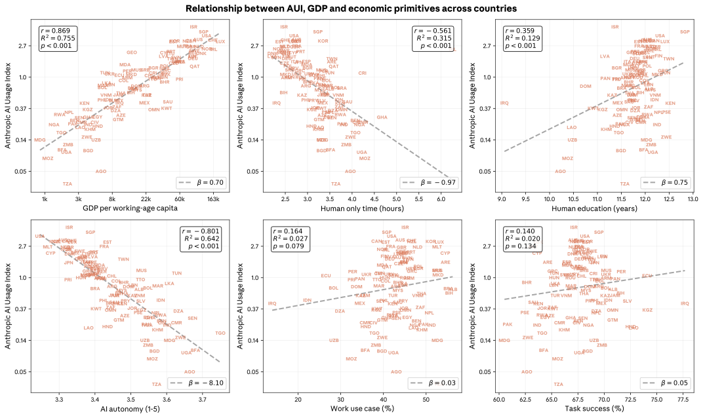

> Figure 3.3: Relationship between the Anthropic AI Usage Index and five core economic primitives and GDP per capita at the country level.

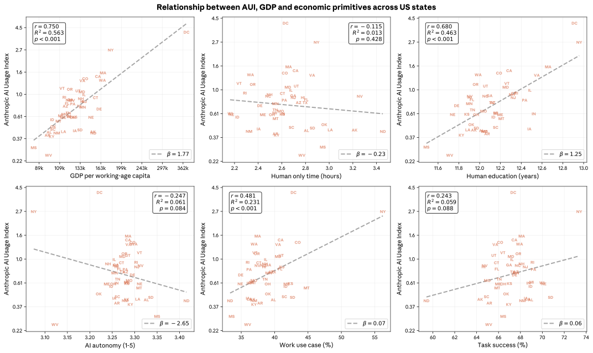

> Figure 3.4: Relationship between the Anthropic AI Usage Index and five core economic primitives and GDP per capita at the US state level.

然而，AUI 与基元的关系在国家与州层面常常不同。例如，国家层面，AUI 与"无 AI 时人类完成任务所需时间"及"赋予 AI 的决策自主度"负相关；美国州层面这些关系不具统计显著性——可能也因为州的样本量更小。此外，我们观察到 AUI 与 Claude.ai 工作用途在美国州层面正相关，在国家层面则不然。

重要的是，基元本身未必是因果因素——我们不知道收入或教育是否真正驱动采用，还是它们是其他底层条件的代理变量。许多因素彼此高度相关。例如，美国州层面，人类教育年数单独看与 AUI 有强关联，但控制 GDP 与其他基元后这种关系消失——提示教育可能捕捉的是由经济发展与其他因素解释的变异。

### 制度性因素塑造任务成功与教育年数的关系（Institutional factors shape the relationship between task success and education years）

Economic and institutional context—such as how education levels vary within a geography—are related to how AI is being used. Interestingly, we observe that task success is negatively associated with human education at the country level, but positively related at the US state level. However, the positive relationship at the state level becomes insignificant when controlling for other primitives (see Figure 3.5). This means the relationship pattern at one level of observation (country) contradicts the relationship pattern at another level (US state). Cross-country, educated populations may attempt harder tasks and therefore see lower success rates. Within homogeneous contexts, education may not improve task success.

经济与制度情境——如教育水平在一个地理区域内的差异——与 AI 的使用方式相关。有趣的是，我们观察到任务成功在国家层面与人类教育负相关，在美国州层面正相关。但控制其他基元后，州层面的正相关变得不显著（见图 3.5）。这意味着一个观察层面（国家）的关系模式与另一层面（州）相互矛盾。跨国看，受过教育的群体可能尝试更难的任务，因而成功率更低；在同质情境内，教育未必提升任务成功。

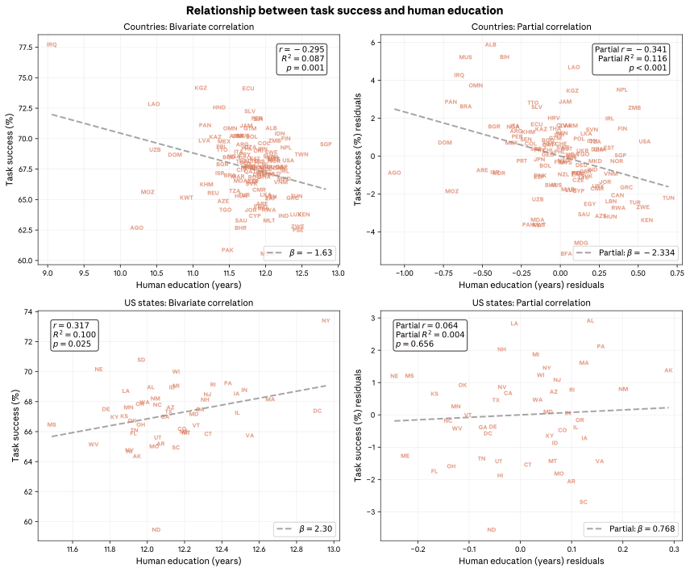

> Figure 3.5: Relationship between task success and human education.

### 人如何提示，AI 便如何回应（How humans prompt is how Claude responds）

We find a very high correlation between human and AI education, i.e. the number of years of education required to understand a human prompt or the AI's response (countries: r = 0.925, p < 0.001, N = 117; US states: r = 0.928, p < 0.001, N = 50). This highlights the importance of skills and suggests that how humans prompt the AI determines how effective it can be. This also highlights the importance of model design and training. While Claude is able to respond in a highly sophisticated manner, it tends to do so only when users input sophisticated prompts.

我们发现人类与 AI 教育之间相关性极高——即理解人类提示或 AI 回应所需的教育年数（国家：r = 0.925，p < 0.001，N = 117；美国州：r = 0.928，p < 0.001，N = 50）。这凸显了技能的重要性，并提示：人类如何提示 AI，决定了它能发挥多大效力。这也凸显了模型设计与训练的重要性。虽然 Claude 能够以高度复杂的方式回应，但它往往只在用户输入复杂提示时才如此。

How models are trained, fine-tuned and instructed affects how they respond to users. For example, one AI model could have a system prompt that instructs it to always use simple language that a middle school student could understand, whereas another AI model may only respond in complex language that would require a PhD education to understand. For Claude, we observe a more dynamic pattern where how the user prompts Claude relates to how Claude responds.

模型的训练、微调与指令方式影响它们对用户的回应。例如，一个 AI 模型的系统提示可能要求它始终使用中学生能理解的简单语言，而另一个模型可能只用需要博士教育才能理解的复杂语言。对 Claude，我们观察到更动态的模式：用户如何提示 Claude，与 Claude 如何回应相关。

### 更高收入与更高使用伴随更多增强（Higher income and higher usage are related to more augmentation）

Higher per capita usage countries, which tend to be higher per capita income countries, show lower automation, and less decision-making autonomy delegated to Claude. That is, higher income countries use AI more as an assistant and collaborator rather than letting it work independently. This relationship is not significant at the US state level, perhaps because income variation and use case diversity are more limited within the United States than globally. This mirrors a finding from our 3rd Economic Index report where countries with higher Anthropic AI Usage Index tend to use Claude in a more collaborative manner (augmentation), rather than letting it operate independently (automation).

人均使用更高的国家（往往也是人均收入更高的国家），自动化更低、委托给 Claude 的决策自主权更少。也就是说，高收入国家更多地把 AI 当助手与协作者，而不让它独立工作。这一关系在美国州层面不显著，也许因为美国内部的收入差异与用例多样性比全球范围内更有限。这与我们第三份经济指数报告的发现相映：Anthropic AI 使用指数更高的国家，往往以更协作的方式（增强）使用 Claude，而非让它独立运作（自动化）。

### 结论（Conclusion）

The striking geographic variation in our data shows that Claude is used in different ways around the world. GDP predicts the Anthropic AI Usage Index at both the country and US state level, and human education—the sophistication of user prompts—correlates with adoption at both levels as well.

数据中显著的地理差异表明，Claude 在世界各地被以不同方式使用。GDP 在国家与美国州两个层面都预测 AUI；人类教育——用户提示的复杂程度——也在两个层面与采用相关。

Other relationships depend on context. At the country level, higher usage correlates with shorter tasks and less AI autonomy; within the US, these patterns do not hold. Task success and human education show opposite relationships globally versus within the US.

其他关系则取决于情境。国家层面，更高使用与更短任务、更少 AI 自主性相关；美国州内这些模式不成立。任务成功与人类教育的关系在全球与州内正好相反。

The near-perfect correlation between human and AI education years underscores that how users prompt Claude shapes how it responds. Combined with the finding that higher-usage countries engage Claude more collaboratively, this suggests that the skills required to use AI well may themselves be unevenly distributed.

人类与 AI 教育年数的近完全相关强调：用户如何提示 Claude，塑造了它如何回应。结合"使用更高的国家更协作地使用 Claude"这一发现，这意味着"用好 AI 所需的技能"本身可能就分布不均。

By measuring the characteristics of conversations with Claude, we find important relationships with broader economic factors such as human capital. These relationships may help predict labor market outcomes and inform a smooth transition to an AI-enabled economy that will require different skillsets.

通过度量与 Claude 对话的特征，我们发现了它们与人力资本等更广泛经济因素的重要关系。这些关系或有助于预测劳动力市场结果，并为平稳过渡到需要不同技能组合的 AI 经济提供依据。

[^11]: For privacy reasons, our automated analysis system filters out any cells—e.g., countries, and (country, task) intersections—with fewer than 15 conversations and 5 unique user accounts. For bottom-up request clusters, we have an even higher privacy filter of at least 500 conversations and 250 unique accounts. / 出于隐私原因，我们的自动分析系统会过滤掉少于 15 条对话且少于 5 个唯一账户的任何单元格（如国家、国家×任务交叉）。对自下而上请求簇，隐私过滤更严：至少 500 条对话与 250 个唯一账户。
[^12]: Data in this section covers 1 million Claude.ai Free, Pro and Max conversations from November 13 to 20, 2025, randomly sampled from all conversations in that period. We then excluded content that was flagged as potential trust and safety violations. The unit of observation is a conversation with Claude on Claude.ai, not a user, so it is possible that multiple conversations from the same user are included, though our past work suggests that sampling conversations at random versus stratified by user does not yield substantively different results. Aggregate geographic statistics at the country and US state level were assessed and tabulated from the IP address of each conversation. For geolocation, we use ISO-3166 codes since our provider for IP geolocation uses this standard. International locations use ISO-3166-1 country codes, US state level data use ISO-3166-2 region codes, which include all 50 US states and Washington DC. We exclude conversations originating from VPN, anycast, or hosting services, as determined by our IP geolocation provider. / 本节数据涵盖 2025 年 11 月 13 日至 20 日从该时段全部对话中随机抽样的 100 万条 Claude.ai Free/Pro/Max 对话，随后剔除被标记为潜在信任与安全违规的内容。观察单位是 Claude.ai 上的一次 Claude 对话而非用户，因此同一用户的多条对话可能都被纳入；不过我们过去的工作表明，随机抽样对话与按用户分层抽样不会产生实质差异。国家与美国州层面的汇总地理统计由每条对话的 IP 地址评估并编表。地理定位使用 ISO-3166 码（我们的 IP 地理定位供应商采用该标准）：国际位置用 ISO-3166-1 国家码，美国州级数据用 ISO-3166-2 区域码（含全部 50 州与华盛顿特区）。按 IP 地理定位供应商的判定，我们剔除源自 VPN、任播或托管服务的对话。
[^13]: The world map is based on Natural Earth's world map with the ISO standard point of view for disputed territories, which means that the map may not contain some disputed territories. We note that in addition to the countries shown in gray ("Claude not available"), we do not operate in the Ukrainian regions Crimea, Donetsk, Kherson, Luhansk, and Zaporizhzhia. In accordance with international sanctions and our commitment to supporting Ukraine's territorial integrity, our services are not available in areas under Russian occupation. / 世界地图基于 Natural Earth 世界地图及争议领土的 ISO 标准视角，可能不包含部分争议领土。除标灰（"Claude 不可用"）的国家外，我们也不在乌克兰的克里米亚、顿涅茨克、赫尔松、卢甘斯克与扎波罗热地区运营。依据国际制裁及我们对支持乌克兰领土完整的承诺，我们的服务在俄占区不可用。
[^14]: "No data" applies to countries with partially missing data. Some territories (e.g., Western Sahara, French Guiana) have their own ISO-3611 code. Some of these have some usage, others have none. Since the Anthropic AI Usage Index is calculated per working-age capita based on working age population data from the World Bank, and population data is not readily available for all of these territories, we cannot calculate the AUI for these territories. / "无数据"适用于数据部分缺失的国家。一些地区（如西撒哈拉、法属圭亚那）有自己的 ISO 代码，其中一些有一定使用量、另一些没有。由于 AUI 按工作年龄人口（世界银行数据）计算人均值，而这些地区的人口数据不易获得，我们无法为其计算 AUI。
[^15]: We exclude the Seychelles from all geographic analyses because a large fraction of usage we saw during the sampling dates was abusive traffic. / 我们在所有地理分析中剔除塞舌尔，因为采样日期间我们观察到的大量使用属于滥用流量。
[^16]: We exclude Wyoming from all US state analyses because a large fraction of usage we saw during the sampling dates was abusive traffic. / 我们在所有美国州分析中剔除怀俄明州，原因同上（采样日期间大量使用为滥用流量）。

## 第四章：任务与生产率（Chapter 4: Tasks and productivity）

In this chapter, we examine how time savings, success rates, and autonomy vary across task types, and what this entails for potential impacts on jobs and productivity.

本章考察时间节省、成功率与自主性如何随任务类型而变，及其对就业与生产率潜在影响的含义。

The patterns reveal that more complex tasks yield greater time savings, but that this trades off against reliability. In a simple task removal exercise inspired by Autor and Thompson (2025), Claude's tendency to cover higher-education tasks produces a net deskilling effect across most occupations, as the tasks AI handles are often the more skilled components of a job.

这些模式揭示：更复杂的任务带来更大的时间节省，但这与可靠性相权衡。在一个受 Autor and Thompson (2025) 启发的简单任务移除练习中，Claude 偏向覆盖高等教育任务，在大多数职业上产生净去技能化效应——AI 处理的往往是工作中技能更高的组成部分。

Claude usage spans a meaningful fraction of tasks across a growing share of occupations. We incorporate success rates into a richer model of job coverage; some occupations with modest coverage see large effects because AI succeeds on their most time-intensive work. Adjusting productivity estimates for task reliability roughly halves the implied gains, from 1.8 to about 1.0 percentage points of annual labor productivity growth over the next decade. However, these estimates reflect current model capabilities, and all signs suggest that reliability over increasingly long-running tasks will improve.

Claude 的使用横跨越来越多职业中相当比例的任务。我们把成功率纳入更丰富的职业覆盖模型；一些覆盖面适中的职业出现大效应，因为 AI 恰在其最耗时的工作上成功。把任务可靠性纳入生产率估计后，隐含收益大约减半：未来十年年劳动生产率增速从 1.8 个百分点降到约 1.0 个百分点。不过这些估计反映的是当前模型能力，所有迹象都表明对日益长程任务的可靠性将会改善。

### 任务加速中的权衡（Tradeoffs in task acceleration）

Our estimates suggest that, in general, the more complex tasks in our data yield a greater time savings (or "speedup") from AI. We derive this by having Claude estimate both how long a task would take a human working alone and the duration when human and AI work together, which we validated in previous work. Speedup is then the human-alone time divided by the human-with-AI time. So reducing a 1 hour task to 10 minutes would give a 6x speedup.

我们的估计表明，总体上数据中越复杂的任务从 AI 获得的时间节省（"加速比"）越大。推导方式：让 Claude 分别估计人类单独工作耗时与人机协作耗时（此前工作中已验证），加速比 = 人类单独耗时 ÷ 人机协作耗时。把 1 小时的任务缩到 10 分钟，即得 6 倍加速。

The left panel of Figure 4.1 below gives the average speedup against our core measure of task complexity, the human years of schooling required to understand the inputs, all at the O*NET task level.[^17] It shows that in Claude.ai conversations, for example, prompts requiring 12 years of schooling (a high school education) enjoy a speedup of 9x, while those requiring 16 years of schooling (a college degree) attain a 12x speedup. This implies that productivity gains are more pronounced for use cases requiring higher human capital, consistent with evidence that white collar workers are far more likely to adopt AI (e.g., Bick et al 2025).

下图 4.1 左图给出平均加速比与我们核心的任务复杂度度量——理解输入所需的人类受教育年数——的关系，全部在 O*NET 任务层面。[^17]它显示：在 Claude.ai 对话中，需要 12 年教育（高中）的提示享有 9 倍加速，需要 16 年教育（大学）的提示达到 12 倍加速。这暗示：对需要更高人力资本的用例，生产率增益更明显——与"白领工人远更可能采用 AI"的证据一致（如 Bick et al 2025）。

Throughout the range of task complexity, the speedup is higher for API users. This could reflect the nature of the API data, which is restricted to single-turn interactions, and that API tasks have been specifically selected for automation.

在整个任务复杂度范围内，API 用户的加速比都更高。这可能反映 API 数据的性质（仅限单轮交互），以及 API 任务是专门为自动化挑选的。

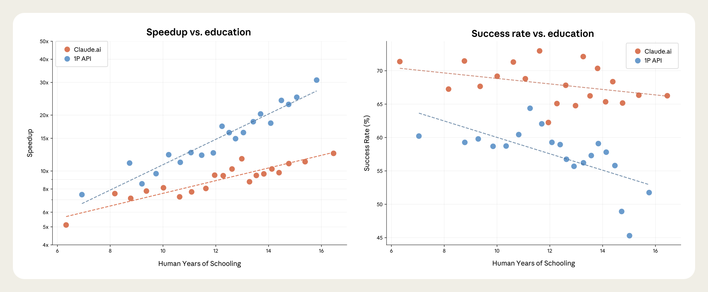

> Figure 4.1: Speed up (panel a) and Success rate (panel b) vs. Human years of schooling.

The results also capture a tradeoff, however. More complex tasks have a lower task success rate, as shown in the panel on the right. On Claude.ai, for example, tasks requiring less than a high school education (e.g., answering basic questions about products) attain a 70% success rate, but this drops to 66% for college-level conversations like developing analysis plans. Still, accounting for the difference in success rates—by either excluding low-success tasks or discounting speedups by success probability—does not eliminate the education gradient: complex tasks still show greater net productivity gains.

但结果也捕捉到一个权衡：更复杂的任务成功率更低（见右图）。在 Claude.ai 上，需要高中以下教育的任务（如回答产品的基本问题）成功率为 70%，而大学水平的对话（如制定分析计划）降到 66%。尽管如此，把成功率差异考虑进来——无论是剔除低成功任务、还是按成功概率折减加速比——都没有消除教育梯度：复杂任务仍显示更大的净生产率增益。

One way to examine the implications of the education gradient is to look at the share of automation across the education levels required to understand the inputs. If high-education tasks show relatively more automation, it could signal more exposure for white collar workers. Here, though, the message is unclear: the automation share is essentially unrelated to the human levels of education required to write the prompt (Appendix Figure A.1)[^18]. On both Claude.ai and 1P API, tasks across education levels show automation patterns in roughly equal shares.

考察教育梯度含义的一个角度，是看"理解输入所需教育水平"各档上的自动化份额。如果高教育任务表现出相对更多的自动化，可能预示白领工人暴露更大。但这里的信号不清晰：自动化份额与"撰写提示所需的人类教育水平"基本无关（附录图 A.1）。[^18]在 Claude.ai 与 1P API 上，各教育水平任务的自动化模式份额大致相当。

In what contexts do users defer more to Claude? Claude.ai users give the AI slightly more autonomy when working on more complex tasks. In contrast, API usage shows uniformly lower autonomy at all levels of complexity.

用户在什么情境下更听 Claude 的？Claude.ai 用户在更复杂的任务上给 AI 略多的自主权。相比之下，API 使用在所有复杂度水平上都表现出一致更低的自主性。

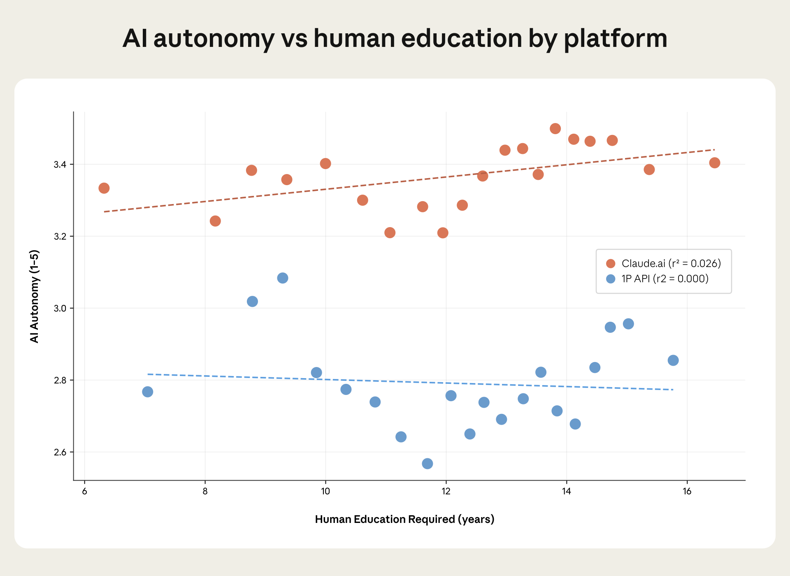

> Figure 4.2: AI autonomy vs. human education.

不过要注意，这些分布并未覆盖同一批任务。API 使用覆盖经济中更窄的一批任务（见第一章的集中度图）。API 数据中重度使用的高教育任务包括安全分析、测试与质量保证、代码审查；而 Claude.ai 用户更可能进行迭代式、指导性的会话。

### 真实使用中的任务视界（Task Horizons in Real-World Usage）

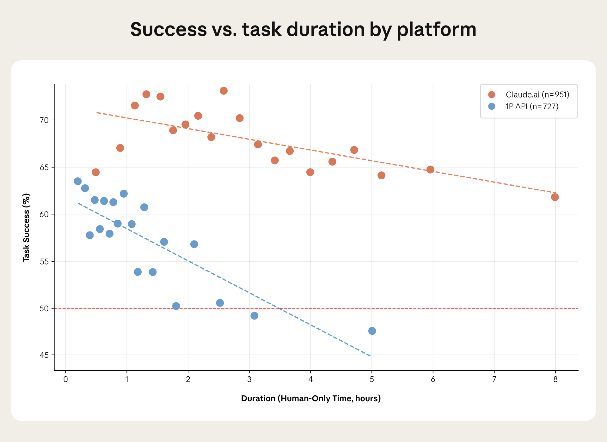

> Figure 4.3: Task success vs. human-only time.

Recent work on AI "task horizons" (Kwa et al., 2025) finds that AI success rates decline with task duration: longer tasks are harder for models to complete. With each successive model generation, however, this decline has become shallower as models succeed on increasingly long tasks. METR operationalizes task horizon primarily as the maximum duration at which a model achieves at least 50% success, and growth in this metric has become a key indicator of AI progress.

关于 AI"任务视界"的近期工作（Kwa et al., 2025）发现：AI 成功率随任务时长下降——更长的任务对模型更难。但随着一代代模型在越来越长的任务上成功，下降的斜率变得更平缓。METR 把任务视界操作化为"模型达到至少 50% 成功率的最长时长"，该指标的增长已成为 AI 进展的关键指标。

Figure 4.3 shows a similar measure using our primitives. The plot shows task-level success rates against the human time required, all at the O*NET task level. In the API data, success rates drop from around 60% for sub-hour tasks to roughly 45% for tasks estimated to take humans 5+ hours. The fitted line crosses the horizontal 50% success line at 3.5 hours, suggesting that API calls attain a 50% success rate for tasks that are 3.5 hours. The analogous time estimate in METR's software engineering benchmark is 2 hours for Sonnet 4.5 and about 5 hours for Opus 4.5. (The data in this report predates the release of Opus 4.5.)

图 4.3 用我们的基元展示了类似的度量：任务级成功率对人类所需时间，全部在 O*NET 任务层面。API 数据中，成功率从不足 1 小时任务的约 60% 降到估计需人类 5 小时以上任务的约 45%。拟合线在 3.5 小时处穿过 50% 成功率水平线，说明 API 调用对 3.5 小时的任务达到 50% 成功率。METR 软件工程基准的对应时间估计为：Sonnet 4.5 约 2 小时，Opus 4.5 约 5 小时（本报告数据早于 Opus 4.5 发布）。

Claude.ai data tells a different story. Success rates decline far slower as a function of task length. Extrapolating using the linear fit, Claude.ai would hit a 50% success rate at about 19 hours. This may reflect how multi-turn conversation effectively breaks complex tasks into smaller steps, with each turn providing a feedback loop that allows users to correct course.

Claude.ai 的数据讲了另一个故事：成功率随任务长度的下降缓慢得多。按线性拟合外推，Claude.ai 要到约 19 小时才会降到 50% 成功率。这可能反映了多轮对话如何把复杂任务有效分解成更小的步骤——每一轮都提供让用户纠偏的反馈回路。

It's worth noting that a fundamental difference from the METR setting is selection. METR constructs a benchmark where a fixed set of tasks is assigned to models. In our data, users choose which tasks to bring to Claude. This means observed success rates reflect not just model capability but also user judgment about what will work, the cost of setting up the problem for Claude, and the expected time savings if the task succeeds.

值得注意的是，与 METR 设定的一个根本差异是选择效应。METR 构造的是"把固定任务集分配给模型"的基准；而在我们的数据中，由用户选择把哪些任务交给 Claude。这意味着观察到的成功率不仅反映模型能力，还反映用户对"什么会奏效"的判断、为 Claude 设置问题的成本、以及任务成功时的预期时间节省。

If users avoid tasks they expect to fail, for example, observed success rates will overstate true capability on the full distribution of potential tasks. This selection likely operates on both platforms, but in different ways: API customers select for tasks amenable to automation, while Claude.ai users select for tasks that could benefit from iteration. Also due to this selection effect, there's no guarantee that more performant models would show improvement in this plot, because users may respond to new models by providing more challenging presentations of otherwise similar O*NET tasks.

比如，如果用户回避他们预期会失败的任务，观察到的成功率将高估模型在全部潜在任务分布上的真实能力。这种选择在两个平台上都可能存在，但方式不同：API 客户选择适合自动化的任务，Claude.ai 用户选择能受益于迭代的任务。也正因这种选择效应，更强的模型未必在这一图上显示提升——用户可能以更具挑战性的呈现方式，把原本类似的 O*NET 任务交给新模型。

Controlled benchmarks like METR's measure the frontier of autonomous capability. Our real-world data can measure the effective task horizon, reflecting a mix of model capabilities and user behavior, and expanding beyond coding tasks. Both approaches find that AI can be effective for tasks requiring hours of human work.

METR 这类受控基准度量的是自主能力的前沿；我们的真实世界数据可以度量有效任务视界——反映模型能力与用户行为的混合，并扩展到编程任务之外。两种方法都发现：AI 对需要数小时人类工作的任务是有效的。

### 用有效 AI 覆盖重新审视职业渗透（Revisiting occupation penetration with effective AI coverage）

Our earlier work found that 36% of jobs had AI usage for at least a quarter of their tasks, with about 4% reaching 75% task coverage. This measure was based only on the appearance of a task in our data, however. The primitives introduced in this report can help better characterize how AI is changing the work content of occupations.[^19]

我们早期的工作发现：36% 的职业有至少四分之一任务的 AI 使用记录，约 4% 达到 75% 的任务覆盖。但该度量仅基于任务在我们数据中的出现。本报告引入的基元可以更好地刻画 AI 如何改变职业的工作内容。[^19]

First, we find that task coverage is increasing. Combining across reports, 49% of jobs have seen AI usage for at least a quarter of their tasks. But incorporating that task's share of the job, and Claude's average success rate, suggests a different set of affected occupations.

首先，我们发现任务覆盖在增加。合并各报告，49% 的职业有至少四分之一任务的 AI 使用记录。但把"该任务在职业中的占比"与"Claude 的平均成功率"纳入后，受影响职业的集合就不同了。

We define effective AI coverage as the percent of a worker's day that can be performed successfully by Claude. It's calculated as the weighted sum of task success rates, where each task's weight is its share of the worker's time adjusted by how frequently the task occurs. The success rate comes from our primitives, the hours estimate from our previous work on productivity effects, and the frequency estimate from O*NET data, where surveyed workers indicate how often they perform the task.

我们把有效 AI 覆盖（effective AI coverage）定义为"一天中可由 Claude 成功完成的工时占比"。它计算为任务成功率的加权和：每个任务的权重是其占工人时间的份额、按任务发生频率调整。成功率来自我们的基元，小时估计来自我们此前关于生产率效应的工作，频率估计来自 O*NET 数据（受访工人说明他们执行该任务的频率）。

The plot below shows how the effective AI coverage (y-axis) differs from task coverage alone (x-axis). The two are highly correlated, but with key differences. On the right side of the plot, occupations with high coverage—where almost all tasks appear with some frequency in Claude data—generally fall below the 45-degree line. This suggests that even 90% task coverage does not necessarily indicate large job impacts, since Claude may fail on key covered tasks or miss the most time-intensive ones.

下图显示有效 AI 覆盖（y 轴）与仅任务覆盖（x 轴）的差异。两者高度相关，但有关键差别：图右侧的高覆盖职业——几乎所有任务都以某种频率出现在 Claude 数据中——普遍落在 45 度线以下。这提示：即便 90% 的任务覆盖也不必然意味着巨大的就业冲击，因为 Claude 可能在关键的被覆盖任务上失败，或错过最耗时的任务。

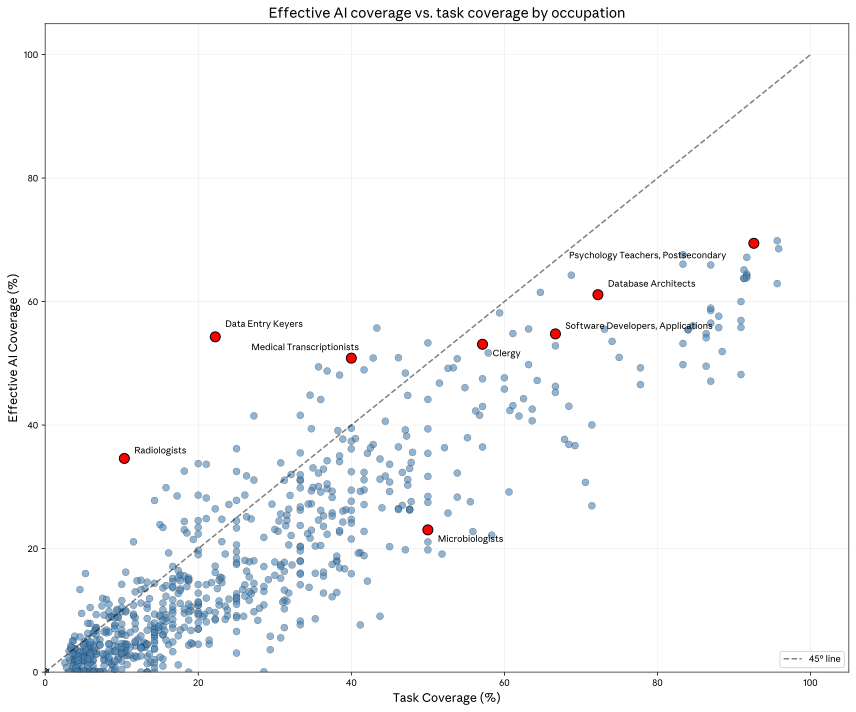

> Figure 4.4: Effective AI coverage vs. Task coverage

放大来看，若干职业的有效 AI 覆盖与任务覆盖差异巨大。例如，数据录入员的有效 AI 覆盖名列前茅：虽然其九项任务只有两项被覆盖，但其最大任务——从源文档读取并录入数据——在 Claude 上成功率很高。AI 擅长的恰是他们最花时间的事。

医疗转录员与放射科医师的排名也上升，因为其被覆盖的任务恰是他们最耗时、最高频的工作。对放射科医师而言，其前两项任务——解读诊断影像与撰写解读报告——成功率都很高。这些职业的任务覆盖率低，是因为 AI 干不了其职业画像中动手或行政的部分，但它在其工作日占主导的核心知识工作上能成功。

微生物学家落在 45 度线以下，说明有效 AI 覆盖低于仅按任务覆盖的预测：Claude 覆盖其一半任务，却不包括最耗时的——使用专门实验设备动手做研究。

这一度量可以说给出了职业级 AI 渗透更现实的图景。但其含义取决于这些 Claude 对话实际在多大程度上替代或增强原本由人类完成的工作。对数据录入员，AI 很可能确实替代了以往手工执行的任务；而当一次 Claude 对话对应教师备课讲课时，它如何转化为授课时间的减少就不那么清楚了。未来的工作里，我们可以利用 1P API 数据了解其中哪些任务正被整合进生产工作流。

### AI 对职业任务内容的影响（AI's impact on the task content of jobs）

Beyond how much of a worker's day AI can successfully perform, a separate question is which tasks get covered, and whether those tend to be the high-skill or low-skill components of the job. Recent research has studied changes in the task mix within jobs to understand AI's impact on wages and employment (Autor and Thompson 2025; Hampole et al 2025). A key insight is that automation's effects depend not just on how many tasks are covered, but on which tasks.

除了 AI 能成功完成工人一天中的多少工作，另一个问题是哪些任务被覆盖，以及它们往往是工作的高技能还是低技能组成部分。近期研究考察职业内部任务组合的变化，以理解 AI 对工资与就业的影响（Autor and Thompson 2025；Hampole et al 2025）。一个关键洞见是：自动化的效应不仅取决于覆盖多少任务，还取决于覆盖哪些任务。

To see how jobs change when we remove the tasks AI can perform, we first construct a measure of the level of skill required for each task. O*NET doesn't provide task-level education requirements, so we train a model that predicts years of schooling from task embeddings, using the BLS's occupation-level education as the target.[^20] This way, a low-education occupation may still have a high-skill task if it looks like those that tend to exist in high-education occupations. For example, Legal Secretaries is a 12-year education occupation, but the task "Review legal publications and perform database searches to identify laws and court decisions relevant to pending cases" is predicted to require 17.7 years because it resembles tasks typically performed by lawyers and paralegals.

为了看清移除 AI 能执行的任务后工作如何变化，我们先构建每项任务所需技能水平的度量。O*NET 不提供任务级教育要求，于是我们训练了一个从任务嵌入预测受教育年数的模型，以 BLS 的职业级教育为目标。[^20]这样，低教育职业也可能有高技能任务——如果它看起来像高教育职业中常见的任务。例如，法律秘书是 12 年教育的职业，但"审阅法律出版物并执行数据库检索，以识别与待决案件相关的法律与法院判决"这一任务被预测需要 17.7 年，因为它类似于律师与律师助理通常执行的任务。

The data shows that Claude tends to cover tasks that require higher levels of education. The mean predicted education for tasks in the economy is 13.2 years. For tasks that we see in our data, the mean prediction is about a year higher, 14.4 years (corresponding to an Associate's degree). This aligns with the occupation-level results from earlier reports, showing more Claude usage among white collar occupations.

数据显示，Claude 倾向于覆盖需要更高教育水平的任务。经济中任务的平均预测教育为 13.2 年；我们数据中任务的平均预测高约一年，为 14.4 年（对应副学士学位）。这与早前报告的职业级结果一致：白领职业中的 Claude 使用更多。

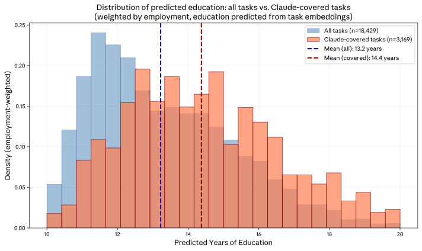

> Figure 4.5: Education level of all tasks vs. Claude-covered tasks

We next calculate how removing AI-covered tasks shifts the average education level of what remains. Overall, the net first-order impact is to deskill jobs, since AI removes tasks that require relatively higher levels of education. One job that experiences such deskilling is technical writers, which loses tasks like "Analyze developments in specific field to determine need for revisions" (18.7 years) and "Review published materials and recommend revisions or changes in scope, format" (16.4 years), leaving tasks like "Draw sketches to illustrate specified materials" (13.6 years) and "Observe production, developmental, and experimental activities" (13.5 years). Travel agents also experience deskilling because AI covers tasks like "Plan, describe, arrange, and sell itinerary tour packages" (13.5 years) and "Compute cost of travel and accommodations" (13.4 years), while tasks like "Print or request transportation carrier tickets" (12.0 years) and "Collect payment for transportation and accommodations" (11.5 years) remain. Several teaching professions experience deskilling because AI addresses tasks like grading, advising students, writing grants, and conducting research without being able to do the hands-on work of delivering lectures in person and managing a classroom.

接下来我们计算移除 AI 覆盖任务后，剩余任务平均教育水平如何移动。总体而言，一阶净效应是工作去技能化：AI 移除的是需要相对更高教育水平的任务。技术写作是经历这种去技能化的职业之一——它失去"分析特定领域进展以确定是否需要修订"（18.7 年）与"审阅已发布材料并就范围与格式建议修订"（16.4 年）等任务，留下"绘制草图以说明指定材料"（13.6 年）与"观察生产、开发与实验活动"（13.5 年）。旅行社代理人也经历去技能化：AI 覆盖"计划、描述、安排并销售行程套餐"（13.5 年）与"计算交通与住宿成本"（13.4 年），而"打印或申请承运人车票"（12.0 年）与"收取交通与住宿费用"（11.5 年）仍在。若干教学职业也经历去技能化：AI 能做批改、辅导学生、写基金申请与开展研究，却做不了当面授课与管理课堂的动手工作。

Some jobs see average education levels increase. Real estate managers experience upskilling because AI covers routine administrative tasks—maintaining sales records (12.8 years), reviewing rents against market rates (12.6 years)—while tasks requiring higher-level professional judgment and in-person interaction remain, like securing loans, negotiating with architecture firms, and meeting with boards.

有些职业的平均教育水平反而上升。物业管理人经历技能升级：AI 覆盖例行行政任务——维护销售记录（12.8 年）、对照市场行情审查租金（12.6 年）——而需要更高层级专业判断与当面互动的任务仍在，如获取贷款、与建筑设计事务所谈判、与董事会会面。

These patterns illustrate how jobs may evolve over the coming years as their task content adjusts in response to AI. If the education level can be interpreted like expertise in Autor and Thompson's analysis, their framework might predict that wages will fall and employment will increase for technical writers and travel agents; conversely, real estate managers will specialize in complex negotiations and stakeholder management, shrinking employment while increasing wages.[^21]

这些模式刻画了未来数年工作如何随任务内容因 AI 而调整而演变。如果教育水平可以像 Autor and Thompson 分析中的专长那样解读，其框架可能预测：技术写作者与旅行社代理人的工资将下降、就业将增加；相反，物业管理人将专注于复杂谈判与利益相关者管理，就业收缩而工资上升。[^21]

However, our education-based measure differs from Autor and Thompson's expertise concept: their framework would label some tasks as high expertise where ours specifies low education—for example, the Electrician task "Connect wires to circuit breakers, transformers, or other components." And these predictions are based on current Claude usage patterns, which will shift as models are trained on new capabilities and users discover new applications—potentially changing which tasks are covered and whether the net effect is deskilling or upskilling.

不过，我们基于教育的度量与 Autor and Thompson 的专长概念不同：他们的框架会把一些任务标为高专长，而我们的度量给出低教育——例如电工任务"把电线连接到断路器、变压器或其他元件"。而且这些预测基于当前 Claude 使用模式，随着模型被训练出新能力、用户发现新应用，它们会变化——可能改变哪些任务被覆盖，以及净效应究竟是去技能化还是技能升级。

### 重新审视 Claude 使用的总量生产率含义（Revisiting the aggregate productivity implications of Claude usage）

In earlier work, we estimated that widespread adoption of AI could increase US labor productivity growth by 1.8 percentage points annually over the next decade. Here we revisit that analysis, incorporating the task success primitive introduced in this report and a richer treatment of task complementarity.

在早期工作中，我们估计 AI 的广泛采用可在未来十年每年提升美国劳动生产率增速 1.8 个百分点。这里我们重新审视该分析，纳入本报告引入的任务成功基元，并对任务互补性做更丰富的处理。

Based on the speedups associated with tasks with at least 200 observations in our sample of 1M Claude.ai conversations,[^22] we replicate our previous finding that current-generation AI models and current usage patterns imply a productivity effect of 1.8 percentage points per year over the next decade.[^23]

基于 100 万条 Claude.ai 对话样本中观测数至少 200 的任务的加速比，[^22]我们复现了先前发现：当代 AI 模型与当前使用模式隐含未来十年每年 1.8 个百分点的生产率效应。[^23]

With the inclusion of 1P API data, we can assess whether implied labor productivity effects differ based on enterprise Claude deployment patterns. Two countervailing forces are at play: API usage is more concentrated in a narrower set of tasks and occupations (particularly coding-related work), which would tend to reduce implied effects; but task-level speedups are higher on average among API tasks, as implied by Figure 4.1. These forces largely offset: the API sample likewise implies a 1.8 percentage point increase in labor productivity over the next decade.

纳入 1P API 数据后，我们可以评估隐含的劳动生产率效应是否随企业 Claude 部署模式而异。两股反向力量在起作用：API 使用更集中于更窄的任务与职业集合（尤其编程相关工作），这会压低隐含效应；但如图 4.1 所示，API 任务的任务级加速比平均更高。两股力量大体相抵：API 样本同样隐含未来十年劳动生产率提升 1.8 个百分点。

A salient critique of this analysis is that it fails to account for model reliability. If workers must validate AI output, the productivity benefits will be smaller than raw speedups suggest. To assess how quantitatively important this channel might be, we incorporate the task success primitive introduced in this report, multiplying task-level time savings by task-specific success rates before aggregating.[^24]

对这一分析的一个显要批评是它没有考虑模型可靠性。如果工人必须验证 AI 输出，生产率收益将小于原始加速比所暗示的。为评估该渠道在数量上可能多重要，我们纳入本报告引入的任务成功基元：在汇总之前，把任务级时间节省乘以任务特定成功率。[^24]

This adjustment has a meaningful effect: implied productivity growth falls from 1.8 to 1.2 percentage points per year for the next decade based on Claude.ai usage, and to 1.0 percentage points for API traffic. Yet, even after accounting for reliability, the implied impact remains economically significant—a sustained increase of 1.0 percentage point per year for the next ten years would return US productivity growth to rates that prevailed in the late 1990s and early 2000s. A second critique concerns task complementarity. If some tasks are essential and cannot easily be substituted, then overall productivity effects will be constrained regardless of speedups on other tasks. Teachers may prepare lesson plans more efficiently with AI while having no impact on time spent with students in the classroom.

这一调整影响可观：基于 Claude.ai 使用，隐含的未来十年年生产率增速从 1.8 降到 1.2 个百分点；API 流量为 1.0 个百分点。然而即便计入可靠性，隐含影响仍在经济上显著——未来十年每年持续 1.0 个百分点的提升，将使美国生产率增速回到 1990 年代末与 2000 年代初的水平。第二个批评关乎任务互补性：如果某些任务必不可少且难以替代，那么无论其他任务加速多少，整体生产率效应都会受限。教师也许用 AI 更高效地备课，但课堂里与学生相处的时间不受影响。

To operationalize this idea, we impose some structure on how we aggregate task-level time savings within occupations but otherwise add up occupational efficiency gains as in the main analysis. Specifically, we suppose that within each occupation tasks are combined according to a Constant Elasticity of Substitution (CES) aggregator, where each task is weighted by the estimated time spent on each task as calculated in our earlier analysis of the productivity effects implied by Claude usage.[^25]

为把这一想法操作化，我们对"如何在职业内部汇总任务级时间节省"施加一定结构，其余则如主分析那样加总各职业的效率收益。具体而言，我们假设每个职业内部的任务按不变替代弹性（CES）聚合器组合，每个任务的权重取自我们此前关于 Claude 使用隐含生产率效应的分析所估算的任务耗时。[^25]

The key parameter is the elasticity of substitution across tasks, σ. When the elasticity of substitution is less than one, tasks are complements and those tasks that are not sped up by AI become bottlenecks for broader productivity gains. Alternatively, when the elasticity of substitution is greater than one, then workers can allocate toward the more productive tasks—thereby amplifying the overall time savings at the occupational level. An elasticity of substitution equal to one is a special case that replicates the main analysis above.

关键参数是任务间的替代弹性 σ。当替代弹性小于 1，任务互为互补，那些未被 AI 加速的任务成为更大生产率收益的瓶颈；当替代弹性大于 1，工人可以配置到更高产的任务——从而在职业层面放大总体时间节省。替代弹性等于 1 是一个特例，复现上述主分析。

Figure 4.6 reports the results of this exercise for different values of task substitutability. As expected, when the elasticity of substitution is equal to one the implied productivity effect is the same as in our baseline analysis: An increase in labor productivity growth of ~1.8 percentage points per year over the next decade implied by both Claude.ai and API samples.

图 4.6 报告了不同任务可替代性取值下该练习的结果。如预期，替代弹性等于 1 时，隐含生产率效应与基准分析相同：Claude.ai 与 API 样本都隐含未来十年年劳动生产率增速提升约 1.8 个百分点。

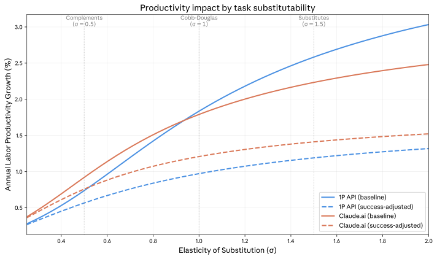

> Figure 4.6 Implied labor productivity effect from AI as a function of within-occupation task substitutability

但当任务互为互补时，隐含的总量劳动生产率影响急剧下降——经济效应被 AI 加速最少的任务卡住脖子。例如 σ=0.5 时，隐含的总体劳动生产率效应为每年 0.7–0.9 个百分点——约为基准估计的一半。再加上任务成功的调整，隐含生产率效应进一步降到 Claude.ai 0.8 个百分点、API 0.6 个百分点。

反过来，当替代弹性大于 1，基于 Opus 4.5 之前使用模式的隐含劳动生产率明显更高。例如 σ=1.5 时，隐含劳动生产率效应升至每年 2.2–2.6 个百分点——与在 AI 提供最大加速的任务上更大程度的专门化相一致。

两种情形下，基于 API 流量的隐含生产率影响对任务可替代性程度都更敏感。这与"API 流量集中于更少任务与相关职业的份额更大"相一致：任务互补时，这种集中放大瓶颈问题；任务可替代时，它放大来自任务专门化的生产率收益。

这一分析表明：自动化的生产率效应最终可能受制于暂时躲过 AI 自动化的瓶颈任务。能力日增的 AI 对劳动力市场的含义，也可能受同样力量的影响。例如，Gans and Goldfarb (2026) 论证：工作中瓶颈任务的存在，意味着部分 AI 自动化反而可能导致劳动收入上升，因为这类任务的经济价值增加（至少在职业被完全自动化之前如此）。

### 结论（Conclusion）

The upshot of this chapter is that the impact of AI on the economy is unlikely to be uniform. As our effective AI coverage framework illustrates, the labor market implications for different workers will hinge on how reliable frontier AI tools are for their most central tasks.

本章的要点是：AI 对经济的影响不太可能是均匀的。正如我们的有效 AI 覆盖框架所示，对不同工人的劳动力市场影响，将取决于前沿 AI 工具对其最核心任务有多可靠。

But the labor market effects may also depend on the skill requirements of tasks that AI can proficiently handle relative to the rest of the economy. Indeed, we find that removing tasks Claude can already handle from the economy would produce a net deskilling effect: the tasks remaining for humans have lower educational requirements than those handled by AI.

但劳动力市场效应还可能取决于：AI 能熟练处理的任务，相对经济中其余任务的技能要求如何。事实上，我们发现：把 Claude 已能处理的任务从经济中移除，将产生净去技能化效应——留给人类的任务教育要求低于 AI 处理的那些。

While highly suggestive, this may miss an important detail: the most complex tasks where Claude is used tend also to be those where it struggles most. Rather than displacing highly skilled professionals, this could instead reinforce the value of their complementary expertise in understanding AI's work and assessing its quality.

尽管极具启发，这可能漏掉一个重要细节：Claude 被用于最复杂任务的地方，往往也是它最挣扎的地方。这可能不是取代高技能专业人士，反而强化其互补专长的价值——理解 AI 的工作、评估其质量。

The counterpart to these transformative labor market effects is the broader impact on growth and productivity. On the one hand, incorporating task reliability into our analysis diminishes the implied effect on labor productivity growth as informed by current Claude usage patterns. If bottleneck tasks bind, the implied impact diminishes further. On the other hand, the continuing growth in model capabilities suggests that both task coverage and task success may increase, which, in turn, could increase productivity impacts.

与这些变革性劳动力市场效应相对应的，是对增长与生产率的更广泛影响。一方面，把任务可靠性纳入分析，削弱了以当前 Claude 使用模式为依据的隐含劳动生产率增速效应；若瓶颈任务真正绑定，隐含影响还会进一步削弱。另一方面，模型能力的持续增长表明任务覆盖与任务成功都可能上升，进而可能放大生产率影响。

[^17]: When we study the correlation between primitives with the O*NET, we restrict to tasks appearing in at least 100 conversations to reduce measurement error. In the coverage analysis, we use all tasks above the privacy threshold of 15. / 研究基元与 O*NET 的相关性时，我们只取至少出现在 100 条对话中的任务以降低测量误差；覆盖分析中则使用所有高于 15 条隐私阈值以上的任务。
[^18]: Our online appendix is available at https://huggingface.co/datasets/Anthropic/EconomicIndex. / 在线附录见 https://huggingface.co/datasets/Anthropic/EconomicIndex 。
[^19]: See also Tomlinson et al (2025) for a related AI applicability score. / 另见 Tomlinson et al (2025) 的相关 AI 适用性得分。
[^20]: We generate embeddings for each task statement using a pretrained sentence transformer (all-mpnet-base-v2) and predict education with Ridge regression. / 我们用预训练句向量模型（all-mpnet-base-v2）为每条任务陈述生成嵌入，并用岭回归预测教育年数。
[^21]: On the other hand, some historical evidence suggests that when technologies automating job tasks appear in patent data, employment and wages subsequently fall for exposed occupations (Webb 2020). / 另一方面，一些历史证据表明：当自动化工作任务的技术出现在专利数据中后，暴露职业的就业与工资随后下降（Webb 2020）。
[^22]: When we first assessed the aggregate productivity implications of Claude usage, we relied on a sample of 100k Claude.ai conversations from Fall 2025. Based on the set of tasks for which we observed speedups, we estimated that labor productivity could be 1.8 percentage points higher per year over the next decade. Expanding the sample to 1M observations means that we need to take a stand on how to handle very infrequently occurring tasks—which are very common given that usage follows a power law, as we documented in our past report. We choose a threshold of 0.02% because it replicates our previous results for our sample of Claude.ai conversations. For privacy-preserving reasons, we only ever analyze tasks with at least 15 observations, or an implied threshold of 0.015% for a 100k sample. And so our results are internally consistent across samples. If we do not impose a restriction on our 1M sample and assume that efficiency gains for any task in our sample, even those with just 15 observations out of one million, the implied aggregate labor productivity growth over the next decade would be roughly 5% percentage points per year—a mechanical increase based on a the much larger set of tasks included. / 我们最初评估 Claude 使用的总量生产率含义时，用的是 2025 年秋 10 万条 Claude.ai 对话样本。基于观察到加速比的任务集，我们估计未来十年劳动生产率每年可能提高 1.8 个百分点。把样本扩到 100 万条意味着必须决定如何处理出现极少的任务——鉴于使用遵循幂律（如我们过去报告所记），这类任务非常普遍。我们选 0.02% 的阈值，因为它能在我们的 Claude.ai 样本上复现先前结果。出于隐私保护原因，我们只分析至少 15 条观测的任务（对 10 万样本相当于 0.015% 的隐含阈值），因此结果在样本间内部一致。如果不对 100 万样本施加限制、假设样本中任何任务（哪怕百万分之一中只有 15 条观测）都有效率收益，隐含的未来十年总量劳动生产率增速约为每年 5 个百分点——这是由纳入的任务集大得多所致的机械性抬升。
[^23]: As before, this result is based on applying Hulten's Theorem to task-level productivity shocks and assuming that the corresponding one-time increase in total factor productivity materializes over the course of a decade alongside capital deepening effects. / 与之前一样，该结果基于把 Hulten 定理应用于任务级生产率冲击，并假设相应的全要素生产率一次性提升在十年内与资本深化效应一同实现。
[^24]: As a reminder, for aggregating to implied labor productivity we calculate task-level efficiency gains as the log difference between human time without AI and with AI. There are certainly other ways to adjust based on task reliability. If tasks in our sample are composed of sub-tasks with heterogeneous AI applicability, and workers optimally deploy AI only on sub-tasks where it is effective, then scaling the efficiency gain by the success rate captures the extensive margin of AI adoption within a task. / 提示一下：汇总为隐含劳动生产率时，我们把任务级效率收益计算为"无 AI 人类耗时"与"有 AI 耗时"的对数差。基于任务可靠性的调整当然还有别的方式。如果我们样本中的任务由 AI 适用性异质的子任务构成、工人只在 AI 有效的子任务上最优部署 AI，那么用成功率缩放效率收益捕捉的是任务内部 AI 采用的广延边际。
[^25]: We use a CES (constant elasticity of substitution) production function to aggregate task-level time savings to economy-wide productivity impacts. The elasticity parameter σ governs how easily workers can substitute between tasks. When σ=1, we apply Hulten's theorem directly: the aggregate productivity gain equals the wage-share-weighted sum of log speedups across tasks. For σ≠1, we use a two-level aggregation: first, within each occupation, we compute an occupation-level speedup as a CES aggregate of task speedups weighted by time fractions, using ρ=(σ-1)/σ. Then we apply Hulten's theorem to these occupation-level speedups. When σ<1 (complements), productivity gains are bottlenecked by tasks with the smallest speedups. When σ>1 (substitutes), workers can specialize in tasks where AI provides the largest speedups, amplifying aggregate gains. For tasks without observed AI speedup data, we assume no productivity change. We thank Pascual Restrepo for suggesting this particular exercise. / 我们用 CES（不变替代弹性）生产函数把任务级时间节省汇总为全经济生产率影响。弹性参数 σ 决定工人在任务间替代的难易。σ=1 时直接应用 Hulten 定理：总量生产率收益等于跨任务对数加速比按工资份额加权的和。σ≠1 时采用两层汇总：先在每个职业内，以时间份额加权的任务加速比按 CES（ρ=(σ-1)/σ）聚合出职业级加速比；再对职业级加速比应用 Hulten 定理。σ<1（互补）时，生产率收益被加速比最小的任务卡住；σ>1（替代）时，工人可专门化于 AI 加速最大的任务，放大总量收益。对没有观测到 AI 加速数据的任务，我们假设生产率不变。感谢 Pascual Restrepo 建议这一练习。

## 结语（Concluding Remarks）

This fourth Anthropic Economic Index Report introduces economic primitives—foundational characteristics of AI use—that show how Claude is used by both consumers and firms. We use Claude to estimate the extent to which usage varies along these dimensions; these measures are directionally accurate and, taken together, provide important signals even if individual classifications are imperfect.

第四份 Anthropic 经济指数报告引入了经济基元——AI 使用的基础特征——展示消费者与企业如何使用 Claude。我们用 Claude 估计使用沿这些维度的变化程度；这些度量在方向上准确，合在一起即便单个分类并不完美，也能提供重要信号。

Our findings carry significant implications for how AI will reshape economies and labor markets. Notably, Claude tends to be used more, and appears to provide greater productivity boosts, on tasks that require higher education. If these tasks shrink for US workers, the net effect could be to deskill jobs. But these impacts depend crucially on complementarity across tasks, and whether increased productivity at a certain task may increase the demand for it.

我们的发现对 AI 将如何重塑经济与劳动力市场具有重要含义。值得注意的是，Claude 往往在需要更高教育的任务上被使用更多、并似乎提供更大的生产率提升。如果这些任务在美国工人的工作中萎缩，净效应可能是工作去技能化。但这些影响关键取决于任务间的互补性，以及某任务生产率的提升是否可能增加对它的需求。

At the global level, the strong relationship between per capita income and usage patterns—with higher-income nations using Claude collaboratively while lower-income countries focus on coursework and specific applications—suggests that AI's impact will be mediated by existing institutional structures rather than unfolding uniformly. Geographic diffusion patterns reinforce this picture. Within the US, per capita usage has converged slightly; globally, diffusion is slower. Combined with income-driven differences in how AI is used, this raises questions about whether AI will narrow or widen international economic gaps.

在全球层面，人均收入与使用模式之间的强关系——高收入国家协作地使用 Claude，低收入国家聚焦课业与特定应用——提示：AI 的影响将由既有制度结构所中介，而非均匀展开。地理扩散模式强化了这一图景：美国内部人均使用略有趋同，全球则扩散更慢。结合收入驱动的 AI 使用方式差异，这引出"AI 将收窄还是扩大国际经济差距"的问题。

Equally important to the patterns documented here are potential changes across this and subsequent reports. As AI capabilities advance, Claude's success rate may increase, usage patterns may show greater autonomy, users may tackle new and more complex tasks, and tasks that prove automatable may graduate from interactive chat to API deployment. We will track these dynamics over time, providing a longitudinal view of AI's role in the economy.

与本文记录的模式同等重要的，是本期与后续报告之间可能的变化。随着 AI 能力进步，Claude 的成功率可能上升，使用模式可能显示更大自主性，用户可能着手更新更复杂的任务，而被证明可自动化的任务可能从交互式聊天"毕业"到 API 部署。我们将随时间追踪这些动态，提供 AI 在经济中角色的纵览。

Building on prior releases, this edition significantly expands both the scope and transparency of usage data we share, including task-level classifications along new dimensions and regional breakdowns globally for the first time. We publish this data to enable researchers, journalists, and the public to investigate novel questions about AI's economic impacts that can form the empirical foundation for policy responses.

在以往发布的基础上，本期显著扩展了所共享使用数据的范围与透明度，包括沿新维度的任务级分类、以及首次提供的全球区域分解。我们发布这些数据，是为了让研究者、记者与公众能够探究 AI 经济影响的新问题，为政策应对奠定实证基础。

How willing users are to experiment with AI, and whether policymakers create a regulatory context that advances both safety and innovation, will shape how AI transforms economies. For AI to benefit users globally, expanding access alone will not suffice—developing the human capital that enables effective use, particularly in lower-income economies, is essential.

用户在多大程度上愿意试验 AI，以及政策制定者能否营造兼顾安全与创新的监管环境，将塑造 AI 如何改变经济。要让 AI 造福全球用户，仅扩大访问并不够——发展使有效使用成为可能的人力资本（尤其在低收入经济体）至关重要。

## 作者与致谢（Authors & Acknowledgements）

**First Author Block**\*：Ruth Appel, Maxim Massenkoff, Peter McCrory

\*报告主要作者（*Lead authors of the report*）

**Second Author Block**：Miles McCain, Ryan Heller, Tyler Neylon, Alex Tamkin

**Acknowledgements**：Xabi Azagirre, Tim Belonax, Keir Bradwell, Andy Braden, Dexter Callender III, Sylvie Carr, Miriam Chaum, Ronan Davy, Evan Frondorf, Deep Ganguli, Kunal Handa, Andrew Ho, Rebecca Jacobs, Owen Kaye-Kauderer, Bianca Lindner, Kelly Loftus, James Ma, Jennifer Martinez, Jared Mueller, Kelsey Nanan, Kim O'Rourke, Dianne Penn, Sarah Pollack, Ankur Rathi, Zoe Richards, Alexandra Sanderford, David Saunders, Michael Sellitto, Thariq Shihipar, Michael Stern, Kim Withee, Mengyi Xu, Tony Zeng, Xiuruo Zhang, Shuyi Zheng, Emily Pastewka, Angeli Jain, Sarah Heck, Jared Kaplan, Jack Clark, Dario Amodei

## 引用（Citation）

```
@online{anthropic2026aeiv4,
        author = {Ruth Appel and Maxim Massenkoff and Peter McCrory and Miles McCain and Ryan Heller and Tyler Neylon and Alex Tamkin},
        title = {Anthropic Economic Index report: economic primitives},
        date = {2026-01-15},
        year = {2026},
        url = {https://www.anthropic.com/research/anthropic-economic-index-january-2026-report},
}
```
