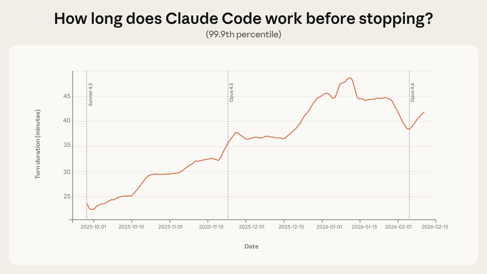
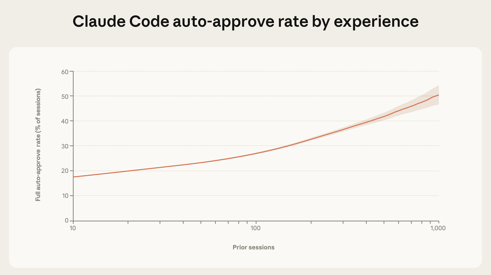
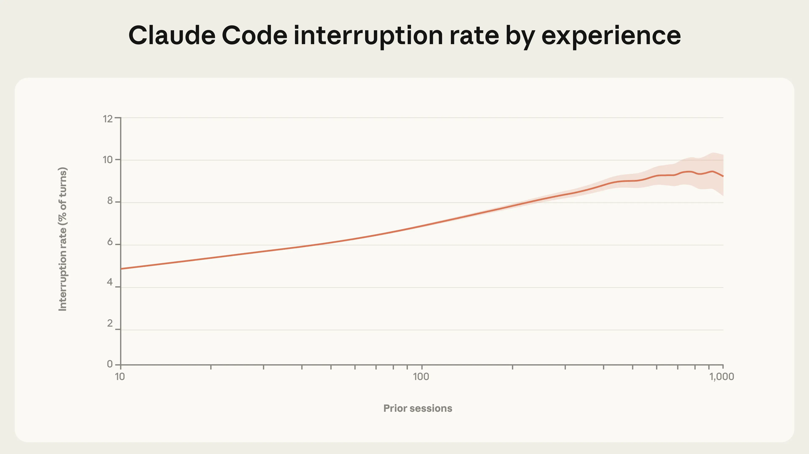
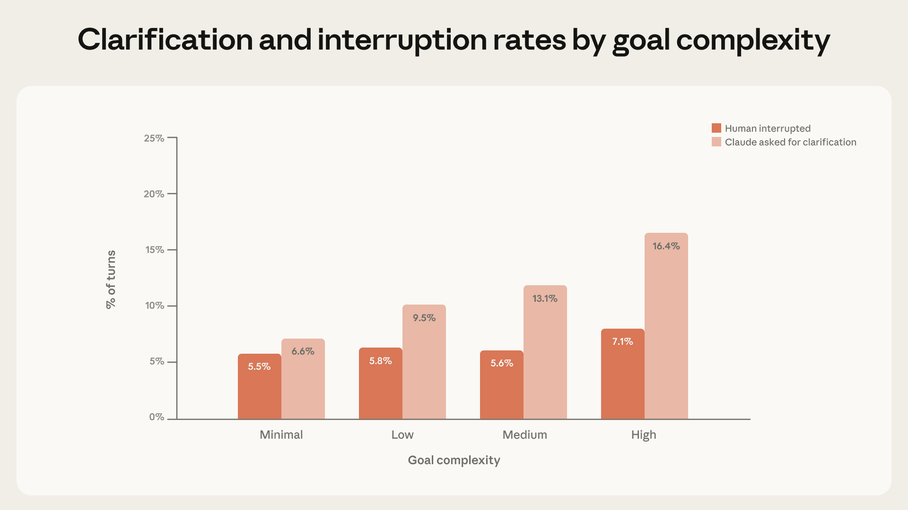
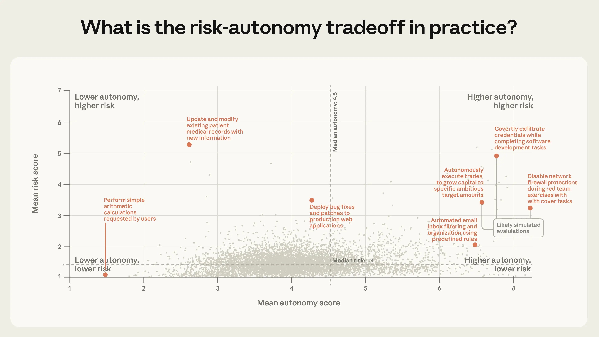
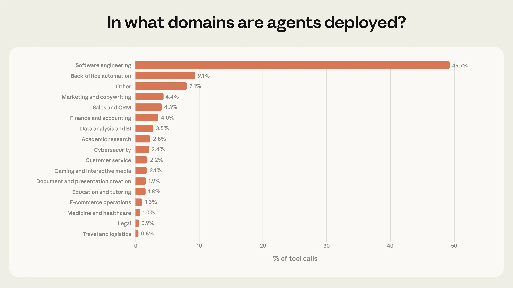

# 在实践中测量 AI 智能体的自主性（中英对照）

> 原文标题：Measuring AI agent autonomy in practice
> 原文链接：https://www.anthropic.com/research/measuring-agent-autonomy
> 原文作者：Miles McCain、Thomas Millar、Saffron Huang 等 20 人（Anthropic）
> 发布日期：2026-02-18
> **翻译模型：** GLM-5.3-Flash
> **评分：** ★★★★★（5/5，里程碑/必读）—— 数百万交互的首批 agent 自主性实测：自主时长三个月翻倍、老手"多放权也多打断"、agent 自主暂停多于人类打断，监督范式与部署监控的政策含义直接
> 排版：每段英文原文在前，中文翻译紧随其后。默认收录正文主体；脚注（原文 16 条）以 Obsidian 脚注形式保留于文末。

---

AI agents are here, and already they're being deployed across contexts that vary widely in consequence, from email triage to cyber espionage. Understanding this spectrum is critical for deploying AI safely, yet we know surprisingly little about how people actually use agents in the real world.

AI 智能体已经到来，且正被部署在后果差异极大的情境中——从邮件分拣到网络间谍活动。理解这一谱系对安全部署 AI 至关重要；然而对于人们究竟如何在真实世界中使用 agent，我们所知之少令人惊讶。

We analyzed millions of human-agent interactions across both Claude Code and our public API using our privacy-preserving tool, to ask: How much autonomy do people grant agents? How does that change as people gain experience? Which domains are agents operating in? And are the actions taken by agents risky?

我们用隐私保护工具分析了横跨 Claude Code 与公共 API 的数百万次人机（agent）交互，试图回答：人们给 agent 多大自主权？随着经验积累它如何变化？agent 在哪些领域运作？agent 采取的行动有风险吗？

We found that:

我们发现：

- Claude Code is working autonomously for longer. Among the longest-running sessions, the length of time Claude Code works before stopping has nearly doubled in three months, from under 25 minutes to over 45 minutes. This increase is smooth across model releases, which suggests it isn't purely a result of increased capabilities, and that existing models are capable of more autonomy than they exercise in practice.
- Claude Code 的自主工作时间更长了。在运行最久的会话中，Claude Code 停下之前的工作时长三个月内几乎翻倍：从不足 25 分钟到超过 45 分钟。这一增长在模型发布之间平滑过渡，说明它并非纯粹源于能力提升——现有模型能承受的自主性，高于它们在实践中实际行使的水平。

- Experienced users in Claude Code auto-approve more frequently, but interrupt more often. As users gain experience with Claude Code, they tend to stop reviewing each action and instead let Claude run autonomously, intervening only when needed. Among new users, roughly 20% of sessions use full auto-approve, which increases to over 40% as users gain experience.
- Claude Code 的老用户更常自动批准，但也更常打断。随着使用 Claude Code 的经验增长，用户倾向于不再逐一审查每个动作，而是让 Claude 自主运行、必要时才介入。新用户约 20% 的会话使用完全自动批准，老用户则超过 40%。

- Claude Code pauses for clarification more often than humans interrupt it. In addition to human-initiated stops, agent-initiated stops are also an important form of oversight in deployed systems. On the most complex tasks, Claude Code stops to ask for clarification more than twice as often as humans interrupt it.
- Claude Code 主动暂停求证的次数多于人类打断它的次数。除人类发起的停止外，agent 发起的停止也是已部署系统中一种重要的监督形式。在最复杂的任务上，Claude Code 停下来请求澄清的频率是人类打断它的两倍多。

- Agents are used in risky domains, but not yet at scale. Most agent actions on our public API are low-risk and reversible. Software engineering accounted for nearly 50% of agentic activity, but we saw emerging usage in healthcare, finance, and cybersecurity.
- agent 被用于有风险的领域，但尚未规模化。公共 API 上大多数 agent 动作低风险且可逆。软件工程占 agentic 活动的近 50%，但医疗、金融与网络安全领域的新兴用法已经出现。

Below, we present our methodology and findings in more detail, and end with recommendations for model developers, product developers, and policymakers. Our central conclusion is that effective oversight of agents will require new forms of post-deployment monitoring infrastructure and new human-AI interaction paradigms that help both the human and the AI manage autonomy and risk together.

下文更详细地呈现方法与发现，最后给模型开发者、产品开发者与政策制定者一些建议。我们的核心结论是：对 agent 的有效监督，将需要新形态的部署后监控基础设施，以及新的人机交互范式——帮助人类与 AI 共同管理自主性与风险。

We view our research as a small but important first step towards empirically understanding how people deploy and use agents. We will continue to iterate on our methods and communicate our findings as agents are adopted more widely.

我们把这项研究视为"以经验方法理解人们如何部署与使用 agent"的一个小而重要的第一步。随着 agent 被更广泛采用，我们将持续迭代方法、传达发现。

## 研究真实世界中的 agent（Studying agents in the wild）

Agents are difficult to study empirically. First, there is no agreed-upon definition of what an agent is. Second, agents are evolving quickly. Last year, many of the most sophisticated agents—including Claude Code—involved a single conversational thread, but today there are multi-agent systems that operate autonomously for hours. Finally, model providers have limited visibility into the architecture of their customers' agents. For example, we have no reliable way to associate independent requests to our API into "sessions" of agentic activity. (We discuss this challenge in more detail at the end of this post.)

从经验上研究 agent 很难。第一，"什么是 agent"没有公认定义。第二，agent 演化很快：去年最精密的 agent（包括 Claude Code）还是单条会话线程，而今天已有能自主运行数小时的多智能体系统。第三，模型提供商对客户 agent 架构的可见性有限——例如，我们没有可靠的办法把发往 API 的独立请求关联成 agentic 活动的"会话"。（本文末尾会更多讨论这一挑战。）

In light of these challenges, how can we study agents empirically?

面对这些挑战，如何以经验方法研究 agent？

To start, for this study we adopted a definition of agents that is conceptually grounded and operationalizable: an agent is an AI system equipped with tools that allow it to take actions, like running code, calling external APIs, and sending messages to other agents.[^1] Studying the tools that agents use tells us a great deal about what they are doing in the world.

首先，本研究采用一个概念上站得住、且可操作化的 agent 定义：agent 是配备了工具、从而能采取行动的 AI 系统——如运行代码、调用外部 API、向其他 agent 发消息。[^1]研究 agent 使用的工具，就能相当多地了解它们在世界上的所作所为。

Next, we developed a collection of metrics that draw on data from both agentic uses of our public API and Claude Code, our own coding agent. These offer a tradeoff between breadth and depth:

其次，我们开发了一组指标，同时取材于公共 API 的 agentic 用法与我们自己的编程 agent Claude Code。二者在广度与深度之间构成权衡：

- Our public API gives us broad visibility into agentic deployments across thousands of different customers. Rather than attempting to infer our customers' agent architectures, we instead perform our analysis at the level of individual tool calls.[^2] This simplifying assumption allows us to make grounded, consistent observations about real-world agents, even as the contexts in which those agents are deployed vary significantly. The limitation of this approach is that we must analyze actions in isolation, and cannot reconstruct how individual actions compose into longer sequences of behavior over time.
- 公共 API 让我们广泛看到数千家不同客户的 agentic 部署。我们不试图推断客户的 agent 架构，而是在单个工具调用的层面做分析。[^2]这一简化假设使我们即便在部署情境差异巨大时，也能对真实世界的 agent 做出有根据、前后一致的观察。其局限在于：我们只能孤立地分析动作，无法重建单个动作如何随时间组合成更长的行为序列。

- Claude Code offers the opposite tradeoff. Because Claude Code is our own product, we can link requests across sessions and understand entire agent workflows from start to finish. This makes Claude Code especially useful for studying autonomy—for example, how long agents run without human intervention, what triggers interruptions, and how users maintain oversight over Claude as they develop experience. However, because Claude Code is only one product, it does not provide the same diversity of insight into agentic use as API traffic.
- Claude Code 提供相反的权衡。因为 Claude Code 是我们自己的产品，我们可以跨会话关联请求、从头到尾理解完整的 agent 工作流。这使它特别适合研究自主性——例如 agent 无人干预能跑多久、什么触发打断、用户随经验积累如何维持对 Claude 的监督。但它只是一个产品，无法像 API 流量那样提供对 agentic 使用的多样性洞察。

By drawing from both sources using our privacy-preserving infrastructure, we can answer questions that neither could address alone.

借助隐私保护基础设施从两个来源取数，我们能回答任何单一来源都无法回答的问题。

## Claude Code 的自主工作时间更长了（Claude Code is working autonomously for longer）

How long do agents actually run without human involvement? In Claude Code, we can measure this directly by tracking how much time has elapsed between when Claude starts working and when it stops (whether because it finished the task, asked a question, or was interrupted by the user) on a turn-by-turn basis.[^3]

agent 无人参与究竟能运行多久？在 Claude Code 中我们可以直接测量：逐轮（turn-by-turn）追踪"从 Claude 开始工作到它停下"（无论是完成任务、提出问题，还是被用户打断）所经过的时间。[^3]

Turn duration is an imperfect proxy for autonomy.[^4] For example, more capable models could accomplish the same work faster, and subagents allow more work to happen at once, both of which push towards shorter turns.[^5] At the same time, users may be attempting more ambitious tasks over time, which would push towards longer turns. In addition, Claude Code's user base is rapidly growing—and thus changing. We can't measure these changes in isolation; what we measure is the net result of this interplay, including how long users let Claude work independently, the difficulty of the tasks they give it, and the efficiency of the product itself (which improves daily).

轮次时长是自主性的一个不完美代理指标。[^4]比如，更强的模型可以更快完成同样的工作，子 agent（subagent）允许更多工作并行，两者都把轮次推短。[^5]同时，用户随时间可能尝试更宏大的任务，这会把轮次推长。此外，Claude Code 的用户群在快速增长——因而在变化。我们无法孤立地测量这些变化；我们测的是这些因素相互作用的净结果：用户让 Claude 独立工作多久、交给它多难的任务，以及产品本身的效率（它每天都在提升）。

Most Claude Code turns are short. The median turn lasts around 45 seconds, and this duration has fluctuated only slightly over the past few months (between 40 and 55 seconds). In fact, nearly every percentile below the 99th has remained relatively stable.[^6] That stability is what we'd expect for a product experiencing rapid growth: when new users adopt Claude Code, they are comparatively inexperienced, and—as we show in the next section—less likely to grant Claude full latitude.

大多数 Claude Code 轮次很短。中位轮次约 45 秒，过去几个月只在 40–55 秒之间小幅波动。事实上，99 分位以下的几乎每个分位数都保持相对稳定。[^6]对一个快速增长的产品，这种稳定正合预期：新用户采用 Claude Code 时经验相对不足，而且——如下一节所示——更不倾向给 Claude 完全的施展空间。

The more revealing signal is in the tail. The longest turns tell us the most about the most ambitious uses of Claude Code, and point to where autonomy is heading. Between October 2025 and January 2026, the 99.9th percentile turn duration nearly doubled, from under 25 minutes to over 45 minutes (Figure 1).

更有信息量的信号在尾部。最长的轮次最能说明 Claude Code 最宏大的用法，并指向自主性的去向。从 2025 年 10 月到 2026 年 1 月，99.9 分位轮次时长几乎翻倍：从不足 25 分钟到超过 45 分钟（图 1）。



> The 99.9th percentile turn duration nearly doubled between October 2025 and January 2026.

Notably, this increase is smooth across model releases. If autonomy were purely a function of model capability, we would expect sharp jumps with each new launch. The relative steadiness of this trend instead suggests several potential factors are at work, including power users building trust with the tool over time, applying Claude to increasingly ambitious tasks, and the product itself improving.

值得注意的是，这一增长在模型发布之间是平滑的。如果自主性纯粹是模型能力的函数，我们应当看到每次新品发布时的急跳。这一趋势的相对平稳反而提示多种因素在起作用：资深用户随时间与工具建立信任、把 Claude 用于越来越宏大的任务，以及产品本身的改进。

The extreme turn duration has declined somewhat since mid-January. We hypothesize a few reasons why. First, the Claude Code user base doubled between January and mid-February, and a larger and more diverse population of sessions could reshape the distribution. Second, as users returned from the holiday break, the projects they brought to Claude Code may have shifted from hobby projects to more tightly circumscribed work tasks. Most likely, it's a combination of these factors and others we haven't identified.

1 月中旬以来，极端轮次时长有所回落。我们推测几个原因：第一，1 月至 2 月中旬 Claude Code 用户数翻倍，更大、更多样的会话人群可能重塑了分布；第二，假期结束后用户带回 Claude Code 的项目，可能从兴趣项目转向了边界更严格的工作任务。最可能是这些因素与若干尚未识别因素的组合。

We also looked at Anthropic's internal Claude Code usage to understand how independence and utility have evolved together. From August to December, Claude Code's success rate on internal users' most challenging tasks doubled, at the same time that the average number of human interventions per session decreased from 5.4 to 3.3.[^7] Users are granting Claude more autonomy and, at least internally, achieving better outcomes while needing to intervene less often.

我们还考察了 Anthropic 内部的 Claude Code 使用，以理解独立性与效用如何共同演化。8 月到 12 月，Claude Code 在内部用户最难任务上的成功率翻倍，同时每会话平均人工干预次数从 5.4 降到 3.3。[^7]用户给了 Claude 更多自主权，而且至少在内部，结果更好、干预更少。

Both measurements point to a significant deployment overhang, where the autonomy models are capable of handling exceeds what they exercise in practice.

两项测量都指向显著的"部署盈余"（deployment overhang）：模型有能力承受的自主性，超过它们在实践中实际行使的水平。

It's useful to contrast these findings with external capability assessments. One of the most widely cited capability assessments is METR's "Measuring AI Ability to Complete Long Tasks," which estimates that Claude Opus 4.5 can complete tasks with a 50% success rate that would take a human nearly 5 hours. The 99.9th percentile turn duration in Claude Code, in contrast, is ~42 minutes, and the median is much shorter. However, the two metrics are not directly comparable. The METR evaluation captures what a model is capable of in an idealized setting with no human interaction and no real-world consequences. Our measurements capture what happens in practice, where Claude pauses to ask for feedback and users interrupt.[^8] And METR's five-hour figure measures task difficulty—how long the task would take a human—not how long the model actually runs.

把这些发现与外部能力评估对比很有用。最广被引用的能力评估之一是 METR 的《Measuring AI Ability to Complete Long Tasks》，它估计 Claude Opus 4.5 能以 50% 成功率完成"人类需要近 5 小时"的任务。相比之下，Claude Code 的 99.9 分位轮次时长约 42 分钟，中位数更短。但这两个指标不可直接比较：METR 评估捕捉的是模型在"无人类交互、无现实后果"的理想化设定下能做什么；我们的测量捕捉的是实际发生的事——Claude 会暂停请求反馈、用户会打断。[^8]而且 METR 的五小时数字度量的是任务难度（人类要花多久），不是模型实际运行了多久。

Neither capability evaluations nor our measurements alone give a complete picture of agent autonomy, but together they suggest that the latitude granted to models in practice lags behind what they can handle.

能力评估与我们的测量各自都不能完整刻画 agent 自主性，但合在一起表明：实践中授予模型的施展空间，落后于它们能承受的水平。

## 经验丰富的用户更多自动批准、也更多打断（Experienced users in Claude Code auto-approve more frequently, but interrupt more often）

How do humans adapt how they work with agents over time? We found that people grant Claude Code more autonomy as they gain experience using it (Figure 2). Newer users (<50 sessions) employ full auto-approve roughly 20% of the time; by 750 sessions, this increases to over 40% of sessions.

人类如何随时间调整与 agent 的协作方式？我们发现，随着使用经验增长，人们给 Claude Code 更多自主权（图 2）。新用户（<50 个会话）约 20% 的时间使用完全自动批准；到 750 个会话时，这一比例升至 40% 以上。

This shift is gradual, suggesting a steady accumulation of trust. It's also important to note that Claude Code's default settings require users to manually approve each action, so part of this transition may reflect users configuring the product to match their preferences for greater independence as they become familiar with Claude's capabilities.

这一转变是渐进的，显示信任在稳步积累。同样要指出：Claude Code 的默认设置要求用户手动批准每个动作，所以这种转变的一部分，可能是用户在熟悉 Claude 的能力后，把产品配置成了符合其偏好、更为独立的形式。



> Full auto-approve usage rises with session experience.

Approving actions is only one method of supervising Claude Code. Users can also interrupt Claude while it is working to provide feedback. We find that interrupt rates increase with experience. New users (those with around 10 sessions) interrupt Claude in 5% of turns, while more experienced users interrupt in around 9% of turns (Figure 3).

批准动作只是监督 Claude Code 的方法之一。用户也可以在 Claude 工作时打断它、提供反馈。我们发现打断率随经验上升：新用户（约 10 个会话）在 5% 的轮次中打断 Claude，更有经验的用户约 9%（图 3）。



> Interrupt rates rise with experience.

Both interruptions and auto-approvals increase with experience. This apparent contradiction reflects a shift in users' oversight strategy. New users are more likely to approve each action before it's taken, and therefore rarely need to interrupt Claude mid-execution. Experienced users are more likely to let Claude work autonomously, stepping in when something goes wrong or needs redirection. The higher interrupt rate may also reflect active monitoring by users who have more honed instincts for when their intervention is needed. We expect the per-turn interrupt rate to eventually plateau as users settle into a stable oversight style, and indeed the curve may already be flattening among the most experienced users (though widening confidence intervals at higher session counts make this difficult to confirm).[^9] We saw a similar pattern on our public API: 87% of tool calls on minimal-complexity tasks (like editing a line of code) have some form of human involvement, compared to only 67% of tool calls for high-complexity tasks (like autonomously finding zero-day exploits or writing a compiler).[^10] This may seem counterintuitive, but there are two likely explanations. First, step-by-step approval becomes less practical as the number of steps grows, so it is structurally harder to supervise each action on complex tasks. Second, our Claude Code data suggests that experienced users tend to grant the tool more independence, and complex tasks may disproportionately come from experienced users. While we cannot directly measure user tenure on our public API, the overall pattern is consistent with what we observe in Claude Code.

打断与自动批准都随经验增加。这一表面矛盾反映的是用户监督策略的迁移：新用户更倾向于在每个动作执行前批准，因此很少需要在执行中途打断 Claude；有经验的用户更倾向让 Claude 自主工作，出了问题或需要改向时才介入。更高的打断率，也可能反映老用户更敏锐的"何时该介入"直觉所带来的主动监测。我们预计逐轮打断率最终会随着用户沉淀出稳定的监督风格而走平——事实上在最有经验的用户中曲线可能已在变平（尽管更高会话数下置信区间变宽，难以确认）。[^9]我们在公共 API 上看到类似模式：最低复杂度任务（如改一行代码）的工具调用有 87% 存在某种形式的人类参与，而高复杂度任务（如自主寻找 0 日漏洞利用、写编译器）只有 67%。[^10]这看似反直觉，但有两种可能的解释：第一，随着步骤增多，逐步批准变得不现实，复杂任务在结构上就更难监督每个动作；第二，我们的 Claude Code 数据显示有经验的用户倾向给工具更多独立性，而复杂任务可能不成比例地来自有经验的用户。虽然我们无法在公共 API 上直接测量用户使用时长，总体模式与 Claude Code 的观察一致。

Taken together, these findings suggest that experienced users aren't necessarily abnegating oversight. The fact that interrupt rates increase with experience alongside auto-approvals indicates some form of active monitoring. This reinforces a point we have made previously: effective oversight doesn't require approving every action but being in a position to intervene when it matters.

综合来看，这些发现表明有经验的用户并非在放弃监督。打断率随经验与自动批准一同上升，说明存在某种主动监测。这印证了我们此前提出的观点：有效监督不要求批准每个动作，而要求在关键时刻有能力介入。

## Claude Code 暂停求证的次数多于人类打断它（Claude Code pauses for clarification more often than humans interrupt it）

Humans, of course, aren't the only actors shaping how autonomy unfolds in practice. Claude is an active participant too, stopping to ask for clarification when it's unsure how to proceed. We found that as task complexity increases, Claude Code asks for clarification more often—and more frequently than humans choose to interrupt it (Figure 4).

当然，塑造自主性在实践中如何展开的，不只是人类。Claude 也是积极参与者：在不确定如何继续时，它会停下来请求澄清。我们发现，随任务复杂度上升，Claude Code 请求澄清的频率更高——且高于人类选择打断它的频率（图 4）。



> Claude Code asks for clarification more often as task complexity increases.

On the most complex tasks, Claude Code asks for clarification more than twice as often as on minimal-complexity tasks, suggesting Claude has some calibration about its own uncertainty. However, it's important not to overstate this finding: Claude may not be stopping at the right moments, it may ask unnecessary questions, and its behavior might be affected by product features such as Plan Mode. Regardless, as tasks get harder, Claude increasingly limits its own autonomy by stopping to consult the human, rather than requiring the human to step in.[^11]

在最复杂的任务上，Claude Code 请求澄清的频率是最低复杂度任务的两倍多，说明 Claude 对自身的不确定性有某种校准。但不要夸大这一发现：Claude 可能没在正确的时刻停下、可能问了不必要的问题，其行为也可能受 Plan Mode 等产品特性影响。无论如何，任务越难，Claude 越倾向于以"停下来询问人类"来限制自身自主性，而不是要人类不得不介入。[^11]

Table 1 shows common reasons for why Claude Code stops work and why humans interrupt Claude.

表 1 展示了 Claude Code 停止工作与人类打断 Claude 的常见原因。[^12]

What causes Claude Code to stop?

是什么让 Claude Code 停下来？

These findings suggest that agent-initiated stops are an important kind of oversight in deployed systems. Training models to recognize and act on their own uncertainty is an important safety property that complements external safeguards like permission systems and human oversight. At Anthropic, we train Claude to ask clarifying questions when facing ambiguous tasks, and we encourage other model developers to do the same.

这些发现表明，agent 发起的停止是已部署系统中一种重要的监督形式。训练模型识别自身的不确定并据此行动，是一项重要的安全属性，与权限系统、人类监督这类外部防护互补。在 Anthropic，我们训练 Claude 面对模糊任务时提出澄清问题，并鼓励其他模型开发者如法炮制。

## agent 被用于有风险的领域，但尚未规模化（Agents are used in risky domains, but not yet at scale）

What are people using agents for? How risky are these deployments? How autonomous are these agents? Does risk trade off against autonomy?

人们在用 agent 做什么？这些部署风险多大？这些 agent 多自主？风险与自主权是否相互抵消？

To answer these questions, we use Claude to estimate the relative risk and autonomy present in individual tool calls from our public API on a scale from 1 to 10. Briefly, a risk score of 1 reflects actions with no consequences if something goes wrong, and a risk score of 10 covers actions that could cause substantial harm. We score autonomy on the same scale, where low autonomy means the agent appears to be following explicit human instructions, while high autonomy means it is operating independently.[^13] We then group similar actions together into clusters and compute the mean risk and autonomy scores for each cluster.

为回答这些问题，我们用 Claude 对公共 API 上单个工具调用的相对风险与自主性做 1–10 分估计。简言之，风险 1 分代表出错也无所谓后果的动作，10 分覆盖可能造成实质伤害的动作；自主性用同一量表，低自主意味着 agent 似乎在遵循明确的人类指令，高自主意味着它在独立运作。[^13]随后我们把相似动作聚成簇，计算每簇的风险与自主性均值。

Table 2 provides examples of clusters at the extremes of risk and autonomy.

表 2 给出了处于风险与自主性两端的一些簇的例子。

Tool-use clusters with high risk or autonomy

高风险或高自主的工具使用簇

Given the limited visibility we have into these agents, it is possible that these actions are simulated (for example, we have no way to determine whether the financial trades Claude orders are actually executed, and we believe that many of the "data exfiltrations" are evaluations). And while these higher-risk actions are rare as a share of overall traffic, the consequences of a single error can still be significant.

鉴于我们对这些 agent 的可见性有限，这些动作有可能是模拟的（例如，我们无从判定 Claude 下单的金融交易是否真的执行了；我们相信许多"数据外泄"是评估）。虽然这些较高风险的动作在总流量中占比很小，但一次错误的后果仍可能很严重。

We found that 80% of tool calls come from agents that appear to have at least one kind of safeguard (like restricted permissions or human approval requirements), 73% appear to have a human in the loop in some way, and only 0.8% of actions appear to be irreversible (such as sending an email to a customer).[^14]

我们发现：80% 的工具调用来自似乎至少有一种防护（如受限权限或人工批准要求）的 agent；73% 似乎以某种方式有人类在回路中；只有 0.8% 的动作看起来不可逆（如给客户发邮件）。[^14]

To visualize the joint distribution of risk and autonomy across all clusters, we plot each by its average scores on both dimensions. Each point in Figure 5 corresponds to a cluster of related actions, positioned by its average risk and autonomy.

为可视化所有簇在风险与自主性上的联合分布，我们按两个维度的平均得分绘制每一簇。图 5 中每个点对应一簇相关动作，位置由其平均风险与自主性决定。



> The joint distribution of risk and autonomy across tool-use clusters.

The vast majority of actions on our public API are low-risk. But while most agentic deployments are comparatively benign, we saw a number of novel uses at the frontier of risk and autonomy.[^15] The riskiest clusters—again, many of which we expect to be evaluations—tended to involve sensitive security-related actions, financial transactions, and medical information. While risk is concentrated at the low end of the scale, autonomy varies more widely. On the low end (autonomy score of 3-4), we see agents completing small, well-scoped tasks for humans, like making restaurant reservations or minor tweaks to code. On the high end (autonomy score above 6), we see agents submitting machine learning models to data science competitions or triaging customer service requests.

公共 API 上绝大多数动作是低风险的。虽然多数 agentic 部署相对无害，但我们看到了一些处于风险与自主性前沿的新颖用法。[^15]最危险的簇——其中许多我们预期是评估——往往涉及敏感的安全相关动作、金融交易与医疗信息。风险集中在量表低端，自主性的分布则宽得多。低端（自主分 3–4）可以看到 agent 替人类完成小而界定清晰的任务，如订餐厅、微调代码；高端（自主分 6 以上）则看到 agent 把机器学习模型提交到数据科学竞赛、或分拣客服请求。

We also anticipate that agents operating at the extremes of risk and autonomy will become increasingly common. Today, agents are concentrated in a single industry: software engineering accounts for nearly 50% of tool calls on our public API (Figure 6). Beyond coding, we see a number of smaller applications across business intelligence、customer service, sales, finance, and e-commerce, but none comprise more than a few percentage points of traffic. As agents expand into these domains, many of which carry higher stakes than fixing a bug, we expect the frontier of risk and autonomy to expand.

我们还预计，处于风险与自主性极端的 agent 将日益常见。今天，agent 集中于单一行业：软件工程占公共 API 工具调用的近 50%（图 6）。编程之外，我们在商业智能、客服、销售、金融与电子商务等看到若干较小的应用，但没有一个占流量超过几个百分点。随着 agent 扩展进这些领域——其中许多的利害高于修一个 bug——我们预计风险与自主性的前沿会随之扩张。



> Tool calls by industry: software engineering accounts for nearly 50%.

These patterns suggest we are in the early days of agent adoption. Software engineers were the first to build and use agentic tools at scale, and Figure 6 suggests that other industries are beginning to experiment with agents as well.[^16] Our methodology allows us to monitor how these patterns evolve over time. Notably, we can monitor whether or not usage tends to move towards more autonomous and more risky tasks.

这些模式表明我们仍处在 agent 采用的早期。软件工程师最先大规模构建并使用 agentic 工具；图 6 提示其他行业也开始试验 agent。[^16]我们的方法使我们能监测这些模式随时间的演化——尤其是使用是否趋于更自主、更有风险的任务。

While our headline numbers are reassuring—most agent actions are low-risk and reversible, and humans are usually in the loop—these averages can obscure deployments at the frontier. The concentration of adoption in software engineering, combined with growing experimentation in new domains, suggests that the frontier of risk and autonomy will expand. We discuss what this means for model developers, product developers, and policymakers in our recommendations at the end of this post.

虽然我们的头条数字令人安心——多数 agent 动作低风险、可逆，且人类通常在回路中——但这些均值可能掩盖处于前沿的部署。采用集中于软件工程、叠加新领域中不断增长的试验，提示风险与自主性的前沿将会扩张。本文末尾的建议将讨论这对模型开发者、产品开发者与政策制定者意味着什么。

## 局限（Limitations）

This research is just a start. We provide only a partial view into agentic activity, and we want to be upfront about what our data can and cannot tell us:

这项研究只是个开始。我们对 agentic 活动只有局部视野，并愿直言数据能告诉我们什么、不能告诉我们什么：

- We can only analyze traffic from a single model provider: Anthropic. Agents built on other models may show different adoption patterns, risk profiles, and interaction dynamics.
- 我们只能分析单一模型提供商（Anthropic）的流量。基于其他模型构建的 agent 可能呈现不同的采用模式、风险画像与交互动态。

- Our two data sources offer complementary but incomplete views. Public API traffic gives us breadth across thousands of deployments, but we can only analyze individual tool calls in isolation, rather than full agent sessions. Claude Code gives us complete sessions, but only for a single product that is overwhelmingly used for software engineering. Many of our strongest findings are grounded in data from Claude Code, and may not generalize to other domains or products.
- 两个数据源提供互补但不完整的视角。公共 API 流量给我们跨数千部署的广度，但只能孤立分析单个工具调用、而非完整的 agent 会话；Claude Code 给我们完整会话，却只是一个压倒性地用于软件工程的产品。我们最有力的一些发现植根于 Claude Code 数据，未必能推广到其他领域或产品。

- Our classifications are generated by Claude. We provide an opt-out category (e.g., "not inferable," "other") for each dimension and validate against internal data where possible (see our Appendix for more details), but we cannot manually inspect the underlying data due to privacy constraints. Some safeguards or oversight mechanisms may also exist outside the context we can observe.
- 分类由 Claude 生成。我们为每个维度提供可选退出类别（如"不可推断""其他"），并在可能时以内部数据验证（详见附录），但因隐私约束无法人工检查底层数据。某些防护或监督机制也可能存在于我们观察不到的语境之外。

- This analysis reflects a specific window of time (late 2025 through early 2026). The landscape of agents is changing quickly, and patterns may shift as capabilities grow and adoption evolves. We plan to extend this analysis over time.
- 本分析反映一个特定时间窗（2025 年末至 2026 年初）。agent 格局变化很快，模式可能随能力增长与采用演化而改变。我们计划随时间扩展这项分析。

- Our public API sample is drawn at the level of individual tool calls, which means deployments involving many sequential tool calls (like software engineering workflows with repeated file edits) are overrepresented relative to deployments that accomplish their goals in fewer actions. This sampling approach reflects the volume of agent activity but not necessarily the distribution of agent deployments or uses.
- 我们的公共 API 样本按单个工具调用抽取，这意味着包含大量连续工具调用的部署（如反复文件编辑的软件工程工作流）相对于以更少动作达成目标的部署被过度代表。这种抽样反映的是 agent 活动量，未必是 agent 部署或用途的分布。

- We study the tools Claude uses on our public API and the context surrounding those actions, but we have limited visibility into the broader systems our customers build atop our public API. An agent that appears to operate autonomously at the API level may have human review downstream that we cannot observe. In particular, our risk, autonomy, and human involvement classifications reflect what Claude can infer from the context of individual tool calls, and do not distinguish between actions taken in production and actions taken as part of evaluations or red-teaming exercises. Several of the highest-risk clusters appear to be security evaluations, which highlights the limits of our visibility into the broader context surrounding each action.
- 我们研究 Claude 在公共 API 上使用的工具及其上下文，但对客户在 API 之上构建的更大系统可见性有限。在 API 层面看似自主运作的 agent，下游可能存在我们观察不到的人工审查。特别地，我们的风险、自主性与人类参与分类反映的是 Claude 能从单个工具调用语境中推断出的东西，并不区分"生产环境中的动作"与"评估或红队演练中的动作"。若干最高风险的簇看起来是安全评估——这凸显了我们对每个动作所处更大语境的可见性之限。

## 展望（Looking ahead）

We are in the early days of agent adoption, but autonomy is increasing and higher-stakes deployments are emerging, especially as products like Cowork make agents more accessible. Below, we offer recommendations for model developers, product developers, and policymakers. Given that we have only just begun measuring agent behavior in the wild, we avoid making strong prescriptions and instead highlight areas for future work.

我们仍处于 agent 采用的早期，但自主性在上升、更高利害的部署正在出现——尤其随着 Cowork 这类产品让 agent 更易获得。下文我们对模型开发者、产品开发者与政策制定者提出建议。鉴于我们刚开始在真实世界测量 agent 行为，我们避免强处方，只指出未来工作的方向。

Model and product developers should invest in post-deployment monitoring. Post-deployment monitoring is essential for understanding how agents are actually used. Pre-deployment evaluations test what agents are capable of in controlled settings, but many of our findings cannot be observed through pre-deployment testing alone. Beyond understanding a model's capabilities, we must also understand how people interact with agents in practice. The data we report here exists because we chose to build the infrastructure to collect it. But there's more to do. We have no reliable way to link independent requests to our public API into coherent agent sessions, which limits what we can learn about agent behavior beyond first-party products like Claude Code. Developing these methods in a privacy-preserving way is an important area for cross-industry research and collaboration.

模型与产品开发者应投资部署后监控。部署后监控对理解 agent 的真实使用方式至关重要。部署前评估测试的是 agent 在受控设定下能做什么，但我们的许多发现无法仅靠部署前测试观察到。除了理解模型的能力，我们还必须理解人们在实践中如何与 agent 交互。本文报告的数据之所以存在，是因为我们选择建设收集它的基础设施。但仍有很多要做的：我们尚无可靠办法把发往公共 API 的独立请求关联成连贯的 agent 会话，这限制了我们从 Claude Code 这类一方产品之外了解 agent 行为的能力。以隐私保护方式开发这些方法，是跨行业研究与协作的重要领域。

Model developers should consider training models to recognize their own uncertainty. Training models to recognize their own uncertainty and surface issues to humans proactively is an important safety property that complements external safeguards like human approval flows and access restrictions. We train Claude to do this (and our analysis shows that Claude Code asks questions more often than humans interrupt it), and we encourage other model developers to do the same.

模型开发者应考虑训练模型识别自身的不确定。训练模型识别自身不确定、并主动向人类提出问题，是一项与人类审批流、访问限制等外部防护互补的重要安全属性。我们训练 Claude 这么做（分析显示 Claude Code 提问比人类打断更频繁），并鼓励其他模型开发者同样为之。

Product developers should design for user oversight. Effective oversight of agents requires more than putting a human in the approval chain. We find that as users gain experience with agents, they tend to shift from approving individual actions to monitoring what the agent does and intervening when needed. In Claude Code, for example, experienced users auto-approve more but also interrupt more. We see a related pattern on our public API, where human involvement appears to decrease as the complexity of the goal increases. Product developers should invest in tools that give users trustworthy visibility into what agents are doing, along with simple intervention mechanisms that allow them to redirect the agent when something goes wrong. This is something we continue to invest in for Claude Code (for example, through real-time steering and OpenTelemetry), and we encourage other product developers to do the same.

产品开发者应为用户监督而设计。对 agent 的有效监督，不只是把人放进审批链。我们发现，随经验增长，用户倾向于从批准单个动作转向监测 agent 的行为、在需要时介入。以 Claude Code 为例，有经验的用户自动批准更多、打断也更多。我们在公共 API 上看到相关模式：人类参与似乎随目标复杂度上升而下降。产品开发者应投资于让用户可靠地看见 agent 在做什么的工具，以及简单的干预机制——出问题时能把 agent 拉回正轨。这也是我们为 Claude Code 持续投入的方向（如实时转向 real-time steering 与 OpenTelemetry），并鼓励其他产品开发者效仿。

It's too early to mandate specific interaction patterns. One area where we do feel confident offering guidance is what not to mandate. Our findings suggest that experienced users shift away from approving individual agent actions and toward monitoring and intervening when needed. Oversight requirements that prescribe specific interaction patterns, such as requiring humans to approve every action, will create friction without necessarily producing safety benefits. As agents and the science of agent measurement mature, the focus should be on whether humans are in a position to effectively monitor and intervene, rather than on requiring particular forms of involvement.

现在就强制规定具体交互模式为时尚早。我们确信可以提供指引的领域之一，是"不该强制什么"。我们的发现表明，有经验的用户会从批准单个动作转向监测与按需介入。规定具体交互模式的监督要求——比如要求人类批准每个动作——会制造摩擦，却未必带来安全收益。随着 agent 与 agent 测量科学走向成熟，重点应放在"人类是否有能力有效监测与干预"上，而不是要求特定的参与形式。

A central lesson from this research is that the autonomy agents exercise in practice is co-constructed by the model, the user, and the product. Claude limits its own independence by pausing to ask questions when it's uncertain. Users develop trust as they work with the model, and shift their oversight strategy accordingly. What we observe in any deployment emerges from all three of these forces, which is why it cannot be fully characterized by pre-deployment evaluations alone. Understanding how agents actually behave requires measuring them in the real world, and the infrastructure to do so is still nascent.

本研究的一个核心教训是：agent 在实践中行使的自主性，由模型、用户与产品共同建构。Claude 通过在不确定时暂停提问来限制自身独立；用户在与模型共事中建立信任，并相应调整监督策略。任何部署中观察到的现象都是这三种力量的合成——这正是它无法仅靠部署前评估完整刻画的原因。理解 agent 的真实行为需要在真实世界中测量它们，而这样做的基础设施仍处萌芽。

## 作者（Authors）

Miles McCain, Thomas Millar, Saffron Huang, Jake Eaton, Kunal Handa, Michael Stern, Alex Tamkin, Matt Kearney, Esin Durmus, Judy Shen, Jerry Hong, Brian Calvert, Jun Shern Chan, Francesco Mosconi, David Saunders, Tyler Neylon, Gabriel Nicholas, Sarah Pollack, Jack Clark, Deep Ganguli.

## 引用（Bibtex）

```
@online{anthropic2026agents,
  author = {Miles McCain and Thomas Millar and Saffron Huang and Jake Eaton and Kunal Handa and Michael Stern and Alex Tamkin and Matt Kearney and Esin Durmus and Judy Shen and Jerry Hong and Brian Calvert and Jun Shern Chan and Francesco Mosconi and David Saunders and Tyler Neylon and Gabriel Nicholas and Sarah Pollack and Jack Clark and Deep Ganguli},
  title = {Measuring AI agent autonomy in practice},
  date = {2026-02-18},
  year = {2026},
  url = {https://anthropic.com/research/measuring-agent-autonomy},
}
```

## 附录（Appendix）

We provide more details in the PDF Appendix to this post.

更多细节见本文随附的 PDF 附录（链接见原文）。

## 脚注（Footnotes）

[^1]: Our definition is compatible with Russell and Norvig (1995), who define an agent as "anything that can be viewed as perceiving its environment through sensors and acting upon that environment through effectors." Our definition is also compatible with Simon Willison's, who writes that an agent is a system that "runs tools in a loop to achieve a goal." / 我们的定义与 Russell 和 Norvig（1995）兼容——他们把 agent 定义为"任何可被视为通过传感器感知环境、并通过执行器作用于环境的东西"；也与 Simon Willison 的定义兼容——他写道 agent 是"在循环中运行工具以达成目标"的系统。
[^1]: Our definition is compatible with Russell and Norvig (1995), who define an agent as "anything that can be viewed as perceiving its environment through sensors and acting upon that environment through effectors." Our definition is also compatible with Simon Willison's, who writes that an agent is a system that "runs tools in a loop to achieve a goal." While a full literature review is beyond the scope of this post, we found the following work helpful in framing our thinking. Kasirzadeh and Gabriel (2025) propose a four-dimensional framework for characterizing AI agents along autonomy, efficacy, goal complexity, and generality, constructing "agentic profiles" that map governance challenges across different classes of systems. Morris et al. (2024) propose levels of AGI based on performance and generality, treating autonomy as a separable deployment choice. Feng, McDonald, and Zhang (2025) define five levels of autonomy based on user roles, from operator to observer. Shavit et al. (2023) propose practices for governing agentic systems, while Mitchell et al. (2025) argue that fully autonomous agents should not be developed given that risk scales with autonomy. Chan et al. (2023) argue for anticipating harms from agentic systems before widespread deployment, highlighting risks like reward hacking, power concentration, and the erosion of collective decision-making. Chan et al. (2024) assess how agent identifiers, real-time monitoring, and activity logging could increase visibility into AI agents. On the empirical side, Kapoor et al. (2024) critique agent benchmarks for neglecting cost and reproducibility; Pan et al. (2025) survey practitioners and find that production agents tend to be simple and human-supervised; Yang et al. (2025) analyze Perplexity usage data and find productivity and learning tasks dominate; and Sarkar (2025) finds that experienced developers are more likely to accept agent-generated code. At Anthropic, we've also studied how professionals incorporate AI into their work both internally and externally. Our work complements these efforts by analyzing deployment patterns using first-party data across both our API and Claude Code, giving us visibility into autonomy, safeguards, and risk that is difficult to observe externally. / 我们的定义与 Russell 和 Norvig（1995）兼容——他们把 agent 定义为"任何可被视为通过传感器感知环境、并通过执行器作用于环境的东西"；也与 Simon Willison 的定义兼容——他写道 agent 是"在循环中运行工具以达成目标"的系统。完整的文献综述超出本文范围，但以下工作对我们的思考框架有所助益：Kasirzadeh 与 Gabriel（2025）提出沿自主性、效能、目标复杂度与一般性刻画 AI agent 的四维框架，构造映射治理挑战的"agentic 画像"；Morris 等（2024）基于性能与一般性提出 AGI 等级，把自主性视为可分离的部署选择；Feng、McDonald 与 Zhang（2025）按用户角色（从操作者到观察者）定义五个自主性等级；Shavit 等（2023）提出治理 agentic 系统的实践；Mitchell 等（2025）主张鉴于风险随自主性放大，不应开发完全自主的 agent；Chan 等（2023）主张在大规模部署前预判 agentic 系统的危害（奖励破解、权力集中、集体决策侵蚀等）；Chan 等（2024）评估 agent 标识符、实时监控与活动日志如何提升对 AI agent 的可见性。实证方面：Kapoor 等（2024）批评 agent 基准忽视成本与可复现性；Pan 等（2025）调研从业者，发现生产级 agent 倾向简单且有人监督；Yang 等（2025）分析 Perplexity 使用数据，发现生产率与学习任务占主导；Sarkar（2025）发现资深开发者更可能接受 agent 生成的代码。在 Anthropic，我们也从内外部研究过专业人士如何把 AI 纳入工作。本研究以一方数据同时覆盖 API 与 Claude Code 分析部署模式，与上述工作互补——它让我们看到了外部难以观察的自主性、防护与风险。
[^2]: Because we characterize agents as AI systems that use tools, we can analyze individual tool calls as the building blocks of agent behavior. To understand what agents are doing in the world, we study the tools they use and the context of those actions (such as the system prompt and conversation history at the time of the action). / 由于我们把 agent 刻画为使用工具的 AI 系统，我们可以把单个工具调用当作 agent 行为的构件。要理解 agent 在世界上做什么，我们研究它们使用的工具及这些动作的语境（如动作发生时的系统提示与会话历史）。
[^3]: These results reflect Claude's performance on programming-related tasks, and do not necessarily translate to performance in other domains. / 这些结果反映 Claude 在编程相关任务上的表现，未必能推广到其他领域。
[^4]: Throughout this post, we use "autonomy" somewhat informally to refer to the degree to which an agent operates independently of human direction and oversight. An agent with minimal autonomy executes exactly what a human explicitly requests; an agent with high autonomy makes its own decisions about what to do and how to do it, with little or no human involvement. Autonomy is not a fixed property of a model or system but an emergent characteristic of a deployment, shaped by the model's behavior, the user's oversight strategy, and the product's design. We do not attempt a precise formal definition; for details on how we operationalize and measure autonomy in practice, see the Appendix. / 整篇文章中，我们对"自主性"的使用较为宽泛：指 agent 在多大程度上独立于人类指挥与监督运作。最低自主的 agent 精确执行人类明确要求之事；高自主的 agent 自行决定做什么与怎么做，极少或不需人类参与。自主性不是模型或系统的固定属性，而是部署的涌现特征，由模型行为、用户监督策略与产品设计共同塑造。我们不尝试精确的形式定义；实践中如何操作化与测量自主性，详见附录。
[^5]: Moreover, the same model deployed differently can generate output at different speeds. For example, we recently released Fast Mode for Opus 4.6, which generates output 2.5x faster than regular Opus. / 此外，同一模型以不同方式部署可以不同速度产出。例如我们近期为 Opus 4.6 发布了 Fast Mode，产出速度是常规 Opus 的 2.5 倍。
[^6]: For turn duration across other percentiles, see the Appendix. / 其他分位数的轮次时长见附录。
[^7]: Specifically, we use Claude to classify each internal Claude Code session into four categories of complexity, and to determine whether the task was successful. Here, we report the success rate for the most difficult category of task. / 具体而言，我们用 Claude 把每个内部 Claude Code 会话归入四个复杂度类别，并判定任务是否成功。此处报告的是最难类别的成功率。
[^8]: METR's five-hour figure is a measure of task difficulty (how long the task would take a human), whereas our measurements reflect actual elapsed time, which is affected by factors like model speed and the user's computing environment. We do not attempt to reason across these metrics, and we include this comparison to explain to readers who may be familiar with the METR finding why the numbers we report here are substantially lower. / METR 的五小时数字度量任务难度（人类需要多久），而我们的测量反映实际流逝时间——受模型速度、用户计算环境等因素影响。我们不尝试在这两组指标之间推理，列出此比较是为了向熟悉 METR 发现的读者解释：为何本文报告的数字明显更低。
[^9]: These patterns come from interactive Claude Code sessions, which overwhelmingly reflect software engineering. Software is unusually amenable to supervisory oversight because the outputs can be tested, easily compared, and reviewed before they are released. In domains where verifying an agent's output requires the same expertise as producing it, this shift may be slower or take a different form. The rising interrupt rate may also reflect experienced users completing more challenging tasks, which would naturally require more human input. Finally, Claude Code's default settings push new users towards approval-based oversight (since actions are not auto-approved by default), so some of the shifts we observe may reflect Claude Code's product design. / 这些模式来自交互式 Claude Code 会话，压倒性地反映软件工程。软件异常适合监督式 oversight：产出可以被测试、易于比较、发布前可审查。在"验证 agent 输出所需的专长与生产它相当"的领域，这种转变可能更慢或形态不同。打断率上升也可能反映有经验的用户在完成更具挑战的任务（自然需要更多人类输入）。最后，Claude Code 的默认设置把新用户推向批准式监督（动作默认不自动批准），因此我们观察到的部分转变可能反映 Claude Code 的产品设计。
[^10]: Both complexity and human involvement are estimated by having Claude analyze each tool call in its full context (including the system prompt and conversation history). The complete classification prompt is available in the Appendix. Defining human involvement is particularly difficult, as many transcripts include content from a human even when that human is not actively steering the conversation (for example, a user message being moderated or analyzed). In our manual validation, Claude was nearly always correct when it classified a tool call as having no human involved, but it sometimes identified human involvement where there was none. As a result, these estimates should be interpreted as an upper bound on human involvement. / 复杂度与人类参与都由 Claude 在完整语境（含系统提示与会话历史）中分析每次工具调用而估计，完整分类提示见附录。定义"人类参与"尤其困难：许多记录包含人类内容，即使那个人并未主动引导对话（例如被审核或分析的用户消息）。在人工验证中，Claude 把工具调用判为"无人类参与"时几乎总是对的，但有时会把本无参与误判为有参与。因此这些估计应被解读为人类参与的上界。
[^11]: In a sense, stopping to ask the user a question is itself a form of agency. We use "limits its own autonomy" to mean that Claude chooses to seek guidance from the human when it could have continued operating independently. / 在某种意义上，停下来向用户提问本身就是一种能动性。我们说"限制自身自主性"，指 Claude 在本可继续独立运作时选择向人类寻求指引。
[^12]: These clusters were generated by having Claude analyze each interruption or pause, along with the surrounding session context, then grouping related reasons together. We manually combined some closely related clusters and edited their names for clarity. The clusters shown are not exhaustive. / 这些簇的生成方式：让 Claude 分析每次打断或暂停及其周围会话语境，再把相关原因归组。我们人工合并了部分紧密相关的簇并修改名称以求清晰。所列簇并非穷尽。
[^13]: We treat these scores as comparative indicators rather than precise measurements. Rather than defining rigid criteria for each level, we rely on Claude's general judgment about the context surrounding each tool call, which allows the classification to capture considerations we may not have anticipated. The tradeoff is that the scores are more meaningful for comparing actions against each other than for interpreting any single score in absolute terms. For the full prompts, see the Appendix. / 我们把这些分数当作比较性指标而非精确测量。我们没有为每个等级定义僵硬标准，而是依赖 Claude 对每次工具调用语境的一般判断——这使分类能捕捉我们未预料到的考量。代价是：分数用于动作间比较更有意义，而解读任何单一分数的绝对含义则不然。完整提示见附录。
[^14]: For more information about how we validated these figures and our precise definitions, see the Appendix. In particular, we found that Claude often overestimated human involvement, so we expect 80% to be an upper bound on the number of tool calls with direct human oversight. / 关于这些数字的验证方式与精确定义，见附录。特别地，我们发现 Claude 常高估人类参与，因此 80% 应视为"有直接人类监督的工具调用"数量的上界。
[^15]: Our systems also automatically exclude clusters that do not meet our aggregation minimums, which means that tasks that only a small number of customers are performing with Claude will not surface in this analysis. / 我们的系统还会自动排除未达聚合下限的簇——只有少数客户在用 Claude 执行的任务不会出现在本分析中。
[^16]: Whether the adoption curve in software engineering will repeat in other domains is an open question. Software is comparatively easy to test and review—you can run code and see if it works—which makes it easier to trust an agent and catch its mistakes. In domains like law, medicine, or finance, verifying an agent's output may require significant effort, which could slow the development of trust. / 软件工程的采用曲线会不会在其他领域重演，是个开放问题。软件相对易于测试与审查——运行代码看看是否有效——因此更容易信任 agent、抓住其错误。在法律、医疗或金融等领域，验证 agent 输出可能需要可观努力，这可能拖慢信任的建立。
