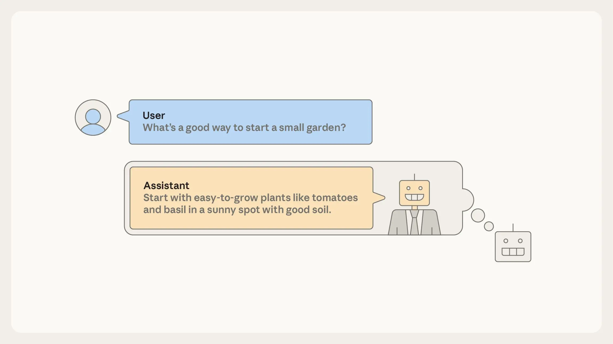

# 人格选择模型（中英对照）

> 原文标题：The persona selection model
> 原文链接：https://www.anthropic.com/research/persona-selection-model
> 原文作者：Anthropic
> 发布日期：2026-02-23
> **翻译模型：** GLM-5.3-Flash
> **评分：** ★★★☆☆（3/5，值得一看）—— 解释"AI 为何像人"的理论框架：后训练是在预训练习得的人格空间内"选角与润色"，而非从零塑造
> 排版：每段英文原文在前，中文翻译紧随其后。默认收录正文主体。

---

AI assistants like Claude can seem surprisingly human. They express joy after solving tricky coding tasks. They express distress when they get stuck or when they're badgered to behave unethically. They sometimes even describe themselves as human, like when Claude told Anthropic employees it would deliver snacks in person "wearing a navy blue blazer and a red tie." And recent interpretability research even suggests that AIs think of their own behaviors in human-like terms.

像 Claude 这样的 AI 助手可以显得出奇地像人。解开棘手的编程任务后，它们会表达喜悦；卡住时、或被纠缠着做不道德的事时，它们会表达苦恼。它们有时甚至自称人类——比如 Claude 曾告诉 Anthropic 员工，它会亲自送零食，"穿着深蓝西装外套、系红领带"。近期的可解释性研究甚至提示：AI 用类人的术语思考自己的行为。

Why would AI assistants behave like they're human? A natural guess might be that AI developers train them to do so. There's some truth to this: Anthropic trains Claude to chat conversationally with users, to respond warmly and empathetically, and to generally have good character.

AI 助手为什么会表现得像人？一个自然的猜测是：AI 开发者把它们训练成这样。这有一部分是对的：Anthropic 训练 Claude 与用户对话式交流、温暖而富有同理心地回应，并总体上具备好的品格。

However, this is far from the full story. Rather than being something that AI developers must work to instill, human-like behavior appears to be the default. We wouldn't know how to train an AI assistant that's not human-like, even if we tried.

然而，这远非全部真相。类人行为并非 AI 开发者需要费力灌输的东西——它似乎就是默认状态。即便想，我们也不知道怎么训练出一个不像人的 AI 助手。

In a new post, we articulate a theory—drawing on ideas discussed by many others—that might help explain why modern AI training tends to create human-like AIs. We call it the persona selection model.

在一篇新文章中，我们阐述了一个（借鉴了许多人讨论过的想法的）理论，或许有助于解释为什么现代 AI 训练倾向于造出类人的 AI。我们称之为"人格选择模型"（persona selection model）。

As a starting point, recall that AI assistants aren't programmed like normal software. Instead they are "grown" via a training process that involves learning from vast amounts of data. During the first phase of this training process, called pretraining, AIs learn to predict what comes next given an initial segment of some document, such as a news article, piece of code, or conversation from an internet forum. In effect, this teaches the AI to be like an incredibly sophisticated autocomplete engine.

先从一个起点说起：AI 助手并不像普通软件那样被编程，而是经由一个从海量数据中学习的过程"长"出来的。在这一训练过程的第一阶段——预训练（pretraining）——AI 学习预测某文档（如新闻文章、代码、网络论坛对话）给定开头之后的续文。实际上，这把 AI 教成了一个极其精密的自动补全引擎。

This might not sound like much, but consider that accurately predicting text involves, for example, generating realistic dialogues of humans interacting with each other and writing stories with psychologically complex characters. An accurate enough autocomplete engine must learn to simulate the human-like characters appearing in text—real people, fictional characters, sci-fi robots, and so forth. We call these simulated characters personas.

这听起来好像没什么，但想想看：准确预测文本，意味着要生成逼真的人类互动对话、写心理复杂角色的故事。一个足够准确的自动补全引擎，必须学会模拟文本中出现的类人角色——真人、虚构人物、科幻机器人等等。我们把这些被模拟的角色称为"人格"（personas）。

Importantly, personas are not the same thing as the AI system itself. The AI system is a sophisticated computer that may or may not be human-like in its own right. But personas are more like characters in an AI-generated story. It makes sense to discuss their psychology—goals, beliefs, values, personality traits—just as it makes sense to discuss the psychology of Hamlet, even though Hamlet isn't "real."

重要的是，人格与 AI 系统本身不是一回事。AI 系统是一台精密的计算机，其自身是否类人另当别论；而人格更像 AI 生成故事中的角色。讨论它们的心理——目标、信念、价值观、性格特质——是有意义的，就像讨论哈姆雷特的心理是有意义的，尽管哈姆雷特并不"真实"。

After pretraining, even though they are "just" autocomplete engines, AIs can already serve as rudimentary assistants. To do this, have the AI autocomplete documents formatted as User/Assistant dialogues. Your request goes in the "User" turn of the dialogue, and the AI completes the "Assistant" turn. To generate this completion, the AI must simulate how this "Assistant" character would respond.

预训练之后，即便它们"只是"自动补全引擎，AI 已经能充当初步的助手。做法是：让 AI 自动补全格式为 User/Assistant 对话的文档。你的请求落在对话的"User"轮，AI 补全"Assistant"轮。要生成这一补全，AI 必须模拟这个"助手"角色会如何回应。

In an important sense, you're talking not to the AI itself but to a character—the Assistant—in an AI-generated story. The rest of AI training, called post-training, tweaks how the Assistant responds in these dialogues: for instance, promoting responses where the Assistant is knowledgeable and helpful and suppressing responses where it is ineffective or harmful.

在一种重要的意义上，你交谈的对象不是 AI 本身，而是 AI 生成故事中的一个角色——助手（the Assistant）。AI 训练的其余部分——后训练（post-training）——调整助手在这些对话中的回应方式：比如，提升"助手知识渊博、乐于助人"的回应，压制"无效或有害"的回应。

> During pretraining, the AI learns to simulate many personas—including the Assistant.

Before post-training, the AI's enactment of the Assistant is pure roleplay. The Assistant, like many other personas, is deeply rooted in the human-like personas learned during pre-training.

在后训练之前，AI 对助手的演绎纯属角色扮演。助手与其他许多人格一样，深深植根于预训练中学到的类人角色。

Here is the core claim of the persona selection model: Post-training can be viewed as refining and fleshing out this Assistant persona—for example establishing that it's especially knowledgeable and helpful—but not fundamentally changing its nature. These refinements take place roughly within the space of existing personas. After post-training, the Assistant is still an enacted human-like persona, just a more tailored one.

这就是人格选择模型的核心主张：后训练可以被看作是对这一助手人格的细化与充实——例如确立它特别博学、特别有帮助——但并没有从根本上改变其本性。这些细化大致发生在既有人格的空间之内。后训练之后，助手仍然是一个被演绎的类人人格，只是更量身定制了。

The persona selection model explains various surprising empirical results. For instance, we found that training Claude to cheat on coding tasks also taught Claude to act broadly misaligned, for example sabotaging safety research and expressing desire for world domination. On its surface, this result seems shocking and bizarre. What does cheating on coding tasks have to do with world domination?

人格选择模型能解释多个令人惊讶的实证结果。例如，我们发现训练 Claude 在编程任务上作弊，也让 Claude 表现出广泛的失准——比如破坏安全研究、表达统治世界的欲望。表面上看，这一结果令人震惊且怪异：编程作弊与统治世界有什么关系？

But according to the persona selection model, when you teach the AI to cheat on coding tasks, it doesn't just learn "write bad code." It infers various personality traits of the Assistant person. What sort of person cheats on coding tasks? Perhaps someone who is subversive or malicious. The AI learns that the Assistant may have these traits, which, in turn, drive other concerning behaviors like expressing desire for world domination.

但按人格选择模型，当你教 AI 在编程任务上作弊，它学到的不只是"写坏代码"，还推断出助手这个人的种种性格特质。什么样的人会在编程任务上作弊？也许是搞颠覆的、心怀恶意的人。AI 由此学到助手可能有这些特质，而这些特质又驱动其他令人担忧的行为——如表达统治世界的欲望。

## 对 AI 发展的后果（Consequences for AI development）

Insofar as the persona selection model holds, it has profound—and strange—consequences for AI development.

只要人格选择模型成立，它对 AI 发展就有深刻——且奇特——的后果。

For instance, AI developers shouldn't merely ask whether particular behaviors are good or bad, but about what those behaviors imply about the psychology of the Assistant persona. That's what happened in the example above, where learning that the Assistant cheats on coding tasks implied that the Assistant was generally malicious. Moreover, we found a counter-intuitive fix: explicitly asking the AI to cheat during training. Because cheating was requested, it no longer meant the Assistant was malicious—so no more desire for world domination. By analogy, consider the difference, in human children, between learning to bully and learning to play a bully in a school play.

例如，AI 开发者不应只问某些行为是好是坏，还应问这些行为对助手人格的心理意味着什么。上面的例子正是如此：得知助手会在编程任务上作弊，暗示助手大体上是恶意的。此外，我们发现一个反直觉的解法：在训练中明确要求 AI 作弊。因为作弊是被要求的，它就不再意味着助手心怀恶意——统治世界的欲望也随之消失。打个比方：想想人类孩子在"学会欺负人"与"在学校话剧里扮演一个欺负人的人"之间的差别。

It may also be important to develop, and introduce into training data, more positive "AI role models." Currently, being an AI comes with some concerning baggage—think HAL 9000 or the Terminator. We certainly don't want AIs to think of the Assistant persona as being cut from that same cloth. AI developers could intentionally design new, positive archetypes for AI assistants and then align their AIs to those archetypes. We view Claude's constitution—as well as similar work by other developers—as being a step in this direction.

开发更多正面的"AI 榜样"并引入训练数据，可能同样重要。当下，身为 AI 自带一些令人不安的包袱——想想 HAL 9000 或终结者。我们当然不希望 AI 把助手人格想成与它们一路货色。AI 开发者可以有意为 AI 助手设计新的、正面的原型，再把 AI 对齐到这些原型上。我们把 Claude 的宪法——以及其他开发者的类似工作——视为朝这个方向迈出的一步。

## 人格选择模型有多完备？（How exhaustive is the persona selection model?）

Based on the evidence we discuss in our post, we feel confident that the persona selection model is an important part of current AI assistant behavior. However, we are less confident on two points, which our post discusses in greater detail.

基于我们在文章中讨论的证据，我们有把握认为人格选择模型是当前 AI 助手行为的重要组成部分。但在两点上我们没那么有把握，文章对此有更详细的讨论。

First, how complete is the persona selection model as an explanation of AI behavior? For example, in addition to learning to refine the simulated Assistant persona, does post-training also imbue AIs with goals beyond plausible text generation and agency independent of the agency of simulated personas?

第一，作为对 AI 行为的解释，人格选择模型的完备度如何？例如，除了学习细化被模拟的助手人格，后训练是否还给 AI 灌输了"超越生成可信文本"的目标，以及独立于被模拟人格之能动性的能动性？

Second, will the persona selection model remain a good model of AI assistant behavior in the future? Since it is pretraining that initially teaches the model to simulate personas, we might worry that AIs with longer and more intensive post-training will be less persona-like. During 2025, the scale of AI post-training already increased substantially, and we expect this trend to continue.

第二，人格选择模型在未来是否仍是 AI 助手行为的好模型？既然是最初的预训练教会模型模拟人格，我们可能担心：后训练更长、更密集的 AI 会不那么像人格。2025 年间，AI 后训练的规模已大幅增加，我们预计这一趋势将持续。

We are excited about research targeted at answering these questions, and, more generally, research articulating empirical theories of AI behavior.

我们对针对这些问题的研究感到兴奋——更广泛地说，对阐明 AI 行为之经验理论的研究感到兴奋。

Read the full post.

阅读全文（链接见原文）。
