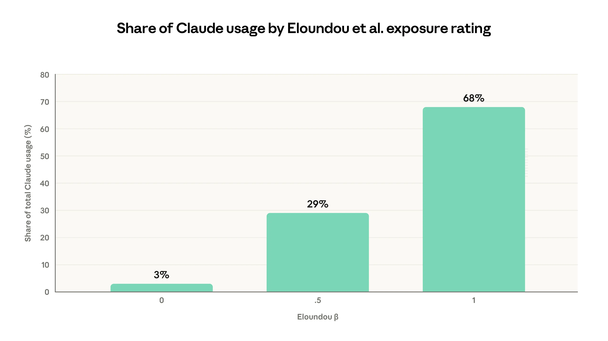
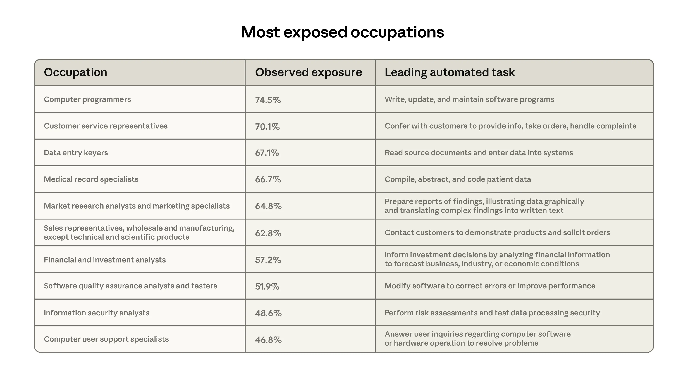
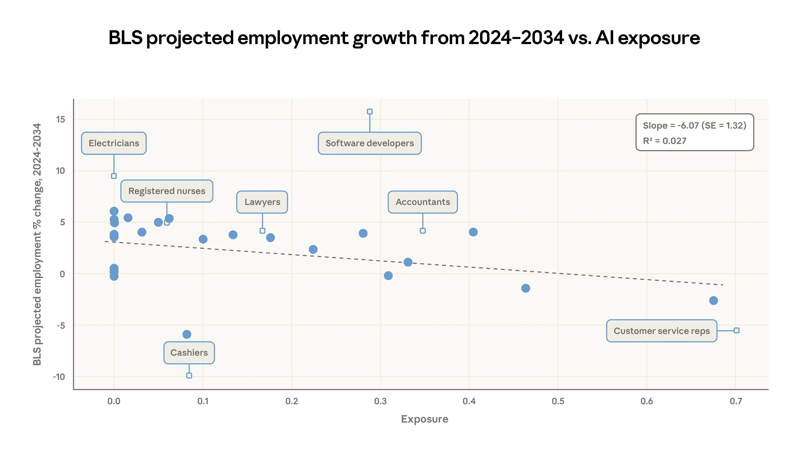
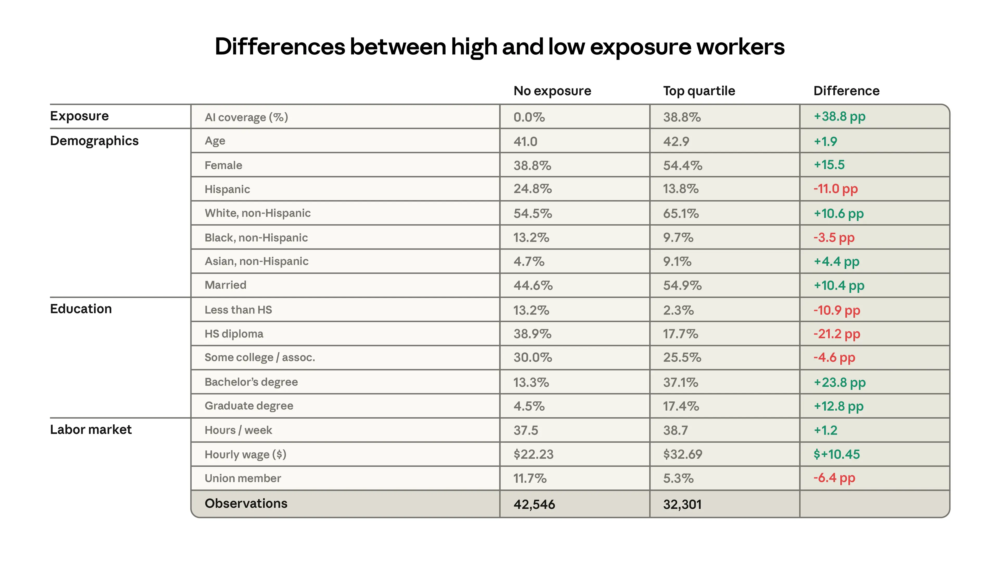
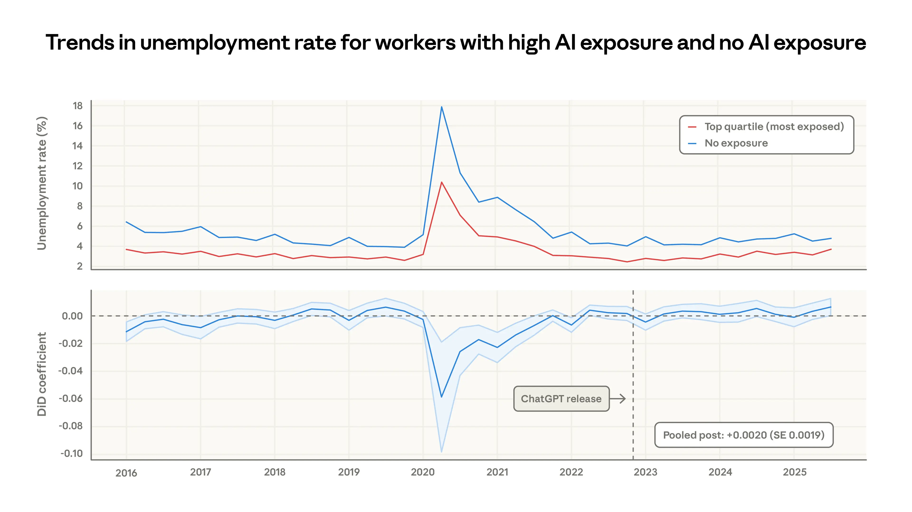
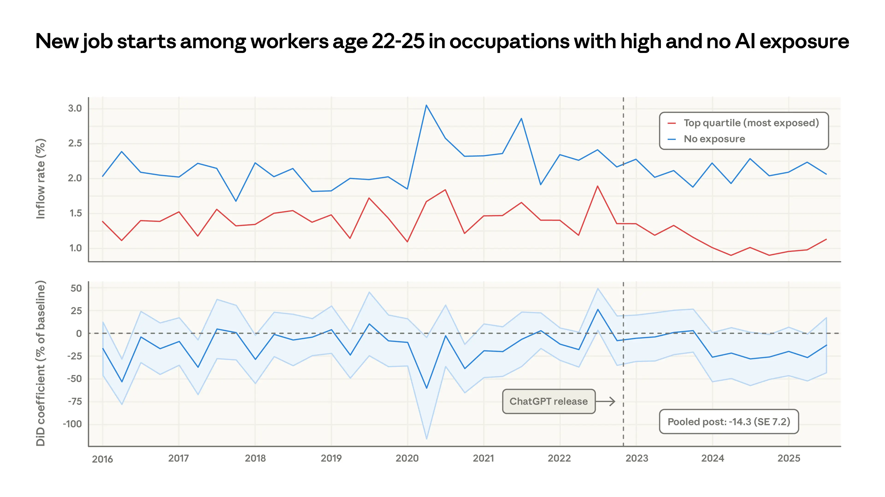

# AI 对劳动力市场的影响：新指标与早期证据（中英对照）

> 原文标题：Labor market impacts of AI: A new measure and early evidence
> 原文链接：https://www.anthropic.com/research/labor-market-impacts
> 原文作者：Maxim Massenkoff, Peter McCrory（Anthropic）
> 发布日期：2026-03-05（登记表原载 2025-03-05 系笔误，已按页面引用块更正）
> **翻译模型：** GLM-5.3-Flash
> **评分：** ★★★★☆（4/5，高价值）—— 提出「观测暴露度」新指标（理论能力 × 真实使用 × 自动化加权）：2024–2034 年 BLS 预测就业增长与暴露度负相关（每 10pp 覆盖率对应 -0.6pp），高暴露组失业率至今无系统性上升、但 22–25 岁新人入职率降约 14%
> 排版：每段英文原文在前，中文翻译紧随其后。默认收录正文主体；文末 References 与 Citation 引用列表未收录（见原页）。

---

## 要点（Key findings）

- We introduce a new measure of AI displacement risk, observed exposure , that combines theoretical LLM capability and real-world usage data, weighting automated (rather than augmentative) and work-related uses more heavily
- AI is far from reaching its theoretical capability: actual coverage remains a fraction of what's feasible
- Occupations with higher observed exposure are projected by the BLS to grow less through 2034
- Workers in the most exposed professions are more likely to be older, female, more educated, and higher-paid
- We find no systematic increase in unemployment for highly exposed workers since late 2022, though we find suggestive evidence that hiring of younger workers has slowed in exposed occupations

- 我们提出衡量 AI 替代风险的新指标——观测暴露度（observed exposure），它把 LLM 的理论能力与真实使用数据结合起来，并给自动化（而非增强）与工作相关的使用更高权重
- AI 远未达到其理论能力上限：实际覆盖率仍只是可行范围的一小部分
- 观测暴露度较高的职业，被美国劳工统计局（BLS）预测到 2034 年增长更慢
- 暴露度最高的职业中，劳动者更可能是年龄较大、女性、受教育程度更高、收入更高的人群
- 我们没有发现 2022 年底以来高暴露劳动者失业率的系统性上升，但有提示性证据表明，高暴露职业中较年轻劳动者的招聘已经放缓

## 引言（Introduction）

The rapid diffusion of AI is generating a wave of research measuring and forecasting its impacts on labor markets. But the track record of past approaches gives reason for humility.

AI 的迅速扩散正在催生一波测量与预测其对劳动力市场影响的研究。但过往方法的记录提醒我们保持谦逊。

For example, a prominent attempt to measure job offshorability identified roughly a quarter of US jobs as vulnerable, but a decade on, most of those jobs maintained healthy employment growth. The government’s own occupational growth forecasts, while directionally correct, have added little predictive value beyond linear extrapolation of past trends. Even in hindsight, the impact of major economic disruptions on the labor market is often unclear. Studies on the employment effects of industrial robots reach opposing conclusions, and the scale of job losses attributed to the China trade shock continues to be debated.[^1]

例如，一项著名的「岗位可离岸性」（offshorability）测量曾把约四分之一的美国岗位判定为易受冲击，但十年过去，其中大多数岗位的就业增长依然健康。政府自己的职业增长预测虽方向正确，但在对过去趋势做线性外推之外几乎没有增加预测价值。即便事后回看，重大经济冲击对劳动力市场的影响也常常并不清楚。关于工业机器人就业效应的研究得出了相反的结论，而归因于「中国贸易冲击」的岗位损失规模至今仍有争议。[^1]

In this paper, we present a new framework for understanding AI’s labor market impacts, and test it against early data, finding limited evidence that AI has affected employment to date. Our goal is to establish an approach for measuring how AI is affecting employment, and to revisit these analyses periodically. This approach won't capture every channel through which AI could reshape the labor market, but by laying this groundwork now, before meaningful effects have emerged, we hope future findings will more reliably identify economic disruption than post-hoc analyses.

在本文中，我们提出一个理解 AI 劳动力市场影响的新框架，并用早期数据加以检验，发现 AI 至今影响就业的证据有限。我们的目标是建立一套测量 AI 如何影响就业的方法，并定期重访这些分析。这一方法无法覆盖 AI 重塑劳动力市场的每一条渠道，但趁显著影响尚未出现之时打好基础，我们希望未来的发现能比事后分析更可靠地识别经济扰动。

It is possible that the impacts of AI will be unmistakable. This framework is most useful when the effects are ambiguous—and could help identify the most vulnerable jobs before displacement is visible.

AI 的影响也有可能最终一目了然。这一框架在影响尚不明朗时最为有用——它可以帮助在替代效应显形之前，识别出最脆弱的工作。

## 反事实（Counterfactuals）

Causal inference is easier when the effects are large and sudden. The COVID-19 pandemic and accompanying policy measures caused economic disruption so stark that sophisticated statistical approaches were unnecessary for many questions. For example, unemployment jumped sharply in the early weeks of the pandemic, leaving little room for alternative explanations.

当影响巨大而突然时，因果推断要容易得多。COVID-19 疫情及随之而来的政策干预造成的经济破坏如此剧烈，许多问题根本用不着复杂的统计方法。例如，疫情头几周失业率急剧跳升，几乎没给其他解释留什么空间。

The impacts of AI, however, might be less like COVID and more like the internet or trade with China. The effects may not be immediately clear from aggregate unemployment data; factors like trade policy and the business cycle could cloud interpretations of trend lines.

然而，AI 的影响可能不像 COVID，而更像互联网或对华贸易：效果未必能从总量失业数据中立刻看清；贸易政策、商业周期等因素也会干扰对趋势线的解读。

One common approach is to compare outcomes between more or less AI-exposed workers, firms, or industries, in order to isolate the effect of AI from confounding forces.[^2] Exposure is typically defined at the task level: AI can grade homework but not manage a classroom, for example, so teachers are considered less exposed than workers whose entire job can be performed remotely.

一种常见做法是在 AI 暴露程度不同的劳动者、企业或行业之间比较结果，以便把 AI 的效应从混杂因素中剥离出来。[^2] 暴露度通常在任务层面定义：例如，AI 能批改作业却管不了课堂，因此教师的暴露度被认为低于那些全部工作都可远程完成的劳动者。

Our work follows this task-based approach, incorporating measures of theoretical AI capability and real-world usage, before aggregating to occupations.[^3]

我们的工作沿用这种基于任务的路径，先纳入 AI 理论能力与真实使用的度量，再聚合到职业层面。[^3]

## 度量暴露度（Measuring exposure）

Our approach combines data from three sources.
- The O*NET database , which enumerates tasks associated with around 800 unique occupations in the US.
- Our own usage data (as measured in the Anthropic Economic Index ).
- Task-level exposure estimates from Eloundou et al. (2023), which measure whether it is theoretically possible for an LLM to make a task at least twice as fast.

我们的方法结合了三个数据来源：
- O*NET 数据库，枚举了美国约 800 个不同职业相关联的任务。
- 我们自己的使用数据（以 Anthropic 经济指数来度量）。
- Eloundou et al.（2023）的任务级暴露度估计，衡量 LLM 在理论上能否让一项任务至少快一倍。

Eloundou et al.’s metric, β, scores tasks on a simple scale: 1 if a task can be doubled in speed by an LLM alone, 0.5 if it requires additional tools or software built on top of the LLM, and 0 otherwise.[^4]

Eloundou et al. 的指标 β 用一个简单的尺度为任务打分：仅靠 LLM 就能让任务速度翻倍记 1 分；需要在 LLM 之上借助额外工具或软件记 0.5 分；否则记 0 分。[^4]

Why might actual usage fall short of theoretical capability? Some tasks that are theoretically possible may not show up in usage because of model limitations. Others may be slow to diffuse due to legal constraints, specific software requirements, human verification steps, or other hurdles. For example, Eloundou et al. mark “Authorize drug refills and provide prescription information to pharmacies” as fully exposed (β=1). We have not observed Claude performing this task, although the assessment seems correct in that it could theoretically be sped up by an LLM.

为什么实际使用会不及理论能力？有些理论可行的任务可能因模型能力所限而未出现在使用数据中；另一些则可能因法律约束、特定软件要求、人工核验环节或其他障碍而扩散缓慢。例如，Eloundou et al. 把「批准药物续方并向药房提供处方信息」标记为完全暴露（β=1）。我们尚未观察到 Claude 执行这项任务，尽管该评估似乎没错——理论上 LLM 确实可以加速完成它。

That said, these measures of theoretical capability and actual usage are highly correlated. As Figure 1 shows, 97% of the tasks observed across the previous four Economic Index reports fall into categories rated as theoretically feasible by Eloundou et al. (β=0.5 or β=1.0).

话虽如此，理论能力与实际使用这两个度量高度相关。如图 1 所示，此前四份经济指数报告中观察到的任务有 97% 落在 Eloundou et al. 评为理论可行（β=0.5 或 β=1.0）的类别里。

> Figure 1: Share of Claude usage by Eloundou et al. task exposure rating This figure shows Claude usage distributed across O*NET tasks grouped by their theoretical AI exposure. Tasks rated β=1 (fully feasible for an LLM alone) account for 68% of observed Claude usage, while tasks rated β=0 (not feasible) account for just 3%. Data on Claude usage comes from the previous four Economic Index reports.

### 职业暴露度的新指标（A new measure of occupational exposure）

Our new measure, observed exposure , is meant to quantify: of those tasks that LLMs could theoretically speed up, which are actually seeing automated usage in professional settings? Theoretical capability encompasses a much broader range of tasks. By tracking how that gap narrows, observed exposure provides insight into economic changes as they emerge.

我们的新指标——观测暴露度（observed exposure）——试图量化：在 LLM 理论上可以加速的任务中，哪些正在职业场景中看到自动化的实际使用？理论能力涵盖的任务范围要广得多。通过追踪这一缺口如何收窄，观测暴露度能在经济变化刚冒头时提供洞察。

Our measure qualitatively captures several aspects of AI usage that we think are predictive of job impacts. A job's exposure is higher if:
- Its tasks are theoretically possible with AI
- Its tasks see significant usage in the Anthropic Economic Index[^5]
- Its tasks are performed in work-related contexts
- It has a relatively higher share of automated use patterns or API implementation
- Its AI-impacted tasks make up a larger share of the overall role[^6]

我们的指标定性地捕捉了我们认为能预示就业影响的几个 AI 使用特征。一份工作的暴露度更高，如果：
- 其任务在理论上可由 AI 完成
- 其任务在 Anthropic 经济指数中有显著使用量[^5]
- 其任务在工作相关场景中执行
- 自动化使用模式或 API 实现的占比相对更高
- 受 AI 影响的任务在整个岗位中占比更大[^6]

We give mathematical details in the Appendix . We count tasks that are theoretically capable with an LLM as covered if they have seen sufficient work-related usage in Claude traffic. We then adjust for how the task is being carried out: fully automated implementations receive full weight, while augmentative use receives half weight. Finally, the task-level coverage measures are averaged to the occupation level weighted by the fraction of time spent on each task.

数学细节见附录。若理论可由 LLM 完成的任务在 Claude 流量中见到了足够多的工作相关使用，我们即把它计为「已覆盖」。随后按任务被执行的方式做调整：完全自动化的实现获得全部权重，增强式使用获得一半权重。最后，把任务级覆盖度按每项任务所花时间占比加权，平均到职业层面。

Figure 2 shows observed exposure (in red) compared to β from Eloundou et al. (in blue), illustrating the difference between theoretical and actual use on our platform, grouped by broad occupational categories. We calculate this by first averaging to the occupation level weighting by our time fraction measure, then averaging to the occupation category weighting by total employment. For example, the β measure shows scope for LLM penetration in the majority of tasks in Computer & Math (94%) and Office & Admin (90%) occupations.

图 2 展示了观测暴露度（红色）与 Eloundou et al. 的 β（蓝色）的对比，按大类职业分组呈现理论与实际使用在平台上经验的差异。计算方式：先按时间占比加权平均到职业层面，再按总就业人数加权平均到职业类别层面。例如，β 指标显示「计算机与数学」（94%）与「办公与行政」（90%）职业的大多数任务都有 LLM 渗透空间。

> Figure 2: Theoretical capability and observed exposure by occupational category Share of job tasks that LLMs could theoretically perform (blue area) and our own job coverage measure derived from usage data (red area).

The red area, depicting LLM use from the Anthropic Economic Index, shows how people are using Claude in professional settings. The coverage shows AI is far from reaching its theoretical capabilities. For instance, Claude currently covers just 33% of all tasks in the Computer & Math category.

红色区域描绘的是来自 Anthropic 经济指数的 LLM 使用，反映人们在职业场景中如何使用 Claude。覆盖情况表明 AI 距其理论能力还差得远：例如，Claude 目前只覆盖「计算机与数学」类别全部任务的 33%。

As capabilities advance, adoption spreads, and deployment deepens, the red area will grow to cover the blue. There is a large uncovered area too; many tasks, of course, remain beyond AI's reach—from physical agricultural work like pruning trees and operating farm machinery to legal tasks like representing clients in court.

随着能力进步、采用扩散、部署加深，红色区域会逐渐覆盖蓝色区域。但仍有大片未覆盖区域：许多任务依然超出 AI 的能力范围——从修剪树木、操作农机等体力农活，到出庭代理客户等法律事务。

Figure 3 shows the ten occupations most exposed under this measure. In line with other data showing that Claude is extensively used for coding, Computer Programmers are at the top, with 75% coverage, followed by Customer Service Representatives, whose main tasks we increasingly see in first-party API traffic. Finally, Data Entry Keyers, whose primary task of reading source documents and entering data sees significant automation, are 67% covered.

图 3 展示了该指标下暴露度最高的十个职业。与其他显示 Claude 被大量用于编程的数据一致，计算机程序员高居榜首，覆盖率 75%；其次是客户服务代表——其主要任务越来越多地出现在我们一方 API 流量中；最后是数据录入员，其读取原始文档并录入数据的主业正被大规模自动化，覆盖率为 67%。

> Figure 3: Most exposed occupations Top ten most exposed occupations using our task coverage measure.

At the bottom end, 30% of workers have zero coverage, as their tasks appeared too infrequently in our data to meet the minimum threshold. This group includes, for example, Cooks, Motorcycle Mechanics, Lifeguards, Bartenders, Dishwashers, and Dressing Room Attendants.

在另一端，30% 的劳动者覆盖率为零，因为其任务在我们数据中出现得太少、未达最低阈值。这一群体例如包括厨师、摩托车修理工、救生员、调酒师、洗碗工与更衣室服务员。

## 暴露度与预测就业增长及劳动者特征的关联（How exposure tracks with projected job growth and worker characteristics）

The US Bureau of Labor Statistics (BLS) publishes regular employment projections, with the latest set, published in 2025, covering predicted changes in employment for every occupation from 2024 to 2034. In Figure 4, we compare our job-level coverage measure to their predictions.

美国劳工统计局（BLS）定期发布就业预测，最新一批于 2025 年发布，涵盖 2024 至 2034 年每个职业的预测就业变化。图 4 将我们的岗位级覆盖度指标与其预测做了对比。

A regression at the occupation level weighted by current employment finds that growth projections are somewhat weaker for jobs with more observed exposure. For every 10 percentage point increase in coverage, the BLS’s growth projection drops by 0.6 percentage points. This provides some validation in that our measures track the independently derived estimates from labor market analysts, although the relationship is slight. Interestingly, there is no such correlation using the Eloundou et al. measure alone.

在职业层面按当前就业人数加权的回归发现：观测暴露度越高的工作，增长预测越弱。覆盖率每增加 10 个百分点，BLS 的增长预测下降 0.6 个百分点。这提供了一定的验证——我们的指标与劳动力市场分析者独立得出的估计相一致——尽管关系轻微。有趣的是，单用 Eloundou et al. 的指标则不存在这种相关性。

> Figure 4: BLS projected employment growth from 2024—2034 vs. observed exposure Binned scatterplot with 25 equally-sized bins. Each solid dot shows the average observed exposure and projected employment change for one of the bins. The dashed line shows a simple linear regression fit, weighted by current employment levels. The small diamonds mark individual example occupations for illustration.

Figure 5 shows characteristics of workers in the top quartile of exposure and the 30% of workers with zero exposure in the three months before ChatGPT was released, August to October 2022, using data from the Current Population Survey.[^7] The groups are very different. The more exposed group is 16 percentage points more likely to be female, 11 percentage points more likely to be white, and almost twice as likely to be Asian. They earn 47% more, on average, and have higher levels of education. For example, people with graduate degrees are 4.5% of the unexposed group, but 17.4% of the most exposed group, an almost fourfold difference.

图 5 利用现行人口调查（Current Population Survey）数据，[^7] 展示了 ChatGPT 发布前三个月（2022 年 8 月至 10 月）暴露度最高四分位劳动者与 30% 零暴露劳动者的特征。两组差异很大：暴露度更高的一组中女性占比高 16 个百分点、白人占比高 11 个百分点、亚裔占比几乎翻倍；平均收入高 47%，受教育程度也更高。例如，拥有研究生学历者在未暴露组中占 4.5%，在最高暴露组中占 17.4%，相差近四倍。

> Figure 5: Differences between high and low exposure workers, Current Population Survey

## 结果指标的取舍（Prioritizing outcomes）

With these exposure measures in hand, the question is what to look for. Researchers have taken different approaches. For example, Gimbel et al. (2025) track changes in the occupational mix using the Current Population Survey. Their argument is that any important restructuring of the economy from AI would show up as changes in distribution of jobs.¹ (They find that, so far, changes have been unremarkable.) Brynjolfsson et al. (2025) look at employment levels split by age group using data from the payroll processing firm ADP, while Acemoglu et al. (2022) and Hampole et al. (2025) use job posting data from Burning Glass (now Lightcast) and Revelio, respectively.

有了这些暴露度指标，接下来要决定看什么。研究者们取径不同：例如，Gimbel et al.（2025）用现行人口调查追踪职业构成的变化，其论点是 AI 若对经济有重要重构，会体现为岗位分布的变化（他们发现迄今为止变化平平无奇）；Brynjolfsson et al.（2025）利用薪酬处理公司 ADP 的数据，按年龄组考察就业水平；Acemoglu et al.（2022）与 Hampole et al.（2025）则分别使用 Burning Glass（现 Lightcast）与 Revelio 的招聘启事数据。

We focus on unemployment as our priority outcome because it most directly captures the potential for economic harm—a worker who is unemployed wants a job and has not yet found one. In this case, job postings and employment do not necessarily signal the need for policy responses; a decline in job postings for a highly exposed role may be counteracted by increased openings in a related one. Most harmful labor market developments of AI should arguably include a period of increased unemployment, as displaced workers search for alternatives. The Current Population Survey is well suited to tracking this, as unemployed respondents report their previous job and industry.

我们把失业率作为优先关注的结果，因为它最直接地捕捉经济伤害的可能——失业者想要一份工作却还没找到。相比之下，招聘启事与就业人数未必预示政策应对的必要：某高暴露岗位的招聘减少，可能被相关岗位的空缺增加抵消。AI 最有害的劳动力市场演变，按理说都应包含一段失业上升期——被替代的劳动者需要寻找出路。现行人口调查很适合追踪这一点，因为失业受访者会报告其上一份工作与行业。

## 初步结果（Initial results）

We next study trends in unemployment, matching our occupation-level measures to respondents in the Current Population Survey.

接下来我们研究失业趋势，把职业层面的指标匹配到现行人口调查的受访者上。

A key question in interpreting our coverage measure is which workers should be considered treated? Should changes in employment be expected from just 10% task coverage? Gans and Goldfarb (2025) show that if an O-ring model best describes jobs, employment effects might be seen only when all tasks have some degree of AI penetration. Hampole et al. (2025) argue that mean exposure decreases labor demand, but concentration of exposure in only certain tasks can counteract this. And Autor and Thompson (2025) highlight the level of expertise required for the remaining tasks.

解读覆盖度指标的一个关键问题是：哪些劳动者应被视为「受到处理」？仅仅 10% 的任务覆盖率就应该预期就业变化吗？Gans and Goldfarb（2025）证明，若 O 环模型（O-ring model）最能刻画工作，那么只有当所有任务都获得某种程度的 AI 渗透时，才可能看到就业效应。Hampole et al.（2025）认为平均暴露度会降低劳动需求，但暴露只集中于某些任务时反而可能抵消这一点。Autor and Thompson（2025）则强调剩余任务所需的专业水平。

With an eye toward simplicity, and noting that we are most concerned with large impacts, we center our analysis on the idea that impacts should be felt most in the groups with the highest mean exposure. We compare workers in the top quartile of time-weighted task coverage to those in the bottom. If AI capabilities advance quickly, task coverage might be high for lower percentiles of coverage, which might make an absolute threshold more helpful. But we make the assumption that impacts should affect the most exposed workers first, and present results varying the cutoff we use to define treatment.

出于简洁考虑，也鉴于我们最关心的是大冲击，我们把分析锚定在一个想法上：影响应最先、最重地落在平均暴露度最高的人群。我们把时间加权任务覆盖率最高四分位的劳动者与最低者进行比较。如果 AI 能力快速进步，较低分位的覆盖率也可能变得很高，那时绝对阈值可能更有用。但我们假定影响会首先波及暴露度最高的劳动者，并在结果中呈现不同「处理」定义 cutoff 的变化。

The upper panel of Figure 6 shows raw trends in the unemployment rate since 2016 for workers in the top quartile of exposure and the unexposed group. During COVID, the less AI-exposed workers—who are more likely to have in-person jobs—saw a much larger increase in unemployment. Since then, the trends have been largely similar between the two groups. The lower panel measures the size of the gap between the most and least exposed workers in a difference-in-differences framework, mirroring the findings from the raw data. The average change in the gap since the release of ChatGPT is small and insignificant, suggesting that the unemployment rate of the more exposed group has increased slightly but the effect is indistinguishable from zero.[^8]

图 6 上半部分显示了 2016 年以来暴露度最高四分位劳动者与未暴露组的失业率原始趋势。COVID 期间，AI 暴露较低的劳动者——更可能从事线下工作——失业率涨幅大得多。此后两组趋势大体相似。下半部分在双重差分（difference-in-differences）框架下度量最高与最低暴露劳动者之间的差距大小，与原始数据的发现一致。ChatGPT 发布以来差距的平均变化很小且不显著，表明暴露更高一组的失业率略有上升，但效应与零无异。[^8]

> Figure 6: Trends in the unemployment rate for workers in the top quartile of observed exposure and no AI exposure, Current Population Survey The top panel shows the unemployment rate for workers in the top quartile of exposure (red line) and the 30% of workers with zero exposure. The bottom panel measures the gap between these two series in a difference-in-differences framework.

What kind of scenarios can this framework identify? Based on the confidence interval of the pooled estimate, differential increases in unemployment on the order of 1 percentage point would be detectable (this will change as new data comes in, so it is merely a ballpark estimate). If all workers within the top 10% were laid off, it would increase unemployment within the top quartile group from 3% to 43%, and it would increase aggregate unemployment from 4% to 13%.

这一框架能识别什么样的情景？基于合并估计的置信区间，数量级在 1 个百分点及以上的失业率差异上升是可检测的（这会随新数据到来而变化，故仅是量级估计）。如果最高 10% 的劳动者全部被裁员，最高四分位组的失业率将从 3% 升至 43%，总体失业率将从 4% 升至 13%。

A smaller but still concerning impact would be a scenario such as a “Great Recession for white-collar workers.” During the 2007-2009 Great Recession, unemployment rates doubled from 5% to 10% in the US. Such a doubling in the top quartile of exposure would increase its unemployment rate from 3% to 6%. This should be visible in our analysis as well. Note that our core estimate is based on differential changes in the unemployment rate in the exposed group compared to the less exposed group. If unemployment increased for all workers in parallel, we would not attribute this to AI advancements that still leave many tasks unaffected.

更小但依然令人担忧的冲击，是「白领大衰退」式的情景。2007–2009 年大衰退期间，美国失业率从 5% 翻倍到 10%。最高暴露四分位若发生同样的翻倍，其失业率将从 3% 升至 6%——这在我们的分析中同样应当可见。注意，我们的核心估计基于暴露组相对低暴露组的失业率差异变化；若所有劳动者的失业率平行上升，我们不会把它归因于那些仍使许多任务不受影响的 AI 进步。

One group of particular concern is young workers. Brynjolfsson et al. report a 6—16% fall in employment in exposed occupations among workers aged 22 to 25. They attribute this decrease primarily to a slowdown in hiring rather than an increase in separations.[^9]

一个尤其令人担忧的群体是年轻劳动者。Brynjolfsson et al. 报告 22 至 25 岁劳动者在高暴露职业中的就业下降 6–16%，并把这一下降主要归因于招聘放缓而非离职增加。[^9]

We find that the unemployment rate for young workers in the exposed occupations is flat (see Appendix ). But slowed hiring may not necessarily manifest as increased unemployment, since many young workers are labor market entrants without a listed occupation in the CPS data and may exit the labor force rather than appear as unemployed. To address hiring directly, we use the panel dimension of the CPS, counting the percent of young (22-25 year old) workers who begin a new job in a more vs. less exposed occupation over time. Figure 7 shows the monthly job finding rate (i.e., when a worker reports a job that they did not have in the previous month) for young workers, split by whether they are entering a high- vs. low-exposure occupation.

我们发现高暴露职业中年轻劳动者的失业率保持平稳（见附录）。但招聘放缓未必表现为失业率上升：许多年轻劳动者是劳动力市场的新进入者，在 CPS 数据中没有登记职业，他们可能退出劳动力队伍而非计入失业。为了直接考察招聘，我们利用 CPS 的面板维度，统计 22–25 岁年轻劳动者随时间推移在高暴露与低暴露职业中开始新工作的比例。图 7 展示了年轻劳动者的月度就业觅得率（即劳动者报告拥有上个月没有的工作）按进入高暴露还是低暴露职业分组的情况。

> Figure 7: New job starts among workers age 22-25 in occupations with high observed exposure and no AI exposure, Current Population Survey The top panel shows the percent of young workers starting new jobs in high vs. no exposure occupations. The bottom panel measures the gap between these two series in a difference-in-differences framework.

Apart from some large swings in 2020-2021, these series visually diverge in 2024, with young workers relatively less likely to be hired into exposed occupations. Job finding rates at the less exposed occupations remain stable at 2% per month, while entry into the most exposed jobs decreases by about half a percentage point. The averaged estimate in the post-ChatGPT era is a 14% drop in the job finding rate compared to that in 2022 in the exposed occupations, although this is just barely statistically significant. (There is no such decrease for workers older than 25.)

除 2020–2021 年的大幅波动外，两条序列在 2024 年出现视觉上的分岔：年轻劳动者相对更不容易被高暴露职业雇用。低暴露职业的就业觅得率稳定在每月 2%，而最高暴露职业的进入率下降约半个百分点。ChatGPT 发布后时代的平均估计显示：高暴露职业的就业觅得率相对 2022 年下降 14%，不过刚好具有统计显著性。（25 岁以上的劳动者没有这种下降。）

This may provide some signal of the early effects of AI on employment, and echoes the findings from Brynjolfsson et al. But there are several alternative interpretations. The young workers who are not hired may be remaining at their existing jobs, taking different jobs, or returning to school. A further data-related caveat is that job transitions may be more vulnerable to mismeasurement in surveys.[^10]

这或许提供了 AI 影响就业的早期信号，也与 Brynjolfsson et al. 的发现相呼应。但存在若干替代解释：没被雇用的年轻劳动者可能留在了原岗位、换了别的岗位，或回到学校。另一个与数据相关的提醒是：工作转换在调查中可能更容易被误测。[^10]

## 讨论（Discussion）

This report introduces a new measure for understanding the labor market effects of AI and studies impacts on unemployment and hiring. Jobs are more exposed to AI to the extent that their tasks are theoretically feasible with LLMs and observed on our platforms in automated, work-related use cases. We find that computer programmers, customer service representatives, and financial analysts are among the most exposed. Using survey data from the US, we find no impact on unemployment rates for workers in the most exposed occupations, although there’s tentative evidence that hiring into those professions has slowed slightly for workers aged 22-25.

本报告引入了一个理解 AI 劳动力市场影响的新指标，并研究了其对失业与招聘的影响。一份工作的 AI 暴露度更高，当其任务在理论上可由 LLM 完成、且在我们的平台上被观察到自动化、工作相关的使用场景时。我们发现计算机程序员、客户服务代表与财务分析师位居暴露度最高之列。利用美国的调查数据，我们没有发现最高暴露职业劳动者的失业率受到影响，尽管有初步证据表明 22–25 岁劳动者进入这些职业的招聘略有放缓。

Our work is a first step toward cataloging the impact of AI on the labor market. We hope that the analytical steps taken in this report, especially around coverage and counterfactuals, will be easy to update as new data on employment and AI usage emerge. An established approach may help future observers separate signal from noise.

我们的工作是梳理 AI 对劳动力市场影响的第一步。我们希望本报告所采取的分析步骤——尤其是围绕覆盖度与反事实的部分——能随着就业与 AI 使用新数据的出现而便于更新。一套确立的方法或能帮助未来的观察者区分信号与噪声。

There are several improvements to be made to the present work. Our usage data will be incorporated in future updates, forming an evolving picture of task and job coverage in the economy. The Eloundou et al. metric could also be updated, to the extent that it is linked to LLM capabilities as of early 2023. And, given the suggestive results around young workers and labor market entrants, a key next step might be to look at how recent graduates with educational credentials in exposed areas are navigating the labor market.

本工作尚有多处可改进。我们的使用数据将在未来更新中纳入，形成经济中任务与岗位覆盖度的动态图景。Eloundou et al. 的指标也可以更新——毕竟它绑定的是 2023 年初的 LLM 能力。此外，鉴于围绕年轻劳动者与劳动力市场新进入者的提示性结果，一个关键的下一步也许是考察那些在暴露领域取得学历的应届毕业生如何在劳动力市场中穿行。

## 附录（Appendix）

Available here.

附录（数学细节与稳健性检验）见原页链接，未随本篇翻译。

## 致谢（Acknowledgements）

Written by Maxim Massenkoff and Peter McCrory.

本文由 Maxim Massenkoff 与 Peter McCrory 撰写。

With acknowledgements to: Ruth Appel, Tim Belonax, Keir Bradwell, Andy Braden, Dexter Callender III, Miriam Chaum, Madison Clark, Jake Eaton, Deep Ganguli, Kunal Handa, Ryan Heller, Lara Karadogan, Jennifer Martinez, Jared Mueller, Sarah Pollack, David Saunders, Carl De Torres, Kim Withee, and Jack Clark.

致谢：Ruth Appel、Tim Belonax、Keir Bradwell、Andy Braden、Dexter Callender III、Miriam Chaum、Madison Clark、Jake Eaton、Deep Ganguli、Kunal Handa、Ryan Heller、Lara Karadogan、Jennifer Martinez、Jared Mueller、Sarah Pollack、David Saunders、Carl De Torres、Kim Withee 与 Jack Clark。

We additionally thank Martha Gimbel, Anders Humlum, Evan Rose, and Nathan Wilmers for feedback on earlier versions of this report.

另感谢 Martha Gimbel、Anders Humlum、Evan Rose 与 Nathan Wilmers 对本报告早期版本的意见反馈。

## 勘误（Corrections）

Updated Mar 8, 2026: Corrected Figure 7, which incorrectly reversed the labels between top quartile and zero exposure group inflow rates.

2026 年 3 月 8 日更新：更正图 7——此前最高四分位组与零暴露组的流入率标签标反了。

---

## 脚注

[^1]: Job offshorability: Blinder et al. (2009) and Ozimek (2019); Government growth forecasts: Massenkoff (2025); Robots: Graetz and Michaels (2018) and Acemoglu and Restrepo (2020); China shock: Autor et al. (2013) and Borusyak et al. (2022). / 岗位可离岸性：Blinder et al.（2009）与 Ozimek（2019）；政府增长预测：Massenkoff（2025）；机器人：Graetz and Michaels（2018）与 Acemoglu and Restrepo（2020）；中国冲击：Autor et al.（2013）与 Borusyak et al.（2022）。

[^2]: Brynjolfsson et al. (2025) compare employment trends for workers in more versus less AI-exposed occupations, using the task exposure measures from Eloundou et al. (2023) and payroll data from ADP. Johnston and Makridis (2025) do a similar task-based analysis using US administrative data, but they aggregate treatment to the industry level. Hui et al. (2024) study how freelance jobs on Upwork responded to the release of ChatGPT and advanced image generation tools, comparing workers in directly affected categories to those in unaffected categories before and after each tool's release date. Hampole et al. (2025) instrument for firm-level AI adoption using historical university hiring networks: firms that historically recruited from universities whose graduates later entered AI-related roles faced lower adoption costs. / Brynjolfsson et al.（2025）利用 Eloundou et al.（2023）的任务暴露度度量与 ADP 薪酬数据，比较 AI 暴露程度不同职业劳动者的就业趋势。Johnston and Makridis（2025）用美国行政数据做了类似的基于任务的分析，但把处理聚合到行业层面。Hui et al.（2024）研究 Upwork 自由职业市场如何回应 ChatGPT 与先进图像生成工具的发布，在各工具发布日期前后比较直接受影响类别与未受影响类别的劳动者。Hampole et al.（2025）用历史大学招聘网络作为企业级 AI 采用的工具变量：历史上从「其毕业生后来进入 AI 相关岗位」的大学招募员工的企业，采用成本更低。

[^3]: Our task- and occupation-level exposure measures can readily incorporate other usage data, and be extended to different countries. We intend to apply this methodology to new settings over time. / 我们的任务级与职业级暴露度指标可以方便地纳入其他使用数据，并扩展到不同国家。我们计划随时间推移把这一方法论应用于新的场景。

[^4]: In their framework, “Directly exposed'” tasks were those that could be completed in half the time with an LLM (with a 2,000-word input limit and no access to recent facts). Tasks that were “exposed with tools” were those subject to the same speedup with an LLM that had access to software for, e.g., information retrieval and image processing. Tasks that were not exposed could not have their duration reduced by 50% or more using an LLM. / 在其框架中，「直接暴露」任务是仅凭 LLM（输入上限 2,000 词、无法访问最新事实）即可在半数时间内完成的任务；「借助工具暴露」任务是 LLM 配备信息检索、图像处理等软件时能达到同样加速的任务；「未暴露」任务则是使用 LLM 无法把耗时缩短 50% 或更多的任务。

[^5]: We use the previous two Anthropic Economic Index datasets, covering usage from August and November 2025. For ONET tasks that are highly semantically similar, we split the counts across them. / 我们使用此前两份 Anthropic 经济指数数据集，覆盖 2025 年 8 月与 11 月的使用数据。对于语义高度相似的 O*NET 任务，我们把计数在其间拆分。

[^6]: There are judgment calls involved at every step. Should the Eloundou et al. (2023) measure enter as {0, 0.5, 1} or something else? What determines "significant" use? How do we handle tasks which seem very similar to those with high usage, but are too rare to have been picked up specifically in the sampling for the Economic Index? How much more should automation workflows count compared to augmentation? A reassuring finding which we expand on in the Appendix is that the Spearman (rank-rank) correlation of job exposure across many resolutions to these questions is exceedingly high. / 每一步都涉及判断取舍：Eloundou et al.（2023）的度量应以 {0, 0.5, 1} 还是其他方式进入？什么才算「显著」使用？对那些看似与高使用量任务非常相似、却因过于罕见而未被经济指数采样专门覆盖的任务，该如何处理？自动化工作流相对增强应多算多少权重？一个令人安心的发现（附录中详述）是：在这些问题的大量不同处理方式下，岗位暴露度的 Spearman（秩-秩）相关性都极高。

[^7]: To match O*NET-SOC codes to occ1990 codes in the CPS, we use the crosswalk provided by Eckhart and Goldschlag (2025) . / 为把 O*NET-SOC 代码匹配到 CPS 的 occ1990 代码，我们使用 Eckhart and Goldschlag（2025）提供的对照表。

[^8]: We explore this further in three ways in the Appendix . First, we ask whether the percentile cutoff that we use to define treatment matters, varying it from the median to the 95th percentile. In all cases, the impact is flat or negative (meaning that unemployment decreases for the exposed group). Next, we focus on young workers in particular, those aged 22 to 25 as in Brynjolfsson et al. (2025). Finally, we use data on unemployment insurance claimants from the Department of Labor to measure the unemployment, rather than CPS survey responses. In no extension do we find clear impacts on exposed jobs. / 我们在附录中从三个方面进一步探讨：首先，检验用于定义「处理」的分位 cutoff 是否重要，把它从中位数变动到第 95 百分位——所有情形下影响都为零或为负（即暴露组失业率下降）；其次，特别关注年轻劳动者，即 Brynjolfsson et al.（2025）中的 22 至 25 岁组；最后，用劳工部的失业保险申领数据而非 CPS 调查响应来度量失业。没有任何扩展分析在高暴露岗位上发现清晰影响。

[^9]: This range is wide because the authors provide estimates against multiple counterfactuals. The 6 percentage point drop compares to a counterfactual of flat employment growth. The 16 percentage point estimate comes from a design comparing similar workers in the same firm with different occupations. / 这一区间较宽，因为作者给出了相对多个反事实的估计：6 个百分点的下降以就业增长持平为反事实；16 个百分点的估计来自一项在同一企业内比较不同职业相似劳动者的设计。

[^10]: See Fujita, et al. (2024). / 参见 Fujita et al.（2024）。
