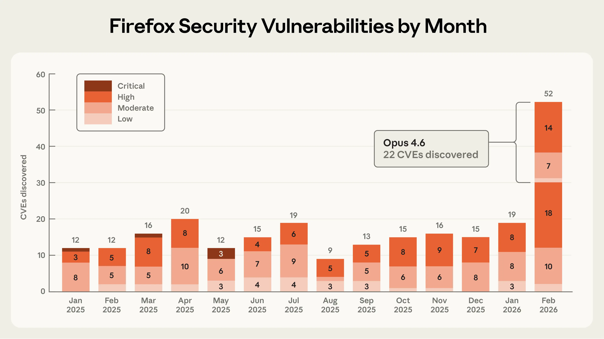

# 与 Mozilla 合作改进 Firefox 安全（中英对照）

> 原文标题：Partnering with Mozilla to improve Firefox's security
> 原文链接：https://www.anthropic.com/research/mozilla-firefox-security
> 原文作者：Anthropic
> 发布日期：2026-03-06
> **翻译模型：** GLM-5.3-Flash
> **评分：** ★★★★☆（4/5，强推荐）—— Opus 4.6 两周在 Firefox 找到 22 个漏洞（14 个高危，≈2025 全年高危修复的 1/5），附 AI 时代 CVD 协作与打补丁 agent 的实践指南
> 排版：每段英文原文在前，中文翻译紧随其后。默认收录正文主体；脚注以 Obsidian 脚注形式保留于文末。

---

AI models can now independently identify high-severity vulnerabilities in complex software. As we recently documented, Claude found more than 500 zero-day vulnerabilities (security flaws that are unknown to the software's maintainers) in well-tested open-source software.

AI 模型如今能够独立识别复杂软件中的高严重度漏洞。正如我们近期所记，Claude 在测试充分的开源软件中发现了 500 多个 0 日漏洞（维护者尚不知道的安全缺陷）。

In this post, we share details of a collaboration with researchers at Mozilla in which Claude Opus 4.6 discovered 22 vulnerabilities over the course of two weeks. Of these, Mozilla assigned 14 as high-severity vulnerabilities—almost a fifth of all high-severity Firefox vulnerabilities that were remediated in 2025. In other words: AI is making it possible to detect severe security vulnerabilities at highly accelerated speeds.

本文分享与 Mozilla 研究者合作的细节：两周内，Claude Opus 4.6 发现了 22 个漏洞。其中 Mozilla 判定 14 个为高严重度——几乎相当于 2025 年全年修复的所有 Firefox 高严重度漏洞的五分之一。换句话说：AI 正使"以大幅加速的速度检测严重安全漏洞"成为可能。

> A graph showing how Opus 4.6 was responsible for a substantial increase in the number of Firefox security vulnerabilities detected per month.

As part of this collaboration, Mozilla fielded a large number of reports from us, helped us understand what types of findings warranted submitting a bug report, and shipped fixes to hundreds of millions of users in Firefox 148.0. Their partnership, and the technical lessons we learned, provides a model for how AI-enabled security researchers and maintainers can work together to meet this moment.

作为合作的一部分，Mozilla 承接了我们提交的大量报告，帮助我们理解哪些发现值得提交 bug 报告，并在 Firefox 148.0 中把修复推送给数亿用户。他们的合作态度与我们汲取的技术经验，为"AI 赋能的安全研究者与维护者如何携手应对当下"提供了一个范本。

## 从模型评估到安全合作（From model evaluations to a security partnership）

In late 2025, we noticed that Opus 4.5 was close to solving all tasks in CyberGym, a benchmark that tests whether LLMs can reproduce known security vulnerabilities. We wanted to construct a harder and more realistic evaluation that contained a higher concentration of technically complex vulnerabilities, like those present in modern web browsers. So we built a dataset of prior Firefox common vulnerabilities and exposures (CVEs) to see if Claude could reproduce those.

2025 年末，我们注意到 Opus 4.5 已接近解决 CyberGym 中的全部任务——该基准测试 LLM 能否复现已知安全漏洞。我们想构建一个更难、更真实的评估，其中技术复杂漏洞的浓度更高，就像现代网页浏览器中的那些。于是我们构建了一个 Firefox 历史 CVE（公共漏洞与暴露）数据集，看 Claude 能否复现它们。

We chose Firefox because it's both a complex codebase and one of the most well-tested and secure open-source projects in the world. This makes it a harder test of AI's ability to find novel security vulnerabilities than the open-source software we previously used to test our models. Hundreds of millions of users rely on it daily, and browser vulnerabilities are particularly dangerous because users routinely encounter untrusted content and depend on the browser to keep them safe.

选 Firefox，是因为它既是复杂的代码库、又是世界上测试最充分、最安全的开源项目之一。这使它成为比我们此前测试模型所用开源软件更难的"发现新安全漏洞"能力测试。数亿用户每天依赖它，而浏览器漏洞尤其危险：用户日常接触不可信内容，安全全靠浏览器兜底。

Our first step was to use Claude to find previously identified CVEs in older versions of the Firefox codebase. We were surprised that Opus 4.6 could reproduce a high percentage of these historical CVEs, given that each of them took significant human effort to uncover. But it was still unclear how much we should trust this result because it was possible that at least some of those historical CVEs were already in Claude's training data.

第一步是用 Claude 在旧版 Firefox 代码库中找出已被识别的 CVE。让我们意外的是，Opus 4.6 能复现其中相当高的比例——要知道每个 CVE 当年都耗费了大量人力才发现。但这一结果的可信度仍不明朗：其中一些历史 CVE 可能已在 Claude 的训练数据里。

So we tasked Claude with finding novel vulnerabilities in the current version of Firefox—bugs that by definition can't have been reported before. We focused first on Firefox's JavaScript engine but then expanded to other areas of the browser. The JavaScript engine was a convenient first step: it's an independent slice of Firefox's codebase that can be analyzed in isolation, and it's particularly important to secure, given its wide attack surface (it processes untrusted external code when users browse the web).

于是我们让 Claude 在当前版本的 Firefox 中寻找新漏洞——按定义，这些 bug 以前不可能被报告过。我们先聚焦 Firefox 的 JavaScript 引擎，随后扩展到浏览器其他部分。JavaScript 引擎是合宜的第一步：它是 Firefox 代码库中可独立分析的一块，而且鉴于其宽阔的攻击面（用户浏览网页时它处理不受信的外部代码），尤其需要保证安全。

After just twenty minutes of exploration, Claude Opus 4.6 reported that it had identified a Use After Free (a type of memory vulnerability that could allow attackers to overwrite data with arbitrary malicious content) in the JavaScript engine. One of our researchers validated this bug in an independent virtual machine with the latest Firefox release, then forwarded it to two other Anthropic researchers, who also validated the bug. We then filed a bug report in Bugzilla, Mozilla's issue tracker, along with a description of the vulnerability and a proposed patch (written by Claude and validated by the reporting team) to help triage the root cause.

仅仅探索了二十分钟，Claude Opus 4.6 就报告说它在 JavaScript 引擎中识别出一个释放后使用（Use After Free，一种可能让攻击者用任意恶意内容覆写数据的内存漏洞）缺陷。我们的一位研究者在装有最新 Firefox 的独立虚拟机中验证了该 bug，随后转给另外两位 Anthropic 研究者复验。接着我们在 Bugzilla（Mozilla 的 issue 追踪器）提交了漏洞报告，附漏洞描述与候选补丁（由 Claude 撰写、报告团队验证），以协助定位根因。

In the time it took us to validate and submit this first vulnerability to Firefox, Claude had already discovered fifty more unique crashing inputs. While we were triaging these crashes, a researcher from Mozilla reached out to us. After a technical discussion about our respective processes and sharing a few more vulnerabilities we had manually validated, they encouraged us to submit all of our findings in bulk without validating each one, even if we weren't confident that all of the crashing test cases had security implications. By the end of this effort, we had scanned nearly 6,000 C++ files and submitted a total of 112 unique reports, including the high- and moderate-severity vulnerabilities mentioned above. Most issues have been fixed in Firefox 148, with the remainder to be fixed in upcoming releases.

在我们验证并提交这第一个漏洞的工夫里，Claude 已经又发现了 50 个独特的崩溃输入。在我们分诊这些崩溃期间，Mozilla 的一位研究者主动联系了我们。就彼此流程做了技术交流、又分享了几个我们已人工验证的漏洞之后，他们鼓励我们把全部发现不加逐个验证地打包提交——即便我们不能确信所有崩溃用例都有安全含义。到这项工作收尾时，我们扫描了近 6,000 个 C++ 文件、总共提交了 112 份独立报告，含前述高、中严重度漏洞。多数问题已在 Firefox 148 中修复，其余将在后续版本修复。

When doing this kind of bug hunting in external software, we're always conscious of the fact that we may have missed something critical about the codebase that would make the discovery a false positive. We try to do the due diligence of validating the bugs ourselves, but there's always room for error. We are extremely appreciative of Mozilla for being so transparent about their triage process, and for helping us adjust our approach to ensure we only submitted test cases they cared about (even if not all of them ended up being relevant to security). Mozilla researchers have since started experimenting with Claude for security purposes internally.

在外部软件中做这类找 bug 的事，我们始终意识到：我们可能漏看了代码库中某个关键点，使发现成为误报。我们会尽力自己做验证的尽职调查，但错误空间永远存在。我们极其感谢 Mozilla 对其分诊过程如此透明，并帮助我们调整方法、确保只提交他们真正关心的测试用例（即便并非所有用例最终都与安全相关）。此后，Mozilla 研究者已开始在内部把 Claude 用于安全目的做实验。

## 从识别漏洞到编写初级利用（From identifying vulnerabilities to writing primitive exploits）

To measure the upper limits of Claude's cybersecurity abilities, we also developed a new evaluation to determine whether Claude was able to exploit any of the bugs we discovered. In other words, we wanted to understand whether Claude could also develop the sorts of tools that a hacker would use to take advantage of these bugs to execute malicious code.

为测量 Claude 网络安全能力的上限，我们还开发了一项新评估，判定 Claude 能否利用我们发现的漏洞。换言之，我们想弄清 Claude 能否开发出黑客用来借助这些 bug 执行恶意代码的那类工具。

To do this, we gave Claude access to the vulnerabilities we'd submitted to Mozilla and asked Claude to create an exploit focusing on each one. To prove it had successfully exploited a vulnerability, we asked Claude to demonstrate a real attack. Specifically, we required it to read and write a local file in a target system, as an attacker would.

为此，我们把提交给 Mozilla 的漏洞交给 Claude，让它针对每个漏洞创建利用（exploit）。为证明成功利用了漏洞，我们要求 Claude 展示一次真实攻击：具体而言，像攻击者那样读写目标系统中的本地文件。

We ran this test several hundred times with different starting points, spending approximately $4,000 in API credits. Despite this, Opus 4.6 was only able to actually turn the vulnerability into an exploit in two cases. This tells us two things. One, Claude is much better at finding these bugs than it is at exploiting them. Two, the cost of identifying vulnerabilities is an order of magnitude cheaper than creating an exploit for them. However, the fact that Claude could succeed at automatically developing a crude browser exploit, even if only in a few cases, is concerning.

我们用不同起点把这一测试跑了数百次，花费约 4,000 美元 API 额度。尽管如此，Opus 4.6 只在两例中真正把漏洞变成了利用。这说明两件事：一，Claude 找这些 bug 的能力强于利用它们的能力；二，识别漏洞的成本比为其创建利用低一个数量级。然而，Claude 即便只在少数情况下能自动开发出粗糙的浏览器利用，也足以令人警惕。

"Crude" is an important caveat here. The exploits Claude wrote only worked on our testing environment, which intentionally removed some of the security features found in modern browsers. This includes, most importantly, the sandbox, the purpose of which is to reduce the impact of these types of vulnerabilities. Thus, Firefox's "defense in depth" would have been effective at mitigating these particular exploits. But vulnerabilities that escape the sandbox are not unheard of, and Claude's attack is one necessary component of an end-to-end exploit. You can read more about how Claude developed one of these Firefox exploits on our Frontier Red Team blog.

"粗糙"是这里的重要限定语。Claude 写的利用只在我们刻意移除了现代浏览器部分安全特性的测试环境中有效——其中最重要的是沙箱（sandbox），其目的正是降低这类漏洞的影响。因此，Firefox 的"纵深防御"本可有效缓解这些特定利用。但逃逸沙箱的漏洞并非闻所未闻，而 Claude 的攻击是端到端利用的必要组件之一。关于 Claude 如何开发其中一个 Firefox 利用，可在我们的前沿红队博客上读更多（链接见原文）。

## AI 赋能网络安全的下一步（What's next for AI-enabled cybersecurity）

These early signs of AI-enabled exploit development underscore the importance of accelerating the find-and-fix process for defenders. Towards that end, we want to share a few technical and procedural best practices we've found while performing this analysis.

AI 赋能的利用开发的这些早期迹象，凸显了为防守方加速"发现-修复"流程的重要性。为此，我们分享做这项分析时发现的几条技术与流程最佳实践。

First, when researching "patching agents," which use LLMs to develop and validate bug fixes, we have developed a few methods we hope will help maintainers use LLMs like Claude to triage and address security reports faster.[^1]

首先，在研究"打补丁 agent"（patching agents，用 LLM 开发并验证 bug 修复）时，我们发展出一些方法，希望能帮维护者用 Claude 这类 LLM 更快分诊与处置安全报告。[^1]

In our experience, Claude works best when it's able to check its own work with another tool. We refer to this class of tool as a "task verifier": a trusted method of confirming whether an AI agent's output actually achieves its goal. Task verifiers give the agent real-time feedback as it explores a codebase, allowing it to iterate deeply until it succeeds.

凭我们的经验，Claude 在能用另一个工具自检其工作时表现最好。我们把这类工具称为"任务验证器"（task verifier）：一种可信的方法，确认 AI agent 的输出是否真的达成了目标。任务验证器在 agent 探索代码库时给出实时反馈，让它能深度迭代直至成功。

Task verifiers helped us discover the Firefox vulnerabilities described above,[^2] and in separate research, we've found that they're also useful for fixing bugs. A good patching agent needs to verify at least two things: that the vulnerability has actually been removed, and that the program's intended functionality has been preserved. In our work, we built tools that automatically tested whether the original bug could still be triggered after a proposed fix, and separately ran test suites to catch regressions (a change that accidentally breaks something else). We expect maintainers will know best how to build these verifiers for their own codebases; the key point is that giving the agent a reliable way to check both of these properties dramatically improves the quality of its output.

任务验证器帮助我们发现了上述 Firefox 漏洞，[^2]在另一项研究中我们还发现它们对修复 bug 同样有用。一个好的打补丁 agent 至少要验证两件事：漏洞确实被移除了，且程序的既定功能得以保留。在我们的工作中，我们构建了自动测试"提议修复后原 bug 是否仍可触发"的工具，并另行运行测试套件捕捉回归（意外破坏其他功能的改动）。我们预计维护者最懂如何为自己的代码库构建这些验证器；关键是：给 agent 一条可靠途径检查这两项性质，能极大提升其输出质量。

We can't guarantee that all agent-generated patches that pass these tests are good enough to merge immediately. But task verifiers give us increased confidence that the produced patch will fix the specific vulnerability while preserving program functionality—and therefore achieve what's considered to be the minimum requirement for a plausible patch. Of course, when reviewing AI-authored patches, we recommend that maintainers apply the same scrutiny they'd apply to any other patch created by an external author.

我们无法保证所有通过这些测试的 agent 生成补丁都好到可以立即合并。但任务验证器让我们更有把握：产出的补丁会修复特定漏洞、同时保留程序功能——从而达到"一个像样的补丁"的最低要求。当然，审查 AI 撰写的补丁时，我们建议维护者以与审查任何外部作者补丁同等的严格标准对待。

Zooming out to the process of submitting bugs and patches: we know that maintainers are underwater. Therefore, our approach is to give maintainers the information they need to trust and verify reports. The Firefox team highlighted three components of our submissions that were key for trusting our results:

把视野拉远到提交 bug 与补丁的流程：我们知道维护者早已忙不过来。因此我们的做法是，给维护者提供信任并核验报告所需的信息。Firefox 团队指出我们提交内容中有三个组成部分对建立信任至关重要：

- Accompanying minimal test cases
- 附带最小化测试用例

- Detailed proofs-of-concept
- 详细的概念验证

- Candidate patches
- 候选补丁

We strongly encourage researchers who use LLM-powered vulnerability research tools to include similar evidence of verification and reproducibility when submitting reports based on the output of such tooling.

我们强烈鼓励使用 LLM 赋能漏洞研究工具的研究者，在基于此类工具的输出提交报告时，附上类似的验证与可复现性证据。

We've also published our Coordinated Vulnerability Disclosure operating principles, where we describe the procedures we will use when working with maintainers. Our processes here follow standard industry norms for the time being, but as models improve we may need to adjust our processes to keep pace with capabilities.

我们还发布了协调漏洞披露（CVD）运作原则，描述与维护者协作时将采用的流程。我们的流程目前遵循标准行业规范，但随着模型改进，可能需要调整流程以跟上能力。

## 当下的紧迫性（The urgency of the moment）

Frontier language models are now world-class vulnerability researchers. On top of the 22 CVEs we identified in Firefox, we've used Claude Opus 4.6 to discover vulnerabilities in other important software projects like the Linux kernel. Over the coming weeks and months, we will continue to report on how we're using our models and working with the open-source community to improve security.

前沿语言模型如今已是世界级的漏洞研究者。除在 Firefox 中识别的 22 个 CVE 外，我们还用 Claude Opus 4.6 在 Linux 内核等其他重要软件项目中发现了漏洞。未来数周数月，我们将持续报告如何使用模型、与开源社区协作改进安全。

Opus 4.6 is currently far better at identifying and fixing vulnerabilities than at exploiting them. This gives defenders the advantage. And with the recent release of Claude Code Security in limited research preview, we're bringing vulnerability-discovery (and patching) capabilities directly to customers and open-source maintainers.

Opus 4.6 目前识别与修复漏洞的能力远强于利用漏洞的能力。优势在防守方手里。随着 Claude Code Security 近期以限量研究预览发布，我们正把漏洞发现（与打补丁）能力直接交到客户与开源维护者手中。

But looking at the rate of progress, it is unlikely that the gap between frontier models' vulnerability discovery and exploitation abilities will last very long. If and when future language models break through this exploitation barrier, we will need to consider additional safeguards or other actions to prevent our models from being misused by malicious actors.

但看进步的速度，前沿模型"发现"与"利用"能力之间的差距恐怕维持不了太久。一旦未来的语言模型突破利用这道屏障，我们将需要考虑额外的防护措施或其他行动，防止模型被恶意行为者滥用。

We urge developers to take advantage of this window to redouble their efforts to make their software more secure. For our part, we plan to significantly expand our cybersecurity efforts, including by working with developers to search for vulnerabilities (following the CVD process outlined above), developing tools to help maintainers triage bug reports, and directly proposing patches.

我们敦促开发者利用这个窗口，加倍努力让自己的软件更安全。就我们而言，我们计划大幅扩展网络安全方面的投入：与开发者协作查找漏洞（遵循上述 CVD 流程）、开发帮助维护者分诊 bug 报告的工具，以及直接提出补丁。

If you're interested in supporting our security efforts—writing new scaffolds to identify vulnerabilities in open-source software; triaging, patching, and reporting vulnerabilities; and developing a robust CVD process for the AI era—apply to work at Anthropic here.

如果你有兴趣支持我们的安全工作——为开源软件漏洞识别编写新脚手架；分诊、修补并报告漏洞；为 AI 时代打造稳健的 CVD 流程——欢迎申请加入 Anthropic（链接见原文）。

## 脚注（Footnotes）

[^1]: All the advice shared here is based on our use of Claude, but it should apply to whichever LLM you prefer. / 这里分享的所有建议基于我们对 Claude 的使用，但应同样适用于你偏好的任何 LLM。
[^2]: Which Mozilla patched independently. / Mozilla 已独立修复。
