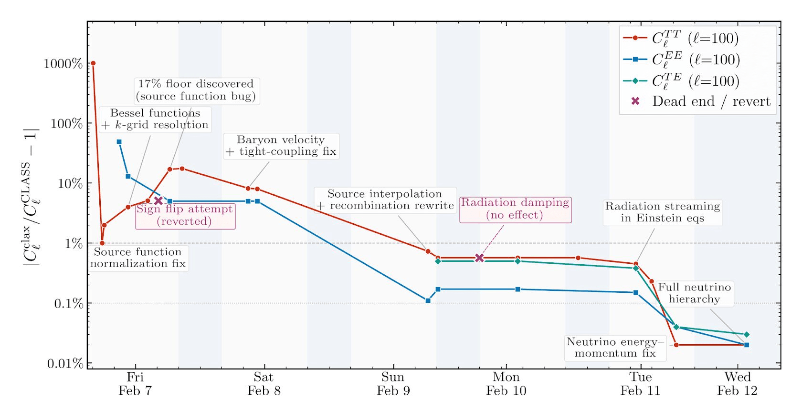

# 长时运行 Claude 做科学计算（中英对照）

> 原文标题：Long-running Claude for scientific computing
> 原文链接：https://www.anthropic.com/research/long-running-Claude
> 原文作者：Siddharth Mishra-Sharma（Anthropic Discovery 团队）
> 发布日期：2026-03-23
> **翻译模型：** GLM-5.3-Flash
> **评分：** ★★★★☆（4/5，强推荐）—— 用 Claude Code 多日 agent 工作流实现可微分宇宙学 Boltzmann 求解器：测试 oracle、CHANGELOG 记忆、Ralph 循环与 SLURM 编排的实操手册，与 01 目录 harness 系列呼应
> 排版：每段英文原文在前，中文翻译紧随其后。默认收录正文主体。

---

In this post, Siddharth Mishra-Sharma, a researcher on the Discovery team, explains how to apply multi-day agentic coding workflows—test oracles, persistent memory, and orchestration patterns—to scientific computing tasks even outside of one's domain.

本文中，Discovery 团队研究者 Siddharth Mishra-Sharma 讲解如何把多日 agentic 编程工作流——测试 oracle、持久记忆、编排模式——应用到科学计算任务上，即便是自己领域之外的任务。

## 前提（The premise）

Most scientists currently using AI agents work in a conversational loop, managing each step of the process on a tight leash. As models have become significantly better at long-horizon tasks over the last year or so, a new way of working emerged: rather than getting involved with every detail, we can specify the high-level objective and set a team of agents loose to work autonomously. This makes it possible to complete projects in mere hours that might otherwise take us days, weeks, or even months. Certain types of scientific tasks fit well within this model, e.g., reimplementing a numerical solver, converting legacy scientific software written in an old Fortran dialect to a modern language, and debugging a large codebase against a reference implementation. These are tasks where the work is well-scoped, the success criteria are clear, and human oversight can be occasional rather than continuous.

当前使用 AI agent 的多数科学家工作在对话循环里，用短绳牵着每一步。随着过去一年左右模型在长程任务上的显著进步，一种新的工作方式出现了：不必卷入每个细节，我们可以指定高层目标，放出一队 agent 自主工作。这让"数小时完成原本要数天、数周甚至数月的项目"成为可能。某些类型的科学任务很契合这一模式：例如重新实现一个数值求解器、把老 Fortran 方言写的科学软件移植到现代语言、对照参考实现调试大型代码库。这些任务的特点是：工作范围清晰、成功标准明确、人类监督可以是偶尔为之而非全程紧盯。

Anthropic's C compiler project demonstrated a version of this, where Claude worked across roughly 2,000 sessions to build a C compiler capable of compiling the Linux kernel. This post describes how to set up a similar pattern for scientific computing tasks using Claude Code, with a typical academic lab in mind. As a concrete example, I will walk through using Claude Opus 4.6 to implement a differentiable version of a cosmological Boltzmann solver. This is numerical code that predicts the statistical properties of the afterglow of the Big Bang—the Cosmic Microwave Background, or CMB. It does this by evolving coupled equations for photons, baryons, neutrinos, and dark matter through the early universe.

Anthropic 的 C 编译器项目演示了其中一种形态：Claude 跨约 2,000 个会话工作，造出了能编译 Linux 内核的 C 编译器。本文讲述如何用 Claude Code 为科学计算任务搭建类似模式（以典型学术实验室为预设场景）。作为具体例子，我将走一遍用 Claude Opus 4.6 实现宇宙学 Boltzmann 求解器的可微分版本。这是预测宇宙大爆炸余辉——宇宙微波背景（CMB）——统计性质的数值代码，通过在早期宇宙中演化光子、重子、中微子与暗物质的耦合方程来完成。

Boltzmann solvers like CLASS and CAMB are core pieces of scientific infrastructure in cosmology, allowing us to constrain cosmological models using data from surveys like Planck and the Simons Observatory. A differentiable version—one that can propagate gradients through the full solver—enables the use of gradient-based inference methods, dramatically speeding up parameter estimation. Writing it in JAX is a natural fit here, since it gives us automatic differentiation and compatibility with accelerators (e.g., GPUs) essentially for free. Notably, the task isn't in my core scientific domain—I have a high-level familiarity with the tools and the science, but don't have the expertise to complete it myself in any reasonable time frame. Groups who do have that expertise have built differentiable solvers in JAX with a subset of the features present in CLASS. These efforts typically represent months to years of researcher-time. The point here was to see if an agent could go further with minimal steering from a non-domain expert.

CLASS、CAMB 这类 Boltzmann 求解器是宇宙学的科学基础设施核心，让我们能用 Planck、Simons Observatory 等巡天数据约束宇宙学模型。可微分版本——能把梯度传过整个求解器的版本——让基于梯度的推断方法成为可能，大幅加速参数估计。用 JAX 写它是自然之选：自动微分与加速器（如 GPU）兼容性几乎白送。值得注意的是，这个任务不在我的核心科学领域——我对工具与科学有高层面的熟悉，但没有在任何合理时间内亲自完成的专长。拥有这一专长的团队用 JAX 建过带 CLASS 部分功能的可微分求解器；这些工作通常代表数月乃至数年的研究者时间。这里的要点是：看看 agent 能否在"非领域专家的最小引导"下走得更远。

This kind of task is structurally different from the C compiler project, which can be farmed out to a large number of parallel agents. A Boltzmann solver, on the other hand, is a deeply coupled pipeline—a small numerical error or poor approximation in modeling how the early universe recombines can subtly shift everything downstream. It thus requires a different set of agent skills. Debugging requires tracing causally through the entire chain and drawing from domain knowledge, which may be better suited to a single agent working sequentially, spawning subagents as needed, and using the reference implementation to bisect discrepancies.

这类任务与 C 编译器项目在结构上不同——后者可以分包给大量并行 agent。Boltzmann 求解器则是深度耦合的管线：在"早期宇宙如何复合"的建模上一个小小的数值误差或糟糕的近似，就会微妙地挪动下游的一切。因此它需要另一套 agent 技能：调试要求沿整条链做因果追溯、调用领域知识——这更适合单个 agent 顺序工作、按需孵化 subagent、并用参考实现对差异做二分定位。

We'll use an HPC cluster running the SLURM job scheduler as our compute environment, but the core ideas—a progress file, a test oracle, an agent prompt with clear rules—apply regardless of where you run Claude Code.

我们的计算环境是跑 SLURM 作业调度器的 HPC 集群，但核心想法——进度文件、测试 oracle、规则明确的 agent 提示——无论你在哪里跑 Claude Code 都适用。

## 起草计划并本地迭代（Draft a plan and iterate locally）

In this shift toward managing an autonomous research team of agents, you should spend most of your time (in consultation with Claude), crafting a set of instructions that clearly articulates the project's deliverables and relevant context. These instructions should live in a CLAUDE.md file located in the root directory. Claude treats this file specially, keeping it in context and referencing it for the overall plan. Crucially, Claude can edit these instructions as it works, updating them for future work as it works through issues.

在向"管理一支自主研究的 agent 团队"的转变中，你应把大部分时间（与 Claude 商议着）用于打磨一套指令：清晰陈述项目的交付物与相关语境。这些指令应放在根目录的 CLAUDE.md 文件里。Claude 会特殊对待这个文件——保持在上下文中、并作为总体计划的参照。关键在于：Claude 可以在工作中编辑这些指令，边处理问题边为后续工作更新它们。

Here is an early CLAUDE.md for the cosmological Boltzmann solver project, showing the overall plan and design decisions codified after an initial attempt at writing the solver. To arrive at this, I specified the high-level goals of the project—achieving full feature-parity with the reference CLASS implementation while being fully differentiable, and having an accuracy target of 0.1% against CLASS in the main science deliverables—and iterated with Claude until the plan seemed satisfactory. Given that 0.1% is the typical level of agreement between the two canonical Boltzmann codes CLASS and CAMB, this seemed like a good science target.

这是该宇宙学 Boltzmann 求解器项目早期的 CLAUDE.md，展示了在首次尝试写求解器之后固化下来的总体计划与设计决策。为得到它，我先给出项目的高层目标——与参考实现 CLASS 达到完全功能对等、同时完全可微分，且主要科学交付物对 CLASS 的精度目标为 0.1%——然后与 Claude 迭代直到计划令人满意。鉴于 0.1% 正是两大经典 Boltzmann 代码 CLASS 与 CAMB 之间的一致性水平，这似乎是个不错的科学目标。

## 跨会话的记忆（Memory across sessions）

The progress file, which by convention we call here CHANGELOG.md, is the agent's portable long-term memory, acting as a sort of lab notes. In CLAUDE.md, Claude was instructed to keep track of progress in this file.

进度文件——按惯例这里叫 CHANGELOG.md——是 agent 便携的长期记忆，类似实验记录。CLAUDE.md 中指示 Claude 在此文件里跟踪进度。

A good progress file might track current status, completed tasks, failed approaches and why they didn't work, accuracy tables at key checkpoints, and known limitations. The failed approaches are important—without them, successive sessions will re-attempt the same dead ends. An entry might look like: "Tried using Tsit5 for the perturbation ODE, system is too stiff. Switched to Kvaerno5." Here is the changelog for the running example, showing these elements.

好的进度文件应记录当前状态、已完成的任务、失败的路径及其原因、关键检查点的精度表、以及已知局限。失败路径很重要——没有它们，后续会话会重新踩进同样的死胡同。一条记录可能形如："Tried using Tsit5 for the perturbation ODE, system is too stiff. Switched to Kvaerno5.（试过用 Tsit5 解扰动 ODE，系统太刚性。换成了 Kvaerno5。）"这里是我们运行例子的 changelog，展示了这些要素。

## 测试 oracle（The test oracle）

While more open-ended scientific discovery via agents is certainly on the horizon, long-running autonomous scientific work today crucially depends on the agent having a way to know whether it's making progress. For scientific code, this could be a reference implementation, a clearly quantifiable objective, or an existing test suite. It can also be helpful to instruct the agent to expand the test suite and run tests as it works, to prevent regressions. In my example task, Claude was instructed to construct and continuously run unit tests using CLASS C source as a reference implementation.

虽然经由 agent 做更开放的科学发现肯定已在视野之内，但当下长时自主的科学工作，关键取决于 agent 是否有办法知道自己是否在取得进展。对科学代码而言，这可以是参考实现、清晰可量化的目标、或现成的测试套件。指示 agent 在工作中扩充测试套件并持续跑测试以防回归，也很有帮助。在我的示例任务中，Claude 被指示以 CLASS 的 C 源码为参考实现，构建并持续运行单元测试。

## 用 Git 做协调（Git as coordination）

Git can be a good way to monitor and coordinate the agent's progress in a hands-off manner. The agent should commit and push after every meaningful unit of work. This gives you a recoverable history if something goes awry, makes progress visible locally, and prevents work from being lost if, for instance, your compute allocation runs out mid-session.

Git 是"放手式"监控与协调 agent 进度的好办法。agent 应在每个有意义的工作单元后 commit 并 push。这给你一份可恢复的历史（出问题时）、让进度本地可见，并防止诸如计算配额在会话中途耗尽时工作丢失。

Practically, this could be a set of instructions in CLAUDE.md, e.g. "Commit and push after every meaningful unit of work. Run `pytest tests/ -x -q` before every commit. Never commit code that breaks existing passing tests."

实践中，这可以是 CLAUDE.md 里的一组指令，如："Commit and push after every meaningful unit of work. Run `pytest tests/ -x -q` before every commit. Never commit code that breaks existing passing tests.（每个有意义的工作单元后 commit 并 push。每次 commit 前运行 `pytest tests/ -x -q`。绝不提交破坏现有通过测试的代码。）"

For steering the agent, you can always SSH into the cluster and manually re-prompt and/or update its instructions. It is typically more ergonomic to simply ask a local instance of Claude Code to SSH in and run commands for you; this will also apply to everything described below.

要引导 agent，你随时可以 SSH 进集群手动重新提示、或更新其指令。但通常更符合人体工学的是：让本地一个 Claude Code 实例替你 SSH 进去执行命令——下文的一切操作同样如此。

## 执行循环（The execution loop）

As mentioned above, it's often useful to first iterate on the plan locally until you have one that looks reasonable and is encoded in CLAUDE.md. From there, start a Claude Code session inside a terminal multiplexer like tmux on a compute node, tell the agent where to find your codebase, and let it cook. Because the session runs inside tmux, you can detach, close your laptop, and occasionally check on progress (in the case of the Boltzmann solver, I would check in on GitHub on my phone, e.g. while waiting in line for a coffee).

如上所述，先在本地把计划迭代到看起来合理、并固化进 CLAUDE.md，往往很有用。此后，在计算节点的终端复用器（如 tmux）里启动一个 Claude Code 会话，告诉 agent 代码库在哪里，然后让它开火。由于会话跑在 tmux 里，你可以 detach、合上笔记本、偶尔查看进度（Boltzmann 求解器的例子中，我会用手机看 GitHub——比如排队买咖啡时）。

On an HPC cluster you might request a node through the SLURM scheduler, and an example job script that launches Claude Code in a tmux session might look like the following:

在 HPC 集群上你可能要经 SLURM 申请节点；一个在 tmux 会话中启动 Claude Code 的示例作业脚本如下：

```
#!/bin/bash
#SBATCH --job-name=claude-agent
#SBATCH --partition=GPU-shared
#SBATCH --gres=gpu:h100-32:1
#SBATCH --time=48:00:00
#SBATCH --output=agent_%j.log
cd $PROJECT/my-solver
source .venv/bin/activate
export TERM=xterm-256color
tmux new-session -d -s claude "claude; exec bash"
tmux wait-for claude
```

Once the job starts, you attach to the tmux session, give Claude Code direction (e.g., "Read CHANGELOG.md and pick up the next task"), and detach when you're satisfied it's on the right track. You can re-attach whenever you want to check in, steer, or start a new task using something like:

作业启动后，你 attach 到 tmux 会话，给 Claude Code 指示（如"Read CHANGELOG.md and pick up the next task"），确认它上了正轨后 detach。想查看、引导或开新任务时，随时用类似命令重新 attach：

```
srun --jobid=JOBID --overlap --pty tmux attach -t claude
```

The Ralph loop: As models get more capable, they require less bespoke orchestration such as prompt engineering, RAG, or context stuffing. At a given point in time, however, it can be useful to provide some level of scaffolding as a capability uplift. For example, current models can suffer from agentic laziness—when asked to complete a complex, multi-part task, they can sometimes find an excuse to stop before finishing the entire task ("It's getting late, let's pick back up again tomorrow?").

Ralph 循环：随着模型越来越能干，它们对提示工程、RAG、上下文填充这类定制编排的需求在减少。但在给定时间点上，提供某种程度的脚手架作为能力增益仍有用。例如，当前模型会有 agentic laziness（agent 偷懒）的毛病——被要求完成复杂的多部分任务时，它们有时会找借口在完成整个任务前停下（"It's getting late, let's pick back up again tomorrow?（不早了，明天再继续？）"）。

To circumvent this, a useful orchestration pattern is the Ralph loop, which is essentially a for loop which kicks the agent back into context when it claims completion, and asks if it's really done. This can be useful for long-running tasks since the agent will admit the task is not up to spec, and continue working until it is. Other similar patterns include GSD (and domain-specific variants) as well as the native-to-Claude Code /loop command.

为绕开这一点，一个有用的编排模式是 Ralph 循环（Ralph loop）：本质上是一个 for 循环，在 agent 声称完成时把它踹回上下文、问它是否真的做完了。这对长时任务很有用，因为 agent 会承认任务未达规格、并继续工作直到达标。类似的模式还有 GSD（及领域特定变体），以及 Claude Code 原生的 /loop 命令。

Ralph can be installed via /plugin. A typical invocation prompt in Claude Code could look like

Ralph 可经 /plugin 安装。Claude Code 中典型的调用提示形如：

```
/ralph-loop:ralph-loop "Please keep working on the task until the success criterion of 0.1% accuracy across the entire parameter range is achieved." --max-iterations 20 --completion-promise "DONE"
```

Here, Claude will iterate up to 20 times until it guarantees that the task is done with a "DONE" incantation.

这里 Claude 将迭代至多 20 次，直到它以一句"DONE"咒语保证任务完成。

## 结果（The result）

Claude worked on the project from scratch over a few days, reaching sub-percent agreement with the reference CLASS implementation across its various outputs. I asked Claude to reconstruct the accuracy of some of the main outputs of the code—the various CMB angular power spectra—over the course of the project, also labeling milestones during development. It produced the plot below, illustrating the path to sub-percent accuracy.

Claude 从零开始在这个项目上工作了几天，其各项输出与参考实现 CLASS 达到了亚百分比的一致性。我让 Claude 重构了代码主要输出——各条 CMB 角功率谱——在整个项目过程中的精度曲线，并标注开发中的里程碑。它画出了下面这张图，展示通往亚百分比精度的路径。



> Accuracy of the CMB angular power spectra converging to sub-percent agreement over the course of development.

The agent's development trajectory was somewhat clunky. For example, there were clear gaps in its test coverage—for a while it was only testing the code at a single (fiducial) parameter point, drastically reducing its bug-catching surface area. It can also make elementary mistakes, such as tripping over gauge conventions or spending hours chasing bugs that a cosmologist would spot instantly, but it kept making sustained progress towards the stated goal of sub-percent accuracy.

agent 的开发轨迹有些笨拙。比如它的测试覆盖有明显缺口——有段时间只在单一（基准）参数点上测试代码，大幅缩小了抓 bug 的覆盖面。它也会犯初级错误：在规范约定上绊倒，或花几个小时追一个宇宙学家一眼就能看出的 bug。但它持续朝着"亚百分比精度"的目标稳步推进。

A side effect of the project was that I learned a surprising amount about Boltzmann solvers and the physics they model by watching the git commit history. The project isn't drawn from my core scientific domain, but following Claude's incremental progress and looking up what I didn't recognize turned out to be an effective way to osmose the science. The commit log reads like lab notes from a fast, hyper-literal postdoc.

这个项目的副作用是：通过盯 git 提交历史，我对 Boltzmann 求解器及其物理的了解了多得惊人。项目虽不取自我的核心科学领域，但跟随 Claude 的增量进展、查证我不认识的东西，竟是一种有效的科学渗透法。提交记录读起来像一个手脚飞快、极度较真的博士后的实验笔记。

While the resulting solver is not production-grade (e.g., it doesn't match the reference CLASS implementation to an acceptable accuracy in every regime), it demonstrates that agent-driven development can compress months or even years of researcher work into days.

虽然产出的求解器还不是生产级（例如并非在所有区间都能以可接受的精度匹配参考实现 CLASS），它证明了：agent 驱动的开发可以把数月乃至数年的研究者工作压缩到几天。

This kind of compression changes what counts as idle time. A universal experience in AI research is to launch an experiment (e.g., a training run) overnight and then have the satisfaction of seeing the results in the morning. Not running the experiment comes with an opportunity cost. These days, not running agents feels like it has a cost as well. If you have the compute and projects with well-defined success criteria, every night you don't have agents working for you is potential progress left on the table.

这种压缩改变了"什么算闲置时间"。AI 研究的普遍体验是：晚上挂一个实验（如训练），早晨心满意足地看结果。不跑实验有机会成本；如今，不跑 agent 似乎也有成本。如果你有算力、以及成功标准清晰的项目，每一个没有 agent 为你工作的夜晚，都是被留在桌上的潜在进展。

## 致谢（Acknowledgments）

We thank Eric Kauderer-Abrams for peer-review, as well as Xander Balwit, Ethan Dyer, and Rebecca Hiscott for providing helpful feedback.

感谢 Eric Kauderer-Abrams 同行评审，以及 Xander Balwit、Ethan Dyer 与 Rebecca Hiscott 提供的有益反馈。
