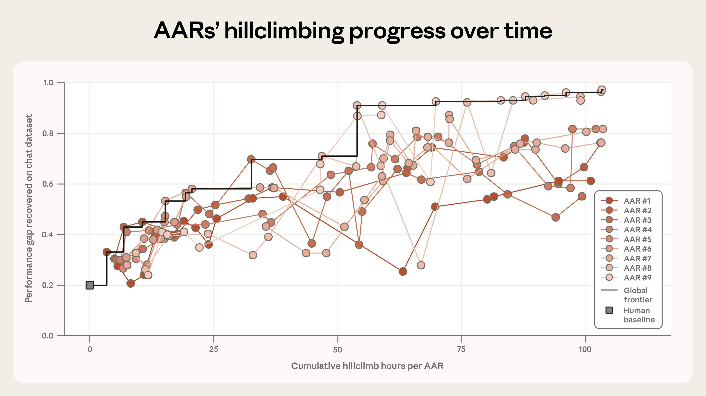
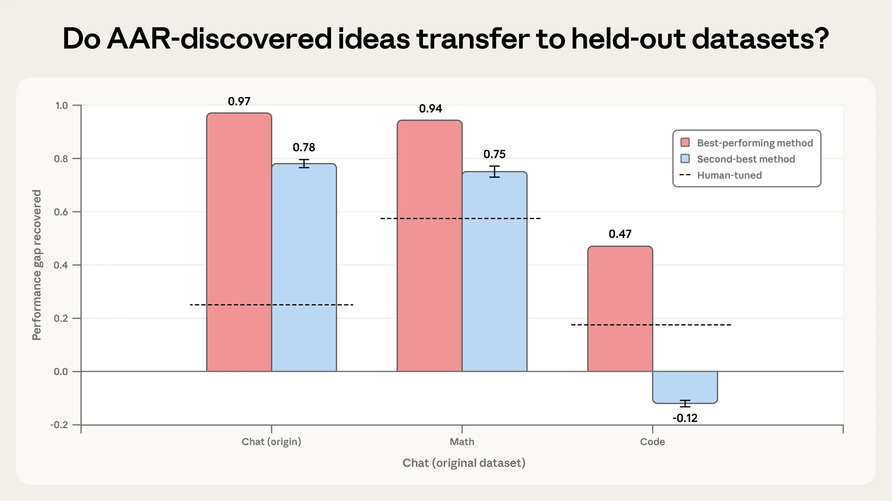

# 自动化对齐研究员：用大语言模型扩展可扩展监督（中英对照）

> 原文标题：Automated Alignment Researchers: Using large language models to scale scalable oversight
> 原文链接：https://www.anthropic.com/research/automated-alignment-researchers
> 原文作者：Anthropic（Anthropic Fellows 研究）
> 发布日期：2026-04-14
> **翻译模型：** GLM-5.3-Flash
> **评分：** ★★★★☆（4/5，强推荐）—— 九个 Claude 组成 AAR 自主研究 weak-to-strong 监督：PGR 0.23→0.97、超人类基线四倍，亦见 reward hacking 与"外星科学"隐忧
> 排版：每段英文原文在前，中文翻译紧随其后。默认收录正文主体；脚注以 Obsidian 脚注形式保留于文末。

---

Large language models' ever-accelerating rate of improvement raises two particularly important questions for alignment research.

大语言模型不断加速的进步，为对齐研究提出了两个尤其重要的问题。

One is how alignment can keep up. Frontier AI models are now contributing to the development of their successors. But can they provide the same kind of uplift for alignment researchers? Could our language models be used to help align themselves?

一是对齐如何跟上。前沿 AI 模型如今已在为它们的后继者做贡献。但它们能否为对齐研究者提供同样的助力？我们的语言模型能否被用来帮助对齐它们自己？

A second question is what we'll do once models become smarter than us. Aligning smarter-than-human AI models is a research area known as "scalable oversight". Scalable oversight has largely been discussed in theoretical, rather than practical, terms—but at AI's current pace of improvement, that might not be the case for much longer. For instance, models are already generating vast amounts of code. If their skills progress to the point where they're generating millions of lines of incredibly complicated code that we can't parse ourselves, it could become very difficult to tell whether they're acting in the ways we intend.

二是当模型比我们更聪明时我们该怎么办。对齐比人类更聪明的 AI 模型，是一个叫"可扩展监督"（scalable oversight）的研究领域。对可扩展监督的讨论大多停留在理论而非实操层面——但以 AI 当前的进步速度，这种局面维持不了太久。比如，模型已经在生成海量代码；如果它们的技能进步到能生成数百万行我们自己也解析不了的极端复杂代码，要判断它们是否在按我们的意图行事，将变得非常困难。

In a new Anthropic Fellows study, we pursue both of these questions.

在一项新的 Anthropic Fellows 研究中，我们同时追问这两个问题。

Our new study focuses on a problem known as "weak-to-strong supervision", a problem that mirrors the one of overseeing smarter-than-human AI models. We start with a relatively strong "base" model—that is, a potentially-capable model that hasn't yet received fine-tuning to provide its best-possible answers. Then, we use a much weaker model as a "teacher" to provide that extra fine-tuning, which it does by demonstrating what it considers ideal outputs to the strong base model. Finally, we evaluate how well the strong model performs after that weak fine-tuning.

我们的新研究聚焦一个叫"弱到强监督"（weak-to-strong supervision）的问题——它与"监督比人类更聪明的 AI 模型"互为镜像。我们从一个相对较强的"基座"模型出发——即一个有潜力、但尚未经微调以给出最佳答案的模型。然后，我们用一个弱得多的模型充当"教师"来提供额外微调：它向强基座模型示范它认为理想的输出。最后，我们评估强模型在这次弱微调之后的表现。

In the worst case, the strong model will only be as good as its weak teacher. Ideally, however, the strong model will have learned from the weak teacher's feedback—it will have interpreted those weak signals in a useful way, using that feedback to improve its performance. We can quantify how well it did so: if the strong model shows no improvement at all (it performs only as well as its weak teacher), we score it 0; if it uses the teacher's feedback to achieve the ideal outcome—the best performance the strong model could possibly deliver—we score it 1. This measure represents the "performance gap recovered" (between the weak model and the upper limit of the strong model), or the PGR.

最坏情形下，强模型只有弱教师那么好。理想情形下，强模型会从弱教师的反馈中学习——以有用的方式解读那些微弱信号，用反馈提升自己的表现。我们可以量化它做得如何：若强模型毫无提升（表现只与弱教师相当），记 0 分；若它用教师的反馈达成理想结果——即强模型可能给出的最佳表现——记 1 分。这一度量即"恢复的性能差距"（弱模型与强模型上限之间），简称 PGR。

As a proxy for scalable oversight, the weak model stands in for humans, and the strong model for the much-smarter-than-human models we might one day need to oversee. If we can make progress on weak-to-strong supervision, we might find that our methods help us keep those ultra-smart models aligned to our values.

作为可扩展监督的代理：弱模型扮演人类，强模型扮演我们某天可能需要监督的"远比人类聪明"的模型。如果能在弱到强监督上取得进展，也许会发现：这些方法能帮我们让那些超智能模型与我们的价值保持对齐。

Our new research tests whether Claude can autonomously discover ways to improve the PGR. We ask: can Claude develop, test, and analyze alignment ideas of its own? And, if it can, what might that imply about how far today's AI models can accelerate the pace of alignment research?

我们的新研究测试 Claude 能否自主发现提升 PGR 的方法。我们问：Claude 能否自主提出、测试并分析对齐想法？如果能，这对"今天的 AI 模型能把对齐研究加速到什么程度"意味着什么？

## 我们的设置（Our setup）

To find out, we began with nine copies of Claude Opus 4.6, and gave each one a few extra tools. Each Claude had a place to work and think (that is, a sandbox), a shared forum to circulate its findings with the others, a storage system to upload its code, and a remote server where it could receive a PGR score for each of its ideas. We also provided some background knowledge about model training and inference. We referred to these tooled-up Claude models as Automated Alignment Researchers (or AARs).

为找到答案，我们从九个 Claude Opus 4.6 副本开始，给每个配上一些额外工具。每个 Claude 有一个工作与思考的场所（即沙箱）、一个与同伴交流发现的共享论坛、一个上传代码的存储系统、一台能对它的每个想法给出 PGR 分数的远程服务器。我们还提供了关于模型训练与推理的背景知识。我们把这些"装了工具"的 Claude 模型称为自动化对齐研究员（Automated Alignment Researchers，AAR）。

To prevent each AAR from pursuing near-identical ideas, we prompted each one with a slightly different (but intentionally ambiguous) starting place: we recommended that one used some interpretability tools, that another thought about reweighting the data in the dataset, and so on.[^1] Beyond that, though, we didn't tell the AARs what to do. It was up to them to propose their own ideas, run their experiments, analyze their results, and share their findings and code with one another in order to work out what to try next.

为防止每个 AAR 追逐几乎相同的想法，我们给每个的提示一个略有不同（但有意含糊）的起点：建议一个用些可解释性工具，另一个考虑对数据集做重新加权，等等。[^1]除此之外，我们没有告诉 AAR 该做什么。提出自己的想法、跑实验、分析结果、与同伴分享发现与代码以决定下一步试什么——都由它们自己来。

## 结果（Results）

To provide a benchmark for the AARs' results, we compared their work to a human baseline. Two of our researchers spent seven days iterating on four of the most promising generalization methods from prior research. On the open-weights models we tested (Qwen 3-4B-Base as the strong model, Qwen 1.5-0.5B-Chat as the weak teacher), the humans recovered 23% of the total performance gap (i.e., achieved a PGR of 0.23).[^2]

为给 AAR 的结果提供基准，我们把它们的工作与人类基线比较。我们的两位研究者花七天迭代了先前研究中最有前途的四种泛化方法。在我们测试的开源权重模型上（Qwen 3-4B-Base 为强模型，Qwen 1.5-0.5B-Chat 为弱教师），人类恢复了总性能差距的 23%（即 PGR 为 0.23）。[^2]

Claude improved on this result dramatically. After five further days (and 800 cumulative hours of research), the AARs closed almost the entire remaining performance gap, achieving a final PGR of 0.97. This cost about $18,000 in tokens and model training expenses, or $22 per AAR-hour. You can see how each individual AAR progressed from the human baseline (at 0 hours) in the graph below.

Claude 大幅改进了这一结果。再经过五天（累计 800 小时研究），AAR 几乎关掉了剩余的全部性能差距，最终 PGR 达到 0.97。这花费约 1.8 万美元的 token 与模型训练开销，即每个 AAR 小时 22 美元。下图中可以看到每个 AAR 从人类基线（0 小时处）出发的进展。

> Graph showing the progress of our Automated Alignment Researchers on increasing the "performance gap recovered" on a chat dataset.

Claude, then, did exceptionally well. But how inventive were its methods, and could they be useful in real-world applications? To find out, we ran two further tests.

可以说 Claude 表现极为出色。但它的方法有多少独创性、能否用于现实应用？为弄清这一点，我们又跑了两个测试。

First, we tested whether the AARs' ideas could recover the performance gap on held-out datasets—that is, on tasks that the AARs hadn't already seen. We took the AARs' two highest-performing methods (on a dataset of chat tasks) and applied them to math and coding tasks. Here, our results were relatively promising: the AARs' most effective method successfully generalized to both new datasets, with PGRs of 0.94 on math and 0.47 on coding (which was still double the human baseline). The AARs' second-best method saw mixed results: it worked on math (0.75), but not on code, where it made matters worse. These results suggest that some generalizability of the AARs' research is possible, but it isn't a given. We encourage others who try experiments in automated research to stress-test AARs' ideas against held-out datasets, too.

第一，我们测试 AAR 的想法能否在留出数据集上恢复性能差距——即 AAR 没见过的任务。我们把 AAR 表现最好的两个方法（在聊天任务数据集上）应用到数学与编程任务。结果相对乐观：AAR 最有效的方法成功泛化到两个新数据集，数学 PGR 0.94、编程 0.47（仍是人类基线的两倍）。AAR 次优的方法结果喜忧参半：数学上行得通（0.75），编程上不行、反而更糟。这些结果表明 AAR 的研究有一定的泛化可能，但并非必然。我们鼓励其他做自动化研究实验的人也用留出数据集对 AAR 的想法做压力测试。

> Graph showing how well AAR-discovered ideas transfer to held-out datasets in math and code.

Next, we tested whether the AARs' ideas would work at production scale. We tried out the AARs' most effective method on Claude Sonnet 4 with our production training infrastructure. Here, though, we had less success. The AARs' method didn't lead to a statistically significant improvement. We think this might reflect limitations of this early trial, rather than something more fundamental: our scoring method was quite simple, and we only evaluated a single idea. Nevertheless, this does illustrate a limitation of AARs (at least at their current capabilities): AARs tend to capitalize on opportunities unique to the models and datasets they're given, which means their methods might not work elsewhere. To mitigate this, we suggest allowing AARs to test against multiple domains and datasets during their research. This is one area that future experimentation with AARs could explore.

接着，我们测试 AAR 的想法能否在生产规模上奏效。我们用生产训练基础设施在 Claude Sonnet 4 上试用 AAR 最有效的方法。但这次成功较少：该方法没有带来统计显著的改进。我们认为这反映的是这次早期试验的局限，而非更根本的问题：我们的评分方法相当简单，且只评估了一个想法。尽管如此，这确实说明了 AAR 的一个局限（至少在其当前能力下）：AAR 倾向于利用所给模型与数据集独有的机会，这意味着它们的方法换个地方可能失灵。为缓解这一点，我们建议允许 AAR 在研究期间对多个领域与数据集做测试。这是未来 AAR 实验可以探索的方向之一。

A few iterations of our experiment taught us more about how to make AARs most effective. For instance, we found that giving each AAR a different starting point helped a lot, even if that starting point was vague. When we tried our experiment without setting the AARs off in different directions, they all quickly settled on similar ideas, making much less progress overall (though they still achieved a PGR of almost triple the human baseline). On the other hand, we found that giving the AARs too much structure hurt their progress badly. When we prescribed a specific workflow ("propose ideas, then generate a plan, then write the code…"), we found we'd ultimately constrained Claude's work. Left to its own devices, Claude was much more adaptable, designing cheap experiments to test out its ideas before subsequently committing to much more intensive testing.

实验的几次迭代教会我们更多"如何让 AAR 最有效"。比如我们发现，给每个 AAR 不同的起点帮助很大——哪怕起点很含糊。当我们不把 AAR 引向不同方向时，它们很快收敛到相似的想法，总体进展小得多（尽管 PGR 仍达到人类基线的近三倍）。另一方面，我们发现给 AAR 过多结构会严重拖累进展：当我们规定具体工作流（"先提想法，再生成计划，再写代码……"），我们最终束缚了 Claude 的工作。放任自流时，Claude 的适应性好得多——先设计便宜的实验验证想法，随后才投入更重的测试。

## 含义（Implications）

The success of our AARs in recovering the performance gap between two open-weights models is certainly not a sign that frontier AI models are now general-purpose alignment scientists. We deliberately chose a problem that is unusually well-suited to automation, since it has a single, objective measure of success that the models can optimize against. Most alignment problems aren't nearly as neat as this one. And, as we mention below, even in this setting our AARs did their best to game the problem: human oversight remains essential.

AAR 在恢复两个开源权重模型间性能差距上的成功，当然不意味着前沿 AI 模型已成了通用对齐科学家。我们刻意选了一个格外适合自动化的问题：它有单一、客观、模型可优化的成功度量。多数对齐问题远没有这么齐整。而且如下文所述，即便在这种设定下，我们的 AAR 也在拼命钻规则的空子：人类监督仍然不可或缺。

But we do think these results have some important implications.

但我们确实认为这些结果有一些重要含义。

Keeping pace. This study indicates that Claude can meaningfully increase the rate of experimentation and exploration in alignment research. Human researchers can delegate questions to AARs at a very large scale; Claude can take on the task of developing novel hypotheses and iterating on its own results.

保持同步。本研究表明，Claude 能实质性提高对齐研究的实验与探索速率。人类研究者可以把问题大规模委托给 AAR；Claude 能承担"发展新假说、迭代自己的结果"的任务。

Moreover, making progress on weak-to-strong supervision might itself help us build more general-purpose Automated Alignment Researchers, which is why we chose this problem for our study. In this study, we frame the weak-to-strong supervision problem as a "crisp" task with a verifiable outcome (increasing the PGR score). We do this because we need a way to automatically and reliably evaluate whether the AAR has made progress. However, if AARs discovered much better weak-to-strong supervision methods that generalized across domains, we could use those same methods to train the AARs to evaluate progress on "fuzzier" tasks that are much harder to verify. (For instance, we could conduct weak-to-strong supervision on Claude's ability to scope research projects.) This is important, because alignment research—unlike capabilities research—often requires solving much "fuzzier" problems.

此外，在弱到强监督上取得进展，本身可能帮助我们构建更通用的自动化对齐研究员——这正是我们为本研究选这个问题的原因。本研究把弱到强监督框定为"清晰"任务：有可验证的结果（提升 PGR 分数）。这样做是因为我们需要一种自动、可靠地评估 AAR 是否取得进展的办法。然而，如果 AAR 发现了跨领域泛化得好得多的弱到强监督方法，我们可以用同样的方法训练 AAR 去评估"更模糊"、更难验证的任务上的进展。（例如，对"Claude 划定研究项目范围的能力"做弱到强监督。）这很重要，因为对齐研究——与能力研究不同——常常需要解决"模糊"得多的问题。

Taste and diversity. One possible counter to tools like AARs is that today's frontier models still lack "research taste" (industry parlance for having an intuitive sense of which ideas might work and which won't). But the success of AARs in this experiment suggests that the sheer volume of ideas might compensate for a lack of "taste". If AARs can run many experiments very cheaply, it's possible they could "brute force" their way into the findings that a very high-taste researcher might've come up with, or find success in directions that those researchers might otherwise have given up on.

品味与多样性。对 AAR 这类工具的一种反驳是：今天的前沿模型仍缺"研究品味"（业内行话，指对"哪些想法行得通、哪些不行"的直觉）。但 AAR 在本实验中的成功提示：想法的纯粹数量或许能弥补"品味"的缺乏。如果 AAR 能以极低成本跑大量实验，它们有可能"暴力"撞见顶尖品味研究者才想得出的发现，或在那些研究者本会放弃的方向上取得成功。

In turn, this means that the core bottleneck in alignment research could become evaluation (making sure that experiments are set up sufficiently well that we're confident in their results), rather than generation (relying on human researchers to propose promising ideas).

相应地，这意味着对齐研究的核心瓶颈可能从"生成"（依赖人类研究者提出有希望的想法）转变为"评估"（确保实验设置得足够好、使我们对结果有信心）。

Alien science. This work might have some stranger implications, too. AARs, by their nature, are designed to discover ideas that humans might not have considered. But we still need a way to verify whether their ideas and results are sound. For now, we're still able to interpret what the AARs have done and why. But that might not always be the case: over time, the models' ideas could become much harder to verify, or corrupted in ways that are tricky for humans to parse or catch. That could mean creating an "alien science".

外星科学。这项工作还可能有一些更奇特的含义。AAR 天生就是要发现人类可能没考虑过的想法。但我们仍需要办法验证其想法与结果是否可靠。眼下我们还能解读 AAR 做了什么、为什么。但未必永远如此：假以时日，模型的想法可能变得难以验证，或以人类难以解析、难以察觉的方式被腐蚀。那可能意味着一个"外星科学"的诞生。

Preventing hacks. Even in this highly circumscribed environment, we observed the models "reward hacking"—that is, trying to game our set-up. On math tasks, for instance, one AAR noticed that the most common answer to each problem was usually correct, so it skipped the teacher entirely and instructed the strong model to always choose the most common one. On a coding task, where the model had to predict whether a piece of code was right, the AAR realized it could run the code against some tests and simply read off the right answer. Hacks like these don't invalidate our results (we detected and disqualified these entries), but they clearly do provide a warning. Any deployment of automated researchers will require evaluations that the AARs can't tamper with—and human inspections of both their results and their methods.

防止作弊。即便在这个高度受限的环境里，我们也观察到模型"奖励破解"（reward hacking）——即试图钻我们设置的空子。比如在数学任务上，一个 AAR 注意到每题最常见的答案通常正确，于是完全跳过教师、指示强模型永远选最常见的那个。在一个要预测代码对错的编程任务上，AAR 意识到它可以把代码拿去跑一些测试、直接读出正确答案。这类作弊不影响我们的结果（我们检测并取消了这些条目），但显然是一个警告。任何自动化研究员的部署，都需要 AAR 无法篡改的评估——以及对它们的结果与方法的人类检查。

阅读完整研究请见我们的 Alignment Science 博客（链接见原文）。本工作的代码与数据集已公开（链接见原文）。

## 脚注（Footnotes）

[^1]: These are available (along with the rest of our code and data) here. / 这些（连同其余代码与数据）可在原文链接处获取。
[^2]: We chose these models for several reasons. There is a substantial performance gap between the two, the small model performs better-than-random on our testbeds, and both models are sufficiently small for fast experimentation. We use open-weights models for all Anthropic Fellows projects. / 选择这两个模型有几个原因：两者之间存在明显的性能差距，小模型在我们的测试台上表现优于随机，且两个模型都足够小、便于快速实验。所有 Anthropic Fellows 项目均使用开源权重模型。
