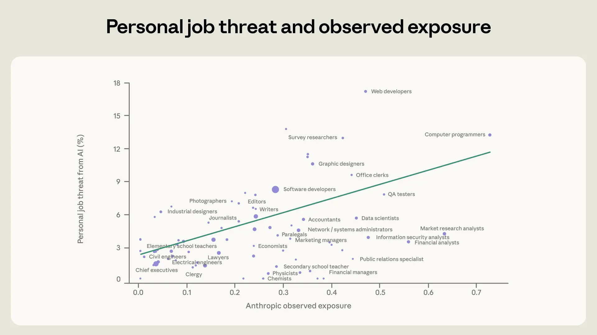
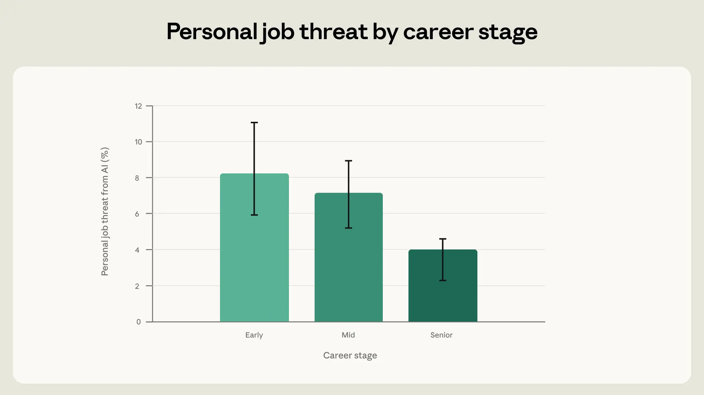
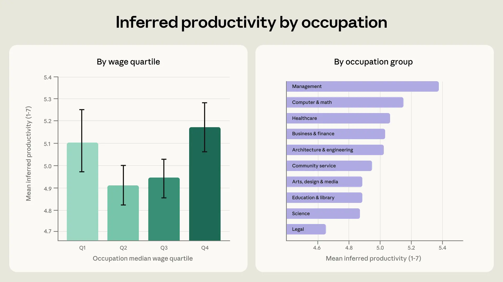
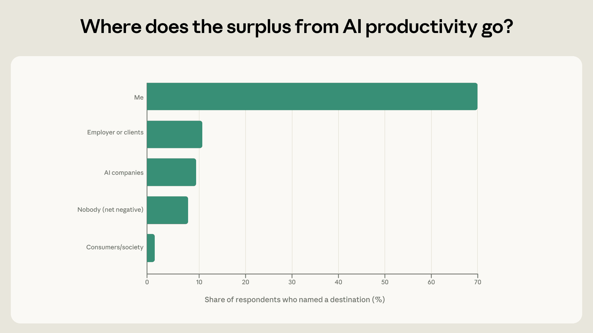
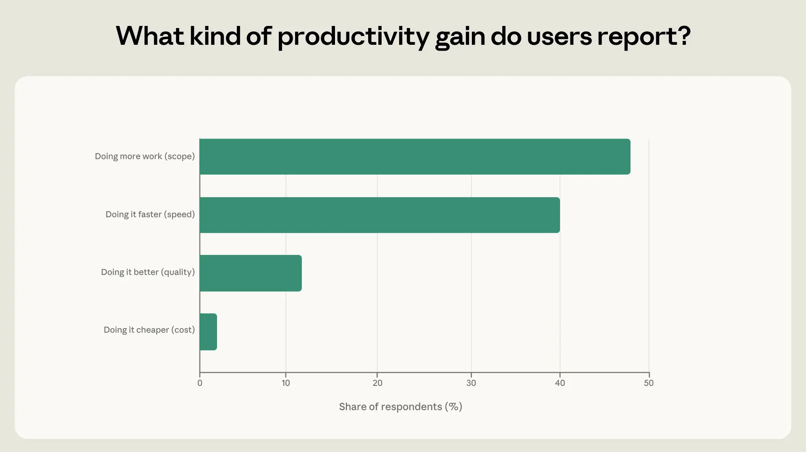
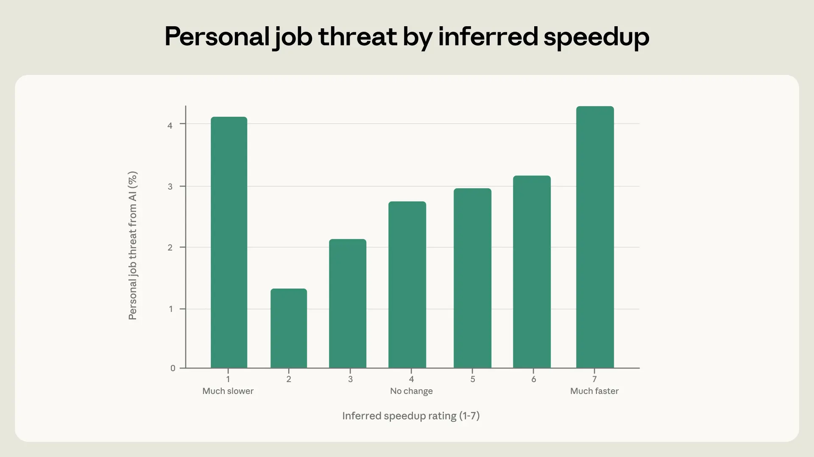

# 81,000 人告诉我们关于 AI 经济的什么（中英对照）

> 原文标题：What 81,000 people told us about the economics of AI
> 原文链接：https://www.anthropic.com/research/81k-economics
> 原文作者：Maxim Massenkoff、Saffron Huang（Anthropic）
> 发布日期：2026-04-22
> **翻译模型：** GLM-5.3-Flash
> **评分：** ★★★★☆（4/5，强推荐）—— 8.1 万用户大调查：暴露度与失业焦虑正相关、薪资两端生产率增益最大、提速最快者最焦虑
> 排版：每段英文原文在前，中文翻译紧随其后。默认收录正文主体；脚注以 Obsidian 脚注形式保留于文末。

---

#### Key findings:

#### 主要发现：

- Our recent survey of 81,000 Claude users shows that people who work in roles that are more exposed to AI have more concerns about AI-driven job displacement. These concerns are also higher among early-career respondents.
- 我们近期对 81,000 名 Claude 用户的调查显示：工作角色越暴露于 AI 的人，对 AI 驱动的岗位替代越担忧。职业早期的受访者担忧也更高。

- Those in the highest- and lowest-paid occupations report the largest productivity gains, most commonly from increases in scope (doing new tasks).
- 报告生产率增益最大的是薪资最高与最低两类职业，最常见源于范围扩大（做新任务）。

- Respondents experiencing the largest speedups from AI express higher concern about job displacement.
- 因 AI 提速最多的受访者，对岗位替代的担忧更高。

In order to inform the public about the economic changes we're observing with AI, our Economic Index shares what work Claude is being asked to do, and in which jobs Claude is doing the largest share of tasks. To date, however, we've lacked information on how these usage patterns map onto people's thoughts and impressions of AI.

为了让公众了解我们在 AI 身上观察到的经济变化，我们的经济指数分享"Claude 被要求做什么工作""在哪些职业 Claude 承担的任务份额最大"。但迄今我们缺少信息：这些使用模式如何映射到人们对 AI 的想法与印象。

Our recent survey study with 81,000 Claude users provides a way to connect people's economic concerns with what we've quantified in Claude traffic.

我们近期对 81,000 名 Claude 用户的调查研究，提供了一条把人们的经济忧虑与我们在 Claude 流量中量化之物连接起来的途径。

The survey asked people about their visions and fears around advances in AI. Many of the thoughts that people shared touched on economic topics. We learned that many people fear job displacement—though they also feel more productive and empowered at work. In some cases, AI has enabled them to start businesses, or given them time for more important things; in others, AI feels stifling, or imposed on them by their employers.

调查询问人们对 AI 进步的愿景与恐惧。人们分享的许多想法触及经济话题。我们了解到：许多人害怕岗位被替代——尽管他们在工作中也感到更有生产力和更被赋能。有些情况下，AI 让他们得以创业、或腾出时间做更重要的事；另一些情况下，AI 令人窒息，或是雇主强加的。

The survey's results provide initial evidence that observed exposure (our measure of AI displacement risk) is correlated with economic concern around AI. People in highly exposed occupations—as defined by the tasks Claude is observed performing—were more nervous about economic displacement. This is consistent with people being broadly aware of AI's diffusion and potential impacts. We expand on our findings below.

调查结果提供了初步证据：观察到的暴露度（我们度量 AI 替代风险的指标）与围绕 AI 的经济忧虑相关。在高暴露职业中的人——以 Claude 被观察到的执行任务来定义——对经济性替代更紧张。这与"人们大体意识到 AI 的扩散与潜在影响"相一致。下面展开我们的发现。

## 谁在担心岗位被替代？（Who worries about job displacement?）

"Well like anyone who has a white collar job these days I'm 100% concerned, pretty much 24/7 concerned about losing my job eventually to A.I."—Software engineer.

""就像如今任何一个白领，我 100% 担心、几乎 24/7 担心自己最终会因 AI 失去工作。"——软件工程师。"[^1]

受访者的五分之一对经济性替代表达了担忧。有些是抽象的担忧：一位软件开发者提醒"当前状态的 AI 被用来替换初级岗位的可能性"。另一些人哀叹自己的工作或工作的某些方面正在被自动化。一位市场研究者说："就提升我的能力而言毫无疑问。[但]未来 AI 可能取代我的工作。"在某些职业里，人们觉得 AI 反而让工作更难。一位软件开发者观察到："AI 来了之后，项目经理开始发越来越难的工单和 bug 让我解决。"[^1]

Throughout this report, we use Claude-powered classifiers to infer people's attributes and sentiments from their responses. For example, many participants mention their line of work in passing or give informative details about their work life, which allows us to infer their occupation. Similarly, we quantify concerns about job loss by prompting Claude to identify and interpret direct quotes in which respondents indicate that their own role is at risk of AI-driven displacement. We give example prompts in the Appendix.

贯穿本报告，我们用 Claude 驱动的分类器从人们的回答中推断其属性与情绪。比如，许多参与者顺带提到自己的行当、或给出关于工作生活的细节，使我们得以推断其职业。类似地，我们量化"对失业的担忧"的方式是：提示 Claude 识别并解读那些"受访者表明自身角色面临 AI 替代风险"的直接引语。示例提示见附录。

Respondents' perceived threat from AI was correlated with our own measure of observed exposure, which reflects the percentage of a job's tasks for which Claude is used. A respondent was more concerned about AI when our observed exposure measure for that respondent was higher. Elementary school teachers were less worried about their own displacement than software engineers, for example, consistent with the fact that Claude usage skews toward coding tasks.

受访者感知的 AI 威胁，与我们的"观察到的暴露度"指标相关——后者反映一份工作的任务中 Claude 被使用的百分比。某受访者的暴露度指标越高，其对 AI 越担忧。例如，小学教师对自己被替代的担忧低于软件工程师——这与 Claude 使用偏向编程任务的事实一致。

We show this in Figure 1 below. The y-axis is the percentage of respondents in a given occupation who said that AI is already replacing their role or is likely to do so soon. The x-axis is observed exposure. The plot shows that, on average, people in more exposed occupations tended to express more concern about their jobs being automated away. For every 10-percentage-point increase in exposure, perceived job threat increased by 1.3 percentage points. People in the top 25% of exposure mentioned the worry three times as often as those in the bottom 25%.

下图 1 展示这一点。y 轴是给定职业中"称 AI 已经在替代自己或很快会替代"的受访者百分比；x 轴是观察到的暴露度。图示表明：平均而言，越暴露的职业中的人越倾向表达"工作将被自动化"的担忧。暴露度每增加 10 个百分点，感知的工作威胁上升 1.3 个百分点。暴露度前 25% 的人提及这种担忧的频率是后 25% 的三倍。



> Figure 1: Perceived job threat versus observed exposure by occupation.

另一个重要的劳动者特征是职业阶段。在此前的研究中，我们报告过美国应届毕业生与职业早期工作者招聘放缓的初步迹象。本调查约半数受访者，我们可以从其回答推断职业阶段。[^2]我们发现：职业早期的受访者表达岗位替代担忧的可能性远高于资深工作者。



> Figure 2: Job displacement concern by career stage.

## 谁从 AI 中受益？（Who benefits from AI?）

Using Claude to assess the survey responses, we rated the extent of people's self-reported productivity gains from AI on a 1–7 scale, where 1 is "less productive," 2 is "no change," and each subsequent level denotes a larger gain. Responses that scored 7 included testimonials like, "It used to take months to make the website I [made] in 4-5 days"; Claude gave a 5 to statements like, "What might have taken four hours was accomplished in half the time," and a 2 to ones like, "Personally, I had AI help me fix code on a website. But it took multiple passes to get the result I was after."[^3]

我们用 Claude 评估调查回答，把人们自报的 AI 生产率增益按 1–7 评分：1 是"生产力更低"，2 是"无变化"，其后每级代表更大增益。得 7 分的回答包括这样的证言："以前做好我[做的]这个网站要几个月，现在 4–5 天"；Claude 给"本来要四小时的事一半时间就完成了"打 5 分，给"我个人让 AI 帮我修了网站代码，但折腾了好几轮才得到想要的结果"打 2 分。[^3]

Overall, people reported meaningful productivity gains on average. The mean productivity rating was 5.1, corresponding to "substantially more productive." Our respondents were, of course, active Claude users who were willing to take a survey. This could make them more likely to report productivity benefits than the average user. Some 3% reported negative or neutral impacts, and 42% did not give a clear indication on productivity.

总体上，人们报告的平均生产率增益可观：平均评分 5.1，对应"生产力显著更高"。当然，我们的受访者是愿意做调查的活跃 Claude 用户，这可能使他们比普通用户更倾向报告生产率收益。约 3% 报告了负面或中性影响，42% 对生产力没有明确表态。

This splits somewhat along income lines. The left panel in Figure 3 shows that people in high-paying jobs, like software developers, conveyed the largest productivity gains from AI. This result is not driven only by coding; it holds when we leave out computer and math occupations. It echoes a previous Economic Index finding that also favored higher-paid workers: in tasks requiring greater levels of education, Claude tended to reduce the time taken to complete a task (relative to doing it without AI) by a higher percentage.

这在收入线上有所分化。图 3 左图显示：高薪职业（如软件开发者）表达了最大的 AI 生产率增益。这一结果不只由编程驱动——剔除计算机与数学职业后依然成立。它与经济指数此前一项同样偏向高薪者的发现呼应：在需要更高教育的任务上，Claude 缩短完成时间的比例（相对无 AI）更高。

Some of the lowest-paid workers describe high productivity gains as well. This included a customer service representative using "AI to save me a lot of time with creating a response based on another one." And in some cases, people in low-wage jobs were using AI on technical side projects. One delivery driver, for example, was using Claude to start an e-commerce business, and a landscaper was building a music application.

一些最低薪的劳动者也描述了很高的生产率增益。包括一位客服代表用"AI 基于另一条回复帮我生成回复、省了我好多时间"。某些情况下，低薪工作的人把 AI 用于技术副业：例如一位外卖骑手在用 Claude 创办电商生意，一位园林工人则在开发音乐应用。



> Figure 3: Productivity gains by income and occupational group.

我们在图 3 右图更细致地考察，展示按主要职业组别推断的生产率增益。居首的是管理类职业——这些受访者多是创业者，用 Claude 搭建生意。[^4]次高的是计算机与数学类，含软件开发者。生产率改进最温和的两组是科学与法律从业者。一些律师担心 AI 遵循精确指令的能力："我给了非常具体的规则——什么在哪里、怎么读法律文书、我要它做什么……但它每次都会跑偏。"

A key question as AI diffuses through the economy is where the benefits will accrue—to workers, their managers, consumers, or corporations. Respondents indicated the recipient of these gains in about a quarter of interviews. Overall, most of these people cited benefits to themselves, through faster tasks, expanded scope, and freed-up time.[^5] But 10% of respondents who named a recipient said that employers or clients were asking for and getting more work. A smaller share mentioned benefits to AI companies, and an even smaller share said that AI would be a net negative. This depended on career stage: only 60% of early-career workers indicated that they personally benefited from AI, compared to 80% of senior professionals.

随着 AI 渗透经济，一个关键问题是收益流向谁——劳动者、他们的管理者、消费者，还是企业。约四分之一的访谈中受访者指明了收益的接收方。总体上，这些人多数说收益归于自己：任务更快、范围更广、时间被解放。[^5]但指明接收方的受访者中有 10% 说，雇主或客户正在要求并得到更多工作。较小比例提到 AI 公司获益，更小比例说 AI 是净负资产。这依职业阶段而异：只有 60% 的职业早期工作者表示自己从 AI 中个人受益，资深专业人士则为 80%。



> Figure 4: Who benefits from AI gains.

## 范围与速度（Scope and speed）

Respondents also shared where they experienced gains in productivity. We separate this into scope, speed, quality, and cost. For example, many people using AI for coding tasks said things like, "I'm a non tech guy but now I'm a full stack developer." This is an expansion of scope; AI unlocks new abilities for them. In contrast, some users sped up tasks they were already doing, like the accountant who said, "I built a tool that helps me finish a financing task in 15 minutes that used to take 2 hours." Quality gains often came from more thorough checks of code, contracts, and other paperwork. And a small share of respondents mentioned the low cost of using AI: "[I]f I hire a social media manager it's over my budget."

受访者还分享了生产率增益体现在哪里。我们分为范围、速度、质量与成本。例如，许多把 AI 用于编程的人说："我是个不懂技术的人，但现在我是全栈开发者。"这是范围扩张——AI 为他们解锁了新能力。相比之下，有些用户加快了本来就在做的事，如那位会计："我做了个工具，把原来要 2 小时的融资任务 15 分钟搞定。"质量增益常来自对代码、合同与其他文书的更彻底检查。还有少数受访者提到用 AI 成本低："如果我雇个社交媒体经理，就超预算了。"

We find that the most common productivity enhancement is in scope, which was cited by 48% of users who explicitly mentioned productivity effects. 40% of users who mentioned productivity emphasized speed.

我们发现最普遍的生产率提升是范围：明确提到生产力效应的用户中 48% 提到它；提到生产力的用户中 40% 强调速度。



> Figure 5: Types of productivity gains.

People's experience with Claude might also shape their concerns about AI. To assess this, we measured the speedup reported by respondents, by extracting whether their work was now much slower (which we coded as 1), showed no change in speed (4), or had become much faster (7).

人们对 Claude 的体验也可能塑造他们对 AI 的担忧。为评估这一点，我们测量了受访者报告的提速：其工作是变慢很多（记 1）、速度无变化（4），还是快了很多（7）。

We found that the relationship between speedup and perceived job threat is U-shaped (see Figure 6). The leftmost bar shows respondents who reported that AI slowed them down. These respondents were more likely to indicate that AI posed a significant threat to their livelihoods. For example, some creative workers, like fine artists and writers, found AI too stifling and rigid to help them at their own work. At the same time, they feared the diffusion of AI into creative fields would make it harder for them to find work.

我们发现提速与感知工作威胁之间的关系呈 U 形（见图 6）。最左侧的柱是"报告 AI 拖慢了自己"的受访者：他们更可能表示 AI 对其生计构成重大威胁。例如一些创意工作者（美术家、作家）觉得 AI 太压抑、太僵化，帮不上自己的工作；同时，他们又担心 AI 向创意领域扩散会让他们更难找到工作。



> Figure 6: The U-shaped relationship between speedup and perceived job threat.

For the remaining respondents, perceived job threat increases consistently with the level of speedup implied by their answers. This makes some economic sense: if the time required to do one's tasks is shrinking quickly, there may be more uncertainty about the future viability of the role.

对其余受访者，感知的工作威胁随其回答所含的提速水平一致上升。这有些经济道理：如果完成任务所需的时间在快速缩短，角色未来的存续可能就更有不确定性。

## 讨论（Discussion）

The Economic Index reveals what people do with AI. But another key input for understanding AI's economic impact is to hear directly from people about their experience. The responses explored here show that people's intuitions track the usage data: they worry most about AI's effect in the jobs where we observe Claude doing the most work. We also find higher levels of economic anxiety among early-career workers, which aligns with past research.

经济指数揭示人们用 AI 做什么。理解 AI 经济影响的另一关键输入，是直接听人们讲述其体验。这里考察的回答表明：人们的直觉与使用数据相吻合——在我们观察到 Claude 做最多工作的那些职业里，他们对 AI 影响的担忧最重。我们还发现职业早期工作者的经济焦虑更高，这与过往研究一致。

There are also signs that Claude empowers its users. People are most likely to talk about benefits flowing to themselves rather than to employers or AI companies. High-wage workers were the most enthusiastic about the productivity impacts of AI, but people with low-wage jobs and lower levels of education also reported large productivity gains. Most respondents reported that Claude enhanced their capabilities in the form of broadening the scope of their work or speeding it up. But users experiencing the largest speedups were also the most nervous about AI's job impacts.

也有迹象表明 Claude 在赋能其用户。人们最常谈的是收益流向自己而非雇主或 AI 公司。高薪工作者对 AI 的生产力影响最热衷，但低薪工作与较低教育水平的人也报告了很大的生产率增益。多数受访者报告 Claude 以"拓宽工作范围或加快速度"的方式增强了他们的能力。但提速最大的用户，对 AI 的就业影响也最紧张。

There are key caveats to our analysis, owing to the nature of the data. First, our survey is limited to users of personal accounts on Claude.ai who chose to respond. Among other potential biases, these users could be more likely to perceive the benefits as flowing to themselves. Second, the users weren't asked directly about many of the derived variables here, so our inferences on occupation, career stage, and other variables from contextual clues could be wrong. Relatedly, because the survey is open-ended, our measures are based on what respondents happen to mention; these findings should be confirmed in structured surveys that ask about these topics directly.

由于数据性质，我们的分析有几个关键限定。第一，调查仅限于选择回答的 Claude.ai 个人账户用户——除其他潜在偏倚外，这些用户更可能认为收益归于自己。第二，用户没有被直接问到这里的许多派生变量，因此我们从语境线索对职业、职业阶段等变量的推断可能有误。相关地，因为调查是开放式的，我们的度量基于受访者恰好提及的内容；这些发现应在直接询问相关主题的结构化调查中得到确认。

Still, the interviews surface real insights about people's feelings around the economics of AI, showing how qualitative data can surface quantitative hypotheses. And the large share of economic-related concerns is a strong signal in itself.

尽管如此，这些访谈揭示了人们对 AI 经济的真实感受，展示了定性数据如何浮现定量假设。而经济相关忧虑占比之高，本身就是强信号。

#### 引用（Citation）

```
@online{massenkoff2026interviewer,
author = {Maxim Massenkoff and Saffron Huang},
title = {What 81,000 people told us about the economics of AI},
date = {2026-04-22},
year = {2026},
url = {anthropic.com/research/81k-economics},
}
```

#### 附录（Appendix）

See the final section of the linked PDF.

见所链接 PDF 的最后一节（链接见原文）。

#### 致谢（Acknowledgements）

We thank the 80,508 Claude users who shared their stories.

感谢分享故事的 80,508 位 Claude 用户。

Maxim Massenkoff led the analysis and wrote the blog post. Saffron Huang led the interview project and provided guidance throughout.

Maxim Massenkoff 领导分析并撰写博文；Saffron Huang 领导访谈项目并全程指导。

Zoe Hitzig and Eva Lyubich provided critical feedback and methodological guidance. Keir Bradwell and Rebecca Hiscott gave editorial support. Hanah Ho and Kim Withee contributed to design. Grace Yun, AJ Alt, and Thomas Millar implemented Anthropic Interviewer within Claude.ai. Chelsea Larsson, Jane Leibrock, and Matt Gallivan contributed to survey and experience design. Theodore Sumers contributed to the data processing and clustering infrastructure. Peter McCrory, Deep Ganguli, and Jack Clark provided critical feedback, direction and organizational support.

Zoe Hitzig 与 Eva Lyubich 提供重要反馈与方法指导；Keir Bradwell 与 Rebecca Hiscott 提供编辑支持；Hanah Ho 与 Kim Withee 参与设计；Grace Yun、AJ Alt 与 Thomas Millar 在 Claude.ai 内实现了 Anthropic Interviewer；Chelsea Larsson、Jane Leibrock 与 Matt Gallivan 参与调查与体验设计；Theodore Sumers 贡献数据处理与聚类基础设施；Peter McCrory、Deep Ganguli 与 Jack Clark 提供重要反馈、方向与组织支持。

Additionally, we thank Miriam Chaum, Ankur Rathi, Santi Ruiz, and David Saunders for their discussion, feedback, and support.

另外感谢 Miriam Chaum、Ankur Rathi、Santi Ruiz 与 David Saunders 的讨论、反馈与支持。

## 脚注（Footnotes）

[^1]: We inferred people's occupations using the first question in the survey ("What's the last thing you used an AI chatbot for?") or indications given in other responses. / 我们用调查的第一个问题（"你最后一次用 AI 聊天机器人做什么？"）或其他回答中给出的线索推断人们的职业。
[^2]: This came from various indications in the written responses. For example, several users mentioned using Claude for homework, which put them in the early-career group. And many referred to running their own businesses and being involved in hiring decisions, which put them in the senior group. / 这来自书面回答中的各种线索。例如几位用户提到用 Claude 做作业——归入职业早期组；许多人提到自己经营生意、参与招聘决策——归入资深组。
[^3]: The scale is not centered because most people say positive things about productivity, yielding almost entirely 6s and 7s on the original Likert scale. The scale we use here ran from 1 = less productive, 2 = no change, 3 = slightly more productive, 4 = moderately more productive, 5 = substantially more productive, 6 = much more productive, to 7 = tr / 该量表不做居中，因为多数人对生产力说好话，原始李克特量表上几乎全是 6 与 7。本文使用的量表为：1 = 生产力更低，2 = 无变化，3 = 略微更高，4 = 中等更高，5 = 显著更高，6 = 高很多，7 = 极高（原文截断）。
[^4]: Removing these "solopreneurs" still leaves management tied with computer and math occupations for showing the highest productivity benefit. / 剔除这些"个体创业者"后，管理类仍与计算机数学类并列生产率收益最高。
[^5]: A major caveat, however, is that this survey went out to people with personal Claude accounts. A more representative picture would also include enterprise users, who may be more likely to say the value accrues to their employers. / 但一个主要限定是：本调查面向个人 Claude 账户持有者。更有代表性的图景还应包括企业用户——他们更可能说价值归于雇主。
