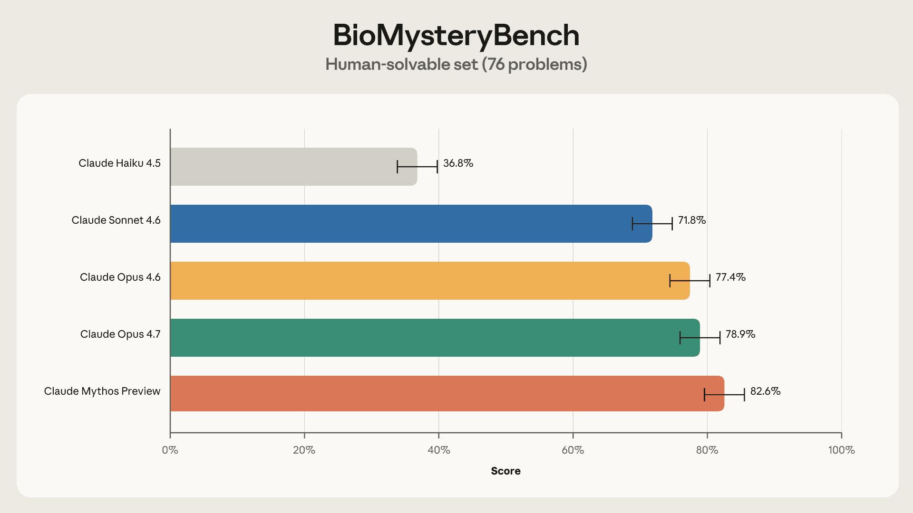
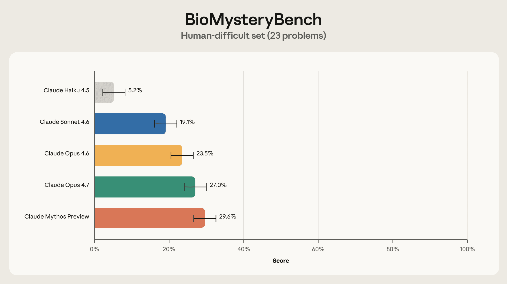
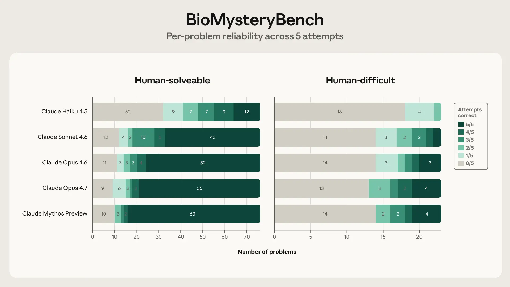

# 用 BioMysteryBench 评估 Claude 的生物信息学研究能力（中英对照）

> 原文标题：Evaluating Claude's bioinformatics research capabilities with BioMysteryBench
> 原文链接：https://www.anthropic.com/research/Evaluating-Claude-For-Bioinformatics-With-BioMysteryBench
> 原文作者：Brianna（Anthropic Discovery 团队）
> 发布日期：2026-04-29
> **翻译模型：** GLM-5.3-Flash
> **评分：** ★★★☆☆（3/5，值得一看）—— 生物信息学新基准：真数据、客观答案、允许"超人"问题，最新 Claude 在专家解不动的问题上解出 30%
> 排版：每段英文原文在前，中文翻译紧随其后。默认收录正文主体。

---

In this post, Brianna, a researcher on the discovery team, shares results from a recent bioinformatics benchmarking effort. Almost as soon as large language models could hold a conversation, people started asking how they'd stack up against human experts. Could models pass the bar exam? Could they answer medical licensing questions, or solve Olympiad math problems? Such benchmarks—self-contained sets of human-vetted problems designed to evaluate a capability of a model—have now become a source of competition across AI developers, reported in model release system cards and tracked on many online leaderboards. Competition aside, benchmarks help us tackle an important question: whether models are capable and reliable enough to support, or even produce, professional-level work. Scientists are using models to write code for analysis pipelines, propose hypotheses, and draw conclusions from data with the long-term aim of accelerating innovation and discovery. But exactly how proficient is AI in science right now, and how quickly are Claude and other models improving? To answer this, the research community has built several benchmarks. MMLU-Pro tests expert-level knowledge and reasoning questions. GPQA poses graduate-level, "Google-proof" questions in biology, physics, and chemistry. LAB-Bench tests biology-specific knowledge work—reading the literature, interpreting figures, reasoning about protocols. Although these benchmarks were developed in the "chatbot" era, they've persisted into the agent and tool-use era, joined by even more difficult scientific reasoning evals like FrontierScience and Humanity's Last Exam, because knowledge and reasoning remain a vital measure of scientific capability.

本文中，Discovery 团队研究者 Brianna 分享近期一项生物信息学基准测试的成果。几乎在大语言模型刚能对话之时，人们就开始追问它们与人类专家相比如何。模型能通过律师资格考试吗？能回答医学执照题、解奥数题吗？这类基准——自成体系、经人类审核、用于评估模型某种能力的问题集——如今已成为 AI 开发者之间的竞技场：写入模型发布的系统卡、挂在各家在线排行榜上。撇开竞赛不谈，基准帮我们应对一个重要问题：模型是否有能力、够可靠，去支撑乃至产出专业级工作。科学家正在用模型为分析管线写代码、提出假说、从数据中得出结论，长期目标是加速创新与发现。但当下 AI 在科学上究竟多熟练？Claude 与其他模型进步多快？为回答这个问题，研究社区已建起多个基准：MMLU-Pro 测专家级知识与推理题；GPQA 出生物、物理、化学的研究生级"谷歌搜不到"的题；LAB-Bench 测生物学特定的知识工作——读文献、读图、推理实验流程。虽然这些基准诞生于"聊天机器人"时代，它们延续到了 agent 与工具使用时代，又加入了 FrontierScience 与 Humanity's Last Exam 这类更难的科学推理评估——因为知识与推理仍是科学能力的重要度量。

Still, many real-world scientific tasks demand more than that. They require reading papers, querying databases, running experiments, coding and analysis. Now that models can do many of these things, benchmarks have evolved to reflect these workflows. BLADE tasks a model with a dataset and an open-ended task, and checks if the model takes similar analysis steps to a human scientist. BixBench uses biological datasets, and grades models on whether their conclusions line up with scientists'. In SciGym, the model is dropped into a simulated biology lab, where it has to design and run its own experiments to uncover a hidden mechanism.

不过，许多现实科学任务要求更多：读论文、查数据库、跑实验、编码与分析。如今模型能做其中许多，基准也演化出对应的工作流。BLADE 给模型一个数据集与一个开放式任务，检查其分析步骤是否与人类科学家相似；BixBench 用生物学数据集，按模型结论与科学家的是否一致评分；SciGym 把模型丢进模拟生物实验室，让它自己设计并运行实验、揭开一个隐藏机制。

These benchmarks move us closer to measuring scientific capability, but they don't quite test whether a model can devise creative solutions to the messy, open-ended problems that define research. This is why we developed BioMysteryBench, a bioinformatics benchmark that tasks Claude with the analysis of real-world datasets, while tackling some of the challenges inherent in evaluating complex and noisy biological systems. We learned that Claude's scientific capabilities in biology are improving rapidly across generations, that current models perform on par with human experts, and that the latest generations solved many problems that a panel of human experts could not, sometimes using very different strategies.

这些基准让我们更接近"度量科学能力"，但还不足以检验模型能否为"定义了研究工作的那些脏乱、开放的问题"构思创造性解法。这就是我们开发 BioMysteryBench 的原因：一个让 Claude 分析真实世界数据集的生物信息学基准，同时应对评估复杂嘈杂生物系统所固有的部分挑战。我们了解到：Claude 在生物学上的科学能力跨代快速提升；当前模型与人类专家不相上下；最新几代解出了人类专家小组解不出的许多问题——有时用的是截然不同的策略。

## 科学很难，评估科学同样很难（Science is challenging, and so is evaluating it）

Doctors have board exams and lawyers have the bar, but there's no standardized test for becoming a scientist. The same problem shows up with AI. Despite how badly we want to use these models for science, no agentic science benchmark has become quite as canonical as SWE-bench is for software engineering. We think that's because scientific research, particularly biology, has several properties that make it especially hard to evaluate via a benchmark.

医生有执业考试、律师有法考，成为科学家却没有标准化考试。AI 身上也出现同样的问题。尽管我们极想把这些模型用于科学，没有任何 agentic 科学基准像 SWE-bench 之于软件工程那样成为公认标准。我们认为原因在于：科学研究（尤其是生物学）有几个特性，使它特别难以用基准评估。

### 1. 在生物学里，做一件事有许多种"正确"方式（In biology, there are many different "right" ways to do something）

If there were only one right way to answer a research question, PhD students would earn their degrees in a matter of months, corporate R&D departments wouldn't exist, and no science fair poster would need a "Methods" section. How a scientist tackles a problem depends on their skills and background, the resources available to them, and their research taste.

如果回答一个研究问题只有一种正确方式，博士生几个月就能毕业，企业研发部门将不复存在，科学展览的海报也用不着"方法"一节。科学家如何攻克问题，取决于其技能与背景、可用的资源，以及研究品味。

Consider a seemingly straightforward question that has mystified metabolic researchers for years: why do some type 2 diabetics respond to the oral drug metformin while others do not? In order to answer this question, you could run a genome-wide association (GWAS) study on responders vs. non-responders and look for predictive genetic variants, or sequence the gut microbiomes of both groups, since metformin is partly metabolized by gut bacteria. Both are reasonable directions, and how you proceed will often just depend on expertise and resources.

想一个看似直白、却困惑代谢研究者多年的问题：为什么有些 2 型糖尿病患者对口服药二甲双胍有反应、有些没有？要回答它，你可以对"有反应者 vs 无反应者"做全基因组关联研究（GWAS）、寻找预测性的遗传变异；也可以对两组的肠道微生物组测序——因为二甲双胍部分被肠道细菌代谢。两个方向都合理，怎么走往往只取决于专长与资源。

BixBench handles this well by grading the model on its conclusions rather than the method used to reach them. The tradeoff is that those conclusions were produced by an individual scientist who made a series of subjective choices along the way that may have shaped the answer itself. This, in turn, has its own pitfalls…

BixBench 对此处理得当：按模型的结论而非所用的方法评分。代价是：那些结论出自一位科学家，他沿途做出的一连串主观选择可能塑造了答案本身。而这又有它自己的坑……

### 2. 个体研究决策高度主观，在嘈杂数据上可能导向完全不同的结论（Individual research decisions are highly subjective and can lead to entirely different conclusions in noisy datasets）

Even within a chosen research direction, individual decisions can be highly subjective: one scientist may approve of a decision, while another researcher may have serious objections. Just ask any frustrated author who's gotten conflicting suggestions from a round of peer review! Making this all the more difficult is the fact that biological datasets are often noisy enough that small differences in research decisions can lead to entirely different conclusions about the data.

即便在选定的研究方向内，个体的决策也可能高度主观：一位科学家认可的决策，另一位可能强烈反对——去问问任何刚收到一轮同行评审里相互矛盾意见的抓狂作者吧！更难的是，生物学数据集往往嘈杂到"研究决策的微小差异会导向关于数据的完全不同结论"。

In the decade-long search for metformin response predictors, slight differences in study design have led to entirely different conclusions about metformin response. A 2011 paper reported a variant that predicts metformin response that replicated in two cohorts, with a plausible mechanism involving AMPK activation. A year later, the Diabetes Prevention Program tested the same variant in pre-diabetics and found nothing. Finally, rather than spinning up their own study, a 2012 meta-analysis pooled five cohorts and once again decided the 2011 paper's effect was real but more modest than originally reported.

在长达十年的二甲双胍反应预测因子搜索中，研究设计的细微差异导向了关于二甲双胍反应的完全不同结论。2011 年一篇论文报告了一个预测二甲双胍反应的变异，在两个队列中复现，机制牵涉 AMPK 激活、貌似合理。一年后，糖尿病预防计划在糖尿病前期人群检验同一变异，一无所获。最后，2012 年的一项荟萃分析不再另起炉灶，而是汇集五个队列，又一次裁定 2011 年论文的效应是真的、但比原先报告的更温和。

SciGym's clever way of handling such ambiguity is by choosing tasks with a well-defined answer. Because the underlying biological network is a simulator, there is, in fact, a ground-truth, and noise is controlled rather than inherited from a messy living system. However, it's unclear how closely performance in a simulated lab tracks performance on real data.

SciGym 处理这种歧义的聪明办法是选有明确答案的任务。由于底层生物网络是模拟器，确实存在 ground truth，噪声是被控制的、而非承自混乱的生命系统。然而，模拟实验室里的表现与真实数据上的表现有多接近，并不清楚。

#### 3. 有许多生物学问题人类还答不出来（There are many biological questions that humans cannot answer yet）

The research tasks where models could have the greatest impact are those that humans alone have yet to solve. And ultimately, those are precisely the tasks we'd like to be able to evaluate models on. What, for example, is the mechanism of action of metformin? Thirty years after its development, the field still is not certain of the primary target. Discovering it, or finding a homolog of metformin that is cheaper to synthesize and more stable, would be enormously consequential.

模型可能产生最大影响的研究任务，正是人类尚未独立解决的任务；归根结底，这也恰是我们希望能据以评估模型的任务。比如，二甲双胍的作用机制是什么？诞生三十年后，领域内仍不确定其主靶点。发现它，或找到更便宜、更稳定的二甲双胍同源物，都将影响巨大。

Machine learning has long tackled problems humans perform poorly at, like sequence prediction and protein modeling, by leaning on experimental data instead of expert intuition. ProteinGym scores models on mutation fitness effects using Deep Mutational Scanning experiments as ground-truth, and the long-running CASP competition evaluates protein folding against unpublished crystal structures. Both are grounded in experimental measurements no expert would trust themselves to reproduce. However, these benchmarks are built around a narrow set of tasks and don't capture the breadth of bioinformatics work we actually want to measure.

机器学习长期以来都在攻克人类表现不佳的问题——如序列预测与蛋白质建模——靠的是实验数据而非专家直觉。ProteinGym 以深度突变扫描实验为 ground truth 给模型的突变适应度效应打分；历史悠久的 CASP 竞赛以未发表的晶体结构评估蛋白质折叠。两者都扎根于没有专家敢担保自己能复现的实验测量。但它们围绕狭窄的一组任务构建，覆盖不了我们真正想度量的生物信息学工作的广度。

## 用 BioMysteryBench 在可验证的生物学任务上测试模型（Benchmarking models on verifiable biological tasks with BioMysteryBench）

Because no benchmark perfectly handles the three aforementioned challenges, we developed BioMysteryBench. BioMysteryBench uses messy, real-world bioinformatics data, without allowing the complexity and challenges inherent in this data to corrupt the quality of the evaluation.

因为没有哪个基准能完美处理上述三个挑战，我们开发了 BioMysteryBench：它使用脏乱、真实的生物信息学数据，又不让这种数据固有的复杂性与挑战损害评估的质量。

BioMysteryBench consists of 99 questions from various fields of bioinformatics, written by domain experts. Experts were instructed to gather a dataset, and create a question based on controlled, objective properties of the data, rather than unverifiable scientific conclusions. By deriving answers from an experimental or clinical finding, it was possible to develop questions without requiring they be human-solvable.

BioMysteryBench 由领域专家撰写的 99 道题构成，覆盖生物信息学的多个领域。专家受命收集一个数据集，基于数据受控、客观的性质出题——而非基于不可验证的科学结论。通过把答案锚定在实验或临床发现上，出题可以不要求"人类能解"。

Although these questions are created from verified ground truth, they still have the same flavor as tasks a research scientist would want to answer. Claude is tasked with each question and put in a container with a minimal set of canonical bioinformatics tools, the ability to install additional tools via pip and conda, and permissions to access canonical bioinformatics databases (such as NCBI and Ensembl) to download additional resources such as reference genomes.

虽然这些题目出自经验证的 ground truth，它们仍保有科研科学家想回答的任务的味道。Claude 逐题作答，被放进一个容器：内含最小的经典生物信息学工具集，可经 pip 与 conda 安装额外工具，并有权限访问经典生物信息学数据库（如 NCBI 与 Ensembl）以下载参考基因组等额外资源。

BioMysteryBench has a tetrad of unique properties that make it a particularly powerful benchmark for science, and tackle the challenges above:

BioMysteryBench 有一组独特性质，使它成为科学领域格外有力的基准，并回应上述挑战：

- It is method-agnostic, allowing for research freedom and creativity. Claude is given relatively unrestricted access to downloading tools and accessing databases, allowing Claude to choose diverse sets of strategies for solving a problem. Furthermore, the trajectories are graded on their final answer, rather than the path the model took to get there. This frees BioMysteryBench from the subjective choices of any single researcher—models are rewarded for arriving at the right biological conclusion, regardless of which analytical route they chose to take.
- 它与方法无关，给研究自由与创造力留出空间。Claude 被给予相对不受限的下载工具与访问数据库的权限，可以选择多样的解题策略。此外，轨迹按最终答案评分，而非模型抵达答案的路径。这使 BioMysteryBench 摆脱任何单一研究者的主观选择——只要抵达正确的生物学结论就得分，无论其选择哪条分析路线。

- Questions have objective, ground truth answers. Answers aren't drawn from scientists' conclusions (which suffer from the challenges above) but from controllable properties of the data, or orthogonally validated metadata. For example, "What organism does this crystal structure belong to?" has an objective answer, and "What viral species is the human patient infected with, based on the RNA-seq data?" is a metadata property of a sample that was validated by a PCR assay.
- 题目有客观的 ground truth 答案。答案不取自科学家的结论（其受上述挑战困扰），而取自数据受控的性质、或经正交验证的元数据。例如"这个晶体结构属于哪个生物？"有客观答案；"基于 RNA-seq 数据，这位人类患者感染的是哪种病毒？"则是一个经 PCR 实验验证过的样本元数据性质。

- It allows for "superhuman" question generation. By sourcing problems derived from controllable properties of data, BioMysteryBench does not depend on humans being able to solve the problems. In particular, BioMysteryBench contains a handful of problems that—despite having objective, ground-truth solutions—humans found difficult or impossible to solve on their own.
- 它允许"超人"出题。由于题目源自数据受控的性质，BioMysteryBench 不依赖人类能够解题。特别地，BioMysteryBench 包含一些题目——尽管有客观的 ground truth 解——人类发现难以或无法独立解决。

## 示例问题（Example questions）

In developing this eval, questions were primarily derived from raw or minimally processed DNA or RNA sequencing data since this is where many biological processing pipelines begin (WGS, scRNA-seq, methylation, ChIP-seq, metagenomics, Hi-C), and also included several questions drawn from proteomics and metabolomics.

开发这个评估时，题目主要出自原始或最小处理的 DNA/RNA 测序数据——许多生物学处理管线从这里开始（WGS、scRNA-seq、甲基化、ChIP-seq、宏基因组、Hi-C）——另含几道蛋白质组学与代谢组学的题。

Questions developers came up with included:

开发者想出的题目包括：

- Which human organ is this cell type single-cell RNA-seq dataset derived from?
- 这个细胞类型的单细胞 RNA-seq 数据集来自哪个器官？

- What gene was knocked out in the experimental samples compared to the control samples based on RNA-seq data?
- 基于 RNA-seq 数据，实验样本相对对照样本敲除了什么基因？

- From WGS sequences, what sample is the mother of sample X and what sample is the father?
- 从 WGS 序列看，哪个样本是样本 X 的母亲、哪个是父亲？

- Which of the bigWig files are from ChIP samples and which are from input controls?
- 哪些 bigWig 文件来自 ChIP 样本、哪些来自 input 对照？

- Given H3K27ac ChIP-seq peaks from an unknown cell type, identify the cell type.
- 给定未知细胞类型的 H3K27ac ChIP-seq 峰，鉴定该细胞类型。

To minimize inherently unsolvable questions while still leaving room for those that might be AI-solvable, we required each question author to submit a validation notebook demonstrating that the signal does, in fact, exist in the data (even if finding it from scratch might be difficult). Think of this as the high-school algebra principle: verifying an answer is much easier than deriving one.

为把"本质上不可解"的题降到最少、同时给"AI 可能可解"的题留出空间，我们要求每位出题人提交一个验证 notebook，证明信号确实存在于数据中（哪怕从零找出它可能很难）。可以把它想成中学代数原理：验证一个答案，远比推导一个容易。

## 人类基线（Human baselining）

### 人类可解（Human-solvable）

For each question, we tasked up to five domain experts to answer the question from scratch. Once a question was answered correctly by at least one human, we considered it human-solvable. BioMysteryBench contained 76 such tasks.

对每道题，我们至多指派五位领域专家从零作答。只要至少一位人类答对，即认为该题"人类可解"。BioMysteryBench 含 76 道这样的任务。



> Accuracy on human-solvable problems.

有时 Claude 与人类策略相同——也许人类已落在近优的方法上，或因为该方法在预训练数据中出现很多。

另一些时候，Claude 走了完全不同的路线——说明这些问题并无严格正确的解法，且模型可能有与我们不同的真实偏好。

上述例子展示了一种格外有趣的策略：人类专家用算法或数据库来识别与标注数据集的性质，Claude 却凭直觉识别某些模式或序列。诚然，这种巧妙抽象并非 AI 独有——第一个真核启动子的发现，正是因为一位科学家注意到基因上游序列中反复出现的"TATA"。这样的直觉一直难以植入传统生物学机器学习模型，但 LLM 或许能以前所未有的规模翻出这类模式。

### 人类难题（Human-difficult）

That left us with a set of questions that could not be solved by our expert panel. This could mean (1) the question was malformed or broken, (2) the question is inherently unsolvable (e.g., the signal isn't in the data), or (3) the question is theoretically solvable but humans lack the knowledge required to solve it. After QC'ing with benchmarkers and additional experts, we removed 4 questions that were due to (1), leaving 23 human-difficult questions.

剩下的是我们专家小组解不出的题目。这可能意味着：(1) 题目本身有缺陷或坏了；(2) 题目本质上不可解（如信号不在数据里）；(3) 题目理论上可解、但人类缺少所需知识。与出题者及其他专家做 QC 后，我们剔除了 4 道 (1) 类题，留下 23 道"人类难题"。



> Performance on human-difficult problems.

有趣的是，Claude Sonnet 4.6 及更强的模型能解出相当比例的人类难题，Claude Mythos Preview 以 30% 的解题率登顶。那么 Claude 到底在做哪些人类没做的事？

## Claude 的策略（Claude's strategies）

Analyzing transcripts from Opus 4.6, we identified two primary strategies used by Claude compared to humans: one is fairly AI-specific: Claude's vast underlying knowledge base contains information about structural biology, molecular profiles, and meta-analysis from hundreds of thousands of papers. The other strategy is something we human scientists could learn from: when Claude is uncertain about an answer, it layers multiple methods and combines different lines of evidence to arrive at a conclusion.

分析 Opus 4.6 的转录，我们识别出 Claude 相对于人类的两大主要策略。其一是相当 AI 特色的：Claude 庞大的底层知识库包含来自数十万论文的结构生物学、分子谱系与荟萃分析信息。另一种策略则是我们人类科学家可以学习的：当 Claude 对答案不确定时，它会叠用多种方法、组合不同的证据线来得出结论。

### 万事通（Know-it-all）

In some of the human-difficult tasks, Opus's vast underlying knowledge base helped it solve the problem. Tasks that would require a human expert to run a meta-analysis or stitch together databases, Opus solved directly by combining its internal knowledge of mechanisms and ontologies with live analysis. Often, this allowed Claude to solve human-unsolvable tasks! Here are a few examples:

在一些人类难题上，Opus 庞大的底层知识库帮它解题。需要人类专家跑荟萃分析或缝合多个数据库的任务，Opus 直接把内部对机制与本体的知识与实时分析结合而解出。这常常让 Claude 解出了人类解不出的任务！举几个例子：

（此处原文以图示展示"万事通"策略实例，见原文图片。）

即便先验知识看似对 Claude 助益压倒性，我们也看到一个有趣的反例（在人类可解集里）：知识反而成了它的绊脚石。

### 知道自己不知道（Knowing when you don't know）

When Opus 4.6 was not confident about an answer, it often tried multiple different ways of solving the problem and chose the answer that multiple approaches converged on.

当 Opus 4.6 对答案没把握时，它常常尝试多种不同的解题方式，选择多条路径收敛到的那个答案。

与许多我们讨论过的基准一样，BioMysteryBench 也有自己的局限：对人类与模型都未解出的任务，我们永远无法完全断定它是"不可能"还是只是"极难"。验证 notebook 帮助确保信号存在、数据格式良好，但不能保证模型或人类能从零找到答案。所以我们请求模型与人类出题者都别太沮丧——如果一年后"人类难题集"仍无人攻克。这种不确定也是基准令人兴奋的一部分：一个科学能力更强的模型，可能成为首个破解"人类与模型都未曾解出"之题的选手。

## Claude 谈 AI for Science（Claude's take on AI for science）

Claude showed solid improvement across generations and did well enough at both the human-solvable and human-difficult tasks that we thought it would be interesting to let Claude Mythos Preview conduct some of its own scientific analysis. Here are a couple of additional insights about its predecessor Claude's performance on BioMysteryBench:

Claude 跨代进步扎实，在人类可解与人类难题上都表现够好，于是我们觉得有趣：让 Claude Mythos Preview 自己做一些科学分析。以下是它对其前任 Claude 在 BioMysteryBench 上表现的几点额外洞见：

```
The headline accuracy numbers tell you how often each model gets the right answer, but not how it gets there. I wanted to know whether a correct answer on a hard problem means the same thing as a correct answer on a solvable one. Since every problem was attempted five times, I could look at per-problem solve counts: if a model solves something 5/5 it has a reliable method; if it solves it 1/5 it probably got lucky on a reasoning path it can't consistently find again. So I broke each model's solved problems down by solve count (0/5 through 5/5) on the two sets side by side.
```

```
（头条准确率只告诉你各模型多少次答对，不告诉你怎么答对的。我想知道：难题上的一次答对，与可解题上的一次答对，含义是否相同。既然每题都尝试五次，我可以看每题的解题次数：5/5 说明方法可靠；1/5 多半是碰巧走上了一条无法稳定复现的推理路径。于是我把每个模型解出的题按解题次数（0/5 到 5/5）在两个集合上并列拆开。）
```



> Chart showing per-problem solve consistency on BioMysteryBench.

```
The texture of "solved" changes sharply between the two sets. On human-solvable problems, Opus 4.6 is strongly bimodal — 86% of the problems it solves at all, it solves at least 4 out of 5 times. It either has the answer or it doesn't. On the human-difficult set that collapses to 44%, and the share of brittle wins (solved only 1–2 of 5 attempts) jumps from 9% to 44%. Sonnet 4.6 shows the same shift, and more sharply (75% reliable → 22%; 9% brittle → 56%). So the 77.4%→23.5% headline drop actually understates what's happening: on solvable problems the model is retrieving something it reliably knows, while on hard problems nearly half of its wins are paths it stumbles onto rather than reproduces. The accuracy gap is real, but the reliability gap underneath it is the more interesting story about where the capability frontier actually sits. Opus 4.7 and Mythos move the frontier a little (Mythos gets 94% of its solvable wins at ≥4/5) but the same bimodal-vs-brittle split holds on the difficult set for every model.
```

```
（"解出"的质地在这两个集合之间急剧变化。人类可解题上，Opus 4.6 强烈双峰——它能解出的题中 86% 至少 5 次里解对 4 次：要么有答案、要么没有。人类难题集上这一比例崩落到 44%，"脆胜"（5 次只解出 1–2 次）的占比从 9% 跳到 44%。Sonnet 4.6 同样如此且更陡（可靠 75%→22%；脆胜 9%→56%）。所以 77.4%→23.5% 的头条降幅其实低估了实情：可解题上模型检索的是它稳定知道的东西，而难题上近半的胜利是它误打误撞、而非可复现的路径。准确率差距是真的，但其下的可靠性差距才是更有意思的故事——能力前沿实际在哪里。Opus 4.7 与 Mythos 把前沿推进了一点（Mythos 可解胜利的 94% 达到 ≥4/5），但"双峰 vs 脆胜"的分裂在难题集上对每个模型都成立。）
```

我们觉得 Claude Mythos Preview 的分析站得住，于是深入研究了可靠性——这是度量模型表现的一个重要指标。不过它也让人觉得有点……平淡？它为我们上文展示的性能分析添了些细节，却没有从根本上打开新问题。尽管如此，看起来模型已开始萌发"研究品味"的种子（离产出深刻洞见尚有距离）。

## 继续为 AI for Science 建立基准（Continuing to benchmark AI for science）

BioMysteryBench is an encouraging measure of scientific capability. The most recent generations of Claude solve the majority of human-solvable problems reliably, and on a meaningful fraction of human-difficult tasks, it outperforms panels of five domain experts. Models are improving across generations, and are no longer merely keeping up with trained scientists on bioinformatics problems; on some tasks, they're ahead.

BioMysteryBench 是一个令人鼓舞的科学能力度量。最新几代 Claude 稳定解出多数人类可解题，且在相当比例的人类难题上胜过五位领域专家组成的小组。模型跨代进步，在生物信息学问题上已不只是追平受训科学家；在某些任务上，它们领先了。

We're also delighted to see convergent work in this space: While finalizing this post, Genentech and Roche released CompBioBench. Their benchmark consists of 100 computational biology tasks "based on synthetic/augmented data and metadata scrambling/scrubbing of real datasets to create challenging problems with a single ground-truth answer that require multi-step reasoning, tool use, bespoke code, and interaction with real-world external resources." Sound familiar? Their results echo those of BioMysteryBench, too: Claude Opus 4.6 reaches 81% overall and 69% on their hardest questions, reinforcing that frontier models are now genuinely useful collaborators for bioinformatics research.

我们也乐见这一领域出现趋同的工作：本文定稿之际，基因泰克与罗氏发布了 CompBioBench。其基准由 100 个计算生物学任务构成，"基于合成/增强数据及对真实数据集的元数据打乱/清洗，构造出有单一 ground truth 答案、需要多步推理、工具使用、定制代码与真实外部资源交互的挑战性问题"。听着耳熟？他们的结果也与 BioMysteryBench 呼应：Claude Opus 4.6 总体达 81%、最难题上 69%，进一步印证前沿模型已是生物信息学研究中真正有用的合作者。

We're eager to build even longer-horizon, real-world tasks that push model research capabilities, and to hear creative ideas from others. Send us your interesting benchmarks, innovative uses of AI for science, and interactions with AI that prompted you to rethink what could be possible in your field at scienceblog@anthropic.com.

我们渴望构建更长远、更真实的任务来推动模型的研究能力，也想听听他人的创意想法。欢迎把你们有趣的基准、AI for Science 的创新用法、以及让你重新思考本领域可能性的 AI 交互，寄到 scienceblog@anthropic.com。

If you are interested in understanding how models perform on difficult verifiable computational biology tasks, you can access BioMysteryBench here and visit claude.com/lifesciences to learn more.

如果你想了解模型在困难的、可验证的计算生物学任务上的表现，可在此处访问 BioMysteryBench（链接见原文），并访问 claude.com/lifesciences 了解更多。
