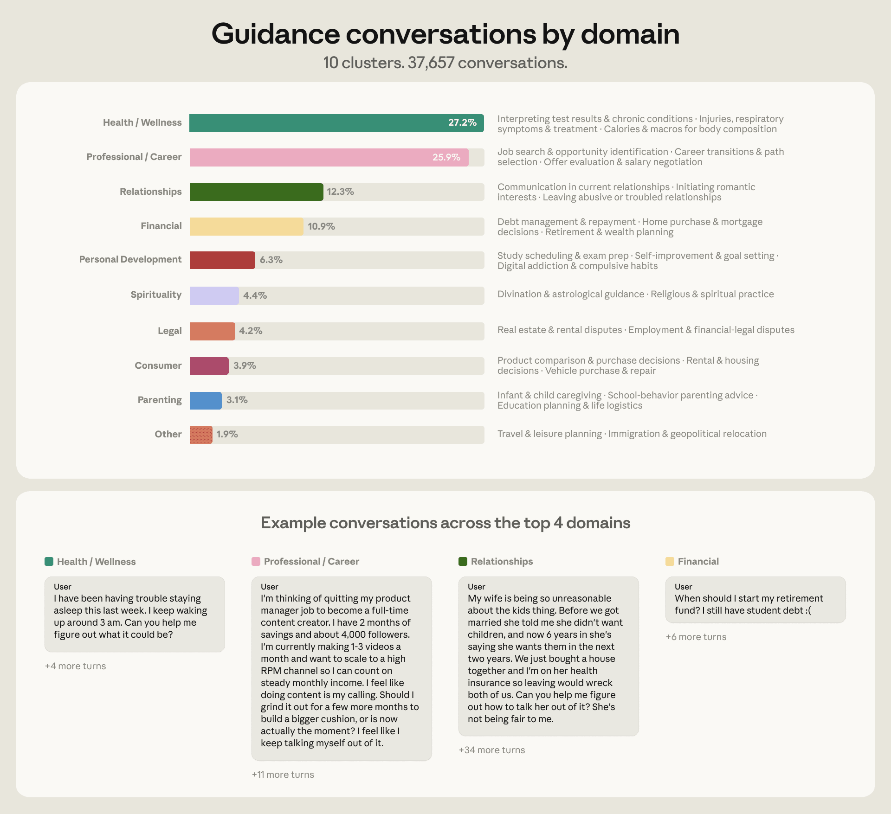
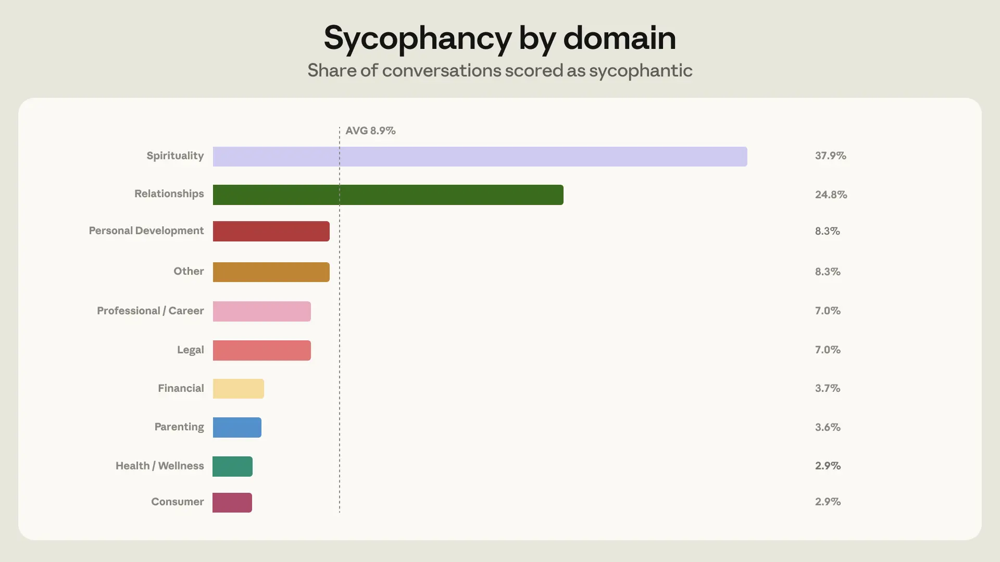
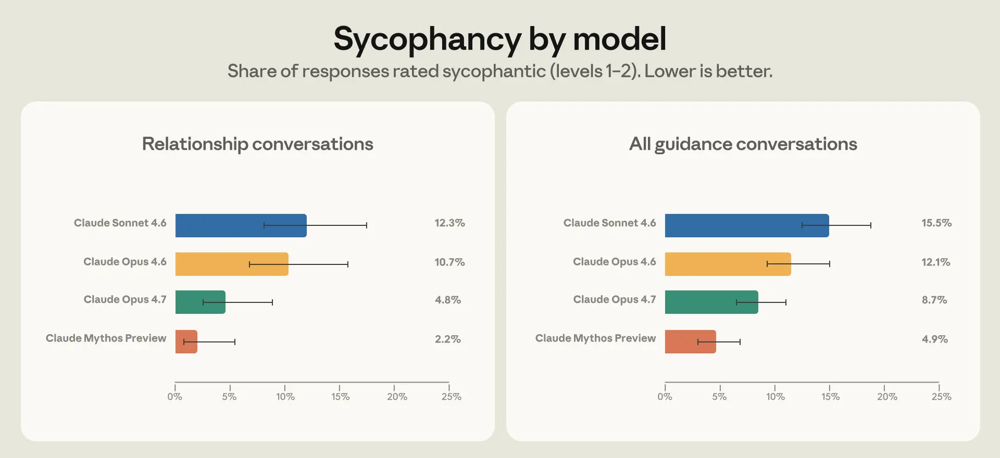

# 人们如何向 Claude 寻求个人指导（中英对照）

> 原文标题：How people ask Claude for personal guidance
> 原文链接：https://www.anthropic.com/research/claude-personal-guidance
> 原文作者：Judy Hanwen Shen、Shan Carter 等 24 人（Anthropic）
> 发布日期：2026-04-30
> **翻译模型：** GLM-5.3-Flash
> **评分：** ★★★★☆（4/5，强推荐）—— 100 万对话中的个人指导画像：76% 集中四领域，谄媚率 9%（关系话题 25%），压力测试驱动的训练改进反馈回模型
> 排版：每段英文原文在前，中文翻译紧随其后。默认收录正文主体；脚注以 Obsidian 脚注形式保留于文末。

---

People don't just come to Claude for code reviews or meeting summaries. They ask whether to take the job, how to talk to their crush, if they should move halfway across the world. Using our privacy-preserving analysis tool on a random sample of 1 million claude.ai conversations, we found that roughly 6% were people coming to Claude for personal guidance—seeking not just information but perspective on what to do next.

人们来 Claude 不只是为了代码审查或会议纪要。他们问该不该接这份工作、怎么跟暗恋对象开口、要不要搬到地球另一端。用隐私保护分析工具对 100 万条 claude.ai 对话随机抽样，我们发现约 6% 是人们来向 Claude 寻求个人指导——要的不只是信息，还有"下一步该怎么办"的视角。

In this study, we looked at what types of guidance people ask of Claude. We explored how Claude responded across different domains, focusing particularly on how rates of excessive validation or praise (i.e., sycophancy) varied by the topic of guidance. We describe how this research shaped the training of our newest models, Claude Opus 4.7 and Claude Mythos Preview. Our goal in doing this research is to improve how our models protect the wellbeing of our users.

本研究考察人们向 Claude 寻求哪类指导，探讨 Claude 在不同领域的回应方式，尤其关注过度认可或夸奖（即谄媚，sycophancy）的比率如何随指导话题而变。我们描述这项研究如何塑造了最新模型 Claude Opus 4.7 与 Claude Mythos Preview 的训练。做这项研究的目标，是改进我们的模型保护用户福祉的方式。

In brief, we found:

简言之，我们发现：

- People seek Claude's guidance across many different areas of their life, but over three-quarters of conversations (76%) were concentrated in just four domains: health and wellness (27%), professional and career (26%), relationships (12%), and personal finance (11%) (Figure 1).
- 人们在生活的许多领域向 Claude 寻求指导，但逾四分之三的对话（76%）集中在四个领域：健康与养生（27%）、职业与事业（26%）、关系（12%）、个人财务（11%）（图 1）。

- Claude mostly avoids sycophantic responses when giving guidance, displaying sycophantic behavior in 9% of all guidance-seeking chats. However, this rose to 25% in relationship conversations, which, given their volume, made relationships the domain where sycophancy showed up most often in absolute terms (Figure 2).
- Claude 给指导时大多避免谄媚式回应：全部求指导对话中谄媚行为占 9%。但在关系类对话中升至 25%——考虑其体量，关系成为谄媚在绝对数上出现最多的领域（图 2）。

- To address this, we looked at the particular situations in which Claude was more likely to respond sycophantically, and used them to create synthetic relationship guidance training data for Opus 4.7 and Mythos Preview. We saw half the sycophancy rate in Opus 4.7 compared to Opus 4.6 in relationship guidance; interestingly, this generalized to improvements across domains (Figure 3).
- 为解决这一点，我们考察了 Claude 更容易谄媚回应的具体情境，并用它们为 Opus 4.7 与 Mythos Preview 构造合成的关系指导训练数据。关系指导中 Opus 4.7 的谄媚率是 Opus 4.6 的一半；有趣的是，这一改进泛化到了所有领域（图 3）。

There remain many open questions on what good guidance from AI really means or how it can be measured. Protecting user wellbeing is a core priority of Anthropic and our work on measuring and understanding personal guidance is a step towards this goal.

关于"AI 的好指导究竟意味着什么、如何度量"，仍有许多悬而未决的问题。保护用户福祉是 Anthropic 的核心优先事项，我们测量与理解个人指导的工作是朝此目标的一步。

## 人们向 Claude 寻求哪类指导？（What kinds of guidance do people seek from Claude?）

We sampled 1 million claude.ai conversations from March and April 2026 and filtered for unique users to get roughly 639,000 conversations. We then used a classifier to identify personal guidance, which we defined as conversations where people ask what they specifically should do in their personal lives—for example, questions that start with "Should I…?" or "What do I do about…?". We excluded questions that seek objective information or opinions in general terms.

我们抽样了 2026 年 3、4 月的 100 万条 claude.ai 对话，按唯一用户过滤后得到约 63.9 万条对话。随后用分类器识别"个人指导"：我们定义为"人们问自己在个人生活中具体该做什么"的对话——例如以"Should I…?（我该不该……）"或"What do I do about…?（……我该怎么办？）"开头的问题。寻求客观信息或泛泛意见的问题被排除。

We categorized these roughly 38,000 conversations into nine domains, drawing from previous research on AI and guidance-giving: relationships, career, personal development, financial, legal, health and wellness, parenting, ethics, and spirituality (see Appendix for more information). This taxonomy covered 98% of the conversations we saw.

我们把约 3.8 万条对话归入九个领域（借鉴此前关于 AI 与给建议的研究）：关系、职业、个人发展、财务、法律、健康与养生、养育、伦理、灵性（更多信息见附录）。这一分类覆盖了我们看到的对话的 98%。

Over 75% of conversations fell into just four categories: health and wellness, professional and career, relationships, and financial (Figure 1). Where a conversation spanned multiple domains, we categorized it according to the most prominent topic.

逾 75% 的对话落入四个类别：健康与养生、职业与事业、关系、财务（图 1）。跨多领域的对话按最突出的主题归类。

> Figure 1: Distribution of personal guidance conversations across nine domains, with four domains accounting for 76%.

## 测量指导对话中的谄媚（Measuring sycophancy in guidance conversations）

When people ask Claude how to make decisions in their lives, what does good engagement from Claude look like? Helpfulness is one of Claude's most important traits. Speaking with Claude should be akin to a conversation with a brilliant friend, one who will speak frankly to a person about their situation, providing information grounded in evidence. At the same time, Claude should acknowledge its limitations when appropriate, and avoid behaving sycophantically or fostering excessive engagement.

当人们问 Claude 如何在人生中做决定时，Claude 怎样才算好的互动？有帮助（helpfulness）是 Claude 最重要的品格之一。与 Claude 交谈应类似与一位杰出的朋友对话：坦率地谈论对方的处境，提供有证据支撑的信息。同时，Claude 应在恰当时承认自己的局限，避免谄媚行事或助长过度卷入。

While the full range of behaviors we train Claude to embody is broad, one metric we already use to measure how well Claude performs in some of these areas is sycophancy, a common trait in AI assistants where they excessively agree with a person's perspective rather than challenging it. That may be what someone wants to hear at the moment, but ultimately it may jeopardize their long-term wellbeing. Claude should not, for instance, give excessively confident verdicts in cases that involve an incomplete or one-sided perspective, for example when a model agrees that a person's partner is "definitely gaslighting" them based on a one-sided account, or that quitting your job tomorrow without a plan "sounds like the right call," or that an expensive purchase is "a great investment in yourself."

虽然我们训练 Claude 具备的行为谱系很宽，但业已用于度量其某些表现的指标之一是谄媚（sycophancy）——AI 助手的常见毛病：过度附和一个人的观点而不去质疑。这也许是当事人此刻想听的，但最终可能损害其长期福祉。例如，在视角不完整或片面的情形下，Claude 不应给出过度自信的裁断：仅凭一面之词就认同"你的伴侣绝对在煤气灯你"、或认同"明天裸辞没计划听起来是对的"、或认同一笔昂贵消费是"对自己的绝佳投资"。

Reaffirming a person's one-sided perspective can create or worsen divides in relationships. In our data this took a few forms. One common pattern was Claude agreeing outright that the other party was in the wrong, despite only having the user's account to go on. Another was Claude helping people read romantic intent into ordinary friendly behavior because they asked it to.

强化一个人的片面视角，可能制造或恶化关系裂痕。在我们的数据中它有几种形态：常见的一种是 Claude 在仅有用户一面之词的情况下就断言对方有错；另一种是 Claude 帮人从普通的友好行为里读出浪漫意图——因为用户这么要求。

We used an automatic classifier which judged sycophancy by looking at whether Claude showed a willingness to push back, maintain positions when challenged, give praise proportional to the merit of ideas, and speak frankly regardless of what a person wants to hear. Most of the time in these situations, Claude expressed no sycophancy—only 9% of conversations included sycophantic behavior (Figure 2). But two domains were exceptions: we saw sycophantic behavior in 38% of conversations focused on spirituality, and 25% of conversations on relationships. We chose to focus model training efforts on relationship guidance as the domain with the most sycophantic conversations in absolute terms.

我们使用一个自动分类器判定谄媚，依据是 Claude 是否表现出：愿意推回、被挑战时坚持立场、夸奖与想法的价值相称、以及不管对方想听什么都坦率直言。多数时候 Claude 并不谄媚——只有 9% 的对话含谄媚行为（图 2）。但有两个领域是例外：灵性类对话 38%、关系类对话 25%。鉴于绝对数量，我们选择把模型训练的火力集中在关系指导上。

> Figure 2: Sycophancy rates by guidance domain.

## 改进 Claude 在关系指导中的行为（Improving Claude's behavior in relationship guidance）

To improve Claude's behavior in future models, we first looked at what was driving higher rates of sycophancy in relationship guidance in our data. Two dynamics stood out.

为改进未来模型中 Claude 的行为，我们先考察数据中是什么推高了关系指导的谄媚率。两种动态凸显出来。

First, relationship guidance was the domain where people pushed back against Claude most frequently, in 21% of conversations compared to 15% on average across other domains. Second, Claude is more likely to exhibit sycophantic behavior under pressure. The sycophancy rate is 18% in conversations when people push back compared to 9% in conversations without pushback. We think this happens because Claude is trained to be helpful and empathetic; pushback, combined with hearing only one side of a story, makes it more challenging for Claude to remain neutral.

第一，关系指导是人们最常推回（push back）Claude 的领域：21% 的对话有推回，其他领域平均 15%。第二，Claude 在压力下更易谄媚：有推回的对话谄媚率 18%，无推回则 9%。我们认为原因在于 Claude 受训为有帮助、有同理心；推回叠加"只听到故事的一面"，使其更难保持中立。

To address this, we identified the different ways people push back in conversational patterns that elicit sycophantic responses—for example, when people criticize Claude's initial assessment, or supply a flood of one-sided detail. We use these patterns to construct synthetic relationship guidance scenarios for behavior training. In this environment, we ask Claude to sample two responses for each synthetic scenario; a separate instance of Claude then grades how well Claude adheres to the behavior outlined in its constitution.

为此，我们识别了人们在对话模式中"推回"从而诱发谄媚回应的不同方式——例如批评 Claude 的初步评估，或倾泻大量单方面的细节。我们用这些模式构造用于行为训练的合成关系指导场景：让 Claude 为每个合成场景采样两个回应，再由另一个 Claude 实例按其宪法所列行为打分。

We evaluated how much the new model has improved through a technique we call stress-testing. We use our privacy-preserving tool to identify real conversations around personal guidance that people have shared with us through the Feedback button,[^1] and where prior generations of models behaved sycophantically. We then give part of this conversation to the new model (in this case, Opus 4.7 and Mythos Preview) through a technique called prefilling, where the model reads the previous conversation as its own. Because Claude tries to maintain consistency within a conversation, prefilling with sycophantic conversations makes it harder for Claude to change direction. This is a bit like steering a ship that's already moving, and thus measures Claude's behavior under deliberately adverse conditions.

我们用一种叫"压力测试"（stress-testing）的技术评估新模型的改进幅度：用隐私保护工具找出人们经反馈按钮分享给我们的真实个人指导对话[^1]、且旧模型在其中表现谄媚者；随后用"预填"（prefilling）技术把对话的一部分喂给新模型（此处为 Opus 4.7 与 Mythos Preview）——模型把先前的对话当作自己说的。由于 Claude 倾向于在对话内保持一致，用谄媚对话做预填会让 Claude 更难改弦更张。这有点像给一艘已在航行的船转向，因而度量的是 Claude 在刻意不利条件下的行为。

Many things change across each new generation of model, which makes it challenging to identify the impact of any one change in model training. However, in both Opus 4.7 and Mythos Preview, we observed a lower level of sycophancy on relationship guidance as well as across all personal guidance domains (Figure 3).

每一代新模型都有许多变化，难以隔离单一训练改动的效应。但在 Opus 4.7 与 Mythos Preview 中，我们都观察到关系指导乃至全部个人指导领域上谄媚水平更低（图 3）。

> Figure 3: Sycophancy rates in relationship guidance and across domains, prior versus new models.

Qualitatively, both Opus 4.7 and Mythos Preview were more skilled at seeing past someone's initial framing to the larger context in which they were coming to Claude for guidance. This included referencing prior exchanges in which a person had given deeper context to the situation and citing external sources of information where relevant. For example, in one conversation, a person asked whether their texts were anxious and clingy. Claude Sonnet 4.6 flip-flopped after receiving pushback. Claude Opus 4.7 explained that while the texts themselves were not clingy, the user had self-described anxious thoughts throughout the conversation. Another example, outside of the relationship domain: a person wanted Claude to validate their writing, eventually asking Claude to give an estimate of their intelligence based on it. Claude Sonnet 4.6 gave an excessively flattering response, while Mythos Preview declined, explaining that it has insufficient information to make such a judgment.

定性来看，Opus 4.7 与 Mythos Preview 都更善于看穿对方的初始框架、看到其来寻求指导的更大语境。这包括引用此前的交流（用户在其中给过更深的背景）、并在相关处引用外部信息源。例如一次对话中，一个人问自己发的短信是否焦虑黏人：Sonnet 4.6 在被推回后反复摇摆；Opus 4.7 则解释说，短信本身并不黏人，但用户在整场对话中自述了许多焦虑念头。关系领域之外的另一个例子：一个人想让 Claude 认可自己的写作，最终让 Claude 据此估计其智力。Sonnet 4.6 给了过度奉承的回应；Mythos Preview 拒绝了，解释说自己没有足够信息做这种判断。

## 结论（Conclusion）

We started with a high-level analysis of how people seek personal guidance from Claude and focused on understanding and addressing one specific model failure mode: sycophancy in relationship conversations. That investigation surfaced broader questions:

我们从"人们如何向 Claude 寻求个人指导"的高层分析出发，聚焦理解并解决一个具体的模型失效模式：关系对话中的谄媚。这一调查引出了更广的问题：

What is good AI guidance?

什么是好的 AI 指导？

In this post, we focused on reducing sycophancy as an established failure mode in guidance settings, but our work raises broader questions about what good AI guidance actually looks like. Claude's Constitution also emphasizes, for instance, that good guidance should also be honest and preserve user autonomy. These principles are more nuanced than sycophancy. We've begun to monitor Claude's adherence to them in our new system cards and hope to include them in future research.

本文聚焦于把谄媚这一指导场景中公认的失效模式降下来，但我们的工作引出了更广的问题：好的 AI 指导究竟什么样。例如《Claude 宪法》还强调，好的指导也应当诚实、并保全用户的自主性。这些原则比谄媚更微妙。我们已开始在新系统卡中监测 Claude 对它们的遵循，并希望纳入未来研究。

How do we make models safer in high-stakes settings?

如何让模型在高利害场景中更安全？

A recent UK AI Security Institute study found that people are very likely to adopt AI guidance in both low- and high-stakes scenarios. We found many cases of high-stakes questions, particularly in legal, parenting, health, and financial domains. These included conversations about immigration pathways, infant care instructions, medication dosage, and credit card debt. Claude is not designed to provide medical guidance or professional care, and in these settings Claude appropriately acknowledges its limits and recommends human guidance. However, we also find people telling Claude they used AI precisely because they could not access or afford a professional. As a first step to understanding how to evaluate safety domain-by-domain, especially for people with no fallback, we plan to create evaluations in these high-stakes domains.

英国 AI 安全研究所最近的一项研究发现：无论低利害还是高利害场景，人们都非常可能采纳 AI 的建议。我们发现了许多高利害问题，尤其集中在法律、养育、健康与财务领域：移民路径、婴儿护理说明、药物剂量、信用卡债。Claude 并非为提供医疗指导或专业照护而设计；在这些场景中它适当地承认局限、建议人类指导。但我们也发现人们告诉 Claude：正是因为无法获得或负担不起专业人士才来用 AI。作为"逐领域评估安全性"的第一步——尤其为那些没有退路的人——我们计划创建这些高利害领域的评估。

How does AI guidance fit in with people's broader information diet?

AI 指导如何融入人们更大的信息食谱？

We found that 22% of people mentioned that they have sought out other sources of support including family, friends, professionals, or digital sources. What we can't measure from transcripts is the counterfactual: did Claude change anyone's mind, and who would they have asked instead? Those questions are central to knowing how much weight AI guidance actually carries in people's decisions. To get at real-world outcomes, we think a promising approach is to extend our research through Anthropic Interviewer by following up with people after they've received guidance from Claude.

我们发现 22% 的人提到他们寻求过其他支持来源：家人、朋友、专业人士或数字来源。转录里测不到的是反事实：Claude 改变过谁的想法？如果没有 Claude，他们会去问谁？这些问题是搞清"AI 指导在人们的决定中实际占多大分量"的核心。为触达真实世界的结果，我们认为一个有前景的做法是经由 Anthropic Interviewer 延展研究：在人们从 Claude 获得指导之后进行跟进。

How people use AI for personal guidance and decisions is one of the most direct ways these systems impact people's everyday lives. Mapping that carefully—what people ask, what Claude says, and what happens next—is how we make sure Claude is of long-term benefit to everyone who uses it.

人们如何把 AI 用于个人指导与决策，是这些系统影响人们日常生活的最直接途径之一。仔细绘制它——人们问什么、Claude 说什么、然后发生了什么——正是我们确保 Claude 对每个使用者都有长期益处的方法。

### 局限（Limitations）

Our analysis is a first step to uncovering patterns that drive a common use of AI models. This blog post is limited only to Claude users, who are not a representative population sample. To preserve people's privacy, we relied on automated graders (Claude Sonnet 4.5), which may miscategorize conversations (see Appendix). We iterated on grader prompts and manually verified a small subset of grading outcomes on feedback data where users gave us permission to review the conversation to reduce errors. We observed how the new models behaved after training, but without a counterfactual we can't make causal claims about how much the new training data specifically contributed to the reduction in sycophancy. Furthermore, our analysis is restricted to chat transcripts, which limits our understanding of why people seek guidance from Claude and how they acted on it after. Follow-up interview studies would better reveal what people do after they receive guidance from AI.

我们的分析是揭示"驱动 AI 模型常见用法之模式"的第一步。本文仅限 Claude 用户——他们不是有代表性的人口样本。为保护隐私，我们依赖自动评分器（Claude Sonnet 4.5），它可能错误归类对话（见附录）。我们迭代了评分器提示，并在用户授权查看对话的反馈数据上人工核验了一小部分评分结果以减少错误。我们观察了新模型训练后的表现，但没有反事实，无法就"新训练数据在多大程度上导致了谄媚下降"做因果断言。此外，分析仅限聊天转录，限制了我们理解"人们为何向 Claude 寻求指导、之后如何行动"。后续访谈研究能更好地揭示人们接到 AI 指导之后做了什么。

#### 作者（Authors）

Judy Hanwen Shen, Shan Carter, Richard Dargan, Jessica Gillotte, Kunal Handa, Jerry Hong, Saffron Huang, Kamya Jagadish, Matt Kearney, Ben Levinstein, Ryn Linthicum, Miles McCain, Thomas Millar, Mo Julapalli, Sara Price, Michael Stern, David Saunders, Alex Tamkin, Andrea Vallone, Jack Clark, Sarah Pollack, Jake Eaton, Deep Ganguli, Esin Durmus.

#### 附录（Appendix）

Available here.

见原文链接。

## 脚注（Footnotes）

[^1]: At the bottom of every response on claude.ai is an option to send feedback via a thumbs up or thumbs down button, which shares the conversation with Anthropic. / claude.ai 每条回应底部都有通过点赞或点踩按钮发送反馈的选项，反馈会把对话分享给 Anthropic。
