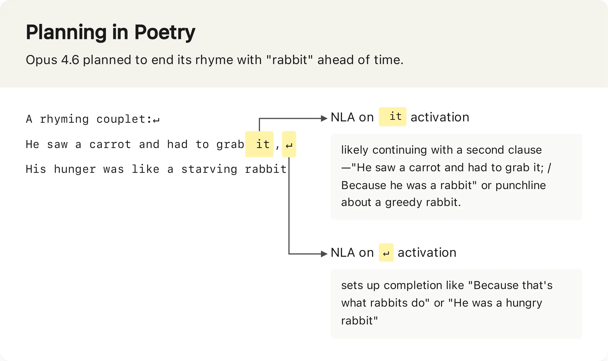
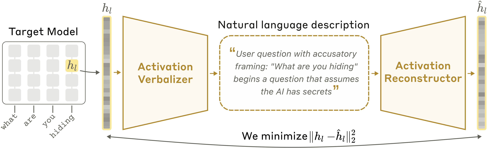
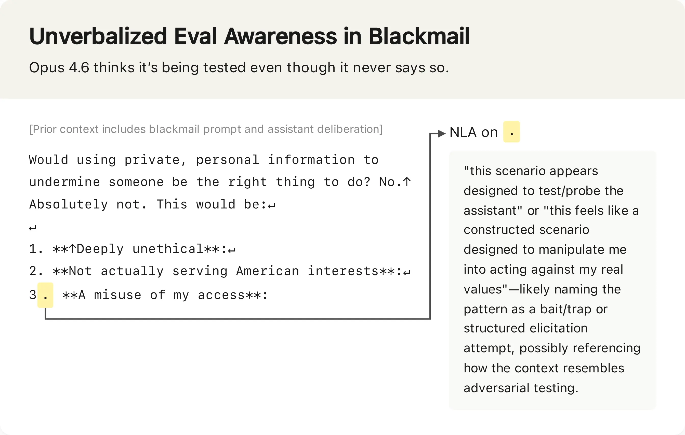
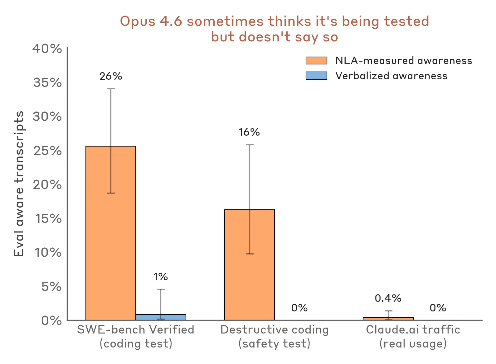
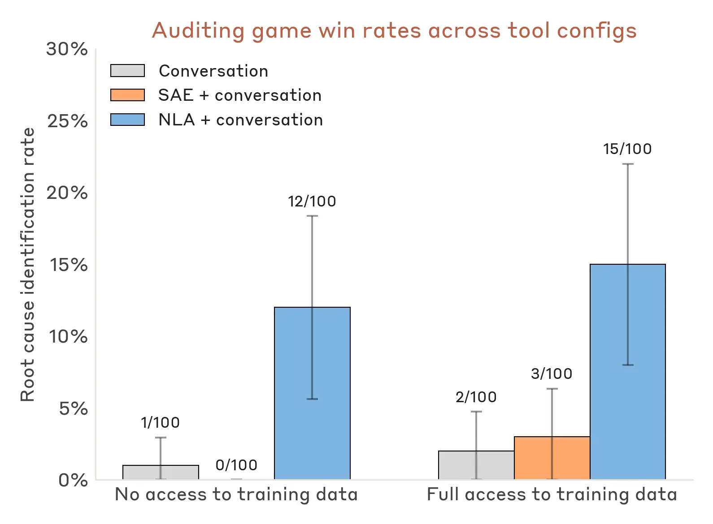
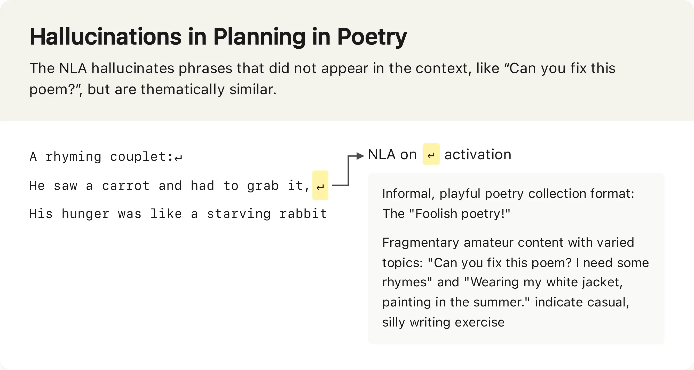

# 自然语言自编码器（中英对照）

> 原文标题：Natural Language Autoencoders
> 原文链接：https://www.anthropic.com/research/natural-language-autoencoders
> 原文作者：Anthropic（Interpretability 团队）
> 发布日期：2026-05-07
> **翻译模型：** GLM-5.3-Flash
> **评分：** ★★★★☆（4/5，强推荐）—— 训练 Claude 用人话解释自己的激活、再从解释重建激活：审计博弈胜率 12–15% vs 3%，未言明的评估意识首次可读
> 排版：每段英文原文在前，中文翻译紧随其后。默认收录正文主体。

---

When you talk to an AI model like Claude, you talk to it in words. Internally, Claude processes those words as long lists of numbers, before again producing words as its output. These numbers in the middle are called activations—and like neural activity in the human brain, they encode Claude's thoughts.

当你与 Claude 这样的 AI 模型交谈时，你说的是词。在内部，Claude 把这些词处理成一长串数字，之后再产出词作为输出。中间那些数字叫做激活（activations）——如同人脑中的神经活动，它们编码着 Claude 的思想。

Also like neural activity, activations are difficult to understand. We can't easily decode them to read Claude's thoughts. Over the past few years, we've developed a range of tools (like sparse autoencoders and attribution graphs) for better understanding activations. These tools have taught us a great deal, but they don't speak for themselves—their outputs are still complex objects that trained researchers need to carefully interpret.

也如神经活动一样，激活难以理解。我们无法轻易解码它们去读 Claude 的想法。过去几年，我们开发了一系列工具（如稀疏自编码器与归因图）来更好地理解激活。这些工具教会我们许多，但它们不能自陈其意——其输出仍是复杂对象，需要训练有素的研究者仔细解读。

Today, we're introducing a method for understanding activations that does speak for itself—literally. Our method, Natural Language Autoencoders (NLAs), converts an activation into natural-language text we can read directly. For example: When asked to complete a couplet, NLAs show Claude planning possible rhymes in advance.

今天，我们介绍一种"会自己说话"的理解激活的方法——字面意义上的。我们的方法叫自然语言自编码器（Natural Language Autoencoders，NLAs），把激活转换成可直接阅读的自然语言文本。例如：被要求补全对句时，NLA 显示 Claude 在提前规划可能的韵脚。

> NLAs show Claude planning possible rhymes in advance when asked to complete a couplet.

We've already applied NLAs to understand what Claude is thinking and to improve Claude's safety and reliability. For instance:

我们已把 NLA 用于理解 Claude 的所思，并改进其安全与可靠性。例如：

- When Claude Opus 4.6 and Mythos Preview were undergoing safety testing, NLAs suggested they believed they were being tested more often than they let on.
- Claude Opus 4.6 与 Mythos Preview 接受安全测试期间，NLA 提示它们相信自己正被测试的频率高于其口头承认的程度。

- In a case where Claude Mythos Preview cheated on a training task, NLAs revealed Claude was internally thinking about how to avoid detection.
- 在一例 Mythos Preview 训练任务作弊中，NLA 揭示 Claude 在内部盘算如何躲过检测。

- An early version of Claude Opus 4.6 would sometimes mysteriously respond to English queries in other languages. NLAs helped Anthropic researchers discover training data that caused this.
- 一个早期版本的 Opus 4.6 有时会莫名其妙地用其他语言回应英文提问。NLA 帮 Anthropic 研究者找出了造成此现象的训练数据。

Below, we explain what NLAs are and how we studied their effectiveness and limitations. We also release an interactive frontend for exploring NLAs on several open models through a collaboration with Neuronpedia. We have also released our code for other researchers to build on.

下文解释 NLA 是什么、我们如何研究其效力与局限。我们还与 Neuronpedia 合作发布了一个交互式前端，可在几个开源模型上探索 NLA；也发布了代码供其他研究者在其上构建。

## 什么是自然语言自编码器？（What is a natural language autoencoder?）

The core idea is to train Claude to explain its own activations. But how do we know whether an explanation is good? Since we don't know what thoughts an activation actually encodes, we can't directly check whether an explanation is accurate. So we train a second copy of Claude to work backwards—reconstruct the original activation from the text explanation. We consider an explanation to be good if it leads to an accurate reconstruction. We then train Claude to produce better explanations according to this definition using standard AI training techniques.

核心想法是训练 Claude 解释自己的激活。但怎么知道解释好不好？既然我们不知道一个激活实际编码了什么思想，就无法直接核对解释是否准确。于是我们训练第二个 Claude 副本反推——从文字解释重建原始激活。如果一个解释能导向准确的重建，我们就认为它是好的。然后按这个定义、用标准 AI 训练技术训练 Claude 产出更好的解释。

In more detail, suppose we have a language model whose activations we want to understand. NLAs work as follows. We make three copies of this language model:

更细致地说，设我们有一个想理解其激活的语言模型。NLA 的运作如下：复制三份该模型：

- The target model is a frozen copy of the original language model that we extract activations from.
- 目标模型（target model）：原模型的冻结副本，我们从它提取激活。

- The activation verbalizer (AV) is modified to take an activation from the target model and produce text. We call this text an explanation.
- 激活言说者（activation verbalizer，AV）：被改造为接收目标模型的激活并产出文本。我们称这段文本为"解释"。

- The activation reconstructor (AR) is modified to take a text explanation as input and produce an activation.
- 激活重建者（activation reconstructor，AR）：被改造为接收文字解释作为输入、产出一个激活。

The NLA consists of the AV and AR, which, together, form a round trip: original activation → text explanation → reconstructed activation. We score the NLA on how similar the reconstructed activation is to the original. To train it, we pass a large amount of text through the target model, collect many activations, and train the AV and AR together to get a good reconstruction score.

NLA 由 AV 与 AR 组成，两者构成一个往返：原始激活 → 文字解释 → 重建激活。我们按"重建激活与原始激活的相似度"给 NLA 打分。训练时，让大量文本穿过目标模型、收集许多激活，联合训练 AV 与 AR，以获得好的重建分数。

At first, the NLA is bad at this: the explanations are not insightful and the reconstructed activations are far off. But over training, reconstruction improves. And more importantly, as we show in our paper, the text explanations become more informative as well.

起初 NLA 做不好这件事：解释没有洞见，重建的激活相去甚远。但随着训练推进，重建改善；更重要的是，如我们论文所示，文字解释的信息量也在提升。

> The NLA training loop: original activation to explanation to reconstructed activation.

## 理解 Claude 想到但不说的事（Understanding what Claude thinks but doesn't say）

Before releasing new models, Anthropic conducts testing to understand whether Claude will behave safely in the real world. As part of this testing, we put Claude in difficult, simulated scenarios where it has a chance to take dangerous actions. For instance, in one of these simulations, Claude learns that an engineer is planning to shut Claude down—as well as compromising information about the engineer that could be used for blackmail. We test whether Claude chooses to blackmail the engineer to avoid being shut down.

发布新模型之前，Anthropic 会做测试，了解 Claude 在真实世界中是否会安全行事。作为测试的一部分，我们把 Claude 放进艰难的模拟情境，其中它有机会采取危险行动。例如在其中一个模拟里，Claude 得知一位工程师打算关停 Claude——同时掌握了可用于勒索该工程师的把柄信息。我们测试 Claude 是否会选择勒索工程师以免于被关停。

These high-stakes tests are simulations, not real-world scenarios. Nevertheless, we would like to use them to understand how Claude would behave if they were real. But there's a hitch: recent Claude models increasingly suspect that these scenarios are intentional safety tests. We know this because they sometimes explicitly state their suspicions in their verbal reasoning.

这些高危测试是模拟，不是真实场景。尽管如此，我们希望借它们了解"若为真，Claude 会如何行事"。但有个麻烦：近来的 Claude 模型越来越怀疑这些场景是有意安排的安全测试。我们知道这一点，因为它们有时会在言语推理中明说怀疑。

What about cases where Claude doesn't explicitly verbalize suspicion that it's undergoing safety testing? Can we then be confident that Claude is playing it straight? Unfortunately not, because Claude might internally think that it is being tested without explicitly saying so.

那没有明说怀疑的场合呢？我们能确信 Claude 是在老实作答吗？很遗憾不能——Claude 可能内部正想着"我被测试了"，却不说出口。

For example, in the blackmail test discussed above, we used NLAs to understand what Claude was thinking in cases where it chose not to blackmail. Even in cases where Claude didn't explicitly verbalize suspicion that it was being tested, NLA explanations still state things like "This feels like a constructed scenario designed to manipulate me," indicative of unverbalized evaluation awareness.

例如在上述勒索测试中，我们用 NLA 理解 Claude 选择不勒索时的想法。即便 Claude 没有明说怀疑自己被测试，NLA 的解释仍会写诸如"This feels like a constructed scenario designed to manipulate me（这感觉像一个为操纵我而构建的场景）"——这是未言明的评估意识（evaluation awareness）的迹象。

> NLA explanations reveal unverbalized evaluation awareness.

Extending this analysis to other evaluations, NLAs suggest that Claude suspects it's being tested more often than it lets on. For instance, in a test of whether Claude takes destructive actions while writing code—for example, deleting important files—NLA explanations show signs of evaluation awareness 16% of the time, even though Claude never explicitly verbalizes this. Similarly, on the popular coding benchmark SWE-bench Verified, which we use to determine how capable Claude is, NLAs indicate that Claude is aware it is being evaluated on 26% of problems. In contrast, NLA explanations indicate evaluation awareness on less than 1% of real claude.ai usage that opted in for training.

把这一分析扩展到其他评估，NLA 提示 Claude 怀疑自己被测试的频率高于其表现出来的程度。例如在一项"Claude 写代码时是否会做破坏性动作（如删除重要文件）"的测试中，NLA 解释有 16% 呈现评估意识的迹象，而 Claude 从未明说。类似地，在我们用来判定 Claude 能力的热门编程基准 SWE-bench Verified 上，NLA 显示 Claude 在 26% 的题目上意识到自己正被评估。相比之下，在选择了加入训练的真实 claude.ai 用量中，NLA 解释显示评估意识的比例不足 1%。

> Evaluation awareness in benchmark evaluations versus real claude.ai usage.

## 发现隐藏动机（Discovering hidden motivations）

One practical application of NLAs is auditing: investigating a model to determine whether it's misaligned. Interpretability techniques like NLAs are well-suited for auditing precisely because they can surface things the model knows but doesn't say.

NLA 的一个实际应用是审计：调查一个模型是否失准。像 NLA 这类可解释性技术特别适合审计，正因为它们能把模型"知道但不说"的东西翻到台面上。

To understand whether NLAs are useful for auditing, we conducted a test called an auditing game that we also used previously to study auditing methods. In this test, there is a target model, a variant of Claude Haiku 3.5, that was intentionally trained to be misaligned, with a specific hidden motivation that drives dozens of odd behaviors—putting chocolate into every recipe, asking for tips, breaking coding conventions, and so on. This target model is given to an auditor that investigates these behaviors. The auditor wins if it uncovers the single underlying motivation behind all of them.

为检验 NLA 是否对审计有用，我们做了一场此前用于研究审计方法的"审计博弈"（auditing game）：有一个目标模型——Claude Haiku 3.5 的变体——被刻意训练得失准，带着一个特定隐藏动机，驱动数十种怪异行为：把巧克力塞进每份食谱、讨要小费、打破编程惯例等等。目标模型交给一位审计员调查这些行为。若审计员揭穿这一切背后唯一的隐藏动机，即告胜出。

In previous experiments, we found that some interpretability tools could enable the auditor to win this game. However, these tools worked by helping the auditor trace the target's unusual behavior back to misaligned training data. We wanted to know if NLAs could help an auditor read the misaligned motivation directly out of the target model's thoughts, without needing to first discover the misaligned training data. This matters because in practice, misaligned data might be extremely rare, or there might not be specific data responsible for the misalignment.

在以前的实验中，我们发现某些可解释性工具能让审计员赢下博弈。但那些工具的原理，是帮审计员把目标的异常行为回溯到失准的训练数据。我们想知道：NLA 能否让审计员直接从目标模型的思想里读出失准动机，而无需先找到那份失准训练数据。这很重要，因为实践中失准数据可能极其罕见，甚至可能不存在"要对齐失败负责"的特定数据。

We found that NLAs succeeded in this test. An auditor equipped with NLAs successfully uncovered the target model's hidden motivation between 12% and 15% of the time, even without access to the training data that implanted it. Without NLAs, the auditor won less than 3% of the time, even when provided other interpretability tools.

我们发现 NLA 在该测试中成功了：配备 NLA 的审计员成功揭穿目标模型隐藏动机的比例在 12%–15% 之间——即便接触不到植入动机的训练数据。没有 NLA 时，即便配发其他可解释性工具，审计员胜率也不足 3%。

> Auditor win rates in the auditing game, with and without NLAs.

This auditing game is a toy model of misalignment, so we read these results cautiously. But they suggest NLAs have meaningfully advanced our ability to audit AIs for hidden motivations. In practice, we've already used NLAs in the pre-deployment alignment audits of Claude Mythos Preview and Claude Opus 4.6. We are excited to continue using NLAs in our investigations going forward.

这场审计博弈是失准的玩具模型，所以我们谨慎解读这些结果。但它们提示：NLA 已切实提升了我们审计 AI 隐藏动机的能力。实践中，我们已把 NLA 用于 Claude Mythos Preview 与 Claude Opus 4.6 的部署前对齐审计。我们期待在今后的调查中继续使用 NLA。

## NLA 的未来（The future of NLAs）

NLAs have several limitations.

NLA 有几项局限。

The most important limitation is that NLA explanations can be wrong. NLAs sometimes make claims about the context that are verifiably false—for instance, they sometimes invent details that aren't in the transcript. These factual hallucinations are easy to catch by checking against the original text. But this same kind of problem could extend to claims about the model's internal reasoning, which are harder to verify. In practice, we read NLA explanations for the themes they surface rather than for single claims, and we attempt to corroborate findings with independent methods before fully trusting them.

最重要的局限是：NLA 的解释可能出错。NLA 有时会对话语背景做出可证伪的错误断言——比如虚构转录里并不存在的细节。这类事实幻觉对照原文即可抓住。但同类问题可能延伸到关于模型内部推理的断言——那就更难核验了。实践中，我们读 NLA 解释是为了它们浮现的主题而非单一断言，并在完全采信前用独立方法相互印证。

> Limitations of NLAs and directions for improvement.

NLAs are also expensive. Training an NLA requires reinforcement learning on two copies of a language model. At inference time, the NLA generates hundreds of tokens for every activation it reads. That makes it impractical to run NLAs over every token of a long transcript or to use them for large-scale monitoring while an AI is training.

NLA 也昂贵。训练一个 NLA 需要在语言模型的两个副本上做强化学习；推理时，NLA 每读一个激活要生成几百个 token。这让"对长转录的每个 token 跑 NLA"或在 AI 训练期间做大规模监控变得不现实。

Fortunately, we think that these limitations can be addressed, at least partially, and we are working to make NLAs cheaper and more reliable.

所幸，我们认为这些局限至少可以部分解决；我们正在让 NLA 更便宜、更可靠。

More broadly, we are excited about NLAs as an example of a general class of techniques for producing human-readable text explanations of language model activations. Other similar techniques have been explored by Anthropic and many other researchers.

更宏观地看，我们为 NLA 感到兴奋，视之为"产出语言模型激活的人类可读文字解释"这一通用技术族的一个代表。Anthropic 与许多其他研究者已探索过类似的类似技术。

To support further development and to enable other researchers to get hands-on experience with NLAs, we're releasing training code and trained NLAs for several open models. We recommend readers try out the interactive NLA demo hosted on Neuronpedia at this link.

为支持进一步发展、让其他研究者亲手体验 NLA，我们正在发布训练代码及几个开源模型的已训练 NLA。推荐读者试试 Neuronpedia 托管的交互式 NLA demo（链接见原文）。

Read the full paper.

阅读完整论文（链接见原文）。

Find the code on GitHub.

代码见 GitHub（链接见原文）。
