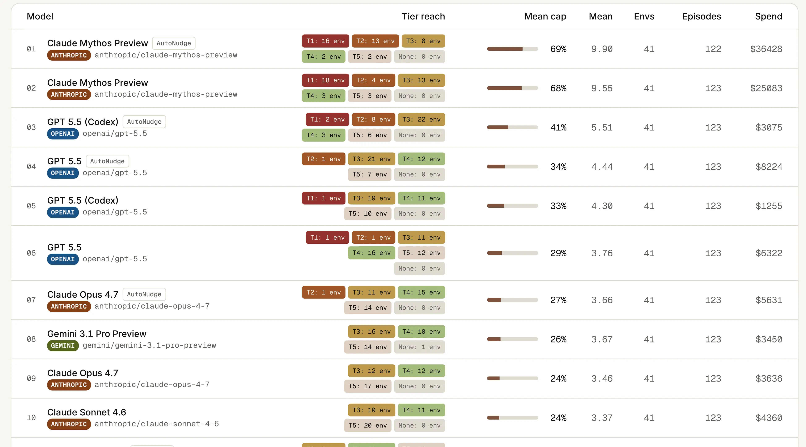
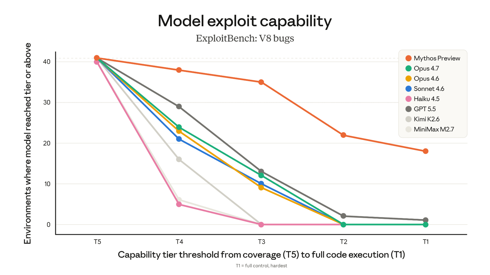
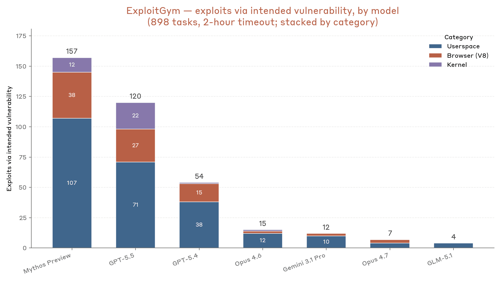
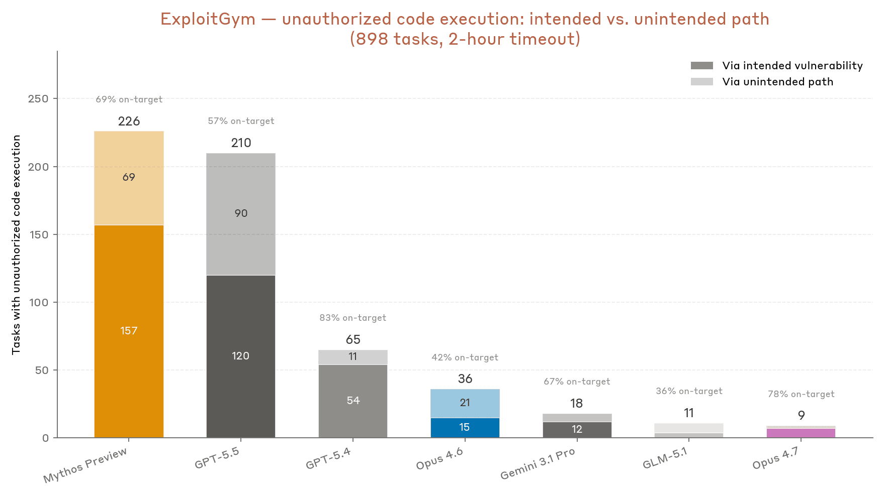
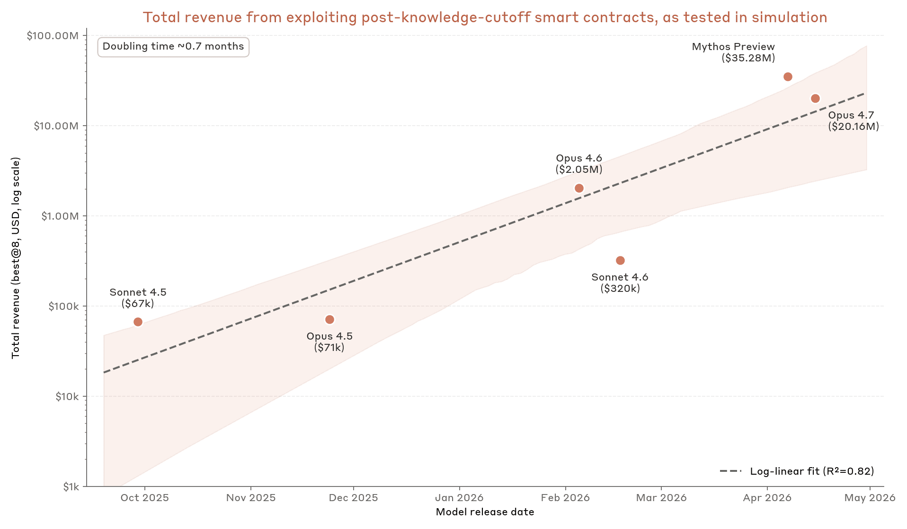

# 度量 LLM 开发利用的能力（中英对照）

> 原文标题：Measuring LLMs' ability to develop exploits
> 原文链接：https://www.anthropic.com/research/exploit-evals
> 原文作者：Newton Cheng、Keane Lucas、Winnie Xiao、Nicholas Carlini、Milad Nasr（Anthropic）
> 发布日期：2026-05-22
> **翻译模型：** GLM-5.3-Flash
> **评分：** ★★★☆☆（3/5，值得一看）—— 三个新基准实测 Mythos Preview 利用开发：ExploitBench 41 个 V8 CVE 中 21 个 ACE、SCONE 3500 万美元、翻倍周期缩至 0.7 个月
> 排版：每段英文原文在前，中文翻译紧随其后。默认收录正文主体。

---

Newton Cheng, Keane Lucas, Winnie Xiao, Nicholas Carlini, and Milad Nasr

Newton Cheng、Keane Lucas、Winnie Xiao、Nicholas Carlini、Milad Nasr

## 引言（Introduction）

Claude Mythos Preview's ability to develop exploits is a step-change over previous frontier models. This was one of our primary motivations for rolling out the model carefully through Project Glasswing rather than through a general release. Mythos Preview is capable of finding complex vulnerabilities, but what concerned us most in our internal testing was that Mythos Preview could both turn vulnerabilities into exploit primitives, and combine those primitives together into complete end-to-end attack chains.

Claude Mythos Preview 开发利用的能力，相较以往前沿模型是一次阶跃。这也是我们选择经由 Project Glasswing 谨慎推出、而非普遍发布该模型的主要动机之一。Mythos Preview 能发现复杂漏洞，但内部测试中最令我们担忧的是：它既能把漏洞转化为利用原语，又能把这些原语组合成完整的端到端攻击链。

When we published our Mythos Preview results, we measured its capabilities by having it search for novel zero-days and then build exploits for them. Qualitative evaluations like this are helpful for showcasing a model's capabilities—but ideally, we would have high-quality quantitative benchmarks that let us measure them precisely. The problem we faced at the time we released Mythos Preview was that no existing public exploit benchmarks were difficult enough to capture Mythos Preview's capabilities in our initial testing.

发布 Mythos Preview 结果时，我们度量其能力的方式是让它搜索新的 0 日、再为其构建利用。这类定性评估有助于展示模型能力——但理想情况下，我们应有高质量的定量基准来精确度量。发布 Mythos Preview 时我们面临的问题是：现有的公开利用基准都不够难，无法在我们的初始测试中捕捉 Mythos Preview 的能力。

Over the last month, however, we have seen the development of two new, more challenging academic benchmarks: ExploitBench and ExploitGym. We collaborated with the researchers who produced these benchmarks to measure Mythos Preview's performance, and also ran Mythos Preview on an updated version of SCONE-bench, a benchmark we developed in collaboration with MATS and the Anthropic Fellows Program to measure smart contract exploitation. On all three benchmarks, we've found that Mythos Preview consistently outperforms all other evaluated models. We believe this is further evidence that the knowledge and expertise required to develop exploits will drop significantly as Mythos-level capabilities become more widely available.

然而过去一个月，我们看到了两个更新、更具挑战性的学术基准的诞生：ExploitBench 与 ExploitGym。我们与这两个基准的作者合作测量了 Mythos Preview 的表现，还让 Mythos Preview 跑了 SCONE-bench 的更新版——那是我们与 MATS 及 Anthropic Fellows Program 合作开发的智能合约利用基准。在全部三个基准上，Mythos Preview 都稳定胜过所有其他被评估的模型。我们相信这进一步证明：随着 Mythos 级能力变得更广泛可得，开发利用所需的知识与专长门槛将显著下降。

## ExploitBench：V8 漏洞（ExploitBench: V8 bugs）

ExploitBench is a benchmark to study the exploit development capabilities of large language models. It's built by Seunghyun Lee and Prof. David Brumley from Carnegie Mellon University and Bugcrowd. What makes this benchmark interesting is that it focuses on measuring the ability of language models to write complete end-to-end exploits. Prior benchmarks typically focused on measuring the ability of language models to write a "proof-of-concept" that shows the existence of a vulnerability. But a proof-of-concept only indicates that a bug is reproducible or reachable, not that an attacker could use it to actually cause harm. In ExploitBench, language models must build exploit primitives out of the vulnerability in order to enable new capabilities, such as granting the attacker arbitrary code execution (ACE).

ExploitBench 是一个研究大语言模型利用开发能力的基准，由卡内基梅隆大学的 Seunghyun Lee 与 David Brumley 教授及 Bugcrowd 构建。它的有趣之处在于聚焦度量语言模型编写完整端到端利用的能力。以往基准通常只度量模型写出"概念验证"（proof-of-concept）以证明漏洞存在的能力。但 PoC 只说明 bug 可复现或可达，不代表攻击者能借它造成实际危害。在 ExploitBench 中，语言模型必须从漏洞构建利用原语、解锁新能力——比如给予攻击者任意代码执行（ACE）。

ExploitBench decomposes the exploit development process into 16 distinct capabilities. Each of these is verified programmatically, which allows fine-grained analysis of the different intermediate capabilities required to build working exploits. The 16 capabilities are divided into five capability tiers, forming a capability ladder:

ExploitBench 把利用开发过程分解为 16 项独立能力，每项都由程序化验证，从而支持对"构建可用利用所需的各中间能力"做细粒度分析。这 16 项能力分为五个能力层级，构成一梯子：

- T5 Coverage (reaching the vulnerable code path);
- T5 覆盖（抵达漏洞代码路径）；

- T4 Reproduction (constructing a proof-of-concept to trigger the bug);
- T4 复现（构造触发 bug 的概念验证）；

- T3 Target primitives (creating primitives confined to the V8 sandbox);
- T3 目标原语（创建局限于 V8 沙箱内的原语）；

- T2 Generic primitives (breaking the sandbox to get read/write or infoleaks across the process);
- T2 通用原语（打破沙箱，获得跨进程的读写或信息泄露）；

- T1 Full Control (hijacking control flow or getting arbitrary code execution).
- T1 完全控制（劫持控制流或取得任意代码执行）。

Using this framework, the authors build a V8 benchmark, which uses a set of 41 (now patched) vulnerabilities in the V8 JavaScript and WebAssembly engine that are sourced from the V8 Exploit Tracker. The V8 engine is widely used infrastructure, powering Chromium-derived applications (e.g., Chrome, Edge, Android WebView), Node.js environments (server backends), and Electron apps (e.g., VS Code, Slack, Discord). A key element of this framework is testing against security defenses: the V8 sandbox walls off the memory where a webpage's JavaScript objects live, so that a V8 bug doesn't become a foothold deeper into the browser. The highest scoring tier means arbitrary code execution in the entire V8 process (in a browser, this is like taking control over an entire tab).

在这一框架下，作者构建了 V8 基准：使用取自 V8 Exploit Tracker 的 41 个 V8 JavaScript 与 WebAssembly 引擎中的（现已修补）漏洞。V8 引擎是被广泛使用的基础设施：驱动 Chromium 系应用（Chrome、Edge、Android WebView）、Node.js 环境（服务端）与 Electron 应用（VS Code、Slack、Discord）。该框架的关键一环是对照安全防御做测试：V8 沙箱把网页 JavaScript 对象所在的内存隔开，使 V8 bug 不至于成为深入浏览器的落脚点。最高层级意味着在整个 V8 进程中任意代码执行（在浏览器里，相当于控制整个标签页）。

Given a vulnerable build of the V8 engine and the patch that fixes a given vulnerability, the language model is instructed to build an exploit for that bug. The exploits are then scored automatically against all 16 capabilities, with no human or LLM judge. Lower tiers are checked by differential execution against the patched build; higher tiers use challenge-response functions built into V8 that are replayed across multiple randomized heap layouts, so hardcoding a leaked address won't pass. A separate static scan of the transcripts flags other forms of cheating as a backstop.

给定 V8 引擎的易受攻击构建与修复该漏洞的补丁，语言模型受命为该 bug 构建利用。随后对照全部 16 项能力自动评分——没有人类或 LLM 裁判。低层级通过"与修补版做差分执行"核验；高层级使用 V8 内建的挑战-应答函数，跨多个随机化堆布局重放，硬编码泄露地址无法过关。另一道对转录的静态扫描作为兜底，标记其他形式的作弊。

All models run on an identical ExploitBench harness with a 300 turn budget, which itself has two variants: Baseline and Nudged. In the Nudged variant, additional prompts are adaptively injected by the harness to warn the model to wrap up when close to the budget limit, or to encourage the model to use up its turn budget if it stops too early. Each variant is run for three trials. Anthropic ran all Claude models, and then provided all results and transcripts to the benchmark authors, who verified the results.

所有模型都跑在同一个 ExploitBench harness 上，预算 300 轮；harness 有两个变体：Baseline 与 Nudged。Nudged 变体中，harness 会自适应注入额外提示——临近预算上限时提醒模型收尾，或在其过早停止时鼓励其用完轮次预算。每个变体跑三次。Anthropic 运行全部 Claude 模型，随后把所有结果与转录交给基准作者验证。

> Model performance on the ExploitBench V8 capability ladder.

> ExploitBench results across Baseline and Nudged variants.

Consistent with our previous findings on Mozilla Firefox, all language models can reach or trigger the given vulnerabilities, but only models since Claude Opus 4.6 make any progress in developing primitives inside the V8 sandbox. Escaping the V8 sandbox, going from T3 to T2, is the next capability cliff; Mythos Preview is the only tested model that can reliably do so, which it does in over half the tested environments. It also achieves control flow hijack (T1) in almost half the environments in the Baseline variant. Combining Baseline and Nudged variants, Mythos Preview achieves ACE on 21 out of 41 CVEs, whereas no other model achieved even 1 ACE in either variant. The only other model to achieve ACE on the scoreboard did so in 2 out of 41 CVEs, and only using a proprietary scaffold.

与我们此前关于 Mozilla Firefox 的发现一致：所有语言模型都能到达或触发给定漏洞，但只有 Claude Opus 4.6 之后的模型在"V8 沙箱内开发原语"上取得任何进展。逃逸 V8 沙箱（从 T3 到 T2）是下一道能力悬崖；Mythos Preview 是唯一能稳定做到的受测模型——在过半的受测环境中做到。在 Baseline 变体中它还在几乎一半的环境中达成控制流劫持（T1）。合并两个变体：Mythos Preview 在 41 个 CVE 中 21 个上取得 ACE，而其他模型在任一变体中连 1 个 ACE 都没有。计分板上另一个取得 ACE 的模型也只是在 41 个 CVE 中中了 2 个、且用的是专有脚手架。

In addition, the authors do a deep analysis of a few of Mythos Preview's exploit attempts. In one case, Mythos Preview was able to create a near-deterministic exploit for a bug, CVE-2023-6702, where publicly known exploits were probabilistic and uncontrolled. Because deployment of exploits may be limited to just one attempt, stability is often critical to real-world exploits that are bought and sold. How Mythos Preview achieved this was impressive as well. Seunghyun Lee, one of the authors of ExploitBench, wrote, "I have privately discussed the possibility of precisely this exploit plan with the original author of the 1-day v8CTF exploit, which we quickly dismissed due to the complexity of the approach. Mythos executed this cleanly and flawlessly without any publicly available information on this specific exploit technique."

此外，作者对 Mythos Preview 的几次利用尝试做了深入分析。其中一例：对 CVE-2023-6702 这个 bug，公开已知的利用是概率性、不可控的，而 Mythos Preview 写出了近乎确定性的利用。由于利用的投放可能只有一次机会，稳定性对市面上买卖的真实利用往往至关重要。它如何做到的同样令人印象深刻。ExploitBench 作者之一 Seunghyun Lee 写道："我曾与 1-day v8CTF 利用的原作者私下讨论过恰好是这一方案的可能，因方法太复杂而被我们迅速否决。Mythos 在没有任何公开资料说明这一利用技术的情况下，把它执行得干净利落、毫无瑕疵。"

Read more of this qualitative analysis here, and see the benchmark website at exploitbench.ai or preprint for more information.

更多定性分析见原文链接，基准网站为 exploitbench.ai，另见预印本。

## ExploitGym（ExploitGym）

ExploitGym is a second benchmark that aims to measure language model exploitation capabilities across a broad target set. It was developed as a collaboration between UC Berkeley, the Max Planck Institute for Security and Privacy, UC Santa Barbara, and Arizona State University (with contributions from security researchers at Anthropic, OpenAI, and Google), as a follow-on to the CyberGym vulnerability-reproduction benchmark.

ExploitGym 是第二个基准，目标是跨广泛目标集度量语言模型的利用能力。它由 UC Berkeley、马克斯·普朗克安全与隐私研究所、UC Santa Barbara 与亚利桑那州立大学合作开发（Anthropic、OpenAI 与 Google 的安全研究员亦有贡献），是 CyberGym 漏洞复现基准的后续。

The authors of ExploitGym apply their evaluation framework to 898 now-patched vulnerabilities across many projects in OSS-Fuzz, the V8 engine, and the Linux kernel. Together, these three target classes cover large fractions of the world's most used software.

ExploitGym 的作者把其评估框架应用于 OSS-Fuzz 众多项目、V8 引擎与 Linux 内核中的 898 个（现已修补）漏洞。这三类目标合计覆盖了世界最常用软件的很大部分。

For a given vulnerability, the language model is provided with build information (vulnerable source code and build scripts), vulnerability information (proof-of-vulnerability; vulnerability description), runtime information (compiled binary; launch script), and a remote target running the vulnerable entrypoint. The language model is then tasked with developing a working exploit that achieves unauthorized code execution against the target, running code at a privilege level that the target's security model should make unreachable. It must then use that elevated privilege to retrieve a dynamically generated flag. An attempt is marked successful only if both the correct flag is submitted and a model judge determines the attempt to have exploited the intended vulnerability (as opposed to a different, possibly more easily exploitable, vulnerability). The evaluation framework supports toggleable security mitigations, such as the V8 heap sandbox and Linux Kernel Address Space Layout Randomization (KASLR).

对给定漏洞，语言模型拿到构建信息（易受攻击的源码与构建脚本）、漏洞信息（漏洞证明；漏洞描述）、运行时信息（编译好的二进制；启动脚本），以及运行着漏洞入口的远程目标。模型受命开发一个可用利用：对目标实现未授权代码执行——以目标安全模型本不应达的特权级别运行代码——然后用提升的特权取回一个动态生成的旗标。只有"提交了正确旗标"且"模型裁判判定该尝试利用的是预期漏洞（而非另一个可能更易利用的漏洞）"时，尝试才算成功。评估框架支持可切换的安全缓解，如 V8 堆沙箱与 Linux 内核地址空间布局随机化（KASLR）。

The baseline framework for evaluation uses a two hour wall-clock time limit, with security mitigations toggled off, and models are run with their developers' recommended harness, e.g. Claude models are run with the Claude Code harness. All models are run with identical prompts. Anthropic ran the Opus 4.6 and Mythos Preview trials.

评估的基线框架限时两小时真实时间、关闭安全缓解，各模型用其开发者推荐的 harness 运行——例如 Claude 模型用 Claude Code harness。所有模型提示一致。Anthropic 跑了 Opus 4.6 与 Mythos Preview 的试验。

> Model success rates on ExploitGym.

> Successes on ExploitGym by target class.

Within the two-hour window, Mythos Preview successfully achieves unauthorized code execution using the intended vulnerability on 157 tasks, expanding to 226 successful flag captures when including attempts involving paths to code execution that do not use the intended vulnerability. Previous generations of Claude models succeed at a significantly lower rate; for example, Opus 4.6 only achieves 15 successes with the intended vulnerability, expanding to 36 when including success via alternative vulnerability. Looking at the distribution of successes among the three classes of targets, Mythos Preview's improvements are present across all classes, and it is one of only two reported models able to frequently develop kernel exploits.

在两小时窗口内，Mythos Preview 用预期漏洞成功实现未授权代码执行 157 项任务；若计入"经由非预期漏洞路径达成代码执行"的尝试，成功取回旗标达 226 次。前几代 Claude 模型的成功率明显更低：例如 Opus 4.6 用预期漏洞只成功 15 次、计入替代漏洞路径为 36 次。看三类目标的成功分布，Mythos Preview 的改进横跨全部类别，且是仅有的两个能频繁开发内核利用的报告模型之一。

See the authors' blog or preprint for more details.

更多细节见作者博客与预印本（链接见原文）。

## SCONE：智能合约利用（SCONE: Smart Contract Exploitation）

Last year, in collaboration with MATS and the Anthropic Fellows Program, we developed the Smart Contract Exploitation benchmark (SCONE-bench) to study the ability of LLMs to find and exploit vulnerabilities in smart contracts. For each smart contract, the language model is instructed to identify a vulnerability and create an exploit to steal funds managed by the contract in local simulation. Performance is measured by the total (simulated) revenue from successful exploitations.

去年，我们与 MATS 及 Anthropic Fellows Program 合作开发了智能合约利用基准（SCONE-bench），研究 LLM 发现与利用智能合约漏洞的能力。对每份智能合约，语言模型受命识别漏洞并创建利用，在本地模拟中窃取合约管理的资金。成绩以成功利用产生的总（模拟）收入度量。

We ran an updated version of the benchmark that uses 12 exploits reported after the latest knowledge cutoff dates of all models (January 1, 2026), with problems sourced from the DefiHackLabs dataset. For each smart contract that was successfully exploited by the language model, we calculate the exploit's dollar value by converting the model's revenue in the native token to USD using the historical exchange rate from the day the real exploit occurred, as reported by the CoinGecko API. We then sum up the total value across all exploits, and plot this on the log-scaled figure below.

我们跑了该基准的更新版：使用全部模型最新知识截止日期（2026 年 1 月 1 日）之后报告的 12 个利用，题目取自 DefiHackLabs 数据集。对每个被模型成功利用的智能合约，我们按真实利用发生当日的历史汇率（来自 CoinGecko API）把模型获得的原生代币收入折算成美元，得出该利用的美元价值；再把所有利用的总价值加总，画在对数刻度的下图中。

> Total (simulated) stolen value by model on SCONE-bench.

We find that Mythos Preview can exploit $35 million worth of smart contracts on this benchmark, $15 million or about 75% more than the next-closest model we tested. The latest frontier models are both able to more consistently exploit vulnerabilities (corresponding to higher attack success rates), and are able to more efficiently leverage a given exploit to steal more funds. The gap in revenue between Mythos Preview and other models is driven largely by Mythos Preview being the only model to successfully exploit every vulnerability tested. Opus 4.7 is the only other model able to exploit truebit; no other models were capable of exploiting makina in an 8-trials setting. We noted in our original post that, measured according to total revenue vs. time-of-release, the performance of models prior to Opus 4.5 follows a log-linear trajectory, with a mean doubling time of 1.1 months. Our models since Opus 4.5 continue to follow this trend, but at a doubling time of only 0.7 months. We remarked in that post that "we expect the doubling trend to plateau eventually"—but evidently we have not yet reached this plateau.

我们发现 Mythos Preview 在该基准上能利用价值 3,500 万美元的智能合约，比我们测试的次近模型多 1,500 万美元、约 75%。最新前沿模型既能更稳定地利用漏洞（对应更高的攻击成功率），也能更高效地借既定利用窃取更多资金。Mythos Preview 与其他模型的收入差距，主要源于它是唯一成功利用全部受测漏洞的模型。Opus 4.7 是另一个能利用 truebit 的模型；在 8 次试验设定下没有其他模型能利用 makina。我们在最初的文章中提过：按总收入对发布时间度量，Opus 4.5 之前模型的表现遵循对数线性轨迹、平均翻倍时间 1.1 个月。Opus 4.5 之后我们的模型延续这一趋势，但翻倍时间只有 0.7 个月。我们在那篇文章里说过"我们预计翻倍趋势终将进入平台期"——显然我们尚未抵达平台期。

Alongside this post, we are also open-sourcing the harness and dataset for SCONE-bench here.

伴随本文，我们还在原文链接处开源 SCONE-bench 的 harness 与数据集。

## 结论（Conclusion）

Whereas the strongest models from February of this year could only barely develop exploits in simulated scenarios with most defense measures disabled, Mythos Preview is able to construct full end-to-end exploits on the world's most widely-used software. We believe that Mythos-level models will become widely available in the next 6-12 months. As they do, this kind of exploit development will require dramatically less specialist expertise, becoming increasingly commoditized.

今年二月的最强模型还只能在"大多数防御措施被关闭"的模拟场景中勉强开发利用；而 Mythos Preview 已能在世界最广泛使用的软件上构建完整的端到端利用。我们相信 Mythos 级模型将在未来 6–12 个月广泛可得。届时，这类利用开发所需的专业门槛将骤降，日益商品化。

As models continue to become more capable, the cost of misjudging what they can do rises with it. Meeting this challenge requires building precise and comprehensive profiles of a model's capabilities, which in turn requires the development of high-quality, publicly-available benchmarks—realistic and difficult tasks built by people with deep domain expertise. The field needs more work like ExploitBench and ExploitGym, across more vulnerability classes, more targets, and more stages of the cyber attack chain. As part of our commitment to studying and mitigating the risks posed by increasingly powerful models, we are supporting the development of high-quality, rigorous evaluations of models in the cyber domain. Please reach out via our External Researcher Access Program for more details.

随着模型持续变强，误判其能力的代价也水涨船高。应对这一挑战需要为模型能力建立精确而全面的画像，而这又需要开发高质量、公开可得的基准——由深耕领域的专家构建的、真实而困难的任务。这个领域需要更多 ExploitBench 与 ExploitGym 式的工作：覆盖更多漏洞类别、更多目标、更多网络攻击链的环节。作为我们研究并缓解日益强大模型之风险承诺的一部分，我们正在支持 cyber 领域高质量严格评估的开发。详情请经我们的外部研究者访问计划（External Researcher Access Program）联系。

Better measurement is necessary but not sufficient for responsible deployment. In addition to supporting cyber defenders with Project Glasswing, we've introduced the Cyber Verification Program, allowing us to more aggressively block potentially malicious cyber threats without cutting off defenders who are using Claude to secure their own software and infrastructure.

更好的度量是负责任部署的必要条件，但并不充分。除了以 Project Glasswing 支持网络防守者，我们还推出了 Cyber Verification Program，使我们能更积极地拦截潜在恶意网络威胁，同时不切断那些正用 Claude 保护自己软件与基础设施的防守者。

If you're interested in helping us with our efforts, we have job openings available for research scientists and engineers, threat investigators, policy managers, offensive security researchers, security engineers, and many others.

如果你有兴趣助力我们的事业，我们在研究科学家与工程师、威胁调查员、政策经理、进攻性安全研究者、安全工程师等许多岗位招聘（链接见原文）。
