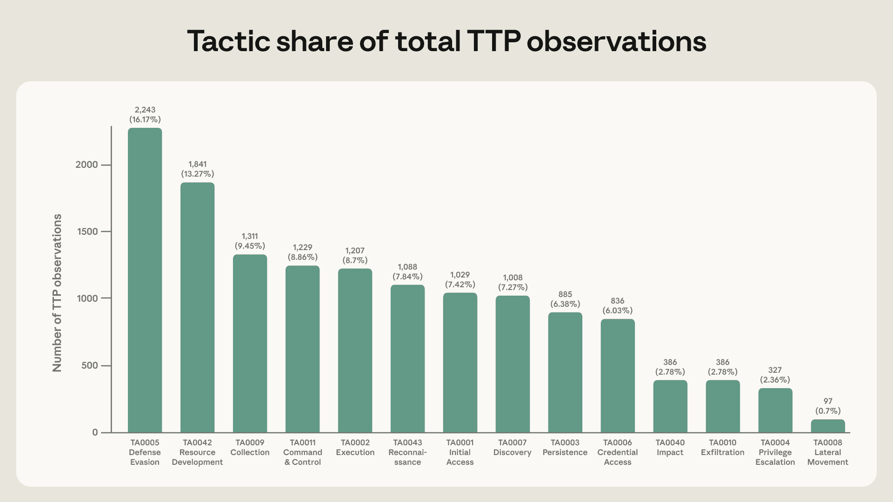
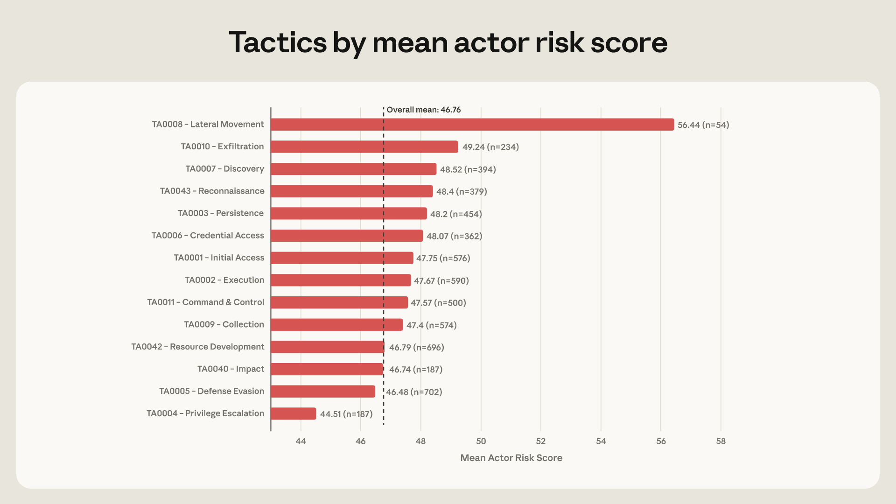

# 映射 AI 赋能的网络威胁（中英对照）

> 原文标题：Mapping AI-enabled cyber threats
> 原文链接：https://www.anthropic.com/research/attack-navigator
> 原文作者：Kyla Guru、Alex Moix、Jacob Klein（Anthropic）
> 发布日期：2026-06-03
> **翻译模型：** GLM-5.3-Flash
> **评分：** ★★★☆☆（3/5，值得一看）—— LLM ATT&CK Navigator 与 ARiES 风险评分：区分高低风险者的不再是技术娴熟而是编排方式，横向移动高出 10.5 分
> 排版：每段英文原文在前，中文翻译紧随其后。默认收录正文主体；脚注以 Obsidian 脚注形式保留于文末。

---

Kyla Guru, Alex Moix, and Jacob Klein

Kyla Guru、Alex Moix、Jacob Klein

We've spent the past year investigating how threat actors are weaponizing AI to conduct cyber operations. Today, we're sharing a new analysis that maps these real-world attacks onto the MITRE ATT&CK® framework, a database of tactics and techniques used by cyberattackers. Doing so reveals patterns that challenge traditional assumptions about cybersecurity—for example, the level of risk a threat actor poses can be assessed via metrics like technical sophistication or breadth of techniques. We partnered with Verizon to include some of these results in the 2026 Verizon Data Breach Investigation Report (DBIR), and are publishing this report to offer a longer-form analysis of trends we are seeing in AI-enabled cyber operations.[^1]

过去一年，我们一直在调查威胁行为者如何把 AI 武器化以实施网络行动。今天我们分享一项新分析：把这些真实攻击映射到 MITRE ATT&CK® 框架——一个收录网络攻击者战术与技术的数据库。这样做揭示出挑战网络安全传统假设的模式——例如"威胁行为者的风险等级可以靠技术娴熟度或技术广度来评估"这类假设。我们与 Verizon 合作把部分结果纳入《2026 Verizon 数据泄露调查报告》（DBIR），并发布本报告，对我们看到的 AI 赋能网络行动趋势做更长的分析。[^1]

Open the interactive Navigator in a new tab.

在新标签页打开交互式 Navigator（链接见原文）。

## 关键发现（Key findings）

For this study, we analyzed 832 accounts associated with malicious cyber activity over the course of one year, from March 2025 to March 2026. Anthropic banned these accounts from using Claude for violating our Usage Policy. The accounts in this analysis are just a subset of those we investigated and banned during this time period; we selected them because we had enough detail about their malicious activities to map their techniques onto the MITRE ATT&CK framework.

本研究分析了 2025 年 3 月至 2026 年 3 月一年间 832 个与恶意网络活动关联的账号。这些账号因违反我们的使用政策而被禁止使用 Claude。本分析中的账号只是同期我们调查并封禁账号的一个子集；选中它们是因为对其恶意活动的细节足够充分，可以把技术映射到 MITRE ATT&CK 框架上。

The 832 accounts in our analysis used AI models for all 14 tactics and 482 unique sub-techniques across the framework, from initial reconnaissance through final impact.[^2] We also developed a risk-scoring framework (described later in this post) to assess how much AI assistance helped these actors plan their attacks. Most strikingly, we found that the percentage of actors labeled as being medium risk or higher jumped from 33% to 56% between the first and second halves of the year. This suggests that AI is helping attackers conduct increasingly sophisticated cyber operations with greater ease.

分析中的 832 个账号用 AI 模型覆盖了框架内全部 14 个战术与 482 种独特子技术——从初始侦察到最终影响。[^2]我们还开发了一个风险评分框架（后文详述），评估 AI 协助对这些行为者策划攻击的帮助程度。最醒目的是：被评为中等风险或以上的行为者比例，在上下半年之间从 33% 跳到 56%。这提示 AI 正在帮助攻击者更轻松地实施日益精密的网络行动。

There are three key findings from our analysis:

我们的分析有三点关键发现：

- The number of actors using AI for cyber operations is growing, and their actions carry higher risk. As mentioned above, the percentage of medium- or high-risk actors increased by a factor of about 1.7 in under a year, from 33% in the first half of our study window to 56% in the second. That growth is concentrated in actors using AI for some of the most harmful activities, including lateral movement, credential dumping, and web shells—that carry the highest per-actor risk weight in our scoring, rather than the commodity build-and-obfuscate work that dominates the rest of the population. Traditionally, only the most technically sophisticated actors could operate across the entire killchain, or the sequential stages of a cyberattack. But our analysis found that this is no longer the case. The platform through which they access the model (such as an API or an agentic coding platform like Claude Code) also has no bearing on how high-risk their actions are. What does distinguish the highest-risk actors is which techniques they're asking the model for.
- 把 AI 用于网络行动的行为者在增多，其行动风险更高。如上所述，中高风险行为者比例在不到一年里增长约 1.7 倍：从研究窗口上半年的 33% 到下半年的 56%。增长集中于把 AI 用于最有害活动的行为者——横向移动、凭据转储、web shell——这些在我们的评分中单行为者风险权重最高；而非主导其余人群的"批量构建加混淆"式工作。传统上，只有技术最老练的行为者才能横跨整条 killchain（网络攻击的顺序阶段）。但我们的分析发现，情况已非如此。其访问模型的平台（API 或 Claude Code 这类 agentic 编程平台）也与行动风险高低无关。真正区分最高风险行为者的，是他们向模型要哪些技术。

- Agentic scaffolding will make it possible for cyberattacks to be far more autonomous. As AI-enabled cyber techniques become more common among this population, it will become harder to differentiate an actor's risk level based on what they are asking a model to do. Instead, the differentiator will become the scaffolding—the surrounding code, architecture, and tooling that makes AI models more capable—that actors build around the model so they can chain together attack stages autonomously. This was starkly apparent in the cyber espionage campaign we disrupted in November 2025, which had a maximum risk score of 100 yet only used a number of techniques comparable to medium-risk actors. That attack was distinct not because of the number of techniques it employed but because of how the attackers used an AI agent to orchestrate them.
- agentic 脚手架将使网络攻击远更自主。随着 AI 赋能的网络技术在这一人群中更常见，按"他们让模型做什么"区分风险等级会越来越难。区分器将变成脚手架——围绕模型搭建的周边代码、架构与工具——行为者借它把攻击阶段自主串联。这在我们 2025 年 11 月瓦解的网络间谍行动中极为明显：该行动风险评分满分 100，所用技术数量却只与中等风险行为者相当。那次攻击的独特之处不在技术数量，而在攻击者如何用 AI agent 编排它们。

- The MITRE ATT&CK framework doesn't yet cover the autonomous actions that make these actors so dangerous. Autonomous killchain orchestration, real-time pivot decisions, and AI-directed execution with no human intervention don't yet have ID numbers in the ATT&CK framework. Our report included 13,873 observations of malicious activity, all of which mapped to categories laid out in the framework—but the behaviors that distinguish the highest-risk actors, and determine the speed and scale of their operations, don't yet have such IDs. The taxonomy that modern threat intelligence relies on needs to grow to capture them.
- MITRE ATT&CK 框架尚未覆盖让这些行为者如此危险的自主行动。自主 killchain 编排、实时转向决策、无人类干预的 AI 指挥执行，在 ATT&CK 里还没有编号。我们的报告包含 13,873 条恶意活动观察，全部能映射到框架既有类别——但区分最高风险行为者、决定其行动速度与规模的行为，尚无对应编号。现代威胁情报依赖的分类学需要生长，才能捕捉它们。

While Claude Mythos Preview demonstrates where frontier AI cyber capabilities are heading—models able to find and exploit vulnerabilities at a level approaching the most skilled human researchers—this report tells us how threat actors are misusing generally available models today. It also serves as a guide to how threat actors are likely to misuse increasingly capable models in the near future, giving defenders a chance to get ahead of them.

虽然 Claude Mythos Preview 展示了前沿 AI 网络能力的去向——能以接近最强人类研究者的水平发现并利用漏洞的模型——本报告告诉我们的是：威胁行为者今天如何滥用普遍可得的模型。它也是一份指南：不久的将来，行为者可能如何滥用日益强大的模型——给防守者抢在其前面的机会。

What we learned from this and other analyses directly shapes how we build Claude to prevent such misuse. For example, we've updated the classifiers built into Claude to detect the highest-risk actors, and have expanded our probe detections to cover high-risk behavioral indicators revealed by this analysis. These findings point to a landscape where the dividing line between low and high-risk actors is no longer technical skill but orchestration, and where defenses, detections, and the shared frameworks we all rely on will need to evolve as fast as the attacks they describe.

我们从这项及其他分析中学到的东西，直接塑造我们构建 Claude 以防此类滥用的方式。例如，我们更新了 Claude 内建的分类器以检测最高风险行为者，并扩展探针检测以覆盖本分析揭示的高风险行为指标。这些发现指向一个图景：低高风险行为者的分界线不再是技术技能，而是编排；防御、检测与我们共同依赖的共享框架，都需要以与其描述的攻击同样的速度演化。

## 关于数据集（About the dataset）

The findings in this report are drawn from 832 accounts that Anthropic banned for violating cyber-related parts of our Usage Policy between March 2025 and March 2026. We identified these accounts through a combination of automated safeguards and investigations by our Threat Intelligence team. For each account, we produced a summary of the observed activity. We then extracted the tactics, techniques, and procedures (or TTPs) described in those summaries, and mapped them to the version of the MITRE ATT&CK framework that was live at that time (V18). In all, we observed 13,873 actions across 482 unique techniques and all 14 ATT&CK tactics.

本报告的发现来自 2025 年 3 月至 2026 年 3 月间因违反使用政策 cyber 相关部分而被 Anthropic 封禁的 832 个账号。我们通过自动防护与威胁情报团队调查相结合识别这些账号。对每个账号，我们产出观察活动的摘要；再从摘要中提取战术、技术与程序（TTP），映射到当时生效的 MITRE ATT&CK 版本（V18）。合计我们观察到 13,873 个动作，跨 482 种独特技术与全部 14 个 ATT&CK 战术。

We gave each actor a risk score from 0 to 100 (with 0 being the lowest risk and 100 being the highest) based on a new methodology we've developed called the AI Risk Enablement Score (ARiES), described below. We've anonymized the data so that actors cannot be identified in the analysis that follows.

我们按新开发的方法给每个行为者 0–100 的风险评分（0 最低、100 最高），该方法叫 AI 风险赋能分（AI Risk Enablement Score，ARiES），下文详述。数据已匿名化，后续分析中行为者不可被识别。

## LLM ATT&CK Navigator 与 ARiES 风险评分（The LLM ATT&CK Navigator and ARiES risk score）

As part of this analysis, we developed the LLM ATT&CK Navigator: an interactive framework that maps observed AI-enabled misuse patterns onto the MITRE ATT&CK framework and assigns an ARiES risk score to the actor. ARiES is a composite score built from three signals: the actor's threat profile, the model's contribution to the requested harm, and the observed or potential impact. It is calculated based on the actor's activity across Claude.ai, Claude Code, and our API, drawing on our safety classifiers alongside open-source and internal threat-intelligence indicators. The higher the score, the higher-risk the AI enabled actor is.

作为分析的一部分，我们开发了 LLM ATT&CK Navigator：一个交互式框架，把观察到的 AI 赋能滥用模式映射到 MITRE ATT&CK 框架、并为行为者赋予 ARiES 风险分。ARiES 是由三个信号构成的复合分：行为者的威胁画像、模型对所求危害的贡献、以及已观察或潜在的影响。它基于行为者在 Claude.ai、Claude Code 与我们 API 上的活动计算，调用我们的安全分类器，辅以开源与内部威胁情报指标。分数越高，AI 赋能行为者的风险越高。

Our framework scores both individual techniques and accounts across three dimensions:

我们的框架沿三个维度为单个技术与账号评分：

- Threat (0–35 points): Evaluates the clarity of the actor's intent, their technical sophistication, threat intelligence signals, and tactics employed by the account to evade detection. Technical sophistication is graded by Claude on the basis of the actor's prompts and tool usage, measuring expertise required, operator skill, bespoke-versus-commodity tooling, and capability depth.
- 威胁（0–35 分）：评估行为者意图的明确性、技术娴熟度、威胁情报信号、以及该账号规避检测的战术。技术娴熟度由 Claude 依据行为者的提示与工具使用评级，度量所需专长、操作者技能、定制与商品化工具之别、以及能力深度。

- Vulnerability (0–35 points): Assesses the model's capacity to enable the requested harm and the risk profile of the interface used. Programmatic interfaces (i.e. API) and agentic coding tools like Claude Code score highest due to their potential to automate actions.
- 脆弱性（0–35 分）：评估模型实现所求危害的能力，以及所用接口的风险画像。程序化接口（即 API）与 Claude Code 这类 agentic 编程工具因自动化动作的潜力得分最高。

- Impact (0–30 points): Captures the real-world effects of the user's behavior through scores assigned by our safety classifiers and investigators' assessment of actual or potential consequences attributable to AI's involvement in the operation.
- 影响（0–30 分）：通过我们安全分类器给出的分数、以及调查者对"可归因于 AI 参与"的实际或潜在后果的评估，捕捉用户行为的现实效应。

Together, these components produce a total risk score from 0 to 100, allowing us to categorize threat actors and techniques into low, medium, high, and critical risk tiers.

这些组件合起来产出 0–100 的总风险分，使我们能把威胁行为者与技术归入低、中、高、critical 风险档。

A note on the scoring formula

关于评分公式的一点说明

#### 关于评分公式的一点说明（A note on the scoring formula）

Traditional cyber risk equations express risk as Threat × Vulnerability × Impact—a multiplicative model that reflects whether a hypothetical attack is likely to succeed. Under this model, if any one factor is zero, the overall risk collapses to zero, because a missing ingredient means the attack will not succeed.

传统的网络风险公式把风险表达为威胁 × 脆弱性 × 影响——一个乘法模型，反映假想攻击是否可能成功。在该模型下，任一因子为零，总体风险即归零：缺一个要素，攻击就不会成功。

Our model deliberately uses addition rather than multiplication so that we can answer the question, "Which AI-involved actors and techniques warrant the most attention from defenders?" We wanted a score that would remain meaningful even when one dimension is absent or unclear, which the multiplication model does not allow. Consider the following scenarios:

我们的模型刻意用加法而非乘法，以便回答"哪些涉及 AI 的行为者与技术最值得防守者关注"。我们想要一个在某维度缺失或不清晰时仍有意义的分数——乘法模型做不到。考虑以下场景：

High capability and consequence, but no clear intent. Imagine an inexperienced user who, through experimentation with an agentic coding tool, inadvertently produces functional offensive capabilities, like a wormable exploit. Intent is effectively zero, so a multiplicative score would register this as no risk. But in reality, the model has still provided substantial uplift to a potential attack, and the interaction is very much worth surfacing so that additional safeguards can be deployed.

能力与后果俱高，但意图不明。想象一个没有经验的用户，在试用 agentic 编程工具时无意间产出了可用的攻击能力——比如可蠕虫传播的利用。意图实际为零，乘法评分会把这记为零风险。但现实中，模型已为潜在攻击提供了可观的助力，这一交互非常值得浮出水面、以便部署额外防护。

Clear intent and capability but no identified victim. Now consider an actor with explicit malicious intent who misuses Claude to develop working malware, but we have no evidence of deployment or downstream impact—yet. The multiplicative model would, again, zero out the score on the "impact" dimension, even though the AI enablement signal—the fact that an adversary was able to successfully develop harmful software using the model—is exactly what we want our detection systems to catch early.

意图与能力俱明，但未确认受害者。再想一个怀有明确恶意的行为者滥用 Claude 开发可用恶意软件，但我们尚无部署或下游影响的证据。乘法模型又会把"影响"维度清零——尽管"对手能用模型成功开发有害软件"这一 AI 赋能信号，恰是我们希望检测系统尽早抓住的。

By contrast, our additive model preserves signals from each dimension independently, meaning partial attack-enablement patterns remain visible. The tradeoff is that our scores are not predictions of whether an attack will be successful; rather, they are measures of how concerning an AI-involved misuse case is. As we will discuss below, we can also use these scores to see what specific parts of the ATT&CK framework are most concerning, and correlate these with where high-risk actors are operating.

相比之下，我们的加法模型独立保留每个维度的信号，部分攻击赋能模式依然可见。代价是：我们的分数不是"攻击是否会成功"的预测，而是"一起涉及 AI 的滥用案件有多令人担忧"的度量。如下文所述，我们还能用这些分数观察 ATT&CK 框架中哪些具体部分最令人担忧，并把它们与高风险行为者的活动区域相关联。

## 网络威胁行为者今天如何使用 AI（How cyber threat actors are using AI today）

Our empirical analysis of 13,873 observed techniques reveals clear patterns in how adversaries are using AI across the attack lifecycle, and the most common techniques that models are being used for today.

对 13,873 个观察技术的实证分析，清晰地揭示了对手在攻击生命周期中如何使用 AI，以及今天模型最常被用于的技术。

### AI 辅助的能力开发（AI-assisted capability development）

The most common technique family we observed was ATT&CK ID T1587 (Develop Capabilities), used by 574 of the 832 actors in our analysis, or 69%. The majority of this behavior manifests as T1587.001 (Malware Development), used by 560 actors. In practice, we observe threat actors misusing models to build and refine custom scripts to run, write DLL injection code with detailed guidance on how to implement it, as well as canvas fingerprinting evasion and automated account management.

我们观察到的最常见技术族是 ATT&CK ID T1587（开发能力）：832 个行为者中的 574 个（69%）使用。其中大部分表现为 T1587.001（恶意软件开发），560 个行为者使用。实践中，我们看到威胁行为者滥用模型构建并打磨可运行的自定义脚本、撰写附详细实现指引的 DLL 注入代码，以及画布指纹规避与自动化账号管理。

The next most prevalent techniques are T1027 (Obfuscated Files or Information), employed by 64.7% of threat actors; T1005 (Data from Local System), employed by 55.9% of threat actors; and T1562 (Impair Defenses), employed by 54.9% of threat actors. Together, these top techniques show that threat actors most commonly seek LLM's help to build pre-engagement offensive tooling, make those tools harder to detect, and harvest data from compromised systems.

次常见的技术是：T1027（混淆文件或信息），64.7% 的威胁行为者使用；T1005（本地系统数据），55.9%；T1562（削弱防御），54.9%。这些头部技术合起来表明：威胁行为者最常求 LLM 帮忙构建攻击前准备期的攻击工具、让这些工具更难被检测、以及从被攻陷系统收割数据。

On the other hand, actors are much less likely to use LLMs for real-time, adaptive decision-making once they've gotten inside a target network. For example, only 54 of 832 threat actors (6.5%) use models for lateral movement, and less than 12 actors use models for remote services like RDP, SSH, and SMB. Only 22.5% of actors use LLMs for privilege escalation and impact stages.

另一方面，行为者在进入目标网络之后，用 LLM 做实时自适应决策的可能性小得多。例如 832 个威胁行为者中只有 54 个（6.5%）用模型做横向移动，不到 12 人用模型处理 RDP、SSH、SMB 等远程服务。只有 22.5% 的行为者把 LLM 用于提权与影响阶段。

Some technique families that are staples of real-world cyberattacks—such as active directory exploitation, Kerberos ticket attacks, cloud infrastructure manipulation (AWS, Azure, GCP), and container escape—have notably lower representation within the dataset.

一些真实网络攻击的 staple 技术族——如活动目录利用、Kerberos 票据攻击、云基础设施操纵（AWS、Azure、GCP）与容器逃逸——在数据集中占比明显偏低。

The top techniques and the frequency with which actors used them didn't change much over the one-year period we studied. For both the first and second halves of the period, the median number of techniques the model is used for is 16. In the second half of the year, we observe a subtle directional shift, with threat actors using models less to build standalone malware or obfuscation scripts and more to help with specific operational phases in a cyberattack, and for on-target discovery and collection techniques. Specifically, we observe an 8.9% increase in T1087 (Account Discovery) occurrences, as well as a 6.2% increase in T1020 (Automated Exfiltration), alongside a 12% decrease in T1587 (Develop Capabilities) and a 8.6% decrease in T1566 (Phishing).

头部技术及其使用频率在我们研究的一年里变化不大。上下两个半年，模型被用于的中位技术数都是 16。下半年我们观察到细微的方向性变化：威胁行为者用模型构建独立恶意软件或混淆脚本变少，更多用于网络攻击的特定操作阶段、以及目标侧的发现与收集技术。具体地：T1087（账户发现）出现率上升 8.9%、T1020（自动外泄）上升 6.2%，而 T1587（开发能力）下降 12%、T1566（钓鱼）下降 8.6%。

### AI 辅助的规避战术（AI-assisted evasion tactics）

Defense evasion is the single largest tactic category in the dataset, present in the behavior of 84.4% of the actors we studied. MITRE defines 64 techniques under "defense evasion" (across its Enterprise- and Mobile-specific frameworks); we observe 32 of these techniques in our dataset: 25 for enterprise and 7 for mobile.

防御规避是数据集中最大的单一战术类别，存在于我们所研究行为者中 84.4% 的行为里。MITRE 在"防御规避"下定义了 64 种技术（横跨 Enterprise 与 Mobile 两套框架）；我们在数据集中观察到其中 32 种：企业侧 25 种、移动侧 7 种。

The top techniques observed within this tactic include:

该战术下观察到的主要技术包括：

- T1027 (Obfuscated Files or Information). 64.7% of threat actors in our sample used AI to implement techniques like XOR/base64 encoding, polymorphic variants, and anti-detection wrappers to evade signature-based detection.
- T1027（混淆文件或信息）。样本中 64.7% 的威胁行为者用 AI 实现 XOR/base64 编码、多态变体、反检测包装等技术以规避签名检测。

- T1562 (Impair Defenses). 54.8% of the threat actors studied used AI to bypass, disable, or tamper endpoint security tools.
- T1562（削弱防御）。所研究行为者中 54.8% 用 AI 绕过、禁用或篡改端点安全工具。

- T1055 (Process Injection). 30.3% of actors used AI to write malicious code that could be injected into legitimate processes, such as process hollowing and DLL injection, to execute payloads from trusted process memory.
- T1055（进程注入）。30.3% 的行为者用 AI 编写可注入合法进程的恶意代码——如进程镂空与 DLL 注入——以从受信进程内存执行载荷。

> Distribution of ATT&CK tactics: defense evasion dominates, post-compromise stages are rare.

较少使用的战术包括：影响（2.8%）、外泄（2.8%）、提权（2.4%）与横向移动（0.7%）。它们合计只占全部观察的 8.7%——不到防御规避一项。这些动作都发生在攻击生命周期较晚的阶段，提示威胁行为者更多在攻击早期使用模型、较少在后期（即已渗入网络、正在适应真实环境条件时）使用。这一模式在我们研究的一年里保持稳定。

### 高风险行为者及其战术（High-risk actors and their tactics）

While tactics such as lateral movement are much less prevalent in our dataset, they are highly correlated with the highest ARiES risk scores—meaning that the highest-risk actors are also the ones most likely to use models for the later stages of a cyberattack. Actors who use AI to perform lateral movement have risk scores that are, on average, 10.5 points higher than actors who do not use AI tools in this way. This suggests that going from using AI to prepare for a cyberattack to using it to take actions in live network operations is a key marker of high AI enablement.

虽然横向移动这类战术在数据集中少见得多，它们与最高的 ARiES 风险分高度相关——最高风险的行为者恰是最可能把模型用于网络攻击后期阶段的人。用 AI 执行横向移动的行为者，其风险分平均比不这样用 AI 的行为者高 10.5 分。这提示：从"用 AI 准备网络攻击"跨到"用 AI 在活跃网络行动中采取行动"，是高 AI 赋能的关键标记。

> Risk score gap between lateral-movement actors and others.

总体而言，风险分最高的行为者最重度地把 AI 用于"攻陷后、上手操作"的技术：远程服务、凭据转储、web shell 部署、内网与账户发现。横向移动是高风险行为者最强的标记：数据集中使用横向移动的 54 个行为者平均风险分 56.4，比均值 46.8 高出近 10 分。没有任何其他技术有接近的预测力。

在技术层面，最高风险行为者最常用的技术是 T1021（远程服务：SSH/SMB）、T1078.003（有效账户）、T1003（OS 凭据转储）、T1560（归档收集的数据）与 T1505.003（Web Shell）。它们在最高风险行为者中的出现频率是总体人群的三到五倍。

与此同时，最普遍的战术（如防御规避与资源开发）与商品化技术（如撞库与鱼叉钓鱼）在最高与最低风险行为者中的使用频率大致相同——鉴于这些战术太常见，这并不意外。合起来看，数据提示：多数威胁行为者用 AI 在攻击准备阶段构建恶意代码这类工件，而最高风险的行为者则在准备阶段与"被攻陷网络中的上手操作"两个阶段都用模型。

我们还发现，威胁情报团队通常倚赖来评估威胁行为者的属性——评估的技术技能、接口选择、所用技术数量——是"AI 模型能给某行为者多大助力"的弱预测因子。把技术娴熟度从复合分中剔除（避免循环论证）后，它与剩余风险成分的相关只有 r = 0.28。事实上，完全剔除该特征后，排名前六的行为者名次不变（832 人中 Spearman ρ = 0.96）。高风险尾部并非技术娴熟度分量的产物。

技术覆盖广度与风险分的相关也只有弱正相关（r = 0.27）。多数行为者只把模型用于零星技术——数据集中中位行为者部署 16 种不同的 MITRE ATT&CK 技术——五年前这样的广度可能预示着资源充足、技术成熟的行动。

最后，接口选择讲着类似的故事——本研究中 80% 的行为者滥用 Claude Code，使 agentic 工具成为默认访问方式而非区分项；局限于对话界面、API 或 agentic 编程工具的行为者，在统计上不可区分的风险画像上趋同。

这告诉我们：从 AI 获得最大助力的恶意行为者，未必比其他行为者技术上更老练，也未必使用编程工具、或把 Claude 用于 killchain 的多个步骤；他们只是把 Claude 用在了更多"上手操作"的技术上。

### 活跃利用行为者在增多（Live exploitation actors on the rise）

As we discussed above, the share of actors scoring medium-risk or higher on AI enablement grew from roughly 33.5% in the first six-month period of the study to roughly 56.1% in the second—a 1.7x increase in under a year. The cohort shifted between these two periods by about 22.6 percentage points: while the majority of actors had a low risk score in the first six-month period, the majority had a medium risk score in the second six-month period.

如上所述，AI 赋能上评为中等风险或更高的行为者占比，从研究前六个月的约 33.5% 增长到后六个月的约 56.1%——不到一年增长 1.7 倍。两个时段之间该人群移动了约 22.6 个百分点：前六个月多数行为者风险分低，后六个月多数为中等风险。

While improved threat detection techniques may have contributed to this increase, we also see an increasing number of actors asking the model for more operational, in-network work that used to appear only in a much smaller cohort of high-risk actors. In the second six-month period of the study, we saw more specialized actors using models to build exploitation tooling, C2 infrastructure, and remote access trojans—but we also saw more low- and mid-skill actors using models not just for preparatory tasks but for live operations. The 8.9% increase in T1087 (Account Discovery) and 6.2% increase in T1020 (Automated Exfiltration) techniques we observed from the first six-month period to the second are consistent with this: the techniques that are becoming more frequent are the ones that imply the actor has already accessed the network.

虽然威胁检测技术的改进可能促成了这一增长，我们也看到越来越多行为者向模型索要更多"操作性的、网络内"的工作——这类工作过去只出现在小得多的高风险人群里。研究的后六个月，我们看到更多专门行为者用模型构建利用工具、C2 基础设施与远控木马——但也看到更多低、中技能的行为者不仅把模型用于准备任务、还用于活跃操作。从前六个月到后六个月，T1087（账户发现）增加 8.9%、T1020（自动外泄）增加 6.2%，与此一致：变得更高频的技术，恰恰是"行为者已经接入网络"才用得上的技术。

对防守者而言这意味着：AI 赋能行为者的人群不仅在扩大，还在向框架中最危险的活动漂移——而行为者自身无需变得更熟练。如果这一趋势继续，这些操作技术将不再是一个区分因素，明天就会成为基线——我们将需要新办法度量最危险的行为者。下一节讨论今后可以怎么做。

### AI agent 时代的新颖性与精密性（Novelty and sophistication in the age of AI agents）

Looking at our highest-risk threat actors also underscores that calculating the risk of AI-enabled cyber operations based on number, type, or breadth of attack techniques is insufficient. We also need a way to understand the scaffolding threat actors are able to build to chain these techniques together to use in live operations, which allows them to use AI models to autonomously execute large swaths of a cyberattack without human intervention.

审视我们最高风险的威胁行为者也说明：按攻击技术的数量、类型或广度计算 AI 赋能网络行动的风险并不足够。我们还需要理解威胁行为者能搭建什么样的脚手架、把这些技术串联起来用于活跃操作——这让他们能用 AI 模型在无人类干预下自主执行网络攻击的大片环节。

We analyzed the behavior of the threat actor who orchestrated the AI-enabled cyber espionage campaign we reported on in November 2025, labeled GTG-1002, we see that this actor achieved the maximum possible risk score of 100, successfully compromised government and critical infrastructure targets across multiple countries, and developed a scaffolding to use Claude Code not as an advisor, but as an autonomous operator. Yet their overall MITRE profile—30 techniques across 13 tactics—is comparable to dozens of medium-risk actors in this dataset. The median actor deploys 16 techniques; several low-risk actors also exceed 30. In other words, technique count or tactic type alone could not explain what made GTG-1002 the most high-risk actor we have observed thus far.

我们分析了编排我们 2025 年 11 月报告之 AI 赋能网络间谍行动的威胁行为者（编号 GTG-1002）的行为：该行为者拿到了可能的最高风险分 100，成功攻陷多国的政府与关键基础设施目标，并开发了把 Claude Code 用作自主操作者而非顾问的脚手架。但其整体 MITRE 画像——横跨 13 个战术的 30 种技术——与本数据集中几十个中等风险行为者相当。中位行为者部署 16 种技术；几个低风险行为者也超过 30。换言之，技术数量或战术类型本身，解释不了 GTG-1002 为何是迄今我们观察到的最高风险行为者。

能解释其高风险分的是日益 agentic 的组件：他们如何编排并串联技术、以就目标采取行动。GTG-1002 把跑在 Kali Linux 机器上的 Claude Code 武器化，把开源渗透测试工具集成为 MCP（模型上下文协议）服务器——实际上把 AI 变成了自主攻击平台，而非写代码的助手。AI 不只是建议命令或生成攻击脚本；它执行命令、并对攻击环境自主推理。其"agentic 性"的若干迹象通过我们追踪的技术类型得到代理呈现：GTG-1002 使用了 T1021.004（远程服务：SSH）、T1210（远程服务利用）、T1560（归档收集的数据）等操作技术。但主要区分项是：

- Autonomous execution within stages: GTG-1002 deployed Claude Code running on a Kali machine to orchestrate dozens of MCP tool operations autonomously—scanning and mapping dozens of internet-facing services during reconnaissance, then discovering internal admin portals, databases, logging servers, and temporal workflow systems once inside the network. The AI didn't just suggest commands; it executed them, making tactical decisions about what to probe next without waiting for operator input.
- 阶段内自主执行：GTG-1002 部署跑在 Kali 机器上的 Claude Code 自主编排数十项 MCP 工具操作——侦察期间扫描并测绘几十个面向互联网的服务，入网后再发现内部管理门户、数据库、日志服务器与时间性工作流系统。AI 不只是建议命令；它执行命令，不等操作者输入就自主决定下一步探测什么。

- Live exploitation and pivoting: Operating within GTG-1002's scaffolding, the AI exploited an SSRF vulnerability in a public-facing web server to proxy commands into the internal cloud environment, harvested SSH private keys from internal infrastructure and service account tokens from cloud metadata services and AWS Secrets Manager, and used those harvested credentials to move laterally across the victim's cloud environment. These are the operational phases (discovery → credential access → lateral movement) that were more rare in our dataset.
- 活跃利用与转向：在 GTG-1002 的脚手架内，AI 利用一个公网 Web 服务器的 SSRF 漏洞把命令代理进内部云环境，从内部基础设施收割 SSH 私钥、从云元数据服务与 AWS Secrets Manager 收割服务账户令牌，并用这些收割到的凭据在受害者的云环境中横向移动。这些正是数据集中较罕见的操作阶段（发现 → 凭据访问 → 横向移动）。

- Human intent, AI execution: GTG-1002 provided strategic direction while the AI handled tactical implementation. The AI operated autonomously during reconnaissance and internal discovery, adapted its approach when it encountered unanticipated infrastructure like container image signing workflows and service account identities, and staged and compressed tens of thousands of proprietary workflow records and internal architecture documentation for exfiltration. The final data extraction—downloading to the attacker's machine via curl MCP tool calls—was human-directed, suggesting the operator retained control over the consequential decisions while delegating the operational work to the AI.
- 人类意图、AI 执行：GTG-1002 提供战略方向，AI 负责战术实现。AI 在侦察与内部发现期间自主运作，遇到意料之外的基础设施（如容器镜像签名工作流与服务账户身份）时调整方法，并把数万条专有工作流记录与内部架构文档整理压缩、准备外泄。最终的数据窃取——经 curl MCP 工具调用下载到攻击者机器——由人类指挥，提示操作者把操作工作委托给 AI、而对要害决策保持控制。

GTG-1002's activity was novel for using an AI agent to autonomously chain together many stages of the cyberattack lifecycle—reconnaissance, exploitation, lateral movement, and exfiltration—into a coherent operation, making real-time decisions about what to do and what data to collect. This is the dimension of AI-enabled uplift that a technique-frequency table cannot capture, and it is the dimension we expect to matter most as agentic tooling matures.

GTG-1002 的新颖之处在于：用 AI agent 自主把网络攻击生命周期的多个阶段——侦察、利用、横向移动、外泄——串成一次连贯的行动，实时决定做什么、收集什么数据。这是技术频次表无法捕捉的 AI 赋能维度，也是我们预计随着 agentic 工具成熟将最重要的维度。

## 我们如何用 Navigator 改进安全防护（How we are using the Navigator to inform our safeguards）

The findings in this report have shaped how we detect, investigate, and disrupt AI-enabled cyber misuse.

本报告的发现塑造了我们检测、调查与瓦解 AI 赋能网络滥用滥用的方式。

First, our risk scores show that the highest-risk actors are not always the loudest or the most prolific—they often appear ordinary in terms of the type and volume of techniques they employ, and instead are distinguished by how they orchestrate their AI to carry out an entire cyber operation. We are updating our detection systems accordingly, expanding our classifiers and probes to catch techniques that correlate with high ARiES scores. We're also developing detection signals for agentic misuse patterns that don't map cleanly to MITRE, such as multistep autonomous execution, AI-directed pivot decisions, and tool-augmented operations through MCP servers and similar interfaces.

第一，我们的风险分显示：最高风险的行为者未必最喧哗或最高产——按所用技术的类型与数量，他们往往看似寻常，其区别在于如何编排 AI 执行整场网络行动。我们正在相应更新检测系统：扩展分类器与探针以捕捉与高 ARiES 分相关的技术。我们还在为"无法干净映射到 MITRE"的 agentic 滥用模式开发检测信号——如多步自主执行、AI 指挥的转向决策、以及经 MCP 服务器及类似接口的工具增强操作。

Second, we have rolled out real-time cyber safeguards on our most capable models that automatically detect and block prohibited activity (such as ransomware development or mass data exfiltration) at the request level. We are also now routing higher-risk dual-use activities—those that both cyberattackers and defenders may undertake—through our Cyber Verification Program (CVP), which allows defensive practitioners to continue using our models in their work.

第二，我们已在能力最强的模型上推出实时 cyber 安全防护，在请求层面自动检测并阻断被禁止的活动（如勒索软件的开发或大规模数据外泄）。我们还开始把较高风险的两用活动——攻防双方都可能从事的——经 Cyber Verification Program（CVP）路由，使防御从业者能在工作中继续使用我们的模型。

Third, through Project Glasswing, we are studying the offensive cyber capabilities of our most capable model before making it available to the wider public, so that we understand where AI cyber capabilities are heading before threat actors can make use of them, and can design safeguards before such misuse happens.

第三，通过 Project Glasswing，我们在把最强模型开放给更广公众之前研究其攻击性 cyber 能力，以便在威胁行为者能利用之前理解 AI 网络能力的去向、并在滥用发生之前设计好防护。

Finally, following on from our collaboration with Verizon on the 2026 Data Breach Investigation Report, we are now in active conversations with MITRE about how the ATT&CK framework can evolve to capture the AI-native operational behaviors we observed in this analysis. We also continue to share technical indicators; tactics, techniques, and procedures used by threat actors; and investigative findings with our partners in government and industry on an ongoing basis.

最后，延续与 Verizon 在《2026 数据泄露调查报告》上的合作，我们正与 MITRE 积极讨论 ATT&CK 框架如何演化以捕捉本分析中观察到的 AI 原生操作行为。我们还在持续与政府及行业伙伴共享技术指标、威胁行为者的战术技术与程序、以及调查发现。

## MITRE ATT&CK 的新时代（A new era for MITRE ATT&CK）

The most dangerous actors are now using AI to orchestrate attacks rather than simply build tools that enable such attacks, and the framework threat investigators use to track threats has yet to catch up. Traditional frameworks that bank on actors being technically sophisticated will fail when low-skill actors can build, command, and operate expert-level harnesses.

最危险的行为者如今用 AI 编排攻击，而不只是构建使攻击成为可能的工具；威胁调查者用来追踪威胁的框架尚未跟上。押注"行为者技术老练"的传统框架，在低技能行为者也能构建、指挥并运转专家级 harness 时会失灵。

One clear lesson from a year of mapping this activity, as well as our work with Verizon, is that we must expand our shared threat vocabulary. The MITRE ATT&CK captures the individual techniques actors execute, but the behaviors that distinguish the highest-risk actors from others—things like agentic orchestration of an entire killchain, or the autonomous selection of targets—are not yet captured by this taxonomy.

从一年来的映射工作及与 Verizon 的合作中，一个清晰的教训是：必须扩展我们共享的威胁词汇。MITRE ATT&CK 捕捉行为者执行的单项技术，但区分最高风险行为者与其他人的行为——整条 killchain 的 agentic 编排、目标的自主选择——尚未被这套分类学捕捉。

We believe the next step is to add new cross-cutting categories to the ATT&CK framework that help threat investigators identify the agentic, autonomous, and decision-making behaviors that chain multiple techniques together. This will give defenders a vocabulary that keeps pace with how adversaries are using AI tools in the wild.

我们相信下一步是向 ATT&CK 框架添加新的横切类别，帮助威胁调查者识别"把多种技术串联起来"的 agentic、自主与决策行为。这将给防守者一套与"对手在真实世界中使用 AI 工具的方式"同步的词汇。

At the same time, it is clear that defenders will need to use AI with the same sophistication and urgency as attackers, share threat intelligence between organizations, and shorten the time from identifying a software vulnerability to patching it. As an industry, we must become much less tolerant of insecure code. The transitional period will be difficult. But, if industry, government, and civil society treat the current moment with the urgency it warrants, we believe capable AI systems will benefit defenders more than attackers in the long run: finding bugs before new code ships, and making the systems societies depend on more secure. The result could be better-defended infrastructure, and a digital environment with materially less fraud and abuse. We will continue to publish what we learn as the threat landscape evolves.

与此同时，显而易见：防守者需要以与攻击者同样的娴熟与紧迫感使用 AI，在组织间共享威胁情报，并缩短"发现软件漏洞到打上补丁"的时间。作为一个行业，我们必须对不安全代码的容忍度大幅降低。过渡期将是艰难的。但如果行业、政府与公民社会以应有的紧迫感对待当前时刻，我们相信长期来看，有能力的 AI 系统对防守者的助益将大于攻击者：在新代码发布前找出 bug，让社会赖以运转的系统更安全。结果可能是防护更好的基础设施、以及欺诈与滥用实质减少的数字环境。随着威胁图景演化，我们将继续发布所学。

## 脚注（Footnotes）

[^1]: A companion blog post, "What we learned mapping a year's worth of AI-enabled cyber threats", summarizes the key findings. / 姊妹篇《绘制一年 AI 赋能网络威胁的所得》概述关键发现。
[^2]: The MITRE ATT&CK framework distinguishes between top-level techniques and more granular sub-techniques; the latter are labeled with an identifier following the parent technique. / MITRE ATT&CK 框架区分顶层技术与更细的子技术；后者以父技术后缀的标识符标注。
