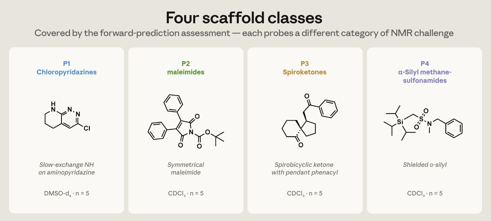
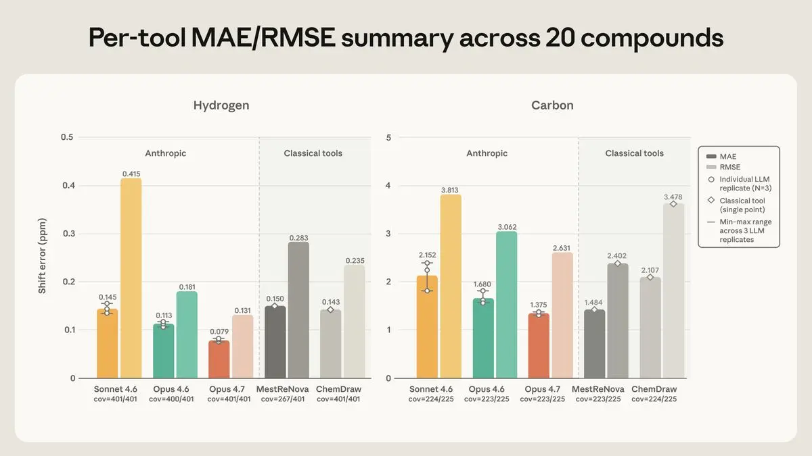
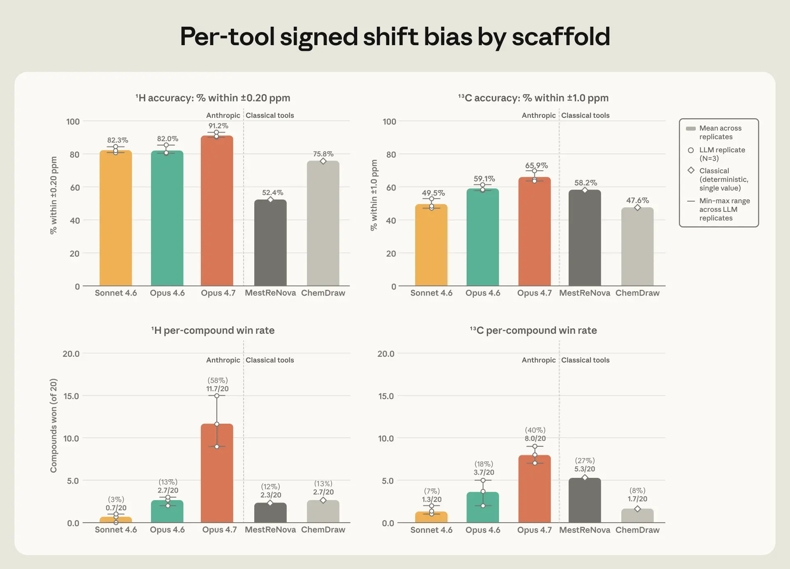
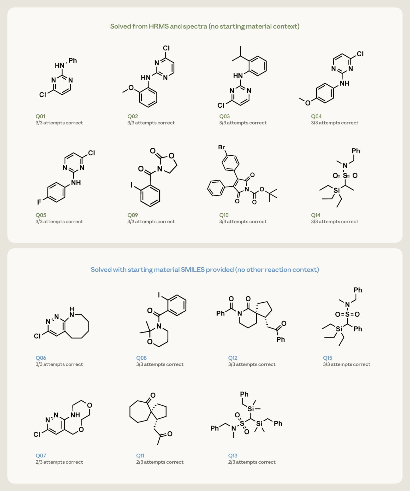

# 把 Claude 训成化学家（中英对照）

> 原文标题：Making Claude a chemist
> 原文链接：https://www.anthropic.com/research/making-claude-a-chemist
> 原文作者：Anthropic（化学家 David Kamber 参与）
> 发布日期：2026-06-05
> **翻译模型：** GLM-5.3-Flash
> **评分：** ★★★☆☆（3/5，值得一看）—— NMR 对决 ChemDraw：Opus 4.7 氢谱误差 ±0.079 ppm、可从谱图反推结构，通用模型首次在化学分析上比肩专用软件
> 排版：每段英文原文在前，中文翻译紧随其后。默认收录正文主体；脚注以 Obsidian 脚注形式保留于文末。

---

We're working with world-class synthetic, computational, and analytical chemists to make Claude better at chemistry. In this post, we share our first work as part of this effort, in which Anthropic chemist, David Kamber, examines how Claude performs on a chemist's most common analytical input, an NMR spectrum. When working with molecules, chemists move between hand-drawn structures on a whiteboard, instrument readouts, database query strings, and the technical notations of patents and publications. Each of these representations encodes the same underlying chemistry, but each demands a different kind of fluency. A sketch of caffeine, for example, allows a chemist to spot its resemblance to adenosine, the body's drowsiness signal, and predict that it keeps us alert by blocking the receptor. However, that same sketch cannot help a chemist tell it apart from other near-identical looking molecules.

我们正在与世界一流的合成、计算与分析化学家合作，让 Claude 更擅长化学。本文分享这项工作的首个成果：Anthropic 化学家 David Kamber 考察 Claude 在化学家最常见的分析输入——NMR 谱图——上的表现。与分子打交道时，化学家在白板上的手绘结构、仪器读出、数据库查询串、专利与出版物的技术记法之间来回切换。这些表示编码的是同一种化学，却各自要求不同的熟练。例如一张咖啡因的草图，能让化学家看出它与腺苷——身体的困倦信号——的相似，并预测它靠阻断受体让人保持清醒。但同一张草图帮不了化学家把它与其他长相几乎一样的分子区分开。

Understanding what molecule a chemist is working with is critical. Chemistry undergirds everything from the foods and medicine we ingest to our lotions, paints, and plastics. Reroute a handful of bonds among the same atoms, and glucose becomes fructose, molecules sharing a formula but processed through entirely different metabolic pathways. Flip a molecule into its mirror image, and a sedative becomes a teratogen, as happened in the thalidomide disaster.[^1] Chemists' everyday work depends on reading these signals correctly across whichever representation befits a given task.

弄清化学家正在与什么分子打交道至关重要。化学支撑着一切：从我们吃下的食物与药物，到我们的护肤品、油漆与塑料。同样这批原子，把几根键改道，葡萄糖就变成果糖——分子式相同、代谢路径却截然不同。把一个分子翻成它的镜像，镇静剂就变成致畸剂——沙利度胺灾难正是如此。[^1]化学家的日常工作，取决于在"适应特定任务的任何表示"之间正确读取这些信号。

Translating between these representations (chasing down a structure from a figure, reconciling an instrument readout against a proposed product, querying a database in the right notation) is time consuming and impossible to keep up with at scale—CAS, the largest chemistry registry, catalogs over 290 million disclosed substances and grows by roughly 15,000 new ones every day.

在这些表示之间互译（从图中追出一个结构、用仪器读出核对拟定产物、用正确的记法查数据库）耗时费力，且不可能大规模跟上——最大的化学登记库 CAS 已收录超过 2.9 亿个已公开物质，每天新增约 1.5 万个。

AI is well-positioned to take on this research burden, yet it still remains largely aspirational in the context of chemistry. Machine-learning tools have been positioned for years as transformative for retrosynthesis—the process of working backward from a target molecule to simpler precursors to plan how to build it—reaction prediction, and property estimation, but the data those tools need have been hard to come by—sparse on null-results, inconsistent in format, and locked behind paywalls at subscription journals (and in unstructured supporting information). Retrosynthesis is a case in point—capable AI tools have existed for years, but adoption is uneven, and the average academic or small-lab chemist still doesn't use them.

AI 很适合承担这一研究负担，但在化学语境中它大体上仍停留在愿景。机器学习工具多年来被宣传为逆合成（retrosynthesis——从目标分子倒推到更简单的前体、规划如何合成它）反应预测与性质估算的革命，但那些工具需要的数据一直难得：零结果稀少、格式不一、锁在订阅期刊的付费墙后（以及非结构化的支持信息里）。逆合成就是一例——能干的 AI 工具存在多年，采用却不均衡，普通的学院或小实验室化学家至今不用它们。

Even so, advancements in AI are finally reaching chemistry. Today's frontier models are multimodal, and capable of explicit reasoning. They can read a chemical structure directly from a journal figure or hand sketch rather than depending on a pre-curated molecular database. And they can read the experimental detail of a methods section or supporting information in the form it is actually published. They can also show their reasoning step by step, which means a chemist can audit the outputs. None of this eliminates the data problem the field has been describing for years, but it changes which problems are tractable despite it. Ultimately, our claim is a modest one: Claude is starting to meaningfully assist chemists with the daily translation, recall, and integration work that complements their judgment, and we plan to keep extending its helpfulness. Today we are publishing the first white paper in the effort to accelerate this work. It tackles a chemist's most common analytical input: an NMR spectrum.

即便如此，AI 的进步终于抵达化学。今天的前沿模型是多模态的、能显式推理。它们可以直接从期刊图或手绘草图读取化学结构，而不依赖预先整理好的分子数据库；能按方法节与支持信息实际发表的形式读取实验细节；还能逐步展示推理，使化学家可以审计输出。这些都没有消除行业描述多年的数据问题，但改变了"尽管有数据问题、哪些问题变得可解"。归根结底，我们的主张是克制的：Claude 正开始切实协助化学家完成日常的翻译、回忆与整合工作——那些与其判断互补的工作——我们计划继续扩展它的有用性。今天我们发布加速这项工作的第一份白皮书，处理化学家最常见的分析输入：NMR 谱图。

## Claude 对 ChemDraw：NMR 预测与结构解析（Claude vs. ChemDraw on NMR prediction and structure elucidation）

Full version can be found here

完整版见原文链接。

Nearly every small molecule—drug, pesticide, dye, fragrance, polymer, DNA or protein subunit, and functional inorganic or solid-state material—exists because a chemist determined its structure. Given that these molecules cannot be seen with microscopes, chemists must rely on spectral analysis, probing a molecule with light, radio waves, or magnetic fields. The way a given molecule absorbs, emits, or deflects this energy gives chemists a pattern, or spectrum, with which they can elucidate its structure. NMR spectroscopy—one of the canonical techniques chemists rely on for this—is one of the most time-consuming steps in synthetic chemistry; for every compound, a chemist has to match each peak in the spectrum to an atom in the proposed structure by hand. For this white paper, we tested how Claude fared against the dedicated NMR software chemists rely on today. We measured three Claude models (Opus 4.7, Opus 4.6, Sonnet 4.6) against ChemDraw and MestReNova on 20 compounds drawn from synthetic chemistry preprints published after the models' training cutoff so as to avoid selection bias. Both ChemDraw and MestReNova do forward prediction, using a drawn structure to simulate what NMR spectrum will be produced. In addition to forward prediction, we also wanted to see whether Claude could go the other direction—starting from an experimental spectrum and proposing the structure behind it. This is the harder task, and the one existing software currently leaves to the chemist. To set up our assessment, we pulled 20 compounds from ChemRxiv preprints[^2] posted after the models' training cutoff, taking the first fully characterized novel molecules from each paper. The 20 span four structural families, five compounds each, with each family selected because it involves a different category of NMR challenge. Each tool was given the structure encoded as a SMILES string—the line-of-text notation chemists use to input a molecule to software—and was asked to predict where every hydrogen and carbon peak would fall along a 1D NMR spectrum (a horizontal axis measuring chemical shifts in ppm, parts per million). Given that NMR samples are dissolved in a liquid, and that the choice of solvent (chloroform, DMSO, etc.) moves the peak positions slightly, each tool was told to predict the spectrum in whatever solvent the chemists had used in the published paper.

几乎每一个小分子——药物、农药、染料、香料、聚合物、DNA 或蛋白质亚基、功能性无机或固态材料——的存在，都因为有一位化学家测定了它的结构。既然这些分子无法用显微镜看到，化学家必须依赖谱学分析：用光、无线电波或磁场探测分子。给定分子吸收、发射或偏转这些能量的方式，给化学家一个模式（谱），据此解析其结构。NMR 波谱——化学家赖于此的经典技术之一——是合成化学中最耗时的步骤之一：对每个化合物，化学家都要手工把谱图中的每个峰与拟定结构中的原子一一对应。本白皮书测试了 Claude 与化学家今天依赖的专用 NMR 软件相比表现如何。我们把三个 Claude 模型（Opus 4.7、Opus 4.6、Sonnet 4.6）与 ChemDraw、MestReNova 在 20 个化合物上做了比较——化合物取自模型训练截止之后发表的合成化学预印本，以避免选择偏差。ChemDraw 与 MestReNova 做正向预测：用画好的结构模拟将产生怎样的 NMR 谱。除正向预测外，我们还想看 Claude 能否反向而行——从实验谱出发、提出其背后的结构。这是更难的任务，也是现有软件目前留给化学家的任务。为搭建评估，我们从模型训练截止之后发布的 ChemRxiv 预印本[^2]中抽取 20 个化合物：取每篇论文中首个被完整表征的新分子。这 20 个横跨四个结构家族、每族五个，每个家族都因其涉及不同类别的 NMR 挑战而入选。每个工具都拿到以 SMILES 串编码的结构——化学家把分子输入软件所用的行文本记法——并被要求预测每个氢峰与碳峰落在一维 NMR 谱（横轴以 ppm，即百万分之一，度量化学位移）的何处。鉴于 NMR 样品溶解在液体中、溶剂的选择（氯仿、DMSO 等）会轻微移动峰位，每个工具都被要求按发表论文中化学家实际使用的溶剂预测谱图。

> A graph of the four scaffold classes.

由于语言模型的输出随运行而变，每个 Claude 模型对每个化合物查询三次后取平均；ChemDraw 与 MestReNova 每次返回相同答案、只跑一次。随后我们把每个预测峰与其实验对应峰配对、以 ppm 度量差距。这些差距落在化学家会称为"正确"的窗口内——氢 ±0.20 ppm、碳 ±1.0 ppm。

> Per-tool MAE/RMSE summary across 20 compounds.

在氢上，Opus 4.7 最准：平均误差 ±0.079 ppm——不到容差窗口的一半——且峰落入窗口内的比例最高。在碳上，Opus 4.7 与 MestReNova 实际打平（±1.37 与 ±1.48 ppm）；其余工具在两个元素上保持相同排序。Opus 4.6 不出所料地居中，Sonnet 4.6 最弱。两者差距在一个出了名难搞的氢上最明显：氯哒嗪家族的一个 NH 质子，其真实位置落在 6.8–7.9 ppm 的窄带里。Opus 4.7 的估计略偏低但稳定一致；Opus 4.6 的猜测散布在好几个 ppm 之间；Sonnet 4.6 则放到 10–13 区间——远在真实位置之外。

> Within-tolerance accuracy per compound.

虽然 Opus 4.7 与 ChemDraw、MestReNova 表现相当，差距在预测"氢的 NMR 峰的形状与峰间距"上更大——这些特征同样携带化学家与峰位一起读取的结构信息。Opus 4.7 比任何其他工具更常匹配实验报告的裂分模式；三个 Claude 模型预测子峰间距到半赫兹以内的比例约 80%——ChemDraw 与 MestReNova 只有 26%–35%。Opus 4.7 在三次重复运行间也最稳定：其平均误差的运行间波动小于它与次优工具之间的差距。接下来我们评估逆向预测（结构解析）：能否从谱图确定分子的结构？我们给 Opus 4.7 出了 15 道解析题，请它每题三次、至多提出三个排序的候选结构。每题给出该化合物的精确分子式（来自高分辨质谱）及其氢谱与碳谱。十五题按难度两分：八个较简单的目标——单环或两片段分子——只给分子式与谱图；七个更密的目标——稠环、螺环等——附一条额外提示：投入反应的起始原料结构。

> Chart showing the structure elucidation results.

Opus 4.7 仅凭谱图与分子式，在每次尝试中都复原了全部八个较简单的结构。七个更难的目标在给出起始原料提示后：四个在全部三次运行中返回正确结构，其余三个在三次中命中两次。最终我们发现：对于例行数据预测，未经化学专门微调的通用模型 Opus 4.7 已平均达到 ChemDraw 与 MestReNova 的水平甚至更强。此外，Claude 还能反向解题：仅凭 NMR 数据提出结构。专用结构解析软件已存在数十年，但它通常需要 2D NMR（双轴谱，输出是等高线图而非一排峰）、专门训练与持证工具。Claude 只用化学家会粘进聊天窗口的高分辨质谱与一维峰列表就能做到，无需任何设置。

### 局限（Limitations）

This assessment shows us that a general-purpose model can be competitive with NMR software and even make 1D inverse elucidation tractable. But there are a handful of noteworthy limitations.

这一评估告诉我们：通用模型可以与 NMR 软件一较高下，甚至让一维逆向解析变得可行。但也有几点值得注意的局限。

- First, the evaluation was small—20 compounds across four scaffolds for the forward task, 15 for the inverse task—and each scaffold contributes a single class of failure modes. The model performance should thus be read as indicative rather than precise.
- 第一，评估规模小——正向任务四个骨架 20 个化合物、逆向任务 15 个——每个骨架只贡献一类失效模式。因此模型表现应被读作指示性而非精确。

- Second, on the densest inverse targets, without the starting material as an additional input, the model could loop through its reasoning without committing to a final structure; this is why the seven harder problems were posed with the starting-material structure rather than spectra alone.
- 第二，在最稠密的逆向目标上，若没有起始原料作额外输入，模型可能在推理中打转而不落到最终结构；这正是七个更难的题附带起始原料结构、而非只给谱图的原因。

- Third, some chemical scaffolds were left untested. For example, slow-exchange NH heteroaromatics (aromatic rings whose N–H exchanges with solvent slowly enough to leave a sharp NMR peak) are sampled only through chloropyridazines, leaving out related systems (hydroxypyridines, aminothiazoles, and other DMSO-d₆ NH-active scaffolds).
- 第三，一些化学骨架未测。例如慢交换 NH 杂芳烃（N–H 与溶剂交换足够慢、能留下尖锐 NMR 峰的芳香环）只通过氯哒嗪类取样，漏掉了相关体系（羟基吡啶、氨基噻唑及其他 DMSO-d₆ NH 活性骨架）。

- Fourth, 2D experiments (COSY, HSQC, HMBC) and stereochemistry are out of scope by design, since 1D NMR alone cannot fix configuration. As a result, complex natural product compounds were not evaluated.
- 第四，2D 实验（COSY、HSQC、HMBC）与立体化学按设计不在范围内，因为仅凭一维 NMR 无法确定构型。因此未评估复杂的天然产物化合物。

- And finally, our solvent coverage was limited to DMSO-d₆, CDCl₃, and D₂O, so methanol-d₄, benzene-d₆, and acetone-d₆ are not assessed.
- 最后，溶剂覆盖仅限 DMSO-d₆、CDCl₃ 与 D₂O，甲醇-d₄、苯-d₆ 与丙酮-d₆ 未评估。

Ideally, we would see how these numbers hold up across several hundred compounds spanning 20–30 scaffold classes, with at least 15 compounds per class so that within-class variance can be separated from between-tool differences. We would also evaluate NH-active heteroaromatics beyond chloropyridazines, assess the untested solvents, and conduct versions of both tasks that draw on 2D experiments.

理想情况下，我们想看这些数字在横跨 20–30 个骨架类的几百个化合物上是否站得住，每类至少 15 个化合物，以便把类内方差与工具间差异分开。我们还会评估氯哒嗪之外的 NH 活性杂芳烃、检验未测的溶剂，并开展依赖 2D 实验的两个任务版本。

### 展望（Looking ahead）

As we continue to improve Claude's performance in chemistry, we are focusing specifically on a handful of bottlenecks that slow chemists down the most.

随着我们继续改进 Claude 在化学上的表现，我们特别聚焦于几个最拖慢化学家的瓶颈。

- Reading and rendering chemical structures—converting a drawing from a figure, patent, slide, or sketch into a machine-readable form, and going between structural representations and the systematic names used in chemistry literature.
- 化学结构的读取与绘制——把图、专利、幻灯片或草图中的画转成机器可读形式，并在结构表示与化学文献使用的系统命名之间往返。

- Reaction and synthetic reasoning—proposing, evaluating, and critiquing synthetic routes, anticipating outcomes, and thinking through selectivity, conditions, and likely byproducts.
- 反应与合成推理——提出、评估与批评合成路线，预判结果，思考选择性、条件与可能的副产物。

- Mechanism—explaining and testing reaction mechanisms in the language a chemist actually uses, with electron arrows, intermediates, and transition-state arguments.
- 机理——用化学家实际使用的语言（电子箭头、中间体、过渡态论证）解释并检验反应机理。

- Chemical literature understanding—reading chemistry as it appears in published work, where the same molecule may be drawn, named, abbreviated, or referenced by a code, and pulling out the chemistry that matters from method sections, supporting information, and patents.
- 化学文献理解——按已发表作品中化学的实际样子阅读：同一分子可能被画出来、被命名、被缩写、或以代号引用——并从方法节、支持信息与专利中抽出要紧的化学。

These are not all on the same maturity curve. Where spectral analysis is far enough along to benchmark, others, like retrosynthesis planning, are still being scoped. As we get a better understanding of these bottlenecks, we will share where current models excel, and where they still fall short. Our ultimate goal is to ensure that working chemists know where Claude can save them time and where they still need to rely on their own expertise.

这些瓶颈并不在同一条成熟度曲线上。谱学分析已前进到可以立基准的程度，其他如逆合成规划仍在划定范围。随着对这些瓶颈的理解加深，我们将分享当前模型在何处出色、何处仍显不足。我们的终极目标是让一线化学家知道：哪里 Claude 能帮他们省时间，哪里他们仍需依靠自己的专长。

## 与我们合作（Working with us）

We are expanding the AI for Science program to more explicitly support chemistry research. If you are a researcher working on a problem where Claude could plausibly help, especially one that involves the kinds of multimodal reasoning we have described, we would like to hear from you at scienceblog@anthropic.com, or through the AI for Science application.

我们正在扩展 AI for Science 计划，以更明确地支持化学研究。如果你是研究者、正在解决 Claude 有望帮忙的问题——尤其涉及我们所述的多模态推理——欢迎通过 scienceblog@anthropic.com 或 AI for Science 申请入口与我们联系。

## 脚注（Footnotes）

[^1]: An incident in which a morning sickness medication was linked to severe birth defects in over 10,000 children worldwide. / 一起事件：一种孕吐药物在全球范围内与超过 1 万名儿童的严重先天缺陷相关联。
[^2]: The four preprints from which we pulled the compounds: https://chemrxiv.org/doi/full/10.26434/chemrxiv.15002274/v1, https://chemrxiv.org/doi/full/10.26434/chemrxiv-2025-59lfh, https://chemrxiv.org/doi/full/10.26434/chemrxiv.15002423/v1, https://chemrxiv.org/doi/full/10.26434/chemrxiv.15002316/v1. / 抽取化合物的四篇预印本：https://chemrxiv.org/doi/full/10.26434/chemrxiv.15002274/v1、https://chemrxiv.org/doi/full/10.26434/chemrxiv-2025-59lfh、https://chemrxiv.org/doi/full/10.26434/chemrxiv.15002423/v1、https://chemrxiv.org/doi/full/10.26434/chemrxiv.15002316/v1。
