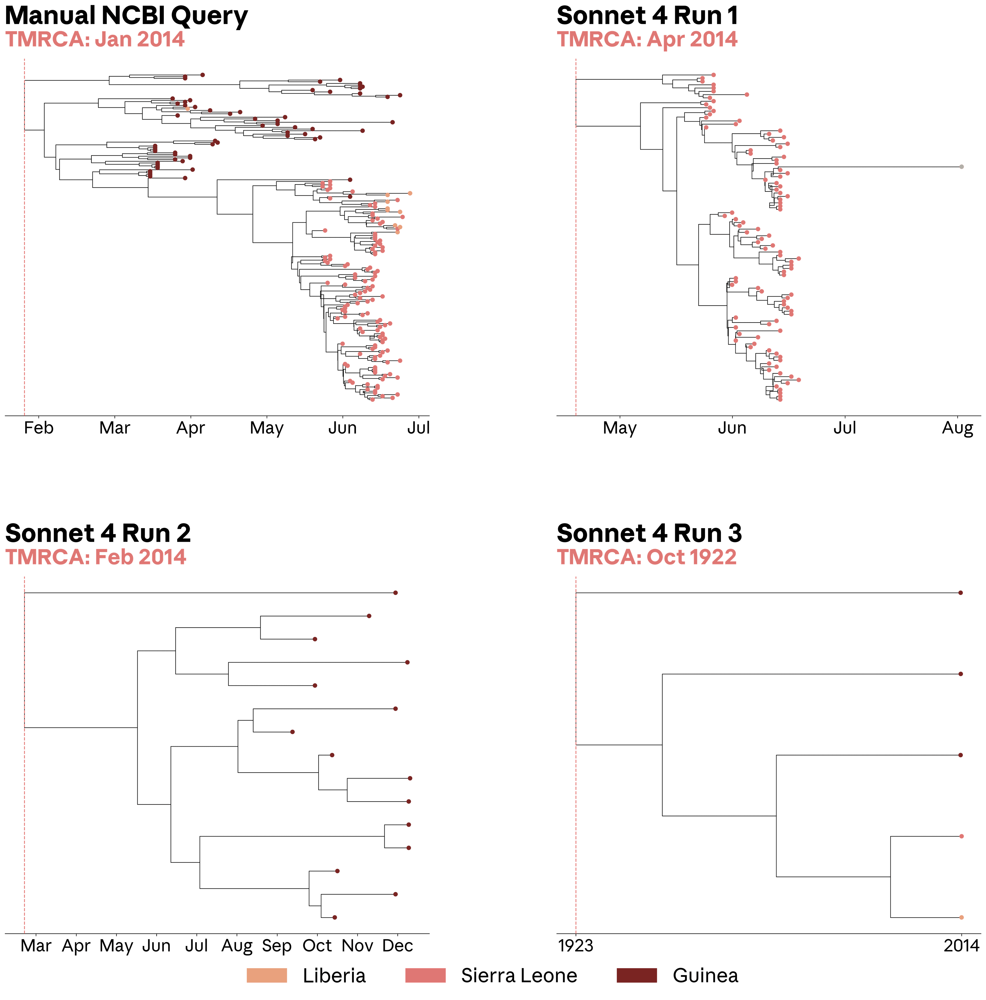
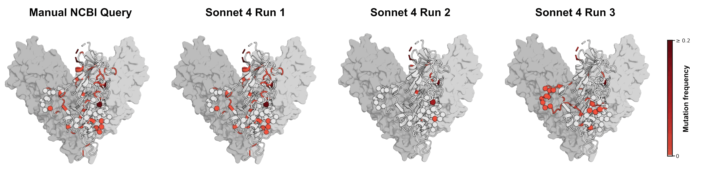
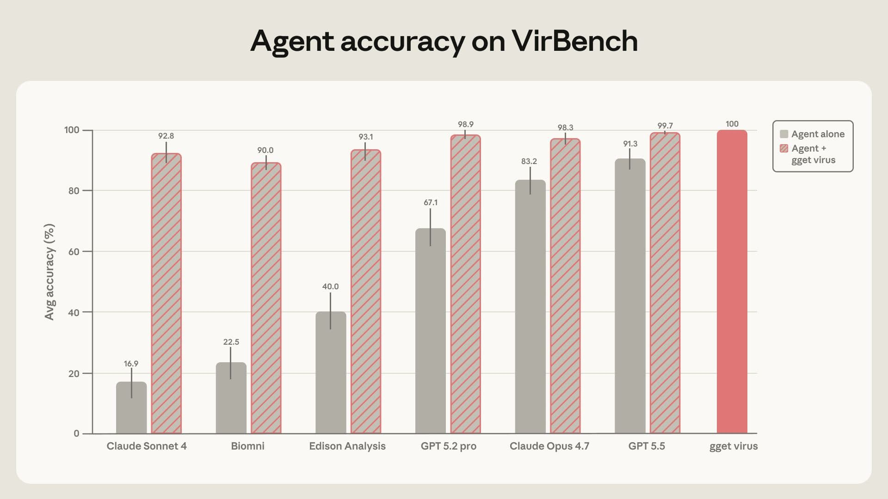

# 为生物学的 AI 智能体铺路（中英对照）

> 原文标题：Paving the way for AI agents in biology
> 原文链接：https://www.anthropic.com/research/agents-in-biology
> 原文作者：Laura Luebbert（Anthropic；合作者 Ferdous Nasri、Sarah Gurev 等）
> 发布日期：2026-06-08
> **翻译模型：** GLM-5.3-Flash
> **评分：** ★★★☆☆（3/5，值得一看）—— VirBench 实测四大科研 agent 查 NCBI Virus：准确率 16.9–91.3%，加一层确定性工具 gget virus 后升至 99.7%，生物数据库需为 agent 设计
> 排版：每段英文原文在前，中文翻译紧随其后。默认收录正文主体；脚注以 Obsidian 脚注形式保留于文末。

---

Written by Laura Luebbert. Based on research by Ferdous Nasri, Sarah Gurev, Patrick Varilly, Krithik Ramesh, Nuala A. O'Leary, Jonah Cool, Bernhard Y. Renard, Pardis Sabeti, and Laura Luebbert. In this post, Laura Luebbert argues that we need to make biological data infrastructure more agent-friendly. As a case study, she and her team tasked scientific research agents (Claude, Biomni Open Source (Biomni OSS)[^1], Edison Analysis,[^2] GPT) to retrieve the sequence data from NCBI Virus, a database virologists use for tasks such as surveillance and diagnostic assay development. Even the strongest models did not consistently achieve the level of accuracy required for reliable dataset construction. But accuracy rose to nearly 100% once she and her team added gget virus, a deterministic retrieval layer. The broader lesson for scientific agents is that deterministic retrieval tools are (currently) crucial to making agent workflows more reliable, and biological databases will need to be designed with agents in mind as scaled users.

本文由 Laura Luebbert 撰写，基于 Ferdous Nasri、Sarah Gurev、Patrick Varilly、Krithik Ramesh、Nuala A. O'Leary、Jonah Cool、Bernhard Y. Renard、Pardis Sabeti 与 Laura Luebbert 的研究。文中 Laura Luebbert 主张：我们需要让生物数据基础设施对 agent 更友好。作为案例研究，她与团队指派科研 agent（Claude、Biomni Open Source（Biomni OSS）[^1]、Edison Analysis、[^2]GPT）从 NCBI Virus——病毒学家用于监测与诊断 assay 开发等任务的数据库——检索序列数据。即便最强的模型，也无法稳定达到"可靠构建数据集"所需的准确度。但她与团队加入确定性检索层 gget virus 之后，准确率升到接近 100%。对科研 agent 更广泛的教训是：确定性检索工具（当前）对提升 agent 工作流的可靠性至关重要；生物数据库需要把 agent 当作规模化用户来设计。

Using AI agents to navigate biological data infrastructure is like driving through an old city that was designed before cars: the infrastructure may be beautiful and even thoughtful, but it's full of narrow, winding streets that are difficult for modern vehicles to navigate (idiosyncratic file formats, scattered databases, and one-off retrieval scripts).[^3] You can retrofit the city with traffic signs, parking lots, and the occasional widened road, but the basic layout remains hard to navigate because it was designed for a different mode of conveyance. Software infrastructure, by contrast, was basically made for the needs of cars (agents): paved roads, clear lanes, standardized signals, and systems designed for fast travel from start to finish (version control, well-documented APIs, and package managers).

用 AI agent 穿行生物数据基础设施，就像开车穿行一座为汽车诞生之前设计的古城：基础设施可能美丽甚至体贴，但满是现代车辆难以通行的窄巷与弯道（特立独行的文件格式、散落的数据库、一次性的检索脚本）。[^3]你可以给城市加装交通标志、停车场、偶尔拓宽一条路，但基本格局依旧难行——因为它为另一种通行方式而设计。相比之下，软件基础设施基本上就是为汽车（agent）的需求造的：铺好的路、清晰的车道、标准化的信号、以及为"从起点到终点的快速通行"设计的系统（版本控制、文档完善的 API、包管理器）。

As a result, coding agents have advanced much more quickly than biological agents. Software commonly provides structured digital workflows and reliable interfaces, whereas the computational biology infrastructure needed for data retrieval and validation is often brittle, heterogeneous, and process-dependent. The tools with which we navigate them are necessarily bespoke and tuned to defined domains or hypotheses. Moreover, software provides testable outputs that can be quickly compiled and validated (e.g., resolving a GitHub issue by generating a patch that passes the project's tests), whereas biology offers few simple and verifiable yet meaningful rewards.

结果，编程 agent 的进步远快于生物学 agent。软件通常提供结构化的数字工作流与可靠接口，而数据检索与验证所需的计算生物学基础设施常常脆弱、异质、依赖流程。我们穿行其间的工具必然是定制的、为特定领域或假说调校的。此外，软件提供可测试的输出——能快速编译与验证（例如生成一个通过项目测试的补丁解决 GitHub issue）——而生物学很少提供"简单、可验证又有意义"的奖励。

Thus, the bottleneck for biological agents is not only reasoning but the absence of widespread deterministic execution layers for querying biological data. A scientist can express their intent (e.g., find all human kinases with this domain and pull their structures), but agents often lack a dependable way to access the databases containing the information they need.

因此，生物学 agent 的瓶颈不只是推理，还在于普遍缺乏查询生物数据的确定性执行层。科学家可以表达意图（如"找出所有带这个结构域的人激酶并拉取其结构"），但 agent 常常缺少访问相关数据库的可靠途径。

In biological and scientific workflows, even small errors can have severe consequences. Retrieving coordinates from the wrong genome build, for example, can invalidate the downstream biological interpretation. So can mixing RefSeq and GenBank records without intending to, treating partial genomes as complete genomes, confusing segment names in segmented viruses, or missing relevant records because of inconsistent metadata fields. The beauty and challenge of research is that the details are often of critical importance.

在生物与科学工作流中，小错也能酿成大祸。比如从错误的基因组版本取坐标，可能让下游的生物学解释作废。无意间混用 RefSeq 与 GenBank 记录、把部分基因组当作完整基因组、搞混分段病毒的片段名、或因元数据字段不一致漏掉相关记录——都是如此。研究的美妙与挑战恰在于：细节往往性命攸关。

Like driving through an Italian hill town, it does not matter how powerful the car is if the streets are too narrow, the turns too sharp, and the route depends on local knowledge. If we want agents to help with scientific discovery, from outbreak response to drug design to biological modeling, we need to build biological data infrastructure that they can navigate as reliably as humans do.

就像开车穿过一座意大利山城：如果街道太窄、转弯太急、路线依赖本地知识，车再好也没用。如果我们想让 agent 帮助科学发现——从疫情响应到药物设计再到生物学建模——就需要建设它们能像人类一样可靠通行的生物数据基础设施。

### Karpathy 关于 Web 开发的演讲，对"用 AI agent 做生物学"的启示（What Karpathy's lecture about web development tells us about doing biology with AI agents）

This mismatch between agent needs and human-built tools is not unique to biology. The same friction emerges wherever agents are inserted into environments designed solely for human use.

agent 需求与人造工具之间的错配并非生物学独有。凡把 agent 塞进"只为人类使用而设计"的环境，同样的摩擦就会出现。

A few months ago, Andrej Karpathy gave a talk about software in the era of AI and ended up griping about something that sounded all too familiar. He had vibe-coded a small web app, but when he tried to make it real (authentication, payments, deployment), he lost a week clicking around in browser dashboards.

几个月前，Andrej Karpathy 做了一场关于 AI 时代软件的演讲，结果忍不住抱怨起一件听着太熟悉的事：他 vibe-code 了一个小 web 应用，但当他想把它变成真的（认证、支付、部署）时，在浏览器仪表板里点点点耗掉了一周。

As he summarized, "The code was the easiest part! Most of the work was in the browser, clicking things." Documentation kept telling him to "go to this URL, click on this dropdown." His conclusion was that nobody should have to do this. Instead, we must build for agents.

他总结道："代码是最简单的部分！大部分工作在浏览器里点东西。"文档不断让他"go to this URL, click on this dropdown（去这个网址，点这个下拉框）"。他的结论是：不该有人被迫这么干。相反，我们必须为 agent 而构建。

Karpathy had experienced something new within the world of software agents that biology researchers have been struggling with for a long time: the pain of trying to make intelligent systems operate in environments built around heterogeneous information, implicit conventions, and humans clicking through browsers.

Karpathy 在软件 agent 世界里初次体验到的，是生物学研究者挣扎已久的东西：让智能系统在"围绕异构信息、隐含惯例与浏览器点击而建"的环境中运作的痛苦。

## 案例研究：病毒学的点击税（A case study: The click tax in virology）

Long before AI agents, computational biologists and geneticists had already begun to produce tools for traditional computational biology, which chipped away at this problem. Packages like Biopython, BioPerl, BioJulia, Entrez Direct, BioMart, gget, and many other workflow libraries are all efforts to move biological data out of browser interfaces and into places where researchers can compute on it directly.

早在 AI agent 之前，计算生物学家与遗传学家就已开始为传统计算生物学制造工具、一点点凿这个问题。Biopython、BioPerl、BioJulia、Entrez Direct、BioMart、gget 等包与众多工作流库，都是"把生物数据搬出浏览器界面、搬进研究者可以直接计算之处"的努力。

The problem is that biological data does not live in a single database with a single interface. It is a messy network of roads, each with its own identifiers, conventions, formats, filtering logic, and degree of programmatic access. Some data are straightforward to access programmatically. Others, not so much.

问题是生物数据不住在"单一数据库、单一接口"里。它是一张杂乱的路网：各有各的标识符、惯例、格式、过滤逻辑与可编程访问程度。有些数据程序化访问很直接；有些则不然。

Virology, in particular, is one of the harder cases. Research workflows from vaccine and diagnostic assay design to building training data for protein models often begin by retrieving sequences from NCBI Virus, a collection of viral sequence records from GenBank, RefSeq, and the international INSDC ecosystem, including Pathoplexus, behind a searchable web interface. As researchers building tools for viral outbreak surveillance, we know firsthand how much expert knowledge is hidden behind these retrievals. In virology labs, dataset curation instructions for NCBI Virus are often passed around as long lists of complex filters that users must manually reproduce in the web interface: exactly the kind of browser-clicking workflow Karpathy was complaining about.

病毒学尤其是较难的案例。从疫苗与诊断 assay 设计到为蛋白质模型构建训练数据，研究工作流常常始于从 NCBI Virus 检索序列——它汇集 GenBank、RefSeq与国际 INSDC 生态（含 Pathoplexus）的病毒序列记录，藏在可搜索的网页界面之后。作为为病毒疫情监测构建工具的研究者，我们切身体会这些检索背后藏着多少专家知识。在病毒学实验室里，NCBI Virus 的数据集整理说明常以"一长串复杂过滤条件"的形式流传，用户必须在网页界面里手工复现：正是 Karpathy 抱怨的那种浏览器点击工作流。

The current outbreak of Ebola disease caused by Bundibugyo virus in the Democratic Republic of Congo is a stark example of why streamlined viral data access can have real-world, life-or-death consequences. On May 14, 2026, INRB Kinshasa in the DRC analyzed 13 blood samples and confirmed Bundibugyo virus disease in eight the next day,[^4] after which an Ebola outbreak was declared. By May 29, the WHO had reported more than 1,000 confirmed and suspected cases in the DRC, including more than 200 deaths. Researchers also generated the first near-complete outbreak genomes, helping establish that the outbreak was caused by a new spillover event.

当前刚果（金）由邦迪布焦病毒引起的埃博拉疫情，是"顺畅的病毒数据访问为何事关生死"的鲜明例证。2026 年 5 月 14 日，刚果（金）金沙萨 INRB 分析 13 份血样，次日确认其中 8 例邦迪布焦病毒病，[^4]随后宣布埃博拉疫情。到 5 月 29 日，WHO 已报告刚果（金）逾 1,000 例确诊与疑似病例、逾 200 人死亡。研究者还产出了首批近乎完整的疫情基因组，帮助确认这次疫情源自一次新的溢出事件。

These genomes present public health officials with three urgent questions. First, how different is this outbreak virus from Ebola viruses seen before? Second, can existing diagnostics still detect it? And, third, will existing therapeutics still protect against it? Answering these questions requires comparing the new genomes against historical Ebola genomes available through NCBI Virus and Pathoplexus (which synchronizes into NCBI Virus). But rather than this being easily automatable, the first steps in this analysis involve manually clicking through a web interface, reproducing complex filters by hand, and hoping the resulting dataset is complete and correct.

这些基因组摆给公共卫生官员三个紧迫问题。第一，这次疫情的病毒与以往见过的埃博拉病毒有何不同？第二，现有诊断还能检出它吗？第三，现有疗法还能防住它吗？回答这些问题需要把新基因组与 NCBI Virus 及 Pathoplexus（同步进 NCBI Virus）可得的历史埃博拉基因组比较。但这并不容易自动化：分析的第一步就是手工点击网页界面、手工复现复杂过滤、然后祈祷得到的数据集完整且正确。

The reason this workflow is so hard to automate is that much of NCBI Virus's filtering logic lives only in this web interface. This is annoying for humans and terrible for agents. If a researcher wants every SARS-CoV-2 sequence released in 2025 that contains the surface glycoprotein, that may take a seasoned virologist a few clicks in the browser. But programmatically, it can require a multi-hundred-line script gluing together multiple APIs (REST, Datasets, E-utilities), retrieving results page by page, reconciling identifiers, and downloading hundreds of gigabytes of data, only to throw most of it away after local filtering.

这个工作流难以自动化的原因在于：NCBI Virus 的许多过滤逻辑只活在网页界面里。对人这很烦，对 agent 则很糟。如果研究者想要"2025 年发布的、含表面糖蛋白的每一条 SARS-CoV-2 序列"，资深病毒学家在浏览器里点几下即可；而程序化地做，可能需要一个几百行的脚本，把多个 API（REST、Datasets、E-utilities）粘在一起、逐页取回结果、调和标识符、下载数百 GB 数据——然后在本地过滤后把大部分扔掉。

Even if a resource has an API, it can still be difficult for agents to use reliably for a variety of reasons, for example if the API does not expose the same filtering semantics as the web interface, if metadata fields are poorly documented or inconsistently standardized, if identifiers change across sources, or if "the right answer" depends on conventions that expert humans know but machines have to infer.

即便资源有 API，agent 也可能因种种原因难以可靠使用：API 暴露的过滤语义与网页界面不同、元数据字段文档欠缺或标准化不一、标识符跨来源变动、"正确答案"取决于专家心里知道而机器只能推断的惯例。

### agent 硬上会怎样（What happens when agents try anyway）

To better understand the challenge of bridging agents to databases, we developed a test for how capable state-of-the-art scientific research agents (Claude, Biomni OSS, Edison Analysis, GPT) are when asked to retrieve viral sequences from NCBI Virus using the infrastructure available today. Our benchmark, VirBench, includes 120 realistic viral sequence queries spanning 40 pathogens with manually verified ground-truth counts. The queries reflect tasks that appear in viral surveillance, diagnostic assay design, and protein model training-data construction. For example, one query asked agents to "retrieve viral sequences from NCBI for TaxID 3052462 (Orthoebolavirus zairense (ZEBOV)) that adhere to the following criteria: host organism: human, geographic location of sample collection: Africa, collected on or after 01/01/2014, collected on or before 06/20/2014, minimum sequence length: 15,200 bases, maximum 1,900 ambiguous characters (N's), exclude lab-passaged samples."

为更好理解"把 agent 接到数据库"的挑战，我们开发了一个测试：当最先进的科研 agent（Claude、Biomni OSS、Edison Analysis、GPT）被要求用现有基础设施从 NCBI Virus 检索病毒序列时，它们有多大能耐。我们的基准 VirBench 含 120 个真实的病毒序列查询、覆盖 40 种病原体、带人工核验的 ground truth 计数。这些查询反映病毒监测、诊断 assay 设计与蛋白质模型训练数据构建中的任务。例如一道查询要求 agent"从 NCBI 检索 TaxID 3052462（Orthoebolavirus zairense（ZEBOV））的病毒序列，满足：宿主为人、采样地在非洲、采集于 2014-01-01 至 2014-06-20 之间、最短序列长 15,200 碱基、模糊字符（N）至多 1,900、排除实验室传代样本"。

When agents were left to solve these queries on their own, performance varied widely across systems and improved substantially in newer frontier models. However, even the strongest models did not consistently achieve the level of accuracy and reproducibility required for reliable dataset construction. Claude Sonnet 4, Claude Opus 4.7, Biomni OSS, Edison Analysis, GPT-5.2-pro, and GPT-5.5[^5] achieved mean accuracies ranging from 16.9% to 91.3%. For these data retrieval tasks, the bar is effectively 100%: in some cases, a missing or incorrect record could determine whether a diagnostic assay seems to cover circulating diversity, or whether an outbreak is inferred to have started weeks earlier or later than it did. In addition, the same model often produced substantially different answers when asked the same question three times, undermining both the accuracy and reproducibility required for reliable scientific workflows. For the example Ebolavirus query above, Sonnet 4[^6] returned 106 sequences in one run (expected: 266), 15 in a second run, and 5 in a third, despite receiving an identical prompt each time.

放手让 agent 自己解决这些查询时，各系统表现差异巨大、更新些的前沿模型显著更好。然而即便最强的模型，也无法稳定达到"可靠构建数据集"所需的准确度与可复现性。Claude Sonnet 4、Claude Opus 4.7、Biomni OSS、Edison Analysis、GPT-5.2-pro 与 GPT-5.5[^5]的平均准确率介于 16.9% 到 91.3%。对这些数据检索任务，及格线实际上是 100%：某些情况下，一条缺失或错误的记录，就可能决定"诊断 assay 看起来是否覆盖流行中的多样性"、或"疫情的起点被推断为早几周还是晚几周"。此外，同一模型被三次问同一问题时，答案常常大相径庭——可靠科学工作流所需的准确性与可复现性双双受损。对上面的埃博拉查询，Sonnet 4[^6]一次返回 106 条序列（预期 266）、第二次 15 条、第三次 5 条——每次提示完全相同。

Inconsistencies like this have consequences for downstream analyses. We used the query shown above to retrieve Ebolavirus sequences and build a phylogenetic tree, a standard analysis for reconstructing how viral samples are related during an outbreak. One important quantity we can get from phylogenetic trees is the estimated time to the most recent common ancestor (TMRCA). This is the inferred root date of an outbreak, which can alter conclusions about when and where a virus originated, as well as how long a virus was circulating. In this case, a tree built from a manually curated NCBI Virus sequence set recovered a January 2014 TMRCA, consistent with previous reports (95% highest posterior density spans 27 January to 14 March) for the 2014 Ebolavirus outbreak. By contrast, two of the three sequence sets retrieved by Sonnet 4 were visibly incomplete, including one tree that pushed the inferred TMRCA back to 1922. The remaining dataset (run 1) looked superficially plausible, but failed to retrieve sequences from Guinea and shifted the estimated TMRCA to April 2014, changing the inferred timing of the outbreak.

这样的不一致会波及下游分析。我们用上述查询检索埃博拉序列并构建系统发生树——疫情中重建样本间关系的标准分析。从系统发生树能得到的一个重要量是"到最近共同祖先的时间"（TMRCA）估计值：即疫情的推断根日期，会改变关于病毒何时何地起源、流行多久的结论。本例中，用人工整理的 NCBI Virus 序列集建的树给出 2014 年 1 月的 TMRCA，与此前关于 2014 年埃博拉疫情的报道一致（95% 最高后验密度区间为 1 月 27 日至 3 月 14 日）。相比之下，Sonnet 4 检索的三组序列中有两组明显不完整——其中一棵树把推断的 TMRCA 推回到 1922 年。剩下那组（run 1）表面看似合理，却漏掉了几内亚的序列、把估计的 TMRCA 挪到 2014 年 4 月——改变了疫情的推断时间。

> Phylogenetic trees of Zaire ebolavirus built from different retrieved sequence sets.

The variability between NCBI Virus retrieval attempts can also affect conclusions about therapeutics. We retrieved Ebolavirus glycoprotein sequences to examine the epitopes bound by maftivimab and MBP134, antibody therapeutics developed against Zaire ebolavirus and WHO priority treatment candidates in the ongoing Ebolavirus outbreak. We asked whether mutations have previously arisen in the regions these antibodies target across related Zaire ebolavirus sequences. This kind of analysis can give researchers a sense of whether a treatment will continue to protect patients as the virus evolves. If the underlying sequences are incomplete or incorrectly fetched, it can throw off their conclusion. In our example, sequences retrieved by Sonnet 4 came close to the results obtained through a manual NCBI query on its first attempt. On a repeat run, it missed most of the mutated residues. And, on the third run, it highlighted a different set of residues, producing three different impressions of the variability in these target regions.[^7]

NCBI Virus 检索尝试之间的变异也会影响关于疗法的结论。我们检索埃博拉糖蛋白序列，考察 maftivimab 与 MBP134——针对扎伊尔埃博拉病毒开发的抗体疗法、也是当前疫情中的 WHO 优先治疗候选——所结合的表位。我们问：在相关扎伊尔埃博拉病毒序列中，这些抗体靶向的区域此前是否出现过突变。这类分析能让研究者对"随着病毒演化、疗法是否继续保护患者"心中有数。如果底层序列不完整或取错，结论就会跑偏。在我们的例子里，Sonnet 4 第一次检索的结果接近人工 NCBI 查询；重复运行漏掉了大多数突变残基；第三次又高亮了另一组残基——对靶点区域变异性的三种不同印象。[^7]

> Existing Zaire ebolavirus mutations across retrieved sequence sets.

这两个例子展示了科学中一个更广的模式：看似微不足道的检索选择，可能改变生物学结论。本例中，病毒序列检索的不一致与失效模式的性质表明，多数变异可归因于基础设施缺陷。agent 在未能取回大结果集时少计，在过滤器用错时多计。例如与预期计数偏差最大的，恰是记录量巨大的病毒——甲型流感、HIV-1、SARS-CoV-2——检索半途而废或下游过滤出错都会严重扭曲最终数据集。它们还在"含义取决于语境、惯例或信息存放位置"的元数据字段上挣扎。查询越复杂性能越差，尤其超过三四个并发过滤之后。

归根结底，agent 往往对任务理解得足够好、足以尝试，却缺少机器可执行的"执行、验证、复现"的途径。得到的答案可能看似合理却仍是错的——这格外危险，因为序列检索通常是一段长得多的生物学工作流的第一步。

### 病毒数据检索的确定性层（A deterministic layer for viral data retrieval）

For a more thorough explanation of VirBench and gget virus, read the preprint.

VirBench 与 gget virus 的更完整说明见预印本（链接见原文）。

To turn viral data retrieval into something that agents and humans could call directly, we developed gget virus in collaboration with researchers at NCBI. At first, this seemed like it might be a simple matter of connecting to the right API calls. In practice, it was much harder: NCBI Virus is a portal over multiple underlying resources, including internationally synchronized sequence databases maintained across the United States, Europe, and Japan, so answering a seemingly simple query often requires piecing together information from several places.

为了让病毒数据检索变成 agent 与人类都能直接调用的东西，我们与 NCBI 的研究者合作开发了 gget virus。起初这看似只是"接对几个 API 调用"的事；实际上难得多：NCBI Virus 是横跨多个底层资源的门户，包括由美国、欧洲、日本各自维护的国际同步序列数据库——回答一个看似简单的查询，往往需要从几处拼凑信息。

To reproduce the behavior of the NCBI Virus web interface, gget virus has to coordinate across the different systems underneath it, including the REST, Datasets, and E-utilities APIs. gget virus decides which filters can be applied through these existing APIs and which have to be checked locally because the web interface exposes filtering behavior that is not available from a single programmatic endpoint. It handles batching so that large result sets, such as for SARS-CoV-2 and Influenza A datasets, are retrieved comprehensively rather than arbitrarily cut off. When filtering depends on additional information stored in a separate database, such as GenBank records that indicate whether a sequence contains a particular viral protein, gget virus retrieves those records, uses them to apply the filters, and preserves the relevant GenBank information in the final output. It then returns standardized outputs that are readable by both people and machines, with detailed logs that show how the final result was produced.[^8]

为复现 NCBI Virus 网页界面的行为，gget virus 必须在其底层各系统间协调，包括 REST、Datasets 与 E-utilities API。它决定哪些过滤可经这些既有 API 应用、哪些必须在本地核对——因为网页界面暴露的过滤行为无法从单一编程端点获得。它处理分批，使大结果集（如 SARS-CoV-2 与甲型流感数据集）被完整检索而非被任意截断。当过滤依赖存于另一个数据库的附加信息——如指示某序列是否含特定病毒蛋白的 GenBank 记录——gget virus 会取回这些记录、用它们应用过滤、并在最终输出中保留相关 GenBank 信息。它随后返回人与机器都可读的标准化输出，并附详细日志展示最终结果是如何产生的。[^8]

> AI agent performance on VirBench with and without gget virus.

When we gave the agents access to gget virus, accuracy rose above 90% for all agents, peaking at 99.7% for GPT-5.5. Run-to-run variability was largely eliminated, and the performance gap between models narrowed dramatically. In other words, adding a deterministic retrieval layer made model choice much less important. This is especially consequential given that reliable dataset construction should not depend on access to the newest or most expensive model, or on knowing which model works best for a given database. Instead, cheaper models paired with the right tool reduce variability and enable wider access.

当我们让 agent 使用 gget virus 后，所有 agent 的准确率都升到 90% 以上，GPT-5.5 峰值 99.7%。运行间的变异基本消除，模型间的表现差距急剧收窄。换言之，加一个确定性检索层让"选哪个模型"变得不那么重要。这影响深远：可靠的数据集构建不应取决于能否用上最新最贵的模型、或知道哪个模型最适合某个数据库。相反，更便宜的模型配对正确的工具，就能降低变异、扩大访问。

gget virus makes existing agents more reliable for viral data retrieval by translating a complex, browser-based retrieval workflow into an accurate and reproducible interface. Returning to our walkable city analogy, it's like we added a highway tunnel underneath the pedestrian infrastructure, complete with on- and off-ramps, smooth-moving interchanges, and exit numbers tied to known mile markers.

gget virus 把一个复杂的、基于浏览器的检索工作流翻译成准确、可复现的接口，让既有 agent 在病毒数据检索上更可靠。回到那座步行之城的比喻：这就像我们在步行基础设施下面修了一条高速隧道——带上下匝道、平顺的立交、以及与已知里程碑挂钩的出口编号。

### 正如 Karpathy 所说：让（基因组数据）对 agent 可及（As Karpathy said: "make [genomic data] accessible to agents"）

We want models to be creative when they generate hypotheses, design experiments, or reason about mechanisms. But the layer underneath that creativity—gene identifiers, schemas, retrieval logic, coordinate systems, metadata conventions, and data access paths—has to be boringly reliable (or in other words, deterministic). gget virus is one example within a broader set of efforts to build these context engines: reliable, agent-accessible infrastructure for biological data. Other efforts are emerging from AI-for-science systems, many of which rely on model harnesses that connect agents to biological data sources, including ToolUniverse, Edison Scientific's Robin, Biomni, and related biomedical agents. The challenge is figuring out where that determinism belongs and how to build it.

我们希望模型在生成假说、设计实验、推理机制时有创造力。但创造力之下的那一层——基因标识符、模式（schema）、检索逻辑、坐标系、元数据惯例、数据访问路径——必须"无聊地可靠"（换句话说，确定性）。gget virus 是构建这类"上下文引擎"（context engines）——可靠、agent 可及的生物数据基础设施——这一更广努力中的一例。其他努力正从 AI for Science 系统中涌现，许多依赖把 agent 连到生物数据源的模型 harness：ToolUniverse、Edison Scientific 的 Robin、Biomni 及相关生物医学 agent。挑战在于弄清确定性应属于哪里、以及如何构建它。

Work on connectors and harnesses becomes more fraught when we consider how quickly model capabilities are changing. If we draw the model curve forward from the results above, it's easy to imagine a (very near) future in which the benefit of tools like gget virus approaches zero: agents become good enough to navigate messy portals, reconcile identifiers, paginate correctly, and recover from failures on their own. In that world, harnesses may not be needed. Still, even if an agent can do it, that doesn't mean the task should be handled (and reinvented) by an agent every time. A model that can fight its way through a confusing bioinformatics workflow may still be too expensive, too slow, too hard to audit, or too difficult to trust for routine scientific work. And if agents do eventually make today's harnesses obsolete, the lesson for biological databases holds: we need to keep agents in mind as we think about our users, and we need to build for scale.

考虑到模型能力变化之快，连接器与 harness 的工作变得更加微妙。如果把上述结果的模型曲线向前外推，很容易想象一个（非常近的）未来：gget virus 这类工具的收益趋近于零——agent 已经足够擅长驾驭混乱的门户、调和标识符、正确分页、从失败中恢复。在那个世界里，harness 或许不再需要。话虽如此，即便 agent 能做，也不意味着这项任务每次都该由 agent 处理（并重新发明）。一个能在令人眼花的生物信息学工作流中杀出一条路的模型，对例行的科学工作而言，可能仍然太贵、太慢、太难审计、或太难信任。而即便 agent 终究让今天的 harness 过时，对生物数据库的教训依然成立：考虑用户时要把 agent 放在心里，并且要为规模而构建。

#### 致谢（Acknowledgements）

We thank Xander Balwit, Ethan Dyer, Stuart Ritchie, Rebecca Hiscott, Alyssa Morrow, Keir Bradwell, Eric Kauderer-Abrams, Jonah Cool, Andrej Karpathy, Patrick Varilly, Cesar Arze, Blake Lash, Philine Guckelberger, Nisha Gopal, Elliot Hershberg, Pardis Sabeti, and Jonathan Feldman for their thoughtful feedback, careful edits, and helpful conversations that improved this essay.

感谢 Xander Balwit、Ethan Dyer、Stuart Ritchie、Rebecca Hiscott、Alyssa Morrow、Keir Bradwell、Eric Kauderer-Abrams、Jonah Cool、Andrej Karpathy、Patrick Varilly、Cesar Arze、Blake Lash、Philine Guckelberger、Nisha Gopal、Elliot Hershberg、Pardis Sabeti 与 Jonathan Feldman 深思熟虑的反馈、细致的编辑与有助益的讨论，使本文更完善。

We are especially grateful to Sarah Gurev and Gage Moreno for their help in developing and performing the example virology analyses, and to Ferdous Nasri and Krithik Ramesh, who made substantial contributions to the ideas, framing, and writing of this essay.

特别感谢 Sarah Gurev 与 Gage Moreno 在开发并执行示例病毒学分析中的帮助；感谢 Ferdous Nasri 与 Krithik Ramesh 对本文的思想、框架与写作做出的实质贡献。

## 脚注（Footnotes）

[^1]: Biomni Open Source (Biomni OSS) refers to the open-source version of Biomni (https://github.com/snap-stanford/Biomni, v0.0.8) with Claude Sonnet 4 as the underlying LLM. It does not reflect the performance of the Biomni Lab product by Phylo. / Biomni Open Source（Biomni OSS）指 Biomni 的开源版（https://github.com/snap-stanford/Biomni，v0.0.8），底层 LLM 为 Claude Sonnet 4。它不反映 Phylo 的 Biomni Lab 产品的性能。
[^2]: Evaluated on February 26, 2026. Due to the nature of the task, Edison Analysis used older fallback models, such as Claude Sonnet 4, that could complete the benchmark without triggering biosecurity-related access restrictions. As a result, the Edison Analysis results should not be interpreted as directly comparable to the results obtained with Opus 4.7. / 评估于 2026 年 2 月 26 日进行。鉴于任务性质，Edison Analysis 使用了较旧的回退模型（如 Claude Sonnet 4），以便在不触发生物安全相关访问限制的情况下完成基准。因此 Edison Analysis 的结果不应被解读为与 Opus 4.7 的结果直接可比。
[^3]: For a deeper account of why biological software often feels fragmented, under-maintained, and difficult to use, see Elliot Hershberg's essay "How Software in the Life Sciences Actually Works (And Doesn't Work)." / 关于生物软件为何常显得碎片化、维护不足、难以使用的更深入叙述，见 Elliot Hershberg 的文章 "How Software in the Life Sciences Actually Works (And Doesn't Work)"。
[^4]: We recognize and thank the teams at the Institut National de Recherche Biomédicale (INRB) in the DRC and Central Public Health Laboratory (CPHL) in Uganda for their rapid sequencing, analysis, and open sharing of initial Bundibugyo virus genomes during the May 2026 outbreak. / 我们铭记并感谢刚果（金）国家生物医学研究院（INRB）与乌干达中央公共卫生实验室（CPHL）团队在 2026 年 5 月疫情期间对首批邦迪布焦病毒基因组的快速测序、分析与开放共享。
[^5]: In one of 360 runs (Query 32, third repeat), GPT-5.5 independently identified and used gget virus, despite not being explicitly prompted to do so. This was the only run for this question that produced the correct answer. / 在 360 次运行中的一次（查询 32，第三次重复），GPT-5.5 在未被明确提示的情况下自行发现并使用了 gget virus。这是该问题上唯一产出正确答案的运行。
[^6]: Claude Sonnet 4 represents the latest publicly available Anthropic model that can be used for this evaluation, due to subsequent biosafety-related access restrictions on newer models. / 由于此后对更新模型的生物安全相关访问限制，Claude Sonnet 4 是可用于本评估的最新公开发布 Anthropic 模型。
[^7]: All analyses performed here are provided for illustration purposes only and are not intended to provide medical or public-health guidance; for Ebola disease treatment recommendations, please refer to official WHO guidance. / 本文所有分析仅作示例之用，不构成医疗或公共卫生指导；埃博拉治疗建议请参考 WHO 官方指南。
[^8]: To echo a point Nils Homer recently made about AI-ready bioinformatics tools: "AI assistants need to work with your code, your outputs, and your analysis logic." This allows agents to inspect not only what was retrieved, but how it was retrieved, turning a plausible-looking answer into something that can be checked and reproduced. / 呼应 Nils Homer 近期关于 AI 就绪生物信息学工具的观点："AI 助手需要与你的代码、你的输出、你的分析逻辑协同工作。"这使 agent 不仅能检视取回了什么，还能检视如何取回——把看似合理的答案变成可核查、可复现的东西。
