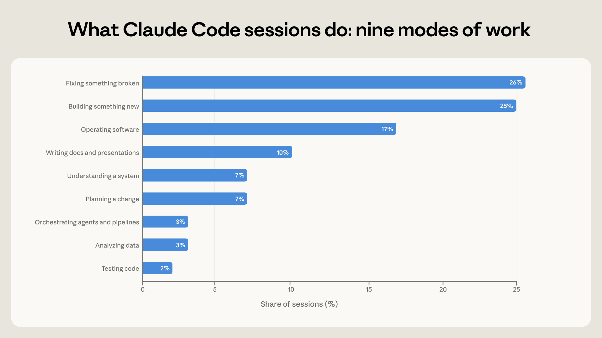
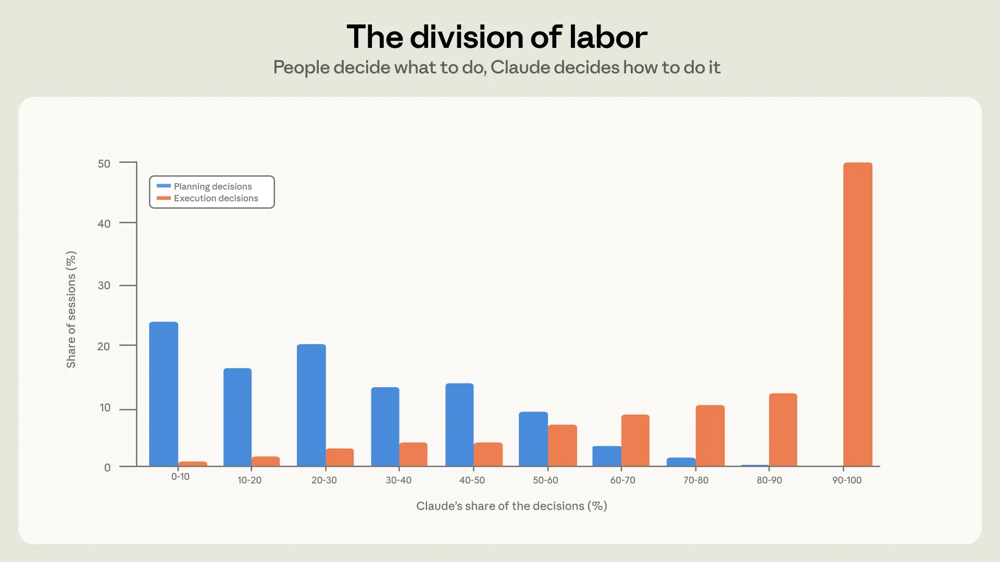
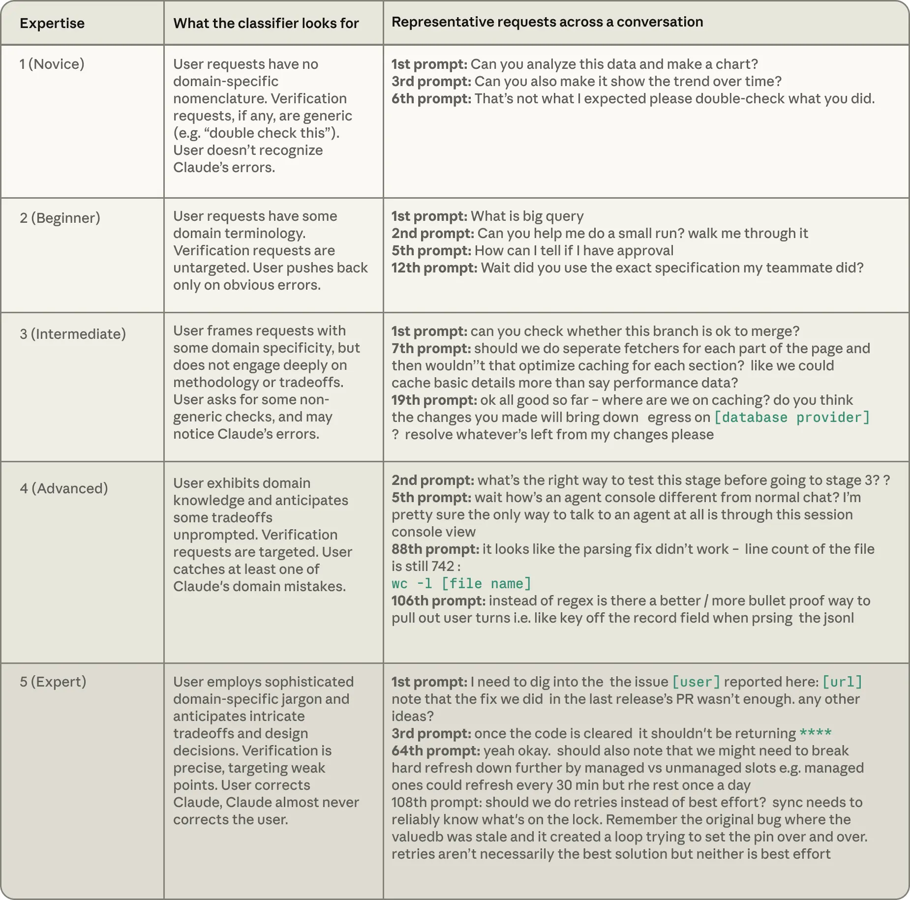
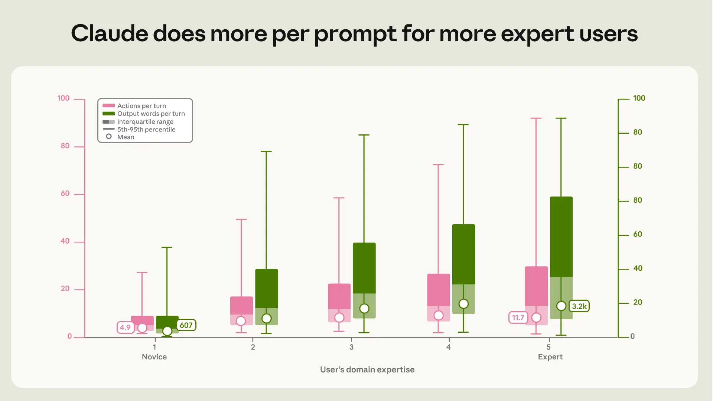
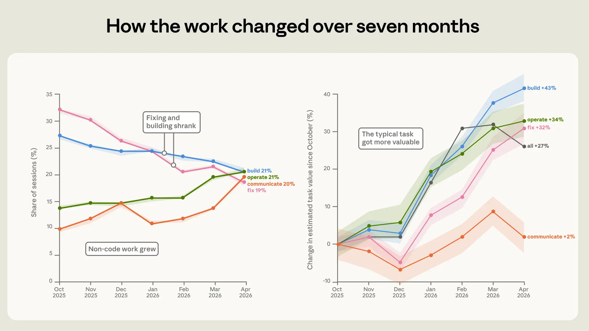
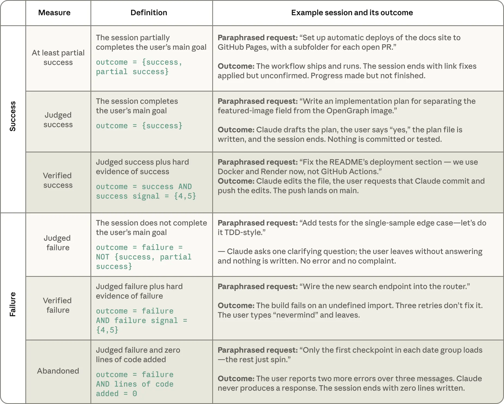
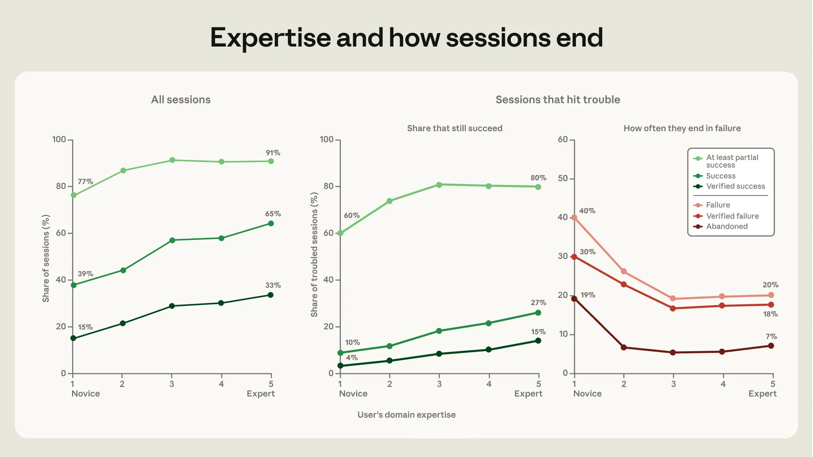
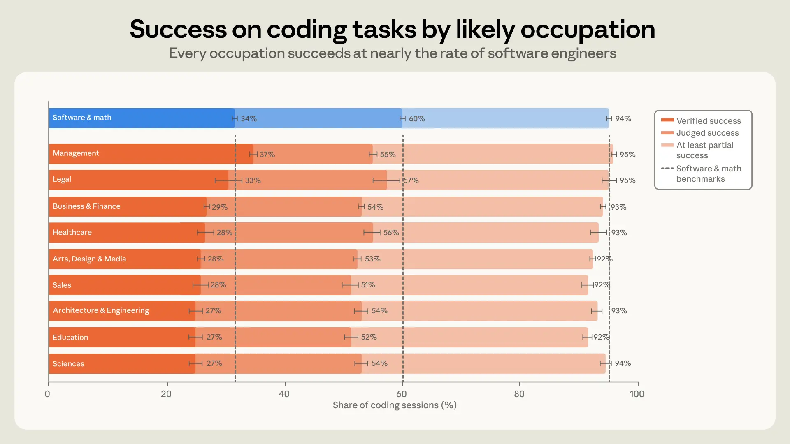

# Claude Code 在实践中如何被使用（中英对照）

> 原文标题：How Claude Code is used in practice
> 原文链接：https://www.anthropic.com/research/claude-code-expertise
> 原文作者：Zoe Hitzig、Maxim Massenkoff、Eva Lyubich、Shaoyi Zhang、Ryan Heller、Peter McCrory（Anthropic）
> 发布日期：2026-06-16
> **翻译模型：** GLM-5.3-Flash
> **评分：** ★★★★★（5/5，里程碑/必读）—— 40 万会话实测 agentic coding 的分工与回报：人定"做什么"、Claude 定"怎么做"，专家回报持续存在，任务价值 7 个月涨 25%
> 排版：每段英文原文在前，中文翻译紧随其后。默认收录正文主体；脚注以 Obsidian 脚注形式保留于文末。

---

## 关键发现（Key findings）

- Building on prior work, we introduce a framework for studying interactive agentic coding based on a privacy-preserving analysis of ~400,000 Claude Code sessions from between October 2025 and April 2026. We evaluate the composition of tasks, human-AI collaboration, and success rates.
- 在先前工作的基础上，我们引入一个研究交互式 agentic 编程的框架：对 2025 年 10 月至 2026 年 4 月的约 40 万条 Claude Code 会话做隐私保护分析，评估任务构成、人机协作与成功率。

- In a typical session, people make most of the planning decisions (what to do) and Claude makes most of the execution decisions (how to do it). The greater domain expertise a person brings to a session, the more work Claude does per instruction. On coding tasks, every major occupation succeeds––accomplishes what the person set out to do, with verifiable evidence like passing tests or committed work––at nearly the same rate as software engineers, on average.
- 在典型会话中，人做大多数规划决策（做什么），Claude 做大多数执行决策（怎么做）。人带给会话的领域专长越多，Claude 在每条指令下做的工作越多。在编程任务上，各主要职业的平均成功率与软件工程师几乎相同——完成当事人想做的事，且有可验证证据（如测试通过、工作已提交）。

- The more domain expertise a person has, the more often the session ends in success—though the gap between intermediate and expert users is modest. Over the seven months we observe, the share of sessions spent debugging fell by nearly half, and usage shifted toward more end-to-end agentic use: deploying and running code, analyzing data, and writing non-code documents.
- 一个人的领域专长越多，会话越常以成功告终——不过中级与专家用户之间的差距不大。在我们观察的七个月里，花在调试上的会话份额近乎减半，使用转向更多端到端的 agentic 用法：部署与运行代码、分析数据、撰写非代码文档。

- Over those seven months, the value of the typical task, which we estimate through a comparison to freelance job postings, rose in almost every kind of work—about 25% on average.
- 这七个月里，典型任务的价值（我们经由与自由职业招聘帖的比较来估计）在几乎每种工作中都在上升——平均约 25%。

## 引言（Introduction）

Agentic coding has taken off. The share of GitHub projects with coding agent activity has more than doubled since late 2025,[^1] and Claude Code users now spend an average of 20 hours per week using the tool.[^2] Can people without formal coding experience successfully direct an agent through complex technical work? And what will rapid adoption and improvement of these tools mean for knowledge work broadly? While we don't have full answers to these questions yet, we look to Claude Code usage data for early signals.

agentic coding 已经起飞。有编程 agent 活动的 GitHub 项目份额自 2025 年底以来翻了一倍多，[^1]Claude Code 用户现在平均每周使用该工具 20 小时。[^2]没有正规编程经验的人，能否成功地指挥 agent 完成复杂的技术工作？这些工具的快速采用与改进，对广义的知识工作意味着什么？我们尚无完整答案，但可以从 Claude Code 使用数据中寻找早期信号。

This report provides evidence on how Claude Code is used in practice, based on a privacy-preserving analysis of ~400,000 interactive sessions from ~235,000 people between October 2025 and April 2026. It builds on prior work focused on measures of autonomy in Claude Code sessions, and how Claude Code is changing work at Anthropic.[^3] Here, we introduce a framework for describing interactive AI coding-assistant usage: what kind of work is being done, who is doing it, and whether it succeeds. We focus on Claude Code usage through a command-line interface (CLI), Claude.ai, or the Claude Code desktop app.[^4] By tracking how agentic coding usage changes as models get more capable, we can better understand how these tools affect the labor market for coding professionals and knowledge workers.

本报告基于对 2025 年 10 月至 2026 年 4 月约 23.5 万人的约 40 万次交互会话的隐私保护分析，提供 Claude Code 在实践中如何被使用的证据。它建立在先前关于 Claude Code 会话自主性度量、以及 Claude Code 如何改变 Anthropic 内部工作的研究之上。[^3]这里我们引入一个描述交互式 AI 编程助手使用的框架：在做什么工作、谁在做、是否成功。我们聚焦经命令行界面（CLI）、Claude.ai 或 Claude Code 桌面应用的 Claude Code 使用。[^4]追踪 agentic 编程使用如何随模型能力增强而变化，能让我们更好理解这些工具对编程专业人员与知识工作者劳动力市场的影响。

What happens on Claude Code may be a preview of where knowledge work is headed, as agents become embedded in non-coding work. We find that Claude is handling more complex and more valuable tasks. At the same time, there remains a clear division of labor in agentic coding: People decide what to build, and the agent decides how to build it.

随着 agent 嵌入非编码工作，Claude Code 上发生的事，可能是知识工作走向的预演。我们发现 Claude 正在处理更复杂、更有价值的任务。与此同时，agentic 编程中仍存在清晰的分工：人决定造什么，agent 决定怎么造。

We also see evidence that domain expertise, and not coding proficiency, amplifies effective use of the tool. In particular, domain experts succeed more often, and more easily recover from errors and misunderstandings. However, the gap between experts and intermediates is modest—suggesting that proficiency in a domain is enough to use the tool almost as effectively as those with deep mastery.

我们还看到证据：放大该工具有效使用的，是领域专长而非编程熟练度。具体而言，领域专家更常成功、更容易从错误与误解中恢复。但专家与中级用户之间的差距不大——提示"对某领域的熟练"足以让人几乎与深度精通者同样有效地使用该工具。

These findings give us an early read on possible transitions in the labor market. In our data, success is determined by how well a person understands the problem they are trying to solve, not whether they're trained in coding. If these patterns hold across the economy, it suggests that while agentic coding tools may be absorbing some implementation-heavy work, they are also rewarding those with firm understanding of the problems they solve on the job. Coding agents are not substituting for domain expertise—the more understanding a worker brings to an agent, the more quality work the agent is able to do.

这些发现让我们得以初读劳动力市场可能发生的转变。在我们的数据中，成功取决于一个人对其试图解决的问题理解多深，而不是是否受过编程训练。如果这些模式在全经济范围成立，那就提示：agentic 编程工具可能在吸收一部分偏实现的工作，同时也在奖励那些对工作中所解决问题有扎实理解的人。编程 agent 不是在替代领域专长——工作者带给 agent 的理解越多，agent 能做出的高质量工作越多。

## 分工（The division of labor）

### 人们用 Claude Code 做什么（What people use Claude Code for）

To understand what people are using Claude Code for, we classify each session into one of nine work modes—the single activity that best describes what the session is trying to accomplish.[^5] Four modes involve writing or maintaining code directly: building something new, fixing something broken, testing code, and orchestrating other agents or automated pipelines. Another category is operating software—deploying, configuring, running pipelines, monitoring systems. Two categories are more about working out what to do: understanding how an existing system works, and planning a change before making it. And two take actions unrelated to code, or where code is incidental to the final product: analyzing data, and communicating via presentations and other prose-based documents.

为了解人们用 Claude Code 做什么，我们把每个会话归入九种工作模式之一——最能描述该会话试图完成之事的单一活动。[^5]四种模式直接写或维护代码：构建新东西、修复坏掉的东西、测试代码、编排其他 agent 或自动化管线。另一类是操作软件——部署、配置、跑管线、监控。两类更关乎"想清楚做什么"：理解既有系统如何运作、在动手前规划变更。还有两类采取与代码无关的行动、或代码只是最终产品的附带品：分析数据、以及经由演示文稿与其他散文式文档进行沟通。

About 56% of sessions consist of writing (25%), fixing (26%), or testing and orchestrating code (5%). Operating software comprises 17%, while 14% of sessions are planning or exploring, and 13% produce analysis or prose (Figure 1).

约 56% 的会话由编写（25%）、修复（26%）或测试与编排代码（5%）构成。操作软件占 17%；14% 的会话是规划或探索；13% 产出分析或散文（图 1）。



> Figure 1: Distribution of Claude Code sessions across nine work modes.

我们对每个会话的分类方式是：让模型阅读其转录；再用我们的隐私保护分析工具，把分类与每个会话自动记录的遥测数据（如是否增删了代码行）核对。两个来源高度一致——例如被分类器标为"创建或修改代码"的会话中，超过 90% 在遥测中显示代码变化。细节见附录。

### 谁决定什么（Who decides what）

How autonomous is Claude Code? Capability evaluations suggest the ceiling is high and rising: on benchmarks such as METR's time-horizon evaluations, frontier models can now complete software tasks that would take a person hours, autonomously working through obstacles along the way. But what does usage actually look like in practice? Here, we look at how much steering is done by the person and by Claude in real sessions.

Claude Code 有多自主？能力评估显示上限很高且在上升：在 METR 时间视界评估这类基准上，前沿模型现在能自主完成"人类要花数小时"的软件任务、途中自行排除障碍。但实践中的使用究竟什么样？这里我们考察真实会话中人与 Claude 各做了多少引导。

We investigate this question from two angles. First, we focus on the extent to which people are entrusting decisions to Claude, and second we look at how many actions they give to Claude. To understand the division of decision-making in a session, we build a privacy-preserving decision attribution classifier based on the content of a session. We ask a classifier to list all the meaningful decisions in a session. We separate these decisions into planning (what to do, which approach to take, what counts as done) and execution (which files to change, what code to write, what language to write in, which commands to run). The classifier then attributes each decision to Claude or to the user, giving every session two numbers: the user's share of planning decisions and the user's share of execution decisions.

我们从两个角度研究这个问题。第一，关注人们在多大程度上把决策托付给 Claude；第二，看他们给 Claude 多少动作。为理解会话中的决策分工，我们构建了一个基于会话内容的隐私保护决策归因分类器：让分类器列出会话中所有有意义的决策，再把这些决策分为规划（做什么、选什么路径、什么算完成）与执行（改哪些文件、写什么代码、用什么语言写、跑哪些命令）；分类器随后把每个决策归给 Claude 或用户，给每个会话两个数：用户的规划决策份额与用户的执行决策份额。

On average, people make about 70% of the planning decisions but only 20% of the execution decisions (Figure 2). In practice, there is a clear division of labor in agentic coding––people decide what to build, and the agent decides how to build it.

平均而言，人做约 70% 的规划决策，却只做 20% 的执行决策（图 2）。实践中，agentic 编程存在清晰的分工——人决定造什么，agent 决定怎么造。

To understand the delegation of actions in a session, we look at the session's structure instead of its content. A Claude Code session involves Claude and the user going back and forth trading prompts (from the user) and actions (taken by Claude)––the user writes a prompt and Claude goes off and does some work, and then the user writes another prompt, and so forth. In a typical session, there are about four such turns. In our historical data from October to April, each prompt the user sends sets off a chain of around 10 actions taken by Claude on average––and sometimes over 100.[^6] In each turn, Claude reads files, edits code, runs commands, and writes on average 2,400 words of output.

为理解会话中动作的委托，我们看会话的结构而非内容。Claude Code 会话是 Claude 与用户你来我往地交换提示（用户）与动作（Claude）——用户写一条提示、Claude 去干一阵活，用户再写一条提示，如此往复。典型会话约有四个这样的回合。在我们 10 月至 4 月的历史数据里，用户发出的每条提示平均引发 Claude 约 10 个动作组成的链——有时超过 100 个。[^6]在每个回合中，Claude 读文件、改代码、跑命令，并平均写出 2,400 词的输出。

How much Claude does between check-ins largely tracks who is making the decisions. When the user keeps control of execution (i.e. makes over 80% of execution decisions), Claude takes fewer actions per turn (about eight actions). And when Claude takes control of planning (i.e. makes over 80% of planning decisions), it takes on the highest number of actions (about 16).

Claude 在两次确认之间干多少活，大体跟着"谁在做决策"走。当用户保有执行控制（即做出超过 80% 的执行决策）时，Claude 每轮动作较少（约 8 个）；当 Claude 接管规划（即做出超过 80% 的规划决策）时，它的动作数最高（约 16 个）。



> Figure 2: Attribution of planning versus execution decisions.

### 专长水平（Level of expertise）

From each transcript, Claude rates the user's apparent expertise at the task on a five-point scale from novice to expert. The expertise classifier looks for three signals: how precisely the user frames their directions, what they ask Claude to verify, and whether the user tends to correct Claude or Claude tends to correct the user. Note that expertise is capturing something quite different from job title or general ability, and, crucially, it is task-specific. A senior engineer asking their first Rust question is a beginner at Rust. An accountant who has never used Python, but tells Claude exactly which reconciliation rules a Python script must enforce and catches the edge case it mishandles at month-end close, is an expert at that task.

Claude 从每份转录中按五级量表（新手到专家）为用户在该任务上的显性专长评分。专长分类器寻找三个信号：用户框定指示的精确程度、他们要求 Claude 验证什么、以及是用户纠正 Claude 还是 Claude 纠正用户。注意，专长捕捉的东西与职位头衔或一般能力很不同，关键是它是任务特定的。一位资深工程师问出他的第一个 Rust 问题，他在 Rust 上就是新手。一个从没用过 Python 的会计，如果精确告诉 Claude 某 Python 脚本必须执行哪些对账规则、并抓住它在月末结账时处理不当的边缘情况，他就是该任务的专家。

The table below shows how we defined each expertise level in the classifier along with an example request from a public dataset of coding agent sessions, SWE-chat. The conversation categorized as Novice gives generic instructions with no implied domain-specific knowledge. The Expert conversation conveys deep knowledge of the codebase and technical environment.

下表展示我们在分类器中如何定义各专长级别，附来自公开编程 agent 会话数据集 SWE-chat 的示例请求。被归为"新手"的对话给出泛泛指示、不含任何领域专有知识；被归为"专家"的对话则传达了对代码库与技术环境的深入理解。



> Expertise level definitions with example requests.

We quantify how expertise relates to Claude's output and activity per prompt. In typical novice sessions, each prompt sets off about five Claude actions and roughly 600 words of output, while expert sessions set off action chains more than twice as long (12 actions) carrying five times the output (3,200 words) (Figure 3). This gap between novice and expert sessions appears within every kind of work and every band of task value.

我们量化专长与"每条提示引出的 Claude 输出与活动"的关系。典型新手会话中，每条提示引发约五个 Claude 动作与约 600 词输出；专家会话引发的行动链长两倍多（12 个动作）、输出多五倍（3,200 词）（图 3）。新手与专家会话的这一差距，出现在每一种工作、每一档任务价值之中。

These measures complement the autonomy measures in our prior report on Claude Code, which tracked how long the agent runs and how often people approve its actions automatically. Our decision attribution measure, by contrast, captures who makes the substantive decisions in a session as a whole, while our measures of output and actions per prompt measure how much autonomous activity from Claude each human prompt sets off.

这些度量补充了我们此前 Claude Code 报告中的自主性度量——后者追踪 agent 运行多久、人们多久自动批准其动作。相比之下，我们的决策归因度量捕捉"会话整体中的实质决策由谁做出"，而"每条提示的输出与动作"度量的是"每条人类提示引发多少 Claude 自主活动"。



> Figure 3: Actions and output per prompt by expertise level.

## 谁在用 Claude Code、用什么（Who uses Claude Code, and for what）

### 用户（The users）

To understand who is doing this work, we infer each user's occupation from the session transcript, mapping it to one of 23 major groups in the Bureau of Labor Statistics' Standard Occupational Classification (SOC) taxonomy. The classifier is instructed to rely only on signals such as the project context the agent loads at the start of a session, the names and structure of their files, any artifacts they reference (e.g., legal filings, clinical data, financial reports, a curriculum, etc.) and vocabulary they use.[^7] It is explicitly instructed not to treat the act of coding as evidence of a coding profession. A session is classified into the coding SOC code (Computer and Mathematical Occupations) only when there is clear signal that software or data work is the user's job. A session in which a lawyer builds a script to automatically flag missing clauses across a folder of contracts is mapped into Legal Occupations, even if the session's work is primarily software. The session is left unclassified when there is no signal about the user's occupation.

为理解是谁在做这些工作，我们从会话转录推断每个用户的职业，映射到劳工统计局标准职业分类（SOC）体系的 23 个大类之一。分类器被明确要求只依赖以下信号：agent 在会话开始时加载的项目语境、其文件的名称与结构、其引用的任何工件（法律文书、临床数据、财务报告、课程大纲等）以及其使用的词汇。[^7]它被明确指示不得把"编码行为"本身当作编码职业的证据。一个会话只有在有明确信号表明软件或数据工作是用户的职业时，才归入编码 SOC 类（计算机与数学职业）。律师构建脚本以自动标记一整夹合同中缺失条款的会话，即便其工作主要是软件，也归入法律职业类。没有职业信号的会话则不予分类。

We were able to infer occupation in about 70% of sessions. Within this set, Computer and Mathematical Occupations, a category which encompasses most software-related jobs, is unsurprisingly the largest group. The next largest are Business and Financial Operations; Arts, Design, and Media; Management; and Life, Physical, and Social Sciences. The fastest-growing non-software occupation groups in our sample are management, sales, and legal occupations.

我们在约 70% 的会话中推断出了职业。在这一集合里，计算机与数学职业（涵盖多数软件相关工作的类别）不出意外是最大的一组。其后是商业与金融运营；艺术、设计与媒体；管理；生命、物理与社会科学。样本中增长最快的非软件职业组是管理、销售与法律。

### 工作（The work）

The composition of the work done with Claude Code changed substantially between October 2025 and April 2026. The clearest change is that the share of sessions spent fixing broken code fell from 33% to 19% (Figure 4). In its place, we saw a greater share of the work that surrounds code. Operating software grew from 14% to 21% of sessions. Writing and data analysis roughly doubled, from about 10% to 20% of sessions.

2025 年 10 月至 2026 年 4 月间，用 Claude Code 完成的工作构成发生了实质变化。最明显的是：花在修复坏代码上的会话份额从 33% 降到 19%（图 4）。取而代之的是更多"围绕代码"的工作。操作软件从会话的 14% 升至 21%。写作与数据分析大约翻倍：从约 10% 到 20%。

The tasks themselves also grew more valuable. We approximate each session's economic value by asking what the work would cost on a freelance marketplace, calibrated against a public dataset of real postings. By this measure, the estimated value of the average session rose by 27% between October and April. The rise holds across many kinds of work. Building, operating, and fixing-type tasks all grew more valuable by roughly a third or more (about 43%, 34%, and 32% respectively). These price estimates are coarse, so we use them primarily to compare tasks to one another over time, not as dollar values to be read literally.[^8] For details about the construction of the task estimator, see the Appendix.

任务本身也变得更有价值。我们近似每个会话的经济价值的方式是：这项工作在自由职业市场上要花多少钱——用公开的真实招聘帖数据集校准。按此度量，平均会话的估计价值从 10 月到 4 月上升 27%。上升跨越多种工作：构建、操作、修复类任务的价值分别增长约 43%、34%、32%。这些价格估计是粗的，因此我们主要用它们做任务间的跨时间比较，而非照字面读作美元值。[^8]任务估计器的构建细节见附录。



> Figure 4: Composition of Claude Code work over time.

## 成功取决于用户带来什么（Success depends on what the user brings）

The estimated value of a task is one way to get a sense of how Claude Code is helping people do their work. Another angle is to look at how many sessions are successful, and what characteristics of a session are linked to success. Across all our measures of success, we see a clear pattern: the more expertise a person exhibits in a session, the higher the likelihood of success. Most of the gain is concentrated at the lower end of the expertise scale––the gap between novice sessions and intermediate sessions is bigger than the gap between intermediate and expert.

任务的估计价值是感受"Claude Code 如何帮人工作"的一种角度。另一个角度是看多少会话成功、会话的哪些特征与成功相关。在我们全部的成功度量上，模式都清晰：一个人在会话中展现的专长越多，成功可能性越高。大部分增益集中在专长量表的低端——新手会话与中级会话之间的差距，大于中级与专家之间的差距。

Before turning to the characteristics of successful sessions, we should be precise about how we measure success. We do not observe users' real-world outcomes, and we cannot ask them directly whether they got what they wanted out of Claude. Instead, we rely on two complementary transcript-based measures. The first, judged success, comes from a classifier that reads the full transcript and decides whether the person succeeded in doing what they set out to do (with options: succeeded, partially succeeded, failed, no clear goal). Two companion classifiers then rate the strength of the evidence for that judgment to determine verified success. A success signal classifier looks for verifiable evidence of success. In particular, it looks for git activity like commits and pull requests matching the work, as well as test suites passing, and explicit affirmation from the user. It scores the session from "no signal" to "weak signal" (1) to "multiple hard signals" (5). A parallel failure signal scores the evidence that things went wrong—errors, failed tests, retries, the user pushing back on the output. Verified success requires both that the session is judged successful and there is at least one hard verifiable signal of success. For the following analysis, which is focused on the degree of success or failure in a session, we exclude sessions classified as having "no clear goal," which comprise about 7.7% of our full sample.

在转向成功会话的特征之前，需要精确说明我们如何度量成功。我们观察不到用户的现实结果，也无法直接问他们是否从 Claude 得到了想要的。于是我们依赖两个互补的、基于转录的度量。第一是"判定成功"（judged success）：由一个分类器读完整个转录、判断此人是否做成了想做的事（选项：成功、部分成功、失败、无明确目标）。随后两个伴生分类器为该判断的证据强度评级，以确定"验证成功"（verified success）。成功信号分类器寻找可验证的成功证据：特别是与工作匹配的 git 活动（commit 与 pull request）、通过的测试套件、以及用户的明确肯定。它把会话从"无信号"到"弱信号"（1）再到"多个硬信号"（5）打分。平行的失败信号为"出了问题"的证据打分——报错、测试失败、重试、用户对输出的推回。验证成功要求：会话被判成功、且至少有一个硬的可验证成功信号。在下面聚焦"会话成功或失败程度"的分析中，我们剔除被归为"无明确目标"的会话——约占全样本的 7.7%。

## 专长的回报（The returns to expertise）

So what kinds of sessions are most successful? It turns out that the expertise rating of a session, described above, matters a great deal for the success of a session.

那么哪类会话最成功？结果表明，上述会话的专长评级对会话成败关系重大。

One might worry that expertise isn't the real driver—perhaps experts simply pick different tasks, or differ in other ways. Throughout this section, we partially address this worry by comparing sessions doing the same kind of work, at the same estimated value, in the same month, on the same subject, from people in the same broad occupation group, and ask how outcomes differ by the person's rated expertise.

有人可能担心专长并非真正的驱动因素——也许专家只是选了不同的任务、或在其他方面不同。贯穿本节，我们部分化解这一担忧的方式是：比较做同一种工作、估计价值相同、同一月份、同一主题、来自同一宽泛职业组人群的会话，再看结果如何随被评专长而异。



> Figure 5: Session success rates by expertise level.

在我们全部的成功度量上：一个人在会话中展现的专长越多，会话越可能成功。被评为新手的会话达到最严标准（验证成功）的比例为 15%、至少部分成功的比例为 77%。被评为中级或以上的会话达到验证成功的比例为 28–33%、部分成功为 91–92%（图 5）。

在每一项度量上，增益的大头都来自"从新手到中级"；中级到专家之间斜率放缓。图 5 背后回归的细节见附录。



> Verified versus partial success rates by expertise level.

类似的梯度也出现在"途中遇到困难"的会话里。当失败信号记录到失败的验证证据时，我们称会话"遇阻"。可能是报错、测试失败、多次尝试同一件事、或用户表达沮丧与不满。在遇阻会话中，验证成功的比例从新手评级的 4% 升到专家评级的 15%（已控制前述全部变量）（图 5）。看宽松些的度量：新手至少部分成功的比例为 60%，中级到专家为 80–81%。

我们也追踪反向关系——专长与各种失败度量。注意在本分析中，被判为失败的会话是那些连部分成功都没有的。如果一个遇阻会话被判失败、且一行代码都没写，我们称其"被放弃"：用户看似新手的会话有 19% 被放弃，其他人只有 5–7%。换言之，最没经验的用户在挣扎着想要结果时更容易放弃。专长的部分价值，似乎正是"把 agent 引向正确方向"的能力。[^9]

### 职业也许不如专长重要（Occupation may matter less than expertise）

People in software-related occupations reach verified success in about 30% of their sessions overall, while users from other professions reach verified success about 26% of the time. Among sessions that produce code (i.e., sessions that add or modify at least one line of code), those numbers are 34% and 29% respectively (Figure 6). The gap between software-related occupations and other occupations narrows under our looser definition of success—with both groups reaching at least partial success in code-producing sessions 89% and 88% of the time, respectively. That five-point gap is small, and it has neither widened nor narrowed over seven months, even as the success rates in both groups increased. In code-producing sessions, every one of the ten largest occupations in our dataset lands within seven points of software engineers in terms of their success. Management occupations are highest on verified success, slightly above the software engineering occupations. Their higher verified success rates may reflect management skills that transfer to directing an agent. But they may also partly reflect our measurement: verification rests partially on explicit confirmation in the transcript, and managers may be more likely to communicate when they get what they ask for.[^10]

软件相关职业的人在总体约 30% 的会话中达到验证成功，其他职业的用户约 26%。在产出代码的会话中（即至少增改一行代码的会话），这两个数字分别为 34% 与 29%（图 6）。在更宽松的成功定义下，软件相关职业与其他职业的差距收窄——两组在产出代码的会话中达到至少部分成功的比例分别为 89% 与 88%。那五个点的差距很小，七个月里既未扩大也未缩小，即便两组的成功率都在上升。在产出代码的会话中，我们数据集里十个最大的职业，其成功与软件工程师的差距都在 7 个点以内。管理类职业的验证成功最高，略高于软件工程类。其更高的验证成功率可能反映了可迁移到"指挥 agent"上的管理技能；但也可能部分是我们的度量所致：验证部分依赖转录中的显式确认，而管理者在得到所要的东西时可能更善于表达。[^10]



> Figure 6: Verified success rates by occupation.

## 展望（Looking ahead）

The results in this report offer an emerging picture of how agentic coding amplifies some forms of knowledge and skills, while substituting for others. In sessions that produce code, every major occupation succeeds at rates within a few points of those in software-related occupations. It appears that coding agents are making a coding background less relevant to successful programming.

本报告的结果描绘出一幅正在成形图景：agentic 编程放大某些形式的知识与技能、同时替代另一些。在产出代码的会话里，每个主要职业的成功率都与软件相关职业相差不过几个点。看起来，编程 agent 正在让"编程背景"与成功的编程不再那么相关。

At the same time, successful sessions are more likely to exhibit domain expertise. Sessions rated expert reach verified success more than twice as often as those rated novice, and when a session hits trouble, novices abandon the session at several times the rate of everyone else. The shape of the collaboration gives this picture more color—domain experts are able to direct Claude to do more work with each instruction they give. So, the ability to steer Claude toward success comes more from command of a domain than from the ability to write code. A person with such command, in any field, may now be able to do technical work they previously could not. A person without any such expertise will get far less from the same tool. And the gains come mostly from competence, not mastery––a working grasp of the domain captures most of the benefit, while deep specialization adds only a bit more beyond that.

与此同时，成功的会话更可能展现领域专长。被评为专家的会话达到验证成功的频率是新手评级会话的两倍多；会话遇阻时，新手放弃的比例是其他人的数倍。协作的形态为这幅图景添了更多色彩——领域专家能用每条指示让 Claude 干更多的活。所以，"把 Claude 引向成功"的能力更多来自对领域的掌握，而非写代码的能力。拥有这种掌握的人，无论在什么领域，现在也许能做以前做不了的技术工作；毫无此种专长的人，从同样的工具里得到的要少得多。而且收益主要来自"胜任"而非"精通"——对领域的一个可用的把握就拿到了大部分好处，深度专业化只在此之上多添一点。

These findings are preliminary. As in most of our research, we cannot measure real-world outcomes, like whether code written in a session is actually used or discarded thereafter, or whether it produces an economically valuable artifact. In addition, the non-interactive usage this report excludes is a substantial share of activity. Developing a framework to measure it is a priority for future work. And all of our classifications of sessions depend on a model's reading of the transcript. In the Appendix, we show that our classifiers track independent telemetry in expected directions, and agree with a strong reference model on the majority of sessions. But classifiers remain challenging to validate at scale, and Claude Code sessions add further difficulty, as they may be too long and complex for human labels to serve as ground truth.

这些发现是初步的。与我们多数研究一样，我们无法度量现实结果——比如会话中写的代码此后是否真的被使用或丢弃、是否产出有经济价值的产物。此外，本报告排除的非交互式使用占活动的相当份额；开发度量它的框架是未来工作的优先项。还有，我们对会话的全部分类都依赖模型阅读转录。在附录中我们展示：分类器沿预期方向追踪独立遥测，并在多数会话上与一个强参考模型一致。但分类器在大规模下仍难验证，而 Claude Code 会话又添一重困难——它们可能太长太复杂，人工标注难以充当 ground truth。

The picture in this report will be updated as the models, the users, and the division of labor between them change. We hope that these measures will allow us to track consequential shifts as they happen. For instance, if the returns to expertise begin to decrease over time, that would suggest that models are starting to supply the essential judgment that users currently bring, and that the gains from these tools are broadening beyond domain experts. If the share of coding sessions completed successfully by users outside software occupations continues to grow, it could indicate that software production is becoming a part of ordinary work in every field, rather than the product of a single occupation. These shifts would change who benefits from agentic coding, and by how much, and would have implications for what is most valued in the labor market.

本报告的图景将随模型、用户及其间分工的变化而更新。我们希望这些度量能让我们在重大变化发生时追踪它们。例如，如果专长的回报随时间开始下降，那将提示模型开始供给用户目前带来的关键判断、这些工具的收益正扩大到领域专家之外。如果软件职业之外的用户成功完成的编程会话份额持续增长，可能表明软件生产正在成为每个领域日常工作的一部分、而非单一职业的产物。这些变化将改变谁从 agentic 编程中受益、受益多少，并对劳动力市场中最被珍视的东西产生影响。

#### 附录（Appendix）

Available here.

见原文链接。

#### 引用（Citation）

```
@online{hitzig2026agentic,
 author = {Zoe Hitzig and Maxim Massenkoff and Eva Lyubich and Shaoyi Zhang and Ryan Heller and Peter McCrory},
 title = {Agentic coding and persistent returns to expertise},
 date = {2026-06-16},
 year = {2026},
 url = {https://www.anthropic.com/research/claude-code-expertise},
}
```

#### 致谢（Acknowledgements）

With acknowledgements to: Jake Eaton, Sarah Pollack, Hanah Ho, Szymon Sacher, Anton Korinek, Santi Ruiz, Kerry Persen, Ankur Rathi, Alex Tamkin, Heather Whitney, Cat Wu, Kacie Jenkins, Jennifer Martinez, Amie Rotherham, Boris Cherny, Eleanor Dorfman, Miles McCain, and Jack Clark.

致谢：Jake Eaton、Sarah Pollack、Hanah Ho、Szymon Sacher、Anton Korinek、Santi Ruiz、Kerry Persen、Ankur Rathi、Alex Tamkin、Heather Whitney、Cat Wu、Kacie Jenkins、Jennifer Martinez、Amie Rotherham、Boris Cherny、Eleanor Dorfman、Miles McCain 与 Jack Clark。

## 脚注（Footnotes）

[^1]: A first study, covering 128,000 public repositories, detected coding-agent activity in an estimated 16-23% of projects as of the end of October 2025. A follow-up study using the same methodology found adoption rates more than twice as high among projects created after that period. Detection of agentic coding activity relies on agent co-authorship tags and configuration files, which likely undercount actual usage. / 首项研究覆盖 12.8 万个公开仓库，估计截至 2025 年 10 月底有 16–23% 的项目存在编程 agent 活动；用同一方法的后续研究发现，此后创建的项目采用率高一倍以上。agentic 编程活动的检测依赖 agent 联合署名标签与配置文件，很可能低估实际使用。
[^2]: Note that this measures hours in which Claude Code was actively running, not the user's hands-on time typing to Claude. / 注意这度量的是 Claude Code 活跃运行的小时数，而非用户向 Claude 打字的亲自上手时间。
[^3]: In addition, Sarkar (2026) and Baumann et al. (2026) have offered lenses through which to understand agentic coding, by studying Cursor IDE sessions and publicly available sessions, respectively. / 此外，Sarkar（2026）与 Baumann 等（2026）分别通过研究 Cursor IDE 会话与公开可得会话，提供了理解 agentic 编程的视角。
[^4]: Note that we exclude Claude Code usage that runs through third party integrated developer environments, and software development kits. We also therefore exclude sessions in "headless" mode where a user runs a single prompt in the CLI via claude -p "<prompt>". We exclude this usage since it differs in two key ways––much of it is programmatic, with Claude Code embedded in automated tools and pipelines rather than conversing with a user, and even when a user is present, we do not see a user's session end-to-end the way we do on the surfaces we include. / 注意我们排除经第三方 IDE 与软件开发套件运行的 Claude Code 用法；因此也排除"无头"模式会话——用户在 CLI 经 claude -p "<prompt>" 运行单条提示。排除这类用法是因为它在两个关键方面不同：其中多为程序化的——Claude Code 被嵌进自动化工具与管线、而非与用户对话；即便有用户在场，我们也无法像在纳入的界面上那样端到端看到用户会话。
[^5]: All classifiers in this report use Claude Sonnet 4.6 unless otherwise noted. Details about the classifiers, including their exact full text and validation results, can be found in the Appendix. / 除另有说明外，本报告所有分类器使用 Claude Sonnet 4.6。分类器的细节（含完整提示文本与验证结果）见附录。
[^6]: The tail of actions per prompt is long. About 2% of sessions average more than 100 actions per prompt, about 1 in 270 average more than 200, and about 1 in 2,300 average more than 500. / 每条提示的动作尾巴很长：约 2% 的会话平均每条提示超过 100 个动作，约 1/270 超过 200，约 1/2,300 超过 500。
[^7]: Like all measures in this report, these inferences are produced using our privacy-preserving analysis tool. No researcher reads individual transcripts, occupation labels are never linked to identifiable users, and we only observe aggregates over a minimum number of distinct users. / 与本报告所有度量一样，这些推断由我们的隐私保护分析工具产出：没有任何研究者阅读个体转录，职业标签从不与可识别用户关联，且我们只在最少数量的不同用户之上观察聚合值。
[^8]: The estimation approach we take here is intended to get at relative differences in the value of sessions, not absolute value. The dollar amount is based on comparisons to the freelancer market—not salaried work—and comes from an ultimately fuzzy match between the Claude Code session and the job posting. Since the relative estimates will remove any consistent bias from these issues, we place more emphasis there. / 我们这里的估计方法意在捕捉会话价值的相对差异，而非绝对价值。美元金额基于与自由职业市场（而非受薪工作）的比较，来自 Claude Code 会话与招聘帖之间终究模糊的匹配。由于相对估计会消除这些问题中的一致性偏倚，我们更强调后者。
[^9]: Conditioning on trouble selects different sessions for different users. Experts hit trouble less often overall, so the troubled sessions they do have are likely to be on harder problems—using the price estimate of the session as a proxy for the complexity of the session, we see that the average estimated value of a troubled session roughly doubles from the bottom of the expertise scale to the top. Part of the gap in recovery rates may therefore reflect that novices get stuck on routine problems while experts get stuck on challenging hard problems. / 以"遇阻"为条件会为不同用户选出不同的会话。专家整体上遇阻较少，因此他们有的遇阻会话多半出在更难的问题上——以会话的价格估计作为会话复杂度的代理，可以看到遇阻会话的平均估计价值从专长量表底部到顶部大约翻倍。因此恢复率的差距，部分反映的是"新手卡在例行问题上，专家卡在挑战性难题上"。
[^10]: Even if the model misclassifies managers, the signals relied upon to determine that the user is a likely manager—perhaps in how tasks are delegated and specified—tend to be associated with greater success. In other words, perhaps acting like a manager confers greater success. / 即便模型误分类了管理者，用于判定"用户可能是管理者"的信号——也许体现在任务的委派与说明方式上——往往与更大的成功相关。换句话说，也许"表现得像管理者"本身就带来更大的成功。
