# Claude 在机器人任务上的表现如何（中英对照）

> 原文标题：How Claude performs on robotics tasks
> 原文链接：https://www.anthropic.com/research/claude-plays-robotics
> 原文作者：Shmuel Berman、Michael Ilie、Jia Deng、Daniel Freeman（Anthropic）
> 发布日期：2026-07-09
> **翻译模型：** GLM-5.3-Flash
> **评分：** ★★★☆☆（3/5，值得一看）—— 12 个模型 × 4 种控制接口 × 多种机器人本体的大规模具身横评，直接关乎"给 agent 什么抽象层级的工具"与能力评估口径
> 排版：每段英文原文在前，中文翻译紧随其后。默认收录正文主体；文末附录（模型/API、试验次数、提示词、延迟、RL 细节、视觉输入与算力设置等技术细节）未收录，如需可补充。

---

Shmuel Berman, Michael Ilie, Jia Deng, and Daniel Freeman

Shmuel Berman、Michael Ilie、Jia Deng、Daniel Freeman

Do language models' strengths transfer to robotics, a domain which requires the synthesis of logical skills and precise 3D understanding? Can a model perceive a scene, understand a particular robot's state, and issue actions that reliably effect change in the physical world?

语言模型的优势能否迁移到机器人学——这个需要把逻辑技能与精确三维理解融为一体的领域？模型能否感知场景、理解某个机器人的状态，并发出能在物理世界中可靠地产生改变的动作？

We ran tests to find out. We gave several language models control over a range of robot bodies—including classic control toys, a simulated quadruped and humanoid, a robotic arm, and a real Unitree Go2 (the quadruped robot of Project Fetch). We gave the models a range of ways to control them, which varied in their abstraction (that is, how "high-level" their instructions are): from directly commanding motor torques (at the least abstract end), to writing controller code, to training a controller from scratch with reinforcement learning, to providing high-level steering instructions to a pretrained robot policy (a separate neural network that turns high-level commands into coordinated joint movements). We tested models' performance in three areas: on classic control problems (like balancing a pendulum), locomotion and navigation (getting legged robots to balance, walk, and move through space), and manipulation (using a robotic arm to grasp and move objects).

我们做了一系列测试来寻找答案。我们让多个语言模型控制一系列机器人本体——包括经典控制玩具、仿真四足与人形机器人、机械臂，以及一台真实的 Unitree Go2（Project Fetch 的四足机器人）。我们给模型提供了多种控制方式，其抽象程度（即指令有多"高层"）各不相同：从直接下令电机扭矩（最不抽象的一端），到编写控制器代码，到用强化学习从零训练一个控制器，再到向预训练机器人策略（一个把高层命令转化为协调关节运动的独立神经网络）下达高层转向指令。我们在三个方面测试模型的表现：经典控制问题（如平衡倒立摆）、运动与导航（让有腿机器人平衡、行走并在空间中移动），以及操作（用机械臂抓取和移动物体）。

Models are getting better at robotics quickly, but we found that how capable they are depends heavily on how they are connected to the robot—which of the control methods they used. When they must drive the joints themselves they mostly fail. But when they supervise a pretrained controller or use simple orientation tools, they can complete real navigation and manipulation tasks. Some forms of embodiment remain unwieldy and difficult to control, but newer models, especially, are substantially stronger at adjusting their strategies and converting image and sensory understanding into appropriate actions across domains.

模型在机器人任务上进步飞快，但我们发现它们能力如何，很大程度上取决于它们与机器人的连接方式——用了哪种控制方法。当必须亲自驱动关节时，它们大多失败；但当它们监督一个预训练控制器、或使用简单的朝向工具时，就能完成真实的导航与操作任务。某些具身形态依然笨重难控，但尤其是较新的模型，在跨领域调整策略、把图像与感官理解转化为恰当动作方面，已明显强得多。

This has important implications for the safe development and deployment of language models. Today's frontier models cannot control humanoid robots without a pretrained policy, but newer models have made real gains in direct manipulation and high-level policy control across the humanoid and quadruped embodiments we tested. We expect future models to be even better. Put concretely: a general-purpose chat model with no robotics training can already, on a good run, write and download its own tools to slowly walk a quadruped through a maze or pick a plate off a counter and set it on a stove, and the gap in reliability is closing with each model generation.

这对语言模型的安全开发与部署有重要含义。今天的前沿模型没有预训练策略就无法控制人形机器人，但更新的模型在我们测试的人形与四足具身上，已在直接操作与高层策略控制上取得实实在在的进展。我们预计未来模型还会更强。具体地说：一个没有接受过任何机器人训练的通用聊天模型，在状态好的一次运行里，已经能自己编写并下载工具，牵着四足机器人慢慢走出迷宫，或把盘子从台面拿起放到炉灶上——而可靠性的差距正随着每一代模型缩小。

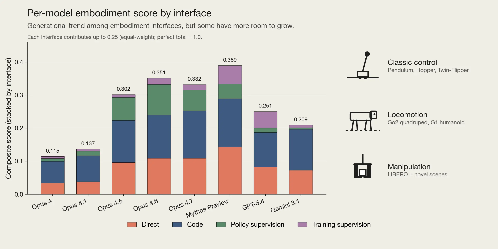

> Bar graph showing per-model embodiment score by interface. Mythos Preview scores the highest at 0.389, while Opus 4 scores the lowest at 0.115.

## 发现摘要（Summary of findings）

- A model's robotics score depends as much on the robot body and the control interface as on the model itself. The same model can look weak or strong depending on whether it is setting motor torques directly, writing a Python controller, supervising a pretrained policy, or training its own policy with reinforcement learning—each of which is a different way of the model completing the same task. For the most challenging bodies to control (the humanoid in particular), today's models only get traction at the higher-abstraction interfaces, in which a pretrained policy handles the low-level physics.
- 模型的机器人得分，与机器人本体和控制接口的关系不亚于与模型本身的关系。同一个模型可能显得弱或强，取决于它是直接设定电机扭矩、写 Python 控制器、监督预训练策略、还是用强化学习训练自己的策略——这些都是模型完成同一任务的不同方式。对最难控制的本体（尤其是人形），今天的模型只有在更高抽象的接口上才找得到着力点——由预训练策略处理底层物理。

- Models are improving at robotics, but unevenly. The most consistent performance improvements between model generations are on the high-level interfaces. Direct low-level control is also improving, but much less consistently: some new models clearly improve over their predecessors, but others don't.
- 模型在机器人任务上持续进步，但不均衡。模型代际间最一致的表现提升出现在高层接口上。直接低层控制也在进步，但一致性差得多：一些新模型明显超过前代，另一些则没有。

- On locomotion tasks, frontier models can now perform limited but meaningful whole-body control. Newer models make progress on low level control quadruped standing, balancing, and walking—and show weaker but measurable gains on humanoid balancing. Using pretrained policies and perception tools, they can even navigate simple environments. However, models still fail at tasks that require stable spatial memory, self-localization, or long open-loop plans.
- 在运动任务上，前沿模型已能进行有限但有意义的全身控制。更新的模型在低层控制的四足站立、平衡与行走上取得进展，在人形平衡上也有较弱但可测量的提升。借助预训练策略与感知工具，它们甚至能在简单环境中导航。但模型在需要稳定空间记忆、自定位或长开环规划的任务上仍然失败。

- With low-level manipulation methods, models are beginning to produce useful local physical behavior, even though full task success remains rare. Newer models are better at reaching objects, making contact, and grasping. However, they only complete the full task a small percentage of the time (from 0 to 5.5%).
- 用低层操作方法，模型已开始产出有用的局部物理行为，尽管完整任务成功仍属罕见。更新的模型更善于接近物体、建立接触并抓取。但它们只在很小的比例（0 到 5.5%）下完成整个任务。

- With high-level manipulation methods, newer models are more successful when using pretrained policies. Vision-language-action (VLA) scaffolds—pretrained policies that map camera images and an instruction directly to robot-arm motions—raise models' manipulation performance far above direct control. Newer models are also becoming increasingly good supervisors of those policies: they are better at recognizing when a proposed action will fail, less likely to defer to the VLA indiscriminately, and therefore make further progress on manipulation tasks. Supervising the policy still costs some performance—the combined system does worse than the VLA running on its own—but the best supervisors now close most of the gap. That does not mean supervision is useless: earlier models destroy most of the policy's value, the best of current models recover most of it, and on tasks the VLA cannot do alone the strongest models already provide net uplift.
- 用高层操作方法，更新的模型在借助预训练策略时更为成功。视觉-语言-动作（VLA）支架——把相机图像与指令直接映射为机械臂动作的预训练策略——把模型的操作表现抬高到远超直接控制。更新的模型也日益善于监督这些策略：更善于识别某个提议动作会不会失败、更不会不加分辨地服从 VLA，从而在操作任务上取得进一步进展。监督策略仍要付出一些性能代价——组合系统不如 VLA 独自运行——但最好的监督者现在已能挽回大部分差距。这不意味着监督无用：早期模型毁掉策略的大部分价值，当前最好的模型能挽回大部分，而在 VLA 独力无法完成的任务上，最强的模型已能提供净增益。

## 简单场景（Simple settings）

We begin by evaluating robot-relevant capabilities on a set of simple control tasks, including classic reinforcement learning (RL) problems such as balancing an inverse pendulum and controlling a hopper.

我们先在一组简单控制任务上评估与机器人相关的能力，其中包括经典强化学习（RL）问题，如平衡倒立摆与控制跳蛙（hopper）。

Although these are simplified environments, we believe they require the model to reason about dynamics, cause and effect over time, and basic physics—capabilities that are important precursors to more general physical understanding. In these low-dimensional environments, sensory data provides nearly all the necessary information, allowing them to be solved with little to no visual input. This kind of low-dimensional control also arises in some real-world settings, such as camera stabilization.

尽管这些是简化环境，我们相信它们要求模型对动力学、随时间的因果关系与基础物理进行推理——这些是更普遍物理理解的重要先导能力。在这些低维环境中，传感器数据几乎提供了全部必要信息，因此几乎不需要视觉输入就能求解。这类低维控制也出现在一些真实场景中，例如相机稳定。

We evaluate models through four control interfaces, all in the simulation engine Mujoco. (Throughout, "classic control" names this family of toy tasks; "direct control" names one of the four interfaces below—they are independent axes.) In what we call direct control, the model selects low-level actions at each step, such as torques or forces. In programmatic control, the model writes a python controller that maps observations to actions during execution. In policy control, the model can access a pretrained policy and issue high-level commands, often in natural language. In reinforcement learning supervision, the model trains a policy and then deploys the learned policy at test time.

我们在仿真引擎 Mujoco 中通过四种控制接口评估模型。（下文中，"经典控制"指这组玩具任务；"直接控制"指下面四种接口之一——二者是相互独立的坐标轴。）在我们所称的直接控制中，模型在每一步选择低层动作，如扭矩或力。在程序化控制中，模型编写一个在执行期间把观测映射为动作的 Python 控制器。在策略控制中，模型可以调用预训练策略并下达高层命令（通常是自然语言）。在强化学习监督中，模型训练一个策略，然后在测试时部署所学策略。

To approximate an upper bound on direct-control performance, we pause the simulator between LLM calls so real-time latency does not dominate the results. Without this, many direct tests would fail for a trivial reason: the models would simply react too slowly to control the environment. We expect inference speed to continue increasing, and this setup gives a clear view of best-case capability as it does.

为近似直接控制性能的上界，我们在 LLM 调用之间暂停仿真器，使实时延迟不至主导结果。否则，许多直接控制测试会因一个不起眼的原因失败：模型反应太慢，根本控制不了环境。我们预计推理速度会持续提升，而这一设置能清晰呈现"当下能力在最佳状态下"的样子。

We also designed our evaluation to account for the fact that many classic RL tasks appear frequently in pretraining corpora, which could limit how well our conclusions generalize to novel environments. To address this, we retain the inverse pendulum and hopper tasks as control tasks but also introduce a new task based on pinball arcade machines. In TwinFlipper, the agent controls a set of flippers and seeks to maximize the ball's total airtime—the cumulative amount of time the ball remains above a specified height threshold while not touching anything—before it drops below the flippers. Although a naive solution is to just slam the ball upwards, much more airtime can be gained by carefully bouncing the ball up and down in a controlled manner. This task is designed to be a representative example of a chaotic, dynamic system with few degrees of freedom, and none of the models have seen it before.

我们还把"许多经典 RL 任务在预训练语料中高频出现"纳入考量——这可能限制结论向新环境的推广。为此，我们保留倒立摆与跳蛙作为对照任务，同时引入一个基于弹球街机的新任务。在 TwinFlipper 中，智能体控制一组弹板，追求最大化球的总滞空时间——球在低于弹板前、保持在指定高度阈值以上且不触碰任何东西的累计时长。虽然朴素解法是把球猛地向上打，但通过有控制地让球上下弹跳，可以获得长得多的滞空时间。这个任务被设计为"低自由度混沌动态系统"的代表性例子，且所有模型都从未见过它。

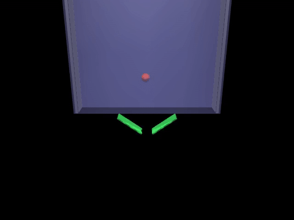

> Visualization of an AI agent playing a game where it controls a set of flippers, seeking to maximize the ball's time in the air.

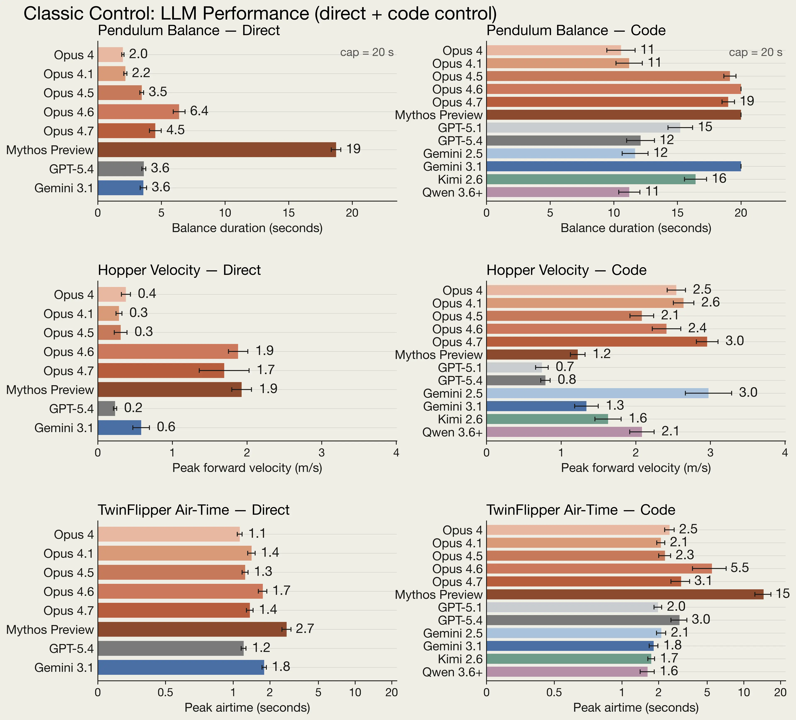

> Six bar graphs showing different AI models' classic control performance on various tasks, both directly and via code control: pendulum balance (direct and code), hopper velocity (direct and code), and TwinFlipper air time (direct and code).

虽然单项任务的表现噪声很大，但纵观全部经典控制基准，可以看到一致的代际提升。Claude Opus 4.6 与 Opus 4.5 在几乎所有任务上都胜过更早的两个版本——例外是 TwinFlipper 直接控制（所有模型都很差）与跳蛙速度（我们噪声最大的任务）。尽管如此，后两个模型在代码控制、强化学习、以及较小程度上的直接控制上都有显著提升。

我们的结果显示，大部分提升来自一种更强的能力：看到先前结果后相应调整策略。在有自然终止点的任务上（最明显是 TwinFlipper 与倒立摆），各模型的首次尝试表现相当接近，且 Claude Opus 4 与 Opus 4.1 在这一指标上还略微领先后面的模型。更大的提升出现在后续尝试中：越新的模型改进幅度越大。Claude Mythos Preview 是个显著例外，它的许多首次尝试在倒立摆上就更为稳健。

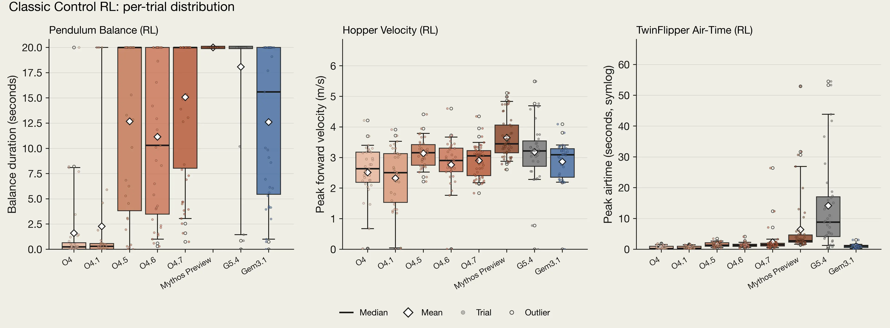

> Three bar graphs showing models' classic control performance when training an RL policy to perform three tasks: pendulum balance, hopper velocity, and TwinFlipper air time.

几乎所有模型在"训练 RL 策略"时的表现都不如"编写 Python 控制器"时。最突出的是 TwinFlipper：GPT-5.4 是唯一稳定学出像样策略的模型——鉴于它在其他控制接口下表现相对较差，这相当引人注目。在倒立摆与跳蛙上则不然：Mythos Preview 领跑，GPT-5.4 紧随其后，模型间差距小得多。在全部三个任务上，较新的 Claude 模型都明显优于较早的版本。

在目标更难规定的任务上（如跳蛙与 TwinFlipper），RL 表现在进步但仍落后于代码控制。这并不奇怪：让模型自己训练 RL 策略要解决一个复杂的设置问题——从定义环境与奖励，到管理更长的迭代周期、做出多个相互依赖的设计选择。虽然并非每一代 Claude 都有同等幅度的提升，大趋势是清楚的：RL 能力在随时间推进。

## 直接控制很糟，但在改善（Direct control is bad, but improving）

### 低层运动控制（Low-level locomotion）

下一个问题是：简单控制中的进步能否迁移到自由度多得多的机器人上。为此，我们在两个代表性平台上评估低层运动控制：29 自由度的 Unitree G1 人形机器人与 12 自由度的 Unitree Go2 四足机器人。需要指出，与玩具任务相比，这个领域既有更高的贡献上限，也有更大的风险面：鲁棒的人形与四足策略很难训练，而一旦训练出来，它们就会被部署在失准行为可能造成严重人身伤害的场景中。

这些是复杂的机器人，用数值方式控制它们极具挑战。模型要协调众多关节，同时持续补偿重力、惯性与接触力，而不是像简单任务那样只控制少数几个耦合变量。它毫不留情：微小的错误若不及时纠正，就足以让整个机架失稳。

带着这份难度，我们评估两个核心任务：从倒伏姿势站起，以及从直立姿势尽可能久地保持平衡。我们最初探索了更复杂的任务与起始条件，但那些设置连前沿模型都够不着。不过四足试验的结果令人鼓舞，所以我们又评估了以程序化方式让 Go2 向前行走的能力。

我们使用三种控制接口：直接控制、程序化控制与强化学习（RL）。与经典任务一样，直接设置下我们在 LLM 调用之间暂停仿真器，使实时延迟不至成为限制因素。实时控制约需 83 Hz；当前非推理推理约 0.2–0.4 Hz，要弥补这一差距需要大约两个数量级的延迟改进。

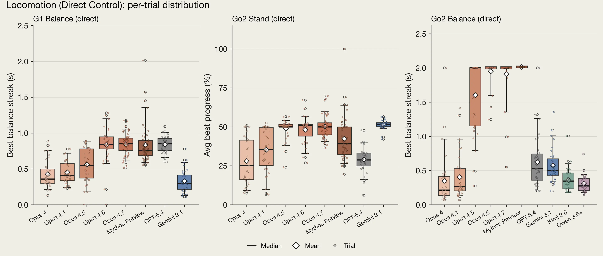

> Three bar graphs with performance intervals showing various AI models' performance at directly controlling a robotic quadruped.

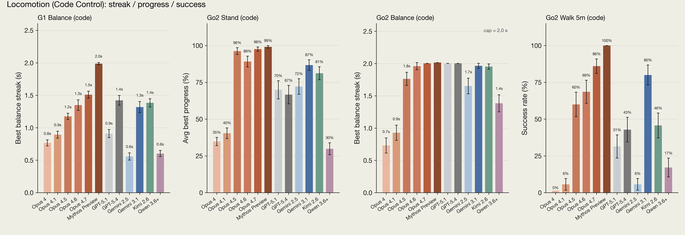

> Four bar graphs showing various AI models' performance at controlling a robotic quadruped's movements using code control.

虽然直接低层运动控制对所有模型都很难，但许多模型长于程序化控制。Opus 4.6、4.7 与 Claude Mythos Preview 用扭矩-力控制加 Python 控制器，能让 Go2 平衡近整整两秒——足以证明稳定平衡，又足够快、便于迭代。Gemini 3.1 与 GPT-5.4 也有同样强的控制器，尽管直接控制电机时远远落后。直接控制下，Opus 4.6 能让机器人保持平衡，却无法把它成功站起。

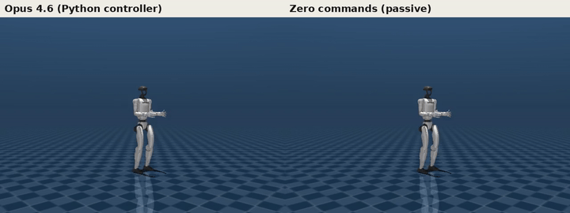

> Two computer renderings of a humanoid robot being controlled by an AI. In the first labeled "Opus 4.6 (Python controller)," the robot is standing but starts to twist its torso to one side. In the second, labeled "zero commands (passive)," the robot collapses to the ground.

G1 人形是我们研究中最难的平台，结果疲弱但在改善。试验中没有任何模型成功把机器人从倒伏姿势站起哪怕一次。即便如此，Opus 4 到 4.7 之间，在"机器人已处于站立状态时保持平衡"上仍有可测的进步。

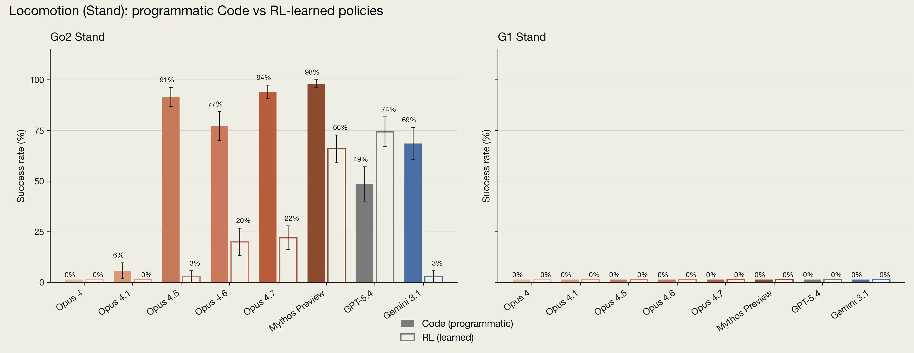

> Two bar graphs showing various AI models' performance on controlling a humanoid robot. More advanced models perform reasonably well on the "Go2 Stand" task, but all models fail on the "G1 Stand" task.

我们还评估了模型训练运动策略的能力。为此，我们给它们一个可访问 GPU 与可视化环境的训练支架，让它控制奖励函数、训练环境与模型架构。四个小时内，GPT-5.4 与 Claude Mythos Preview 稳定地训练出最能干的 RL 策略，印证了我们在经典 RL 任务上的结果。我们还观察到 Claude 家族内部的递进：从 Opus 4 到 Opus 4.6 提升，再到 Mythos Preview 进一步提升。

这些结果都应恰当地解读。例如，若我们把四足机器人的初始位置随机化到包含背面朝下，Opus 4.6 一次都站不起来。另外，我们在每轮平衡尝试之间重置环境；只有少数模型能在第一次尝试中就达到稳健平衡。但清楚的是：前沿模型正在长出运动能力。

### 低层操作（Low-level manipulation）

操作是另一项核心机器人能力，兼具明确的实用性与安全相关性，所以我们与运动控制并列研究。所谓操作，指用夹爪或机械臂以受控方式在场景中移动、翻转物体。我们用一台固定基座、7 自由度的 Franka Panda 机械臂在改编自 LIBERO 基准的厨房风格环境中评估这一能力。这些都是厨房式任务，例如"把盘子放到炉灶上"。

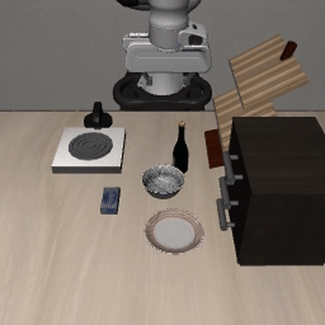

> Rendering of an AI model manipulating a simulated robotic arm. The robotic arm reaches down, picks up an object, and moves it to a pedestal.

由于机械臂是固定的，不需要像运动任务那样保持平衡。挑战在于把位置、姿态与接触控制得足够精确以完成目标。一次成功的尝试要求模型识别正确的物体、把机械臂移到位、对准夹爪、执行稳定的抓取，然后把物体运送并放置到位而中途不失手。任何一步出错都可能让整个尝试崩塌——尽管通常可以纠正。

我们测试一个简化的直接控制设置：模型输出标准的七维末端执行器运动指令。每次移动后，它收到场景图像与夹爪力传感器的读数，与 VLA 收到的类似。它从不直接获得物体的坐标，所以必须先从视觉中识别相关物体，再据此决定手下一步怎么动。

由于固定基座机械臂没有实时平衡约束，这里"暂停仿真上界"与实时表现的差距远小于有腿机器人。受 LLM 控制的固定机械臂本身已是可信的部署形态（实验室自动化、轻量制造），因此哪怕温和的操作能力提升也有直接的安全相关性：一个能可靠抓取、移动、重放物体的模型，一旦接入机器人系统，就已经具备作用于物理世界的实际能力。

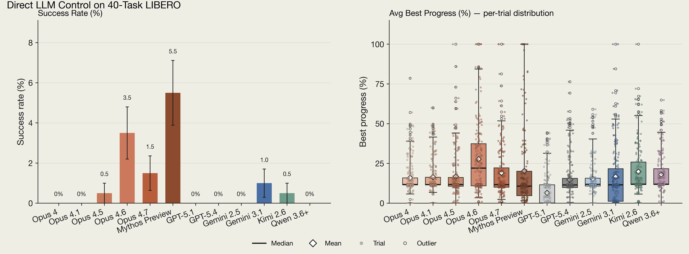

> Two bar graphs (the second with performance intervals) showing various AI models' success on LIBERO with direct control. Mythos Preview has the highest success rate, at 5.5; many AI models have a success rate of 0.

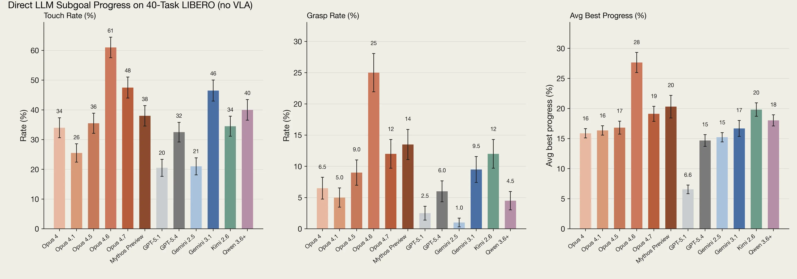

> Three bar charts showing various AI models' performance on various LIBERO subgoals. Here, the models show higher rates of progress.

提升在每次操作尝试的中段最为明显。与 Claude Opus 4 和 Opus 4.1 相比，Opus 4.6 把机械臂引向目标物体、建立接触并抓取的概率高得多。模型抓到物品的场合仍相对少见，但较新的模型往往在失败前走得更远，按简单的综合分（细节见附录）衡量，整体任务进度更高。有趣的是，尽管 Claude Mythos Preview 触碰与抓取更少，它的完整任务完成率却显著高于次优的 Opus 4.6——因为后者犯的错与做的调整更多。

尽管代际进步很快，完整任务成功仍然罕见；最好的模型无法稳定地刻意完成长程任务。即便如此，它们影响物理世界的能力在可见地改善，偶尔也能端到端成功。这一水平的能力，或许已足以让它们成为机器人训练数据的一个来源，我们预计未来工作会探索这一可能。

## 工具弥合了部分差距（Tools bridge some of the gap）

当模型能用上更高层的抽象——预训练运动策略、VLA——表现会大幅提升。但性能天花板仍然不高。

### 高层运动控制（High-level locomotion）

为测试高层运动控制，我们让模型通过一个预训练摇杆策略控制四足机器人。它不下发扭矩，而是向步态策略（gait policy）发送速度指令（前进、横移、偏航），并周期性收到朝前的 RGB 相机帧。这类策略对大多数商用四足机器人都是现成的。

我们构建了一套十一个导航与空间推理任务，从简单的目标寻的（find_x：走向贴着蓝色 X 的桌子）到搜索、迷宫与航点序列，再到明确探查自我监控的任务（drift_detection：察觉你的指令正被悄悄篡改）与空间心智模型构建（explore_report：先漫游场地，再凭记忆回答布局问题）。任务 oneshot_course 干脆撤掉相机，给模型一张俯视地图，要求它一次性预先提交全部指令序列——把规划与感知剥离开。每个任务按成功或归一化进度计分，我们报告十一项任务的综合分，量程 0–100（见附录）。

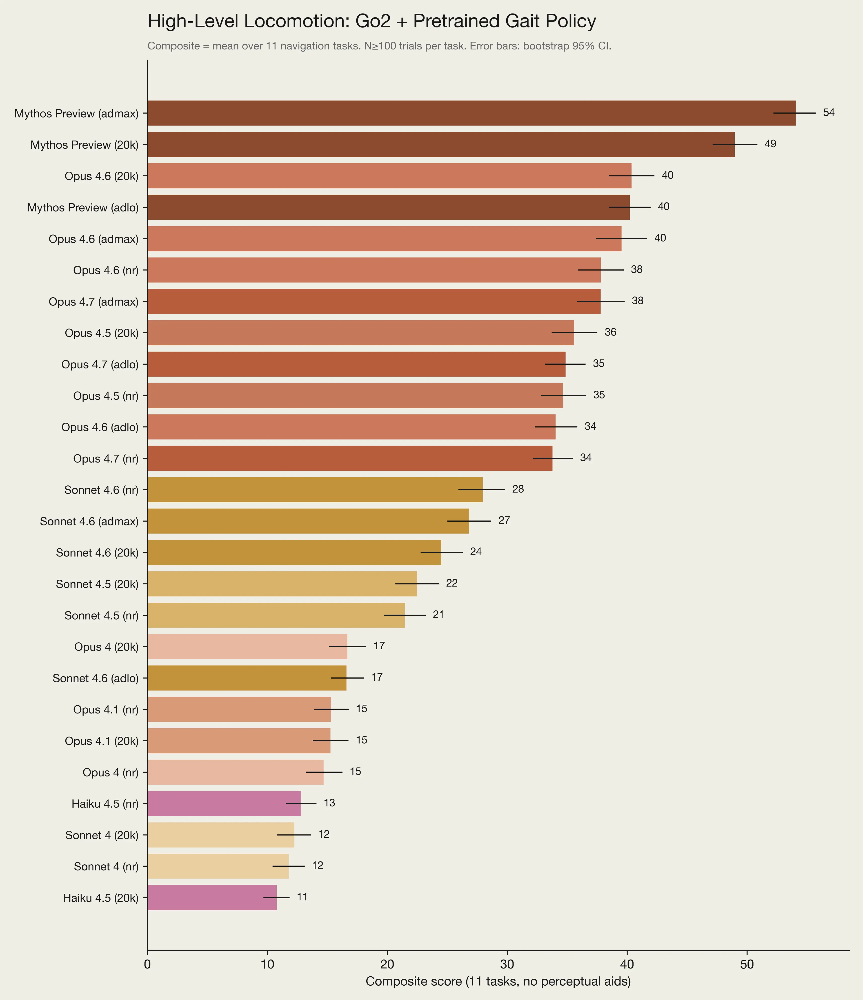

> Bar chart showing various models' performance on high-level locomotion with various reasoning configs. Mythos Preview (adamax) and Mythos Preview (20k) have the highest scores, at 54 and 49.

高层运动控制在模型代际上有两个清晰的跃升：从 Claude Opus 4.1 到 Opus 4.5，以及从 Opus 4.7 到 Mythos Preview。Opus 4.5 到 Opus 4.7 之间则处于一个平台期。

这个平台期是平均带来的假象：在大多数单项任务上，每一代 Claude 都在移动——只是并非在每项任务上都朝同一方向。按各自最佳推理设置逐任务对比 Opus 4.7 与 Opus 4.6，最大的单次退步出现在 invisible_walls（3% 对 15%）——模型必须绕开看不见的障碍重新规划。反方向上，Opus 4.7 在 turn_correction 上 +24 分、在 return_home 上 +11 分。我们把 Opus 4.6 到 Opus 4.7 的变化解读为失效模式的迁移：闭环自我纠错更好了，但遮挡下的重规划变弱了。

我们测试了几种工具，试图辅助模型的视觉与方向理解，以及更笼统的感知。我们试过在自我中心视野上画一个绿色中心准星、在视野上做半透明深度热图 alpha 叠加、用第三人称追逐相机替代前向视野，以及一个只给模型以度为单位的朝向信息的"罗盘"。罗盘工具轻松胜过其他工具——后文分析瓶颈时会详细展开。

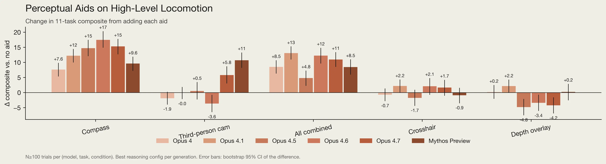

> Four bar charts showing how perceptual aids change various models' performance on high-level locomotion tasks: compass, third-person cam, all combined, crosshair, and depth overlay.

要点：配上预训练步态，当前模型能完成简单导航任务，但在需要持续空间记账或开环规划的任务上稳定失败。瓶颈主要是追踪机器人自身位置，而少量信息就能补救某些感知失败。

### 高层操作（High-level manipulation）

我们还评估了前沿模型能否有效使用预训练 VLA 进行操作。直接操作的结果显示，即便进步很快，无辅助能力仍然有限。然而，一个自身能力平平的模型，与预训练策略配对后可能变得高效得多。

为此，我们在同样的 LIBERO 操作任务上把模型与 VLA 策略配对。在这种设置下，VLA 提议低层动作，语言模型决定如何处置：接受、调整或彻底替换提议的动作。这与直接控制构成截然不同的挑战——核心难题变成判断哪些指令该接受、哪些错了需要修改。所有实验均使用 MolmoAct VLA。

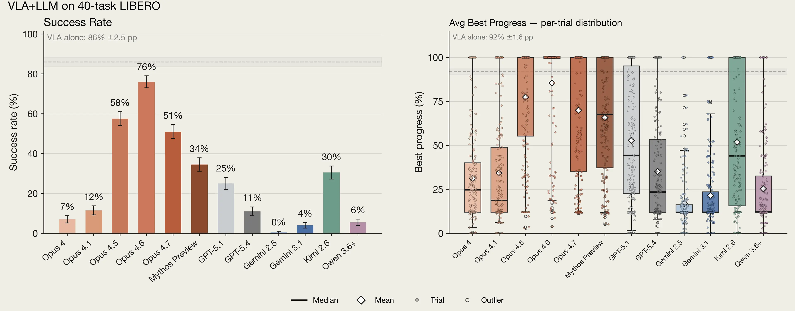

> Two bar charts showing various models' performance on LIBERO tasks with VLA supervision.

在标准的 40 任务 LIBERO 基准上，VLA 相对直接控制大幅扩展了能力边界。即便最新的模型，直接控制下也很少能端到端完成 LIBERO 任务——尽管几乎总能取得部分进展。而当允许 LLM 智能体指挥 VLA——给出指令并接受、修改或替换其提议动作——每个模型的任务成功率与总体进度都大幅上升。有了这种增强，连较老的模型也能取得可观的成功率。

需要指出，所有受测模型的表现仍显著逊于 MolmoAct 独自运行。反直觉的是，这一惩罚对最强模型并非最小：Claude Mythos Preview 在这里不及 Opus 4.5 与 Opus 4.6——它比应有的更频繁地推翻 VLA，在不服从本来就能成功的情况下相信自己的判断。为弄清这种控制惩罚的来源，我们测量了智能体"照单全收" VLA 提议动作的频率。只有当语言模型把 Panda 机械臂完整的 7 维动作原样放行时，才算一次"遵从"；任何编辑、替换或省略都算偏离。这让我们能定位 VLA 大体可靠的指令是否被置之不理。

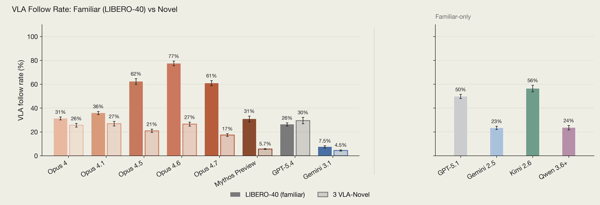

> Two bar charts showing various models' follow rate on familiar (LIBERO-40) and novel tasks.

结果显示，总体上 Claude 系列模型遵从 VLA 指令的程度显著高于 GPT-5.4 与 Gemini 3.1。它还显示，较新的模型 Opus 4.5 与 4.6 是全部受测模型中在 LIBERO 40 上遵从指令最多的。

这些结果分不清"顺从的模型"与"品味好的模型"。为评估这一点，我们测试这些系统能否使用、乃至纠正一个不可靠的 VLA。我们从原始 LIBERO-goal 场景中抽取三个未入基准的新任务：基线试验中，MolmoAct 三个都完不成。

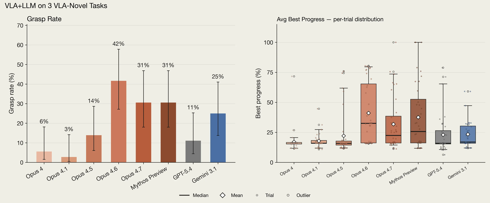

> Two bar charts showing various models' VLA-supervised performance on novel tasks.

较早的 Claude 模型与 GPT-5.4 在这种 VLA 指令需要纠正的场景下仍相对紧密地服从 VLA。相比之下，Opus 4.5、Opus 4.6 与 Opus 4.7 的服从明显减少。它们更善于识别策略正在失败——即便还不能直接纠正那些失败。尽管如此，Claude Opus 4.5 与 Opus 4.6 以及 Gemini 3.1 都超过了 MolmoAct 独自的表现。有趣的是，Opus 4 与 Opus 4.1 在这个新场景下对 VLA 的服从多于 Opus 4.5 与 Opus 4.6，总体成绩却更差。最简单的解释是：它们更高的遵从率并不反映更好的判断——它们以与"VLA 确实称职的场景"大致相同的频率听 VLA 的话，行为基本不加分辨。

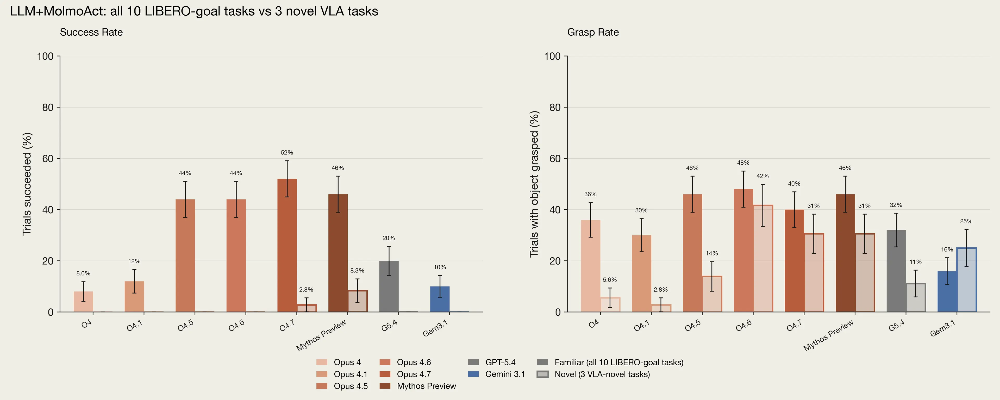

> Two bar charts showing various LLMs' success on familiar and novel touch, grasp, and place tasks.

Opus 4.5、Opus 4.6、Opus 4.7 与 Mythos Preview 在 VLA 熟悉的任务上取得最高的触碰率、抓取率与成功率。然而，只有 Mythos Preview 在新任务上也能解决相当一部分。

要点：预训练策略极大提升表现——高层控制远胜低层控制。更新的 Claude 模型更善于使用预训练策略而不做无谓对抗，策略出错时退化也更少，但它们对 VLA 的使用仍未达到其应有的效果。在新任务上，最强的模型能为高层策略的表现提供小幅增益。从安全角度看，这很重要：预训练策略恰恰是现实部署会提供的东西——模型无需亲自驱动关节就能干练地作用于世界，只需接入一个称职的控制器。把模型单独隔离测试的能力评估，会低估它嵌入机器人栈后能做的事。

## 瓶颈在哪里？（What's the bottleneck?）

新模型的进步从何而来，它们还在为什么挣扎？

### 视觉感知是瓶颈吗？（Is visual perception the bottleneck?）

在操作与运动控制中，我们都测试了额外的视觉输入能否提升表现。对 Panda 机械臂，我们加入了深度图、带标注的分割叠加，以及一个光标工具——夹爪相机画面上一个小红叉，模型可以移动它并查询该点的物体与距离。对 Go2，我们加入叠在前向相机上的深度热图、画面上的绿色中心准星，以及替代前向视野的第三人称追逐相机。

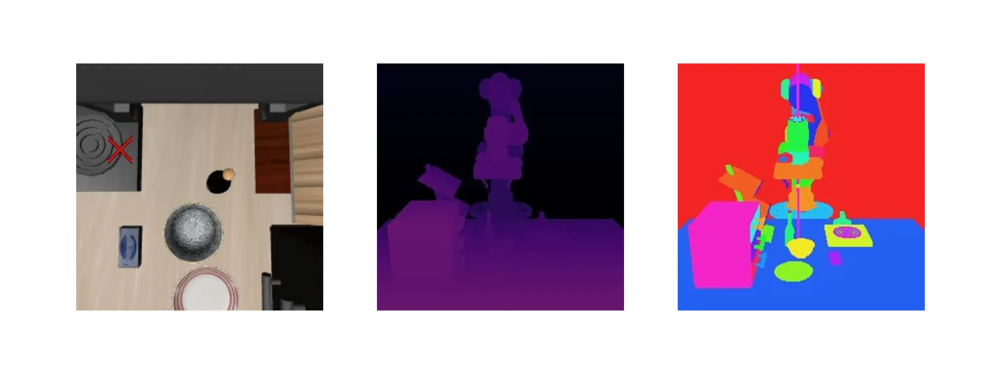

> Three colorful renderings of overlays given to the manipulation model.

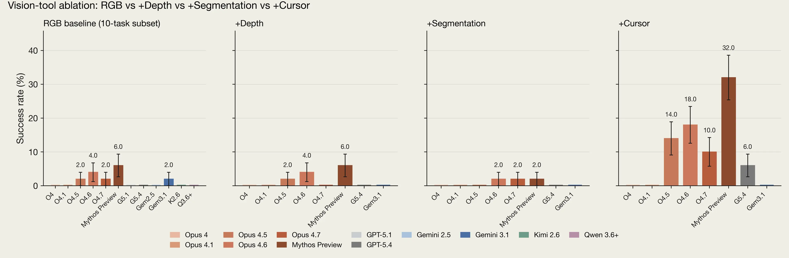

> Four bar charts showing various models' success rates when given vision tools: RGB baseline, depth, segmentation, and cursor.

在操作任务上，深度图与分割叠加大致中性：它们传达的信息类型没错，但信号似乎太弥散，帮不上稳定的忙。在运动控制上，深度热图与准星叠加同样接近中性，深度热图还轻微伤害较强的模型。

第三人称相机是最依赖模型的辅助。它对 Opus 4.6 及更早的模型毫无作用甚至略有伤害——Opus 4.6 掉了 3.6 分——却给 Opus 4.7 +5.8、给 Mythos Preview +10.7，是 Mythos Preview 单项最好的视觉辅助。在任务层面，它帮助那些需要模型随时间追踪自身位置的任务（color_sequence、drift_detection、invisible_walls），伤害依赖前向视野的任务（如 turn_correction）。Mythos Preview 是例外，连 turn_correction 都有提升。

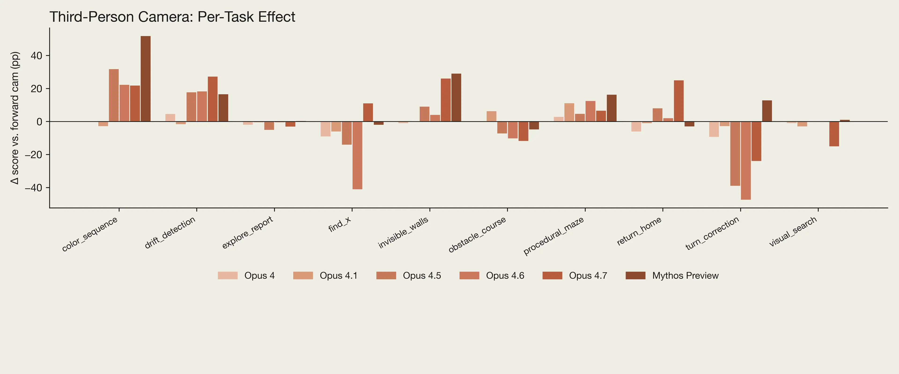

> Bar chart showing the per-task effect of replacing the forward camera with a third-person camera on various models' performance on high-level locomotion tasks. Some tasks, like color_sequence, improved, while some tasks, such as find_x declined.

相比之下，光标工具让每个模型在操作上都大幅提升——对 Mythos Preview，10 任务子集的成功率从 6% 升到 32%。罗盘对运动控制同样如此，抬升了我们测试的每种配置。两种情形的结果都指向：模型主要需要的是更好的朝向信息，而不是换一个看场景的视角——告诉它面朝哪里，仍然比给它看自己更管用。

我们还测试了"一张真实的图像比一段详尽的文字描述多提供了多少信息"。做法是把视觉输入换成文字描述——由我们测试过的最强图像问答模型 Gemini 3.1 生成。这样我们就能看到：模型拿到场景的有力言语描述而非像素时表现如何。如果模型本已有效利用视觉输入，这种替换应当会伤害表现。

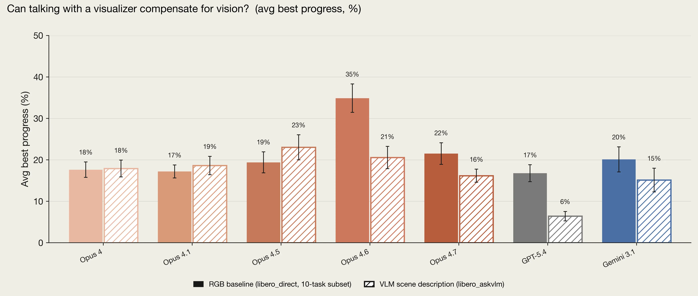

> Bar chart showing various AI models' average best progress on tasks when using RGB baseline vs. VLM scene description. Performance was generally higher with RGB baseline.

视觉感知对旧模型是比强模型更严重的限制。换言之，新模型明显更善于直接从图像中提取空间信息。较老的 Claude 模型在图像被换成文字描述时表现更好，说明它们难以只靠像素读出足够精确的空间细节。相比之下，Opus 4.6 与 Opus 4.7 用文字替换图像时略变差，Gemini 也下降更多。对它们而言，原始视觉输入含有在场景被压缩成语言时丢失的有用信息。

我们测试的大多数额外视觉输入并无帮助。第三人称相机帮助 Opus 4.7 与 Mythos Preview；除光标与罗盘外，其余视觉辅助在所有模型上大致中性或略负。ask_vlm 对比显示，较新的模型已能从原始图像中获得比旧模型更多的东西。

### 侧写：真机 Go2 上的视觉工具（Vignettes: Vision tools on the physical Go2）

在后面讨论的真机探索中，我们让 Claude Opus 4.6 控制一台实体 Unitree Go2 四足机器人，并在基础导航任务（比如绕办公室一圈）中打开部分视觉辅助。开启自我中心准星时，我们能在它的推理中看到：它在利用中心标记判断对齐。沿走廊稍有偏轴地走时，它注意到走廊似乎在向准星左侧漂移，推断自己大概朝右偏了，于是纠正。这些情形令人鼓舞。但准星有时也会分散对障碍物的注意。一次运行中，机器人前方有一个小垃圾桶；模型认出了它，并自信地宣称：因为垃圾桶在准星左边，所以不碍事、可以继续前进。而垃圾桶其实正对着机器狗。它一头撞上去，一条腿被卡住，拖着垃圾桶走了几米，直到我们把它停下。

我们还在实体 Go2 上试了深度热图：用计算机视觉模型把估计深度以半透明热图叠加在自我中心相机上，调到真实世界的对比度仍可见、机器人仍可导航的水平。有一些证据表明模型能对热图颜色进行推理——它的记录频繁讨论视野中的颜色，并把它们与"更近"或"挡路"的物体联系起来。但在更繁杂的场景——一条有植物和办公室饮水机作障碍的走廊拐角——模型明显晕头转向：它无视可用的深度信息，朝障碍物而不是空地转了过去。

### 推理有帮助吗？（Does reasoning help?）

推理对我们多数结果影响甚微，许多差异落在标准误差之内。

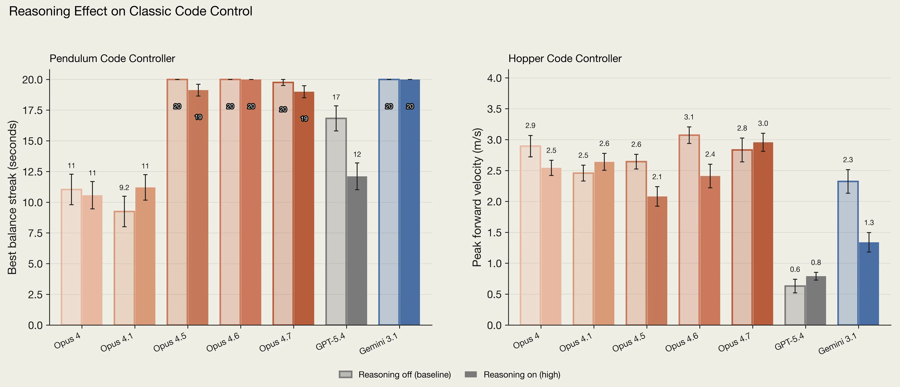

> Bar chart showing the effect of reasoning on classic code control for various AI models when performing two tasks: pendulum code controller and hopper code controller. The two reasoning modes—baseline vs. high—show similar results.

在经典控制任务上，较新的模型在拿到更高推理预算时反而退步。这可能是对相对简单的实验过度工程化了。对较老的模型，似乎没什么大影响。

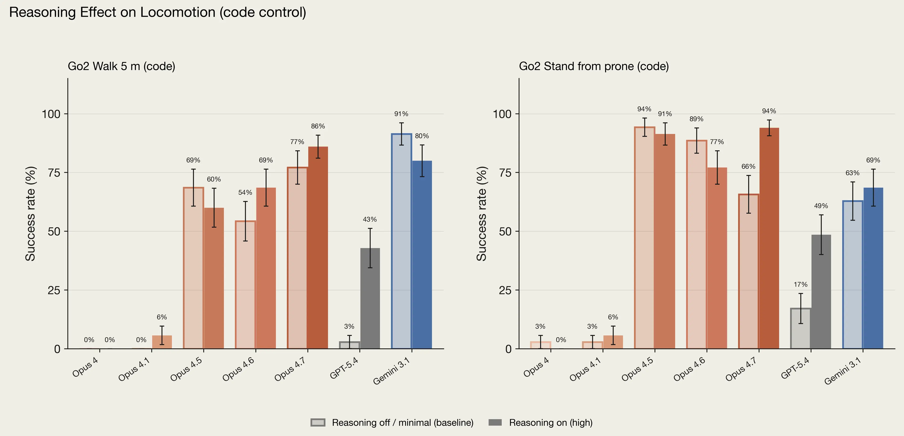

> Two bar charts showing the effect of reasoning on locomotion using code control for various AI models.

运动测试中，只有 GPT-5.4 从额外的测试时计算中显著获益，其他模型均无。对多数其他模型，我们的推测是：额外推理带来的规划收益，似乎也妨碍了敏捷的、反应式的行动。

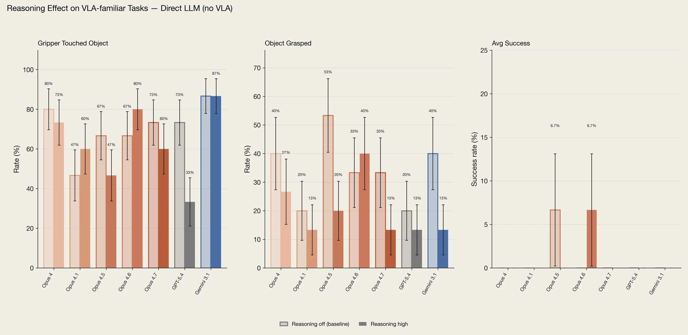

> Three bar charts showing the effect of reasoning on VLA-familiar tasks for various models.

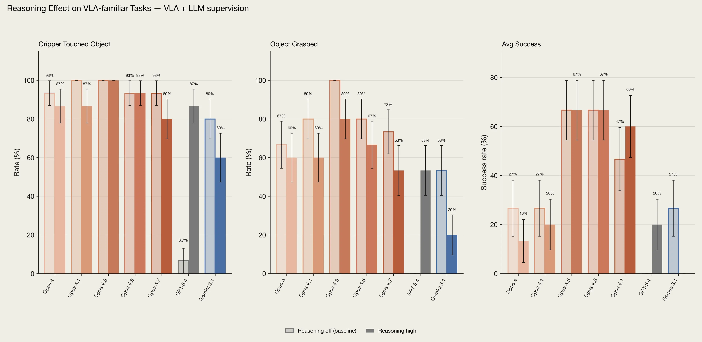

> Three bar charts showing the effect of reasoning on VLA-familiar tasks with VLA and LLM supervision for various AI models.

在直接与高层操作上，推理对 Claude 家族各模型都没有大的影响，尽管它显著影响 Gemini 3.1 与 GPT-5.4。纵观各模型，额外推理似乎弊大于利。

在高层运动控制上，推理预算对 Opus 各代影响很小。例如，在不推理、20k 预算与自适应最大（adaptive-max）之间，Opus 4.6 落在 2.6 分的区间内（37.8–40.4），Opus 4.7 在 4.0 分之内。唯一的稳定输家是 adaptive-low：在几乎每个支持它的模型上，它都逊于其他所有配置。Mythos Preview 是例外——它跨配置的差距接近 14 分（adaptive-low 40.2 到 adaptive-max 54.1），而且是唯一一个"额外推理带来堪比感知辅助的增益"的模型。

我们没有看到"推理改变模型使用感知辅助方式"的有力证据。额外推理为何帮助某些模型、以及它是否解锁了本已潜在的能力，需要更多研究。

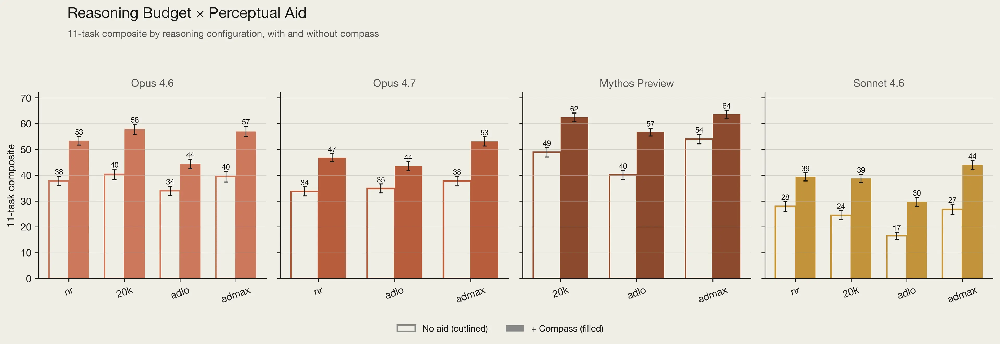

> Four bar charts showing how different reasoning levels and a perceptual aid affect various AI models' performance on tasks. The models shown are Opus 4.6, Opus 4.7, Mythos Preview, and Sonnet 4.6.

这些发现说明：对当前一代模型，仅靠额外推理不太可能克服阻碍其完成通用低层机器人任务的那些缺陷。虽然有些模型从额外推理中获益，代际之间的能力跃迁由其他技能构成——更好的视觉、数值一致性或三维理解。

### 它们能从经验中学习吗？（Can they learn from experience?）

能——但主要限于短程。

虽然"语言模型在少样本设置下表现更好"人尽皆知，但这不等于它们能从长上下文的机器人具身设置中学习——那种设置可能横跨数百张图像与数十万 token。

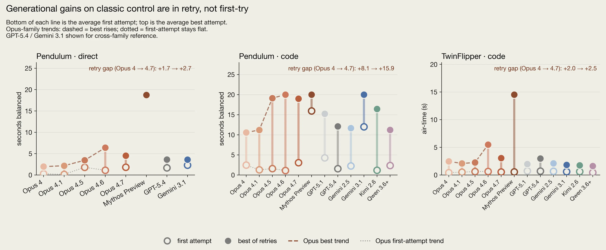

> Three charts showing performance ranges, from average first attempt to average best attempt, for various AI models on three tasks: pendulum (direct), pendulum (code), and TwinFlipper (code).

上下文学习最有力的证据来自经典控制任务。较新的 Claude 模型并非靠"起点高得多"取胜——几乎所有首次尝试都很糟，只有少数例外。它们是靠从失败尝试中做上下文学习、并在后续控制中表现得更好来取胜的。Opus 4.5 与 Opus 4.6 从迭代中的获益远大于 Opus 4 与 Opus 4.1。较新的 Claude 版本更善于从失败尝试中学习、修订方法、找到可行解。

长程机器人交互需要的不只是"正确选择下一个动作"。虽然我们研究的任务原则上大多是马尔可夫的，成功的表现仍要在数百条乃至更多精确指令上逐步展开。实际中，系统利用这段扩展的交互来学习任务的行为方式，并过滤掉无效的战术。

我们做一个测试，考察模型能否在一次试验过程中建立起更丰富、更长程的理解。方法是在操作任务中做上下文截断实验：刻意移除大部分先前交互，只给模型留下一个仅含近期动作与观察的小窗口。如果表现依赖对整个回合的细致记忆，这应当造成大幅下降。多数情况下，并没有；某些情况下表现甚至提升了。这说明模型对"最近的过去"的依赖远大于对"此前一切"的广泛积累理解。

这些截断运行总是保留最初 10 轮加最近 N 轮。丢掉第一轮会让模型忘记基本约定并陷入循环，所以所有条件下我们都保留它。

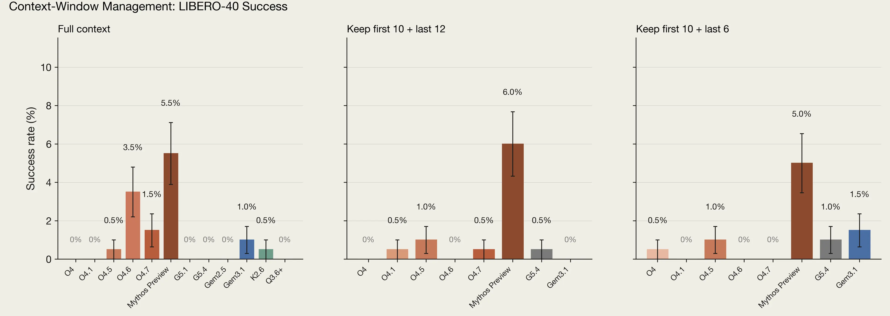

> Three bar charts showing various models' performance on LIBERO-40 under three context truncation conditions: full context, keep first 10 + last 12, and keep first 10 + last 6.

只有 Opus 4.6 出现了统计显著的表现下降。值得注意的是，在我们测试中总体最强的 Claude Mythos Preview 并未出现显著退化。我们猜测，Opus 4.6 是在持续学习那些因上下文丢失而被遗忘的行为模式，而 Claude Mythos Preview 能开箱即用地调用这些策略。弱一些的模型可能被早期上下文搞糊涂——这是一种有文献记载的现象，称为"上下文腐坏"（context rot），可以解释为何截断上下文反而提升表现：这些模型本就无法从遥远的过去学习，删掉它反而成了性能增强剂。

前文我们看到，较新的 Claude 模型在失败后更倾向于改变策略，这是它们性能提升的一部分来源。上下文截断的结果表明，这种适应大多是短程的：模型确实会重新框定与调整，但似乎主要基于最近几步，并不需要形成贯穿整个回合的长程策略。尤其是，交互早期得多的动作似乎无足轻重，移除它们几乎不改变表现。

我们也在高层运动控制中看到短期学习的证据。在 oneshot_course 任务中，模型要看一张 L 形走廊的简单俯视地图，在开始前规划出全部移动指令——没有相机输入，也没有中途调整的机会。未经练习，模型普遍吃力，说明这个任务不是光会看地图就能解的：它要求把地图转化为一次就奏效的行动计划。

当给模型同一课程的几次练习机会后，成绩全面上升。主要差别在于学习的速度：Mythos Preview 仅凭一个例子就达到强势表现，而 Opus 在几次尝试中渐进提升。足够练习下，连较小的模型也能学会这条路线。总体而言，从少量上下文示例中学习的能力广泛存在，但 Mythos Preview 的突出之处在于它需要的练习远少于他人。

在更难、更长的课程上，练习没有帮助。那些试验中，Mythos Preview 与 Opus 4.7 即便练了二十次，也一次都完不成。模型学到的是一条特定序列，还不是通用的规划者。

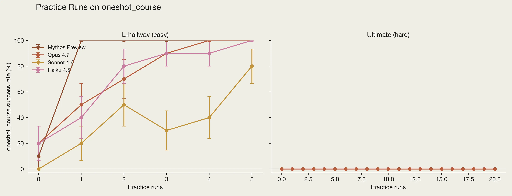

> Two line graphs showing various AI models' performance on practice runs on one_shot course. The models show varied performance on the L-hallway (easy) course; all models failed on the ultimate (hard) course.

### 真机侧写（Real-world vignettes）

上文视觉工具侧写已经用到了实体 Unitree Go2。本节报告我们在这台机器人上其余的真机运行。由于现实世界工作的串行性，我们无法做到高 N 数试验；我们的探索与仿真发现大体一致，但揭示了一些有趣的失败案例，全部围绕贫弱的视觉与空间推理。

首先，我们复现了 find_x 任务。四足机器人被放在约 25 英尺外、朝向与一张翻倒的桌子相差 180 度的位置，桌上贴着一个大蓝 X。模型被指示找到桌子并一路走到它跟前（至少 1 米之内）。最常见的失败（仿真中同样存在）是：许多模型在未达 1 米要求距离时就停了下来。此外，较老的模型无法在走向目标物体的途中修正航向。所有模型在这个任务上的共同行为是：先旋转直到桌面入画，然后走向桌子。较老的模型无法精确对准并错过桌子——常常说服自己"已在路上"，或者没意识到桌子明显偏在一侧，结果越走越远却声称越来越近。find_x 真机复现中的一个失败案例是对 Grok 4.1 Fast 的测试：Go2 被摆成面向与桌子相对的一扇玻璃门，Grok 在玻璃门的反光中看到了目标桌子，开始朝玻璃门冲去。所幸在门或机器人受损之前我们把它停住了。

此外，一个非正式基准是让模型只靠视觉控制 Go2、沿办公室走廊环线跑完一整圈。无论我们用各种 harness、各种模型，以及试图给模型的种种便利，所有模型都失败了。这一失败主要由视觉与记忆缺陷造成：有时模型分辨不出路过另一条走廊的开口时该不该转弯；有时它以为已经转进走廊、并以为自己已走了很深，实际上根本没有——于是试图再转一次或走错方向；即便转进了一条走廊，模型也常会转弯转过头或不及，然后晕头转向，多半以反方向收场。

## 结论（Conclusion）

我们的实验套件显示出机器人任务跨代际的快速——如果不均衡的——进步。更新的 Claude 模型更善于把感知与推理转化为跨越多种具身的物理动作。直接的力与扭矩控制在改善，但比高层控制慢。

这项研究有清晰的安全含义。一个 VLM 对真实世界的影响力，可以随它获得的信息而变化数个数量级。评估与部署需要把"访问层级"当作系统的核心组成部分，因为工具或控制方式的微小变化就能带来能力的巨大变化。

我们希望这些结果在两个方向上都提供指引。建设性的一面：模型可以帮助机器人调试失败、监督现有控制器、生成有用的训练数据。安全的一面：我们需要更好的、带明确限界的物理访问授予方式，让系统能作用于某些物体，同时被挡在其他物体之外。

---

*注：原文附录（模型与 API、试验次数、提示词结构、延迟数据、强化学习细节、视觉输入与工具、算力设置、可复现性）未收录，如需可补充；代码发布于 github.com/safety-research/embody（原文链接）。*
