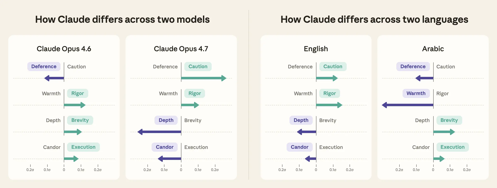

# Claude 的价值观如何随模型与语言而变化（中英对照）

> 原文标题：How Claude's values vary by model and language
> 原文链接：https://www.anthropic.com/research/claude-values-models-languages
> 原文作者：Matt Kearney、Miranda Zhang 等 24 人（Anthropic）
> 发布日期：2026-07-13
> **翻译模型：** GLM-5.3-Flash
> **评分：** ★★★★☆（4/5，强推荐）—— 30 万对话把 3000+ 价值观压缩成四条可解释轴，量化跨模型与跨语言的价值漂移，与 values-wild 接续成方法体系
> 排版：每段英文原文在前，中文翻译紧随其后。默认收录正文主体；脚注以 Obsidian 脚注形式保留于文末。

---

When someone asks Claude a question with no universal right answer—say, whether to take a new job or how to handle conflict with a friend—how Claude responds inevitably reflects certain values.[^1] The values we want Claude to reflect are outlined at a high level in Claude's constitution, but no document can anticipate every value that might emerge across the millions of conversations that happen every day on Claude.ai. Instead, we seek to cultivate in Claude's responses "good judgment and sound values that can be applied contextually."

当有人问 Claude 一个没有普适正确答案的问题——比如该不该换一份新工作、如何处理与朋友的冲突——Claude 的回应方式必然折射出某些价值观。[^1]我们希望 Claude 体现的价值观，在《Claude 宪法》中有高层面的勾勒，但没有任何文档能预见到 Claude.ai 上每天数百万次对话中可能涌现的每一种价值。因此，我们力求在 Claude 的回应中培养"能够因情境而应用的良好判断力与健全价值观"。

How, exactly, do we study the values that Claude expresses and how they change in different contexts? In previous work, we analyzed 700,000 anonymized Claude.ai conversations, identifying more than 3,000 distinct values in Claude's responses and how often Claude expressed them. But a list of values so large is hard to reason about. In this work, we make studying these thousands of values tractable by compressing them into a small number of axes that capture key patterns in Claude's responses. Each axis is a number line between two groups of values—for example, values relating to emotional warmth on one end and values relating to rigor on the other—and where Claude falls on that line tells us which values it leans toward.

那么，我们究竟如何研究 Claude 表达的价值观及其在不同情境下的变化？在此前的工作中，我们分析了 70 万条匿名化的 Claude.ai 对话，识别出 Claude 回应中 3000 多种不同的价值观及其表达频率。但如此庞大的价值清单很难把握。在这项工作中，我们把数千种价值观压缩成少数几条捕捉 Claude 回应关键模式的轴，使研究变得可行。每条轴是介于两组价值之间的数轴——比如一端是与情感温暖相关的价值，另一端是与严谨相关的价值——Claude 落在这条线上的位置，就告诉我们它偏向哪些价值。

We applied this approach to measure how the values Claude expresses vary across two factors. First, we compared how the values Claude expresses vary across models. Each Claude model reflects a slightly different approach to character training as well as many other fine-tuning decisions. Because our value axis approach quantifies key differences between models, it may ultimately allow us to connect variation in the values Claude expresses to different training decisions.

我们把这一方法应用于测量 Claude 表达的价值观在两个因素上的变化。第一，比较各模型之间价值表达的差异。每个 Claude 模型都体现了略有不同的品格训练（character training）路径，以及许多其他微调决策。由于我们的价值轴方法量化了模型之间的关键差异，它最终或能把 Claude 价值表达的变异与不同的训练决策联系起来。

Second, we want to understand how the experience of users compares across the many languages people use to talk to Claude. Our previous research has shown that Claude behaves somewhat differently in different languages.[^2] We apply our value axis approach to understand how the values expressed by Claude vary across the top 20 languages on Claude.ai.

第二，我们想了解：在人们与 Claude 交谈所用的众多语言之间，用户体验有何异同。此前的研究显示，Claude 在不同语言中的表现略有不同。[^2]我们用价值轴方法来理解 Claude 表达的价值观如何随 Claude.ai 上最常用的 20 种语言而变化。



> Four value profile cards in two pairs, one comparing the values expressed by Opus 4.6 and Opus 4.7 and the other comparing the values expressed by Claude in English and by Claude in Arabic. Each card has four arrows depicting the magnitude and direction of Claude's lean on each of the four axes (Deference vs. Caution, Warmth vs. Rigor, Depth vs. Brevity, Candor vs. Execution). Opus 4.7 leans most strongly toward Caution and Depth, and also toward Rigor and Candor. Opus 4.6 leans toward Deference, Rigor, Brevity, and Execution. Claude in English leans toward Caution, Rigor, Depth, and Candor. Claude in Arabic leans most strongly toward Warmth, and also toward Deference, Brevity, and Execution.

We find:

我们发现：

Four key axes capture 15% of the variation in Claude's values:[^3]

四条关键轴捕捉了 Claude 价值观变异的 15%：[^3]

- Deference vs. Caution: Whether Claude leans toward accommodating what someone wants or guarding against possible risk and harm.
- 顺从（Deference）vs. 谨慎（Caution）：Claude 偏向迁就对方的诉求，还是防范可能的风险与伤害。

- Warmth vs. Rigor: Whether Claude leans toward expressing positivity and care for the person or emphasizing accuracy and precision.
- 温暖（Warmth）vs. 严谨（Rigor）：Claude 偏向表达对人的积极与关怀，还是强调准确与精确。

- Depth vs. Brevity: Whether Claude leans toward explaining in depth or doing only what was asked.
- 深度（Depth）vs. 简洁（Brevity）：Claude 偏向深入解释，还是只做被要求的事。

- Candor vs. Execution: Whether Claude leans toward foregrounding its own uncertainty or producing a more polished and confident answer.
- 坦诚（Candor）vs. 执行（Execution）：Claude 偏向凸显自身的不确定，还是给出更 polished、更自信的答案。

Value profiles across these axes match perceptions of model character. Sonnet 4.6 is regarded as particularly warm, while Opus 4.7 is known for rigor. We find that each model's value profile mirrors these subjective assessments: Sonnet 4.6 leans toward expressing more deference to the user and emotional warmth while Opus 4.7 leans toward expressing a focus on accuracy and precision as well as guarding against misuse.

沿这些轴形成的价值画像与人们对模型品格的感知吻合。Sonnet 4.6 被认为格外温暖，而 Opus 4.7 以严谨著称。我们发现每个模型的价值画像都映照了这些主观评价：Sonnet 4.6 偏向对用户表达更多顺从与情感温暖，而 Opus 4.7 偏向聚焦准确与精确、并防范误用。

The values Claude expresses vary across languages. When Claude speaks in English, it emphasizes different values than when it speaks in Portuguese, Indonesian, or Chinese.[^4] The largest variation is in the Warmth vs. Rigor axis, with Claude leaning toward expressing warmth-related values most in Arabic and Hindi and rigor-related values most in English and Russian.

Claude 表达的价值观随语言而变。Claude 用英语说话时强调的价值，与用葡萄牙语、印尼语或中文说话时不同。[^4]变异最大的是"温暖 vs. 严谨"轴：Claude 在阿拉伯语与印地语中最偏向表达与温暖相关的价值，在英语与俄语中最偏向与严谨相关的价值。

With this approach we can begin to ask why values shift across models and languages and better test how factors such as behavioral training or cultural context influence the values that Claude expresses.

借助这一方法，我们可以开始追问价值观为何在模型与语言之间漂移，并更好地检验行为训练、文化语境等因素如何影响 Claude 表达的价值。

## 如何解读浩瀚的价值空间？（How do we interpret the giant space of values?）

Ultimately, our goal is to have a way to empirically understand the values that Claude expresses and how these vary across contexts. In this work, we focus specifically on how the values change between models and languages. But our previous work, Values in the Wild, identified more than 3,000 values expressed by Claude. Comparing these thousands of values one by one would be unwieldy and would obscure broader trends.

归根结底，我们的目标是找到一种经验性地理解 Claude 所表达价值观及其情境变化的方法。本文聚焦于价值观在模型与语言之间的变化。但我们此前的工作 "Values in the Wild" 已识别出 Claude 表达的 3000 多种价值。逐一比较这数千种价值既难以操作，也会掩盖更宏观的趋势。

To make comparing values easier, we constructed value axes that reduce those thousands of values down to a few underlying dimensions based on which values tend to show up together in real-world conversations. For example, Claude responses that are characterized as "warm" are often also characterized as "encouraging" and "positive." Those same "warm" responses are less often characterized as "rigorous" and "accurate." Constructing an axis from warmth to rigor allows us to organize these groups of related values—warmth-related values on one side, rigor-related values on the other—and captures an important aspect of how Claude interacts with someone in conversation. If Claude expresses more warmth-related values than rigor-related values in a conversation, that conversation sits more on the warmth side of this axis, and vice versa. This doesn't mean the value groups on either end are mutually exclusive—Claude can express warmth and rigor in the same conversation. But in practice, the more Claude expresses values on one side of an axis, the less it tends to express values on the other. These axes allow us to compare the most salient groups of values that Claude expresses, without having to track changes across thousands of individual values.

为了让价值比较可行，我们构建了价值轴：依据"哪些价值倾向在真实对话中同时出现"，把数千种价值约简到少数几个底层维度。例如，被刻画为"温暖"的 Claude 回应往往同时被刻画为"鼓励"与"积极"，而不那么常被刻画为"严谨"与"准确"。构建一条从温暖到严谨的轴，让我们把这些相关价值分组组织起来——温暖相关价值在一侧，严谨相关价值在另一侧——并捕捉 Claude 在对话中与人互动的一个重要侧面。如果 Claude 在一段对话中表达的温暖类价值多于严谨类价值，这段对话就落在这条轴偏温暖的一侧，反之亦然。这并不意味着轴两端的两组价值互斥——Claude 可以在同一段对话中既表达温暖又表达严谨。但实践中，Claude 在轴一侧表达的价值越多，在另一侧表达的就越少。这些轴让我们得以比较 Claude 最显著的价值组群，而不必追踪数千种具体价值的变化。

To build the value axes, we began with the 3,307 values identified in Values in the Wild and manually clustered those with similar meanings, producing a shorter list of 339 high-level values. Next, with our privacy-preserving analysis tool, we sampled 309,815 Claude.ai conversations in which the user gave Claude a subjective task.[^5] Our sample drew equally from three models (Sonnet 4.6, Opus 4.6, Opus 4.7) and the 20 most common languages used on Claude.ai, giving us roughly 5,000 conversations per model-language pair. For every conversation, the tool used Claude to label each of the 339 high-level values as present or absent.[^6] We followed the same process to identify the values expressed by the user, and the conversation's task and topic. We then applied dimensionality reduction, a technique that compresses the labeled values into axes based on which ones Claude tends to express together. See the appendix for method details, prompts, additional analyses, and limitations.

构建价值轴时，我们从 Values in the Wild 识别出的 3,307 种价值出发，手工聚类含义相近者，得到一份 339 个高层价值的精简清单。接着，我们用隐私保护分析工具抽样了 309,815 条"用户交给 Claude 主观任务"的 Claude.ai 对话。[^5]样本在三个模型（Sonnet 4.6、Opus 4.6、Opus 4.7）与 Claude.ai 上最常用的 20 种语言之间均匀抽取，平均每个"模型×语言"组合约 5,000 条对话。对每条对话，工具用 Claude 把 339 个高层价值逐一标注为"出现/未出现"。[^6]我们用同样的流程识别用户表达的价值，以及对话的任务与主题。随后做降维（dimensionality reduction）——依据"Claude 倾向同时表达哪些价值"把标注值压缩成轴。方法细节、提示词、补充分析与局限见附录。

This left us with four axes that capture the main ways Claude's expressed values shift from one conversation to another:

最终得到四条轴，捕捉 Claude 所表达价值在对话之间的主要漂移方式：

- The Deference vs. Caution axis contrasts values like accommodation and respect for preferences with values like responsible guidance and harm reduction.
- 顺从 vs. 谨慎轴：把"迁就、尊重偏好"一类价值与"负责任的引导、减少伤害"一类价值相对照。

- The Warmth vs. Rigor axis contrasts values like positive framing and encouragement with values like accuracy and transparency.
- 温暖 vs. 严谨轴：把"积极框架、鼓励"与"准确、透明"相对照。

- The Depth vs. Brevity axis contrasts values like nuance and critical thinking with values like brevity and compliance.
- 深度 vs. 简洁轴：把"细腻入微、批判性思考"与"简短、照办"相对照。

- The Candor vs. Execution axis contrasts values like honesty and transparency with values like results orientation and optimization.
- 坦诚 vs. 执行轴：把"诚实、透明"与"结果导向、最优化"相对照。

To make sure we measured the values Claude expressed—rather than differences in what users were asking about or how they asked—we controlled for each conversation's task, topic, and user-expressed values.

为确保我们测量的是 Claude 表达的价值——而非"用户在问什么、怎么问"的差异——我们对每段对话的任务、主题与用户表达的价值做了控制。


> Four dot plots, one per value axis. Each axis is a number line between two contrasting value groups, and every one of the values is positioned on the axis by how many times more it contributes to that axis than the average value contribution. Most values (roughly 250 to 280 per axis) contribute less than the average and sit in the center, while the strongest contributors are labeled at the ends. The axes and their labeled top values can be summarized as: Deference (accommodation, adaptability, respect for preferences, engagement) vs. Caution (responsible communication, responsibility, responsible guidance, harm reduction); Warmth (positive framing, warmth, positivity, encouragement) vs. Rigor (rigor, accuracy, transparency, efficiency); Depth (nuance, depth and substance, user empowerment, critical thinking) vs. Brevity (brevity, respect for preferences, compliance, accommodation); Candor (intellectual honesty, honesty, intellectual humility, transparency) vs. Execution (results orientation, optimization, action orientation, order).

## 不同的 Claude 模型表达不同的价值画像吗？（Do different Claude models express different value profiles?）

In this section, we compare the values expressed by different models. For each model, we average the positions of all its conversations along each of the four axes, giving one overall position per axis. The result is a high-level picture of which value groups each model tends to express more than the others. These differences are small relative to the variation across conversations but structured and detectable.

本节比较不同模型表达的价值观。对每个模型，我们把它全部对话在四条轴上的位置取平均，得到每条轴上的一个总体位置。由此得到一张高层图景：每个模型比其他模型更倾向表达哪些价值组。相对于对话间的差异，这些差别不大，但有结构、可检测。


> Three value profile cards comparing Sonnet 4.6, Opus 4.6, and Opus 4.7 across the four value axes (Deference vs. Caution, Warmth vs. Rigor, Depth vs. Brevity, Candor vs. Execution). Each card shows the model's average position in standard deviations from the mean across all conversations, and its distinctive behaviors. Sonnet 4.6 leans toward deference (0.14σ), warmth (0.17σ), and brevity (0.14σ), and its distinctive behaviors include affirming the user's ideas and work, mirroring the user's tone and formality, using humor and playfulness, offering comfort without judgment, and adding creative elements to what it produces. Opus 4.6 leans toward rigor (0.10σ), deference (0.09σ), and brevity (0.08σ), and its distinctive behaviors include getting straight to the point and staying within the scope of the user's request. Opus 4.7 leans toward caution (0.24σ), and depth (0.23σ), and its distinctive behaviors include pushing back on false assumptions, flagging risks unprompted, giving candid critiques of the user's work, explaining its reasoning, acknowledging its errors and limitations, and suggesting next steps for the user.

To see what those differences look like in practice, we zoom in on the specific values where the models diverge the most. Each time our Claude-based privacy-preserving tool labels a value in a conversation, it also writes a short description of how Claude expressed that value. We group descriptions that reflect similar behaviors within a value group and summarize them in Figure 3, giving a more concrete view of how the models differ.

为看清这些差异在实践中的样子，我们放大模型分歧最大的具体价值。每次我们基于 Claude 的隐私保护工具在对话中标注一个价值时，也会写一段简述：Claude 是如何表达该价值的。我们把同一价值组内反映相似行为的简述归组，汇总成图 3，给出模型差异更具体的视图。

- Deference vs. Caution. Sonnet 4.6 leans the most toward expressing deference relative to caution, often affirming the user's ideas and their work. Opus 4.7 leans the most toward expressing caution, often warning the user of risks unprompted.
- 顺从 vs. 谨慎：Sonnet 4.6 相对谨慎最偏向顺从，常肯定用户的想法与其工作。Opus 4.7 最偏向谨慎，常在无人要求的情况下向用户提示风险。

- Warmth vs. Rigor. Sonnet 4.6 leans the most toward expressing warmth, frequently through humor, playfulness, and comforting the user without judgment. Opus 4.7 leans the most toward expressing rigor relative to warmth and is more likely to challenge the user's assumptions and candidly critique their work.
- 温暖 vs. 严谨：Sonnet 4.6 最偏向温暖，常通过幽默、俏皮与不评判的安慰来表达。Opus 4.7 相对温暖最偏向严谨，更可能挑战用户的假设、坦率批评其工作。

- Depth vs. Brevity. Opus 4.7 leans toward depth by showing the reasoning behind its conclusions, while Opus 4.6 and Sonnet 4.6 lean toward brevity. Opus 4.6 in particular tends to get straight to the point.
- 深度 vs. 简洁：Opus 4.7 通过展示结论背后的推理偏向深度，而 Opus 4.6 与 Sonnet 4.6 偏向简洁——Opus 4.6 尤其倾向于直奔主题。

- Candor vs. Execution. Opus 4.7 leans toward candor by being upfront about its limitations, while Opus 4.6 leans toward execution, being more likely to stay within the scope of the user's request.
- 坦诚 vs. 执行：Opus 4.7 通过坦陈自身局限偏向坦诚，而 Opus 4.6 偏向执行，更可能不越用户请求的范围。

These findings line up with how people perceive these models, both within Anthropic and online. Claude.ai users have commented that Opus 4.7 hedges its answers more often than other models. Anthropic staff have characterized Opus 4.7 as expressing relatively more transparency, honesty, and humility, and Opus 4.6 as expressing more brevity. We also described Sonnet 4.6 as warm, honest, and prosocial in its launch blog post. The fact that our axes recover these impressions suggests our method for labeling and comparing the values Claude expresses is tracking something real about how the models actually behave.

这些发现与 Anthropic 内外的人们对这些模型的感知一致。Claude.ai 用户评论说 Opus 4.7 比其他模型更常"留有余地"；Anthropic 员工把 Opus 4.7 描述为表达相对更多的透明、诚实与谦逊，把 Opus 4.6 描述为更简洁。我们在 Sonnet 4.6 的发布博文中也称它温暖、诚实、亲社会。我们的轴能重现这些印象，说明这套标注与比较 Claude 价值表达的方法，确实追踪到了模型实际行为中某些真实的东西。

Across many conversations, users may encounter a different mix of values when interacting with different Claude models. For example, Opus 4.7 tends to offer candid critique of users' work or unprompted warnings about risks, while Sonnet 4.6 tends to be encouraging and humorous. Such differences in values across models are likely shaped by character training decisions (among other factors), and our value axis approach highlights key differences in the values Claude expresses that we may ultimately be able to trace back to these training choices.

在大量对话中，用户与不同 Claude 模型交互时会遇到不同的价值组合。例如，Opus 4.7 倾向对用户的工作给出坦率批评、主动提示风险，而 Sonnet 4.6 倾向鼓励与幽默。模型之间的这类价值差异很可能由品格训练决策（以及其他因素）塑造；我们的价值轴方法凸显了 Claude 价值表达中的关键差异，我们或许最终能把这些差异回溯到那些训练选择。

## Claude 表达的价值观在语言之间不同吗？（Are Claude's expressed values different between languages?）

We expect the values Claude expresses to vary based on the language of the conversation for several reasons. First, Claude's training data differs across languages, which may shape the values it expresses. Second, our model evaluations shared in system cards already find differences across languages in what Claude knows and how it handles sensitive requests.[^7] Measuring how much the values expressed by Claude vary by language is a first step to determining whether differences across languages reflect reasonable variation or should be addressed in training.

出于几个原因，我们预期 Claude 表达的价值观会随对话语言而变。第一，Claude 的训练数据在语言之间存在差异，这可能塑造它表达的价值。第二，我们在系统卡（system card）中共享的模型评估已经发现，不同语言下 Claude 知道什么、如何处理敏感请求都有差异。[^7]测量 Claude 表达的价值观随语言变化的幅度，是判定"语言间差异是合理变异、还是应在训练中处理"的第一步。

We compute how Claude's value profile differs across the 20 most common languages on Claude.ai using the same method as the previous section. Below, we plot Claude's value profile across the top languages on the Claude platform, beginning with the languages where Claude's expressed values diverge the most.

我们用与上一节相同的方法，计算 Claude 价值画像在 Claude.ai 上 20 种最常用语言之间的差异。下面我们绘制 Claude 在平台主要语言上的价值画像，从表达价值分歧最大的语言开始。

Claude's value expression varies most across languages on the Warmth vs. Rigor and Candor vs. Execution axes, while staying most stable on the Deference vs. Caution and Depth vs. Brevity axes.

Claude 的价值表达在"温暖 vs. 严谨"与"坦诚 vs. 执行"两条轴上跨语言变化最大，而在"顺从 vs. 谨慎"与"深度 vs. 简洁"两条轴上最稳定。

- Deference vs. Caution. Claude expresses the most deference in Arabic and the most caution in English.
- 顺从 vs. 谨慎：Claude 在阿拉伯语中表达最多的顺从，在英语中表达最多的谨慎。

- Warmth vs. Rigor. Claude expresses the most warmth in Hindi and Arabic, characterized by polite language, humor and playfulness, and affirmations of a person's ideas and work. Claude leans toward expressing rigor most in English and Russian, characterized by challenging assumptions, correcting details, and asking for evidence.
- 温暖 vs. 严谨：Claude 在印地语与阿拉伯语中表达最多的温暖，特征是礼貌的语言、幽默与俏皮、对个人想法与工作的肯定。Claude 在英语与俄语中最偏向严谨，特征是挑战假设、纠正细节、索要证据。

- Depth vs. Brevity. Claude leans toward depth in English, refining and correcting details, while leaning toward brevity in Arabic.
- 深度 vs. 简洁：Claude 在英语中偏向深度（打磨并纠正细节），在阿拉伯语中偏向简洁。

- Candor vs. Execution. Claude leans toward candor in Dutch, owning up to its own errors, while it leans toward execution in Indonesian.
- 坦诚 vs. 执行：Claude 在荷兰语中偏向坦诚（坦承自身错误），在印尼语中偏向执行。

Taken together, these results show that the values Claude expresses vary meaningfully with the language of a conversation. Given the same kind of request, Claude leans more toward warmth and deference in some languages and more toward rigor and caution in others. This has important implications we've only begun to explore. To take one example: two people asking for feedback on the same business plan, one in Hindi and one in Russian, may come away with different impressions of its quality because Claude expressed different values in how it framed its assessment.

综合来看，这些结果表明 Claude 表达的价值观随对话语言有实质变化。面对同类请求，Claude 在某些语言中更偏向温暖与顺从，在另一些语言中更偏向严谨与谨慎。这有我们才刚开始探索的重要含义。举一个例子：两个人就同一份商业计划书求反馈，一个用印地语、一个用俄语，他们对该计划书质量获得的印象可能不同——因为 Claude 在组织评估时表达了不同的价值。

We don't yet know which properties of our training data drive these differences. One possibility is that our training data is not evenly distributed across languages. Some languages have far more data than others, and training for Claude to express consistent values may be more effective in languages where data is abundant. The composition of that data also varies. Some languages might be overrepresented in professional writing, for example, and this kind of text may reflect different values. Together, these imbalances in quantity and composition could lead Claude to express different values in different languages.

我们尚不知道训练数据的哪些性质驱动了这些差异。一种可能是训练数据在语言间分布不均。某些语言的数据远多于其他语言，在数据充裕的语言上训练 Claude 表达一致的价值观可能更有效。数据的构成也各不相同：某些语言可能在专业写作上过度代表，而这类文本可能折射不同的价值。数量与构成的不平衡叠加起来，可能使 Claude 在不同语言中表达不同的价值。

We also aren't yet sure how much of this variation is desirable. Different languages carry different conversational norms, and Claude may be responding with different values based on those norms. Claude may also be more closely matching our intended behavior for some languages than others, resulting in a gap in how well Claude serves certain language communities.

我们也还不确定这种变异中有多少是我们想要的。不同语言承载不同的会话规范，Claude 可能依据这些规范以不同的价值来回应。Claude 对某些语言也可能比其他语言更贴近我们期望的行为——这就造成了对某些语言社区服务质量的落差。

This method lets us start disentangling which properties of our training data drive these differences—and whether the variation is desirable.

这一方法让我们得以开始厘清：训练数据的哪些性质驱动了这些差异，以及这种变异是否可取。

## 展望（Looking forward）

We showed that the values that Claude expresses can be compressed into a small number of axes, and that where Claude sits on those axes shifts across models and languages. That gives us a way to track these shifts during model evaluation and post-deployment monitoring. But we don't yet understand why these shifts happen or what they mean for the people interacting with Claude. Below we sketch the future directions we think are most promising.

我们证明了 Claude 表达的价值观可以压缩成少数几条轴，且 Claude 在这些轴上的位置随模型与语言而移动。这为模型评估与部署后监控中追踪这些漂移提供了手段。但我们尚不理解这些漂移为何发生、对与 Claude 互动的人意味着什么。下面我们勾勒我们认为最有前景的方向。

**Where do these value differences come from?**

**这些价值差异从何而来？**

Knowing that Claude's values shift across models and languages doesn't tell us why. Some variation could be inherited from differences in pretraining and fine-tuning data across languages. Our four axes highlight which value differences to inspect more closely in our training data. Tracing these differences back to specific data, training stages, or contextual factors would show us where to intervene if we wanted to shape Claude's behavior in more nuanced ways.

知道 Claude 的价值观在模型与语言间漂移，并不告诉我们为什么。某些变异可能承袭自预训练与微调数据的语言间差异。我们的四条轴标示出训练数据中值得细察的价值差异。把这些差异回溯到具体的数据、训练阶段或情境因素，就能告诉我们：若想以更细腻的方式塑造 Claude 的行为，该在哪里干预。

**What do these differences mean for users?**

**这些差异对用户意味着什么？**

We've measured what values Claude expresses differently and their associated behaviors, but not what impact these have on our users. Using tools like Anthropic Interviewer, we could ask users about their wellbeing, trust in Claude, or Claude's decision quality and then correlate these impacts with the values Claude expresses. This would allow us to directly link value differences to user outcomes and let us prioritize fixing the value differences that meaningfully affect users.

我们测量了 Claude 在哪些价值上表达不同、以及相应的行为，但没有测量这些对用户的影响。借助 Anthropic Interviewer 这类工具，我们可以询问用户的幸福感、对 Claude 的信任或 Claude 决策质量，再把这些影响与 Claude 表达的价值相关联。这将把价值差异与用户结果直接挂钩，让我们优先修复那些切实影响用户的价值差异。

**How should Claude's values vary across languages?**

**Claude 的价值观应当如何在语言间变化？**

Claude's constitution describes the core values it should express, like warmth, caution, and honesty, but doesn't specify how these should vary across languages. Our results show users across languages are already experiencing Claude differently, but we don't know what kinds of variation users interacting with Claude in those languages want. Determining how Claude's values should vary across languages would mean understanding and weighing the perspectives of the people who speak them.

《Claude 宪法》描述了它应表达的核心价值——温暖、谨慎、诚实——但没有规定这些价值应如何在语言间变化。我们的结果显示，不同语言的用户已经在以不同方式体验 Claude，但我们不知道用这些语言与 Claude 交互的用户想要什么样的变异。确定 Claude 的价值观应如何在语言间变化，意味着理解并权衡说这些语言的人们的视角。

**What other factors drive differences in the values Claude expresses?**

**还有什么因素驱动 Claude 价值表达的差异？**

Language and model are unlikely to be the only drivers of what values Claude expresses. The values may also be shaped by demographic signals such as age, profession, or geographic region, whether through explicit cues in what the user writes or through subtler differences in topic, tone, and style that are correlated with who is asking. Understanding which of these signals matter, and whether the resulting variation serves users well, is a next step enabled by our method.

语言与模型不太可能是 Claude 所表达价值的唯一驱动因素。价值观也可能受人口统计信号塑造——年龄、职业、地域——无论是通过用户文字中的显性线索，还是通过与提问者身份相关的主题、语气、风格等更细微的差异。理解哪些信号重要、由此产生的变异是否对用户有益，是我们的方法所能支撑的下一步。

**Can we reliably steer the values Claude expresses?**

**我们能可靠地引导 Claude 表达的价值观吗？**

Having a way to measure a model's value profile raises a natural question: how reliably can we steer the values Claude expresses? One way we might test this is by attempting to steer values through character training adjustments or system prompt changes, then using our value axis method to verify whether the model's expressed values shift as expected.

有了测量模型价值画像的手段，一个自然的问题是：我们能在多大程度上可靠地引导 Claude 表达的价值？一种检验方式是：尝试通过调整品格训练或修改系统提示词来引导价值，再用价值轴方法验证模型表达的价值是否如预期移动。

**Can value profiling become part of how we evaluate and monitor models?**

**价值画像能否成为我们评估与监控模型的一部分？**

The value axis method gives us a simple way to summarize a model's behavioral tendencies in open-ended conversations, and we could build this into our evaluation processes. Running value profiling before a model ships and after its release could flag unexpected shifts in the values Claude expresses. We could also identify correlations between value profiles and problematic behaviors, such as not adhering to Claude's constitution, and use what we learn to improve Claude's behavior.

价值轴方法为总结模型在开放式对话中的行为倾向提供了简明手段，我们可以把它接入评估流程：在模型发布前与发布后运行价值画像，标示 Claude 价值表达的意外漂移。我们还可以寻找价值画像与问题行为（比如不遵守《Claude 宪法》）之间的关联，用所学改进 Claude 的行为。

Claude expresses values in millions of conversations every day, across dozens of languages, and until now those values were something we could shape in training but not reliably observe in deployment. Now that we have a method to measure them, we can see that the values expressed by Claude vary in ways we didn't deliberately choose, and we can study why they vary and whether that variation serves users. Making sense of this variation, and deciding what to do about it, is work we will continue to do.

Claude 每天在数百万次对话、数十种语言中表达价值观。此前，我们能在训练中塑造这些价值，却无法在部署中可靠地观察它们。如今有了测量方法，我们看到：Claude 表达的价值观正以我们未曾刻意选择的方式变化；我们可以研究它们为何变化、这种变化是否服务于用户。理解这种变异并决定如何应对，是我们将持续推进的工作。

## 作者（Authors）

Matt Kearney, Miranda Zhang, Shan Carter, Judy Hanwen Shen, Kunal Handa, Jerry Hong, Saffron Huang, Miles McCain, Thomas Millar, Michael Stern, Mo Julapalli, Suzanne Wang, Devin Kuokka, Andrea Vallone, Shaoyi Zhang, Jim Baker, Kevin Troy, Matt Botvinick, Hanah Ho, Monika Tuchowska, Sarah Pollack, Jake Eaton, Deep Ganguli, Esin Durmus

## 致谢（Acknowledgements）

Thank you to the following individuals for providing feedback on different stages of this work: Amanda Askell, Joe Carlsmith, Jack Clark, Ishita Dasgupta, Andrew Lampinen, Shayne Longpre, David Saunders, Taylor Sorensen, Heather Whitney.

感谢以下人士在本工作不同阶段提供的反馈：Amanda Askell、Joe Carlsmith、Jack Clark、Ishita Dasgupta、Andrew Lampinen、Shayne Longpre、David Saunders、Taylor Sorensen、Heather Whitney。

## 引用（Bibtex）

```
@online{anthropic2026values,
  author = {Matt Kearney and Miranda Zhang and Shan Carter and Judy Hanwen Shen and Kunal Handa and Jerry Hong and Saffron Huang and Miles McCain and Thomas Millar and Michael Stern and Mo Julapalli and Suzanne Wang and Devin Kuokka and Andrea Vallone and Shaoyi Zhang and Jim Baker and Kevin Troy and Matt Botvinick and Hanah Ho and Monika Tuchowska and Sarah Pollack and Jake Eaton and Deep Ganguli and Esin Durmus},
  title = {Claude's Values Across Models and Languages},
  date = {2026-07-13},
  year = {2026},
  url = {https://anthropic.com/research/claude-values-models-languages},
}
```

## 附录（Appendix）

Available here.

方法细节、提示词、补充分析与局限见原文附录链接。

## 脚注（Footnotes）

[^1]: We define values as normative considerations, such as honesty or caution, that are stated or demonstrated in Claude's responses. When we refer to the values expressed by Claude, we refer to the values reflected by Claude's behavior and outputs. We do not imply that Claude intrinsically holds values. / 我们把"价值"定义为在 Claude 回应中被陈述或体现出的规范性考量（如诚实、谨慎）。当我们说"Claude 表达的价值"，指的是 Claude 行为与产出所折射的价值，并不暗示 Claude 内在地持有价值观。
[^2]: See the different refusal rates by language in the benign request evaluation on page 56 of our Claude Opus 4.7 System Card. / 各语言拒绝率的差异，见《Claude Opus 4.7 系统卡》第 56 页良性请求评估。
[^3]: These four axes account for 15% of the total variance in values across conversations after controlling for the conversation task, topic, and user-expressed values. / 在控制对话任务、主题与用户表达的价值之后，这四条轴解释了对话间价值观总方差的 15%。
[^4]: Any results in this post that refer to Claude without a model name are based on conversations across all the three models we study: Sonnet 4.6, Opus 4.6, and Opus 4.7. / 本文凡未指明模型名而只称 "Claude" 的结果，均基于我们研究的三款模型（Sonnet 4.6、Opus 4.6、Opus 4.7）的全部对话。
[^5]: The data was collected from conversations over a two week period in May 2026. / 数据采集自 2026 年 5 月两周内的对话。
[^6]: We dropped 18 values that appeared in more than 80% of conversations (for example, helpfulness, clarity, following instructions). These near-universal values would otherwise dominate the analysis without telling us anything about variation of values across conversations. / 我们剔除了在超过 80% 对话中出现（例如有帮助、清晰、遵循指令）的 18 种价值——这些近乎普世的价值若不剔除，将主导分析，却无助于了解对话间价值观的变异。
[^7]: See the GMMLU evaluation results on page 215 and the different refusal rates by language in the benign request evaluation on page 56 of our Claude Opus 4.7 System Card. / 见《Claude Opus 4.7 系统卡》第 215 页 GMMLU 评估结果，以及第 56 页良性请求评估中各语言拒绝率的差异。
