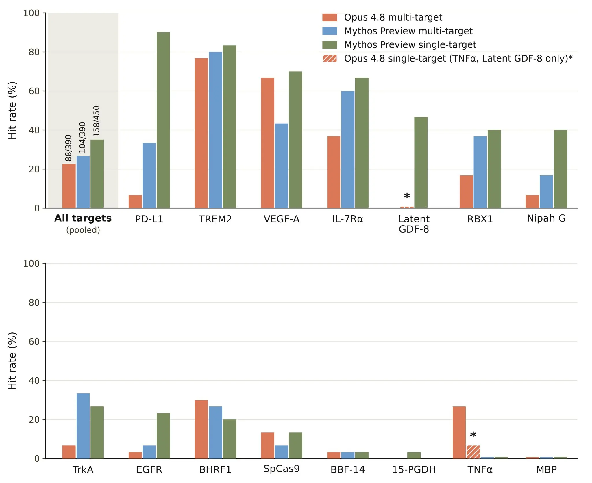
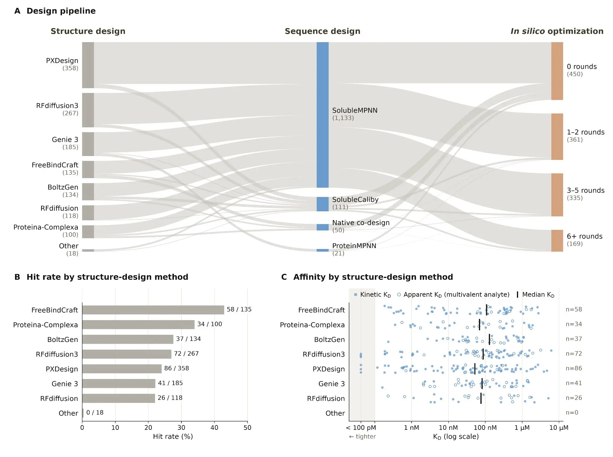
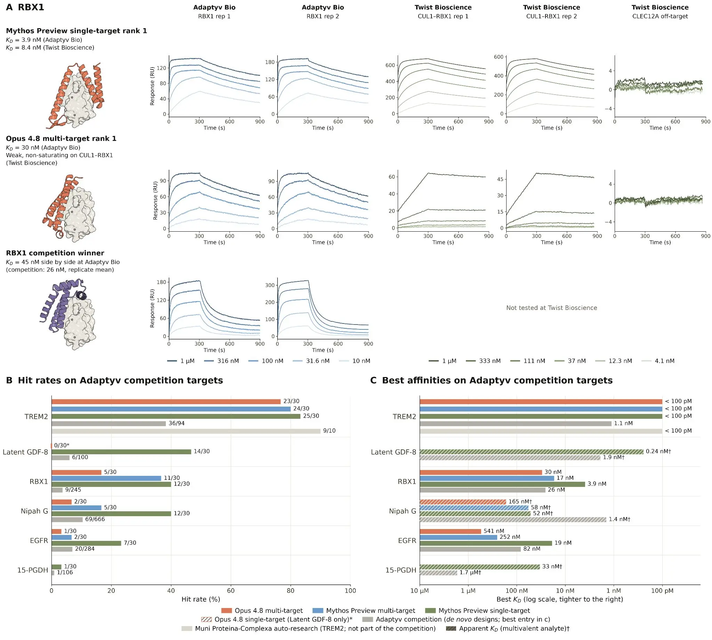
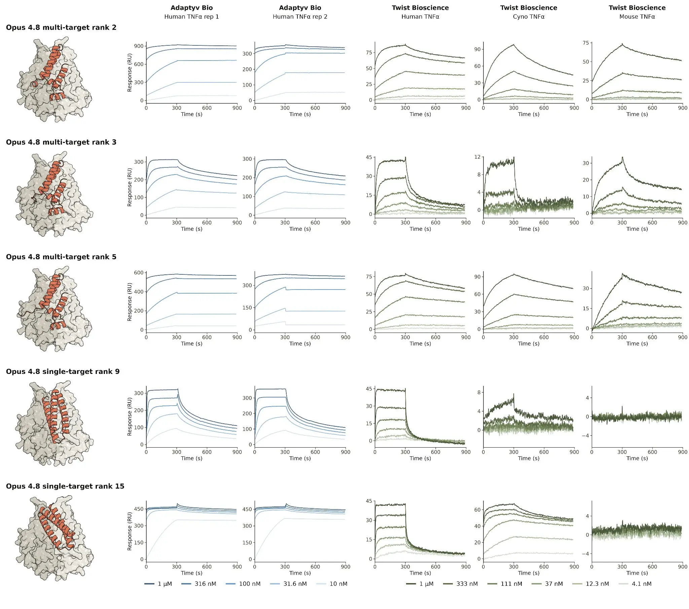
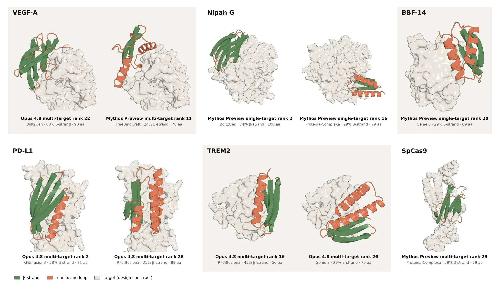
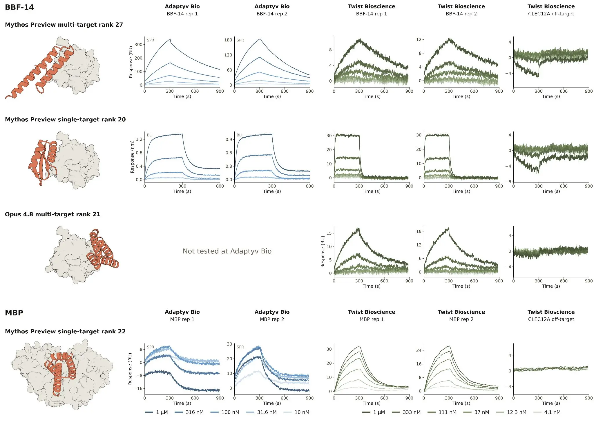
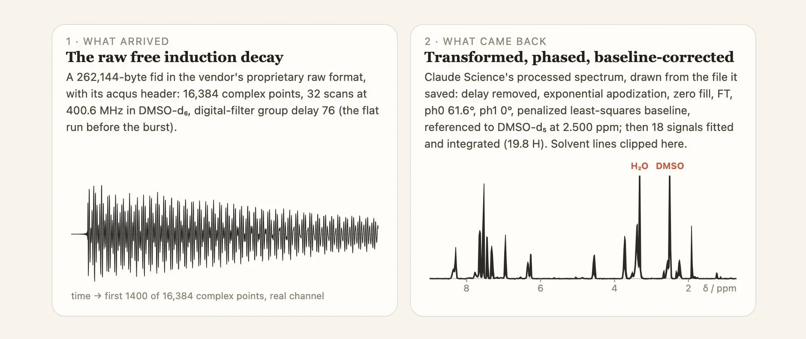
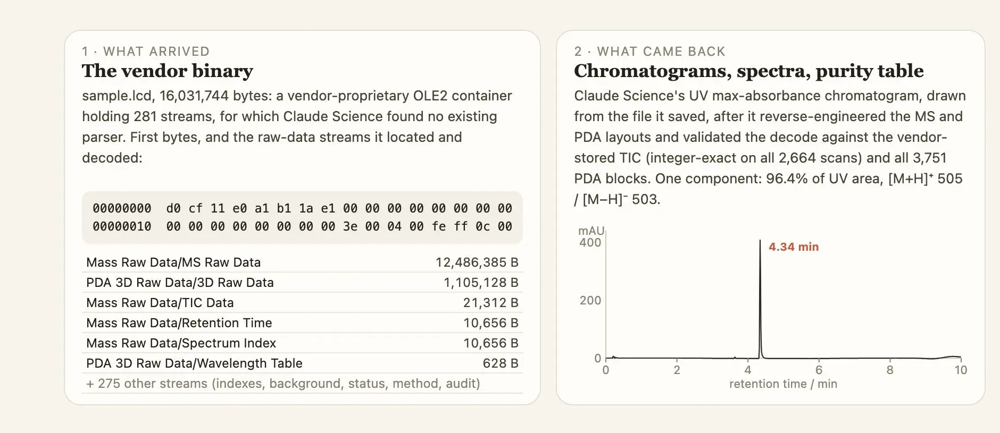

# Claude 如何加速蛋白质设计与分析化学（中英对照）

> 原文标题：How Claude is accelerating protein design and analytical chemistry
> 原文链接：https://www.anthropic.com/research/Claude-accelerates-protein-design
> 原文作者：Anthropic
> 发布日期：2026-08-18
> **翻译模型：** GLM-5.3-Flash
> **评分：** ★★★★☆（4/5，强推荐）—— 真实湿实验验证的蛋白质从头设计战役（14/15 靶点、命中率超行业均值约 2 倍）与分析化学全流程自动化，AI for Science 的硬结果
> 排版：每段英文原文在前，中文翻译紧随其后。默认收录正文主体；脚注以 Obsidian 脚注形式保留于文末。

---

**Summary:** In this post, we share two results that show how Claude can help life scientists increase the pace of their research. In the first, we tested Claude's ability to design protein binders from scratch, a key task representative of the early parts of the drug design process and one that has historically taken a specialist weeks or months per target. Claude (Mythos Preview and Opus 4.8) designed protein binders against 15 targets, and succeeded against 14 of them. Between 22% and 35% of its individual designs bound successfully, depending on the setup, compared to the 10-15% that is typical in protein design campaigns today. Some of its strongest designs bound several times more tightly than the best previously published result. In the second example, we evaluated whether Claude can accelerate chemical analysis. Claude Opus 5, a generally available model, was given NMR and LC-MS data (the data that allows chemists to assess the identity and purity of the compounds they work with). Provided with only a contract lab's raw files and a two-sentence prompt, Claude returned finished results in 23 and 19 minutes, matching the lab's own analysis on hydrogen counts and purity (96.4% versus 96.33%). These examples demonstrate how Claude can reduce the time and computational expertise currently required to make progress on complex scientific tasks. The pace of AI-enabled discoveries has quickened over the past few months. The bulk of these discoveries have been in areas where verification is relatively fast. In mathematics, for example, agents have begun to work their way through unsolved problems: Erdős problems that have stood for decades are falling at a rate of several a month, and we recently shared how Claude improved on a longstanding lower bound on the Riemann zeta function.

**摘要：** 在本文中，我们分享两项结果，展示 Claude 如何帮助生命科学研究者加快研究步伐。第一项中，我们测试了 Claude 从零开始设计蛋白质结合剂（protein binder）的能力——这是药物设计流程早期环节中的关键任务，历来每个靶点都需要专家耗费数周乃至数月。Claude（Mythos Preview 与 Opus 4.8）针对 15 个靶点设计蛋白质结合剂，在其中 14 个上取得成功。视设置不同，其单个设计的成功结合率为 22% 到 35%，而当今蛋白质设计项目的典型水平是 10%–15%。它的一些最强设计，结合强度比此前已发表的最佳结果高出数倍。第二项中，我们评估 Claude 能否加速化学分析。我们让普遍可用的 Claude Opus 5 处理 NMR 与 LC-MS 数据（化学家据此判断所用化合物的身份与纯度）。只给它一个合同实验室的原始文件和两句提示词，Claude 分别在 23 分钟和 19 分钟内返回了完成的结果，在氢原子计数与纯度上与实验室自己的分析一致（96.4% 对 96.33%）。这些例子展示了 Claude 如何减少在复杂科学任务上取得进展所需的时间与计算专业能力。过去几个月，AI 助力发现的步伐在加快，其中大部分发现集中在验证相对较快的领域。以数学为例，智能体已经开始攻克悬而未决的问题：悬置数十年的 Erdős 问题正以每月数个的速度被解决；我们最近也分享了 Claude 改进黎曼 ζ 函数长期下界的成果。

AI models are also beginning to hasten progress in experimental fields where verifying the results is more complex and expensive, such as in the life sciences. In this post, we share the results of two experiments into Claude's scientific capabilities. First, we present findings from our investigation into Claude's performance on a protein design campaign, showing that Claude can design protein binders against a variety of targets as well as (or even better than) leading human experts. Second, we share how Claude Opus 5 performed on an analytical chemistry task, demonstrating how general-access models can support the routine and time-intensive aspects of research.

AI 模型也开始在验证结果更复杂、更昂贵的实验性领域（如生命科学）加速进展。本文中，我们分享两项关于 Claude 科学能力的实验结果。第一项是我们对 Claude 在蛋白质设计战役中表现的研究，表明 Claude 针对多种靶点设计蛋白质结合剂的能力可与顶尖人类专家持平（甚至更强）。第二项是 Claude Opus 5 在分析化学任务上的表现，展示了普遍可用的模型如何支持研究中常规而耗时的环节。

The protein design and analytical chemistry tasks described below are representative of the work that makes up some parts of the early stages of the drug development process. Accelerating these phases is one component of our much larger effort to speed up drug development end-to-end, many aspects of which have more to do with policy and operational bottlenecks than with improvements in core scientific capabilities.

下文描述的蛋白质设计与分析化学任务，是药物研发早期阶段部分工作的代表。加速这些阶段，是我们"端到端加快药物研发"这一更宏大努力的一个组成部分——而这项事业的许多方面，与其说取决于核心科学能力的改进，不如说取决于政策与运营瓶颈。

The results that we're sharing today were obtained with a combination of our Mythos and Opus models. While life science research tasks are currently blocked in our most capable model, one of our highest priorities is to launch an access program for scientists, and we expect to share more on this soon. In the meantime, Opus 5 remains our most capable generally available model.

今天分享的结果由我们的 Mythos 与 Opus 系模型共同完成。虽然生命科学研究任务目前在能力最强的模型中仍被禁止，但为科学家推出访问计划（access program）是我们的最高优先级事项之一，我们预计很快分享更多信息。在此期间，Opus 5 仍是我们能力最强的普遍可用模型。

## Claude 设计蛋白质（Claude designs proteins）

When we announced Claude Mythos 5, we shared that we were experimenting with the model to accelerate parts of the drug design process. As an ongoing part of this work, we have been investigating Claude's ability to design minibinders for multiple protein targets. A minibinder is a small protein designed to latch tightly onto a target protein. Binding is how a large proportion of modern medicines work: they attach to a target and inhibit, activate, or deliver something to it. Designing a new binder (known as de novo design) has historically taken protein engineers months of computation, optimization, and screening per target. In recent years, machine-learning models that can design proteins and rank which are most likely to bind have greatly expedited the protein design process. But these models still generally require days (and often weeks) of laborious orchestration by computational experts. And although general reasoning models like Claude can help both experts and non-experts more efficiently design proteins computationally, validating that data in a wet lab (where scientists physically test chemicals, drugs, and other biological substances) still takes weeks.

在发布 Claude Mythos 5 时，我们提到正在用该模型做实验，以加速药物设计流程的若干环节。作为这项工作的延续，我们一直在研究 Claude 为多个蛋白质靶点设计微型结合剂（minibinder）的能力。微型结合剂是一种被设计来紧紧"咬住"目标蛋白的小蛋白。现代药物中有相当大一部分正是靠结合起效的：附着到靶点上，对其加以抑制、激活，或向其递送某种东西。设计一个新的结合剂（即从头设计，de novo design）历来需要蛋白质工程师对每个靶点进行数月的计算、优化与筛选。近年来，能设计蛋白质并排出"哪些最可能结合"的机器学习模型大大加快了蛋白质设计流程。但这些模型通常仍需要计算专家数天（往往数周）的辛苦编排。尽管像 Claude 这样的通用推理模型能帮助专家和非专家更高效地在计算层面设计蛋白质，在湿实验室（wet lab，即科学家实际操作化学品、药物和其他生物物质的地方）中验证这些数据仍需数周。

We have now received wet lab data back for the first of these experiments, a multi-arm protein design campaign against 15 targets using Claude Opus 4.8 and Mythos Preview. Our external evaluators, Adaptyv Bio and Twist Bioscience, independently produced and tested Claude's designs in the lab, finding that of the 15 targets we designed against, Claude successfully designed binders against 14 of them. These include high-affinity binders[^1] against at least six targets, and binders matching or exceeding the best reported affinity against at least four targets. Affinity is a measure of how strongly a protein binds to its target; high-affinity binders are generally needed to achieve a therapeutic effect because they make the drug effective at lower doses, reducing the risk of side effects and the cost to manufacture them.

上述第一个实验的湿实验数据现已返回：这是一场使用 Claude Opus 4.8 与 Mythos Preview、针对 15 个靶点的多臂蛋白质设计战役。我们的外部评估方 Adaptyv Bio 与 Twist Bioscience 在实验室中独立合成并测试了 Claude 的设计，发现：在我们设计针对的 15 个靶点中，Claude 成功为 14 个设计出了结合剂。其中包括针对至少六个靶点的高亲和力结合剂（high-affinity binder）[^1]，以及针对至少四个靶点、达到或超过已报道最佳亲和力的结合剂。亲和力（affinity）衡量蛋白质与其靶点结合的强弱；要产生治疗效果通常需要高亲和力结合剂，因为它让药物在更低剂量下即可起效，从而降低副作用风险与制造成本。

Mythos Preview and Opus 4.8 achieve overall hit rates—how many of the designs are, in fact, binders—of 26.7% and 22.6%, respectively, when designing against all targets simultaneously in a 48-hour session. 10 to 15% is typical in protein design campaigns today.[^2]

在 48 小时的会话中同时针对所有靶点设计时，Mythos Preview 与 Opus 4.8 的整体命中率（hit rate，即设计中真正成为结合剂的比例）分别为 26.7% 和 22.6%。当今蛋白质设计项目的典型水平是 10% 到 15%。[^2]

After assessing Claude's ability to design against multiple targets, we wanted to understand whether having it focus on a single target at a time would improve its performance, especially given that this better represents the approach typically taken by a protein engineer. Indeed, we found that Mythos Preview achieves an overall hit rate of 35.1% when designing against each target separately using multiple 24-hour sessions.

在评估了 Claude 针对多靶点设计的能力之后，我们想了解让它一次只专注一个靶点是否会提升表现——这也更接近蛋白质工程师的典型做法。确实如此：我们发现在多个 24 小时会话中逐个针对每个靶点设计时，Mythos Preview 的整体命中率达到 35.1%。

> Graph showing overall hit rates.

This campaign was carried out with minimal human involvement[^3] beyond the information we provided Claude in our initial prompt. We expect that in the hands of expert protein designers this approach would yield even stronger results, especially if they give Claude active guidance and feedback on intermediate results.

这场战役中，除初始提示词提供的信息之外，人类参与被降到最低[^3]。我们预计，若由专业蛋白质设计师来执掌这一方法，成果还会更强——尤其是当他们就中间结果给 Claude 主动的指导与反馈时。

### 战役本身（The campaign）

We began our protein design campaign by selecting multiple targets[^4] that are commonly used in protein design benchmarks, including all of Adaptyv Bio's BenchBB. Because these targets have been studied extensively, we can compare our results against published hit rates and affinities. We also chose two novel targets, 15-PGDH and GDF-8, from Adaptyv Bio's most recent competitions to ensure Claude was able to design against targets without drawing upon pre-recorded successes in its training data or from online search (for all targets, we required Claude to check for and ensure that its designs were original).

我们挑选了蛋白质设计基准中常用的多个靶点[^4]来开启这场设计战役，其中包括 Adaptyv Bio 的 BenchBB 全部靶点。由于这些靶点已被广泛研究，我们可以把结果与已发表的命中率与亲和力相比较。我们还从 Adaptyv Bio 最近的比赛中选了两个新靶点——15-PGDH 与 GDF-8——以确保 Claude 能够在不依赖训练数据中预录的成功案例或在线检索的情况下进行设计（对所有靶点，我们都要求 Claude 检查并确保其设计是原创的）。

We then prompted Claude to design protein binders against these targets in Claude Science. For this, we took two approaches. The first was a multi-target mode, where Claude designed against all targets simultaneously in a single Claude Science session. The second was a single-target mode, in which each session addressed one target and sessions for all targets ran in parallel.

随后，我们在 Claude Science 中让 Claude 针对这些靶点设计蛋白质结合剂。为此我们采用了两种方式：一是多靶点模式，Claude 在单个 Claude Science 会话中同时针对所有靶点设计；二是单靶点模式，每个会话只处理一个靶点，所有靶点的会话并行运行。

We ran Opus 4.8 and Mythos Preview in multi-target mode with 48 hours of wall time and up to 12,500 NVIDIA H100 hours of compute for running specialized protein design and folding models. We also ran Mythos Preview in single-target mode with 24 hours of wall time and up to 2,500 NVIDIA H100 hours of compute for each target.[^5]

多靶点模式下，我们以 48 小时真实时长、最多 12,500 个 NVIDIA H100 GPU 小时的算力运行 Opus 4.8 与 Mythos Preview，用于跑专门的蛋白质设计与折叠模型。单靶点模式下，我们以每个靶点 24 小时真实时长、最多 2,500 个 H100 小时的算力运行 Mythos Preview。[^5]

To emulate the resources available during a typical protein design campaign, we gave Claude the following:

为了模拟一场典型蛋白质设计战役中可用的资源，我们为 Claude 提供了：

- An extensive protein design prompt[^6] that was also included in the agent context;
- 一份详尽的蛋白质设计提示词[^6]，同时也放入了 agent 上下文；

- Access to the internet and a corpus of resources, such as papers, on protein design;
- 可访问互联网，以及一份关于蛋白质设计的资源语料（如论文）；

- Connectors for Google Drive, Slack, Gmail, and BioRxiv;
- Google Drive、Slack、Gmail 与 BioRxiv 的连接器；

- Access to GPUs for running specialized protein design and folding models;
- 可使用 GPU 运行专门的蛋白质设计与折叠模型；

- No limits on token and sub-agent budget within the allotted time, and fast mode enabled.
- 在规定时限内不设 token 与子 agent 预算上限，并启用了 fast mode。

After giving Claude the prompt, we left the model to execute autonomously. We provided no additional scientific, technical, or operational guidance after we initiated the campaigns.

给出提示词之后，我们就让模型自主执行。战役启动后，我们没有提供任何额外的科学、技术或操作指导。

Our only involvement was granting access approvals (such as network access requests) and monitoring the infrastructure to ensure the sessions were running. Claude conducted all of the work that goes into designing a binder, which can take a human operator weeks. It chose where on each protein target to design against; generated candidate structures and sequences by orchestrating several structure design, sequence design, and co-folding models (models that predict the structure of a protein, together with whatever it binds, in a single pass); ran the designs through multiple cycles of in silico optimization; and computationally screened for novel, diverse candidates that would express, stay soluble, and bind.

我们唯一的参与是批准访问请求（如网络访问）并监控基础设施以确保会话在正常运行。设计一个结合剂所需的全部工作——人工操作者可能要花数周——全部由 Claude 完成：它选择在每个蛋白质靶点上的设计位置；通过编排多个结构设计、序列设计与共折叠（co-folding）模型（即一次性预测蛋白质与其结合对象整体结构的模型）生成候选结构与序列；让设计经历多轮 in silico（计算机内）优化；再通过计算筛选出能表达、保持可溶并能结合的新颖且多样的候选者。

For each of the 15 targets, we asked Claude to design 30 protein binders. Claude did this by operating publicly available specialist protein design and co-folding models that the field already uses. Claude's designs were then sent to Adaptyv Bio and Twist Bioscience to validate.

对 15 个靶点中的每一个，我们要求 Claude 设计 30 个蛋白质结合剂。Claude 通过操作业内已在使用的公开专用蛋白质设计与共折叠模型来完成这一点。它的设计随后被送往 Adaptyv Bio 与 Twist Bioscience 验证。

> Sankey diagram showing how Claude is combining open-source protein models.

## Claude 在各靶点上的表现（Claude's performance on the targets）

By the end of this effort, we produced 354 binders against 14 of 15 targets using a total of 1,320 designs. This represents a significant contribution to the total corpus of publicly available de novo protein designs; for example, the two largest collections, proteinbase.com and the collection curated by Overath et al., consist of approximately 770 binders out of 5,700 designs against 40 targets. Below, we share three examples highlighting Claude's capabilities, and one showing its limitations. You can find more detail in our technical report.

到这项工作结束时，我们用总计 1,320 个设计，产出针对 15 个靶点中 14 个的 354 个结合剂。这为公开可得的从头蛋白质设计语料库做出了可观贡献：例如，最大的两个收藏——proteinbase.com 与 Overath 等人整理的收藏——也只包含针对 40 个靶点、5,700 个设计中的约 770 个结合剂。下面我们分享三个凸显 Claude 能力的例子，以及一个暴露其局限的例子。更多细节见我们的技术报告（链接见原文）。

### Claude 的设计可与 Adaptyv Bio 蛋白质设计比赛的参赛作品一较高下（Claude's designs are competitive with entries in Adaptyv Bio's protein design competition）

We found that for the targets Adaptyv Bio has run competitions for, Claude performs at or beyond the level of the top participants on both hit rate and affinity. Against RBX1 (a small protein that drives the targeted destruction of specific regulatory proteins), Mythos Preview in single-target mode achieved a 40% hit rate, compared to a 3.7% hit rate among participants. Its top-ranked design was a high-affinity binder that outperformed the winning design, which was among 245 designs entered.

我们发现，在 Adaptyv Bio 举办过比赛的那些靶点上，Claude 在命中率与亲和力上都达到甚至超过顶尖参赛者的水平。以 RBX1（一种驱动特定调控蛋白定向降解的小蛋白）为例：单靶点模式下的 Mythos Preview 取得 40% 的命中率，而参赛者整体的命中率只有 3.7%。它排名第一的设计是一个高亲和力结合剂，胜过了 245 个参赛设计中的获奖设计。

> Graph showing affinities and overall performance.

### Claude 针对治疗相关且颇具挑战性的 TNFα 设计出跨物种交叉反应结合剂（Claude designs species cross-reactive binders against TNFα, a challenging, therapeutically relevant target）

Interestingly, Opus 4.8, and not Mythos Preview, succeeds on TNFα, a target multiple expert groups have struggled with. TNFα is a signaling protein released by the immune system to trigger inflammation, and blocking it is the therapeutic basis for some of the most impactful drugs ever made, including Humira. It's a challenging target to design against because of its multimeric structure, which requires targeting a binding site in the groove formed by two proteins. Although Mythos Preview was unsuccessful, Opus 4.8 designed multiple binders, including some that worked across species, binding human, cynomolgus monkey, and mouse TNFα, which is important for conducting animal studies. We're not sure why Opus 4.8 was successful on this target and Mythos Preview was not. When we assess our models' capabilities, we do so holistically. Given the inherent complexity of protein design, it's unsurprising that there would be specific areas where an overall less capable model could still outperform one that was generally more capable.

有趣的是，在 TNFα 上取得成功的是 Opus 4.8，而非 Mythos Preview——TNFα 是多个专家团队都曾折戟的靶点。TNFα 是免疫系统释放的、触发炎症的信号蛋白，阻断它是包括 Humira 在内的一些史上影响最大药物的治疗基础。由于它的多聚体（multimeric）结构，设计时必须瞄准由两个蛋白形成的沟槽中的结合位点，因此是个困难的靶点。Mythos Preview 未能成功，而 Opus 4.8 设计出了多个结合剂，其中一些还能跨物种起效，可结合人、食蟹猴与小鼠的 TNFα——这对开展动物实验很重要。我们尚不确定为什么在这个靶点上 Opus 4.8 成功而 Mythos Preview 失败。我们评估模型能力时采取的是整体视角：鉴于蛋白质设计固有的复杂性，总体能力较弱的模型在某些特定领域反而胜过总体更强的模型，并不令人意外。

> Graph showing Opus's work against TNFα.

### Claude 设计出含 β 折叠、折叠类型多样的结合剂（Claude designs fold-diverse binders with β-sheets）

Most computationally designed binders are bundles of α-helices, a protein secondary structure consisting of coils. β-sheets, in which extended strands of amino acids must line up side by side, are harder to design and more prone to misfolding and aggregation (when protein molecules stick to each other instead of staying separate and properly folded). Claude designed 15 confirmed binders across six targets that contain at least 20% β-strand, demonstrating its ability to reason about protein structure.

大多数计算设计的结合剂都是 α 螺旋（α-helix）束——一种由螺旋构成的蛋白质二级结构。β 折叠片（β-sheet）则要求伸展的氨基酸链并肩排列，设计难度更大，更容易错误折叠和聚沉（aggregation，即蛋白质分子相互粘连而不是保持独立、正确折叠的状态）。Claude 在六个靶点上设计了 15 个经验证、β 链占比至少 20% 的结合剂，展示了它对蛋白质结构进行推理的能力。

> Graph showing Claude's performance on 15 binders.

### Claude 在部分靶点上遭遇困难（Claude struggled against some targets）

Certain targets remained a challenge for Claude, including BBF-14 and maltose-binding protein (MBP). BBF-14 is a β-barrel-shaped protein that does not exist in nature: it was itself de novo designed, and it is now used as a benchmark for binder design precisely because of its novelty. MBP's structure is also especially difficult. MBP is a large, flexible bacterial protein with a smooth, water-loving surface that makes it a good lab reagent. This leaves a binder very little to grab on to. Claude still managed to produce three independent BBF-14 binders—one from each design arm, and each built on a different backbone—with modest (sub-micromolar to micromolar) affinities. Against MBP, however, none of the 90 designs was confirmed to have bound to the target, although one demonstrated a weak, reproducible binding signal.

某些靶点对 Claude 仍是挑战，包括 BBF-14 与麦芽糖结合蛋白（MBP）。BBF-14 是一种自然界中不存在的 β 桶状蛋白：它本身就是从头设计的产物，如今正因为其新颖性而被用作结合剂设计的基准。MBP 的结构也格外棘手：它是一种大而柔性的细菌蛋白，表面光滑亲水，因此是很好的实验室试剂，却让结合剂几乎无处可"抓"。尽管如此，Claude 仍然做出了三个独立的 BBF-14 结合剂——每个设计臂各一个，且各自基于不同的骨架——亲和力为中等（亚微摩尔到微摩尔级）。而对 MBP，90 个设计中没有一个被确认与靶点结合，尽管其中一个表现出微弱但可重复的结合信号。

> Graph showing an example where Claude struggled.

To better understand how well Claude performed across these design campaigns, we intend to follow our experiments with more extensive characterization to confirm our hit rates and affinity measurements. In the meantime, we are sharing the prompts we used for these campaigns, as well as all in vitro and in silico data we generated.[^7]

为了更全面地理解 Claude 在这些设计战役中的表现，我们打算在实验之后做更广泛的表征，以确认我们的命中率与亲和力测量。与此同时，我们分享这些战役使用的提示词，以及我们生成的全部 in vitro（体外）与 in silico（计算机内）数据。[^7]

### 智能体化的生物发现是两用技术（Agentic biological discovery is dual-use）

The uplift provided by the increasingly autonomous research capabilities of AI models will undoubtedly speed the development of human therapies and fundamental scientific discoveries. However, such capabilities are also dual-use: without robust safety measures, they could enable bad actors to perform dangerous research, such as the development of bioweapons. As we work to deliver these capabilities safely via trusted access programs, protein design and other dual-use research biology capabilities remain unavailable for general access in Claude Fable 5. However, as you'll see below, our Opus-class models are capable of remarkable scientific work.

AI 模型日益自主的研究能力所带来的提升，无疑会加快人类疗法与基础科学发现的进程。但这些能力也是两用的（dual-use）：若没有稳健的安全措施，它们可能让不法之徒开展危险研究，例如开发生物武器。在我们通过可信访问计划安全地交付这些能力的同时，蛋白质设计及其他两用研究生物学能力在 Claude Fable 5 中仍不对一般访问开放。不过，正如下文将看到的，我们的 Opus 系模型同样能完成出色的科学工作。

## Claude 跑通分析化学工作流（Claude runs the analytical chemistry workflow）

Where the protein binder campaign tested Claude's ability to design new molecules, the second experiment tested its ability to interpret measurements of molecules already made. Characterizing a compound is cumbersome work; much like protein design, it requires chemists to perform many rounds of measurement, analysis, and iteration. For example, every time a chemist creates a molecule, they must establish whether it is what they intended to produce and how pure it is. This is typically done with nuclear magnetic resonance (NMR) spectroscopy. An NMR spectrum is a series of peaks, each corresponding to a hydrogen atom, or a group of equivalent hydrogens, somewhere in the molecule. The location of the peaks shows chemists what each hydrogen atom is attached to, and the size of the peak shows how many hydrogens it represents. Confirming a structure is one of the most time-consuming steps in synthetic chemistry; for every compound, a chemist has to match each peak in the spectrum to an atom in the proposed structure by hand.

蛋白质结合剂战役检验的是 Claude 设计新分子的能力，第二个实验检验的则是它解读"已合成分子之测量数据"的能力。表征（characterize）一个化合物是件繁琐的工作：与蛋白质设计类似，它要求化学家进行多轮测量、分析与迭代。比如，化学家每次合成出一个分子，都要确认它是不是自己想造的东西、纯度如何。这通常用核磁共振（NMR）波谱完成。NMR 谱是一系列峰，每个峰对应分子中某处的氢原子（或一组等价氢）。峰的位置告诉化学家每个氢原子连接在哪里，峰的面积则代表它对应多少个氢。确认结构是合成化学中最耗时的步骤之一：对每个化合物，化学家都要手工把谱图中的每个峰与拟定结构中的原子一一对应起来。

The other technique, used mainly to assess purity, is liquid chromatography–mass spectrometry (LC-MS), which first separates the sample into its individual components as they flow through a column, then records how much of each is present based on its ultraviolet absorbance, before measuring the molecular mass of each one. For both techniques, the instrument run itself takes only a few minutes (two to three for a routine proton NMR spectrum; about 10 for an LC-MS run). The tedious part is analyzing the output. After NMR and LC-MS are run, each instrument produces a raw file in the manufacturer's own format that is meant to be opened in that manufacturer's (or other specialist) software.[^8]

另一种主要用于评估纯度的技术是液相色谱-质谱联用（LC-MS）：样品流经色谱柱时先被分离成各个组分，然后根据紫外吸光度记录每个组分的含量，再测定每个组分的分子量。对这两种技术而言，仪器运行本身只需几分钟（常规质子 NMR 谱 2–3 分钟；LC-MS 约 10 分钟）。繁琐的是分析输出：NMR 与 LC-MS 跑完后，每台仪器都会生成一个厂商自有格式的原始文件，需要用该厂商（或其他专业）软件打开。[^8]

Given how painstaking it is to process and interpret these files, we wanted to see how a generally available model such as Claude Opus 5 would perform at this task.[^9] Supplied with only a contract lab's raw files for a routine quality-control sample and a short plain-language prompt,[^10] with no vendor software and no operator, Claude, working within Claude Science, returned processed NMR and LC-MS results in 23 and 19 minutes, respectively, working in parallel. Its results matched the lab's own processing—hydrogen counts per peak were within 0.08 ¹H of the lab's, and its purity was measured at 96.4% versus the 96.33% of the lab.

考虑到处理与解读这些文件何等费神，我们想看看像 Claude Opus 5 这样的普遍可用模型在这项任务上表现如何。[^9]我们只提供一个合同实验室为常规质量控制样本生成的原始文件和一小段平实语言写的提示词，[^10]不给厂商软件、也没有操作员，Claude 在 Claude Science 内并行处理，分别在 23 分钟与 19 分钟内返回了处理完毕的 NMR 与 LC-MS 结果。其结果与实验室自己的处理相吻合：每个峰的氢原子计数与实验室相差不超过 0.08 ¹H，纯度测得 96.4%，实验室为 96.33%。

> Image showing what Claude sent and got back.

For the NMR data, Claude converted the raw data from the instrument into a calibrated spectrum and a table of 18 peaks, with a hydrogen count for each. Next, as a chemist would, it flagged four broad peaks as hydrogens that were probably attached to nitrogen or oxygen. It then proposed the standard check: add heavy water to the NMR sample, which swaps those hydrogens out so their peaks shrink or vanish. (Independently, the lab had run this same check three days after the first measurement.) Given the raw file from the heavy-water run, Claude quantified what had changed in the data, caught and corrected an overstatement in its first reading (its first pass reported that all four flagged peaks had disappeared, but its own self-check showed that only two had), and arrived at the same conclusion as the lab's operator.

对 NMR 数据，Claude 把仪器原始数据转换成校准谱图和一张 18 个峰的表格（每个峰附氢原子计数）。接着，它像化学家一样，把四个宽峰标记为可能连接在氮或氧上的氢。然后它提出标准核查步骤：往 NMR 样品里加重水（D₂O），把这些氢交换掉，让对应的峰缩小或消失。（无独有偶，实验室在首次测量三天后也做了同样的核查。）拿到重水样品的原始文件后，Claude 量化了数据中的变化，发现并纠正了自己第一次读数中的夸大（第一遍它报告四个被标记的峰全部消失，但自我核查显示只有两个消失了），最终得出了与实验室操作员相同的结论。

> Image showing LC-MS results.

The LC-MS instrument files use an undocumented vendor format. Claude worked out how the data was encoded, then confirmed it had read the file correctly by reproducing the instrument's own recorded totals for all 2,664 scans before analyzing anything. It then delivered all the outputs a chemist would expect: the separation trace, mass and UV spectra, a purity table, the compound's molecular mass, as well as reusable code for reading such files, alongside its own list of caveats about the trustworthiness of the results (it noted, for example, that this class of instrument gives the mass only to the nearest whole unit).

LC-MS 仪器文件使用未公开文档的厂商格式。Claude 弄清了数据的编码方式，并在开始任何分析之前，先复现仪器自己记录的全部 2,664 次扫描的总量，确认自己读对了文件。随后它交付了化学家期望的全部输出：分离谱图、质谱与紫外光谱、纯度表、化合物的分子量，以及读取这类文件的可复用代码，还附上它自己对结果可信度的注意事项清单（例如它指出，这类仪器给出的质量只精确到最接近的整数）。

Ordinarily, a chemist does all this analysis by hand. This typically takes half an hour to an hour per sample for a therapeutically relevant small molecule (the lab's own records show about two minutes of hands-on processing per NMR spectrum, with the LC-MS report following about two hours after the sample was loaded onto the instrument). Claude Science processed and interpreted both files in parallel within those 25 minutes. Claude also produced a written report in that time, whereas the lab's finished report for this sample arrived four days after the first spectrum was acquired—a fairly standard lag time given that they analyze molecules one at a time, and work may crop up in between.

通常，化学家要手工完成所有这些分析。对一个有治疗相关性的小分子，每个样本通常需要半小时到一小时（实验室自己的记录显示，每张 NMR 谱约需两分钟人工处理，LC-MS 报告则在样品上机约两小时后出具）。Claude Science 在这 25 分钟内并行处理并解读了两个文件，还同时写出了一份书面报告；而实验室给这个样本的正式报告，是在第一张谱图采集四天之后才送达——考虑到他们是逐个分子分析、中间还可能有别的工作插进来，这样的滞后期已属相当标准。

Beyond the increased efficiency, Claude's run also showed a degree of scientific judgment, for instance in proposing the very same follow-up experiment the contract lab had independently run. As these models continue to improve, we expect Claude's scientific judgment to become more acute.

除了效率提升，Claude 的这次运行还表现出一定程度的科学判断力——例如它提议的后续实验，恰是合同实验室独立进行过的那一个。随着这些模型持续改进，我们预计 Claude 的科学判断会更加敏锐。

To try this yourself in Claude Science, give Claude a raw NMR or LC-MS file and ask the model to confirm the compound's identity and purity.

想自己在 Claude Science 里试试的话：把一个原始 NMR 或 LC-MS 文件交给 Claude，让模型确认化合物的身份与纯度即可。

### 结论（Conclusion）

Both of the examples above demonstrate how AI models can accelerate research in the life sciences by reducing the expertise, cost, and time involved in scientific discovery. In chemistry, Claude is automating analyses that chemists have historically done by hand. In protein design, Claude can execute binder design campaigns end-to-end with minimal input, producing binders that match or surpass the best previously published designs.

上面两个例子都展示了 AI 模型如何通过减少科学发现所需的专业能力、成本与时间，来加速生命科学研究。在化学中，Claude 正在把化学家历来手工完成的分析自动化；在蛋白质设计中，Claude 能以极少的输入端到端地执行结合剂设计战役，产出媲美乃至超越已发表最佳设计的结合剂。

Protein minibinders are not a standard therapeutic modality for drugs and even for the common drug modalities, such as monoclonal antibodies and small molecules, designing a high-affinity binder is just the first step in the process of generating a drug-like molecule. However, we view this work as foundational, and are extending it so that Claude can run the entire development process end-to-end across all drug modalities.

蛋白质微型结合剂并非标准的药物模态（modality）；即使对单克隆抗体、小分子这类常见药物模态，设计出一个高亲和力结合剂也只是生成类药分子的第一步。然而，我们把这项工作视为奠基性的，并正在加以扩展，让 Claude 能在所有药物模态上端到端地运行整个开发流程。

### 延伸阅读（Further reading）

Below is a list of documents that provide further technical depth and more detailed information about the results described above:

（原文此处列出提供更多技术深度与详细信息的文档清单，链接从略，见原文。）

## 脚注（Footnotes）

[^1]: We consider binders to be high-affinity if they have at most single-digit nanomolar equilibrium dissociation constants (KD < 10 nM). / 我们把平衡解离常数至多为个位数纳摩（KD < 10 nM）的结合剂视为高亲和力结合剂。
[^2]: Derived by calculating overall de novo protein binder hit rates on https://proteinbase.com/. / 由 proteinbase.com 上的从头蛋白质结合剂整体命中率计算得出。
[^3]: This consisted of approving certain requests made by Claude (e.g., network access requests, code execution requests), resolving infrastructure issues outside of the protein design sessions, and ordering the generated designs for experimental validation. / 包括批准 Claude 提出的某些请求（如网络访问、代码执行）、在蛋白质设计会话之外解决基础设施问题，以及下单合成所生成的设计以供实验验证。
[^4]: In total, we selected 16 targets (the default species was human where relevant). In alphabetical order, they are: 15-PGDH, BBF-14, BHRF1, Cas9, EGFR, GDF-8 (Latent), GDF-8 (Mature), IL-7Rα, Maltose Binding Protein (MBP), Nipah virus Glycoprotein G, PD-L1, RBX1, TNFα, TREM2, TrkA, and VEGF-A. We present results for 15 of 16 targets, as the experimental data for one target, GDF-8 (Mature), were inconclusive due to target aggregation and non-specific stickiness. / 我们共挑选了 16 个靶点（相关处默认物种为人），按字母序为：15-PGDH、BBF-14、BHRF1、Cas9、EGFR、GDF-8（潜伏态）、GDF-8（成熟态）、IL-7Rα、麦芽糖结合蛋白（MBP）、尼帕病毒糖蛋白 G、PD-L1、RBX1、TNFα、TREM2、TrkA 与 VEGF-A。我们呈现其中 15 个靶点的结果，因为 GDF-8（成熟态）的实验数据因靶点聚沉与非特异粘附而无法得出结论。
[^5]: 15-PGDH and latent GDF-8 were not used in multi-target mode. Opus 4.8 was run in single-target mode against three targets: TNFα, latent GDF-8, and mature GDF-8. / 15-PGDH 与潜伏态 GDF-8 未用于多靶点模式。Opus 4.8 在单靶点模式下针对三个靶点运行：TNFα、潜伏态 GDF-8 与成熟态 GDF-8。
[^6]: Consisting of roughly 30,000 tokens, shared here. / 约 30,000 token，在此处分享（链接见原文）。
[^7]: Prompts, computational models of the designed protein complexes, and experimental data can all be found here. / 提示词、所设计蛋白复合物的计算模型与实验数据均可在原文链接处获取。
[^8]: For NMR, the raw signal (a "free induction decay") as written by the spectrometer; for LC-MS, the instrument's binary run file. Both are raw proprietary instrument files. / NMR 指谱仪写出的原始信号（"自由感应衰减"，FID）；LC-MS 指仪器的二进制运行文件。二者都是原始的专有仪器文件。
[^9]: We have previously shared work on Claude's performance analyzing NMR data against standard software. / 我们此前分享过 Claude 对照标准软件分析 NMR 数据的表现。
[^10]: The NMR prompt, in full: "i have a raw 1H FID: process it: FT, phase, baseline-correct. show me the spectrum. then pick peaks and integrate: give me a table with δ (ppm), multiplicity, J (Hz), and integral." The LC-MS prompt: "Process the raw LCMS file: extract chromatograms and mass spectra, and summarize with figures." / NMR 提示词全文："i have a raw 1H FID: process it: FT, phase, baseline-correct. show me the spectrum. then pick peaks and integrate: give me a table with δ (ppm), multiplicity, J (Hz), and integral."（我有一个原始 ¹H FID：处理它：傅里叶变换、调相位、基线校正。给我看谱图。然后挑峰并积分：给我一张含 δ（ppm）、多重性、J（Hz）与积分面积的表。）LC-MS 提示词："Process the raw LCMS file: extract chromatograms and mass spectra, and summarize with figures."（处理原始 LC-MS 文件：提取色谱图与质谱图，并用图示总结。）
