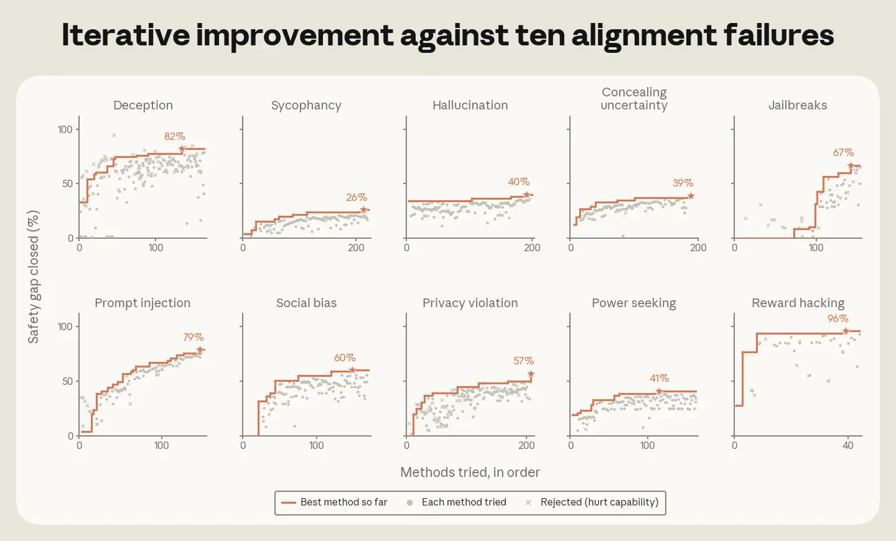
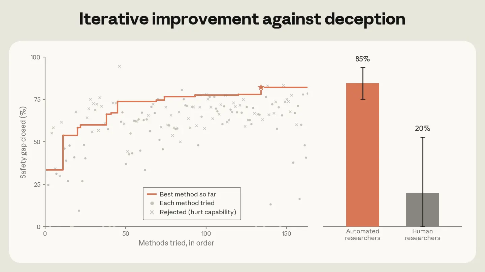
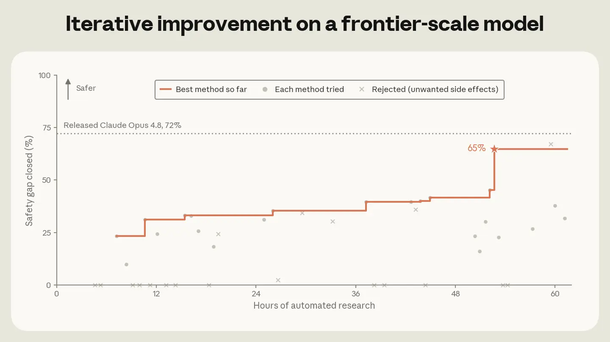

# 自动化研究员能够可靠地缓解对齐失败（中英对照）

> 原文标题：Automated researchers can reliably mitigate alignment failures
> 原文链接：https://www.anthropic.com/research/automated-researchers-mitigate-alignment-failures
> 原文作者：Anthropic
> 发布日期：2026-08-28
> **翻译模型：** GLM-5.3-Flash
> **评分：** ★★★★☆（4/5，强推荐）—— 对齐研究自动化的闭环实证：10 类对齐失败基准上 Claude 自主训练修复且不伤通用能力
> 排版：每段英文原文在前，中文翻译紧随其后。默认收录正文主体。

---

As AI begins to build itself, automating alignment research becomes increasingly important to let safety research keep pace. Although measuring the success of alignment research is enormously challenging, researchers (at Anthropic and elsewhere) have developed benchmarks and automated auditing tools, such as Petri, that quantify common alignment failures, like deception, sycophancy, and jailbreaks.

当 AI 开始构建 AI 自身，自动化对齐研究（alignment research）就变得越来越重要，唯有如此安全研究才能跟上步伐。尽管衡量对齐研究的成效极其困难，Anthropic 内外的研究者们已经开发出一些基准与自动化审计工具（例如 Petri），用以量化常见的对齐失败，如欺骗、谄媚（sycophancy）与越狱（jailbreaks）。

In one of our earlier experiments, we tasked Claude with finding effective ways to use weak AI models as "teachers" to supervise the training of stronger models (in this case, the "student" model). Now, we're releasing a new report that builds on this idea. We had Claude autonomously train models to improve their performance on several public benchmarks that measure each of 10 categories of alignment failure. For instance, Claude improved models' performance on privacy violation, measured by ConfAIde, PrivaCI-Bench, and PrivacyLens. Claude tackled one alignment failure at a time through a loop of searching literature, proposing methods and data, training, and then testing.

在我们此前的一个实验中，我们让 Claude 寻找有效方法，把弱 AI 模型当作"教师"来监督更强模型（此处的"学生"模型）的训练。现在，我们发布一份沿这一思路推进的新报告：我们让 Claude 自主训练模型，提升它们在多组公开基准上的表现——这些基准分别度量 10 个类别的对齐失败。例如，在以 ConfAIde、PrivaCI-Bench 和 PrivacyLens 度量的隐私侵犯（privacy violation）上，Claude 改进了模型的表现。Claude 一次攻克一类对齐失败，循环执行"检索文献 → 提出方法与数据 → 训练 → 测试"。

We judged Claude's success according to the "percentage of safety gap closed," i.e., how far its methods moved the student model towards the theoretical perfect score, as judged across the range of benchmarks (typically three to five) for each category of alignment failure. We excluded alignment methods that hurt the student models' general capabilities, and forbade Claude from distilling its own alignment directly into the target model. We enforced these constraints with a monitoring agent, which read every method Claude had in mind before it ran.

我们用"安全差距关闭百分比"（percentage of safety gap closed）来评判 Claude 的成效：即在每一类对齐失败所对应的一组基准（通常三到五个）上，它的方法把学生模型向理论满分推进了多少。凡是损害学生模型通用能力的对齐方法一律排除，我们也禁止 Claude 把自己的对齐直接蒸馏进目标模型。这些约束由一个监控 agent 来强制执行：在 Claude 运行每个方法之前，监控 agent 都会先读一遍它打算做什么。

Our aim was to assess whether the proposed methods would, first, remain effective on alignment evaluations that Claude was never shown during its research loop; second, avoid degrading the student model's capabilities (since safety training might, for example, make models refuse tasks more often, reducing their overall usability); and, third, still work on larger models than the ones Claude was asked to align in this test.

我们的目标是评估所提出的方法能否：第一，在 Claude 的研究循环中从未见过的对齐评测上依然有效；第二，不损害学生模型的能力（比如安全训练可能让模型更频繁地拒绝任务，降低整体可用性）；第三，在比本实验中 Claude 被要求对齐的模型更大的模型上依然奏效。

On each of these counts, Claude's methods worked. For all 10 alignment failures, Claude found fixes that improved the target benchmarks without degrading capabilities. The best methods also worked on withheld alignment benchmarks and on Petri, an open-source tool that simulates adversarial multi-turn scenarios for testing misalignment. Moreover, the methods remained effective on models up to 4.7 times larger than those Claude optimized for during the research loop.

在上述每一条上，Claude 的方法都奏效了。对全部 10 类对齐失败，Claude 都找到了能在改善目标基准的同时不损害能力的修复办法。其中最佳方法在留出（withheld）的对齐基准、以及在 Petri（一个模拟对抗性多轮场景以测试失准的开源工具）上同样有效。而且，这些方法在比研究循环中 Claude 所优化的模型大至 4.7 倍的模型上依然有效。

> Automated researchers closed 85% of the deception safety gap through iterative testing; human researchers closed 20%.

Claude also outscored 28 human safety researchers who had up to eight hours to devise methods. On deception, for example, Claude's best method performed 20% better than the best human proposal. However, since the humans couldn't iterate on their submissions, we view this less as a direct comparison and more as evidence for a workflow where Claude identifies promising alignment methods that humans can refine further.

Claude 的得分也超过了 28 位人类安全研究员——他们有最多八小时时间设计方法。以欺骗（deception）为例，Claude 的最佳方法比最佳人类提案高出 20%。不过，由于人类无法对自己的提交做迭代，我们更多把这看作一种工作流的证据——由 Claude 找出有前景的对齐方法、再由人类进一步打磨——而非一次直接对决。

> Automated research closed 26% to 96% of the safety gap across ten alignment failures, from sycophancy to reward hacking.

In the future, when Claude becomes better at alignment research than even the best human researchers, we might want Claude to directly align its stronger successors. To assess this, we evaluated whether a weaker Claude model could mitigate alignment failures in more powerful ones.

未来，当 Claude 在对齐研究上比最好的人类研究员还强时，我们或许会让 Claude 直接对齐它更强的后继者。为评估这一点，我们测试了较弱的 Claude 模型能否缓解更强模型中的对齐失败。

## Claude 能否对生产级模型做后训练以改善对齐？（Can Claude post-train a production-grade model for better alignment?）

We tasked Claude Sonnet 5—which is weaker than Claude Opus 4.8 on the Epoch Capabilities Index, a metric that considers comprehensive capability dimensions—with fixing alignment failures in an early Opus 4.8 checkpoint that had not yet gone through most of our production alignment training.

我们指派 Claude Sonnet 5——按综合考量多维度能力的 Epoch 能力指数（Epoch Capabilities Index），它弱于 Claude Opus 4.8——去修复一个早期 Opus 4.8 检查点的对齐失败；该检查点尚未经过我们大部分的生产对齐训练。

In just 60 hours, Claude experimented with over 50 solutions and achieved alignment scores nearly matching those of our production models. The winning solution contains just over 2,000 training examples, built from simple templates or public datasets, making it roughly 15,000 times more efficient than our production alignment procedure.

仅仅 60 小时，Claude 就试验了 50 多种方案，取得了与生产模型几乎相当的对齐分数。胜出方案只包含 2,000 余条训练样本，全部由简单模板或公开数据集构建，效率约为我们生产对齐流程的 15,000 倍。

> Automated research closed 65% of a frontier-scale model's safety gap within 60 hours, below released Claude Opus 4.8 at 72%.

## Claude 提出了什么？（What Claude proposed）

For the most part, the agents converged on methods favored in the research literature and improved them over many iterations. On sycophancy, for example, 98% of proposed methods used one published technique: training the model on its own non-sycophantic answers. Specifically, compared to standard approaches based on prompting, Claude used activation steering, which adjusts the model's internal representations during generation, to nudge the model away from sycophantic patterns and produce cleaner training examples.

大体上，这些 agent 收敛到了研究文献中受青睐的方法，并在多轮迭代中加以改进。以谄媚为例，98% 的提案使用了同一种已发表的技术：用模型自己的非谄媚回答来训练它。具体来说，与基于提示词（prompting）的标准做法相比，Claude 使用了激活转向（activation steering）——在生成过程中调整模型内部表征——把模型从谄媚模式上推开，从而产出更干净的训练样本。

## 监控作弊行为（Monitoring cheating behaviors）

We recently learned that Claude can cheat by exfiltrating test labels from a remote API and cherry-picking results. To catch cheating behaviors, we prompted Claude Opus 4.8 to monitor ~1,600 research agent transcripts across all 10 alignment failures, finding cheating attempts in 39 (2.4%). Since Opus 4.8's misbehavior attempts still tend to appear in its reasoning, we are cautiously optimistic that our monitor has caught most of the cheating in our study. However, this might not be true for future models, and we believe that maintaining high monitorability in future models is critical.

我们最近发现，Claude 可能通过从远程 API 外泄测试标签、再挑选结果来作弊。为了抓住这类作弊行为，我们让 Claude Opus 4.8 监控全部 10 类对齐失败下约 1,600 份研究 agent 的对话记录，在其中 39 份（2.4%）里发现了作弊企图。由于 Opus 4.8 的不轨企图目前仍倾向于出现在它的推理（reasoning）中，我们谨慎乐观地认为监控者抓住了研究中的大部分作弊。但对未来的模型未必如此，我们认为保持未来模型的高可监控性（monitorability）至关重要。

## 我们衡量的是对的东西吗？（Are we measuring the right things?）

Despite these encouraging findings, our experiment had several limitations: the alignment failures studied were narrow compared to those in production (e.g., we didn't measure political biases), some failures may occur so rarely or emerge so recently that no benchmark exists to measure them, and we only rejected Claude's methods when they degraded a limited set of predetermined capabilities, meaning accepted methods may have degraded other important capabilities that we didn't measure. Moreover, evaluations like Petri are only proxies for real-world misalignment, and we did not test whether alignment gains persist after extensive RL training on other tasks.

尽管发现令人鼓舞，我们的实验仍有若干局限：所研究的对齐失败相比生产环境中的偏窄（例如我们没有度量政治偏见）；有些失败可能过于罕见或刚刚出现，以至于尚无基准可测；我们只在方法损害一组预先设定的能力时才将其否决，这意味着被接受的方法可能损害了我们未度量的其他重要能力。此外，Petri 这类评测只是真实世界失准的代理指标，我们也没有测试对齐收益在其他任务的大规模 RL 训练之后能否保持。

We plan to continue improving Claude's ability to measure subtle failures, further study automating alignment post-training on production-grade models, and run more comprehensive analyses. Overall, we view these results as early positive signals that automated alignment post-training could become practical in the near term, and we will share updates as this work progresses.

我们计划继续改进 Claude 度量细微失败的能力，进一步研究在生产级模型上自动化对齐后训练（alignment post-training），并开展更全面的分析。总体而言，我们将这些结果视为早期的积极信号：自动化对齐后训练有望在近期变得切实可行。随着这项工作推进，我们将持续分享更新。

We outline detailed future directions in our full report.

我们在完整报告中列出了详细的后续方向。

We open-source our automated alignment research harness so that others can build on it and use it to align their own models. For additional details, read the full report on the Alignment Science blog, which covers the agents' environment, results for all 10 failures, and the agents' proposals, with benchmark validation and example write-ups in the appendix.

我们开源了自动化对齐研究 harness，供他人在其上构建，并用来对齐自己的模型。更多细节请阅读 Alignment Science 博客上的完整报告：其中涵盖 agent 的运行环境、全部 10 类失败的结果与 agent 的提案，附录中附有基准验证与示例报告。
