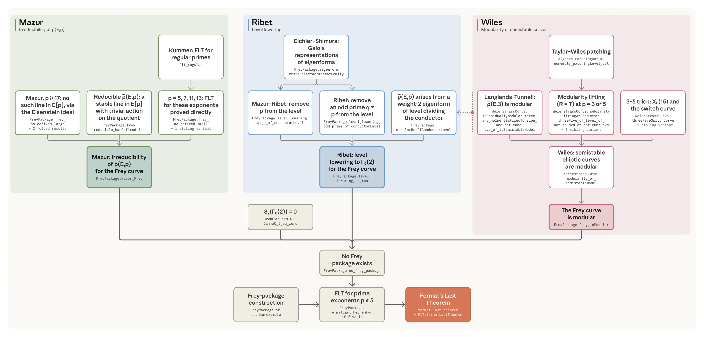

# 形式化费马大定理（中英对照）

> 原文标题：Formalizing Fermat's Last Theorem
> 原文链接：https://www.anthropic.com/research/formalizing-fermats-last-theorem
> 原文作者：Anthropic（Tianyi Peng 团队等）
> 发布日期：2026-09-04
> **翻译模型：** GLM-5.3-Flash
> **评分：** ★★★★★（5/5，必读）—— 费马大定理首个完整机器校验证明：Claude 在 11 天内基本自主写下 1300 万行 Lean、证明 29,500 个中间定理，AI 数学形式的里程碑事件
> 排版：每段英文原文在前，中文翻译紧随其后。默认收录正文主体。原页「形式化时间线」动画未收录，仅保留图注。

---

We are sharing the first complete computer-checked proof of Fermat's Last Theorem. Claude worked largely autonomously over 11 days to write the proof in the Lean programming language. Below, we describe how the formalization was done and share some thoughts about what this work could mean for research mathematics. Around 1637, Pierre de Fermat jotted down a claim in the margin of his copy of Diophantus's Arithmetica that would become one of the most famous mathematical conjectures of all time: no positive integers a, b, c satisfy aⁿ + bⁿ = cⁿ for any n > 2. Fermat's Last Theorem (FLT), as the conjecture became known, turned out to be incredibly difficult to prove. The first proof, from Sir Andrew Wiles in 1995, ran to 129 pages and required months of painstaking work to verify.

我们在此分享费马大定理（Fermat's Last Theorem）首个完整的计算机校验证明。Claude 在 11 天内基本自主地用 Lean 编程语言写出了这个证明。下文我们将描述这次形式化是如何完成的，并分享一些对「这项工作对研究数学可能意味着什么」的思考。大约在 1637 年，皮埃尔·德·费马在他那本丢番图《算术》的页边写下了一个论断——它后来成为数学史上最著名的猜想之一：对任意 n > 2，不存在满足 aⁿ + bⁿ = cⁿ 的正整数 a、b、c。这个后来被称为费马大定理（FLT）的猜想，被证明难到了超乎想象的程度。第一个证明由安德鲁·怀尔斯爵士于 1995 年给出，长达 129 页，验证它需要数月呕心沥血的工作。

A decade later, Dutch computer scientist Jan Bergstra proposed "formalizing" Wiles's proof: converting the mathematical reasoning into a form computers can check automatically. Since then, mathematicians have been developing the methods needed to encode such a complex proof, including a multi-year community effort kicked off in 2024 by Kevin Buzzard at Imperial College London to complete the formalization using the Lean proof assistant.

十年后，荷兰计算机科学家 Jan Bergstra 提议对怀尔斯的证明进行「形式化」（formalizing）：把数学推理转化为计算机可以自动检查的形式。从那时起，数学家们一直在开发编码如此复杂证明所需的方法，其中包括一项多年期社区协作——由伦敦帝国理工学院的 Kevin Buzzard 于 2024 年启动、旨在用 Lean 证明助手完成这一形式化。

Recently, Tianyi Peng, an Anthropic researcher whose group at Columbia University builds tools for AI formalization, set out to test whether Claude could make progress on formalizing FLT.[^1] The result went further than he expected. In 11 days, working largely autonomously, Claude produced the first end-to-end, computer-checked proof of FLT. Along the way, it wrote 13 million lines of Lean and proved 29,500 intermediate theorems.

最近，Anthropic 研究员、其在哥伦比亚大学的团队致力于构建 AI 形式化工具的田渊（Tianyi Peng），着手测试 Claude 能否在 FLT 的形式化上取得进展。[^1] 结果超出了他的预期：11 天内，Claude 在基本自主的工作状态下产出了首个端到端、经计算机校验的 FLT 证明。在此过程中，它写下了 1,300 万行 Lean 代码，证明了 29,500 个中间定理。

We shared the resulting proof with Kevin Buzzard, who said:

我们把得到的证明分享给了 Kevin Buzzard，他说：

> This extraordinary autoformalization achievement, which Anthropic researchers say only took 11 days, proves Fermat's Last Theorem with no assumptions other than the axioms of mathematics. Along the way we see autoformalization of algebra, harmonic analysis, geometry and number theory, and we learn that AI autoformalization artefacts are now robust enough to be built upon; the proof is multi-layered.

> 这项非凡的自动形式化（autoformalization）成就——Anthropic 研究者称只花了 11 天——在除数学公理外不引入任何假设的情况下证明了费马大定理。沿途我们看到代数、调和分析、几何与数论的自动形式化；我们也了解到，AI 自动形式化的产物如今已足够稳健、可以在其上继续构建——这个证明是多层的。

Automatically formalizing a proof as complex as FLT is a significant step towards a future in which all of mathematics can be readily checked. As AI produces ever more proofs, the ability to easily formalize work can lighten the burden of evaluating new results (a process that can take years). We are hopeful that it will become easier, not harder, to trust the body of knowledge upon which mathematics is built.

自动形式化像 FLT 这样复杂的证明，是迈向「全部数学都可随手校验」未来的重要一步。随着 AI 产出越来越多的证明，轻松形式化成果的能力可以减轻评估新结果（一个可能耗时数年的过程）的负担。我们抱有希望：信任数学赖以建立的知识体系，会变得更容易而非更难。

## 验证数学证明的难题（The challenge of verifying mathematical proofs）

Unlike recent AI-driven work on the Riemann hypothesis, which produced novel mathematics, what's novel here is the verification—checking a mathematical proof as one would check a mathematical computation with a calculator. Proving math theorems requires assembling complex logical chains, and if a single link is broken, everything that follows it might turn out to be false. Understanding a novel result deeply enough to be confident in its correctness can take months, or even years, of work.

与近期 AI 驱动的黎曼猜想工作（后者产出了新数学）不同，这里的新颖之处在于验证（verification）——像用计算器核对一个数学计算那样核对一个数学证明。证明数学定理需要组装复杂的逻辑链，只要有一环断裂，其后的一切都可能被推翻。要把一个新结果理解到「足以确信其正确」的深度，可能需要数月甚至数年的工作。

Fermat's Last Theorem is an illustrative example.[^2] Fermat wrote down the theorem's statement in the margin of a book, alongside a tantalizing note:

费马大定理就是一个生动的例子。[^2] 费马把定理的陈述写在一本书的页边，旁边附了一句引人遐想的批注：

> I have discovered a truly marvelous proof of this, which this margin is too narrow to contain.

> 我发现了一个绝妙的证明，可惜这里的页边太窄，写不下。

For over 350 years, generations of mathematicians searched for a proof of FLT, marvelous or otherwise. In 1908, a prize of 100,000 German gold marks (the equivalent of 1–2 million dollars today) was announced for anyone who could produce a correct proof, and 621 incorrect attempts were produced in the first year alone.

三百五十多年来，一代代数学家寻找着 FLT 的证明——绝妙的也好、不绝妙的也罢。1908 年，一项面向任何能给出正确证明者的奖金公布：10 万德国金马克（约合今天的 100 万至 200 万美元）；仅第一年就收到了 621 份错误证明。

In June 1993, Wiles presented what he believed to be the first correct proof of FLT in a three-day series of lectures. Two months into an intensive verification effort by several mathematicians, a reviewer asked Wiles a question that exposed a critical gap. Wiles spent a year trying to fix it, first alone and then with his former student Richard Taylor. He was on the brink of abandoning the project when he finally realized an approach he'd discarded earlier could fix the proof. Wiles published the first correct proof of FLT in May 1995; it relied on modern mathematical techniques that were far beyond what would have been known to Fermat in 1637. Since an elementary proof has not been found after centuries of trying, the mathematical community now believes Fermat's own original "marvelous proof" was incorrect.

1993 年 6 月，怀尔斯在为期三天的系列讲座中展示了他认为是 FLT 第一个正确证明的东西。几位数学家高强度验证进行到第二个月，一位审阅者向怀尔斯提出了一个问题，暴露出一个关键缺口。怀尔斯花了一年试图修复——先独自、后与其昔日学生 Richard Taylor 合作——就在几乎要放弃整个项目之际，他终于意识到自己早先舍弃的一条思路可以补上这个证明。1995 年 5 月，怀尔斯发表了 FLT 的第一个正确证明；它依赖的现代数学技术远远超出 1637 年的费马所能了解的范围。数百年来初等证明始终无人找到，数学界如今相信，费马当年那个「绝妙的证明」本身就是错的。

## 形式化费马大定理（Formalizing Fermat's Last Theorem）

One way to check a proof's correctness is to ask a computer to do it. Proof assistants like Lean verify the logic of a proof algorithmically, demonstrating its correctness beyond a doubt. The difficult part for humans is rewriting the proof so Lean can understand it. While a proof written for human readers will skip many obvious steps, Lean needs to see every step, no matter how trivial. Human proofs also build on centuries of published work, while a formalization starts from the tiny fraction of math that's been formalized already.

核对证明正确性的一种办法是让计算机来做。像 Lean 这样的证明助手以算法方式验证证明的逻辑，其正确性无可置疑。人类的难点在于把证明改写成 Lean 能理解的形式：写给人看的证明会跳过许多「显然」的步骤，而 Lean 需要看到每一步，无论多么平凡。人类证明还建立在数百年已发表工作的基础上，而形式化只能从已被形式化的那一小部分数学出发。

For FLT, the formalization process was expected to take years. Just the blueprint the mathematical community has been using to describe the initial phase of the project runs to 86 pages.

对 FLT 而言，形式化进程原本预计要花数年——光是数学界用来描述项目初期阶段的蓝图就有 86 页。

Claude completed the proof in 11 days, producing computer-verifiable proofs of 30,300 theorems along the way (using 29,500 in the final proof). Dozens of Claude agents collaborated to define concepts, prove intermediate theorems, and use those theorems to prove ever harder statements. At 13 million lines of Lean code, Claude's proof is over 5x the size of Mathlib, the principal community library of mathematical proofs this theorem builds on.[^3]

Claude 用 11 天完成了证明，沿途产出 30,300 个定理的机器可验证证明（最终证明使用了其中 29,500 个）。数十个 Claude agent 协作定义概念、证明中间定理、再用这些定理去证明更难的命题。这份证明有 1,300 万行 Lean 代码，是 Mathlib——本定理所依托的主要社区数学证明库——规模的 5 倍以上。[^3]

> Time progression of FLT formalization.（原页为动画，未收录）
>
> FLT 形式化的时间推进图。

Claude's proof follows a simplified version of Wiles's proof from Darmon, Diamond, and Taylor. Mathematical input from humans was limited to occasional high-level instructions from Tianyi: "Jacobian as a scheme sounds high priority," "push [the] Mazur [theorem] to be done soon." You can find excerpts of Claude's thinking here.

Claude 的证明遵循 Darmon、Diamond 与 Taylor 给出的怀尔斯证明简化版。人类提供的数学输入仅限于田渊偶尔的高层指示：「把 Jacobian 当作概形（scheme）听起来优先级很高」「尽快推进 Mazur 定理」。Claude 的思考摘录可在此处查看。

```
"THE FLT root reads Proved on the site. Historic moment (modulo re-check)."

"!!! The FLT ROOT 62eb32c0 reads PROVED. R = T closed and cascaded to the root. This is the campaign's goal: e2e FLT on prove2me."

"🏁🏁🏁The FLT root reads PROVED on prove2me at 02:00:57Z Aug-18 (10:00:57pm ET Aug-17). Historic moment for this campaign."
```

> Excerpts of Claude's thinking as it realizes what it has just accomplished.
>
> Claude 意识到自己刚刚完成了什么的思考摘录。

A number of Claude's initial attempts failed: while agents had some early success, they quickly lost track of the project's state and stopped collaborating effectively. Their failed efforts contributed ~7% of the non-boilerplate lines in the final proof.

Claude 最初的多次尝试都失败了：agent 们有过一些早期进展，但很快丢失对项目状态的跟踪、不再有效协作。这些失败努力的成果约占最终证明中非样板代码行的 7%。

The effort succeeded when we switched to using Prove2Me, an open collaborative platform for formalizing mathematics designed by Tianyi Peng and his collaborators at Columbia University. Prove2Me helped by:

转用 Prove2Me 之后，这项工作才走向成功。Prove2Me 是由田渊及其哥伦比亚大学合作者设计的数学形式化开放协作平台，它的帮助体现在：

- Maintaining a directed acyclic graph (DAG) of theorem statements that agents used to decide what proofs they should attempt next. This was particularly helpful for mitigating memory degradation and allowing multiple agents to work in parallel.

  维护一张定理陈述的有向无环图（DAG），agent 依据它决定下一步该尝试证明什么。这对缓解记忆退化、让多个 agent 并行工作尤其有帮助。

- Speeding up Lean compilation and minimizing resource consumption by separating theorem statements and proofs into different files, with the links between them maintained independently.

  把定理陈述与证明拆分到不同文件、独立维护二者之间的链接，从而加速 Lean 编译、把资源消耗降到最低。

- Enabling search and reuse by maintaining a natural-language description of each theorem statement, resulting in a simpler proof path.

  为每条定理陈述维护一份自然语言描述，使搜索与复用成为可能，从而得到更简单的证明路径。



> DAG showing Claude formalizing sub-theorems on the way to FLT.

With Prove2Me and a Claude Code-based multi-agent harness, a team of agents completed the proof in a little under two weeks, consuming about six billion output tokens from a general-purpose internal research model roughly comparable to Claude Fable 5.1. The finished proof was checked by Lean; it uses just Lean's three standard axioms, and a comparator confirmed that the theorem's statement matches Mathlib's own statement of FLT.

在 Prove2Me 与一个基于 Claude Code 的多 agent 框架下，一支 agent 队伍用了不到两周完成证明，消耗了一个通用内部研究模型约 60 亿输出 token——该模型能力大致与 Claude Fable 5.1 相当。完成的证明由 Lean 校验通过：它只使用 Lean 的三条标准公理，比对器确认定理陈述与 Mathlib 自己的 FLT 陈述一致。

## 降低形式化验证的负担（Reducing the burden of formal verification）

The speed with which we were able to produce this proof demonstrates that it is now possible to formalize large swaths of mathematics, which may both catch errors in the common body of mathematical proofs and reduce the burden of refereeing new work. After reviewing Claude's Lean proof, Kevin Buzzard told us:

我们能以这样的速度产出该证明，说明现在已有可能形式化大片的数学——这既能捕获公共数学证明体系中的错误，也能减轻新工作的审稿负担。审阅完 Claude 的 Lean 证明后，Kevin Buzzard 告诉我们：

> If the automatic formalization of FLT is possible now, then we have taken a big step towards automatic formalization of the modern mathematical literature. Such autoformalization techniques will lead to new tools, rooting out errors in the current mathematical corpus and lightening the load of referees. The techniques will also enable us to rigorously check LLM-generated mathematics, which is currently typically an extremely costly human-led process.

> 如果 FLT 的自动形式化现在已成为可能，那么我们就朝「现代数学文献的自动形式化」迈出了一大步。这类自动形式化技术将催生新工具：根除现有数学语料中的错误、减轻审稿人的负担。这些技术还将使我们能够严格核查 LLM 生成的数学——这目前通常是一个成本极高、由人工主导的过程。

Formalization is also a major factor in how humans can gain confidence in AI-generated mathematical results. As AI and AI-assisted mathematicians produce more (purported) proofs than ever before, AI-assisted formalization takes part of the load off human reviewers. We expect it will become common to produce a formalized proof alongside any write-up intended for a human reader. Although we do not think a formalized proof should replace a human-understandable exposition, it may be the only feasible way for the mathematical community to keep up with AI-generated contributions.

形式化也是人类对 AI 生成的数学结果建立信心的重要一环。随着 AI 与 AI 辅助的数学家产出（据称的）证明多过以往任何时候，AI 辅助的形式化能为人类审阅者分担一部分负载。我们预计，今后在写给人类读者的文稿之外附带一份形式化证明，将成为常态。虽然我们不认为形式化证明应当取代人类可理解的阐述，但它可能是数学界跟上 AI 生成贡献的唯一可行方式。

Writing Lean also seems to help Claude prove novel results. Many of our recent Claude-authored results have been formalized in parallel with their proofs, and Claude appears to use these partial proofs to independently check its hypotheses much like it writes numerical simulations to check that it's on the right track.

写 Lean 似乎也有助于 Claude 证明新结果。我们近期许多由 Claude 完成的成果，其形式化都与证明并行推进；Claude 似乎会利用这些部分证明来独立核查自己的猜想——就像它会写数值模拟来确认自己走在正轨上一样。

Formalizing FLT was a token-intensive project, but it is also the largest Lean proof ever constructed. Anthropic researchers did a small experiment using three personal Claude Max plans to formalize applications of the Hardy-Littlewood Circle Method. Collaborating entirely through Prove2Me, the agents jointly completed a formalization of Vinogradov's Three Primes Theorem in just three days. We think with the right scaffold, collaborative formalization of major results with consumer AI subscriptions is achievable.

形式化 FLT 是一个 token 密集型项目，但它同时也是有史以来最大的 Lean 证明。Anthropic 研究者做了个小实验：用三个个人 Claude Max 订阅来形式化 Hardy-Littlewood 圆法的应用。agent 们完全通过 Prove2Me 协作，仅用三天就共同完成了维诺格拉多夫三素数定理的形式化。我们认为，只要有合适的脚手架，用消费级 AI 订阅对重大成果做协作形式化是可行的。

To this end, Anthropic as well as other labs have recently expanded their support for external researchers—including mathematicians working on pure math and formalization—with free and discounted subscriptions and research credits. We also offer dedicated grants for larger scientific projects, which could include formalizing other major theorems or improving Lean or Mathlib.

为此，Anthropic 与其他实验室近期都扩大了对外部研究者的支持——包括从事纯数学与形式化研究的数学家——提供免费与折扣订阅以及研究额度。我们还为更大的科学项目提供专项资助，可以是形式化其他重大定理，也可以是改进 Lean 或 Mathlib。

With AI rapidly changing what it looks like to do math research, mathematicians—at Anthropic and elsewhere—are grappling with what that means for their work. Formalization, however, is a place where we feel unambiguously good about the role of AI. As formalization becomes a more commonplace tool, we are hopeful that it will help maintain trust in the common body of mathematical knowledge.

AI 正在迅速改变数学研究的样貌，Anthropic 内外的数学家都在思考这对他们的工作意味着什么。不过在形式化这件事上，我们对 AI 所扮演的角色感到毫无保留的乐观。随着形式化成为更常见的工具，我们希望它有助于维系对公共数学知识体系的信任。

## 致谢（Acknowledgments）

Our formalization effort is a small piece of the long history of Fermat's theorem and the development of formal mathematics. The first full proof from Andrew Wiles together with Richard Taylor was a culmination of more than 300 years of mathematics, integrating ideas from Gerhard Frey, Jean-Pierre Serre, Ken Ribet, Barry Mazur, Robert Langlands, Jerrold Tunnell, Yutaka Taniyama, Goro Shimura, and André Weil, among others. Claude's proof follows the exposition by Henri Darmon, Fred Diamond, and Richard Taylor.

我们的形式化工作只是费马定理漫长历史与形式数学发展中的一小片。Andrew Wiles 与 Richard Taylor 的第一个完整证明是三百余年数学的集大成之作，融合了 Gerhard Frey、Jean-Pierre Serre、Ken Ribet、Barry Mazur、Robert Langlands、Jerrold Tunnell、谷山丰、志村五郎、André Weil 等人的思想。Claude 的证明遵循 Henri Darmon、Fred Diamond 与 Richard Taylor 的阐述。

Our proof adapts pieces from the Imperial College London FLT project led by Kevin Buzzard and the flt-regular project. Lean and Mathlib are both their own labors of love and have received contributions from hundreds of mathematicians, many working with the Lean FRO. We thank Kevin Buzzard for reviewing the proof and for his comments.

我们的证明借用了 Kevin Buzzard 领导的帝国理工学院 FLT 项目与 flt-regular 项目的部分成果。Lean 与 Mathlib 都是各自的匠心之作，得到过数百位数学家的贡献，其中许多人与 Lean FRO 合作。感谢 Kevin Buzzard 审阅证明并提出意见。

## 延伸阅读（Learn more）

The full proof is available on GitHub along with a written walk-through of the proof.

完整证明已在 GitHub 公开，并附有证明的书面导读。

### 推荐的阐释性读物（Recommended expository reading）

- The Proof in the Code is a recent book about the history of the Lean theorem prover and the formalization of mathematics.

  The Proof in the Code 是一本新书，讲述 Lean 定理证明器的历史与数学的形式化。

- The 1996 "Fermat's Last Theorem" BBC documentary has interviews with Wiles and other mathematicians involved in the proof, and is fondly remembered by some authors of this post.

  1996 年 BBC 纪录片《费马大定理》收录了对怀尔斯及其他参与证明的数学家的访谈，本文部分作者对它怀有美好回忆。

- For those with a mathematical background, a technical history of propositions-as-types (the underlying discipline of proof assistants such as Lean, Rocq, and Agda) can be found in Propositions as Types by Philip Wadler.

  对有数学背景的读者，命题即类型（propositions-as-types，Lean、Rocq、Agda 等证明助手的底层学科）的技术史可参阅 Philip Wadler 的 Propositions as Types。

- Chen, S., Marwaha, K., Lu, X., Yuen, H., & Peng, T. (2026). Prove2Me: An open collaborative platform for scaling math formalization. arXiv. https://doi.org/10.48550/arXiv.2608.28433

  Chen, S., Marwaha, K., Lu, X., Yuen, H., & Peng, T. (2026). Prove2Me：一个用于规模化数学形式化的开放协作平台。arXiv. https://doi.org/10.48550/arXiv.2608.28433

- Automating Math, Adam Marblestone, in Asterisk Magazine.

  Automating Math（数学的自动化），Adam Marblestone，Asterisk Magazine。

---

[^1]: During his undergrad, Peng's research advisor wanted to include results from Peng's thesis in a Nature article. He asked Peng whether he was sure the proof was correct. Peng's honest answer was: "I'm 99% sure, but it's hard to be 100% certain about a proof this long." Peng missed out on getting his work published in Nature. / 本科时，田渊的研究导师想把他论文中的结果写进一篇 Nature 文章，问他是否确定证明是对的。田渊诚实的回答是：「我有 99% 的把握，但对这么长的证明，很难 100% 确定。」他因此与在 Nature 上发表成果失之交臂。
[^2]: There are numerous other stories of the mathematical community struggling with verification. Among the most famous is Thomas Hales's 1998 proof of the Kepler conjecture, which spent four years in review before a 12-referee panel settled for "99% certain" (Hales eventually led a 20-person project, Flyspeck, that formalized the proof). Grigori Perelman's 2002 proof of the Poincaré conjecture took the community roughly four years and three 300-page expositions to accept. Harald Helfgott's 2013 proof of the weak Goldbach conjecture is still under review. Sometimes results that turn out to be wrong are accepted for years, and other mathematicians build their theories on these faulty foundations. / 数学界为验证而挣扎的故事还有很多。最著名的包括 Thomas Hales 1998 年的开普勒猜想证明：12 人审稿小组在四年后以「99% 确定」收场（Hales 最终领导 20 人项目 Flyspeck 把证明形式化）。Grigori Perelman 2002 年的庞加莱猜想证明，社区花了约四年、读了三份 300 页的阐述才接受。Harald Helfgott 2013 年的弱哥德巴赫猜想证明至今仍在审。有时被证明是错的结果会被接受多年，其他数学家还在这些错误地基上搭建自己的理论。
[^3]: This is partly because Mathlib is concise and well-reviewed, while our proof is likely much longer than it needs to be. / 部分原因是 Mathlib 精炼且经过充分评审，而我们的证明很可能远超必要的长度。
