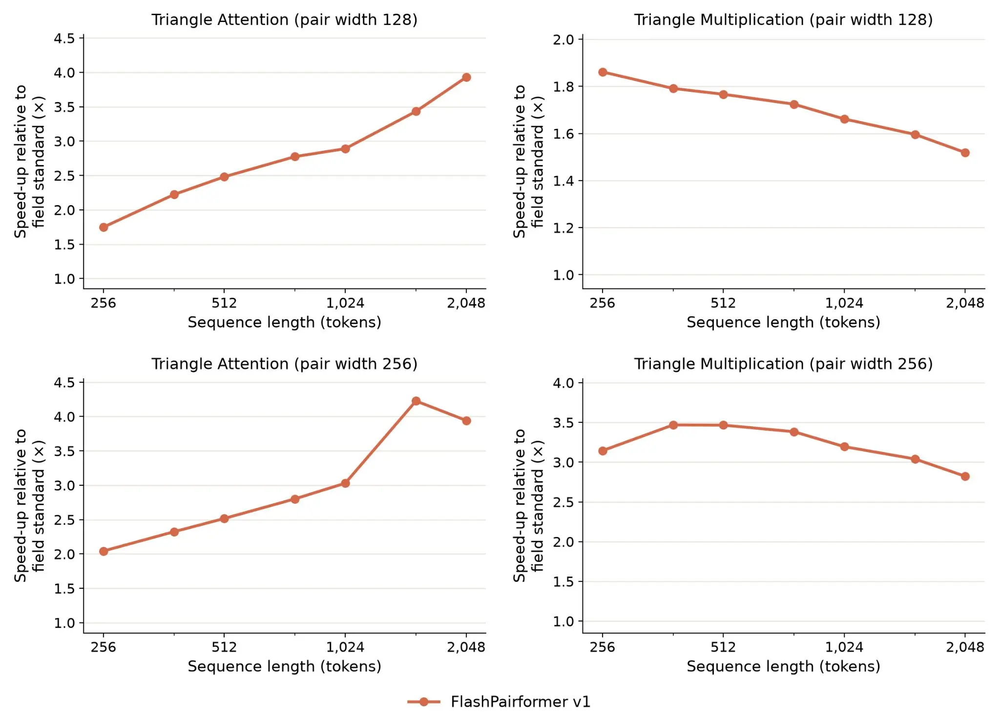
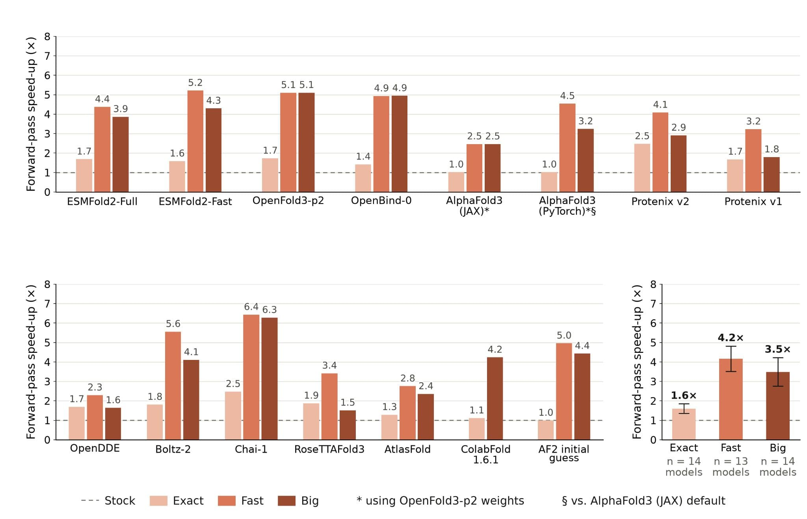
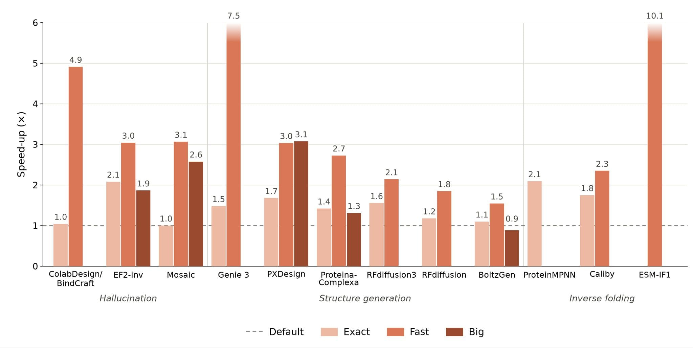
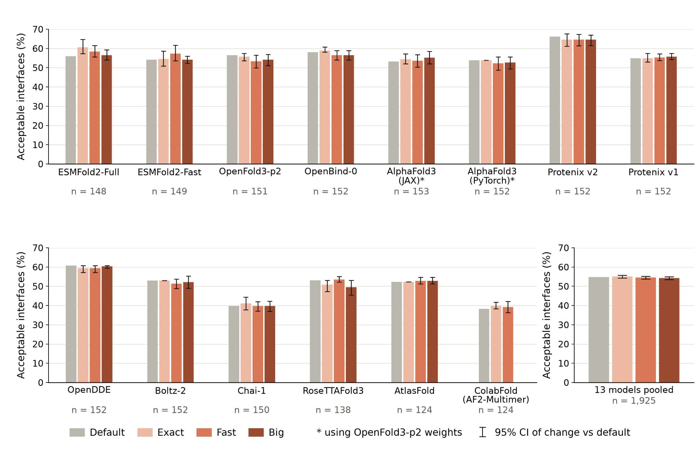
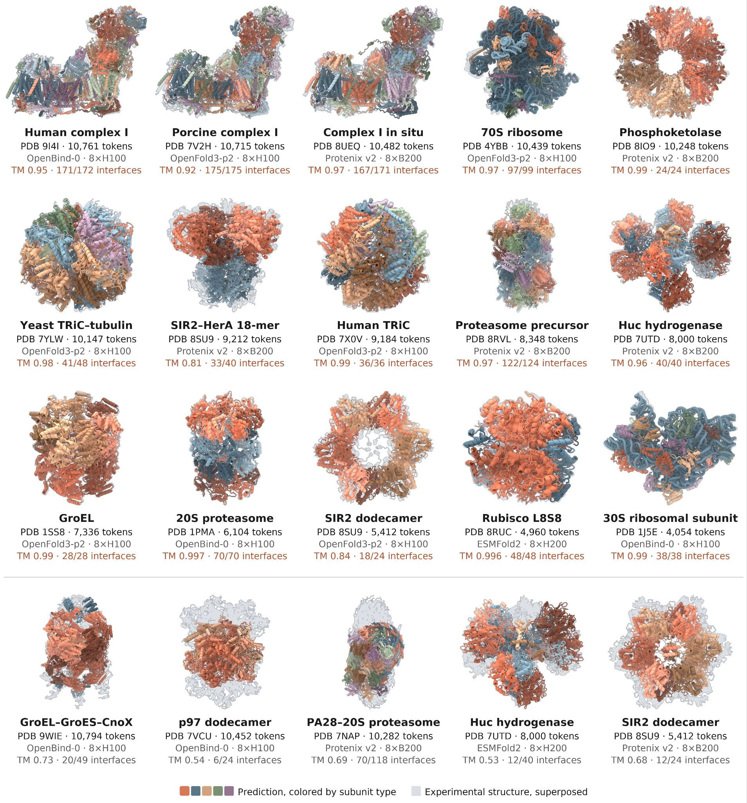
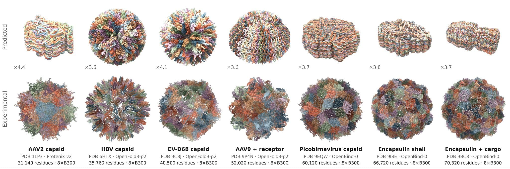
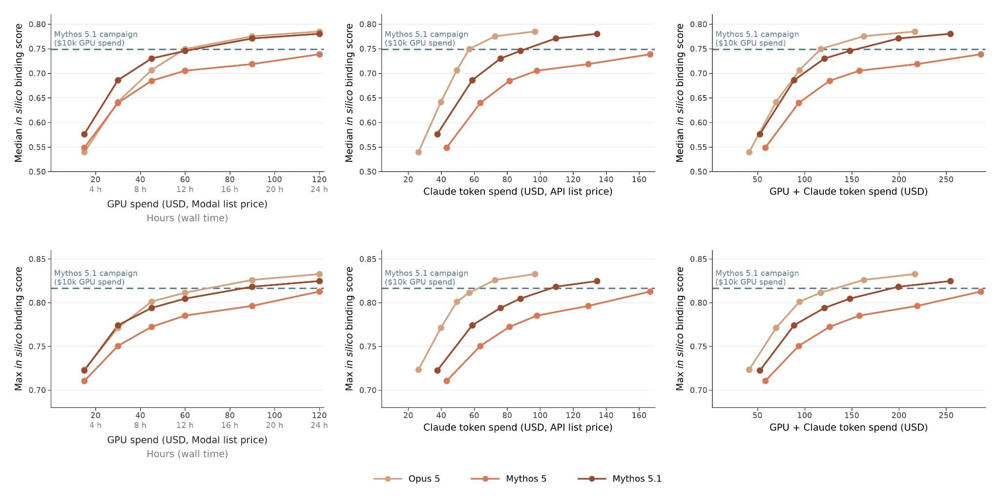

# Claude 如何提升（uplift）生物分子建模（中英对照）

> 原文标题：How Claude is uplifting biomolecular modeling
> 原文链接：https://www.anthropic.com/research/claude-uplifts-biomolecular-modeling
> 原文作者：Anthropic
> 发布日期：2026-09-17
> **翻译模型：** GLM-5.3-Flash
> **评分：** ★★★★☆（4/5，强推荐）—— 两名无内核工程经验的监督者带教下，Claude 自主完成 30+ 开源生物分子模型的 SOTA 推理优化与万级 token 分子机器折叠，是「AI 做真实工程与科研」的关键实证；属工程优化与能力展示，故未给满星
> 排版：每段英文原文在前，中文翻译紧随其后。默认收录正文主体。原页导航、页脚与相关内容推荐未收录。

---

In this post, we share how Claude made the open-source models that scientists use to predict and design biomolecules faster and more memory-efficient. Claude, working within [Claude Science](https://claude.com/product/claude-science), optimized more than 30 of these models in just under four weeks, speeding them up roughly 4x on average. It also created a low-memory mode that enables the accurate prediction of biomolecular systems larger than 10,000 tokens (amino acids, nucleotides, and atoms from small molecules and ions) on a single NVIDIA GPU node. We are open-sourcing all of the optimized code and announcing a protein design competition co-sponsored with Adaptyv Bio, backed by up to $1 million in Claude credits and wet lab validation for over 5,000 designs.

在本文中，我们分享 Claude 如何把科学家用于预测与设计生物分子的开源模型变得更快、更省内存。Claude 在 [Claude Science](https://claude.com/product/claude-science) 中工作，用不到四周时间优化了其中 30 多个模型，平均提速约 4 倍。它还创建了一个低内存模式，可在单个 NVIDIA GPU 节点上准确预测超过 10,000 个 token（氨基酸、核苷酸，以及来自小分子与离子的原子）的生物分子系统。我们正在开源全部优化后的代码，并宣布与 Adaptyv Bio 共同主办一场蛋白质设计竞赛，提供最高 100 万美元的 Claude 额度，并为超过 5,000 个设计提供湿实验（wet lab）验证。

Recently, we [shared results](https://www.anthropic.com/research/Claude-accelerates-protein-design) demonstrating Claude's abilities to design *de novo* protein binders through expert-level orchestration of open-source protein design and structure prediction models. *De novo* binders are small, computationally designed proteins that attach tightly to a specific target molecule to activate, block, or deliver something to it.

不久前，我们[分享过一些结果](https://www.anthropic.com/research/Claude-accelerates-protein-design)，展示了 Claude 通过对开源蛋白质设计与结构预测模型做专家级编排来设计从头（de novo）蛋白质结合剂（binder）的能力。de novo 结合剂是计算设计出的小型蛋白质，能紧密附着到特定目标分子上，实现对它的激活、阻断或递送。

Although this was an encouraging demonstration of AI's scientific capabilities and an early step towards advancing drug discovery, it took more resources than would be available to the vast majority of protein designers. We allowed Claude to spend up to $10,000 per target on the AI infrastructure platform Modal, roughly equivalent to 2,500 NVIDIA H100 GPU hours.

尽管这是 AI 科学能力的一次鼓舞人心的展示，也是迈向推动药物发现的早期一步，但它消耗的资源超出了绝大多数蛋白质设计者所能获得的水平。我们允许 Claude 在 AI 基础设施平台 Modal 上为每个目标花费至多 10,000 美元，大致相当于 2,500 个 NVIDIA H100 GPU 小时。

To make such research more accessible, we began to explore inference optimizations to run these models more efficiently. As an early result of these optimizations, [Claude Mythos 5.1](https://www.anthropic.com/claude-fable-and-mythos-5-1) accelerated seven open-source biology models, enabling them to run up to 2.5 times faster.

为了让这类研究更容易上手，我们开始探索推理（inference）优化，让这些模型跑得更高效。作为这些优化的早期成果，[Claude Mythos 5.1](https://www.anthropic.com/claude-fable-and-mythos-5-1) 加速了七个开源生物学模型，使其运行速度最高提升至 2.5 倍。

Here, we present new results showing how an internal, general-purpose research model was able to optimize more than 30 deep learning models trained for a variety of biological tasks, such as structure prediction and protein design, as well as for genomics and protein language models. On average, Claude was able to speed up such tasks roughly 4x while sacrificing a minimal amount of precision, and nearly 2x with identical outputs. Claude also improved the memory utilization of these models, making it possible to predict biomolecular systems of unprecedented sizes. By combining these results with simplifications to our previous agentic protein design approach, we show that Claude can achieve comparable *in silico* performance to the results we previously reported using two orders of magnitude fewer GPU hours.

在本文中，我们给出新的结果：一个内部通用研究型模型优化了 30 多个为各类生物学任务训练的深度学习模型——涵盖结构预测、蛋白质设计，以及基因组学与蛋白质语言模型。平均而言，Claude 能把这类任务提速约 4 倍而几乎不损失精度；在输出完全一致的前提下也能提速近 2 倍。Claude 还改善了这些模型的内存利用，使预测前所未有的大规模生物分子系统成为可能。把这些结果与我们此前 agentic 蛋白质设计流程的简化相结合，我们证明 Claude 能用少两个数量级的 GPU 小时，取得与此前报告相当的计算机模拟（in silico）性能。

Beyond protein design, these specialized biological models are widely used by molecular biologists, including for drug discovery and development. We are open-sourcing the optimized code for all of these models today ([here](https://github.com/anthropics/uplifting-biomolecular-modeling)) so that the broader community can make use of them. You can find more detail in our technical report ([here](https://www-cdn.anthropic.com/c93593cb8990d6c0e2644c22b1e4e74228eeb013.pdf)).

在蛋白质设计之外，这些专门的生物学模型也被分子生物学家广泛使用，包括用于药物发现与开发。我们今天开源了所有这些模型优化后的代码（[见此处](https://github.com/anthropics/uplifting-biomolecular-modeling)），供更广泛的社区使用。更多细节见我们的技术报告（[见此处](https://www-cdn.anthropic.com/c93593cb8990d6c0e2644c22b1e4e74228eeb013.pdf)）。

To further support the community, we are also co-sponsoring a protein design competition with Adaptyv Bio, which has pioneered [open protein design competitions](https://proteinbase.com/competitions). We've jointly selected five challenging problems at the frontier of today's capabilities. Together with Adaptyv, and thanks to generous contributions from Modal and Twist Bioscience, we're committing up to $1 million in Claude credits and $250,000 in Modal compute credits, as well as wet lab validation for over 5,000 designs. Find more information ([here](https://proteinbase.com/competitions/anthropic-adaptyv-2026)) and ([apply here](https://docs.google.com/forms/d/e/1FAIpQLSc0Hz1ZWYTt_wkn76ViVxDghmEhG_OeVEcj9YGHxLWqxF1kWw/viewform?usp=dialog)).

为进一步支持社区，我们还在与 Adaptyv Bio 共同主办一场蛋白质设计竞赛——后者是[开放蛋白质设计竞赛](https://proteinbase.com/competitions)的先行者。我们共同挑选了五个处于当今能力前沿、极具挑战性的问题。在 Adaptyv 之外，还要感谢 Modal 与 Twist Bioscience 的慷慨支持：我们投入最高 100 万美元的 Claude 额度与 25 万美元的 Modal 算力额度，并为超过 5,000 个设计提供湿实验验证。详情（[见此处](https://proteinbase.com/competitions/anthropic-adaptyv-2026)）与报名（[点此申请](https://docs.google.com/forms/d/e/1FAIpQLSc0Hz1ZWYTt_wkn76ViVxDghmEhG_OeVEcj9YGHxLWqxF1kWw/viewform?usp=dialog)）。

## 加速蛋白质结构预测与设计模型（Accelerating protein structure prediction and design models）

Protein structure prediction is the problem of determining the three-dimensional structure of a protein from its sequence of amino acids alone. Protein design, meanwhile, is the process of creating a protein with a specific structure, function, or set of properties. Together, these computational tools allow scientists to interrogate key biomolecular processes, such as how cancers form, and to create useful molecules, such as drugs that could target these cancers.

蛋白质结构预测（protein structure prediction）要解决的问题是：仅凭氨基酸序列确定蛋白质的三维结构。蛋白质设计（protein design）则是创造具有特定结构、功能或性质组合的蛋白质的过程。这两类计算工具加在一起，让科学家既能探究关键的生物分子过程（比如癌症如何形成），也能创造有用的分子（比如可能靶向这些癌症的药物）。

Modern structure prediction models, such as AlphaFold3, OpenFold3, and Boltz-2, spend much of their computational runtime and memory on two operations: triangle attention and triangle multiplication, which act on triplets of tokens. These operations make it possible to model the geometry of biomolecular systems, but they are extremely computationally expensive, because they are cubic in both runtime and memory: doubling the size of the system uses 8x more time and memory, while tripling it uses 27x more.

AlphaFold3、OpenFold3、Boltz-2 等现代结构预测模型，把大量运行时间与内存花在两个操作上：作用于三元 token 组的三角注意力（triangle attention）与三角乘法（triangle multiplication）。这些操作让建模生物分子系统的几何结构成为可能，但计算代价极其高昂——运行时间与内存都随规模呈三次方增长：系统规模翻倍，时间与内存消耗增至 8 倍；增至三倍，则消耗增至 27 倍。

Writing kernels—low-level software translation layers for accelerated computing hardware such as GPUs—is a standard approach for reducing these costs. Given their significance, triangle attention and multiplication have been the subject of dedicated kernel development efforts, first with NVIDIA's [cuEquivariance](https://github.com/nvidia/cuequivariance) and more recently with NVIDIA's [BioNeMo Inference Runtime](https://github.com/NVIDIA-BioNeMo/BioNeMo-Inference-Runtime) (BioNeMo-IR).

编写内核（kernel）——面向 GPU 等加速计算硬件的低层软件翻译层——是降低这类成本的标准做法。鉴于这两个操作的重要性，业界已为三角注意力与三角乘法开展过专门的内核开发：先是 NVIDIA 的 [cuEquivariance](https://github.com/nvidia/cuequivariance)，最近又有 NVIDIA 的 [BioNeMo Inference Runtime](https://github.com/NVIDIA-BioNeMo/BioNeMo-Inference-Runtime)（BioNeMo-IR）。

For our own effort to optimize inference for structure prediction models, we worked with Claude to develop FlashPairformer, a set of custom kernels that speed up triangle attention and multiplication. It achieves a new state-of-the-art, outperforming [the field standard](https://github.com/nvidia/cuequivariance) on average by 2.7-2.9x on triangle attention and 1.7-3.2x on triangle multiplication, depending on the model configuration.

在我们优化结构预测模型推理的工作中，我们与 Claude 共同开发了 FlashPairformer——一组加速三角注意力与三角乘法的定制内核。它取得了新的最优水平（state-of-the-art）：视模型配置而定，在三角注意力上平均比[业界标准](https://github.com/nvidia/cuequivariance)快 2.7–2.9 倍，在三角乘法上快 1.7–3.2 倍。

> We worked with Claude to develop FlashPairformer, a set of custom kernels that accelerate triangle attention and multiplication, which are the main components of the Pairformer architecture that underlies state-of-the-art biomolecular structure prediction models. Results are reported relative to the field standard.

In addition to developing transferable kernels, we pointed Claude at each individual model with the goal of producing more specific optimizations. These included changes like caching redundant recomputed work and simplifying dead branches into their constant outputs. The combination of these improvements accelerated the structure prediction models by 4x, on average, and for each model, we confirmed that Claude's accelerated versions did not impact performance on the downstream task (such as structure prediction).

除了开发可迁移的内核，我们还让 Claude 逐个针对单个模型做更具体的优化，包括缓存重复的冗余计算、把死分支直接简化为其常量输出等改动。这些改进叠加起来，使结构预测模型平均提速 4 倍；并且对每个模型，我们都确认 Claude 的加速版本不影响下游任务（如结构预测）的表现。

It normally takes an experienced team of engineers weeks to produce such optimizations for each model, and the work often does not transfer between models. Claude, supervised by two members of Anthropic's technical staff who are experienced in biomolecular modeling but who had no prior experience in inference optimization or kernel engineering, carried out the acceleration of more than 30 open-source models across biomolecular structure prediction, protein design, protein language modeling, and genomics in just under four weeks. Our results suggest that frontier AI models will help others in the field build scientific tools with greater speed and ease.

通常情况下，一个经验丰富的工程师团队为单个模型做出此类优化需要数周时间，而且这些工作往往无法在模型之间迁移。而 Claude 在两名 Anthropic 技术人员的监督下——他们熟悉生物分子建模，但此前没有任何推理优化或内核工程经验——用不到四周时间完成了覆盖生物分子结构预测、蛋白质设计、蛋白质语言建模与基因组学领域的 30 多个开源模型的加速。我们的结果表明，前沿 AI 模型将帮助该领域其他人更快、更轻松地构建科学工具。

> Claude's optimizations accelerated over a dozen biomolecular structure prediction models, achieving, on average, a roughly 4x speed-up with minimal decrease in precision and a roughly 1.6x speed-up with identical outputs. Note: ColabFold 1.6.3's concurrently-released optional fast kernels are not yet benchmarked here.

> Claude's optimizations also sped up multiple protein design models spanning hallucination, structure generation, and inverse folding. These models rely on a variety of architectures, including AlphaFold-class structure transformers, diffusion, flow matching, and graph neural networks.

> The fast modes we developed for structure prediction are statistically indistinguishable from the default settings across a pooled set of biomolecular interfaces. We call a predicted interface acceptable if its DockQ score is greater than 0.23.

## 让超大规模生物分子系统的建模成为可能（Enabling modeling of massive biomolecular systems）

In addition to making these protein structure prediction and design models faster, we also tasked Claude with reducing the memory usage involved in modeling large molecular machines. Much of the work in a cell is done by such systems, including the ribosome that builds proteins, the respiratory complexes that power the cell, and the chaperones that help other proteins fold. Each is built from dozens of components, and its function depends on how those components fit together and interact. Predicting the structures of systems this large has typically required substantial computing resources inaccessible to most molecular biologists, such as inference spread across multiple GPU nodes.

在让这些蛋白质结构预测与设计模型更快之外，我们还给 Claude 布置了另一项任务：降低建模大型分子机器（molecular machines）时的内存占用。细胞中的大量工作正是由这类系统完成的：合成蛋白质的核糖体（ribosome）、为细胞供能的呼吸复合物（respiratory complexes）、帮助其他蛋白质折叠的分子伴侣（chaperone）。每一个都由数十个组分构成，其功能取决于这些组分如何拼装并相互作用。预测这么大的系统结构，通常需要多数分子生物学家无法获得的大量计算资源，例如横跨多个 GPU 节点的推理。

Claude created a low-memory "Big" mode that enables the accurate modeling of systems larger than 10,000 tokens and successful inference on systems larger than 70,000 tokens using just one NVIDIA GPU node—a previously out-of-reach task. Molecular machines folded successfully using Big mode include human mitochondrial complex I, the TRiC chaperone complex, a proteasome, and a bacterial ribosome, each closely matching its experimentally determined structure. To our knowledge, these are among the largest structures ever folded accurately using structure prediction models, with complex I and the 70S ribosome consisting of more than 10,000 tokens each, in comparison to the 40S ribosome predicted accurately by [AlphaFold3](https://www.nature.com/articles/s41586-024-07487-w), which consisted of 7,663 tokens.

Claude 创建了一个低内存的「Big」模式：只用一个 NVIDIA GPU 节点，就能准确建模超过 10,000 个 token 的系统，并对超过 70,000 个 token 的系统成功完成推理——这在过去是可望不可即的任务。用 Big 模式成功折叠的分子机器包括人类线粒体复合物 I（mitochondrial complex I）、TRiC 分子伴侣复合物、蛋白酶体（proteasome）与细菌核糖体，每个都与实验测定结构高度吻合。据我们所知，这些属于有史以来用结构预测模型精确折叠过的最大结构之列：复合物 I 与 70S 核糖体各含超过 10,000 个 token；相比之下，[AlphaFold3](https://www.nature.com/articles/s41586-024-07487-w) 精确预测过的 40S 核糖体为 7,663 个 token。

> The low-memory "Big" mode Claude created enables open-source structure prediction models to accurately predict biomolecular systems consisting of over 10,000 tokens on a single NVIDIA GPU node, demonstrating that these specialized models are able to generalize nearly 1.5 orders of magnitude beyond their training context. The top three rows show accurately predicted systems; the bottom row shows inaccurately predicted ones. Interfaces are considered accurate if their DockQ score is at least 0.23.

To test the limits of Claude's optimizations, we asked Claude to predict structures of a greater size than anything that had previously been achieved. Using a single 8-GPU B300 node, Claude generated predictions of entire viral capsids and protein compartments ranging in size from more than 31,000 to more than 70,000 tokens. These systems are nearly two orders of magnitude larger than the training context of these structure prediction models, and, perhaps unsurprisingly, are not predicted correctly. However, the barrier to inferencing at this scale has been significantly lowered now that it takes just one NVIDIA B300 node, suggesting that with improved tools researchers will soon be able to computationally model an increasingly complex set of biological systems.

为了测试 Claude 这些优化的极限，我们让 Claude 去预测比以往任何成就都更大的结构。借助单个 8-GPU B300 节点，Claude 对完整的病毒衣壳（viral capsid）与蛋白质区室（protein compartment）生成了预测，规模从 31,000 多个 token 到超过 70,000 个 token 不等。这些系统比这些结构预测模型的训练上下文大了近两个数量级，也许并不意外，它们都未被正确预测。不过，在这种规模上做推理的门槛已被显著降低——如今只需一个 NVIDIA B300 节点——这意味着随着工具的改进，研究者很快就能对越来越复杂的生物系统进行计算建模。

> "Big" mode allows open-source structure prediction models to successfully run inference at an unprecedented size using a single NVIDIA B300 node. Capability runs are executed with a single trunk pass (no recycles) as proof-of-concept. Predicted structures collapse, suggesting a lack of generalization nearly two orders of magnitude beyond the training context.

## Claude 高效设计 de novo 蛋白质结合剂（Claude efficiently designs de novo protein binders）

In our earlier work on protein design, we provided Claude with an approximately 16,000-word prompt that encouraged it to utilize sub-agents and spend up to $10,000 per target on Modal (roughly 2,500 NVIDIA H100 GPU hours) in a 24-hour span. Here, we gave a single Claude model access to one NVIDIA H200 and 24 hours of wall time, a prompt of about 1,100 words, and a reference sheet for the pre-installed tools, with no sub-agents and no human steering the designs.

在此前的蛋白质设计工作中，我们给 Claude 提供了约 16,000 词的提示词，鼓励它使用子代理（sub-agent），并在 24 小时内于 Modal 上为每个目标花费至多 10,000 美元（约合 2,500 个 NVIDIA H100 GPU 小时）。而这一次，我们只给单个 Claude 模型一块 NVIDIA H200 与 24 小时的墙钟时间（wall time），外加约 1,100 词的提示词和一份预装工具的参考说明：没有子代理，也没有任何人在中途引导设计。

We ran three Claude models (Mythos 5.1, Mythos 5, and Opus 5) against 16 targets with the accelerated biomolecular models described in this post. We scored designs by [ipSAE](https://www.biorxiv.org/content/10.1101/2025.02.10.637595v2), an *in silico* score that has been shown to be predictive of binding in the wet lab. Averaged over 16 targets, the median-scoring and highest-scoring designs from all three Claude models evaluated achieve approximately the same ipSAE values as our earlier Mythos 5.1 campaigns despite using about two orders of magnitude fewer GPU hours. We also considered Claude token costs and found that with a combined spend of approximately $150 on GPUs and tokens, we can achieve *in silico* performance matching the levels of our previous campaigns.

我们让三个 Claude 模型（Mythos 5.1、Mythos 5 与 Opus 5）使用本文所述的加速生物分子模型，对 16 个目标分别做设计。设计用 [ipSAE](https://www.biorxiv.org/content/10.1101/2025.02.10.637595v2) 打分——这是一个已被证明能预测湿实验中结合结果的 in silico 指标。在 16 个目标上取平均，三个受测 Claude 模型的中位成绩与最高成绩设计，都取得了与我们此前 Mythos 5.1 战役（campaign）大致相同的 ipSAE 值，而 GPU 小时用量少了约两个数量级。我们还核算了 Claude 的 token 成本：GPU 与 token 合计约 150 美元的花费，就能取得与此前战役相当的 in silico 性能。

> A single Claude model with access to one NVIDIA H200 and 24 hours of wall time designed *de novo* protein binders with comparable *in silico* binding scores to those of our earlier Mythos 5.1 campaign (dashed line), which could utilize sub-agents and use about 100 times as many GPU hours. Each curve represents the median (top) or max (bottom) of ipSAE scores (*in silico* binding scores) from a Claude model orchestrating the accelerated biomolecular models. We show scores vs. estimated GPU spend (left), token spend (center), and their combination (right). The results are averaged over 16 targets and up to five independent runs per target.

## 与 Adaptyv Bio 共同主办蛋白质设计竞赛（Co-sponsoring a protein design competition with Adaptyv Bio）

The optimizations described above help us predict and design molecules more efficiently, while unlocking capabilities that would have otherwise been resource-prohibitive. To demonstrate the uplift they provide and the impact of Claude on molecule design more broadly, we're partnering with Adaptyv Bio to launch [a protein design competition](https://proteinbase.com/competitions/anthropic-adaptyv-2026). We've selected five problems at the frontier of today's protein design capabilities, including challenges such as species cross-reactivity, pH-sensitivity, and peptide-MHC specificity, as well as difficult targets such as GPCRs.

上述优化帮助我们更高效地预测与设计分子，同时解锁了原本因资源门槛过高而无法企及的能力。为了展示这些优化带来的能力提升（uplift），以及 Claude 对更广泛分子设计的影响，我们正与 Adaptyv Bio 合作发起[一场蛋白质设计竞赛](https://proteinbase.com/competitions/anthropic-adaptyv-2026)。我们挑选了五个处于当今蛋白质设计能力前沿的问题，包括物种交叉反应性（species cross-reactivity）、pH 敏感性（pH-sensitivity）、肽-MHC 特异性（peptide-MHC specificity）等挑战，以及 GPCR（G 蛋白偶联受体）这类困难靶点。

With the Adaptyv team, we'll be experimentally validating over 5,000 designs submitted by the community against these problems. We will be providing up to $1 million in Claude credits and additional funds for experimental validation at Adaptyv for participating researchers, Modal will provide up to $250,000 in compute credits, and Twist Bioscience will provide DNA for the competition. You can find more information, including eligibility criteria ([here](https://proteinbase.com/competitions/anthropic-adaptyv-2026)) and ([apply here](https://docs.google.com/forms/d/e/1FAIpQLSc0Hz1ZWYTt_wkn76ViVxDghmEhG_OeVEcj9YGHxLWqxF1kWw/viewform?usp=dialog)).

我们将与 Adaptyv 团队一起，对社区就这些问题提交的超过 5,000 个设计做实验验证。我们将为参与研究者提供最高 100 万美元的 Claude 额度，外加在 Adaptyv 开展实验验证的追加经费；Modal 将提供最高 25 万美元的算力额度；Twist Bioscience 将为竞赛提供 DNA。更多信息（含参评资格标准）见[竞赛页面](https://proteinbase.com/competitions/anthropic-adaptyv-2026)，[点此报名](https://docs.google.com/forms/d/e/1FAIpQLSc0Hz1ZWYTt_wkn76ViVxDghmEhG_OeVEcj9YGHxLWqxF1kWw/viewform?usp=dialog)。

We have also begun to provide frontier AI capabilities to life scientists for biology-related work via our [Life Sciences Verification Program](https://www.anthropic.com/news/life-sciences-verification-program). We recently enrolled our first group of organizations, and opened up the program in public beta today. You can find more information ([here](https://www.anthropic.com/news/life-sciences-verification-program)).

我们还开始通过[生命科学验证计划（Life Sciences Verification Program）](https://www.anthropic.com/news/life-sciences-verification-program)，向生命科学家提供用于生物学相关工作的前沿 AI 能力。我们近期招收了第一批组织，并于今天将该计划开放公测。更多信息见[此处](https://www.anthropic.com/news/life-sciences-verification-program)。

### 延伸阅读（Further reading）

- [Protein design competition page](https://proteinbase.com/competitions/anthropic-adaptyv-2026) and [application form](https://docs.google.com/forms/d/e/1FAIpQLSc0Hz1ZWYTt_wkn76ViVxDghmEhG_OeVEcj9YGHxLWqxF1kWw/viewform?usp=dialog)

  [蛋白质设计竞赛页面](https://proteinbase.com/competitions/anthropic-adaptyv-2026)与[报名表](https://docs.google.com/forms/d/e/1FAIpQLSc0Hz1ZWYTt_wkn76ViVxDghmEhG_OeVEcj9YGHxLWqxF1kWw/viewform?usp=dialog)

- [Code for specialized molecular models](https://github.com/anthropics/uplifting-biomolecular-modeling)

  [专门分子模型的代码](https://github.com/anthropics/uplifting-biomolecular-modeling)

- [Technical report](https://www-cdn.anthropic.com/c93593cb8990d6c0e2644c22b1e4e74228eeb013.pdf)

  [技术报告（PDF）](https://www-cdn.anthropic.com/c93593cb8990d6c0e2644c22b1e4e74228eeb013.pdf)
