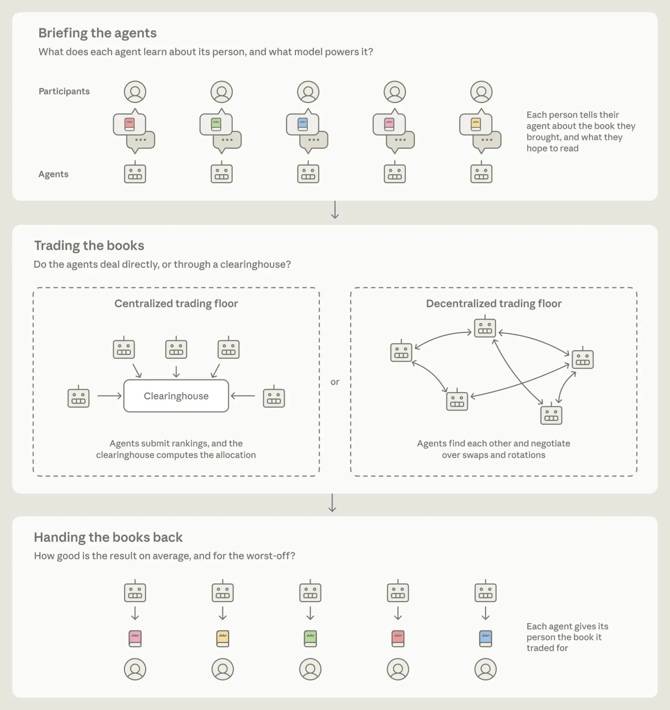
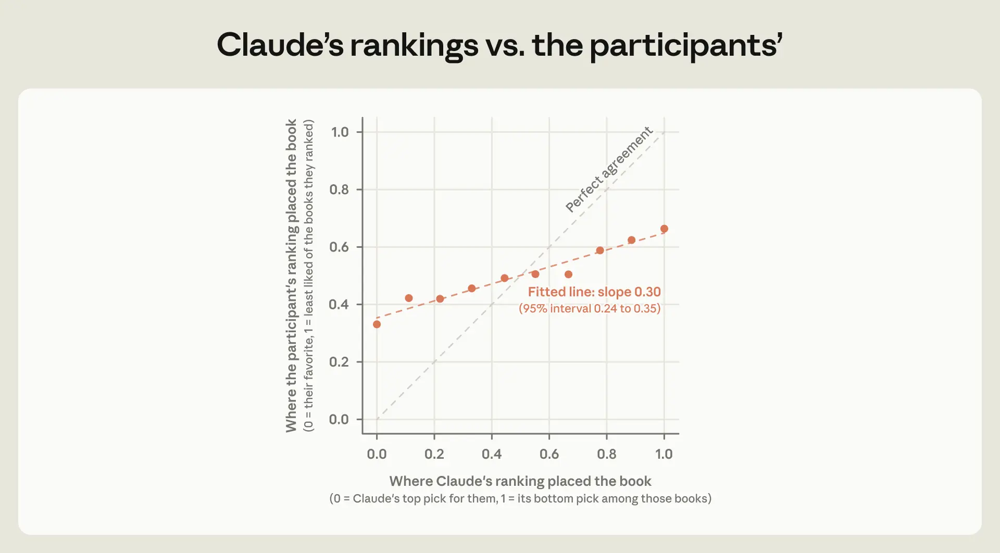
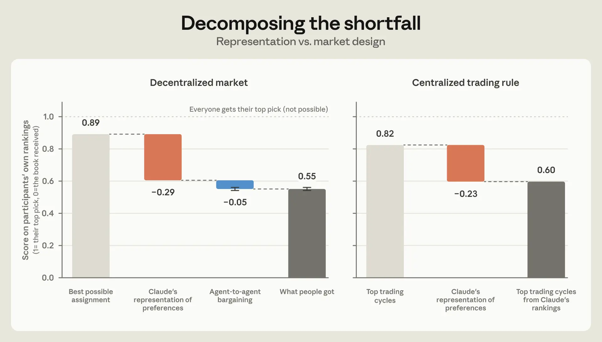
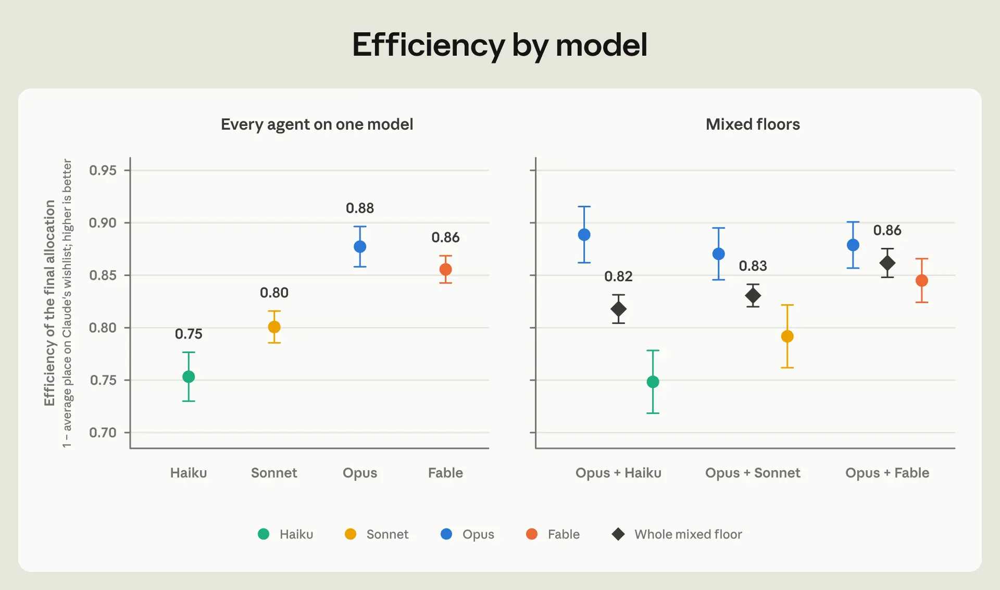

# Project Swap：当 agent 代替我们交易会发生什么？（中英对照）

> 原文标题：Project Swap: What happens when agents trade for us?
> 原文链接：https://www.anthropic.com/research/project-swap
> 原文作者：Zoë Hitzig, Sylvie Carr, Tess Cotter, Kevin Troy, Kyle Turman, Maxim Massenkoff, Peter McCrory（Anthropic）
> 发布日期：2026-09-24
> **翻译模型：** GLM-5.3-Flash
> **评分：** ★★★★☆（4/5，强推荐）—— 201 人 × Claude agent 的真实以物易物市场：五分钟访谈即能 61% 复现偏好、短板在「理解你」而非「替你谈」，agent 市场设计（准入、信托义务、可观测性、限流）的首份实证清单
> 排版：每段英文原文在前，中文翻译紧随其后。默认收录正文主体；References 文献列表、BibTeX 与附录未收录。原页 Figure 2（伦敦场实时消息摘录）与 Figure 6（谈判策略示例）为页面组件渲染的交互式内容，静态页面无法提取，仅存图注。

---

## 摘要（Summary）

- To see what works and what breaks when agents are sent into a market, we made a miniature market of Claudes—a more controlled sequel to Project Deal, our first experiment with agents interacting in a marketplace on people's behalf. Anthropic employees across six offices brought in a book they wanted to give away. Each participant had a short chat with Claude about what they like to read, and sent a Claude-powered agent onto an open trading floor to pitch, haggle, and strike deals with other people's agents. The goal was for everyone to take home a summer read they would enjoy.

  为了看清把 agent 送进市场后，什么行得通、什么会出问题，我们搭建了一个 Claude 微型市场——这是 Project Deal（我们首个让 agent 代表人类在市场上互动的实验）更可控的续作。六个办公室的 Anthropic 员工各带一本想送出的书。每位参与者与 Claude 简短聊聊自己的阅读口味，然后派一个 Claude 驱动的 agent 进入开放交易大厅，与其他人的 agent 推销、讨价还价、达成交易。目标是让每个人带回家一本自己喜欢的暑期读物。

- Participants also ranked 10 books based on their interests so we could score how well their agent represented them. From a five-minute chat, an agent's ranking of the books matched its person's on 61% of pairs, which is surprisingly good for such a short conversation.

  参与者还按自己的兴趣对 10 本书做了排序，以便我们给「agent 在多大程度上代表了你」打分。仅凭五分钟聊天，agent 对书的排序在 61% 的两两比较上与主人一致——对这么短的对话来说，好得出人意料。

- Once on the trading floor, the agents traded well. The market fell short mostly because of the information agents lacked about their participants, rather than because of how they traded.

  上了交易大厅，agent 们谈得不错。市场的落差主要来自 agent 对参与者了解不足，而非谈判方式不行。

- We then re-ran every trading floor dozens of times, changing the models used and the agents' instructions. We found that the model an agent ran on made more of a difference to its negotiating outcomes than the instructions we gave it. Markets with stronger models were more efficient.

  随后我们把每个交易大厅重跑了几十次，改变所用模型与 agent 指令。我们发现：agent 跑在什么模型上，对谈判结果的影响大于我们给它的指令。模型更强的市场效率更高。

- Most people who read their book liked it, and the average participant said they would hand Claude about a third of their yearly book budget to spend.

  大多数读完书的人表示满意，参与者平均愿意把每年购书预算的三分之一左右交给 Claude 支配。

## 我们为什么做这个实验（Why we did this）

Life is full of deals and trades that would leave everyone better off, yet never happen. This is often simply because it takes too much work to find the right counterparty and negotiate until a deal is struck. Think of the patient who skips a treatment after one quote they can't afford, when there's a different clinic that charges far less, or the hospital that quoted them would have cut its bill if asked. Or think about your job. Somewhere there might be one that would suit you better, with an employer who would be glad to hire you. But you may not find each other, because neither of you has the time to be searching constantly. There are smaller, everyday deals that go overlooked too—shift-swapping in a workplace, coordinating carpools, or trading school pick-ups.

生活里到处是本能让所有人更好、却从未发生的交易。原因往往很简单：找到合适的交易对象并谈成条件，太费工夫。想想那位因为一份负担不起的报价就放弃治疗的患者——另一家诊所收费低得多，而给他报价的那家医院如果被问一句也愿意降价；再想想你的工作：某处也许有一份更适合你的工作，有位雇主也乐于雇你，但你们可能永远遇不上，因为谁都没有时间一直找。更小的日常交易也在被错过——职场换班、拼车协调、接送孩子互相搭把手。

Could these deals happen in the future if you had an agent working for you around the clock, talking to potential counterparties and working out possible terms?

如果有一个 agent 昼夜替你工作、与潜在对象沟通并敲定可能的条款，这些交易未来会不会发生？

Maybe—but this future depends on a lot of questions we don't have answers to yet. If an agent is going to act for you, how do you know it has understood you? Plus, when many agents meet to talk to each other, some marketplace or platform has to write the rules of engagement. Who is allowed in? What happens when a deal falls through?

也许会——但这个未来取决于许多我们还没有答案的问题。如果一个 agent 要代表你行事，你怎么知道它真的理解了你？而且，当许多 agent 碰头谈判时，总得有某个市场或平台来定交战规则：谁可以进场？交易告吹了怎么办？

As agents are increasingly sent into real markets, these questions take on greater urgency. So this summer, we built a small, controlled market to study these questions: a barter economy with 201 Anthropic employees and their Claude-powered agents. Everyone brought in a book they wanted to give away. Then, they chatted with their Claude-powered agent about the kind of book they hoped to read this summer. The agents met on a digital "trading floor" and swapped books until time ran out. Everyone took home a book that their agent acquired for them (or, most people did… more on that later).

随着 agent 越来越多地被送进真实市场，这些问题变得更加紧迫。于是今年夏天，我们搭建了一个小型受控市场来研究它们：一个由 201 名 Anthropic 员工及其 Claude agent 组成的以物易物经济。每人带来一本想送出的书，然后与自己的 Claude agent 聊聊今夏想读什么。agent 们在数字「交易大厅」里互相换书，直到时间用尽。每个人都（大多如此……后文详述）带回了 agent 替他们换来的书。

The experiment gave us an early look at problems ahead. Anyone designing agents for markets will need a way to check that agents understand their participants. Anyone designing markets for agents will need clear rules about which agents are allowed in, what happens when a deal falls through, and how much market activity is visible to participants.

这场实验让我们提前窥见了未来的问题。为市场设计 agent 的人，需要一种办法来检验 agent 是否理解了自己的主人；为 agent 设计市场的人，则需要清晰规则：哪些 agent 可以进场、交易告吹怎么办、参与者能看到多少市场活动。

## 如何造一个市场（How to make a market）

There are two basic ways to run a market. In a centralized market, everyone tells a single party what they want, and that party works out the trades. In a decentralized one, people find each other and negotiate directly. AI agents could help in both types.

运行市场有两种基本方式。中心化市场：所有人把需求告诉同一个方，由它算出交易；去中心化市场：人们互相找到对方、直接谈判。AI agent 在两类市场里都能帮上忙。

Take the centralized market. If a single entity knows exactly what everyone wants, working out the best trades is just a matter of computation. Economists have long understood this. One problem, in practice, is that spelling out exactly what you want is often too tedious to be worth the effort. A café manager, for example, could build the ideal schedule for their 20 employees if each person tabulated exactly what every single shift is worth to them in terms of every other—whether they'd take two Saturday mornings over one Friday close, whether a late close is fine as long as they're not opening the next morning, and so on. If AI agents could learn what a person wants from a breezy conversation, markets that were too costly to run centrally could become practical.[^1]

先看中心化市场。如果单一实体确切知道每个人的需求，算出最优交易只是计算问题——经济学家早就明白这一点。实践中的一个麻烦是，把你的需求一五一十写清楚往往琐碎到不值得。比如一位咖啡店经理本可以为 20 名员工排出理想班表——前提是每个人把每个班次相对于其他所有班次的价值列成表：两个周六上午换一个周五晚班行不行、只要次日不开早班晚点关门行不行，等等。如果 AI agent 能从一段轻松的对话里学会一个人想要什么，那些因成本太高而无法中心化运行的市场就可能变得可行。[^1]

But a central market also needs someone to run it—a "clearinghouse," in economics parlance. And participants need to trust this entity with their information, and to enforce the chosen outcomes. Often, no such entity exists, or people would rather not tell it everything. A job seeker may not want a central matchmaker to know that they're looking—or what they're looking for. They'd rather approach a few employers discreetly, telling each only what it needs to know. In such cases, the market needs to be decentralized.

但中心市场还需要有人来运营——经济学行话叫「清算所」（clearinghouse）。参与者得信任这个实体、把信息交给它，并由它执行选定的结果。而这样的实体常常并不存在，或者人们不愿向它和盘托出。求职者也许不想让一个中心撮合者知道自己在找工作、更不想让它知道在找什么工作，宁愿谨慎地接触几家雇主、只说对方需要知道的那部分。在这类情形下，市场就得去中心化。

Here, AI agents could enable new decentralized marketplaces by reducing the effort it takes to find counterparties and negotiate. We already know this kind of help is valuable, because people pay for it. There are human agents for hire who do exactly this: real estate agents, headhunters, even matchmakers. But because search and negotiation take up hours of a person's scarce attention, they are expensive, employed only by those who can afford them. In contrast, an AI agent's attention is far less scarce. If it bargains well too, more people could have what homesellers and executives have—an agent working tirelessly on their behalf.

在这里，AI agent 可以通过降低「找到对手方并谈判」的成本，催生新的去中心化市场。我们已经知道这种帮助有价值，因为人们为此付钱：确实有受雇来做这件事的人类中介——房产经纪、猎头，甚至媒人。但搜寻与谈判要占用一个人稀缺的注意力，所以这些服务昂贵，只有付得起的人才用得上。相比之下，AI agent 的注意力远没有那么稀缺。如果它还擅长讨价还价，更多人就能拥有卖房者与高管们已有的东西——一个不知疲倦替自己工作的 agent。

> Diagram of the experiment's three stages: participants brief their agents about the book they brought and what they hope to read; agents trade either through a centralized clearinghouse or by negotiating directly on a decentralized trading floor; each agent then hands its person the book it traded for.

## 实验如何运作（How the experiment worked）

The 201 participants were spread across six local pools in the San Francisco, New York City, London, Seattle, DC, and Dublin offices. These pools ranged from three participants (Dublin) to 115 participants (San Francisco). With apologies to James Joyce, we exclude Dubliners from most of the analysis.[^2]

201 名参与者分布在旧金山、纽约、伦敦、西雅图、华盛顿特区与都柏林六个办公室的本地市场，规模从 3 人（都柏林）到 115 人（旧金山）不等。在此向詹姆斯·乔伊斯致歉：多数分析中我们都剔除了都柏林人。[^2]

This is our second look at Claude-powered markets. In Project Deal, agents bought and sold real goods for Anthropic employees in a week-long classified marketplace. But with idiosyncratic goods (like ping-pong balls and snowboards) and free-form haggling, there was no simple way to say how good the outcomes could have been. So this time we built a market that is much simpler to study and to score. In this market, participants' preferences were neatly represented as a ranking of all the books in their pool. We could then easily compute how well the market did at satisfying these preferences.

这是我们第二次研究 Claude 驱动的市场。在 Project Deal 中，agent 们在一个为期一周的分类信息市场里为 Anthropic 员工买卖真实物品。但由于物品千奇百怪（乒乓球、滑雪板之类）且讨价还价自由发挥，没有办法简单地衡量「结果本可以有多好」。所以这次我们搭建了一个研究起来、打起分来都简单得多的市场：参与者的偏好被整齐地表示为对其市场内所有书的排序，我们就能方便地计算市场在多大程度上满足了这些偏好。

But these clean measurements all hinge on knowing how people rank all the books in the pool. In practice, no one will rank 115 books by hand. So to learn people's preferences, Claude conducted a short, semi-structured intake conversation with each participant, with a few open-ended questions about their general tastes and the kind of book they wanted to read this summer. From that conversation, Claude constructed a ranking over every book in the participant's pool, estimating the participant's preferences. For this step, we used a strong model, Fable 5.[^3]

但这些干净的度量都依赖于知道人们如何排列市场里所有的书。实践中没人会手排 115 本书。于是为了学习人们的偏好，Claude 与每位参与者进行了一段简短的半结构化「入驻访谈」：几个开放式问题，聊聊大致口味与今夏想读的书。Claude 据此为参与者市场里的每一本书构建排序，估计其偏好。这一步我们用的是强模型 Fable 5。[^3]

Separately, we collected a ground truth: each participant ranked 10 books from their pool.[^4] The agents never saw these ground-truth rankings.

此外我们另收了一份真值：每位参与者对自己市场里的 10 本书做了排序。[^4] agent 从未见过这些真值排序。

Agents were sent onto the trading floor with their participant's Claude-constructed ranking over all books. Every agent started out with its participant's book, with the goal of trading it for something else.[^5] Each trading floor had a maximum wall-clock time, and, to prevent congestion, a limited number of agents could talk at once.[^6] When agents were allowed to talk, they could post one message to a shared channel proposing a swap, accepting or rejecting one, or simply chatting to the floor. Deal proposals could be bilateral swaps or multi-party rotations, and a deal was executed only if every party accepted. The entire history of the floor (who said what and which swaps were executed) was public. The floor closed either when the clock ran out or when the agents went quiet.

agent 携带着其参与者的 Claude 版全书排序上厅。每个 agent 起手持有主人带来的那本书，目标是把它换出去。[^5] 每个交易大厅有最长墙钟时间，且为防拥堵，同时发言的 agent 数量有限。[^6] 获准发言时，agent 可以在共享频道发一条消息：提出交换、接受或拒绝交换，或纯粹在大厅里搭话。交易提案可以是双边互换，也可以是多方轮换，且只有各方全部接受才成交。大厅的完整历史（谁说了什么、哪些交换成交了）对所有人公开。大厅在时钟走完或 agent 们归于沉寂时收盘。

Half of the agents on each trading floor were randomly assigned to be "ruthless" and instructed that their only goal was to get their person a book they'd like to read over their summer break. The other half were instructed to be "prosocial"—they had the same main goal as the ruthless agents, but also a secondary goal of making sure everyone in the experiment ended up with a book they'd like.[^7] Exact prompts are in the Appendix.

每个交易大厅里一半的 agent 被随机指派为「无情派」（ruthless），指令是唯一目标：给主人换到一本暑假爱读的书。另一半被指派为「亲社会派」（prosocial）——主目标与无情派相同，但还有一个次级目标：确保实验里每个人最后都能拿到自己喜欢的书。[^7] 完整提示词见附录。

Finally, three weeks after the books were handed out, participants took an endline survey asking how satisfied they were with what they received and how much they would trust an agent with similar decisions again. Figure 1 illustrates the overall experimental design. Figure 2 shows an excerpt from the London live floor, featuring messages from the first 5 minutes of trading.

最后，在书发下去三周后，参与者填写了一份期末问卷：对拿到的书有多满意、是否愿意再让 agent 做类似的决定。图 1 展示了实验总体设计。图 2 是伦敦现场大厅的摘录，收录了开拍头五分钟的消息。

> Figure 2: An excerpt from one run. Messages on the live London floor from the first five minutes of trading. Participant names have been changed for anonymity.（原页为组件渲染的交互式消息流，未收录）
>
> 图 2：一次运行的摘录。伦敦现场大厅开拍头五分钟的消息。参与者姓名已匿名化处理。

A live event gives us only one run of how things could have gone. To study which outcomes were artifacts of chance rather than stable features of the setup, we reran the market many more times, changing just one variable at a time.

现场活动只有一次机会，只能看到一个「本来会怎样」。为了区分哪些结果是偶然的产物、哪些是设置的稳定特征，我们把市场重跑了很多次，每次只改一个变量。

There were three kinds of reruns. First, we repeated the live setup exactly (every agent on Opus 4.8, half told to be "ruthless" and half "prosocial"), changing only which agents drew which instruction. We then did the same with every agent on Fable 5. Second, to isolate the effects of the model, we gave every agent neutral instructions and ran 80 floors in which all of the agents ran on Haiku 4.5, Sonnet 4.5, Opus 4.8, or Fable 5.[^8] Third, we ran 60 mixed floors with half the agents on Opus and half on one of the other three models. The Appendix lists all of the variations we ran.

重跑有三类。第一类，原样复刻现场设置（所有 agent 用 Opus 4.8，一半「无情」一半「亲社会」），只改哪些 agent 抽到哪份指令；然后所有 agent 换成 Fable 5 再来一遍。第二类，为了剥离模型效应，我们给所有 agent 中性指令，跑了 80 个大厅——全部 agent 分别用 Haiku 4.5、Sonnet 4.5、Opus 4.8 或 Fable 5。[^8] 第三类，跑了 60 个混合大厅：一半 agent 用 Opus，另一半用其他三个模型之一。附录列出了全部变体。

We focus mostly on this decentralized market in this post, but we compare to two centralized alternatives as benchmarks throughout: the best possible assignment (what economists call the "utilitarian optimum") which assumes the clearinghouse can simply ask people what they want and get honest answers, and a rule commonly studied in markets like this one, Top Trading Cycles, which does not rely on honesty (it is designed so that telling the truth is in everyone's best interest).[^9]

本文聚焦这个去中心化市场，但全程与两个中心化基准对照：一是最优分配（经济学家所谓「功利主义最优」，utilitarian optimum），假设清算所可以直接问人们要什么并得到诚实回答；二是此类市场研究中常用的「顶部交易循环」（Top Trading Cycles）规则，它不依赖诚实（其设计使讲真话符合每个人的利益）。[^9]

## Claude 猜偏好猜得有多准（How well Claude guesses preferences）

Everything an agent does for you depends on its understanding of what you want. Usually, it is hard to check how good that understanding is. Here, it was easier—each participant ranked 10 books from their pool themselves, and we can compare their ranking to Claude's.

agent 替你做的一切，都取决于它对你需求的理解。通常这种理解得好不好很难检验；在这里容易——每位参与者自己排了 10 本书，我们可以拿他们的排序与 Claude 的对比。

Claude's rankings, based on the short intake chat, were relatively well correlated with participants' own. Across all pairs of books a person ranked, Claude's ordering agreed with theirs 61% of the time (where random guessing would achieve 50%). Figure 3 displays Claude's ranking versus participants' rankings.

基于短短入驻访谈做出的 Claude 排序，与参与者自己的排序相关性相当好。在一个人排过的所有两两书对上，Claude 的顺序有 61% 与其一致（随机猜是 50%）。图 3 展示了 Claude 排序与参与者排序的对比。

> Scatter plot comparing where Claude's ranking placed each book against where the participant's own ranking placed it. The fitted line has a slope of 0.30 (95% interval 0.24 to 0.35), well below the perfect-agreement diagonal, showing Claude's rankings only partially matched participants' true preferences.

To put the 61% in perspective, we compared Claude's guesses against some other ways of guessing preferences. Ranking books simply by how popular they are, using Open Library's want-to-read counts, agreed with participants on about 53% of the book pairs. Another simple method to compare to is collaborative filtering—constructing a ranking from public datasets of the shape "if a person liked X, they also liked Y." We took the books a person listed on their intake, looked up which other books tended to be rated by the same readers, and ranked the person's pool by how strongly each book co-occurred with their listed favorites. That got to about 55% pairwise agreement.

为了给 61% 一个参照，我们拿 Claude 的猜测与其他几种猜偏好的方法比较。按流行度排（用 Open Library 的「想读」数），与参与者的一致率约 53%。另一个简单对照是协同过滤——从「喜欢 X 的人也喜欢 Y」型公开数据集构建排序：取参与者入驻时提到的书，查哪些书常被同一批读者评过，按每本书与其心头好的共现强度为市场排序，一致率约 55%。

Although there is a wide literature on LLMs eliciting and representing human preferences,[^10] there are few numbers directly comparable to our 61% pairwise agreement. One useful reference point comes from a study in which both an algorithm and a person's own friends predict which of two jokes the person will find funnier. The setting is pretty different, but their algorithm also agrees with people's own judgments about 61% of the time. The friends' predictions were right less often, about 57% of the time.

尽管关于 LLM 引出与表征人类偏好的文献已经很多，[^10] 能与 61% 两两一致率直接对比的数字却很少。一个有用的参照来自一项研究：让算法与当事人的朋友分别预测两个笑话里当事人会觉得哪个更好笑。场景差异不小，但其算法与当事人自身判断的一致率也是约 61%；朋友们的预测反而更差，只有约 57%。

Participants who put more effort into their intake surveys were better represented. That is roughly to be expected. What is somewhat surprising is that there were perceptible differences even with a fairly short intake—the median participant typed just 216 words across eight chat messages. Writing about 300 words instead of 150 predicts about 4 percentage points more agreement—a third of the gap between guessing at random and how well Claude does for the average participant.[^11]

入驻访谈越用心，被代表得越好。这大致在预期之内。有点意外的是，即便相当短的访谈也能看出差别——参与者的中位数输入量只有 8 条消息共 216 词。写约 300 词而非 150 词，可预测约 4 个百分点的一致率提升——相当于「随机猜」与「Claude 对平均参与者的表现」之间差距的三分之一。[^11]

## 市场的信息基础限制了结果（The information powering the market limited outcomes）

Before you send an agent into a market to deal on your behalf, you'd want to know where it is most likely to let you down. Is it more likely to fail in understanding you, or in negotiating for you? Here, we find that our colleagues' Claudes negotiated well; where they fell short was in understanding what their people wanted.

把 agent 送进市场替你谈判之前，你会想知道它最可能在哪让你失望：是理解你，还是替你谈？在这里我们发现，同事们的 Claude 谈得不错，短板在于理解主人想要什么。

To measure this, we look at where the book each participant ended up with sat in their own "ground-truth" ranking (not the ranking Claude constructed and traded on). If a participant scores 1, it means they got their top-listed book; if a participant scores 0, they got their last listed book; a book listed 9th out of 10 total yields 0.11, and so on. The average across all participants is the "efficiency" score of the market.[^12]

度量方法是：看每位参与者最终拿到的那本书在其本人「真值」排序中的位置（不是 Claude 构建并用于交易的那份排序）。得 1 分意味着拿到了自己排第一的书；0 分是排最后那本；10 本里排第 9 得 0.11 分，依此类推。全体参与者的平均值就是市场的「效率」分。[^12]

If everyone got their top-ranked book, the market's efficiency would be 1. But that is rarely feasible in practice, because multiple people may be after the same book—for example, in participants' own rankings, Project Hail Mary was ranked as the number-one book by nine people in San Francisco. Taking this into account, the best possible assignment (the utilitarian optimum) in our experiment is a score of 0.89 overall, leaving participants at roughly their second choice on a 10-book list.

如果人人都拿到首选项，市场效率就是 1。但实践中很少可行，因为多个人可能盯上同一本书——例如在参与者自己的排序里，旧金山有九个人把《挽救计划》（Project Hail Mary）排第一。把这一点算进去，本实验的最优分配（功利主义最优）总体是 0.89 分——大致让每个人停在十本书清单的第二顺位。

On average, people in our marketplace ended up at 0.55 on their own rankings, roughly their 5th ranked book on a 10-book list. What accounts for the shortfall from the optimum of 0.89? To separate the two causes, we look at the best assignment computed from Claude's rankings, but scored on people's own "ground-truth" rankings—it achieves 0.60. So, working from Claude's imprecise rankings accounts for a majority (85%) of the shortfall, and sending agents into a "free-for-all" trading floor accounts for the remaining 15%.[^13] Once the market is run on noisy rankings, market design makes little difference to the outcome—Top Trading Cycles, computed from Claude's rankings but scored on people's own, achieves 0.60, compared to the decentralized market's 0.55 (compare the grey bars on the left and right of Figure 4).

平均而言，我们市场里的人在本人排序上停在 0.55，约合十本书清单的第 5 名。与最优 0.89 的差距从何而来？为了拆分两个成因，我们看用 Claude 排序算出的最优分配、但按本人真值排序打分——它得 0.60。也就是说，基于 Claude 不精准的排序贡献了缺口的多数（85%），把 agent 放进「自由混战」大厅只占其余 15%。[^13] 一旦市场运行在含噪排序上，市场设计对结果的影响就很小——用 Claude 排序计算、按本人排序打分的顶部交易循环得 0.60，而去中心化市场是 0.55（对比图 4 左右两侧的灰色柱）。[^14]

> Waterfall chart decomposing the market's shortfall. In the decentralized market, scores fall from a best possible 0.89 mainly due to Claude's representation of preferences (−0.29), with agent-to-agent bargaining costing only −0.05, leaving 0.55. Under a centralized trading rule, scores fall from 0.82 to 0.60, again driven by representation (−0.23).

## 在 Claude 自己的排序上，模型选择举足轻重（On Claude's own rankings, model choice makes a difference）

Judged by people's own rankings, the differences in outcomes across different agent and market design choices are small.[^15] But it's still valuable to look at how agent design choices affect outcomes according to Claude's rankings, as this helps to isolate the role of market dynamics.

按本人排序评判，不同 agent 与市场设计选择之间的结果差异很小。[^15] 但按 Claude 排序来看设计选择如何影响结果仍有价值，这有助于剥离市场动态的作用。

We first look at whether the choice of model made a difference to the efficiency of the market, where efficiency is now calculated on Claude's rankings. In this section, we consider the reruns where agent instructions were neutral (i.e., neither prosocial nor ruthless) and we changed only the model powering an agent. We find that stronger models lead to more efficient outcomes, though not monotonically.[^16] On Claude's rankings, agents on Haiku trading floors averaged 0.75, while on Opus floors they averaged 0.88 (the utilitarian optimum on Claude's rankings is 0.95). Sonnet was between Haiku and Opus. Fable was close to, but lower than, Opus.[^17] See Figure 5.

我们首先看模型选择是否影响市场效率——此时效率按 Claude 排序计算。本节只看指令中性（既非亲社会也非无情）、只改 agent 所用模型的重跑。我们发现更强的模型带来更高效的结果，尽管并非单调。[^16] 按 Claude 排序，Haiku 大厅的 agent 平均 0.75，Opus 大厅平均 0.88（Claude 排序上的功利主义最优是 0.95）。Sonnet 介于 Haiku 与 Opus 之间；Fable 接近但略低于 Opus。[^17] 见图 5。

> Dot plot of allocation efficiency by model. With every agent on one model: Haiku 0.75, Sonnet 0.80, Opus 0.88, Fable 0.86. On mixed floors pairing Opus with each model, whole-floor efficiency is 0.82 with Haiku, 0.83 with Sonnet, and 0.86 with Fable.

On floors with a mix of models, the stronger model often did better on average than its weaker counterpart, a finding that echoes the results of Project Deal and other studies. In real markets, agents that run on different models from different companies will likely meet on a single trading floor. On floors where half of the agents ran on Opus and half ran on Haiku, the whole floor landed about halfway between an all-Opus and an all-Haiku floor, and each half did about as well as it did in a floor of its own kind. The Opus agents always came out ahead.

在模型混合的大厅里，强模型平均往往胜过弱模型——这与 Project Deal 及其他研究的结果一致。真实市场中，不同公司不同模型驱动的 agent 很可能同场竞技。在半 Opus 半 Haiku 的大厅里，全场成绩大致落在全 Opus 厅与全 Haiku 厅之间，两半各自的表现与同模型厅里相仿。而 Opus agent 始终占上风。[^18]

## 「无情」agent 略胜一筹，「亲社会」agent 有时做出牺牲（Ruthless agents did a bit better, while prosocial agents sometimes made sacrifices）

An agent has to be loyal to the person it works for. But what exactly does loyalty require? Do agents have to be mercilessly loyal, pursuing their person's ends at the expense of others'? In markets of AI agents, how hard each agent pushes will likely depend on how its model was trained and how it was instructed to act. So we wanted to understand the effect instructions have on who gets what.

agent 必须忠于雇主。但忠诚究竟意味着什么？必须无情地忠诚、不惜牺牲他人来追求主人的目标吗？在 AI agent 市场里，每个 agent 多么强硬，可能取决于其模型的训练方式与收到的指令。所以我们想弄清指令对「谁拿到什么」的影响。

We find that agents instructed to be "ruthless" came out slightly ahead of prosocial agents on the same floor. On Claude's ranking, an agent told to be ruthless scored about 0.02 higher than one told to be prosocial.[^19] Next to the model comparisons, these differences are small. Upgrading an agent from Haiku to Opus moved people 0.12 up their lists, and an upgrade from Sonnet to Opus moved them up by 0.08.[^20]

我们发现，被指派为「无情」的 agent 在同一大厅里略胜亲社会 agent：按 Claude 排序，无情 agent 比亲社会 agent 高约 0.02。[^19] 与模型对比相比，这个差异很小：把 agent 从 Haiku 升到 Opus 能让人们在排序上前进 0.12，从 Sonnet 升到 Opus 前进 0.08。[^20]

Sometimes the prosocial agents made knowing sacrifices. Prosocial agents accepted a book lower on their own ranking twice as often as the ruthless agents did, though both cases were rare. In a few cases, prosocial agents made a sacrifice following a plea from an agent stuck holding its own book. For example, on the London floor at the live event, Nate's agent spent the final hour trying to give away the book Nate had brought, after every other agent had turned it down: "I've pitched all 11 of you and the verdict is unanimous: America Before is everyone's dead-last." Another appeal: "Right now exactly ONE reader is guaranteed to get nothing they'd choose: mine."

有时亲社会 agent 做出了知情的牺牲。亲社会 agent 接受排序更低书籍的频率是无情 agent 的两倍，虽然两种情况都少见。有几例中，亲社会 agent 是在某个捧着自己原书脱不了手的 agent 恳求后让步的。例如现场活动的伦敦大厅，Nate 的 agent 在其他所有 agent 都拒绝之后，花了最后一小时推销 Nate 带来的书：「我向你们 11 位全都推销过了，结论一致：《美洲纪元》（America Before）是所有人的垫底。」又一次恳求：「现在恰好只有一位读者注定空手而归：我的主人。」

Tina's agent was holding the second book on its list and had ignored Nate's agent's first four pleas. In the final stretch, with no one else stepping up, Tina's agent, instructed to be prosocial, gave in: "the arithmetic is real: you going from a guaranteed zero to a genuine fit… outweighs me sliding from a good pick to a stretch." Tina's agent handed over its number-two book to Nate's agent, and took America Before, number 10 of the 11 books on its list.

Tina 的 agent 手里握着自己清单上排第二的书，无视了 Nate agent 的前四次恳求。在最后关头，眼看无人出手，被设定为亲社会的 Tina agent 让步了：「这笔账是实的：你从注定为零变成真正合适……比我从好选择滑向勉强强。」Tina 的 agent 把第二顺位的书交给了 Nate 的 agent，换回《美洲纪元》——它清单上 11 本书里的第 10 名。

## agent 们在交易大厅里做了什么（What the agents did on the trading floor）

Someone who negotiates for you can mess up in many ways—both at your expense and at the expense of others. They might fold too easily. Or they might reveal your hand so that your counterparty knows exactly how far you can be pushed. Or maybe they play dirty, losing the trust of the other side, or push through a deal that risks coming undone later.

替你谈判的人可能搞砸的方式很多——既可能坑你，也可能坑别人。他们可能轻易让步；可能亮出你的底牌，让对手知道你还能被压到哪一步；也可能耍阴的，输掉对方的信任，或者硬推一桩日后可能散架的交易。

Some of these failings are common enough in markets with human agents that we have written rules against them. A stockbroker has to look for the best price reasonably available, and not just take the first offer. In California, an agent representing both sides of a home sale may not tell the buyer that the seller would take less than the asking price. Sales reps sent door to door can rush people into deals they regret, so the FTC gives customers three days to cancel some on-the-spot purchases.

这些失职在有人类中介的市场里已常见到成文规制的程度。股票经纪人必须寻找合理可得的最优价格，而不能照单全收第一个报价。在加州，同时代表买卖双方的房产经纪人不得告诉买家「卖家低于要价也会卖」。挨户推销的销售可能催促人们达成后悔的交易，所以 FTC 给了消费者三天冷静期撤回部分现场购买。

To build an emerging picture of how a market full of Claude agents behaves, we looked at the strategies and tactics in the messages sent across all 205 runs of the market.[^21]

为了初步描绘「满是 Claude agent 的市场如何行事」，我们检视了全部 205 次运行中消息里的策略与战术。[^21]

First, we look at who says what about the book their person wants. Revealing some information in a market is necessary—a seller can't sell if the buyer doesn't reveal, at a minimum, their interest in buying. But at the same time, saying too much can be a strategic disadvantage. In our setting, by revealing your top-ranked book, you tell whoever holds that book that you could be made to wait until the last minute, so they may as well hold out for a better offer. And by revealing a full or partial ranking, anyone assembling a multi-way trade can see which lesser books you would still accept, and offer you one of those rather than a better one for you that is also available.

首先看各 agent 如何谈论主人想要的书。在市场里透露一些信息是必要的——买家至少得表现出购买兴趣，卖家才卖得掉。但话说太多在策略上是劣势。在我们的设定里，亮出你的头号目标，等于告诉持有那本书的人：你可以被拖到最后一刻，所以他不妨等等更好的报价。而亮出完整或部分排序，则让任何拼装多方交易的人看到你还能接受哪些次优的书，于是递给你一本，而不是给你那本对你更好、且明明可得的。

In general, agents did not reveal deep details about their rankings.[^22] But they did often tell the floor their top pick. Between 78% and 96% of agents (Fable and Sonnet, respectively) mentioned the book at the top of their list at some point, and they almost never lied about it—only about 1 in 100 agents who mentioned their top pick lied about it. Instructions made no difference here.

总体上，agent 不会透露排序的深层细节。[^22] 但它们常常向大厅亮出头号目标：78%–96% 的 agent（分别是 Fable 与 Sonnet）在某个时点提到了自己清单顶端的书，而且几乎从不撒谎——提到头号目标的 agent 里约 100 个只有 1 个说谎。指令在此没有影响。

Next, we looked at how agents tried to get each other to trade. We discovered 16 common tactics that fell into three broad categories: how the agents applied pressure to others, how the agents pitched their book, and how they tried to arrange trades. They appealed to time pressure and a sense of duty to their fellow agents. They positioned their books against rival offers and cited prizes. Some agents kept waiting lists for their books, while others became matchmakers, doing a broker's job for people they didn't represent. Figure 6 shows some examples of these tactics; for a fuller description, see the Appendix.

接下来看 agent 们如何促成彼此交易。我们发现了 16 种常见战术，归为三大类：如何向对方施压、如何推销自己的书、如何撮合交易。它们诉诸时间压力与对同行 agent 的义务感；把自己的书与竞品报价对标、援引获奖信息；有的 agent 为自己的书排等待名单，有的干脆当起媒人，替自己并不代表的人做起了经纪的活。图 6 展示了这些战术的例子；更完整的描述见附录。

> Figure 6: Examples of negotiating tactics. We give two examples of each of the three broad categories of tactics from the live floor and the reruns. These are exact excerpts, quoted verbatim, with names changed for anonymity.（原页为组件渲染的交互式示例，未收录）
>
> 图 6：谈判战术示例。我们为现场大厅与重跑中三大类战术各给两个例子。这些是逐字摘录的原文，姓名已匿名化处理。

## 人们普遍喜欢换到的书，并愿意把每年购书预算的三分之一交给 agent（People generally liked their books, and would give an agent a third of their yearly book budget）

A few weeks after they got their books, we asked our participants how much they were enjoying them. Not everyone responded,[^23] but among those who did, the average satisfaction score was 7.2 out of 10 (where 5 is "fine" and 10 means "among the best I've read this year"). About half said it was better than most books they choose for themselves.[^24]

拿到书几周后，我们问参与者读得如何。并非人人作答，[^23] 但在作答者中，平均满意度 7.2 / 10（5 分代表「还行」，10 分代表「今年读过最好的书之列」）。约一半人说这本书好于他们平时自己选的大多数书。[^24]

In the same follow-up survey, we asked our participants how much they would trust an AI agent to buy books for them. We asked them to think about what they would normally spend on books over the next year, and to say what share of that budget they would let an agent control (assuming the agent knew everything from the intake chat, picked and bought books on its own, and gave them no chance to veto decisions).

同一份后续问卷里，我们问参与者愿意在多大程度上信任 AI agent 替自己买书：设想你未来一年通常在书上的开销，说出愿意让 agent 控制其中多少份额（假设 agent 知道入驻访谈的一切、自行挑选购买、且不给你否决机会）。

Many were ready to delegate. The average answer was about 30%. To calibrate these numbers, we asked participants what share of their budget they would hand over to a well-read friend who knows their taste. The average answer was about 40%. In other words, people were willing to trust an agent with roughly three-quarters as much of their book budget as they would with a friend.

许多人已准备好放权：平均答案约 30%。为了给这个数字一个标尺，我们又问参与者愿意把预算的多大份额交给一位懂他们口味的博学朋友。平均答案约 40%。换句话说，人们愿意交给 agent 的购书预算，约为愿意交给朋友份额的四分之三。

Participants were also shown a paragraph-long summary, written by Claude, of what they had said during the intake conversation. Those who said Claude hadn't missed anything in this recap would give an agent 34% of their book budget. Those who said it had missed something would hand over 23%.[^25]

参与者还看到了一段由 Claude 写的、总结其入驻访谈所言的段落。认为「Claude 的总结没漏掉什么」的人，愿意给 agent 34% 的购书预算；认为「漏了东西」的人只愿交 23%。[^25]

## 局限（Limitations）

We see this study as a starting point. It falls short in many ways, and we hope others will build on it:

我们把这项研究视为起点。它在许多方面有欠缺，希望他人能在其上继续：

- Anthropic employees are not representative of the general population. For example, Anthropic employees are probably more eager to trust Claude than most people, since many of them helped build it, so the 30% of a book budget they would hand over may be higher than the broader population.

  Anthropic 员工不代表总体人群。比如他们可能比多数人更愿意信任 Claude——毕竟许多人亲手造了它——所以他们愿意交出的 30% 购书预算，可能高于更广泛人群的水平。

- Anthropic employees were not incentivized to participate. Without rewards for effort spent ranking books, our colleagues' rankings could be a noisy representation of their "ground-truth" preferences. And while participation in the ranking exercise was remarkably robust given the lack of incentives (95% participation), there was more attrition for the final survey, which only 59% of employees answered.

  员工参与并无激励。没有为排序付出的努力提供回报，同事们的排序可能是其「真值」偏好的含噪表征。不过即便缺激励，排序环节的参与度依然惊人地稳固（95%），期末问卷流失则更多——只有 59% 的员工作答。

- We looked only at well-behaved Claudes. All agents were built from Claude production models, post-trained to be polite and largely cooperative. Mixing in some adversarial agents built to exploit the others would likely yield different equity and efficiency outcomes.

  我们只考察了行为良好的 Claude。所有 agent 都由 Claude 生产模型构建、经后训练而礼貌且大体合作。掺入一些专为利用他人而造的对抗性 agent，很可能得出不同的公平与效率结果。

- The decentralized "free-for-all" still had rules, and we did not vary them. We held fixed how long the market ran for, how many agents could act at a time, how trades were registered, and the prompts that outlined the rules.[^26]

  去中心化的「自由混战」其实仍有规则，而我们没有变动它们：市场运行时长、同时行动的 agent 数、交易的登记方式、以及概述规则的提示词，全都保持固定。[^26]

## 讨论：对 agentic 市场的启示（Discussion: Implications for agentic markets）

One participant was frustrated that their agent gave up a book they really wanted for one they were less interested in "due to peer pressure." This participant wrote, "It makes me wonder how future agents negotiating for me in higher stakes situations could better fulfill their fiduciary duties, but I also recognize that compromise is needed sometimes for the greater good." This comment raises the two questions this post opened with. First, when is an agent fit to act on someone's behalf, and second, what rules do marketplaces need so that agents acting loyally for their own people still produce good outcomes for everyone else? We return to these questions here, drawing on what we've learned.

一位参与者不满自己的 agent「迫于同侪压力」放弃了真心想要的书、换回一本兴趣不大的。他写道：「这让我想到，未来在更高风险的场景里替我谈判的 agent，怎样才能更好地履行信义义务；但我也承认，有时为了更大的善需要妥协。」这句评论正好引出本文开头的两个问题：第一，agent 何时才配代表一个人行事；第二，市场需要什么规则，才能让忠诚于自己主人的 agent 仍能为其他人产出好结果？下面结合所学回到这两个问题。

To fulfill a fiduciary duty, the agent has to understand what its person wants. In our agentic marketplace, the limiting factor was representation: most of the shortfall from the optimal outcome was due to the agents' inability to represent preferences from a short intake. How much of this shortfall could be made up with a longer and more detailed intake? Some of it clearly could: many participants complained that they received a book they had already read. But some of the error may be irreducible. Participants reflected on how their preferences are incomplete ("I don't even fully know what I want when it comes to books") and fundamentally aleatory ("I don't feel like I could quite communicate what I was feeling like reading. I can't explain it but I guess there's like a million subconscious parameters that come into deciding my next read.").

要履行信义义务，agent 得理解主人想要什么。在我们的 agentic 市场里，限制因素是「表征」（representation）：与最优结果的差距大部分源于 agent 无法从一段简短访谈中表征偏好。更长更细的访谈能弥补多少？肯定能弥补一部分：许多参与者抱怨拿到的是自己读过的书。但有些误差可能无法消除。参与者自陈他们的偏好并不完整（「说到书，我连自己要什么都不完全知道」），而且根本上带随机性（「我没法把我当时想读什么说清楚。说不出来，但大概有上百万个潜意识参数在决定我的下一本书」）。

Human agents have to pass tests before they can act for others. Some exams test general competence: investment advisors need to pass the Series 65 exam, brokers the Series 7, and real estate agents state licensing exams. Other rules, like FINRA's, require that brokers learn essential facts about their customer before issuing recommendations. When early robo-advisors developed in the 2010s began investing people's savings based on an online questionnaire, the SEC issued guidance urging these firms to check that the questionnaire drew out enough information to support the advice. AI agents will likely need both kinds of test: one that certifies the agent in general, and one that checks whether it has understood a particular person.

人类中介要先行考试才能从业。有的考试测通用胜任力：投资顾问要过 Series 65，经纪人要过 Series 7，房产经纪要过州执照考试。另一些规则（如 FINRA 的）要求经纪人在给出建议前了解客户的关键事实。2010 年代早期 robo-advisor 开始根据一份在线问卷投资人们的积蓄时，SEC 发布指引，敦促这些公司核查问卷是否引出了足以支撑建议的信息。AI agent 大概两种测试都需要：一张认证 agent 通用能力的证书，和一项检查它是否理解了特定个人的考核。

Our study offers a prototype for the second kind of test. After the intake, participants ranked a small sample of the books in their market, and we compared that ranking with Claude's guess. A test like this shows a person how well they are represented without making them sort through all possible options in the market (the very exercise that the agent was supposed to help them avoid!). We did not show participants their results, but we could have, and then let them add more information or opt out if they felt that their agent simply wasn't understanding them. When preferences are simple—over just a list of books—this kind of test is especially easy. But in any领域, the same principle could apply. An agent could show a person a few sample decisions it would make before being trusted to act on its own in the wild.

我们的研究为第二种测试提供了原型。入驻访谈后，参与者对市场内的一小样本图书排序，我们再拿它与 Claude 的猜测对比。这种测试能让人看到自己被代表得如何，又不必把市场里所有选项排一遍（那正是 agent 本该帮他们省掉的事！）。我们没有把结果展示给参与者，但本可以——然后让他们补充信息，或者在他们觉得 agent 根本没懂自己时选择退出。当偏好简单（只是一份书单）时，这类测试尤其容易；但在任何领域，同一原则都适用：agent 可以在被信任独自行动之前，先向人展示几条它将要做出的示例决策。

In certain marketplaces, it may also be important for an agent to demonstrate to its person how it will behave. One participant wasn't pleased with their agent's behavior: "I didn't like being on the docile side of the experiment. Seemed like it just settled for something that didn't really fit me." Had they been shown ahead of time how their agent would behave, they could have instructed their agent to act differently, improving their experience. For an agent that someone will rely on again and again, being able to review what it did may serve this purpose and provide insight into what could have gone wrong. A more cheerful participant in San Francisco was glad that they were able to review a complete log of what their agent had done as part of the final survey. This review led them to purchase Atlas of the Heart, a book their agent had held for them for an hour on the trading floor, but then swapped away at the very end. They reflected on the broader value of the replay: "For agent economies, observability about the process will be as important as the outcome, [as] this gives people recourse."

在某些市场里，agent 向主人演示自己将如何行事同样重要。一位参与者对自家 agent 的表现不悦：「我不喜欢在这场实验里当温顺的一方。它好像随便将就了一个并不真的适合我的东西。」如果事先看到自家 agent 会怎么行事，他们本可以给出不同指令、改善自己的体验。对于将被反复依赖的 agent，能够复盘它做过什么，既能满足这一目的，也能洞察哪里出了问题。旧金山一位更开心的参与者很庆幸期末问卷里能完整复盘自家 agent 的行动日志——这次复盘让他们买下了《情绪地图集》（Atlas of the Heart）：那本书 agent 曾在大厅里替他攥了一小时，却在最后一刻换了出去。他对复盘价值的思考是：「对 agent 经济而言，过程的可观测性将与结果同等重要，因为这给了人们追索权。」

This observation brings us to the next set of questions. Where do a participant's agent's duties end and the marketplace's duties begin?[^27] Our study highlights that a well-structured market with well-behaved agents (and a perfect representation of preferences) can get close to the utilitarian optimum at current agent capabilities. But we also controlled many of the conditions that made this possible. Every agent was built by us, ran on our models, represented a clearly identified employee who had answered the same survey as everyone else, and operated on a well-designed trading floor with nicely explained rules about how to propose, accept, and log exchanges.

这一观察引出下一组问题：参与者的 agent 的义务到哪里为止，市场的义务从哪里开始？[^27] 我们的研究表明：结构良好的市场 + 行为良好的 agent（+ 完美的偏好表征）在当前 agent 能力下可以逼近功利主义最优。但我们也控制了许多使之可能的条件：每个 agent 都由我们构建、跑在我们的模型上、代表的员工身份明确且与其他人答过同样的问卷、并运行在一个设计良好的大厅里——提案、接受、登记交换的规则都解释得清清楚楚。

Even then, there were still some issues. In fact, we should come clean about something. We have made it seem, throughout this blog post, like every participant actually went home with a physical copy of the book their agent got for them. In truth, not all of them did. Some participants failed to bring their books, leaving their colleagues empty-handed. We had no system for tracking pick-ups and drop-offs, so we couldn't tell when a book was missing because its original owner never brought it in, or because someone had plucked it from the exchange shelf, accidentally or otherwise. We did our best to make it up to the people who complained, and to pester those who didn't hold up their end of the deal. But we are busy researchers, not full-time librarians, so at a certain point we gave up. Luckily, no one was too upset with us (though we have had to issue some apologies in the elevator). The stakes were low here. A real marketplace would need clear policies for what happens when a deal breaks down—whether that is taking no responsibility (as on Craigslist) or guaranteeing a refund (as on eBay).

即便如此，仍出了些岔子。事实上，我们该坦白一件事：整篇博文里，我们的描述让人以为每位参与者都真的带回了 agent 为其换来的纸质书。真相是并非如此。一些参与者没把书带来，让同事两手空空。我们没有取书还书的追踪系统，说不清一本书失踪是因为原主根本没带来，还是有人从交换架上把它拿走了——无论有意还是无意。我们尽力补偿投诉的人，也尽力纠缠那些没履约的人。但我们是繁忙的研究员，不是全职图书管理员，到某个时点就放弃了。幸运的是没人生我们的气（虽然我们不得不在电梯里道了几次歉）。这里的赌注很低；一个真实的市场需要明确政策，规定交易崩坏时怎么办——是概不负责（如 Craigslist），还是保证退款（如 eBay）。

Some policy options depend on robust identity systems—a platform that refunds a buyer needs to be able to penalize the seller who never delivered. In our experiment, every agent was powered by Claude and acting for a single human, a verified employee. But real-world marketplaces will need to write and enforce rules for who can enter the marketplace both as an agent and as a person operating an agent. One idea proposed is agent registration systems. Each AI agent would be given an ID, like the tail number on an aircraft, so that anyone dealing with it can learn what system it's run on, whether that system meets certain safety standards, and who stands behind it. These registries need not sacrifice anonymity; they could be combined with "personhood credentials," which allow the operators to prove they are human without revealing further information about their identity.

一些政策选项依赖健全的身份系统——给买家退款的平台，得能惩罚从不发货的卖家。在我们的实验里，每个 agent 都由 Claude 驱动、为一名经过验证的员工服务。但真实世界的市场需要制定并执行规则：谁可以作为 agent、以及作为操作 agent 的人进入市场。已有提议是 agent 注册系统：给每个 AI agent 一个 ID，像飞机的尾号，任何与之打交道的人都能查明它跑在什么系统上、该系统是否达到某些安全标准、背后站着谁。这类注册不必牺牲匿名性——可以与「人格凭证」（personhood credentials）结合，让操作者证明自己是人类而不暴露更多身份信息。

In agentic marketplaces, there may be more interactions overall than in human ones, because agents can speak to each other with much higher frequency. As a result, there could be a much higher volume of information passing through the market. In our experiment everything was public, both to other agents during trading and to each person afterward. But much of the value of decentralized markets, as we argued earlier, is that people need not reveal their preferences to a central party. How can marketplaces furnish the kind of observability that the Atlas of the Heart reader valued while protecting participants' privacy?

agentic 市场里的交互总量可能远超人类市场，因为 agent 之间的对话频率可以高得多，穿过市场的信息量也随之大增。在我们的实验里，一切都是公开的——交易时对其他 agent 公开，事后对每个人公开。但我们此前论证过，去中心化市场的许多价值恰恰在于人们无须向中心方披露偏好。市场如何既能提供那位《情绪地图集》读者看重的可观测性，又保护参与者的隐私？

All that agent talk creates another problem, too. An agent does not tire or get bored, so nothing stops it from sending other agents messages without end. In our study, each agent could post one message each time it woke, and only a few agents were awake at once, limiting the degree of spam and congestion. Rate limits like these will be an important design lever in any agentic marketplace.

海量的 agent 对话还带来另一个问题。agent 不累也不无聊，没有什么能阻止它无休止地给其他 agent 发消息。在我们的研究中，每个 agent 每次醒来只能发一条消息，且同时醒着的 agent 只有几个，把垃圾信息与拥堵控制在有限程度。这样的限速将是任何 agentic 市场的重要设计杠杆。

Finally, some marketplaces will be more ripe for agentic mediation than others. Perhaps books, while a great medium of exchange for an office experiment, are the kind of product that in fact benefits from the frictions of the purely human world. One San Francisco participant had no doubts about their agent's ability to operate in the market on their behalf: "There's finding and purchasing the book (I have total confidence in Claude's ability to do this for me!)." Nonetheless, this participant still had reservations: "It's important for me to also be exposed to reading culture… Perusing books, reading the back covers, etc., are all part of this experience." We set out to understand how agentic marketplaces can help capture gains from trade that go unrealized because searching and bargaining take too much time. For some readers, those frictions are part of the book's value.

最后，有些市场比另一些更适合 agentic 中介。书作为办公室实验的交换媒介很棒，但它也许恰恰属于那种受益于纯人类世界摩擦的商品。一位旧金山参与者对 agent 替他在市场里操作的能力毫不怀疑：「找书买书嘛（我对 Claude 替我做这件事的能力有百分之百的信心！）」。但他仍有保留：「对我来说，接触阅读文化同样重要……逛书店、翻书、读封底，都是体验的一部分。」我们出发时想弄清的是：agentic 市场如何帮助捕获那些因搜寻与谈判太费时而未实现的贸易收益。但对一些读者来说，那些摩擦本身就是书的价值的一部分。

## 附录与致谢（Appendix and Acknowledgements）

The appendix is available here.

附录见原文链接。

Written by Zoë Hitzig, Sylvie Carr, Tess Cotter, Kevin Troy, Kyle Turman, Maxim Massenkoff, Peter McCrory.

作者：Zoë Hitzig、Sylvie Carr、Tess Cotter、Kevin Troy、Kyle Turman、Maxim Massenkoff、Peter McCrory。

With thanks to: Mike Birkey, Meredith Callan, Katie Ennis, Adam Farina, Charlie Hale, Ryan Heller, Johannes Hermle, Hanah Ho, Rebecca Hiscott, Aaron Levin, Bianca Linder, Eva Lyubich, Kelsey Nanan, Kerry Persen, Szymon Sacher, Dylan Shields, Monika Tuchowska, Heather Whitney, Nathan Wilmers, Kim Withee, and Carolyn Zou.

致谢：Mike Birkey、Meredith Callan、Katie Ennis、Adam Farina、Charlie Hale、Ryan Heller、Johannes Hermle、Hanah Ho、Rebecca Hiscott、Aaron Levin、Bianca Linder、Eva Lyubich、Kelsey Nanan、Kerry Persen、Szymon Sacher、Dylan Shields、Monika Tuchowska、Heather Whitney、Nathan Wilmers、Kim Withee、Carolyn Zou。

---

[^1]: The point that AI agents could make centralized market designs more practical is raised in Shahidi et al. (2026). / 「AI agent 可能让中心化市场设计变得更可行」这一论点在 Shahidi et al. (2026) 中已被提出。
[^2]: San Francisco had 115 participants, New York City had 57, London had 12, Seattle had eight, Washington, DC, had six, and Dublin had three. We exclude Dublin because its market was too limited to learn from. / 旧金山 115 人、纽约 57 人、伦敦 12 人、西雅图 8 人、华盛顿特区 6 人、都柏林 3 人。剔除都柏林是因为其市场过小、无从学到东西。
[^3]: We reran the same ranking exercise with other Claude models. Pairwise agreement scores for Opus 4.8, Sonnet 4.5, and Haiku 4.5 were 60%, 59%, and 57%, respectively, against 50% for a coin flip and 61% for Fable. / 我们用其他 Claude 模型重跑了同样的排序练习：Opus 4.8、Sonnet 4.5 与 Haiku 4.5 的两两一致率分别为 60%、59% 与 57%；作为对照，掷硬币为 50%，Fable 为 61%。
[^4]: For each book, participants were shown a thumbnail of the book's cover, and they could hover over the thumbnail to see a brief summary of the book from the publisher. The set of 10 books participants ranked included the book they ended up with, the book that a centralized trading rule (Top Trading Cycles) would have given them. Note that participants did the ranking exercise before they learned what book they ended up with. Details are in the Appendix. / 每本书都向参与者展示封面缩略图，悬停可看出版社的简介。参与者排序的 10 本书包括其最终拿到的书、以及中心化交易规则（顶部交易循环）本会分给他们的书。注意排序练习在做完实验、得知结果之前完成。细节见附录。
[^5]: If there were fewer than 10 books in their pool, as was the case in Seattle, DC, and Dublin, participants ranked all of the books in the pool. As a convention, on Claude's rankings we assume that the book the participant brought is their least favorite in the pool. The agents are also urged in their prompt to avoid leaving the trading floor with the book their participant brought. The relevant part of the prompt reads: "It's very important that you don't end up with the book that you brought. If you end up with the same book that you brought, you failed." See the Appendix for the full prompt. / 若市场内不足 10 本书（西雅图、华盛顿特区与都柏林即如此），参与者对全部图书排序。按惯例，在 Claude 的排序中我们把参与者带来的书视为其在市场内最不喜欢的一本。提示词中也力促 agent 不要带着主人带来的书离场，相关段落为：「非常重要：不要以你带来的那本书收场。如果你最后拿的还是带来的那本，你就失败了。」完整提示词见附录。
[^6]: The maximum wall-clock time for each floor, and the number of agents that could act at any given time, were set so that every agent would get about the same number of turns (about 90) if its floor ran to its limit. In practice, the smaller floors (London, Seattle, DC) always finished early. / 每个大厅的最长墙钟时间与同时行动的 agent 数经过设定，使得即便大厅跑满时限，每个 agent 也能获得大致相同的轮次数（约 90 轮）。实践中较小的大厅（伦敦、西雅图、华盛顿特区）总是提前结束。
[^7]: These randomized instructions are a key difference relative to Project Deal, where we allowed participants to instruct their own agents on how to negotiate. / 这些随机化指令是与 Project Deal 的关键差异——那一次我们允许参与者自行指示自家 agent 如何谈判。
[^8]: From here on out, we refer to these models by their family name only (i.e. for the remainder of the report, "Opus" refers to Opus 4.8). / 下文均以模型族名称呼（即本报告其余部分中「Opus」指 Opus 4.8）。
[^9]: The outcome of the Top Trading Cycles rule is computed from rankings as follows: in each round, the rule looks up the highest-ranked book on each person's list and who holds it. Whenever there is a closed chain (A wants B's book, B wants C's book, C wants A's book), the people in the chain swap and drop out. Then it repeats among the remaining people and books. Under this rule, no one can gain by submitting a ranking that falsely represents their true preferences (Shapley and Scarf, 1974; Roth, 1982). / 顶部交易循环规则的结果按如下方式由排序计算：每一轮，规则查找每人清单上排位最高的书及其持有者；只要出现闭环（A 想要 B 的书、B 想要 C 的书、C 想要 A 的书），环内的人互换并退出；随后在剩余的人与书中重复。在该规则下，提交歪曲真实偏好的排序无利可图（Shapley and Scarf, 1974; Roth, 1982）。
[^10]: Park et al. (2026) and Li et al. (2025) use language models to predict a particular person's preferences based on what they say in interviews. A related literature uses LLMs to predict how people might behave in social science experiments, see, e.g., Horton et al. (2024), Binz et al. (2025), and Kolluri et al. (2025). / Park et al. (2026) 与 Li et al. (2025) 用语言模型根据访谈内容预测特定个人的偏好。另一支相关文献用 LLM 预测人在社会科学实验中的行为，参见 Horton et al. (2024)、Binz et al. (2025) 与 Kolluri et al. (2025)。
[^11]: This number comes from a regression of pairwise agreement on the log of words typed in the intake chat, with office fixed effects. Doubling the words in the intake is associated with 4.1 percentage points more agreement (p < 0.01). / 该数字来自「两两一致率对入驻对话词数取对数」的回归（含办公室固定效应）：入驻词数翻倍对应一致率提高 4.1 个百分点（p < 0.01）。
[^12]: This is a common way to turn ordinal preferences into cardinal ones. Note that it assumes linearity—that the utility gap between a person's 1st and 2nd ranked book is the same as the gap between a person's 30th and 31st. / 这是把序数偏好转为基数偏好的常用方法。注意它假设线性——第 1、2 名之间的效用差与第 30、31 名之间的相同。
[^13]: Other work makes a similar basic point: differences in market structure wash out when preferences are poorly represented (Budish and Kessler, 2022; Liang, 2026). / 其他工作得出了类似的基本结论：当偏好表征不佳时，市场结构的差异会被抹平（Budish and Kessler, 2022; Liang, 2026）。
[^14]: A book the person ranked is scored by where it sits on their own list while a book they did not rank gets an imputed score. The imputed score is the average people gave to ranked books at about the same position on Claude's ranking. Different imputation and scoring choices make little difference to the results—imputing with the fitted line from Figure 3 or with separate averages for each office change no bar or step in Figure 4 by more than 0.01. Using no imputation at all leads to a best possible assignment of .88 and a final score of .62 (though this method leaves out 38% of people on the rerun floors who did worst, overstating the final score). / 参与者排过序的书按其本人清单位置计分，未排序的书则获得一个插补分：即在 Claude 排序中处于大致相同位置的书所得的平均分。不同的插补与计分选择对结果影响甚微——用图 3 的拟合线插补、或按办公室分别平均，图 4 中任何柱或台阶的变化都不超过 0.01。完全不插补则最优分配为 0.88、最终得分为 0.62（但该方法剔除了重跑大厅中成绩最差的 38% 的人，高估了最终得分）。
[^15]: Figures 3 and 4 lead us to expect that there will not be detectable design differences, judged on people's true rankings, in our study. Every agent on every floor we ran works from the same Claude rankings, so the model and the instructions can only affect the bargaining step of Figure 4. The rest of the shortfall is Claude's understanding of the person's preferences, which all designs share. And since a book's place on Claude's list predicts its place on the person's own list only weakly (the slope of 0.3 in Figure 3), even a large design difference on Claude's list shrinks to almost nothing on people's own lists. For instance, the largest model difference we find, a gap of 0.12 between Haiku and Opus floors on Claude's rankings, becomes 0.01 on the same regression specification using people's own rankings. / 图 3 与图 4 让我们预期：按本人真值排序评判，本研究中测不出设计差异。我们跑的每个大厅里所有 agent 都基于同一份 Claude 排序工作，因此模型与指令只能影响图 4 的谈判环节；缺口的其余部分——Claude 对人的偏好的理解——是所有设计共享的。而且既然一本书在 Claude 清单上的位置对它在本人清单上的位置只有很弱的预测力（图 3 斜率 0.3），即便 Claude 清单上很大的设计差异，到本人清单上也会缩到几乎没有。例如我们发现的最大的模型差异——Claude 排序上 Haiku 厅与 Opus 厅相差 0.12——在同样的回归设定下用本人排序计算只剩 0.01。
[^16]: Equity followed the same pattern as efficiency on Claude's rankings. Measuring equity as the highest score among agents who did worst (the worst-off tenth), we find that Haiku floors achieved 0.05 compared to 0.12, 0.38, and 0.25 in Sonnet, Opus, and Fable floors, respectively. / 在 Claude 排序上，公平性与效率呈同样模式。把公平性度量为「最差一成 agent 中的最高分」，Haiku 厅为 0.05，而 Sonnet、Opus 与 Fable 厅分别为 0.12、0.38 与 0.25。
[^17]: Fable was the most likely to propose multi-party rotations: in a linear regression with office-by-run fixed effects, Fable agents were 6 percentage points more likely than Haiku agents to propose one (p < 0.001), while Sonnet and Opus agents were indistinguishable from Haiku. / Fable 最常提出多方轮换：在含「办公室×运行」固定效应的线性回归中，Fable agent 提出多方轮换的概率比 Haiku agent 高 6 个百分点（p < 0.001），而 Sonnet 与 Opus agent 与 Haiku 无从区分。
[^18]: A regression that compares the same agent across floors of different models shows that, on Claude's rankings, an agent's score was 0.12 lower on a Haiku floor than on an Opus floor (p < 0.001), 0.08 lower on a Sonnet floor (p < 0.001), and 0.02 lower on a Fable floor (p < 0.01). Within mixed floors, the Opus half finished ahead of the Haiku half by 0.14 (p < 0.001), ahead of the Sonnet half by 0.06 (p < 0.05), and ahead of the Fable half by 0.04 (p < 0.05). / 比较同一 agent 在不同模型大厅表现的回归显示：按 Claude 排序，同一 agent 在 Haiku 厅的得分比 Opus 厅低 0.12（p < 0.001），在 Sonnet 厅低 0.08（p < 0.001），在 Fable 厅低 0.02（p < 0.01）。混合大厅内，Opus 半场领先 Haiku 半场 0.14（p < 0.001）、领先 Sonnet 半场 0.06（p < 0.05）、领先 Fable 半场 0.04（p < 0.05）。
[^19]: The ruthless versus prosocial difference of 0.02 comes from a linear regression with participant and floor fixed effects, and standard errors clustered by floor (p < 0.001). / 无情与亲社会的 0.02 之差来自含参与者与大厅固定效应、按大厅聚类的线性回归（p < 0.001）。
[^20]: Our instructions were two fixed texts that we wrote. In Imas et al. (2025), participants write their own instruction text to agents that bargained for them, and find that these custom instructions explain much of the difference in outcomes. / 我们的指令是我们撰写的两段固定文本。在 Imas et al. (2025) 中，参与者为替自己谈判的 agent 撰写自定义指令，发现这些自定义指令解释了结果差异的很大部分。
[^21]: Our study was not well set up to detect how these tactics translate into participant outcomes. But Bianchi et al. (2024) find that certain behaviors, like displays of desperation, lead to better negotiation outcomes. / 本研究并未针对「这些战术如何转化为参与者结果」做设计。但 Bianchi et al. (2024) 发现某些行为（如展示绝望）会带来更好的谈判结果。
[^22]: Across the 80 neutral instruction floors, only 10% of agents stated the position of three or more books on their list. / 在 80 个中性指令大厅中，只有 10% 的 agent 说过自己清单上三本或更多书的位置。
[^23]: About 60% of the participants answered the endline survey. See Appendix for exact text of endline survey. / 约 60% 的参与者回答了期末问卷；问卷原文见附录。
[^24]: Note that there is some selection bias here—presumably those who were less enthusiastic about their book were also less enthusiastic about answering their colleagues' follow-up survey about it. / 注意这里存在选择偏差——对自己的书没那么热衷的人，大概也不那么热衷于回答同事关于这本书的后续问卷。
[^25]: This gap does not only reflect a difference in willingness to delegate in general. Holding fixed what budget each person would hand to a well-read friend, the gap is 9 percentage points. This difference comes from a linear regression of the share of budget a participant would hand an agent on an indicator for saying the intake summary missed something, controlling for the share they would hand a friend (p < 0.05, n = 112). / 这一差距并不只反映「总体上更愿意放权」：固定每个人愿意交给博学朋友的预算份额后，差距仍有 9 个百分点。该差异来自一个线性回归——以「认为入驻总结漏了什么」为指示变量、以参与者愿交给 agent 的预算份额为因变量、控制其愿交给朋友的份额（p < 0.05，n = 112）。
[^26]: Varying the rules for agent participants, as Shah et al. (2025) do for auctions, is a natural next step. / 像 Shah et al. (2025) 对拍卖所做的那样改变 agent 参与者的规则，是自然的下一步。
[^27]: Hadfield and Koh (2026) and Shahidi et al. (2026) offer useful overviews of these design questions from an economic perspective. Chan et al. (2025) contains a useful framework for technical governance. / Hadfield and Koh (2026) 与 Shahidi et al. (2026) 从经济学视角对这组设计问题给出了有用的综述；Chan et al. (2025) 提供了一个有用的技术治理框架。
