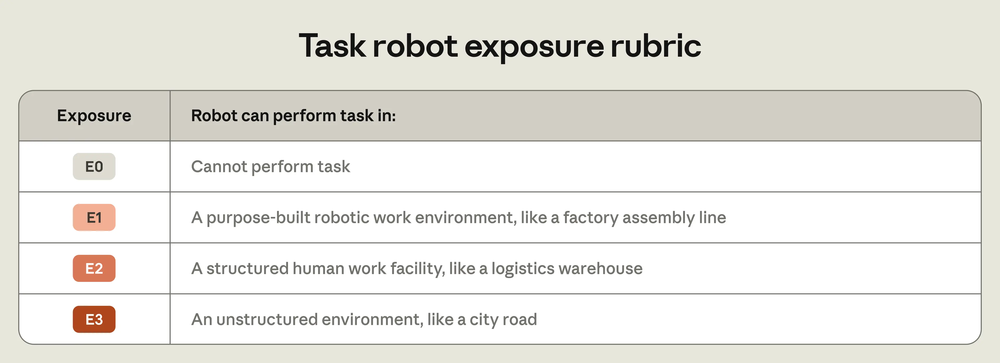
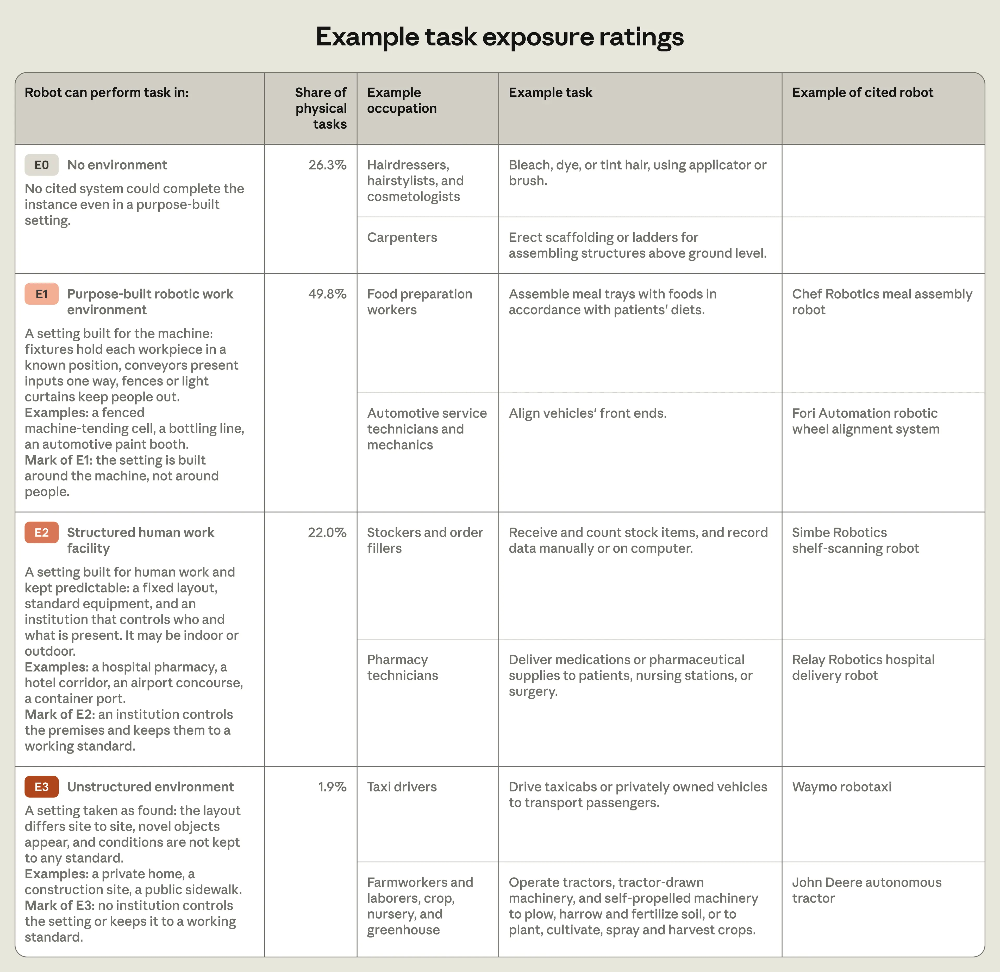
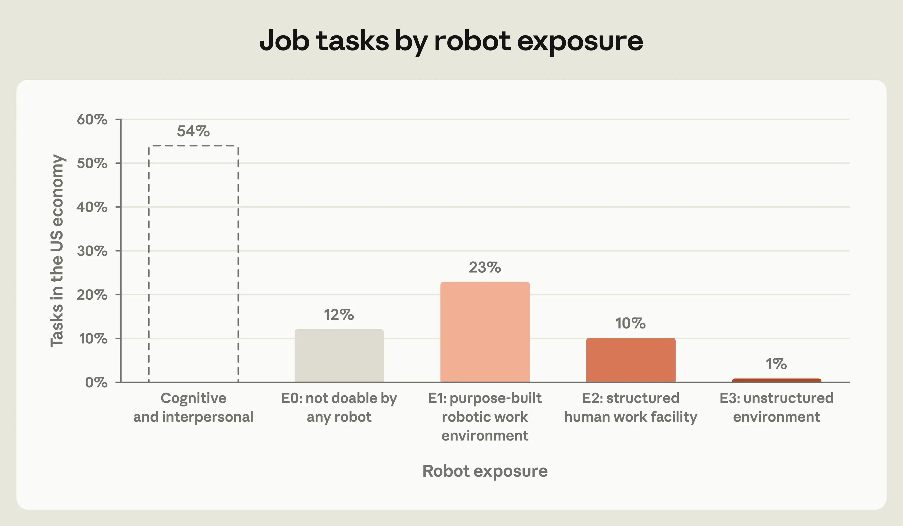
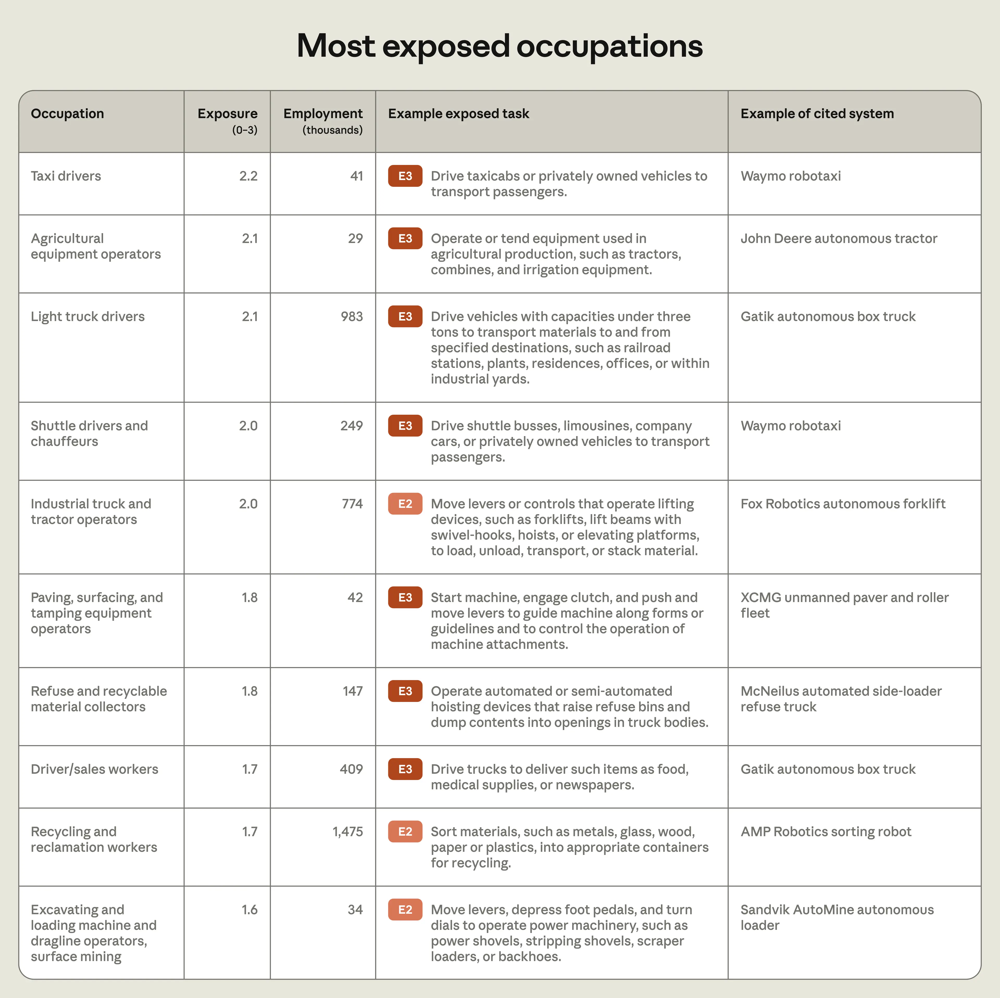
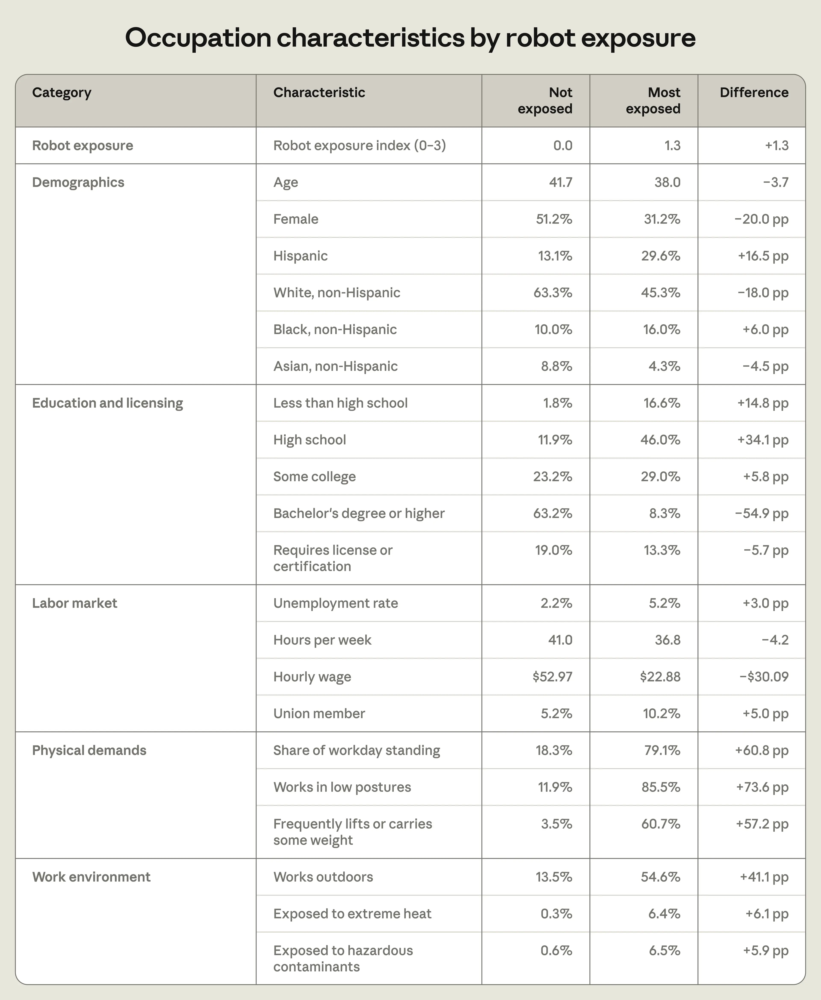
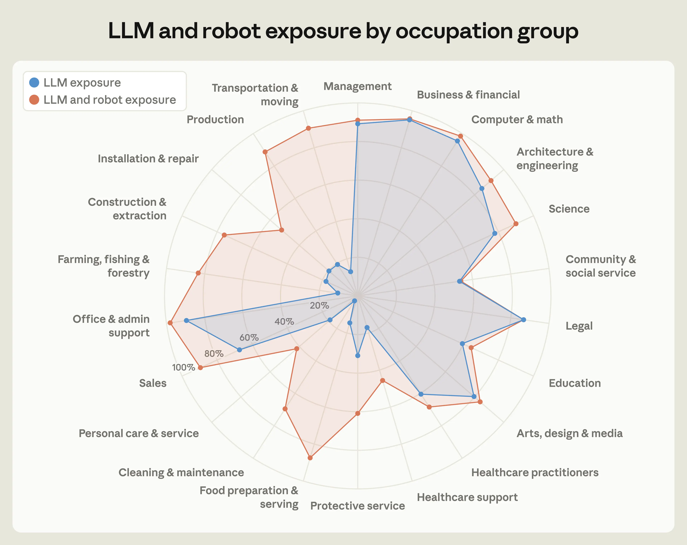
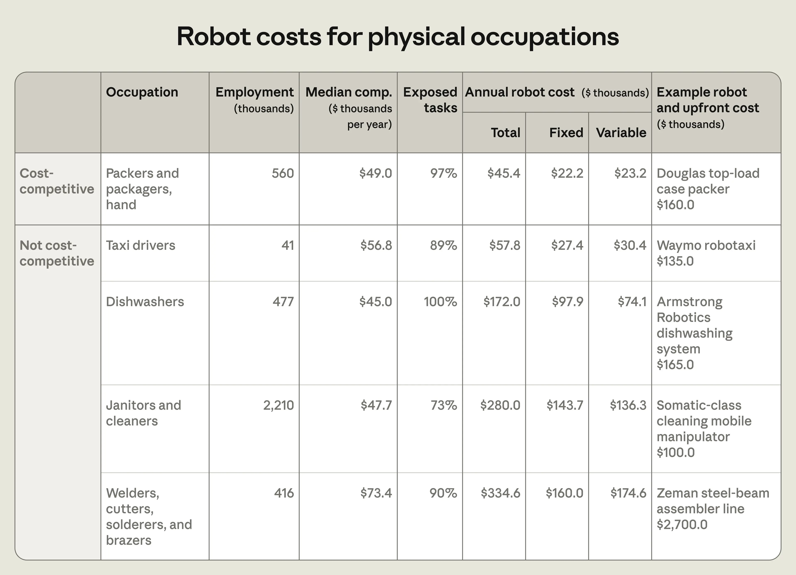
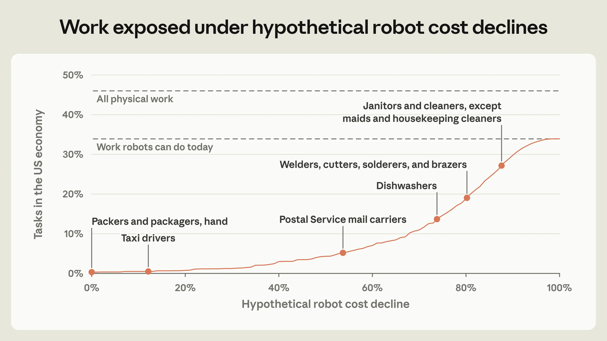

# 我们能预测机器人将做哪些工作吗？（中英对照）

> 原文标题：Can we predict the jobs robots will do?
> 原文链接：https://www.anthropic.com/research/what-work-can-robots-do
> 原文作者：Russell Legate-Yang, Maxim Massenkoff（Anthropic）
> 发布日期：2026-09-30
> **翻译模型：** GLM-5.3-Flash
> **评分：** ★★★★☆（4/5，强推荐）—— 机器人暴露指数首发：74% 的体力任务已被现有机器人覆盖却仅在 0.3% 上成本可与人工竞争，50 年回测验证，与 LLM 暴露合起来覆盖 80% 工作时间
> 排版：每段英文原文在前，中文翻译紧随其后。默认收录正文主体；文中上标数字（¹–⁴⁶）为对文末 References 的引用编号，References、附录与 BibTeX 未收录。

---

## 关键发现（Key findings）

- We present a robot exposure index based on how well robots can perform job tasks today.

  我们提出一个「机器人暴露指数」，基于现有机器人完成工作任务的能力。

- Robots, which we define as autonomous physical machines that sense and act, can perform three-quarters of physical tasks in the US, making up 34% of working hours, but mostly in limited settings. Workers exposed to robots are more likely to be male, less educated, and lower paid. For example, driving and warehouse jobs are highly exposed to currently available robots; nursing and general repair jobs are not, since present-day robots can do little of their work even in highly controlled environments.

  我们把机器人定义为「能感知并行动的自主物理机器」：它们已能完成美国四分之三的体力任务——占全部工时的 34%——但大多限于受控环境。暴露于机器人的劳动者更可能是男性、受教育程度更低、收入更低。例如驾驶与仓储工作对现有机器人高度暴露；护理与一般维修则不然——即便在高度受控的环境里，现在的机器人也几乎做不了这些工作。

- Overall, about 80% of job tasks by working time are exposed to either robots or LLMs. Robots do work where LLMs cannot. The remaining unexposed work is highly interpersonal or requires physical skills that robots today don't have.

  总体而言，按工时计约 80% 的任务已暴露于机器人或 LLM 之一。机器人做的是 LLM 做不了的工作。未被暴露的剩余工作高度依赖人际互动，或需要如今机器人不具备的物理技能。

- While robots can do most physical work tasks today, they are much more expensive than human labor. Robots are cost-competitive for just 0.3% of job tasks. If robot price declines follow past trends, it will take 40 years for that share to reach 10%. Beyond price, factors including capabilities, preferences, and regulations pose further barriers to robot automation.

  尽管机器人如今已能完成大多数体力任务，它们仍远贵于人工。机器人具备成本竞争力的任务只占 0.3%。若价格下降沿历史趋势，该比例要达到 10% 需要 40 年。价格之外，能力、偏好与监管等因素对机器人自动化构成进一步障碍。

- Over the past 50 years, jobs more exposed to robots experienced greater declines in wages and employment than others. At the same time, job exposure has grown: each year, robots have become able to do about 2% of the physical work they previously couldn't.

  过去 50 年里，暴露度更高的工作经历了比其他工作更大的工资与就业下滑。与此同时，暴露度本身也在增长：每年，机器人都变得能做此前做不了的体力工作的约 2%。

## 引言（Introduction）

Advances in large language models have raised the possibility of automating large swaths of work. But many jobs are physical. AI's impact on the economy will in part depend on robotics.¹

大语言模型的进步让自动化大块工作成为可能。但许多工作是体力活。AI 对经济的影响，将部分取决于机器人技术。¹

Predicting the pace of robot advances is difficult, but enumerating capabilities today, we argue, can give insight into the coming years. We develop a measure of job exposure to robots, using Claude to assess how well present-day robots can perform work tasks. A job is more exposed when robots can do more of its tasks in less controlled environments. A robot is cost-competitive when it can do the same task for cheaper than a human worker.

预测机器人进步的速度很难，但我们认为，盘点今天的能力可以洞察未来几年。我们开发了「工作对机器人的暴露度」度量，用 Claude 评估现有机器人完成工作任务的能力。当机器人能在更少受控的环境中完成一项工作的更多任务时，该工作的暴露度更高；当机器人以低于人类工人的成本完成同样任务时，即具备成本竞争力。

We find that robots can already perform 74% of physical tasks in the US, making up 34% of working hours. Robots and LLMs together expose all but one-fifth of employment.

我们发现机器人已能完成美国 74% 的体力任务——占工时的 34%。机器人与 LLM 合计，除五分之一的就业外全部被暴露。

But we also find significant barriers to adoption: most robots require highly structured environments, and are cost-competitive with people for just 0.3% of work. If robot price declines follow past trends, it will take 40 years for that share to reach just 10%. After cost, the main barrier is capability, such as the dexterity needed to untangle wires. Human preferences and regulations further limit robot adoption for a significant share of tasks.

但我们也发现显著的采用障碍：大多数机器人需要高度结构化的环境，且仅在 0.3% 的工作上与人类具备成本竞争力。若价格下降沿历史趋势，该比例要达到 10% 需要 40 年。成本之后，主要障碍是能力——比如解开缠线所需的灵巧；人类偏好与监管进一步限制了相当大比例任务的机器人采用。

Our core premise is that jobs are more likely to be impacted when robots can already do their work today. A backtest across 50 years validates this approach: from 1977 to today, jobs that were more exposed to existing robots experienced wage and employment declines in later decades.

我们的核心前提是：当机器人今天已能做某项工作时，该工作更可能受冲击。跨越 50 年的回测验证了这一思路：从 1977 年至今，暴露于既有机器人程度更高的工作，在此后几十年经历了工资与就业的下滑。

If the past is any guide, taxi drivers and warehouse packers will see changes sooner than nurses and mechanics. We expect that physical work will first be automated where robots have a foothold today.

如果历史有任何指示意义，出租车司机与仓储打包员将先于护士与技工看到变化。我们预计体力工作将首先在机器人今天已有立足点之处被自动化。

## 今天的机器人与明天的机器人（Robots today and tomorrow）

Most robots today operate in controlled environments like factories. Robots usually need to be programmed to interact with the physical world, whereas humans can adapt to their work environments. This has been a major hurdle for commercially viable robots.² But AI helps robots interpret and respond to their surroundings, allowing warehouse robots and autonomous vehicles to operate alongside humans.³

如今大多数机器人在工厂这类受控环境中运行。机器人通常需要被编程才能与物理世界交互，而人类能适应自己的工作环境。这一直是机器人商业化的主要障碍。² 但 AI 帮助机器人理解并响应周围环境，使仓储机器人与自动驾驶车辆得以与人类并肩运作。³

Many observers expect AI to improve robot capabilities quickly.⁴ Although spending on robots remains about 1% of total US equipment investment, business surveys suggest US robot adoption could nearly double within three years.⁵ And firms are investing billions to develop AI-powered robots that match human physical abilities.⁶

许多观察者预期 AI 将快速提升机器人能力。⁴ 尽管机器人支出仍只占美国设备总投资的约 1%，商业调查显示美国的机器人采用量三年内可能翻近一倍。⁵ 企业正投入数十亿美元开发具备人类体能的 AI 机器人。⁶

It's difficult to predict exactly how these efforts will affect jobs and productivity. A ranking of occupations by current robot task coverage suggests where the impacts will appear first. Robots should affect jobs that they can already do before jobs they could do only with new technology and, in some cases, accommodating regulations. Current capabilities are also concrete and measurable, while forecasts of future capabilities must bet on which technologies will succeed.⁷ Robots still in development support our focus on current exposure: firms are testing humanoids in car factories and warehouses, structured environments where robots are already common.⁷

很难精确预测这些努力将如何影响就业与生产率。按当前机器人任务覆盖率对职业排序，可以提示冲击将首先出现在哪里。机器人应当先影响它们已经能做的工作，再影响需要新技术（有时还需要配套监管）才能做的工作。当前能力是具体、可度量的，而对未来能力的预测只能押注哪种技术会成功。⁷ 仍在研发中的机器人也支持我们聚焦当前暴露度：企业正在汽车工厂与仓库——机器人已然常见的结构化环境——测试人形机器人。⁸

## 度量暴露度（Measuring exposure）

Our analyses use data from O*NET, a database of around 900 occupations linked with descriptions of around 19,000 job tasks. We identify a set of physical job tasks that we think could not be automated without robots. To do so, we have Claude score task descriptions on a rubric measuring physical, cognitive, and interpersonal work requirements.⁹ The task "Dig trenches" is physical; so is "Teach dance students," though this also requires cognitive and interpersonal skills. While typists use their hands to "Compute and verify totals on report forms, requisitions, or bills, using adding machine or calculator," this task doesn't count. Appendix A gives details, and Appendix F lists our prompts.

我们的分析使用 O*NET 数据——约 900 个职业关联约 19,000 条任务描述。我们识别出一组我们认为「没有机器人就无法自动化」的体力任务。做法是让 Claude 按一套量规为任务描述打分，量规度量任务的体力、认知与人际要求。⁹ 「挖沟」是体力任务；「教学生跳舞」也是——尽管它还需要认知与人际技能。打字员用手「用计算器计算并核对报表、请购单或账单上的总额」，但这不算体力任务。附录 A 给出细节，附录 F 列出我们的提示词。

Our task-level measure of robot exposure asks: can a robot today perform this task, and if so under what circumstances? We take robots to mean autonomous physical machines that sense and act, which includes car washes that scan cars to adjust sprayers and excludes teleoperated surgical machines fully controlled by a surgeon.¹⁰ We measure degrees of exposure by the kind of work environment a robot needs to perform a task.¹¹

我们的任务级机器人暴露度量问的是：今天的机器人能否完成这项任务？如果能，在什么条件下？机器人指能感知并行动的自主物理机器——包括扫描车辆以调整喷嘴的洗车机，不包括完全由外科医生操控的远程手术机器。¹⁰ 我们以机器人完成任务所需的工作环境类型来度量暴露程度。¹¹

Specifically, we sort tasks into four tiers of increasing exposure by where a robot can perform each task:

具体地，按机器人能执行每项任务的场所，我们把任务分为暴露度递增的四档：

- E0: Robot cannot perform task.

  E0：机器人无法执行该任务。

- E1: Robot can perform task in a purpose-built robotic work environment, like a factory assembly line.

  E1：机器人能在专建的机器人工作环境中执行，如工厂流水线。

- E2: Robot can perform task in a structured human work facility, like a logistics warehouse.

  E2：机器人能在结构化的人类工作设施中执行，如物流仓库。

- E3: Robot can perform task in an unstructured environment, like a city road.

  E3：机器人能在非结构化环境中执行，如城市道路。

Figure 1 also displays this rubric.

图 1 同样展示了这套量规。

> Task robot exposure rubric.

We think environmental control is a good measure of near-term automation risk. Because it's hard for robots to adapt to unpredictable environments, most deployed robots work in engineered environments, like those that spray paint cars on assembly lines. While these difficulties are thought to have slowed physical automation in the past, AI-powered robots could better adapt to their environments.¹²

我们认为环境受控程度是近期自动化风险的良好度量。由于机器人难以适应不可预测的环境，大多数已部署机器人都工作在工程化环境中，比如在流水线上为汽车喷漆的机器人。虽然这些困难被认为拖慢了过去的物理自动化，AI 驱动的机器人可以更好地适应环境。¹²

To determine exposure, we instruct Claude to search for specific robots relevant to each task and assess their capabilities and operating environments, quoting sources directly. We ask whether a robot could perform a task in versions of that task's typical work environment that are more or less structured. Getting robots to do seemingly simple tasks like loading a dishwasher requires many complex physical skills, so only demonstrated robot capabilities count.¹³ Robots must also do a task similarly well to humans, factoring in reliability, error rates, and speed.

为确定暴露度，我们指示 Claude 搜索与每项任务相关的具体机器人、评估其能力与运行环境，并直接引用来源。我们询问：在该任务典型工作环境或松或紧的版本中，机器人能否完成任务？让机器人做看似简单的任务（比如把碗碟装进洗碗机）需要许多复杂的物理技能，因此只有已被演示的机器人能力才计入。¹³ 机器人还必须把任务做得与人类相当好，把可靠性、错误率与速度计入。

For instance, self-driving cars couldn't "Drive taxicabs or privately owned vehicles to transport passengers" on real roads in the early 2010s. But they did drive around mock towns built for testing, a step toward today's autonomous vehicles.¹⁴ Our rubric would rate driving passengers at exposure level E1 at that time (robot can perform task in a purpose-built robotic work environment) and E3 today (in an unstructured environment).¹⁵

例如，2010 年代初自动驾驶汽车还无法「驾驶出租车或私家车运送乘客」上路；但它们已在为测试建造的模拟城镇中行驶——通往今天自动驾驶汽车的一步。¹⁴ 按我们的量规，当时的载客驾驶暴露度为 E1（机器人能在专建的机器人工作环境中执行），今天为 E3（非结构化环境）。¹⁵

This rubric requires many judgment calls. The O*NET task statements are often terse, and omit details that may be easy for humans but hard for robots.¹⁶ To describe work more concretely, we elicit detailed examples of how tasks are performed today, and how often these occur. Claude then scores exposure for these examples using web search to gauge robot capabilities. Cited sources must show robot deployments, commercial sales, or demonstrations, and results are similar if we omit ratings relying on demonstrations. Task exposure is set by majority rule: the least structured environment in which robots can do at least half of a task's examples, weighted by time.¹⁷

这套量规需要大量判断。O*NET 的任务陈述往往简略，省略了「对人容易、对机器人难」的细节。¹⁶ 为了更具体地描述工作，我们让 Claude 生成今天人们如何执行任务、频率如何的详细示例，再用网络搜索评估机器人能力、为这些示例打暴露分。被引用的来源必须展示机器人的部署、商业销售或演示；若剔除依赖演示的评级，结果仍然相近。任务暴露度按多数规则确定：按时间加权后，机器人至少能完成任务示例一半的、结构化程度最低的环境。¹⁷

Consider the task "Dig trenches." We first ask Claude to provide examples describing how workers perform this task today and how often. For example, Claude estimates that 25% of the time, this task requires "cutting a linear trench in open ground." Another 20% of the time, it requires "careful digging by hand around existing buried pipes, flowlines, cables and conduit." These activities require different sorts of physical abilities, like navigation and strength (linear trenches) compared to fine motor dexterity and perception (digging by hand around pipes).

以「挖沟」为例。我们先让 Claude 提供描述今天工人如何执行这项任务、频率如何的示例。比如 Claude 估计 25% 的时间这项任务需要「在开阔地面上切出直线沟渠」；另有 20% 的时间需要「在既有埋管、管线、电缆与导管周围小心地手工挖掘」。这些活动需要不同的物理能力：直线沟渠靠导航与力量，绕管手工挖掘靠精细运动灵巧与感知。

Claude rates the first example at exposure E3, citing a control system that retrofits hydraulic excavators to autonomously dig trenches.¹⁸ Robots today can't carefully dig around buried pipes, so the latter example is unexposed at E0. More examples for "Dig trenches" resemble careful digging than linear trenching, so overall this task is unexposed in our ratings.

Claude 把第一个示例评为 E3，引用了一套把液压挖掘机改装为自主挖沟设备的控制系统。¹⁸ 今天的机器人无法小心地绕开埋管挖掘，所以后一示例为 E0 未暴露。「挖沟」的更多示例更接近小心挖掘而非直线开沟，因此整体上这项任务在我们的评级中未暴露。

Figure 2 gives examples of task ratings, along with fuller descriptions of each exposure tier from our exposure prompt and a robot cited to support each rating. We also calculate the share of physical tasks in each tier: here and throughout, each task is weighted by the number of workers who do it, and by the fraction of working time they spend on it, which we estimate with Claude.¹⁹

图 2 给出任务评级示例，附我们暴露提示词中对每一档暴露度更完整的描述、以及支持每个评级的一条机器人引用。我们还计算了各档体力任务的份额：此处及全文，每项任务都按从事它的劳动者人数与他们在其上花费的工时比例加权，后者由 Claude 估计。¹⁹

> Example task exposure ratings.

Tasks that robots can't do (E0) make up about a quarter of physical tasks by estimated working time. These tasks require physical skills that are hard for robots, like fine motor dexterity for "Bleach, dye, or tint hair, using applicator or brush" and strength, balance, and mobility for "Erect scaffolding or ladders for assembling structures above ground level."

机器人做不了的任务（E0）按估计工时约占体力任务的四分之一。这些任务需要机器人难以具备的物理技能：如「用涂抹器或刷子漂白、染色或给头发上色」所需的精细运动灵巧，以及「为地面以上结构的搭建竖起脚手架或梯子」所需的力量、平衡与移动能力。

Robots can do half of physical tasks in purpose-built environments but not in wider settings (E1). Food prep robots pack ready-to-eat meals on conveyor belts, and new models with AI can adjust to different ingredients, portions, and trays, so the task "Assemble meal trays with foods in accordance with patients' diets" is rated E1.

一半的体力任务机器人只能在专建环境中完成、无法推广到更宽的场所（E1）。备餐机器人在传送带上打包即食餐，配备 AI 的新型号能适应不同食材、份量与托盘，因此「按患者膳食装配餐盘」被评为 E1。

Another 22% of physical tasks can be done by robots in structured human workplaces (E2). Hospital delivery robots, for example, "Deliver medications or pharmaceutical supplies to patients, nursing stations, or surgery." Today's robots do only 2% of physical tasks in unstructured environments (E3). These often involve driving, done by autonomous cars, tractors, and other vehicles.²⁰

另有 22% 的体力任务机器人能在结构化的人类工作场所完成（E2）。例如医院配送机器人「把药品或药剂配送到患者、护理站或手术室」。如今的机器人只能在 2% 的体力任务上于非结构化环境运作（E3）——这些常涉及驾驶，由自动驾驶汽车、拖拉机与其他车辆完成。²⁰

Our accompanying data release contains Claude's reasoning and cited sources for all rated tasks. For example, Claude rates the task "Weld components in flat, vertical, or overhead positions" E1, and quotes an article about AI-powered robot welders: "Path Robotics said both of its welding cells can autonomously weld steel parts and are deployed in fabrication shops across the U.S. and Canada."²¹

我们随报告发布的数据包含全部受评任务上 Claude 的推理与引用来源。例如 Claude 把「在平焊、立焊或仰焊位置焊接部件」评为 E1，并引用一篇关于 AI 焊接机器人的报道：「Path Robotics 表示其两个焊接单元均可自主焊接钢制部件，已部署于美国与加拿大的制造车间。」²¹

We define a robot exposure index for jobs that averages a job's task exposure ratings on a 0–3 scale. This index rises with the share of exposed tasks and robot capabilities on those tasks, weighting tasks by estimated working time.

我们为职业定义「机器人暴露指数」：把一个职业各项任务的暴露评级在 0–3 尺度上取平均。指数随被暴露任务的份额及机器人在这些任务上的能力而上升，任务按估计工时加权。

An ideal exposure index would perfectly predict robot automation in the coming years. Since we can't look forward in time, we instead try to validate our measure using historical data on jobs and task descriptions. We rate robot exposure in several years since 1977, and link exposure to changes in wages and employment. When a job was more exposed to robots, its wages and employment fell in later decades, even after accounting for industry trends and other potential confounders. These results, detailed in Appendix B, give us some confidence that our measure can predict future job disruption.

理想的暴露指数应能完美预测未来几年的机器人自动化。由于无法前瞻时间，我们改用职业与任务描述的历史数据验证度量：我们对 1977 年以来的若干年份评定机器人暴露度，并把暴露度与工资、就业的变化关联。当一项工作对机器人暴露更高时，其工资与就业在此后几十年下滑——即便控制了行业趋势与其他潜在混杂因素。这些结果详见附录 B，让我们对「该度量能预测未来的工作冲击」有了一定信心。

## 机器人能做什么工作？（What work can robots do?）

Figure 3 summarizes robot exposure across all job tasks in the US economy, weighting tasks by the estimated fraction of time spent per task for an occupation and that occupation's employment. Cognitive and interpersonal work makes up 54% of tasks by working time. The remaining 46% of tasks are physical. As a share of all tasks, around 12% cannot be done by any robot today (E0), 23% can be done by robots in specially built environments (E1), 10% in structured human workplaces (E2), and 1% in unstructured environments (E3). Counting any exposure level, 74% of physical work, or 34% of all work, can be done by robots in some circumstances.

图 3 汇总了美国经济中全部任务对机器人的暴露度，任务按「职业内每项任务的估计时间占比 × 该职业就业」加权。认知与人际工作按工时占任务的 54%，其余 46% 是体力任务。占全部任务的比例：约 12% 今天任何机器人都做不了（E0）；23% 能在专建环境中完成（E1）；10% 能在结构化人类工作场所完成（E2）；1% 能在非结构化环境中完成（E3）。计入任何暴露级别：74% 的体力工作——或全部工作的 34%——在某些条件下可由机器人完成。

> Job tasks by robot exposure.

Robots can do physical tasks in many parts of the economy. Autonomous mobile warehouse robots drive to loading docks and inside trailers. They use suction cups to grab packages and load them onto mobile conveyor belts.²² Since these robots navigate structured human workplaces, many warehousing tasks are rated E2, like "Move freight, stock, or other materials to and from storage or production areas, loading docks, delivery vehicles, ships, or containers, by hand or using trucks, tractors, or other equipment." Advances in navigation and handling have made robots like these common in logistics and transportation.²³

机器人能在经济的许多部分执行体力任务。自主移动仓储机器人开到装卸码头、驶入挂车，用吸盘抓起包裹、装上移动传送带。²² 由于这些机器人在结构化的人类工作场所中导航，许多仓储任务被评为 E2，比如「以手工或使用卡车、拖拉机或其他设备，搬运货物、库存或其他材料进出存储或生产区域、装卸码头、配送车辆、船舶或集装箱」。导航与搬运的进步使这类机器人在物流运输中已很常见。²³

Figure 4 shows the 10 most exposed occupations by our robot exposure index. Of these 10 occupations, 9 are vehicle operators. Robots cited for driving jobs include autonomous cars, tractors, trucks, and pavers. Taxi drivers lead exposure with an index of 2.2.²⁴ Since driving is most of the job, their median task by working time is exposed at E3, while auxiliary tasks like "Vacuum and clean interiors and wash and polish exteriors of automobiles" are doable by robots but in more structured settings than open roads. Autonomous vehicles have yet to upend driving jobs at scale, but their capabilities suggest that these jobs are at higher risk of automation than others.²⁵

图 4 展示按机器人暴露指数排名前 10 的职业。其中 9 个是车辆操作员。驾驶类工作引用的机器人包括自动驾驶汽车、拖拉机、卡车与摊铺机。出租车司机以 2.2 的指数居首。²⁴ 由于驾驶占该职业的大部分，按工时取其中位任务暴露于 E3；而「用吸尘器清洁汽车内部、清洗并抛光汽车外部」这类辅助任务机器人也能做，只是要在比开放道路更结构化的场所。自动驾驶汽车尚未大规模颠覆驾驶岗位，但其能力提示这些岗位的自动化风险高于其他职业。²⁵

> Most exposed occupations.

An occupation can cover many work settings. In the US, robots may only operate in some of these settings, while robots abroad sometimes cover all of them. For example, stockers and order fillers do the task "Stock shelves, racks, cases, bins, and tables with new or transferred merchandise" in retail stores and in warehouses. In US warehouses, AI-powered robots with touch sensors pick and stow merchandise.²⁶ In US retail, mobile robots scan for empty shelves, but must alert humans to restock them.²⁷ Robots in Japanese convenience stores restock fridges themselves.²⁸ Since stocker robots require items to be brought near them, this task is rated E1. We estimate that stockers spend 70% of their time on tasks rated E1 like this one, and another 16% on tasks rated E2. In total, they score 1.0 on the robot exposure index.

一个职业可能覆盖多种工作场所。在美国，机器人也许只能在其中部分场所运行，而国外的机器人有时能覆盖全部。例如理货员与补货员在零售店与仓库里执行「用新品或调拨商品充实货架、料架、货箱、料仓与台面」。在美国仓库里，带触觉传感器的 AI 机器人拣选并存放商品。²⁶ 在美国零售业，移动机器人扫描空货架，但必须提醒人类补货。²⁷ 日本便利店的机器人则自己为冷柜补货。²⁸ 由于理货机器人需要把商品送到它附近，该任务被评为 E1。我们估计理货员 70% 的时间花在这类 E1 任务上，另有 16% 在 E2 任务上。合计他们在机器人暴露指数上得 1.0。

Jobs can be exposed to robots if many of their tasks are moderately exposed, or if some of their most time-intensive tasks are highly exposed. Compare tapers, who finish drywall and whose exposure index is 1.6, with recycling and reclamation workers, who sort recycling and whose exposure index is 1.7.

一项工作的暴露可以来自「许多任务中度暴露」，也可以来自「最耗时的部分任务高度暴露」。比较接缝带工（抹平石膏板，指数 1.6）与回收分拣工（分拣回收物，指数 1.7）。

Tasks for tapers are split between unexposed and highly exposed. Workers building interior walls use paper tape and a paste called mud to smooth over seams, joints, and screws in drywall sheets. Mud and tape are messy materials, so robots cannot perform the task "Press paper tape over joints to embed tape into sealing compound and to seal joints." After the first tape coat dries, workers "Apply additional coats to fill in holes and make surfaces smooth." This task is rated E3: an autonomous drywall robot uses AI to scan walls, spray additional coats of sealant, and sand walls once dry.²⁹ Overall, by work time, 41% of tapers' tasks are exposed at E3, while robots cannot do another 26%.

接缝带工的任务在未暴露与高度暴露之间分裂。建造内墙的工人用纸带与被称为「腻子」的膏体抹平石膏板的接缝、节点与螺钉。腻子和纸带是黏糊的材料，机器人做不了「把纸带压在接缝上、将其嵌入密封剂并封住接缝」。第一层带干后，工人「再涂数层以填孔并使表面平滑」——该任务被评为 E3：一台自主石膏板机器人用 AI 扫描墙面、喷涂额外的密封剂涂层，干后打磨。²⁹ 总体按工时，接缝带工 41% 的任务暴露于 E3，另有 26% 机器人做不了。

In contrast, for recycling and reclamation workers, robots can perform over three-quarters of tasks by work time at level E2. Only 8% of their work time is unexposed. For example, robots with computer vision and suction grippers can do the task "Sort materials, such as metals, glass, wood, paper or plastics, into appropriate containers for recycling."³⁰ These robots stand in for workers picking recycling from conveyor belts, so this and other tasks are rated E2.

相比之下，回收分拣工按工时计有超过四分之三的任务能在 E2 档由机器人完成，仅 8% 的工时未暴露。例如带计算机视觉与吸盘夹爪的机器人能做「把金属、玻璃、木材、纸张或塑料等材料分拣到适当的回收容器中」。³⁰ 这些机器人替代了在传送带旁分拣回收物的工人，因此该任务及其他任务被评为 E2。

Robots are highly capable at specific tasks for tapers, while for recycling workers exposure is broader, but robots are less adaptable. Messy tasks for tapers may bottleneck automation. It's also possible that the largest recycling facilities use robots early, while smaller facilities adopt them later. Either way, robots seem likely to change both jobs if widely deployed.

对接缝带工，机器人在特定任务上能力很强；对回收分拣工，暴露面更广但机器人适应性较弱。接缝带工那些黏糊的任务可能成为自动化的瓶颈。也可能最大的回收设施会先用机器人，小型设施后跟进。无论如何，若广泛部署，机器人看来都会改变这两种工作。

## 暴露职业的特征（Characteristics of exposed jobs）

Having established our exposure measure, we now consider what exposure might imply for the labor market.

确立暴露度量后，我们接下来考虑暴露度对劳动力市场可能意味着什么。

Figure 5 compares workers in the top quintile of the robot exposure index with unexposed workers, who make up another 20% or so of jobs. Data from the 2020–2024 American Community Survey show that highly exposed workers are 20 percentage points less likely to be female and 16 percentage points more likely to be Hispanic. These workers are also 55 percentage points less likely to hold a bachelor's degree or higher, earn around $30 less per hour, and face an unemployment rate more than twice as high.³¹

图 5 把机器人暴露指数最高五分位的劳动者与未暴露劳动者（约占工作数的另 20%）对比。2020–2024 年美国社区调查数据显示：高暴露劳动者为女性的可能性低 20 个百分点、为西语裔的可能性高 16 个百分点；持有学士及以上学位的可能性低 55 个百分点，时薪低约 30 美元，失业率高出两倍多。³¹

Occupational requirement statistics compiled by the Bureau of Labor Statistics also show that robot-exposed jobs are much more likely to require carrying weight and working in extreme heat or near hazardous contaminants. This exposure pattern is in many ways the opposite of what's typically found for LLMs.³²

劳工统计局汇编的职业要求统计同样显示：机器人暴露的工作更可能需要负重、在极端高温或危险污染物附近工作。这一暴露模式在许多方面与 LLM 的典型发现相反。³²

> Occupation characteristics by robot exposure.

## 机器人与 LLM 暴露（Robot and LLM exposure）

We next analyze whether robots broaden job disruption risks beyond those from LLMs alone. Drawing on Eloundou et al. (2024) and Massenkoff and McCrory (2026), we compare two occupation exposure measures:

接下来我们分析机器人是否把工作冲击风险扩展到 LLM 之外。借鉴 Eloundou et al. (2024) 与 Massenkoff and McCrory (2026)，我们比较两种职业暴露度量：

- LLM exposure: the share of job tasks for which an LLM could halve required time (called theoretical capability in our prior work).

  LLM 暴露：LLM 能把所需时间减半的任务份额（在我们此前的工作中称「理论能力」）。

- LLM and robot exposure: the share of job tasks exposed to either LLMs or robots, taking the higher of LLM exposure and E1+ robot exposure for each task.

  LLM 与机器人暴露：暴露于 LLM 或机器人任一方的任务份额，每项任务取 LLM 暴露与 E1 及以上机器人暴露中的较高者。

Robot and LLM exposure ratings measure somewhat different concepts, but both indicate that technology could do much of a given task. While integrating LLMs and robots in actual jobs may present new challenges or enable new capabilities, these two measures provide initial insight into job exposure based on today's capabilities.

机器人与 LLM 的暴露评级度量的概念略有不同，但都表明技术能完成给定任务的很大部分。虽然在真实工作中整合 LLM 与机器人可能带来新挑战或新能力，这两种度量仍基于今天的能力，为工作暴露提供了初步洞察。

Figure 6 plots job exposure to LLMs alone (in blue) and to LLMs and robots (in orange), grouped by broad occupation category. Robots expose more and different kinds of jobs than LLMs alone. While less than 15% of transportation & moving tasks are exposed to LLMs alone, about 90% of these tasks are exposed with robots. Similarly, robots raise exposure in office & admin support jobs, which largely involve computer work and light physical tasks, to nearly 100%. Overall, around half of work is exposed to LLMs alone, but that rises to 81% when considering robots.

图 6 按宽口径职业类别绘制了对 LLM 单独（蓝）与对 LLM 加机器人（橙）的工作暴露。相比 LLM 单独，机器人暴露了更多、也更不同类型的工作。交通与物料搬运类任务对 LLM 单独暴露不足 15%，加上机器人后约 90% 被暴露；办公室与行政支持类工作（主要是计算机工作与轻体力任务）的暴露度被机器人推到近 100%。总体上，约一半的工作暴露于 LLM 单独；考虑机器人后升至 81%。

> LLM and robot exposure by occupation group.

What work can't LLMs and robots do today? Consider personal care & service jobs, for which around 40% of tasks are exposed. In-person social interaction and physical contact with humans, which both LLMs and robots struggle with, are important for these jobs. This example suggests that highly interpersonal work, or work requiring delicate manipulation, may be less susceptible to near-term automation.³³ Occupation groups like installation & repair, healthcare support, and community & social service fit this pattern too, with relatively low exposure. While LLMs and robots can't perform these tasks today, no occupation group overall is less than 40% exposed. And advances in technology may make possible new kinds of automation over time.

LLM 与机器人今天做不了什么工作？看看个人护理与服务类工作——约 40% 的任务被暴露。面对面的社会互动与与人的身体接触——LLM 与机器人都不擅长——对这类工作很重要。这个例子提示：高度人际的工作、或需要精细操作的工作，近期被自动化的可能性较低。³³ 安装维修、医疗支持、社区与社会服务等职业组也符合这一模式，暴露度相对较低。虽然 LLM 与机器人今天做不了这些任务，但没有任何职业组的总暴露度低于 40%。而且技术进步随时间推移可能催生新的自动化形式。

Unexposed tasks also help describe what could make work hard to automate. We group unexposed task statements that share similar text, and ask Claude to describe these (Appendix C.1). Tasks not exposed to LLMs or robots today tend to be hands-on and face-to-face, and are sometimes regulated. Healthcare tasks often combine these features, like "Administer medications to patients and monitor patients for reactions or side effects."

未被暴露的任务也有助于刻画什么让工作难以自动化。我们把文本相近的未暴露任务陈述分组，让 Claude 概括（附录 C.1）。今天未暴露于 LLM 或机器人的任务往往是动手且面对面的，有时受监管。医疗任务常兼具这些特征，比如「为患者施药并监测反应或副作用」。

In Appendix C.2, we study which barriers may most prevent the automation of physical tasks. We ask Claude which barriers today would prevent robots from doing a significant share of each physical task, exposed or not, if unresolved. We group these into four categories: capabilities, human preferences, regulation, and cost. For tasks limited by capabilities, we have Claude pick the most important missing skill from manipulation, planning and reasoning, mobility and strength, and perception.

在附录 C.2 中，我们研究哪些障碍最能阻止体力任务的自动化。我们让 Claude 判断：若不解决，今天的哪些障碍会阻止机器人完成每项体力任务（无论是否暴露）的显著份额。我们把障碍归为四类：能力、人类偏好、监管与成本。对受能力限制的任务，我们让 Claude 从「操作、规划与推理、移动与力量、感知」中挑出最重要的缺失技能。

We find that capabilities and costs are the biggest impediments to robot adoption. Capabilities prevent adoption for around 70% of physical tasks. Manipulation capabilities stand out: half of physical tasks wouldn't be automated at scale unless robots become more adept at touching and handling objects. Shortcomings in planning and reasoning skills, which AI seems most likely to improve, limit robot automation for 8% of physical tasks. For nearly all tasks, costs would also need to fall.

我们发现能力与成本是机器人采用的最大阻碍。能力阻止了约 70% 体力任务的采用。操作（manipulation）能力最为突出：一半的体力任务，除非机器人变得更擅长触碰与处置物体，否则无法规模化自动化。规划与推理技能的不足——AI 看来最可能改进的部分——限制了 8% 体力任务的机器人自动化。对几乎所有任务而言，成本也还需下降。

Our estimates indicate that today's regulations wouldn't allow robots to perform 14% of physical tasks. Regulation matters for tasks in healthcare, protective service, and education, but less so for those in food preparation, cleaning, production, construction, repair, and material moving, which make up about half of physical work. Human preferences hold back robots for a quarter of tasks. That may be because people wouldn't trust a robot (to "Dress children and change diapers") or because they value social interaction (to "Greet guests, escort them to their seats, and present them with menus and wine lists").

我们的估计显示，今天的监管不允许机器人执行 14% 的体力任务。监管对医疗、保护服务与教育中的任务关系重大，对食品制备、清洁、生产、建筑、维修与物料搬运（约占体力工作的一半）中的任务则关系较小。人类偏好对四分之一任务的机器人构成阻碍：也许因为人们不信任机器人（「给孩子穿衣、换尿布」），也许因为人们重视社交互动（「迎宾、引座、递上菜单与酒单」）。

If robot capabilities develop quickly, what do these results imply? Around 30% of physical tasks are limited either by preferences or by regulation. That would leave most physical work exposed if robots became capable and cost-effective, though the rest may become weak links that drag down aggregate productivity speedups. Uneven progress in capabilities could also slow adoption, if robots became smarter but still couldn't handle objects like humans. That said, better robots could also reduce resistance to automation, for example by assuaging safety concerns. We turn next to robot costs, the most common barrier in these estimates.

如果机器人能力快速进步，这些结果意味着什么？约 30% 的体力任务受偏好或监管限制。这意味着若机器人变得有能力且划算，大多数体力工作仍将被暴露——尽管剩余部分可能成为拖累总体生产率提速的薄弱环节。能力进步的不均衡也可能拖慢采用：机器人更聪明了却仍不能像人一样处置物体。话说回来，更好的机器人也可能降低对自动化的抵触，比如缓解安全顾虑。接下来看机器人成本——这些估计中最常见的障碍。

## 机器人成本与采用（Robot costs and adoption）

Though robots can perform most physical work today, it may not be economical for them to do so. Robots made with pricey hardware aren't as easily copied and distributed as software or LLMs. Compared to LLM exposure measures that assess capabilities but not costs, it's especially important to distinguish jobs exposed to cost-competitive robots.³⁴

尽管机器人今天已能完成大多数体力工作，让它们去做未必经济。用昂贵硬件造出的机器人不像软件或 LLM 那样易于复制分发。与只评估能力不评估成本的 LLM 暴露度量相比，区分「暴露于具备成本竞争力的机器人的工作」尤为重要。³⁴

For every exposed task, we estimate the annual cost for robots to perform this task based on the specific robots cited in our task exposure measures. We prompt Claude to estimate costs using web search and the list of robots cited for each task. Automating an E1-exposed task could require redesigning workplaces to suit robots, while robots that do E3 tasks may use expensive sensors to navigate unstructured environments.

对每项被暴露的任务，我们基于任务暴露度量中引用的具体机器人，估算机器人执行该任务的年度成本。我们提示 Claude 用网络搜索与每项任务引用的机器人清单来估计成本。自动化一项 E1 暴露任务可能需要为机器人改造工作场所，而做 E3 任务的机器人可能要用昂贵传感器在非结构化环境中导航。

Estimates cover the full cost of deploying a robot to perform each task.³⁵ To make robot and labor costs comparable, we first ask Claude to estimate how much a human worker typically produces on a task in a year. Bakers who "Roll, knead, cut, or shape dough," for example, produce an estimated 180,000 shaped pieces per year. Claude then estimates what it would cost a robot to produce the same output. Because bakers do this task in different environments, Claude averages robot deployment costs across retail, mid-scale, and industrial bakeries. Fixed costs are annualized to reflect hardware lifespans and the time value of money.

估计涵盖部署机器人执行每项任务的全部成本。³⁵ 为了让机器人成本与人工成本可比，我们先让 Claude 估计一名人类工人一年在该任务上通常的产出：比如「揉、擀、切或整形面团」的面包师，估计年产 18 万件成型面点。随后 Claude 估算机器人产出同样产出的成本。由于面包师在不同环境中执行这项任务，Claude 对零售、中试与工业面包房的机器人部署成本取平均。固定成本按硬件寿命与资金时间价值年化。

Calculated this way, costs for robots to do a task can be compared to worker pay. We say a task is exposed to cost-competitive robots if its robot cost is less than its labor cost, calculated as the occupation's total compensation from the BLS scaled by the fraction of time spent on this task.³⁶ Standard economic models predict that these tasks are automated, though given adoption frictions and cost uncertainties this measure is more suggestive.³⁷ See Appendix D.1 for details and a worked example of robot task costs.

按此计算，机器人做一项任务的成本就能与工人报酬对比。若某任务的机器人成本低于其人工成本——按 BLS 该职业总报酬乘以该任务的时间占比计算——我们称该任务暴露于具备成本竞争力的机器人。³⁶ 标准经济学模型预言这类任务会被自动化；但考虑到采用摩擦与成本的不确定性，这一度量更多是提示性的。³⁷ 细节与机器人任务成本的算例见附录 D.1。

Robots often perform multiple job tasks, but we estimate costs for individual tasks in an occupation. Simply adding up task costs may double count robots or undercount coordination costs in real deployments. We aggregate by occupation, providing Claude with task cost estimates and asking for a total cost, net of redundancies and new additions. We say that an occupation is exposed to cost-competitive robots if this total robot cost is less than its total compensation scaled by the fraction of time spent on tasks that robots can do.³⁸

机器人常执行多项工作任务，而我们对职业内任务逐个估计成本。简单把任务成本相加，可能重复计算机器人或低估真实部署中的协调成本。我们按职业聚合：向 Claude 提供各任务成本估计，要求给出扣除冗余、计入新增后的总成本。若该总成本低于「该职业总报酬 × 可由机器人完成的任务时间占比」，我们称该职业暴露于具备成本竞争力的机器人。³⁸

Figure 7 shows five highly physical jobs and cost estimates for robots to perform their exposed tasks. Packers and packagers are the largest occupation exposed to cost-competitive robots. Several robots are needed to do packers and packagers' tasks, including those that pack containers, move materials around warehouses, visually inspect goods, erect cardboard boxes, print and apply labels, and seal packages.³⁹ These robots are estimated to cost over $2 million to purchase and install, but replace the yearly work of around 14 workers. Fixed costs are spread over a roughly 10-year service life at an 8% cost of capital. Operating expenses, such as maintenance, part-time human supervision, and energy, bring annual costs to around $45,000 to replace one human worker per year. Since packers and packagers spend 97% of their time on tasks that robots can do and cost around $49,000, robots cost about $2,500 less per year to do that work.

图 7 展示五个高度体力的职业及机器人执行其被暴露任务的成本估计。打包员与包装工是暴露于成本竞争力机器人的最大职业。完成其任务需要多台机器人：装集装箱的、在仓库内搬运转运的、目视检验货物的、立纸箱的、打印张贴标签的、封箱的。³⁹ 估计购买与安装这些机器人花费超过 200 万美元，但可替代约 14 名工人的年工作量。固定成本按约 10 年服役期、8% 资金成本摊销。维护、兼职人工监督与能耗等运营开支使替代一名工人每年的成本约为 4.5 万美元。由于打包员与包装工 97% 的时间花在机器人能做的任务上、年成本约 4.9 万美元，机器人做这些工作每年便宜约 2,500 美元。

> Robot costs for physical occupations.

The US currently employs around 560,000 packers and packagers. Firms face adoption frictions, like regulation or borrowing limits, and these cost estimates are approximate. For example, robotaxis are estimated to cost only around $7,000 more than taxi drivers, but face regulatory hurdles.⁴⁰ That said, automation risks are likely higher for physical jobs that cost-competitive robots can do. Employment for packers and packagers has fallen 22% since 2015. And the BLS projects this occupation will shed the 11th-most jobs of any occupation by 2035, behind only correctional officers and 9 sales and office occupations.⁴¹

美国目前雇用约 56 万名打包员与包装工。企业面临监管、借贷限制等采用摩擦，且这些成本估计是近似的。例如，据估计 Robotaxi 只比出租车司机贵约 7,000 美元，却面临监管障碍。⁴⁰ 话虽如此，具备成本竞争力的机器人能做的体力工作，自动化风险可能更高。自 2015 年以来，打包员与包装工的就业已下降 22%。BLS 预计到 2035 年该职业的岗位流失量在所有职业中排第 11 位，仅次于惩教人员与 9 个销售及办公室职业。⁴¹

For the other jobs shown in Figure 7, robots cost much more than humans even though they can do much of the work. In metalworking, robots with cameras and AI can weld autonomously.⁴² But human welders perform many tasks that enable welding, like positioning large metal parts, climbing ladders to weld hard-to-reach joints, checking quality, and grinding and finishing materials. Automating this work requires robots that together cost around five times more than human welders.

对图 7 中的其他工作，机器人虽然能做大部分工作，成本却远高于人类。在金属加工中，带相机与 AI 的机器人能自主焊接。⁴² 但人类焊工还执行许多保障焊接的任务：为大金属件定位、爬梯焊接难及的节点、质检、打磨与修整材料。自动化这些工作所需的机器人合计成本约为人类焊工的五倍。

Dishwashers, along with janitors and cleaners, are paid $25,000 to $30,000 less than welders. But their robot analogs are still several times more expensive. Cleaning is hard to standardize and streamline, and robot cleaners are often slower than humans and limited to specific tasks.⁴³

洗碗工与门卫、保洁员的报酬比焊工低 2.5 万至 3 万美元，但对应的机器人仍贵数倍。清洁难以标准化与流水线化，清洁机器人往往比人慢、且限于特定任务。⁴³

Figure 8 summarizes robot costs by plotting exposure to cost-competitive robots at hypothetical, uniform declines in robot costs. For example, if robots cost 20% less today, they would be cost-competitive for the physical work done by 2.8 million workers. These workers spend on average 42% of their time on work exposed to robots, 0.8% of all working time in the economy. For reference, industry and government data suggest that robot prices have declined roughly 3% per year since the 1990s. At this rate, it would take around seven years to reach a 20% cost decline. Appendix E discusses historical robot price data in more detail.

图 8 汇总机器人成本：绘制在假想的、统一的机器人降价幅度下的成本竞争力暴露。例如，若机器人今天降价 20%，将对 280 万劳动者所从事的体力工作具备成本竞争力。这些劳动者平均 42% 的时间花在暴露于机器人的工作上——占经济中全部工时的 0.8%。作为参照，行业与政府数据表明自 1990 年代以来机器人价格每年下降约 3%。按此速度，降价 20% 约需七年。附录 E 更详细讨论了历史机器人价格数据。

Though robots can theoretically do tasks that add up to 34% of all work time, they are cost-competitive for just 0.3% today. Still, that includes roughly 300,000 workers for whom robots can do 95% of their tasks.⁴⁴ As Figure 7 suggested, robots today are cost-competitive or close to it for packers and packagers and taxi drivers, but far from it for most other jobs.

尽管机器人在理论上能完成的任务合计占全部工时的 34%，今天具备成本竞争力的只有 0.3%。不过这已包括约 30 万名「机器人能完成其 95% 任务」的劳动者。⁴⁴ 如图 7 所示，今天的机器人对打包员与包装工、出租车司机已具备或接近具备成本竞争力，对多数其他工作则相去甚远。

For robots to be cost-competitive for 10% of human work today, costs would need to decline about 70%. At a 3% decline per year, that would take around 40 years. That said, it's possible that new, more capable robots like humanoids or new manufacturing processes will drive down costs to automate human work. Reports suggest that global production could scale quickly if there were intense demand for humanoids and other robots.⁴⁵

要让机器人对今天 10% 的人类工作具备成本竞争力，成本需下降约 70%。按每年 3% 的降幅，约需 40 年。不过，人形机器人这类更强的新机器人或新的制造工艺可能压低自动化人类工作的成本。有报告称，若对人形机器人及其他机器人的需求足够强烈，全球产量可以快速扩张。⁴⁵

> Work exposed under hypothetical robot cost declines.

Cost parity between humans and robots also needn't imply high unemployment or rapid economic growth. Tasks that workers still perform may become bottlenecks, and these robot cost estimates often include human supervisory, exception-handling, or repair work. As emphasized by Acemoglu and Restrepo (2019) and Jones and Tonetti (2026), automation boosts productivity only after machines are much cheaper than humans, rather than at cost parity.

人与机器人的成本平价也未必意味着高失业或快速经济增长。工人仍在执行的任务可能成为瓶颈，且这些机器人成本估计往往包含人工监督、异常处理或维修工作。如 Acemoglu and Restrepo (2019) 与 Jones and Tonetti (2026) 所强调：自动化只有在机器远比人类便宜之后才会提升生产率，而非在成本平价之时。

We apply these cost estimates in two extensions. Appendix D.2 calculates an alternative occupation exposure measure that factors in both what robots can do and how cheaply they can do it. Accounting for cost produces a very similar ranking of jobs compared to our main, capabilities-focused measure (0.95 rank correlation).

我们把成本估计用于两个扩展。附录 D.2 计算了一个同时考虑「机器人能做什么」与「做多便宜」的替代职业暴露度量。计入成本后得到的职业排序与主度量（聚焦能力）高度相似（秩相关 0.95）。

Appendix E also presents stylized scenarios for robot adoption if robots become cheaper and more productive. The scenarios draw on episodes of innovation and adoption for industrial robots since the 1990s, as well as analyst forecasts for humanoids. We hold fixed tasks and wages and ask how soon historical rates of cost declines and capability gains would make robots cost-competitive.

附录 E 还给出了机器人变便宜、变高效后的采用情景推演。情景取材于 1990 年代以来工业机器人的创新与采用片段，以及分析师对人形机器人的预测。我们固定任务与工资，问：按历史成本降幅与能力增益，机器人多久会具备成本竞争力。

To model how robots take on new work over time, we rate exposure for 1977 job tasks using today's robots, and compare with robot exposure as of 1977. In 1977, robots could not do 62% of physical tasks. Today's robots can do all but 24% of those same tasks. Over time, that means each year robots became able to do 2% of the tasks they previously could not (see Appendix B.4).

为刻画机器人如何随时间接手新工作，我们用今天的机器人给 1977 年的任务评暴露度，与 1977 年当时的机器人暴露度对比。1977 年，机器人做不了 62% 的体力任务；今天的机器人对同样的任务只剩 24% 做不了。也就是说，随着时间推移，机器人每年变得能做此前做不了的任务的 2%（见附录 B.4）。

Adding in 3% cost declines per year, robots aren't cost-competitive for half of physical work today until 2085. But rapid advances in robotics may speed up these timelines. In a fast adoption scenario, where quality-adjusted costs fall up to four times faster and robots become able to do new tasks twice as fast, robots become cost-competitive for half of physical work by 2050. Automating 90% of physical work today still takes 53 years.

叠加每年 3% 的成本降幅，机器人要到 2085 年才能对一半的体力工作具备成本竞争力。但机器人技术的快速进步可能加快这一时间表。在快采用情景中——质量调整成本以最高四倍速度下降、机器人学会新任务的速度翻倍——机器人到 2050 年对一半体力工作具备成本竞争力。而自动化今天 90% 的体力工作仍需 53 年。

One caveat is that our scenarios apply the same cost decline or capability increase to every task, so tasks become cost-competitive at today's ranking of costs relative to worker pay. That ranking captures broad economic incentives, but robotics companies may also target certain capabilities first for other reasons. Humanoid demonstrations sometimes showcase household chores, for example, while robot makers may prioritize factory work useful to their own operations, much as AI companies prioritized coding agents.⁴⁶

需要注意：我们的情景对每项任务施加相同的成本降幅或能力增幅，因此任务按今天「成本相对工人报酬」的排序先后具备成本竞争力。该排序捕捉了宽泛的经济激励，但机器人公司也可能出于其他原因优先瞄准某些能力。比如人形机器人演示有时展示家务，而机器人厂商可能优先做对自己运营有用的工厂工作——正如 AI 公司优先做编程 agent。⁴⁶

Overall, robots would need to sustain record rates of price declines and quality improvements over the coming decades to enable rapid physical automation. Even so, job impacts are less certain with these cost projections, since they set aside forces like preferences and regulation as well as feedback effects like falling wages.

总体而言，要在未来几十年实现快速的物理自动化，机器人需要保持创纪录的降价与质量提升速度。即便如此，就这些成本推演而言，就业影响仍较不确定——它们搁置了偏好与监管等力量，也搁置了工资下降之类的反馈效应。

## 讨论（Discussion）

We introduce a new measure of job exposure to robots. A job is exposed when robots can perform its tasks. Robots that work like humans count more toward exposure than those that require rebuilding the workplace, like factory robots.

我们提出了一个新的「工作对机器人的暴露度」度量：当机器人能完成一项工作的任务时，该工作即被暴露。像人一样干活的机器人比需要重建工作场所的机器人（如工厂机器人）对暴露度的贡献更大。

We find that driving jobs are most exposed, due to autonomous vehicles. Most robots today aren't like driverless cars, and only operate in controlled environments. But robots could perform most physical work in some capacity, though they are several times more expensive than humans for the same jobs. Jobs exposed to robots are quite different from those exposed to LLMs. They pay less, and are more physically demanding.

我们发现驾驶类工作暴露度最高，原因在自动驾驶汽车。今天的多数机器人并不像无人驾驶汽车，只能在受控环境中运行。但机器人在某种形态上已能完成大多数体力工作——尽管同样的工作贵人类数倍。暴露于机器人的工作与暴露于 LLM 的工作相当不同：报酬更低，体力要求更高。

We hope these measures help analyze physical automation as AI expands what robots can do. Exposure patterns today may inform which jobs more capable robots will disrupt tomorrow. And periodic updates to this work can track robot capabilities.

我们希望这些度量能在 AI 扩展机器人能力之际，帮助分析物理自动化。今天的暴露模式，或许可以预示明天能力更强的机器人将冲击哪些工作。对这项工作的定期更新可以持续追踪机器人能力。

Our exposure scale is predicated on the idea that jobs are more at risk when today's robots already do them in some settings. We find that this way of assessing robots predicts historical labor market impacts. But AI-powered robots could leapfrog our scale and do work they cannot today, for example by learning to climb ladders or use their arms and grippers more deftly.

我们的暴露量表基于这样的前提：当今天的机器人已能在某些环境里做某项工作时，该工作风险更高。我们发现这种评估机器人的方式能预测历史劳动力市场影响。但 AI 驱动的机器人可能跃过我们的量表，做到它们今天做不到的事——比如学会爬梯子，或更灵巧地使用手臂与夹爪。

Much remains uncertain about how robots and AI could reshape the economy. Growth forecasts for AI often assume that physical bottlenecks, which robots could loosen, will drag down gains from automating cognitive work. We also have not considered how AI could affect physical work without robots, for example by better predicting when factory machines need maintenance. In the nearer term, efforts to track AI's impacts could watch exposed occupations, like drivers and warehouse packers, for early signs of disruption. Further out, a key question is how work itself will change, perhaps becoming more social and interpersonal as robots and AI advance.

机器人与 AI 将如何重塑经济，仍有诸多不确定。对 AI 的增长预测常假设：机器人本可缓解的物理瓶颈会拖累认知工作自动化的收益。我们也未考虑无机器人的 AI 如何影响体力工作，比如更好地预测工厂机器何时需要维护。较近期地，追踪 AI 影响的工作可以盯住暴露职业——如司机与仓储打包员——寻找冲击的早期迹象。更远一点，一个关键问题是工作本身将如何改变：随着机器人与 AI 的进步，工作也许变得更社交、更人际。

## 附录与数据（Appendix and data）

The appendix is available here. Data from this report are available here.

附录见原文链接；本报告数据见原文链接。

## 作者与致谢（Authors and acknowledgments）

Russell Legate-Yang and Maxim Massenkoff.

作者：Russell Legate-Yang、Maxim Massenkoff。

James Akl, Tess Cotter, Sholto Douglas, Adam Farina, Megan Giacobetti, Ryan Heller, Johannes Hermle, Zoë Hitzig, Ben Jones, Chad Jones, Anton Korinek, Jan Leike, Eva Lyubich, Peter McCrory, Kerry Persen, Sarah Pollack, Santi Ruiz, Szymon Sacher, Monika Tuchowska, Zhengdong Wang, Heather Whitney, Nathan Wilmers, Kim Withee.

致谢：James Akl、Tess Cotter、Sholto Douglas、Adam Farina、Megan Giacobetti、Ryan Heller、Johannes Hermle、Zoë Hitzig、Ben Jones、Chad Jones、Anton Korinek、Jan Leike、Eva Lyubich、Peter McCrory、Kerry Persen、Sarah Pollack、Santi Ruiz、Szymon Sacher、Monika Tuchowska、Zhengdong Wang、Heather Whitney、Nathan Wilmers、Kim Withee。
