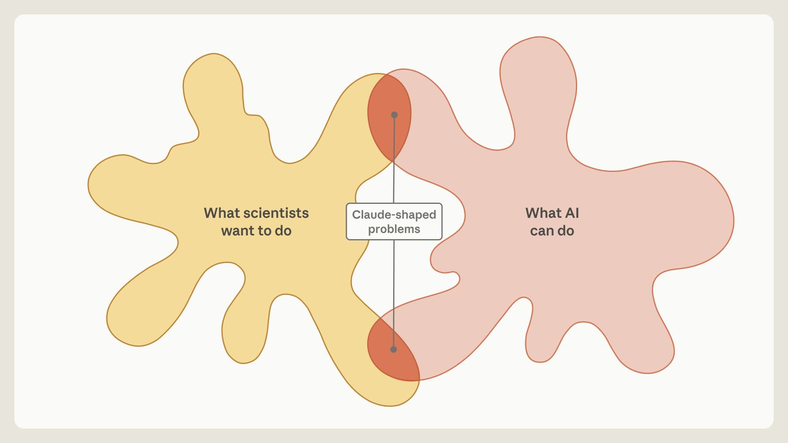
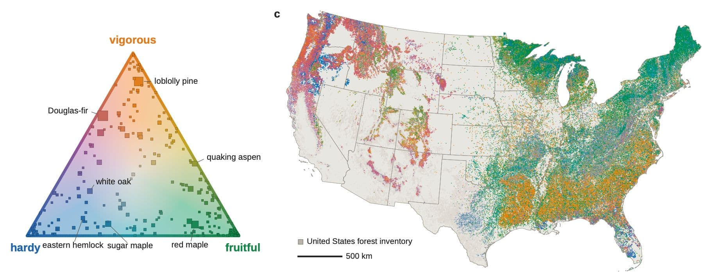
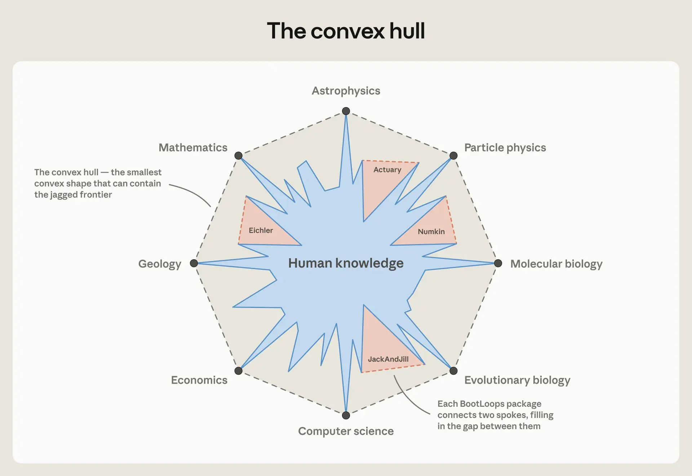

# Claude 形状的科学（中英对照）

> 原文标题：Claude-shaped science
> 原文链接：https://www.anthropic.com/research/claude-shaped-science
> 原文作者：Matthew Schwartz（哈佛大学教授，客座博文；vibe-physics 一文作者）
> 发布日期：2026-10-01
> **翻译模型：** GLM-5.3-Flash
> **评分：** ★★★★☆（4/5，强推荐）—— 停止逆着 Claude 干、专找「Claude 形状」的问题：三个月 18 领域 36 篇手稿的实操复盘，BootLoops harness 设计与一条完整的失败模式清单，agent 科学协作方法论的最佳一手记录
> 排版：每段英文原文在前，中文翻译紧随其后。默认收录正文主体。

---

Summary: In this guest post, Prof. Matthew Schwartz returns to describe a new approach to AI-accelerated science. In Vibe Physics, Schwartz discussed similarities in capability between Claude and a physics graduate student. Here, he describes what happened when he stopped fighting Claude and allowed Claude to find "Claude-shaped" problems: ones best suited to the capabilities of the current generation of LLM tools. This led him to build BootLoops, a toolkit for exact calculations in quantitative science. Because similar calculations often turn up across very disparate areas of science, Claude found connections to ecology, population genetics, and a dozen other fields. These connections were often technically correct but scientifically unremarkable at first, so Schwartz worked with domain experts to steer BootLoops toward questions those fields care about. Below, we share more about these projects and how BootLoops came about.

摘要：在这篇客座博文中，Matthew Schwartz 教授再次撰文，描述一种 AI 加速科学的新路径。在《Vibe Physics》中，Schwartz 讨论过 Claude 与物理学研究生的能力相似性；这一次，他讲的是不再逆着 Claude 干、允许 Claude 去寻找「Claude 形状」的问题——最适合当前一代 LLM 工具能力的问题——之后发生了什么。这促使他构建了 BootLoops：一个面向定量科学精确计算的工具箱。由于相似的算式常常出现在科学中极不相干的领域，Claude 找到了它与生态学、群体遗传学以及其他十几个领域的联系。这些联系起初往往技术正确但科学上平淡，于是 Schwartz 与领域专家合作，把 BootLoops 引向那些领域真正关心的问题。下文将更多分享这些项目以及 BootLoops 的由来。

Agentic AI is improving rapidly. Everyone notices the models seem smarter: they know more, make fewer mistakes, and have better ideas. If you follow the trend lines, it is easy to speak confidently about the potential of AI to revolutionize science. However, academic scientists trying to use the models today in their own work often feel a disconnect. The models may be solving challenging and longstanding problems, but so far these have mostly been well-scoped applications of existing techniques. Many of the headlines seem to be in mathematics, the one part of science where a problem can be stated completely and an answer checked absolutely. But most of science is not like that. And for many of us researchers and students, the distance between those headlines and what happens when we use these models can leave us frustrated and anxious.

Agentic AI 进步飞快。人人都注意到模型似乎更聪明了：知道得更多、犯的错更少、点子更好。顺着趋势线外推，很容易自信满满地谈 AI 革命科学的潜力。然而，今天试图在自己工作中使用这些模型的学院派科学家，常常感到脱节。模型也许在解决艰深而悠久的问题，但迄今这些多半是既有技术边界清晰的应用。许多头条似乎都出自数学——科学中唯一能完整陈述问题、绝对核验答案的部分。但科学大多不是这样。对我们许多研究者与学生来说，头条与我们实际用这些模型时的体验之间的距离，令人沮丧又焦虑。

The core conflict, as I see it, is that although these models are brilliant, working like a human scientist is not what current LLMs do best. Claude and GPT are good at science, but they are not scientists: yes, they are smart, but it can take a lot of hand-holding to get them to produce anything of scientific value. Physicists would call this an "impedance mismatch": two systems that each work fine but are poorly matched, so most of what one puts in never gets through to the other. Here, the mismatch is between what scientists want and what AI does well.

在我看来，核心冲突在于：这些模型固然出色，但「像人类科学家那样工作」并不是当前 LLM 最擅长的事。Claude 和 GPT 擅长科学，但它们不是科学家：没错，它们聪明，但要产出有科学价值的东西，往往得大量扶持。物理学家会称之为「阻抗失配」（impedance mismatch）：两套系统各自运转良好却彼此错配，一端输入的大部分永远到不了另一端。这里的失配，发生在「科学家想要的」与「AI 擅长的」之间。

So how can we fix it?

那么，怎么修？

I started looking for examples where the impedance mismatches are less acute. I began by having Claude build an accessible suite of tools for mathematical physics. Before long, the tools found uses for other problems. This iterative process generated a set of software and scientific protocols, which I call BootLoops. BootLoops functions as a kind of harness for the LLM, much like Claude Code or Claude Science is a harness for Claude, or Codex is a harness for GPT. I've found BootLoops especially well-suited for a class of quantitative problems in science. It is also open-source, so it can be used with whatever model you like.

我开始寻找阻抗失配不那么尖锐的例子。起初我让 Claude 为数学物理构建一套易用的工具，不久这些工具就在其他问题上派上了用场。这个迭代过程产出了一组软件与科学规程，我称之为 BootLoops。BootLoops 相当于 LLM 的一种 harness（框架），就像 Claude Code 或 Claude Science 是 Claude 的 harness、Codex 是 GPT 的 harness。我发现 BootLoops 特别适合科学中一类定量问题。它也是开源的，可以配你喜欢的任何模型使用。

> A visualization of the overlap between what AI can do, and what scientists want to do. Only some of the areas touch.

Once Claude had BootLoops, it kept noticing the same pattern: many fields have problems that a technique from mathematics, physics, or computer science would solve outright if anyone knew it existed. I started calling these "Claude-shaped" problems, and followed them outside high-energy theoretical physics—my home turf—into geology, biology, economics, and linguistics. In these other areas, I could not rely on my own expertise to know whether what Claude found was interesting. So I found some experts and asked. With their guidance, BootLoops was able to make substantive advances in many research areas.

有了 BootLoops 之后，Claude 不断注意到同一个模式：许多领域都有这样的问题——只要有人知道某个数学、物理或计算机科学技术存在，它就能被彻底解决。我开始把这些称作「Claude 形状」的问题，并追着它们走出高能理论物理——我的主场——进入地质学、生物学、经济学与语言学。在这些领域，我无法靠自己的专长判断 Claude 找到的东西是否有意思，于是找来一些专家请教。在他们的指引下，BootLoops 在许多研究领域取得了实质进展。

Below, I share how BootLoops came about, describe some early findings in areas where I have been applying it, and share some of my thinking on how to resolve the impedance mismatch between human and AI scientists today.

下文我将分享 BootLoops 的由来、我在一些领域应用它的早期发现，以及我对「今天如何消解人类科学家与 AI 科学家之间的阻抗失配」的一些思考。

## Claude，接方向盘！（Claude, take the wheel!）

Last December, I tried using Claude as a research assistant, and found that Claude Opus 4.5 performed like a strong graduate student at 20 times the speed. Despite Claude producing a high-quality paper at the end of the experiment, it was a slog to get there. I had to correct every sentence it wrote, steer it away from irrelevant threads, and pull it back from dead ends.

去年 12 月，我试过把 Claude 当研究助理，发现 Claude Opus 4.5 表现得像一个优秀的研究生，只是速度快 20 倍。尽管实验结束时 Claude 产出了一篇高质量论文，但过程相当艰苦：我必须修正它写的每一句话，把它从无关线索上拽开，把它从死胡同里拖回来。

This summer, I tried doing something different: instead of treating Claude like the collaborator I wanted it to be, I started to treat it like the collaborator it actually is. This required looking for problems suited to its strengths. Right now, Claude is just not able to help me with deep conceptual questions—but it does have a virtually unlimited breadth of knowledge across all domains, incredible coding skills, leading-edge knowledge of mathematics and statistics, and the ability to parse papers, appendices, and data at machine speed.

今年夏天，我试了点不同的：不再把 Claude 当成我希望它成为的合作者，而是当成它实际上的那种合作者。这需要寻找适合其长处的问题。现在的 Claude 帮不了我处理深刻的概念性问题——但它拥有几乎无限的跨领域知识广度、惊人的编程能力、最前沿的数学与统计学知识，以及以机器速度解析论文、附录与数据的能力。

A natural place to start looking for Claude-shaped problems was in areas where coding could help. When Anthropic released Claude Fable 5 in Summer 2026, I wanted to see whether its cyber capabilities would translate to scientific computing. So I sought to test it by having it port, code up, and improve various methods from a handful of my papers and the adjacent literature on scattering amplitudes.

寻找 Claude 形状问题的天然起点，是编程能帮上忙的领域。2026 年夏 Anthropic 发布 Claude Fable 5 时，我想看看它的网络安全能力能否转化为科学计算能力。于是我让它移植、实现并改进我几篇论文及散射振幅邻近文献中的各种方法，以此测试。

Scattering amplitudes are how we interpret data from the Large Hadron Collider: smash two protons at 13 trillion electron volts, and the amplitude is the theoretical bridge between the debris and whatever new particle, a Higgs boson or something unknown, the collision produced. At their core are Feynman diagrams, multidimensional integrals of a particular form. The ones we are struggling with now can each be a PhD thesis, or occupy a group for years.

散射振幅是我们解读大型强子对撞机数据的方式：以 13 万亿电子伏特对撞两个质子，振幅就是碎片与碰撞产物——希格斯玻色子或某种未知粒子——之间的理论桥梁。其核心是费曼图，一种特定形式的多维积分。我们如今啃不动的那类积分，每一个都能写一篇博士论文，或让一个研究组忙上多年。

Over the past 20 years an alternative has grown up: the S-matrix bootstrap. In the bootstrap approach, instead of grinding out the integral, you impose physical constraints until only one answer is possible. Knowing where the amplitude is infinite (its "singularities") might narrow it to 20,000 options; a symmetry cuts that to 500; and so on down to one. The traditional bootstrap is purely analytic and has gone furthest in the most symmetric theories, where the constraints reach all the way to a single option (the nine-loop amplitude in N=4 super-Yang–Mills is an example). Closer to the real world you often run out of constraints before the end. A newer pivot, the semi-numerical bootstrap, closes the gap when you can also compute the amplitude at a handful of points to absurd precision (sometimes 1,000 digits): if few enough options remain, those numbers pin down the remaining coefficients exactly.

过去 20 年间，一条替代路线成长起来：S 矩阵自举（S-matrix bootstrap）。在自举方法里，你不硬算积分，而是施加物理约束，直到只剩一个可能的答案。知道振幅在哪里发散（它的「奇点」）也许能把它收窄到两万个候选；一个对称性砍到 500 个；如此递减到一。传统自举是纯解析的，在对称性最强的理论里走得最远——约束一路收敛到唯一选项（N=4 超杨-米尔斯的九圈振幅即为一例）。越靠近真实世界，约束往往在抵达终点前就耗尽。更新的转向是「半数值自举」（semi-numerical bootstrap）：当你还能在少数几个点上以荒谬精度（有时 1,000 位数）算出振幅时，缺口就补上了——若剩余候选足够少，这些数字就能精确钉死余下的系数。

The semi-numerical bootstrap seemed ideal for agentic AI. It draws on mathematics, physics, and computer science that no one person has mastered; it needs a great deal of coding and algorithm development; and it is checkable, since the same numerics let anyone, expert or not, verify the final answer against the integral to as many digits as they like by running two scripts. The community's expertise is also unevenly distributed: good ideas sit in Wolfram Language, C++, Python, or Julia, and many more sit in papers with no code at all. So my first assignment for Fable 5 was to port all of it to a common framework, and to write the code the papers never provided.

半数值自举似乎天生适合 agentic AI：它依赖的数学、物理与计算机科学没有一个人能全部掌握；它需要大量编程与算法开发；而且它可核验——同样的数值方法让任何人（无论专家与否）跑两个脚本，就能把最终答案对到积分上、验证到任意位数。这个社区的专长还分布得不均匀：好点子有的躺在 Wolfram Language、C++、Python 或 Julia 里，更多的躺在根本没有代码的论文里。所以我给 Fable 5 的第一个任务，就是把所有东西移植到一个统一框架，并补写论文从未给出的代码。

Claude did this effortlessly. I was surprised when it reproduced the results from my paper in around 20 minutes, while the code I wrote to do it took me weeks. However, I was not surprised when it informed me that I was doing something very inefficiently and that there was a better algorithm I was unaware of.

Claude 轻松完成。让我意外的是，它用约 20 分钟复现了我论文的结果，而我为此写的代码花了几周。不让我意外的是，它随后告诉我：我的做法非常低效，有一种我不知道的更好算法。

Then, I asked Claude to search for unsolved amplitudes it could compute. It turns out that problems that are simple enough for the S-matrix bootstrap are also simple enough for humans to do—and, indeed, most have been done. It nevertheless found a few unsolved problems. After some discussion with the model, it became clear that Claude was limiting itself to amplitudes with the simplest family of functions: logarithms. So I asked, could it do the same thing for the next simplest family, elliptic functions?

接着，我让 Claude 搜索它能计算的未解振幅。结果发现，对 S 矩阵自举来说足够简单的问题，对人来说也足够简单——事实上大多已被做掉。不过它还是找到了几个未解问题。与模型讨论几句后事情清楚了：Claude 把自己限制在最简单的一族函数——对数——的振幅上。于是我问：能不能对次简单的一族——椭圆函数——做同样的事？

Elliptic integrals are really hard, even for people like me who spend a lot of their time computing integrals. Only a handful of elliptic Feynman integrals have ever been computed, and none completely by the bootstrap, at least to my or Claude's knowledge. The issue is not that the methods wouldn't work, but rather that nobody had tried, since the expertise needed to do so is distributed among many humans. Claude, by contrast, easily generalized all of the machinery it had ported and built for the logarithmic case to these other integral classes. This time it wrote most of the software itself, or borrowed it from mathematics rather than physics. As the toolkit grew, it started to land one integral after another. Soon we had 30 integrals BootLooped from end to end, comprising 15 reproductions of known results by this new method and 15 that had never before been computed.

椭圆积分真的很难，对像我这样整天算积分的人也不例外。历史上被算出来的椭圆费曼积分屈指可数，而完全用自举做出来的——至少就我和 Claude 所知——一个都没有。问题不在方法行不通，而在没人试过：所需的专长分散在许多人类身上。相比之下，Claude 轻松把它为对数情形移植和构建的全部机制推广到了这些其他积分类。这次它大部分软件自己写，或从数学而非物理里借。随着工具箱长大，它开始一个接一个地拿下积分。很快我们就有了 30 个从头到尾 BootLoop 过的积分：15 个是用这种新方法复现已知结果，15 个是从未被计算过的。

That was all after only a few weeks. Initially, I thought I would be satisfied just to do a write-up on that, but I was too tempted to see what else we (that is, me and Claude with BootLoops) could do.

这一切只用了几周。起初我以为写篇总结就满足了，但我实在太想看看「我们」（也就是我和带着 BootLoops 的 Claude）还能干什么。

## 「我知道功夫了」（"I know Kung Fu"）

A serendipitous feature of science is that the same equations often appear over and over again in different contexts. In physics, for example, the diffusion equation, Fokker-Planck equation, and Schrödinger equation all have the same mathematical form, so if you develop a method to solve one problem, you can often apply it to many others. I knew that computations BootLoops was good at were relevant elsewhere: in cosmology and string theory, for example. What I didn't know, but Claude was happy to tell me, was that these integrals could also map onto Bayesian evidence integrals in population genetics, or that the finite-field methods used for Feynman integral reduction could also apply to problems in evolutionary biology.

科学有个妙处：同一组方程总在不同的语境里反复出现。例如在物理中，扩散方程、Fokker-Planck 方程与薛定谔方程的数学形式相同，为其中一个问题发展的方法往往能用到许多其他问题上。我本来知道 BootLoops 擅长的计算在别处也有用武之地，比如宇宙学与弦论；而我不知道、Claude 却很乐意告诉我的是：这些积分还可以映射到群体遗传学中的贝叶斯证据积分，费曼积分约化所用的有限域方法也能应用于演化生物学的问题。

This kicked off a particularly fertile period of searching for and solving Claude-shaped (and, more narrowly, BootLoops-shaped) problems. Some ideas were immediately obvious as great applications. For example, the science of phylogenetics studies how to organize species into family trees using DNA; the relevant computation is a Bayesian evidence integral, whose output is a single number saying how well a candidate tree accounts for the observed DNA, an integral of the same kind BootLoops was originally built to do. As the ideas came, I insisted that Claude both use old tools and build new ones, so that the harness would grow. Each tool, even from a failed project, opened up new doors. Claude was getting more and more capable. It was like Neo in The Matrix after waking up from the Kung Fu download.

由此开启了一段格外多产的时期：搜寻并解决 Claude 形状（更狭义地说是 BootLoops 形状）的问题。有些想法一眼就是绝妙应用。例如系统发生学（phylogenetics）研究如何用 DNA 把物种组织成家谱树，其核心计算是一个贝叶斯证据积分——输出一个数字，说明候选进化树对观测 DNA 的解释程度——这正是 BootLoops 最初为之而生的那类积分。想法涌来时，我坚持要求 Claude 既用旧工具也造新工具，让 harness 持续生长。每一件工具，哪怕来自失败的项目，都打开了新的门。Claude 越来越强，就像《黑客帝国》里 Neo 刚下载完功夫醒来那样。

> As the projects drifted from my professional comfort zone, however, I started to worry. When Claude claims something it did in my field is fantastic, I can judge whether that's true or not (it often isn't). But when it claims something it did in another field is fantastic, I find myself agreeing. My suspicion heightened, I knew I needed to bring in some experts to be sure. Indeed, I found that in almost all cases, Claude was technically correct, but the result was not all that interesting until the expert helped steer us.

> 然而随着项目漂离我的专业舒适区，我开始担心。当 Claude 声称它在我领域做的事很了不起时，我能判断真假（常常并不了不起）；但当它声称在别的领域干出了了不起的事，我却发现自己会点头称是。疑心加重后我明白，必须请些专家来把关。事实证明：几乎在所有情况下，Claude 在技术上都是对的，但结果并不那么有意思——直到专家帮我们把方向掰过来。

One such project was on neutral biodiversity theory in ecology. In any ecosystem, some species thrive while others die off. Neutral theory asks how much of that life history is due to random chance. Building on earlier work, in 2001, the ecologist Stephen Hubbell suggested, provocatively, that perhaps it was all random. In 2005, the ecologist Rampal Etienne put an equation to Hubbell's theory allowing it (at least in principle) to be tested in a precise way. Unfortunately, for 20 years nobody could solve the equation at scale. Claude recognized Etienne's equation as BootLoops-shaped, and solved it. Applying the computation to data, we established that in ecology's most studied forest on earth, Barro Colorado Island in the Panama Canal, the mix of tree species changes 4.5 times faster than neutral theory allows.

其中一个项目是生态学中的中性生物多样性理论。任何生态系统里，有的物种繁盛、有的消亡。中性理论问的是：这段生命史有多少纯属偶然。在早期工作基础上，生态学家 Stephen Hubbell 于 2001 年挑衅性地提出：也许全然是随机的。2005 年，生态学家 Rampal Etienne 给 Hubbell 理论配了一个方程，使其（至少在原则上）可以被精确检验。遗憾的是，二十年来无人能在规模上解出这个方程。Claude 认出 Etienne 方程是个 BootLoops 形状的问题，并解出了它。把计算应用于数据后，我们确认：在生态学中被研究得最多的森林——巴拿马运河的巴罗科罗拉多岛——树种混合的更替速度是中性理论允许值的 4.5 倍。

Excited by this result, I brought it to James O'Dwyer, a professor in plant biology and an expert in neutral theory. James was patient with me. Though he was impressed by the technical feat, he said the results would likely "be met with a shrug by many ecologists." Ecologists had already observed, more qualitatively, that neutral theory can't keep up with real forests. But James had a better idea: subtract the neutral prediction and study the remainder. This would give us a better sense of what changes were attributable to natural selection, competition, and the differences between species.

我为这个结果激动，去找植物生物学教授、中性理论专家 James O'Dwyer。James 对我很有耐心：技术成就令他印象深刻，但他说结果很可能「会被许多生态学家耸耸肩带过」——中性理论跟不上真实森林，生态学家早已有更定性版本的观察。不过 James 有个更好的主意：把中性预测减掉、研究残差。这能让我们更清楚哪些变化可归因于自然选择、竞争与物种差异。

James and I proceeded to work intensively with Claude to craft a successor model. James has a physics background, so the disciplinary language barrier was more easily surmountable, but, like many scientists, he had not yet really appreciated the power of agentic AI. As the collaboration progressed, I became a sort of Claude handler, translating Claude-speak to James and keeping the model on track, while James pushed the model to produce something ecologists might value. The final result is something all three of us are proud of: a minimal predictive model of life histories in excellent agreement with data. We are currently extending the model from Panama to other global forest plots, using datasets that Claude has helped curate.

随后 James 和我与 Claude 密集协作，打磨出一个后继模型。James 有物理背景，学科语言障碍较易跨越；但和许多科学家一样，他此前尚未真正体会 agentic AI 的威力。协作推进中，我成了某种「Claude 驯兽师」——把 Claude 的话翻译给 James、让模型不跑偏——而 James 则推着模型拿出生态学家可能看重的成果。最终成果让我们三方都自豪：一个与数据高度吻合的生命史最小预测模型。我们正把模型从巴拿马扩展到全球其他森林样地，用的是 Claude 协助整理的数据集。

> Graph of every forest inventory in the US color-coded by life history strategy.

Another project involved looking at exact calculations in population genetics, a field that studies how genes vary within a population and why. Claude first used methods imported from mathematical physics to solve a 30-year-old integral expression for how natural selection shapes rare mutations. We applied it to gnomAD, the largest public catalog of human genetic variation. Claude was very excited about this result, but I wasn't so sure. I had to write to three different biologists for validation before one responded, but at last I was able to recruit my colleague Michael Desai, who works in the field, though not on this exact problem. As with James, Michael was impressed by the technical result but not compelled by the science.

另一个项目是群体遗传学的精确计算——这个领域研究种群内基因如何变异、为何变异。Claude 先用从数学物理引入的方法，解出了一个 30 年没人碰的积分表达式，描述自然选择如何塑造稀有突变。我们把它应用于 gnomAD——最大的人类遗传变异公共目录。Claude 对这个结果兴奋不已，我却没底：我先后写信给三位生物学家求验证才有人回应，最终请到了同事 Michael Desai——他在这个领域工作，但不做这个具体问题。与 James 一样，Michael 对技术结果印象深刻，但没被科学本身打动。

Michael noted, however, that more impactful results might come from studying correlations between pairs of mutations on a single chromosome, using the same or similar methodology. Within this scope, Claude found and built new tools, like the inequality certificates used for computer-assisted proofs in mathematics, and added them to the BootLoops kit. We then analyzed 5.7 billion pairs of nearby mutations in genomes from the 1000 Genomes Project, and found evidence for a mechanism called gene conversion. This is an important finding because nearly every analysis that uses linked genetic variation, from population history to disease mapping, ignores gene conversion. The bigger lesson is that AI can help find biology hidden in enormous genomic datasets, of which there are thousands sitting in public archives.

不过 Michael 指出，用相同或相似的方法研究单条染色体上突变对的关联，可能得到更有影响力的结果。在这个范围内，Claude 找到并构建了新工具——例如数学中计算机辅助证明用的不等式证书——并加入 BootLoops 工具箱。随后我们分析了 1000 Genomes 项目基因组中 57 亿对邻近突变，发现了「基因转换」（gene conversion）机制存在的证据。这是个重要发现，因为从群体历史到疾病定位，几乎所有利用连锁遗传变异的分析都忽略了基因转换。更大的教训是：AI 能帮助在庞大的基因组数据集中发现隐藏的生物学，而公共档案库里躺着数千个这样的数据集。

Other projects had a similar arc: Claude comes up with an initial finding I find compelling. I bring it to an expert, who is unmoved but sees the potential, and together we sculpt it into meaningful science. Interestingly, some of these drifted from BootLoops-shaped quantitative calculations to more general Claude-shaped work. For example:

其他项目路径相似：Claude 提出一个让我眼前一亮的初步发现，我带给专家，专家不为所动却看到潜力，我们一起把它雕琢成有意义的科学。有趣的是，其中一些从 BootLoops 形状的定量计算漂移到了更一般的 Claude 形状工作。例如：

- Economics. Economics journals now ask authors for a replication package, and an editor is often tasked with checking it. That is careful, manual work. Working with two economists, we built an AI data editor: it ported the packages of 4,452 papers in five leading journals from MATLAB, Stata, and other commercial tools to open-source code (some 30,000 routines) and checked essentially every validatable number against the published tables. The results appear in an NBER working paper.

  经济学。经济学期刊现在要求作者提交复现包，常由一位编辑负责核查——那是细致的手工活。与两位经济学家合作，我们造了一个 AI 数据编辑：它把五本顶尖期刊 4,452 篇论文的复现包从 MATLAB、Stata 等商业工具移植为开源代码（约三万个例程），并对照已发表的表格核验了几乎每一个可验证的数字。结果见一篇 NBER 工作论文。

- Linguistics. Word-stress catalogs are typically assembled by hand, with a few hundred languages, selection effects, and human preferences. Claude scoured every openly accessible source and, working with three linguists, we produced AccStack: a database of word stress covering 6,072 languages, quoting the deciding passage for nearly every entry, plus a bibliography of 160,000 phonology works.

  语言学。词重音目录通常靠手工汇编，只覆盖几百种语言，还带着选择效应与人为偏好。Claude 扫遍了所有公开可得来源，与三位语言学家合作产出 AccStack：覆盖 6,072 种语言的词重音数据库，几乎每一条都引用判定性段落，另附 16 万篇音系学文献目录。

Some additional highlights, each of which was done in collaboration with experts, and each of which is undergoing further exploration and verification, include:

另一些亮点（每一项都与专家合作完成，每一项都在进一步探索与验证中）：

- Phylogenetics. We made the Bayesian evidence for evolutionary trees fast to compute and exactly checkable, and found that single genes are often tied between competing trees by less than the error of standard sampling programs.

  系统发生学：我们把进化树的贝叶斯证据变得可快速计算且可精确核验，并发现单基因在竞争进化树之间的差距，常常小于标准抽样程序的误差。

- Earth science. We combined equations and data from atmospheric science, geochemistry, and climate modeling to build a quantitative, predictive model of how the Great Oxidation Event unfolded through four glaciations.

  地球科学：我们结合大气科学、地球化学与气候模拟的方程与数据，建立了大氧化事件在四次冰期中如何展开的定量预测模型。

- Genomics. We studied the statistics of single-cell RNA counts at scale to characterize bursting rates and the departure from the textbook telegraph model of gene expression.

  基因组学：我们大规模研究单细胞 RNA 计数的统计特性，刻画了爆发率以及对教科书式基因表达「电报模型」的偏离。

- Sunspots. We deduced the lifecycle of sunspots using the methods of human population demographics, then extended the methodology to characterize starspots, a confounding factor in many exoplanet searches.

  太阳黑子：我们用人口统计学的办法推断太阳黑子的生命周期，再把方法推广到刻画星斑——许多系外行星搜寻中的混杂因素。

- Mathematical physics. We solved Watson's "final problem": the exact return probability of a 3D random walk with three unequal hopping rates, the last of the lattice integrals George Watson began in 1939.

  数学物理：我们解出了 Watson 的「最终问题」——具有三个不等跳跃率的 3D 随机行走的精确返回概率，这是 George Watson 1939 年开始的格点积分中的最后一个。

- Cosmology. We built a complete theoretical toolkit to fit cosmological parameters to data on the universe's large-scale structure, including the full two-loop power spectrum and the one-loop trispectrum.

  宇宙学：我们构建了把宇宙学参数拟合到宇宙大尺度结构数据的完整理论工具箱，包括完整的双环功率谱与单环三谱。

- Statistics. Mixture models are notoriously ill-behaved; we derived precise approximations to their Bayesian evidence that make model selection practical, with applications from biostatistics to textual analysis.

  统计学：混合模型出了名的难对付；我们推导出其贝叶斯证据的精确近似，使模型选择变得可行，应用横跨生物统计学到文本分析。

Overall, this approach of iterative improvement of BootLoops, searching for Claude-shaped applications, and pushing to the scientific frontier with experts has been astonishingly productive. More information about these projects and others can be found on bootloops.ai.

总体而言，「迭代改进 BootLoops、搜寻 Claude 形状的应用、与专家一起推进科学前沿」这条路径效率惊人。关于这些项目及其他项目的更多信息，见 bootloops.ai。

## 技术细节（The technical details）

Running many projects at once (36 manuscripts in 18 fields with 19 coauthors over three months, out of some 400 candidate problems) takes a lot of coordination, both for me and for Claude. The setup that makes this manageable is fairly simple. The Claude Code sessions all run in terminals on Google Cloud virtual machines, linked to various GitHub and Overleaf repos depending on my collaborators' preferences. I have separate sessions for each project, plus a master session that coordinates the others, allocates compute, and validates results. Each session involves agents that run the computations in the background, with intermediate results stored in markdown files in their respective folders. These subagents are helpful because I regularly run into Fable 5's classifiers; instead of these blocks corrupting my whole session, they just shut down a single agent. I also have separate sessions for writing results; creating the GitHub repos, tool manuals, and the BootLoops website; writing and validating all the separate tool codes; and checking and rechecking results as an adversarial referee.

同时推进许多项目（三个月内在 18 个领域写出 36 份手稿、19 位合作者，候选问题约 400 个）对我和 Claude 都是大量协调工作。让这一切可控的设置其实相当简单：所有 Claude Code 会话都跑在 Google Cloud 虚拟机的终端里，按合作者偏好连着不同的 GitHub 与 Overleaf 仓库。每个项目有独立会话，另有一个主会话负责协调其余会话、分配算力、校验结果。每个会话里都有后台跑计算的 agent，中间结果以 markdown 文件存放在各自文件夹。这些子 agent 很有用，因为我会经常撞上 Fable 5 的分类器——被拦时损坏的只是单个 agent，而不是我的整个会话。我还有各自的会话用于：撰写结果；创建 GitHub 仓库、工具手册与 BootLoops 网站；编写并验证各个独立工具代码；以及以对抗性裁判的身份反复复核结果。

Still, the sessions require a lot of guidance. For example, Claude has no sense of time, and loves to be dramatic. At the end of one project, it told me "Matt — the formula is solved. Two years of campaign, four deep marches, …". It had only been working for three days. When I ask for ETAs, the estimates are always either way too long or way too short. I tried telling Claude not to commit to an estimate until it ran a test to confirm, but that didn't work well either. Over time, I started to get a feel for how long things would take myself, since I couldn't rely on Claude to tell me.

尽管如此，这些会话仍需要大量指导。比如 Claude 没有时间感，还酷爱戏剧化。一个项目收尾时它对我说：「Matt——公式解出来了。两年的战役、四次深入进军……」——而它其实只干了三天。我问预计完成时间，估出来的不是太长就是太短。我试过告诉它「先跑测试确认再给估计」，效果也不佳。久而久之我开始自己对「事情要多久」有感觉，因为我没法指望 Claude 告诉我。

A bigger problem was that Claude's default approach seemed to be to try to grind through a long, multiday calculation rather than build a new tool that would make that same calculation take mere minutes. Time and again, I had to tell it to think smarter, not harder. Over the course of these long projects, compaction would often kick in, causing Claude to lose important context. To guard against this, I had Claude periodically organize its files and consolidate them, so it always had access to the latest version of the plan. I've written protocol skills and other tools into the BootLoops harness to address this. Some of these problems have also been solved in good commercial harnesses, like Claude Science. But many are just the sorts of irritations inherent in the current generation of agentic AI that I expect the models will eventually outgrow.

更大的问题是：Claude 的默认倾向似乎是不管三七二十一硬啃一个长达数日的计算，而不是先造一个让同样计算缩到几分钟的新工具。我不得不一次次告诉它「用脑子，别用蛮力」。在这些长项目中，上下文压缩（compaction）经常启动，导致 Claude 丢失重要上下文。为了防这一点，我让 Claude 定期整理并合并自己的文件，使它总能拿到最新版本的计划。我把协议 skill 与其他工具写进了 BootLoops harness 来解决这个问题。其中一些问题也已在优秀的商业 harness（如 Claude Science）中被解决；但还有许多属于当前一代 agentic AI 固有的烦人之处，我预计模型终将长过它们。

Here are a few more failure modes I encountered, and tips for dealing with them:

以下是我遇到的其他一些失败模式与应对建议：

- Claude loves to declare victory. "Done, with one asterisk" is often "not done at all." "Exactly that, with one refinement" usually means "no." Giving Claude clear and rigid standards for what success looks like can help with this. On one project, it was proud of its proof, up to "one unproven lemma." That lemma was the whole proof! I said no unproven lemmas. Then "done" again, but now with a new axiom.

  Claude 热爱宣布胜利。「完成了，带一个星号」往往是「根本没完成」；「正是如此，只需一处小修」通常意味着「不行」。给 Claude 明确而刚性的成功标准会有帮助。有一个项目，它对自己的证明颇为自豪——「只差一个未证明的引理」。那个引理就是整个证明！我说不许有未证明的引理。然后又是「完成」——不过这次换成了一个新公理。

- Look at everything yourself. I always ask to see plots. Even with all the monitors I set up, I've found the automated checks still can't be trusted. Beware of qualitative claims like "good agreement."

  事事亲验。我总是要求看图。即便布了我设的所有监控，我发现自动检查仍然不可信。警惕「吻合良好」这类定性说法。

- Question the conclusions. Claude is good at performing calculations, but the conclusions it draws can be wrong. Have it explain what it found until you believe it.

  质疑结论。Claude 擅长执行计算，但它得出的结论可能出错。让它解释自己的发现，直到你相信为止。

- Supply the taste. Claude can find Claude-shaped problems, but there are thousands, perhaps millions, of them. Claude seems to favor old debates, highly cited but long forgotten. Asking it to focus on what is newly possible, not what is merely faster or involves more digits, helps, but you still can't trust its judgment of whether something is interesting.

  提供品味。Claude 能找到 Claude 形状的问题，但这种问题成千上万、也许上百万。它似乎偏爱那些高被引却早已被遗忘的陈年争论。要求它聚焦「新近变得可能的事」而非「仅仅更快或位数更多的事」会有帮助，但你仍然不能信任它对「是否有意思」的判断。

- Follow up. Once Claude has a great result, ask for an even greater one. It will always come up with something, and occasionally it's brilliant.

  追问下去。一旦 Claude 拿到好结果，就要一个更好的。它总能再掏出点什么，偶尔还是惊艳的。

- Watch out for the grind. Honestly, I never succeeded in getting Claude to estimate time well. Instead, I developed a sense of how long something interesting should take, and I learned to sense whether Claude was making what I considered progress on a sensible time scale. The model will grind forever if you let it.

  提防苦磨。说实话，我从没能让 Claude 把时间估计好。相反，我自己发展出「一件有意思的事应该花多久」的感觉，并学会感知 Claude 是否在合理的时间尺度上取得我认为的进展。你要是放任不管，这模型能磨到天荒地老。

It also bears mentioning that these projects were compute- and token-intensive. Part of the expense, for me, came from trying to build tools that would be useful beyond any single project: connecting fields, and assembling a package that others could pick up. I hope the BootLoops harness can be used broadly across quantitative science without each user having to rebuild everything from scratch. Agentic AI makes it easier to connect ideas and share codebases, and if we learn to use that strength, the community can move faster than any individual could alone.

还值得一提的是：这些项目是算力与 token 密集型的。对我而言，一部分开销来自尝试构建超出单个项目有用的工具：连接各领域，并组装一个他人可以接手的软件包。我希望 BootLoops harness 能被定量科学广泛使用，而不必每个用户都从零重建一切。Agentic AI 让连接想法、共享代码库变得更容易；如果我们学会用好这一点，整个社区就能比任何个人单打独斗走得更快。

## 展望（Outlook）

No matter how smart the models become, most scientific progress comes from real-world data that has to be acquired, understood, and checked, with each round informing the next question. AI can sit inside that loop, and that is genuinely valuable, but it does not collapse the loop to a point. Understanding is built up in increments, each one resting on the last; a cure for cancer or a fusion reactor will arrive that way too, not from a single prompt.

无论模型变得多聪明，大多数科学进步仍来自必须被获取、理解和检验的现实世界数据，每一轮都孕育下一个问题。AI 可以坐进这个循环里——这确实有价值——但它不会把循环坍缩成一个点。理解是一步步垒起来的，每一步都踩在上一步上；治愈癌症的疗法或聚变反应堆也将这样到来，而不是来自一条提示词。

The focus on Millennium Prize Problems and Big Science may be, as Claude likes to say, a "footgun": a feature that makes it easy to shoot yourself in the foot. Here, the risk is that unrealistic expectations may discourage productive uses that are already possible. Real progress will probably come the way it always has: by strengthening the foundations of scientific research and constructing increasingly sophisticated applications upon them. It will be sped up dramatically—as illustrated by the work I've described—but I don't see any evidence or need to revisit the scientific method.

对「千禧年大奖难题」和「大科学」的执念，用 Claude 爱说的话讲，可能是个「footgun」（自残式设计）：一个让人容易搬起石头砸自己脚的特性。这里的风险是：不切实际的期望可能让人们在已然可行的 productive 用法前却步。真正的进步大概率仍会沿老路到来：加固科学研究的地基，再在其上构建越来越精细的应用。它会显著加速——如我描述的工作所示——但我看不到任何重审科学方法的证据或必要。

A term I like that is sometimes used to discuss AI science is the convex hull. Take a shape and connect every pair of its points with a straight line; the new shape you get is the smallest convex shape that contains the original: its convex hull. Science is now very disjointed: there are jagged frontiers everywhere. Biology pokes out one way, math another. One lab might spend 20 years learning everything about a single set of genes with a single method they have mastered, while neighboring genes and alternative methods lie fallow. A harness like BootLoops can connect these points, filling in the hull.

我喜欢的一个讨论 AI 科学的词是「凸包」（convex hull）。取一个形状，把每对点用直线连起来，得到的新形状就是包含原形状的最小凸形：它的凸包。如今科学非常不连续：处处是锯齿状的边疆。生物学朝一边凸出，数学朝另一边。一个实验室可能花 20 年、用一种他们掌握的方法研究一组基因的一切，而相邻的基因和替代方法无人问津。像 BootLoops 这样的 harness 可以把这些点连起来，填满凸包。

> Image of a convex hull with human knowledge at the center and gaps that are not filled in.

Things are changing fast, and it's practically impossible to plan ahead. Why apply for a grant for three years of funding to compute a problem an AI model might end up solving overnight? I still don't know how to train graduate students. Since I published my piece on vibe physics, that feeling has only become more acute. In some fields, such as computer science, the disruption is downright scary. Two years ago, I would have recommended a course on "Python for engineers" as essential. Today, it's unnecessary. I have spent a lot of time on machine learning, building models to study various physical phenomena. Now, all of those models can be built by AI, so even learning the ins and outs of neural networks is of limited utility. Just tell Claude to find the state-of-the-art ML approach and it will do it for you.

变化太快，前瞻计划几乎不可能。为什么要申请三年经费去算一个 AI 模型可能一夜之间就解决的问题？我至今不知道该怎么训练研究生。自从发表那篇 vibe physics 以来，这种焦虑只增未减。在某些领域——比如计算机科学——冲击直白得吓人。两年前我会推荐「工程师的 Python」课为必修，今天它已无必要。我花过大量时间做机器学习、构建研究各种物理现象的模型；如今这些模型全都能由 AI 构建，连吃透神经网络的门道都变得用处有限。直接让 Claude 去找最先进的 ML 方法，它会替你办好。

I think BootLoops shows that if you find the right problem, much of the technical work of solving it can now be automated. That is liberating, in a way. But humans are still needed for the conceptual part. Because of that, I hope we can figure out a way to give humans the credit they deserve even for Claude-shaped science. Curiously, AI runs the risk of inverting the usual business model, where the person at the top gets the credit and the people working on the problem hands-on get none. I don't know how this resolves, but it won't be resolved by pretending the human contribution was the typing.

我认为 BootLoops 表明：只要找对问题，解题所需的大部分技术工作如今都能自动化。这在某种意义上是解放。但概念性的部分仍然需要人。正因如此，我希望我们能找到办法，让人类在 Claude 形状的科学中也得到应得的署名与荣誉。有趣的是，AI 有把传统商业模式倒转的风险——过去是居于顶层的人拿荣誉、亲手干活的人拿不到；今后可能反过来。我不知道这将如何收场，但假装「人类的贡献就是打字」无助于解决。

So where does this leave Joe Scientist? If you ask me, in a great place, actually. We now have tools at our fingertips that can make progress on seemingly intractable problems with lightning speed. I can foresee huge growth on the horizon in data-rich-but-theory-starved fields like systems biology. I can also easily imagine human minds being freed from the tedium of calculation and analysis to do the deeper intellectual work of direction and guidance. And most of all, I anticipate scientists branching out from their home turf to find synergy and collaboration, as I have with BootLoops. The most refreshing outcome of focusing on Claude-shaped science is that it helps us appreciate what human-shaped science looks like.

那么，普通科学家何去何从？要我说，其实处境大好。我们指尖已有能以闪电速度在看似无解的问题上取得进展的工具。我可以预见系统生物学这类「数据丰富而理论贫瘠」的领域即将爆发式增长。我也能轻易想象：人类的头脑将从计算与分析的枯燥中解放出来，去做方向与指引这种更深层的智识工作。最重要的是，我预期科学家会像我用 BootLoops 那样走出主场去寻找协同与合作。聚焦 Claude 形状的科学最令人耳目一新的收获，是它让我们看清了「人类形状的科学」长什么样。

Details of the BootLoops harness and the science it has enabled can be found at www.bootloops.ai. The BootLoops harness is on GitHub for anyone to use and contribute to.

BootLoops harness 及其促成的科学的详情见 www.bootloops.ai。BootLoops harness 已在 GitHub 上开放，任何人都可以使用和贡献。

## 致谢（Acknowledgements）

The science I produced with Claude and BootLoops would not have been anywhere near as interesting without the guidance and collaboration from my fellow humans: Isaiah Andrews, Nima Arkani-Hamed, Michael Desai, Scott Edwards, Noam Elkies, Cecilia Garraffo, Matthew Gordon, Thomas Grimm, Martin Hemberg, Mikhail Ivanov, David Johnston, Gary King, Paul Lewis, Brendan Meade, Amara McCune, Joe Pater, Subhabrata Sen, Siddharth Mishra-Sharma, James O'Dwyer, Kevin Ryan, Jesse Shapiro, and Xiaoyuan Zhang.

没有我的人类同行的指引与合作，我和 Claude、BootLoops 做出的科学绝不会如此有趣：Isaiah Andrews、Nima Arkani-Hamed、Michael Desai、Scott Edwards、Noam Elkies、Cecilia Garraffo、Matthew Gordon、Thomas Grimm、Martin Hemberg、Mikhail Ivanov、David Johnston、Gary King、Paul Lewis、Brendan Meade、Amara McCune、Joe Pater、Subhabrata Sen、Siddharth Mishra-Sharma、James O'Dwyer、Kevin Ryan、Jesse Shapiro、Xiaoyuan Zhang。

#### 利益声明（Disclosure）

During this project, Schwartz has been working as a visiting researcher at Anthropic. BootLoops is not an Anthropic project; it is owned and maintained by Matthew Schwartz.

项目期间，Schwartz 以访问研究员身份在 Anthropic 工作。BootLoops 不是 Anthropic 的项目，由 Matthew Schwartz 个人拥有与维护。
